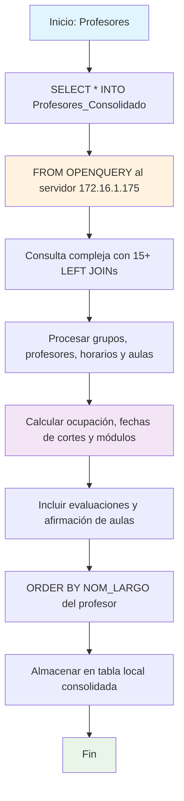

### Profesores

Procedimiento que extrae y consolida información completa de profesores y grupos académicos desde un servidor remoto (172.16.1.175) mediante OPENQUERY. Procesa datos complejos de docentes, horarios, aulas, grupos, notas y evaluaciones, almacenando el resultado en una tabla local consolidada.

#### Diagrama de flujo


#### Procedimiento almacenado
```sql
CREATE PROCEDURE [Dev].[Profesores]
AS
BEGIN
SELECT _
INTO REGISTRO_CALIFICADO.[dev].[Profesores_Consolidado]
FROM OPENQUERY([172.16.1.175], '
SELECT grp.COD_PERIODO,
PEN.NUM_NIVEL,
GRP.COD_UNIDAD,
uni.nom_unidad,
GRP.COD_PENSUM,
PEN.COD_MATERIA,
PEN.NOM_MATERIA,
PEN.UNI_TEORICA "CREDITOS",
GRP.ID_GRUPO,
GRP.NUM_GRUPO,
ROUND((GRP.NUM_INSCRITOS _ 100 / NULLIF(GRP.NUM_CUPO,0)), 1) AS "PORCENTAJE OCUPACION AULA",
GRP.NUM_CUPO AS capacidad,
GRP.NUM_INSCRITOS,
GRP.Ind_Moodle AS check_moodle,
(SELECT UNIQUE(''SI'')
FROM SRC_DOC_GRUPO D
WHERE D.IND_MOODLE = 1
AND D.ID_GRUPO IN (SELECT HG.ID_GRUPO
FROM SRC_GRUPO HG
WHERE GRP.ID_GRUPO = HG.ID_GRUPO
AND HG.COD_PERIODO = grp.COD_PERIODO)) AS check_docente,
TER.NUM_IDENTIFICACION,
TER.NOM_LARGO,
ter.dir_email AS "CORREO INSTITUCIONAL",
TO_CHAR(GRP.FEC_INI_PROGRAMACION, ''DD/MM/YYYY'') AS FEC_INICIO_GRUPO,
TO_CHAR(GRP.FEC_FIN_PROGRAMACION, ''DD/MM/YYYY'') AS FEC_FINN_GRUPO,
SED.ID_SEDE,
SED.NOM_SEDE AS sede,
REG.ID_SECCIONAL AS ID_REGIONAL,
REG.NOM_SECCIONAL AS NOM_REGIONAL,
horario.dia,
horario.hora_inicial,
horario.hora_final,
horario.id_aula,
(SELECT UNIQUE(s.nom_aula)
FROM src_aula s
WHERE s.id_aula = horario.id_aula) AS NOM_AULA,
AUL.NUM_CAPACIDAD,
BLO.NOM_BLOQUE,
DECODE((SELECT TM.ID_MODULO
FROM sinu.SRC_MODULO_MODPER TM
INNER JOIN SINU.SRC_MODULO M
ON M.ID_MODULO = TM.ID_MODULO
WHERE TM.ID_MODULO_MODPER = GRP.id_modulo_modper),
''3'', ''PRIMER BLOQUE'',
''1'', ''SEGUNDO BLOQUE'',
''2'', ''TERCER BLOQUE'',
''BLOQUE UNICO'') AS MODULO,
(SELECT N.FEC_ENT_NOTAS
FROM SRC_NOT_GRUPO N
WHERE N.NOM_NOT_GRUPO = ''PRIMER CORTE''
AND N.NUM_NOTA = 1
AND N.ID_GRUPO = GRP.ID_GRUPO) AS "PRIMER CORTE",
(SELECT N.FEC_ENT_NOTAS
FROM SRC_NOT_GRUPO N
WHERE N.NOM_NOT_GRUPO = ''SEGUNDO CORTE''
AND N.NUM_NOTA = 2
AND N.ID_GRUPO = GRP.ID_GRUPO) AS "SEGUNDO CORTE",
(SELECT N.FEC_ENT_NOTAS
FROM SRC_NOT_GRUPO N
WHERE N.NOM_NOT_GRUPO = ''TERCER CORTE''
AND N.NUM_NOTA = 3
AND N.ID_GRUPO = GRP.ID_GRUPO) AS "TERCER CORTE",
(SELECT N.FEC_ENT_NOTAS
FROM SRC_NOT_GRUPO N
WHERE N.NOM_NOT_GRUPO = ''NOTA UNICA''
AND N.NUM_NOTA = 1
AND N.ID_GRUPO = GRP.ID_GRUPO) AS "NOTA UNICA",
BLO1.NOM_SEDE,
JON.NOM_JORNADA AS "JORNADA",
dep.nom_dependencia AS "DEPENDENCIA",
(SELECT UNIQUE(''SI'')
FROM SRC_HOR_GRUPO H
WHERE H.ID_AULA IS NOT NULL
AND H.ID_GRUPO IN (SELECT RR.ID_GRUPO
FROM SRC_GRUPO RR
WHERE RR.COD_PERIODO = GRP.COD_PERIODO
AND RR.COD_UNIDAD = GRP.COD_UNIDAD
AND RR.COD_PENSUM = GRP.COD_PENSUM
AND RR.COD_MATERIA IN (GRP.COD_MATERIA)
AND RR.NUM_GRUPO = GRP.NUM_GRUPO)) AS "AFIRMADA AULA",
(SELECT UNIQUE(''SI'')
FROM SRC_VIS_DOCENTES D
WHERE D.COD_UNIDAD = GRP.COD_UNIDAD
AND D.id_vinculacion = GRP.ID_VINCULACION) AS EVA_ESTUDIANTE
FROM src_grupo grp
LEFT JOIN SRC_UNI_ACADEMICA UNI ON GRP.COD_UNIDAD = UNI.COD_UNIDAD
LEFT JOIN bas_dependencia dep ON dep.id_dependencia = uni.id_dependencia
LEFT JOIN SRC_SEDE SED ON UNI.ID_SEDE = SED.ID_SEDE
LEFT JOIN SRC_SECCIONAL REG ON REG.Id_Seccional = SED.Id_Seccional
LEFT JOIN SRC_PENSUM PENI ON PENI.COD_UNIDAD = UNI.COD_UNIDAD
AND PENI.COD_PENSUM = GRP.COD_PENSUM
LEFT JOIN SRC_JORNADA JON ON JON.ID_JORNADA = PENI.ID_JORNADA
LEFT JOIN SRC_DOC_HOR_GRUPO HGP ON GRP.ID_GRUPO = HGP.ID_GRUPO
LEFT JOIN SRC_VINCULACION VIN ON GRP.ID_VINCULACION = VIN.ID_VINCULACION
LEFT JOIN SRC_MAT_PENSUM PEN ON PEN.COD_UNIDAD = GRP.COD_UNIDAD
AND PEN.COD_PENSUM = GRP.COD_PENSUM
AND GRP.COD_MATERIA = PEN.COD_MATERIA
LEFT JOIN BAS_TERCERO TER ON VIN.ID_TERCERO = TER.ID_TERCERO
LEFT JOIN SRC_MATERIA MATE ON GRP.COD_MATERIA = MATE.COD_MATERIA
LEFT JOIN SRC_AULA AUL ON GRP.ID_AULA = AUL.ID_AULA
LEFT JOIN SRC_BLOQUE BLO ON AUL.ID_BLOQUE = BLO.ID_BLOQUE
LEFT JOIN SRC_SEDE BLO1 ON BLO.ID_SEDE = BLO1.ID_SEDE
LEFT JOIN (
SELECT hg.id_grupo,
hg.id_aula,
hg.num_dia,
DECODE(hg.num_dia,
1, ''Domingo'',
2, ''Lunes'',
3, ''Martes'',
4, ''Miercoles'',
5, ''Jueves'',
6, ''Viernes'',
7, ''Sabado'',
''Desconocido'') AS dia,
MIN(hg.fec_inicio) AS inicio,
MAX(hg.fec_fin) AS final,
funb_numero_a_hora(hg.hor_inicio) AS hora_inicial,
funb_numero_a_hora(hg.hor_fin) AS hora_final
FROM src_hor_grupo hg
GROUP BY hg.id_grupo, hg.num_dia, hg.hor_inicio, hg.hor_fin, hg.id_aula
) horario ON grp.id_grupo = horario.id_grupo  
 ORDER BY TER.NOM_LARGO');

END;

```
#### Operaciones Principales

- Consulta distribuida: OPENQUERY ejecuta SELECT complejo en servidor 172.16.1.175
- JOINs múltiples: 15+ LEFT JOIN para correlacionar grupos, profesores, aulas, horarios
- Cálculos complejos: Porcentaje ocupación, conversión fechas, decodificación módulos
- Subconsultas especializadas: Fechas de cortes, verificaciones de aulas y evaluaciones
- Agregación horarios: GROUP BY en subconsulta para consolidar horarios por grupo
- Almacenamiento local: SELECT INTO crea tabla Profesores_Consolidado

#### Tablas afectadas

##### Creadas:

- REGISTRO_CALIFICADO.dev.Profesores_Consolidado: Tabla local con datos consolidados de profesores

##### Consultadas remotas (via OPENQUERY):

- src_grupo, SRC_UNI_ACADEMICA, bas_dependencia: Datos principales de grupos y unidades
- SRC_SEDE, SRC_SECCIONAL, SRC_PENSUM, SRC_JORNADA: Información geográfica y académica
- SRC_VINCULACION, BAS_TERCERO, SRC_AULA, SRC_BLOQUE: Datos de profesores y espacios
- SRC_NOT_GRUPO, SRC_VIS_DOCENTES, src_hor_grupo: Notas, evaluaciones y horarios

#### Procedimientos Almacenados Anidados