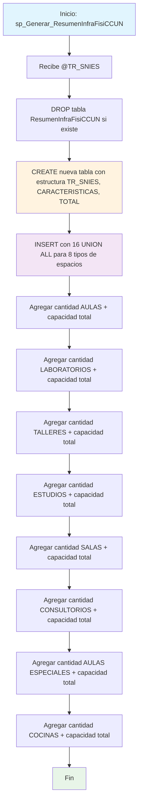

### sp_Generar_ResumenInfraFisiCCUN

Procedimiento que genera un resumen estadístico completo de infraestructura física de la sede Bogotá. Crea tabla destino y consolida cantidades y capacidades totales para 8 tipos diferentes de espacios académicos (aulas, laboratorios, talleres, estudios, salas, consultorios, aulas especiales y cocinas).

#### Diagrama de flujo


#### Procedimiento almacenado
```sql
CREATE PROCEDURE [RCAL].[sp_Generar_ResumenInfraFisiCCUN]
@TR_SNIES VARCHAR(50)
AS
BEGIN
SET NOCOUNT ON;

    -- 1. Eliminar tabla si ya existe
    IF OBJECT_ID('RCAL.ResumenInfraFisiCCUN', 'U') IS NOT NULL
        DROP TABLE RCAL.ResumenInfraFisiCCUN;

    -- 2. Crear tabla destino con columna adicional TR_SNIES
    CREATE TABLE [RCAL].[ResumenInfraFisiCCUN] (
        TR_SNIES VARCHAR(50),
        CARACTERISTICAS NVARCHAR(150),
        TOTAL INT
    );

    -- 3. Insertar datos
    INSERT INTO [RCAL].[ResumenInfraFisiCCUN] (TR_SNIES, CARACTERISTICAS, TOTAL)
    SELECT @TR_SNIES, 'CANTIDAD AULAS', COUNT(*)
    FROM [RCAL].[Data_Infraestructura_BGTA]
    WHERE [TIPO DE AULA] LIKE 'AULA%' OR [TIPO DE AULA] LIKE '%AULA%'

    UNION ALL
    SELECT @TR_SNIES, 'CAPACIDAD TOTAL AULAS', SUM(CAPACIDAD)
    FROM [RCAL].[Data_Infraestructura_BGTA]
    WHERE [TIPO DE AULA] LIKE 'AULA%' OR [TIPO DE AULA] LIKE '%AULA%'

    UNION ALL
    SELECT @TR_SNIES, 'CANTIDAD LABORATORIOS', COUNT(*)
    FROM [RCAL].[Data_Infraestructura_BGTA]
    WHERE [TIPO DE AULA] LIKE '%LABORATORIO%'

    UNION ALL
    SELECT @TR_SNIES, 'CAPACIDAD TOTAL LABORATORIOS', SUM(CAPACIDAD)
    FROM [RCAL].[Data_Infraestructura_BGTA]
    WHERE [TIPO DE AULA] LIKE '%LABORATORIO%'

    UNION ALL
    SELECT @TR_SNIES, 'CANTIDAD TALLERES', COUNT(*)
    FROM [RCAL].[Data_Infraestructura_BGTA]
    WHERE [TIPO DE AULA] LIKE '%TALLER%'

    UNION ALL
    SELECT @TR_SNIES, 'CAPACIDAD TOTAL TALLERES', SUM(CAPACIDAD)
    FROM [RCAL].[Data_Infraestructura_BGTA]
    WHERE [TIPO DE AULA] LIKE '%TALLER%'

    UNION ALL
    SELECT @TR_SNIES, 'CANTIDAD ESTUDIOS', COUNT(*)
    FROM [RCAL].[Data_Infraestructura_BGTA]
    WHERE [TIPO DE AULA] LIKE '%ESTUDIO%'

    UNION ALL
    SELECT @TR_SNIES, 'CAPACIDAD TOTAL ESTUDIOS', SUM(CAPACIDAD)
    FROM [RCAL].[Data_Infraestructura_BGTA]
    WHERE [TIPO DE AULA] LIKE '%ESTUDIO%'

    UNION ALL
    SELECT @TR_SNIES, 'CANTIDAD SALAS', COUNT(*)
    FROM [RCAL].[Data_Infraestructura_BGTA]
    WHERE [TIPO DE AULA] LIKE '%SALA%'

    UNION ALL
    SELECT @TR_SNIES, 'CAPACIDAD TOTAL SALAS', SUM(CAPACIDAD)
    FROM [RCAL].[Data_Infraestructura_BGTA]
    WHERE [TIPO DE AULA] LIKE '%SALA%'

    UNION ALL
    SELECT @TR_SNIES, 'CANTIDAD CONSULTORIOS', COUNT(*)
    FROM [RCAL].[Data_Infraestructura_BGTA]
    WHERE [TIPO DE AULA] LIKE '%CONSULTORIO%'

    UNION ALL
    SELECT @TR_SNIES, 'CAPACIDAD TOTAL CONSULTORIOS', SUM(CAPACIDAD)
    FROM [RCAL].[Data_Infraestructura_BGTA]
    WHERE [TIPO DE AULA] LIKE '%CONSULTORIO%'

    UNION ALL
    SELECT @TR_SNIES, 'CANTIDAD AULAS ESPECIALES', COUNT(*)
    FROM [RCAL].[Data_Infraestructura_BGTA]
    WHERE [TIPO DE AULA] LIKE '%ESPECIAL%'

    UNION ALL
    SELECT @TR_SNIES, 'CAPACIDAD TOTAL AULAS ESPECIALES', SUM(CAPACIDAD)
    FROM [RCAL].[Data_Infraestructura_BGTA]
    WHERE [TIPO DE AULA] LIKE '%ESPECIAL%'

    UNION ALL
    SELECT @TR_SNIES, 'CANTIDAD COCINAS', COUNT(*)
    FROM [RCAL].[Data_Infraestructura_BGTA]
    WHERE [TIPO DE AULA] LIKE '%COCINA%'

    UNION ALL
    SELECT @TR_SNIES, 'CAPACIDAD TOTAL COCINAS', SUM(CAPACIDAD)
    FROM [RCAL].[Data_Infraestructura_BGTA]
    WHERE [TIPO DE AULA] LIKE '%COCINA%';

END

```
#### Operaciones Principales

- Recreación tabla: DROP/CREATE tabla ResumenInfraFisiCCUN para datos actualizados
- Consulta unificada: 16 SELECT con UNION ALL para diferentes métricas
- Filtrado por tipo: WHERE con LIKE para identificar cada tipo de espacio
- Doble métrica: COUNT(*) para cantidades y SUM(CAPACIDAD) para totales
- Asociación programa: Cada registro vinculado al TR_SNIES específico
- Cobertura completa: 8 tipos de espacios con cantidad y capacidad respectiva

#### Tablas afectadas

##### Creadas/Recreadas:

- RCAL.ResumenInfraFisiCCUN: Tabla destino con resumen estadístico de infraestructura

##### Consultadas:

- RCAL.Data_Infraestructura_BGTA: Fuente de datos de infraestructura física de Bogotá

#### Procedimientos Almacenados Anidados