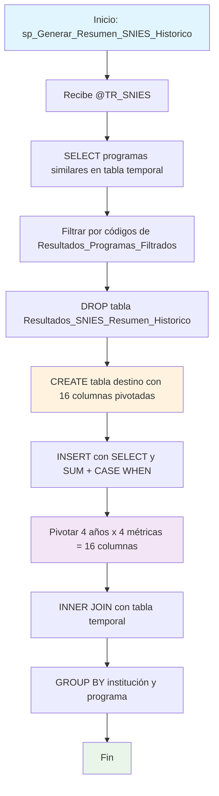

### sp_Generar_Resumen_SNIES_Historico

Procedimiento que genera un resumen histórico pivotado de estadísticas académicas (2020-2023) para programas similares filtrados. Convierte datos verticales por año en columnas horizontales por métrica (inscritos, admitidos, matriculados, graduados) creando una matriz temporal de 4 años x 4 métricas.

#### Diagrama de flujo


#### Procedimiento almacenado
```sql
CREATE PROCEDURE [RCAL].[sp_Generar_Resumen_SNIES_Historico]
@TR_SNIES VARCHAR(255)
AS
BEGIN
SET NOCOUNT ON;

    -- 1. Crear tabla temporal con programas similares del TR_SNIES
    SELECT
        P.CODIGO_SNIES_DEL_PROGRAMA,
        P.NOMBRE_INSTITUCION,
        P.NOMBRE_DEL_PROGRAMA,
        P.MODALIDAD,
        P.NUMERO_CREDITOS,
        P.NUMERO_PERIODOS_DE_DURACION,
        P.PERIODICIDAD,
        P.MUNICIPIO_OFERTA_PROGRAMA
    INTO #Resultados_SNIES_Resumen_Historico
    FROM RCAL.Programas_SNIES P
    WHERE P.NOMBRE_DEL_PROGRAMA IN ( Select CODIGO_SNIES_DEL_PROGRAMA FROM  RCAL.Resultados_Programas_Filtrados );

    -- 2. Eliminar tabla destino si ya existe
    DROP TABLE IF EXISTS RCAL.Resultados_SNIES_Resumen_Historico;

    -- 3. Crear tabla destino incluyendo TR_SNIES
    CREATE TABLE RCAL.Resultados_SNIES_Resumen_Historico (
        TR_SNIES                              VARCHAR(255),
        [INSTITUCIÓN DE EDUCACIÓN SUPERIOR (IES)] NVARCHAR(255),
        [DENOMINACIÓN]                            NVARCHAR(255),

        -- INSCRITOS
        [INSCRITOS_2020] INT,
        [INSCRITOS_2021] INT,
        [INSCRITOS_2022] INT,
        [INSCRITOS_2023] INT,

        -- ADMITIDOS
        [ADMITIDOS_2020] INT,
        [ADMITIDOS_2021] INT,
        [ADMITIDOS_2022] INT,
        [ADMITIDOS_2023] INT,

        -- MATRICULADOS
        [MATRICULADOS_2020] INT,
        [MATRICULADOS_2021] INT,
        [MATRICULADOS_2022] INT,
        [MATRICULADOS_2023] INT,

        -- GRADUADOS
        [GRADUADOS_2020] INT,
        [GRADUADOS_2021] INT,
        [GRADUADOS_2022] INT,
        [GRADUADOS_2023] INT
    );

    -- 4. Insertar datos con TR_SNIES
    INSERT INTO RCAL.Resultados_SNIES_Resumen_Historico (
        TR_SNIES,
        [INSTITUCIÓN DE EDUCACIÓN SUPERIOR (IES)],
        [DENOMINACIÓN],
        [INSCRITOS_2020], [INSCRITOS_2021], [INSCRITOS_2022], [INSCRITOS_2023],
        [ADMITIDOS_2020], [ADMITIDOS_2021], [ADMITIDOS_2022], [ADMITIDOS_2023],
        [MATRICULADOS_2020], [MATRICULADOS_2021], [MATRICULADOS_2022], [MATRICULADOS_2023],
        [GRADUADOS_2020], [GRADUADOS_2021], [GRADUADOS_2022], [GRADUADOS_2023]
    )
    SELECT
        @TR_SNIES,
        D.institucion_educacion_superior,
        D.programa_academico,

        -- INSCRITOS
        SUM(CASE WHEN anio = 2020 THEN D.inscritos ELSE 0 END),
        SUM(CASE WHEN anio = 2021 THEN D.inscritos ELSE 0 END),
        SUM(CASE WHEN anio = 2022 THEN D.inscritos ELSE 0 END),
        SUM(CASE WHEN anio = 2023 THEN D.inscritos ELSE 0 END),

        -- ADMITIDOS
        SUM(CASE WHEN anio = 2020 THEN D.admitidos ELSE 0 END),
        SUM(CASE WHEN anio = 2021 THEN D.admitidos ELSE 0 END),
        SUM(CASE WHEN anio = 2022 THEN D.admitidos ELSE 0 END),
        SUM(CASE WHEN anio = 2023 THEN D.admitidos ELSE 0 END),

        -- MATRICULADOS
        SUM(CASE WHEN anio = 2020 THEN D.matriculados ELSE 0 END),
        SUM(CASE WHEN anio = 2021 THEN D.matriculados ELSE 0 END),
        SUM(CASE WHEN anio = 2022 THEN D.matriculados ELSE 0 END),
        SUM(CASE WHEN anio = 2023 THEN D.matriculados ELSE 0 END),

        -- GRADUADOS
        SUM(CASE WHEN anio = 2020 THEN D.graduados ELSE 0 END),
        SUM(CASE WHEN anio = 2021 THEN D.graduados ELSE 0 END),
        SUM(CASE WHEN anio = 2022 THEN D.graduados ELSE 0 END),
        SUM(CASE WHEN anio = 2023 THEN D.graduados ELSE 0 END)
    FROM [REGISTRO_CALIFICADO].[RCAL].[Datos_SNIES_2023] D
    INNER JOIN #Resultados_SNIES_Resumen_Historico R
        ON D.codigo_snies_programa = R.CODIGO_SNIES_DEL_PROGRAMA
    WHERE D.institucion_educacion_superior IS NOT NULL
    GROUP BY
        D.institucion_educacion_superior,
        D.programa_academico;

END;
```
#### Operaciones Principales

- Filtrado programas: Tabla temporal con programas similares basada en Resultados_Programas_Filtrados
- Recreación tabla: DROP/CREATE tabla destino con estructura pivotada
- Pivoteo manual: 16 columnas usando SUM(CASE WHEN anio = X THEN métrica ELSE 0 END)
- Matriz temporal: 4 años (2020-2023) × 4 métricas (inscritos, admitidos, matriculados, graduados)
- Correlación datos: INNER JOIN entre datos SNIES y programas filtrados
- Agregación final: GROUP BY por institución y programa académico

#### Tablas afectadas

##### Creadas/Recreadas:

- RCAL.Resultados_SNIES_Resumen_Historico: Tabla destino con datos pivotados
- #Resultados_SNIES_Resumen_Historico: Tabla temporal con programas similares

##### Consultadas:

- RCAL.Programas_SNIES: Fuente de programas académicos nacionales
- RCAL.Resultados_Programas_Filtrados: Filtro de programas relevantes (dependencia de otros procedimientos)
- REGISTRO_CALIFICADO.RCAL.Datos_SNIES_2023: Fuente de estadísticas históricas

#### Procedimientos Almacenados Anidados