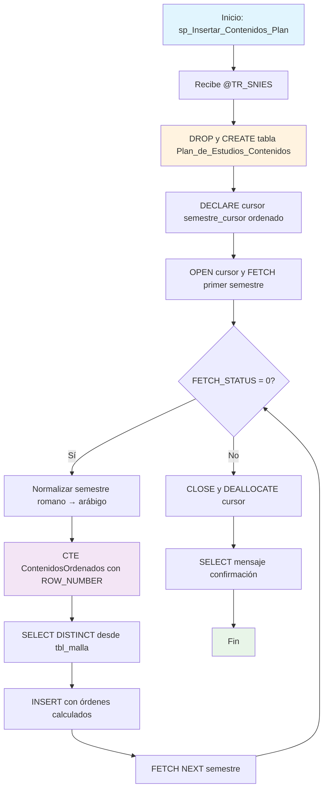

### sp_Insertar_Contenidos_Plan

Procedimiento que normaliza y reorganiza contenidos curriculares de un plan de estudios específico. Utiliza cursores para procesar semestres ordenadamente, convierte numeración romana a arábiga, y asigna números de orden explícitos tanto a asignaturas como a contenidos dentro de cada semestre.

#### Diagrama de flujo


#### Procedimiento almacenado
```sql
CREATE PROCEDURE [RCAL].[sp_Insertar_Contenidos_Plan]
@TR_SNIES NVARCHAR(50)
AS
BEGIN
SET NOCOUNT ON;

    DECLARE @TR_SemestreOriginal NVARCHAR(100);
    DECLARE @TR_Semestre NVARCHAR(100);

    -- Eliminar tabla si existe
    IF OBJECT_ID('RCAL.Plan_de_Estudios_Contenidos', 'U') IS NOT NULL
        DROP TABLE RCAL.Plan_de_Estudios_Contenidos;

    -- Crear nuevamente la tabla
    CREATE TABLE RCAL.Plan_de_Estudios_Contenidos (
        TR_SNIES NVARCHAR(50),
        TR_Semestre NVARCHAR(50),
        TR_Asignatura NVARCHAR(255),
        TR_Contenidos NVARCHAR(255),
        Orden_Asignatura INT,
        Orden_Contenido INT
    );

    -- Cursor de semestres ordenados
    DECLARE semestre_cursor CURSOR FOR
    SELECT TR_Semestre
    FROM (
        SELECT DISTINCT TR_Semestre
        FROM RCAL.tbl_malla
        WHERE TR_SNIES = @TR_SNIES
    ) AS Semestres
    ORDER BY
        CASE TR_Semestre
            WHEN 'I SEMESTRE' THEN 1
            WHEN 'II SEMESTRE' THEN 2
            WHEN 'III SEMESTRE' THEN 3
            WHEN 'IV SEMESTRE' THEN 4
            WHEN 'V SEMESTRE' THEN 5
            WHEN 'VI SEMESTRE' THEN 6
            WHEN 'VII SEMESTRE' THEN 7
            WHEN 'VIII SEMESTRE' THEN 8
            WHEN 'IX SEMESTRE' THEN 9
            WHEN 'X SEMESTRE' THEN 10
            WHEN 'XI SEMESTRE' THEN 11
            WHEN 'XII SEMESTRE' THEN 12
            ELSE 999
        END;

    OPEN semestre_cursor;
    FETCH NEXT FROM semestre_cursor INTO @TR_SemestreOriginal;

    WHILE @@FETCH_STATUS = 0
    BEGIN
        -- Normalizar semestre
        SET @TR_Semestre =
            CASE @TR_SemestreOriginal
                WHEN 'I SEMESTRE' THEN '1 SEMESTRE'
                WHEN 'II SEMESTRE' THEN '2 SEMESTRE'
                WHEN 'III SEMESTRE' THEN '3 SEMESTRE'
                WHEN 'IV SEMESTRE' THEN '4 SEMESTRE'
                WHEN 'V SEMESTRE' THEN '5 SEMESTRE'
                WHEN 'VI SEMESTRE' THEN '6 SEMESTRE'
                WHEN 'VII SEMESTRE' THEN '7 SEMESTRE'
                WHEN 'VIII SEMESTRE' THEN '8 SEMESTRE'
                WHEN 'IX SEMESTRE' THEN '9 SEMESTRE'
                WHEN 'X SEMESTRE' THEN '10 SEMESTRE'
                WHEN 'XI SEMESTRE' THEN '11 SEMESTRE'
                WHEN 'XII SEMESTRE' THEN '12 SEMESTRE'
                ELSE @TR_SemestreOriginal
            END;

        -- Insertar datos ordenados con ROW_NUMBER para orden explícito
        WITH ContenidosOrdenados AS (
            SELECT
                TR_SNIES,
                @TR_Semestre AS TR_Semestre,
                TR_Asignatura,
                TR_Contenidos,
                ROW_NUMBER() OVER (PARTITION BY TR_Asignatura ORDER BY TR_Contenidos) AS Orden_Contenido,
                ROW_NUMBER() OVER (PARTITION BY @TR_Semestre ORDER BY TR_Asignatura) AS Orden_Asignatura
            FROM (
                SELECT DISTINCT
                    TR_SNIES,
                    TR_Asignatura,
                    TR_Contenidos
                FROM RCAL.tbl_malla
                WHERE TR_SNIES = @TR_SNIES AND TR_Semestre = @TR_SemestreOriginal
            ) AS Distintos
        )
        INSERT INTO RCAL.Plan_de_Estudios_Contenidos (
            TR_SNIES,
            TR_Semestre,
            TR_Asignatura,
            TR_Contenidos,
            Orden_Asignatura,
            Orden_Contenido
        )
        SELECT
            TR_SNIES,
            TR_Semestre,
            TR_Asignatura,
            TR_Contenidos,
            Orden_Asignatura,
            Orden_Contenido
        FROM ContenidosOrdenados;

        FETCH NEXT FROM semestre_cursor INTO @TR_SemestreOriginal;
    END

    CLOSE semestre_cursor;
    DEALLOCATE semestre_cursor;

    SELECT 'Datos insertados correctamente y organizados.' AS Mensaje;

END;
```
#### Operaciones Principales

- Recreación tabla: DROP/CREATE tabla destino para limpieza completa
- Cursor ordenado: Procesa semestres en orden secuencial I-XII
- Normalización semestres: Convierte numeración romana a arábiga (I→1, II→2, etc.)
- CTE con ordenamiento: Calcula ROW_NUMBER para asignaturas y contenidos
- Eliminación duplicados: SELECT DISTINCT antes del ordenamiento
- Procesamiento iterativo: Cursor procesa cada semestre individualmente

#### Tablas afectadas

##### Creadas/Recreadas:

- RCAL.Plan_de_Estudios_Contenidos: Tabla destino normalizada con órdenes explícitos

##### Consultadas:

- RCAL.tbl_malla: Fuente de datos curriculares por TR_SNIES

#### Procedimientos Almacenados Anidados