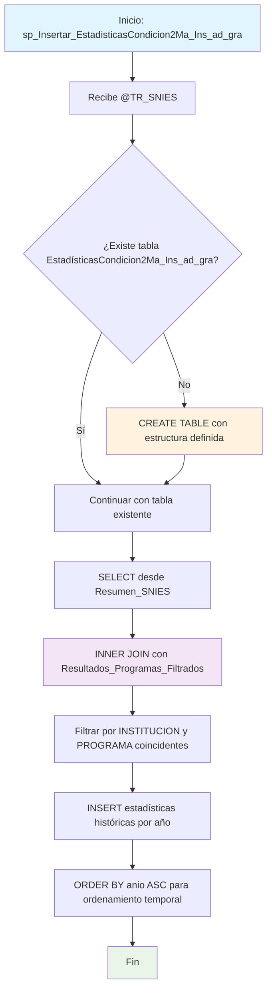

### sp_Insertar_EstadisticasCondicion2Ma_Ins_ad_gra

Procedimiento que extrae y consolida estadísticas académicas históricas (inscritos, admitidos, matriculados, graduados) para programas filtrados relacionados con un TR_SNIES específico. Crea automáticamente la tabla destino si no existe y correlaciona datos del resumen SNIES con programas previamente filtrados.

#### Diagrama de flujo


#### Procedimiento almacenado
```sql
CREATE PROCEDURE [RCAL].[sp_Insertar_EstadisticasCondicion2Ma_Ins_ad_gra]
@TR_SNIES VARCHAR(50)
AS
BEGIN
SET NOCOUNT ON;

    -- 1. Crear la tabla destino si no existe
    IF OBJECT_ID('RCAL.EstadísticasCondicion2Ma_Ins_ad_gra', 'U') IS NULL
    BEGIN
        CREATE TABLE [RCAL].[EstadísticasCondicion2Ma_Ins_ad_gra] (
            TR_SNIES                        VARCHAR(50),
            institucion_educacion_superior NVARCHAR(255),
            programa_academico             NVARCHAR(255),
            anio                           INT,
            inscritos                      INT,
            admitidos                      INT,
            matriculados                   INT,
            graduados                      INT
        );
    END

    -- 2. Insertar los datos filtrados por instituciones y programas relacionados al TR_SNIES
    INSERT INTO [RCAL].[EstadísticasCondicion2Ma_Ins_ad_gra] (
        TR_SNIES,
        institucion_educacion_superior,
        programa_academico,
        anio,
        inscritos,
        admitidos,
        matriculados,
        graduados
    )
    SELECT
        @TR_SNIES AS TR_SNIES,
        R.institucion_educacion_superior,
        R.programa_academico,
        R.anio,
        R.inscritos,
        R.admitidos,
        R.matriculados,
        R.graduados
    FROM [RCAL].[Resumen_SNIES] R
    INNER JOIN [RCAL].[Resultados_Programas_Filtrados] F
        ON R.institucion_educacion_superior = F.INSTITUCION
       AND R.programa_academico = F.PROGRAMA
    ORDER BY R.anio ASC;

END
```
#### Operaciones Principales

- Validación estructura: Verifica existencia de tabla destino con OBJECT_ID
- Creación automática: CREATE TABLE si no existe con campos estadísticos
- Correlación datos: INNER JOIN entre resumen SNIES y programas filtrados
- Filtrado específico: Matching exacto por institución y programa académico
- Inserción histórica: Datos estadísticos organizados por año ascendente
- Trazabilidad: Asocia todas las estadísticas al TR_SNIES de entrada

#### Tablas afectadas

##### Creadas/Actualizadas:

- RCAL.EstadísticasCondicion2Ma_Ins_ad_gra: Tabla destino con estadísticas históricas filtradas

##### Consultadas:

- RCAL.Resumen_SNIES: Fuente principal de estadísticas académicas históricas
- RCAL.Resultados_Programas_Filtrados: Tabla de programas previamente filtrados (generada por otros procedimientos)

#### Procedimientos Almacenados Anidados