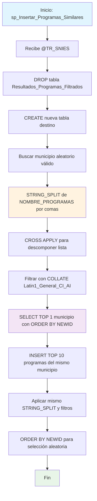

### sp_Insertar_Programas_Similares

Procedimiento que busca programas académicos similares basándose en una tabla de configuración preestablecida (PROGRAMAS_SIMILARES). Utiliza STRING_SPLIT para procesar listas de programas separadas por comas y selecciona 10 registros aleatorios del mismo municipio con coincidencia exacta de nombres.

#### Diagrama de flujo


#### Procedimiento almacenado
```sql
CREATE PROCEDURE [RCAL].[sp_Insertar_Programas_Similares]
@TR_SNIES VARCHAR(50)
AS
BEGIN
SET NOCOUNT ON;

    -- 1. Eliminar tabla destino si ya existe
    DROP TABLE IF EXISTS RCAL.Resultados_Programas_Filtrados;

    -- 2. Crear tabla destino
    CREATE TABLE RCAL.Resultados_Programas_Filtrados (
        TR_SNIES                    VARCHAR(50),
        CODIGO_SNIES_DEL_PROGRAMA  NVARCHAR(50),
        INSTITUCION                NVARCHAR(255),
        PROGRAMA                   NVARCHAR(255),
        MODALIDAD                  NVARCHAR(100),
        CREDITOS                   INT,
        PERIODOS                   INT,
        PERIODICIDAD               NVARCHAR(50),
        MUNICIPIO                  NVARCHAR(100)
    );

    -- 3. Obtener municipio aleatorio válido
    DECLARE @MunicipioFiltro NVARCHAR(100);

    SELECT TOP 1 @MunicipioFiltro = P.MUNICIPIO_OFERTA_PROGRAMA
    FROM RCAL.Programas_SNIES P
    WHERE LTRIM(RTRIM(P.NOMBRE_DEL_PROGRAMA)) COLLATE Latin1_General_CI_AI IN (
        SELECT LTRIM(RTRIM(value)) COLLATE Latin1_General_CI_AI
        FROM RCAL.PROGRAMAS_SIMILARES ps
        CROSS APPLY STRING_SPLIT(ps.NOMBRE_PROGRAMAS, ',')
        WHERE ps.TR_SNIES = @TR_SNIES
    )
    AND P.MUNICIPIO_OFERTA_PROGRAMA IS NOT NULL
    ORDER BY NEWID();

    -- 4. Insertar mínimo 10 registros aleatorios si existen
    INSERT INTO RCAL.Resultados_Programas_Filtrados (
        TR_SNIES,
        CODIGO_SNIES_DEL_PROGRAMA,
        INSTITUCION,
        PROGRAMA,
        MODALIDAD,
        CREDITOS,
        PERIODOS,
        PERIODICIDAD,
        MUNICIPIO
    )
    SELECT TOP (10)
        @TR_SNIES AS TR_SNIES,
        P.CODIGO_SNIES_DEL_PROGRAMA,
        P.NOMBRE_INSTITUCION,
        P.NOMBRE_DEL_PROGRAMA,
        P.MODALIDAD,
        P.NUMERO_CREDITOS,
        P.NUMERO_PERIODOS_DE_DURACION,
        P.PERIODICIDAD,
        P.MUNICIPIO_OFERTA_PROGRAMA
    FROM RCAL.Programas_SNIES P
    WHERE LTRIM(RTRIM(P.NOMBRE_DEL_PROGRAMA)) COLLATE Latin1_General_CI_AI IN (
        SELECT LTRIM(RTRIM(value)) COLLATE Latin1_General_CI_AI
        FROM RCAL.PROGRAMAS_SIMILARES ps
        CROSS APPLY STRING_SPLIT(ps.NOMBRE_PROGRAMAS, ',')
        WHERE ps.TR_SNIES = @TR_SNIES
    )
    AND P.MUNICIPIO_OFERTA_PROGRAMA = @MunicipioFiltro
    ORDER BY NEWID(); -- Aleatorio completo sin agrupar

END;
```
#### Operaciones Principales

- Recreación tabla: DROP/CREATE tabla destino en cada ejecución
- Consulta configuración: Lee tabla PROGRAMAS_SIMILARES por TR_SNIES específico
- Procesamiento listas: STRING_SPLIT descompone nombres separados por comas
- Normalización texto: LTRIM/RTRIM + COLLATE para coincidencias exactas
- Selección geográfica: Obtiene municipio aleatorio de programas similares válidos
- Muestreo controlado: TOP 10 con ORDER BY NEWID() del mismo municipio

#### Tablas afectadas

##### Creadas/Recreadas:

- RCAL.Resultados_Programas_Filtrados: Tabla destino con 10 programas similares

##### Consultadas:

- RCAL.Programas_SNIES: Fuente principal de datos de programas académicos nacionales
- RCAL.PROGRAMAS_SIMILARES: Tabla de configuración con listas de programas similares por TR_SNIES

#### Procedimientos Almacenados Anidados