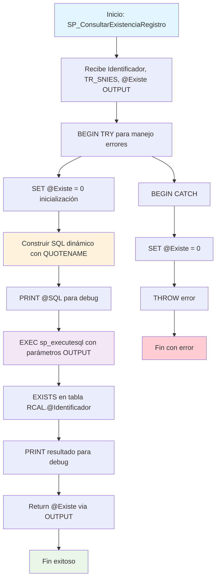

### SP_ConsultarExistenciaRegistro

Procedimiento utilitario que verifica dinámicamente la existencia de registros por TR_SNIES en cualquier tabla del esquema RCAL. Utiliza SQL dinámico con parámetro OUTPUT para retornar resultado booleano, incluye manejo de errores y funcionalidad de debug.

#### Diagrama de flujo


#### Procedimiento almacenado
```sql
CREATE PROCEDURE Dev.SP_ConsultarExistenciaRegistro
@Identificador NVARCHAR(100),
@TR_SNIES NVARCHAR(50),
@Existe BIT OUTPUT
AS
BEGIN
SET NOCOUNT ON;

    BEGIN TRY
        DECLARE @SQL NVARCHAR(MAX);
        SET @Existe = 0; -- Inicializar en falso

        SET @SQL = N'
            SELECT @ExisteOUT = CASE
                WHEN EXISTS (
                    SELECT 1
                    FROM RCAL.' + QUOTENAME(@Identificador) + ' WITH (NOLOCK)
                    WHERE TR_SNIES = @TR_SNIES_param
                )
                THEN 1
                ELSE 0
            END';

        -- Debug
        PRINT @SQL;

        EXEC sp_executesql
             @SQL,
             N'@TR_SNIES_param NVARCHAR(50), @ExisteOUT BIT OUTPUT',
             @TR_SNIES_param = @TR_SNIES,
             @ExisteOUT = @Existe OUTPUT;

        -- Debug
        PRINT 'Valor encontrado: ' + CAST(@Existe AS VARCHAR(1));
    END TRY
    BEGIN CATCH
        SET @Existe = 0;
        THROW;
    END CATCH

END
```
#### Operaciones Principales

- Inicialización: SET @Existe = 0 como valor por defecto
- Construcción dinámica: SQL con QUOTENAME para seguridad de nombres de tabla
- Consulta EXISTS: Verificación eficiente de existencia por TR_SNIES
- Ejecución parametrizada: sp_executesql con parámetros tipados y OUTPUT
- Debug integrado: PRINT para mostrar SQL generado y resultado
- Manejo errores: TRY/CATCH con THROW para propagación controlada

#### Tablas afectadas

##### Consultadas (dinámicamente):

- RCAL.@Identificador: Cualquier tabla del esquema RCAL según parámetro de entrada

#### Procedimientos Almacenados Anidados