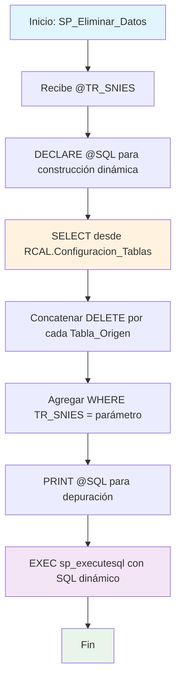

### SP_Eliminar_Datos

Procedimiento dinámico que elimina registros de múltiples tablas basándose en configuración centralizada. Construye automáticamente sentencias DELETE para todas las tablas registradas en la tabla de configuración, ejecutando eliminación masiva por TR_SNIES específico.

#### Diagrama de flujo


#### Procedimiento almacenado
```sql
CREATE PROCEDURE [RCAL].[SP_Eliminar_Datos]
@TR_SNIES VARCHAR(50)
AS
BEGIN
SET NOCOUNT ON;

    DECLARE @SQL NVARCHAR(MAX) = '';

    -- Construcción dinámica de los DELETE
    SELECT @SQL = @SQL +
        'DELETE FROM ' + Tabla_Origen + ' WHERE TR_SNIES = ''' + @TR_SNIES + '''; ' + CHAR(13)
    FROM RCAL.Configuracion_Tablas

    -- Ejecutar el SQL dinámico
    PRINT @SQL;  -- Para depuración, muestra los DELETE generados
    EXEC sp_executesql @SQL;

END;
```
#### Operaciones Principales

- Construcción dinámica: SELECT concatena múltiples DELETE desde tabla configuración
- Parametrización: Inyecta @TR_SNIES en cada sentencia WHERE generada
- Concatenación: += para agregar cada DELETE con CHAR(13) como separador
- Depuración: PRINT muestra SQL generado antes de ejecución
- Ejecución masiva: sp_executesql ejecuta todos los DELETE concatenados
- Eliminación controlada: Solo registros con TR_SNIES específico

#### Tablas afectadas

##### Eliminadas (dinámicamente):

- Múltiples tablas: Según configuración en RCAL.Configuracion_Tablas (campo Tabla_Origen)

##### Consultadas:

- RCAL.Configuracion_Tablas: Tabla de configuración con listado de tablas objetivo

#### Procedimientos Almacenados Anidados

- sp_executesql: Ejecuta SQL dinámico construido con múltiples DELETE concatenados