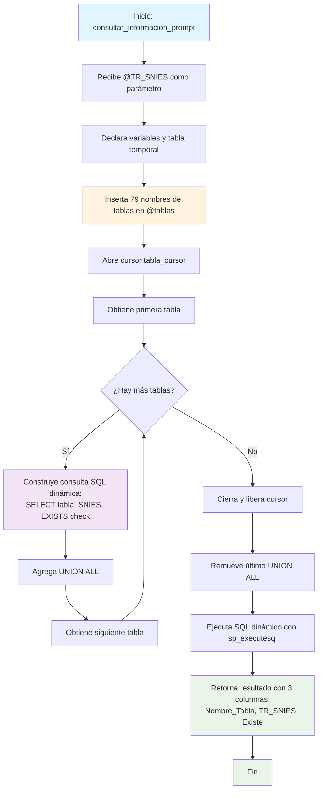

### consultar_informacion_prompt

Este procedimiento almacenado genera un reporte de existencia de datos para un programa específico (identificado por TR_SNIES) a través de 79 tablas del sistema RCAL. Su función principal es verificar si existen registros en cada tabla para el código SNIES proporcionado, devolviendo un resultado consolidado que indica "Sí" o "No" para cada tabla consultada.

El procedimiento utiliza SQL dinámico para construir una consulta UNION que verifica la existencia de datos en todas las tablas de formularios, incluyendo versiones actualizadas (V2) y especializadas de las tablas del sistema de Registro Calificado.

#### Diagrama de flujo



#### Procedimiento almacenado

```sql
CREATE PROCEDURE [RCAL].[consultar_informacion_prompt]
@TR_SNIES VARCHAR(20)
AS
BEGIN
SET NOCOUNT ON;

    DECLARE @sql NVARCHAR(MAX) = '';
    DECLARE @nombreTabla NVARCHAR(100);

    -- Tabla con los nombres de las tablas a revisar
    DECLARE @tablas TABLE (NombreTabla NVARCHAR(100));
    INSERT INTO @tablas (NombreTabla)
    VALUES
    ('F3_Aporte_III_Asignatura_Tecno_Prof_V2'),
    ('F3_RAE_TEC_TP_PROPODEUTICO'),
    ('F3_RAE_TP_PRO_PROPODEUTICO'),
    ('F8_Inventario_software'),
    ('F1_AnalisisCorrespondenciaTitulo'),
    ('F2_Referentes'),
    ('F2_AnalisisEstadistico'),
    ('F2_AnalisisExpectativasEstd'),
    ('F2_JustificacionPlanNRL'),
    ('F2_ExplicacionModalidades'),
    ('F2_AtributosProgramas'),
    ('F3_ResumenConceptTyE'),
    ('F2_RedaccionPlanDesarrolloNRL'),
    ('F6_PlanInteraccionSectExtr'),
    ('F2_ComProgramasInt'),
    ('F1_AjusteSemantico'),
    ('F1_CampoAED'),
    ('F2_AnalisisDesercion'),
    ('F2_AnalisisEmpleabilidadH'),
    ('F2_AporteSociedad'),
    ('F6_AnalisisProyecSoci'),
    ('F6_IntroducConven'),
    ('F7_AnalisisDocente'),
    ('F2_AportePlanes'),
    ('F2_EmpleabilidadEgresado'),
    ('F2_EnfoqueInd'),
    ('F2_EnfoqueMat'),
    ('F2_EnfoqueRS'),
    ('F2_EnfoqueSos'),
    ('F2_JustificacionModalidad'),
    ('F4_Profundizacion_Competencias_V2'),
    ('F2_ResumenModificacion'),
    ('F2_Salarios'),
    ('F2_SectorEmpleabilidad'),
    ('F3_AlianzasCUN'),
    ('F3_Competencias_Tec_Tecno_V2'),
    ('F3_DescripccionImpactCuant'),
    ('F3_DescripccionModPedag'),
    ('F3_DescripccionModVirt'),
    ('F3_ElementosTyE'),
    ('F3_ImplementacionRA'),
    ('F4_AjusteAsignaturas'),
    ('F4_CompetenciaHabilidades'),
    ('F4_DescripcionPlanTransicion'),
    ('F4_EnfoqueCompnComp'),
    ('F5_AnalasisTabla17'),
    ('F5_ResumenInvsProgram'),
    ('F6_AnalaisisTablaEscPract'),
    ('F3_PerfilIngreso'),
    ('F3_PerfilOcupacional'),
    ('F3_PerfilProfesional'),
    ('F2_AnalisisEstudiantes'),
    ('F3_RAE'),
    ('F1_Area_Conocimiento_V2'),
    ('F1_Exigencias_Mercado_v2'),
    ('F2_Impacto_PDE_V2'),
    ('F2_Impacto_Acuerdo_V2'),
    ('F2_RangoSalarial'),
    ('F2_Impacto_ODS_V2'),
    ('F2_Diferenciadores_Programa_V2'),
    ('F2_Analisis_Tasa_Vinculacion_V2'),
    ('F2_AnalisisPeriodoRegional'),
    ('F1_Pertinencia_Titulo_V2'),
    ('F2_Impacto_Desarrollo_Local_V2'),
    ('F3_RAE_TP'),
    ('F2_Expectativas_Laborales_V2'),
    ('F3_RAE_TEC'),
    ('F3_RAE_PROF'),
    ('F1_Pertinencia_Duracion_v2'),
    ('F4_Componente_Uniestructural'),
    ('F4_Componente_multiestructural'),
    ('F4_Componente_integrador'),
    ('F4_Componente_relacional'),
    ('F4_Componente_investigacion'),
    ('F4_Componente_accion'),
    ('F2_VinculaciónLaboral'),
    ('F3_Aporte_I_Asig_Tec_Tecno_V2'),
    ('F3_Aporte_II_Asig_Tec_Tecno_V2'),
    ('F3_Aporte_III_Asig_Tec_Tecno_V2'),
    ('F8_Inventario_software'),
    ('F8_Inventario_laboratorios'),
    ('F1_referencias_C1'),
    ('F3_Aporte_I_Asignatura_Tecno_Prof_V2'),
    ('F3_Aporte_II_Asignatura_Tecno_Prof_V2');

    -- Generar SQL dinámico
    DECLARE tabla_cursor CURSOR FOR SELECT NombreTabla FROM @tablas;
    OPEN tabla_cursor;
    FETCH NEXT FROM tabla_cursor INTO @nombreTabla;

    WHILE @@FETCH_STATUS = 0
    BEGIN
        SET @sql += '
        SELECT ''' + @nombreTabla + ''' AS Nombre_Tabla, ''' + @TR_SNIES + ''' AS TR_SNIES,
               CASE WHEN EXISTS (
                   SELECT 1 FROM RCAL.' + QUOTENAME(@nombreTabla) + ' WHERE TR_SNIES = ''' + @TR_SNIES + '''
               ) THEN ''Sí'' ELSE ''No'' END AS Existe
        UNION ALL';

        FETCH NEXT FROM tabla_cursor INTO @nombreTabla;
    END

    CLOSE tabla_cursor;
    DEALLOCATE tabla_cursor;

    -- Quitar el último UNION ALL
    SET @sql = LEFT(@sql, LEN(@sql) - 10);

    -- Ejecutar
    EXEC sp_executesql @sql;

END;
```

#### Tablas afectadas

##### Formularios F1 (6 tablas):

- F1_AnalisisCorrespondenciaTitulo, F1_AjusteSemantico, F1_CampoAED
- F1_Area_Conocimiento_V2, F1_Exigencias_Mercado_v2, F1_Pertinencia_Titulo_V2
- F1_Pertinencia_Duracion_v2, F1_referencias_C1

##### Formularios F2 (25 tablas):

- Análisis básicos y estadísticos
- Enfoques (Ind, Mat, RS, Sos)
- Versiones V2: Impactos, diferenciadores, análisis regionales
- Empleabilidad y vinculación laboral

##### Formularios F3 (16 tablas):

- Perfiles (Ingreso, Ocupacional, Profesional)
- RAE en diferentes modalidades (TEC, PROF, TP)
- Aportes por asignaturas (V2)
- Competencias técnicas y tecnológicas

##### Formularios F4 (9 tablas):

- Competencias y ajustes
- Componentes estructurales (uni, multi, integrador, relacional)
- Profundización de competencias

##### Formularios F5 (2 tablas):

- F5_AnalasisTabla17, F5_ResumenInvsProgram

##### Formularios F6 (3 tablas):

- F6_AnalaisisTablaEscPract, F6_AnalisisProyecSoci, F6_IntroducConven

##### Formularios F7 (1 tabla):

- F7_AnalisisDocente

##### Formularios F8 (2 tablas):

- F8_Inventario_software, F8_Inventario_laboratorios

#### Resultado del Procedimiento

##### Columnas de salida:

- Nombre_Tabla: Nombre de la tabla consultada
- TR_SNIES: Código SNIES proporcionado
- Existe: "Sí" si hay registros, "No" si no los hay

##### Total de verificaciones: 
- 79 tablas del esquema RCAL