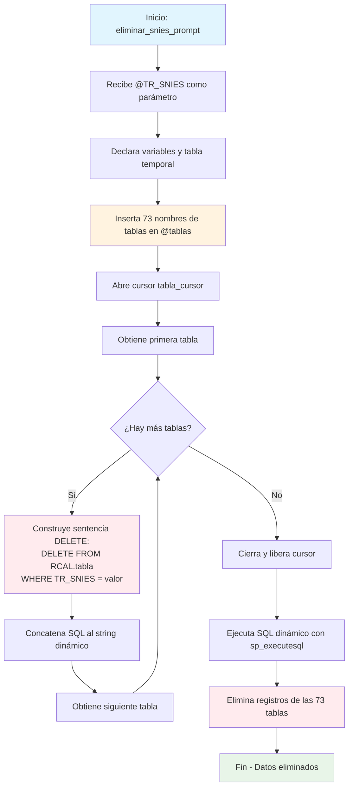

### eliminar_snies_prompt

Este procedimiento almacenado realiza una eliminación masiva y específica de datos relacionados con un código SNIES en 73 tablas del sistema RCAL. A diferencia de los procedimientos de borrado anteriores, este se enfoca exclusivamente en las tablas más modernas del sistema, incluyendo versiones V2 y tablas especializadas de formularios.

Utiliza SQL dinámico para construir y ejecutar múltiples sentencias DELETE de forma eficiente, eliminando todos los registros que coincidan con el TR_SNIES proporcionado en las tablas especificadas.

#### Diagrama de flujo



#### Procedimiento almacenado

```sql
CREATE PROCEDURE [RCAL].[eliminar_snies_prompt]
@TR_SNIES VARCHAR(20)
AS
BEGIN
SET NOCOUNT ON;

    DECLARE @sql NVARCHAR(MAX) = '';
    DECLARE @nombreTabla NVARCHAR(100);

    -- Lista de tablas a procesar
    DECLARE @tablas TABLE (NombreTabla NVARCHAR(100));
    INSERT INTO @tablas (NombreTabla)
    VALUES
    ('F3_Aporte_III_Asignatura_Tecno_Prof_V2'),
    ('F3_RAE_TEC_TP_PROPODEUTICO'),
    ('F3_RAE_TP_PRO_PROPODEUTICO'),
    ('F8_Inventario_software'),
    ('F1_AnalisisCorrespondenciaTitulo'),
    ('F2_Referentes'),
    ('F2_AnalisisEstadistico'),
    ('F2_AnalisisExpectativasEstd'),
    ('F2_JustificacionPlanNRL'),
    ('F2_ExplicacionModalidades'),
    ('F2_AtributosProgramas'),
    ('F3_ResumenConceptTyE'),
    ('F2_RedaccionPlanDesarrolloNRL'),
    ('F6_PlanInteraccionSectExtr'),
    ('F2_ComProgramasInt'),
    ('F1_AjusteSemantico'),
    ('F1_CampoAED'),
    ('F2_AnalisisDesercion'),
    ('F2_AnalisisEmpleabilidadH'),
    ('F2_AporteSociedad'),
    ('F6_AnalisisProyecSoci'),
    ('F6_IntroducConven'),
    ('F7_AnalisisDocente'),
    ('F2_AportePlanes'),
    ('F2_EmpleabilidadEgresado'),
    ('F2_EnfoqueInd'),
    ('F2_EnfoqueMat'),
    ('F2_EnfoqueRS'),
    ('F2_EnfoqueSos'),
    ('F2_JustificacionModalidad'),
    ('F4_Profundizacion_Competencias_V2'),
    ('F2_ResumenModificacion'),
    ('F2_Salarios'),
    ('F2_SectorEmpleabilidad'),
    ('F3_AlianzasCUN'),
    ('F3_Competencias_Tec_Tecno_V2'),
    ('F3_DescripccionImpactCuant'),
    ('F3_DescripccionModPedag'),
    ('F3_DescripccionModVirt'),
    ('F3_ElementosTyE'),
    ('F3_ImplementacionRA'),
    ('F4_AjusteAsignaturas'),
    ('F4_CompetenciaHabilidades'),
    ('F4_DescripcionPlanTransicion'),
    ('F4_EnfoqueCompnComp'),
    ('F5_AnalasisTabla17'),
    ('F5_ResumenInvsProgram'),
    ('F6_AnalaisisTablaEscPract'),
    ('F3_PerfilIngreso'),
    ('F3_PerfilOcupacional'),
    ('F3_PerfilProfesional'),
    ('F2_AnalisisEstudiantes'),
    ('F3_RAE'),
    ('F1_Area_Conocimiento_V2'),
    ('F1_Exigencias_Mercado_v2'),
    ('F2_Impacto_PDE_V2'),
    ('F2_Impacto_Acuerdo_V2'),
    ('F2_RangoSalarial'),
    ('F2_Impacto_ODS_V2'),
    ('F2_Diferenciadores_Programa_V2'),
    ('F2_Analisis_Tasa_Vinculacion_V2'),
    ('F2_AnalisisPeriodoRegional'),
    ('F1_Pertinencia_Titulo_V2'),
    ('F2_Impacto_Desarrollo_Local_V2'),
    ('F3_RAE_TP'),
    ('F2_Expectativas_Laborales_V2'),
    ('F3_RAE_TEC'),
    ('F3_RAE_PROF'),
    ('F1_Pertinencia_Duracion_v2'),
    ('F2_VinculaciónLaboral'),
    ('F3_Aporte_I_Asig_Tec_Tecno_V2'),
    ('F3_Aporte_II_Asig_Tec_Tecno_V2'),
    ('F3_Aporte_III_Asig_Tec_Tecno_V2'),
    ('F3_Aporte_I_Asignatura_Tecno_Prof_V2'),
    ('F8_Inventario_software'),
    ('F8_Inventario_laboratorios'),
    ('F1_referencias_C1'),
    ('F3_Aporte_II_Asignatura_Tecno_Prof_V2');

    -- Generar DELETE dinámico
    DECLARE tabla_cursor CURSOR FOR SELECT NombreTabla FROM @tablas;
    OPEN tabla_cursor;
    FETCH NEXT FROM tabla_cursor INTO @nombreTabla;

    WHILE @@FETCH_STATUS = 0
    BEGIN
        SET @sql += '
        DELETE FROM RCAL.' + QUOTENAME(@nombreTabla) + '
        WHERE TR_SNIES = ''' + @TR_SNIES + ''';';

        FETCH NEXT FROM tabla_cursor INTO @nombreTabla;
    END

    CLOSE tabla_cursor;
    DEALLOCATE tabla_cursor;

    -- Ejecutar SQL
    EXEC sp_executesql @sql;

END;
```

#### Tablas afectadas

#####Formularios F1 (6 tablas):

- Básicas: F1_AnalisisCorrespondenciaTitulo, F1_AjusteSemantico, F1_CampoAED
- Versiones V2: F1_Area_Conocimiento_V2, F1_Exigencias_Mercado_v2, F1_Pertinencia_Titulo_V2
- Especializadas: F1_Pertinencia_Duracion_v2, F1_referencias_C1

##### Formularios F2 (23 tablas):

- Análisis tradicionales: Deserción, Empleabilidad, Estadístico
- Enfoques: Individual, Matemático, Responsabilidad Social, Sostenibilidad
- Versiones V2 modernas: Impactos (PDE, Acuerdo, ODS), Diferenciadores, Análisis regional
- Vinculación y rangos salariales

##### Formularios F3 (15 tablas):

- Perfiles: Ingreso, Ocupacional, Profesional
- RAE especializados: TEC, PROF, TP, y propedéuticos
- Aportes por asignaturas (V2): Técnicas, Tecnológicas, Profesionales
- Competencias técnicas y tecnológicas

##### Formularios F4 (5 tablas):

- F4_AjusteAsignaturas, F4_CompetenciaHabilidades, F4_DescripcionPlanTransicion
- F4_EnfoqueCompnComp, F4_Profundizacion_Competencias_V2

##### Formularios F5 (2 tablas):

- F5_AnalasisTabla17, F5_ResumenInvsProgram

##### Formularios F6 (3 tablas):

- F6_AnalaisisTablaEscPract, F6_AnalisisProyecSoci, F6_IntroducConven
- F6_PlanInteraccionSectExtr

##### Formularios F7 (1 tabla):

- F7_AnalisisDocente

##### Formularios F8 (2 tablas):

- F8_Inventario_software, F8_Inventario_laboratorios

##### Características Técnicas
- Operación: DELETE masivo con SQL dinámico
- Filtro: TR_SNIES = @TR_SNIES en todas las tablas
- Método: Cursor para iterar sobre nombres de tablas
- Ejecución: sp_executesql para SQL dinámico
- Total de tablas: 73 tablas del esquema RCAL

##### Diferencias con otros procedimientos:

- Más selectivo que Borrado_PoblacionTablasRCAL (no incluye tablas de condiciones ni históricas)
- Incluye tablas V2 y especializadas que no están en Borrado_TablasPrompt
- Enfoque en tablas modernas del sistema de prompts
