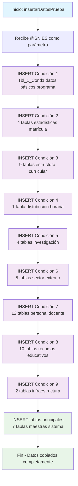

### insertarDatosPrueba

Este procedimiento almacenado realiza una copia masiva de datos de prueba desde un programa de referencia (TR_SNIES='54639') hacia un nuevo programa académico identificado por el parámetro @SNIES. Su función principal es crear rápidamente un conjunto completo de datos para pruebas o inicialización de programas nuevos, copiando información de todas las condiciones del sistema de Registro Calificado (Condiciones 1-9).

El procedimiento ejecuta aproximadamente 50 operaciones INSERT que cubren desde datos básicos del programa hasta infraestructura física, pasando por información curricular, docentes, investigación y recursos educativos.
#### Diagrama de flujo



#### Procedimiento almacenado

```sql
CREATE PROCEDURE [Dev].[insertarDatosPrueba]

@SNIES INT

AS
BEGIN
-- Inserción en Tbl_1_Cond1
INSERT INTO [REGISTRO_CALIFICADO].[RCAL].[Tbl_1_Cond1]
SELECT TR_NombrePrograma,
TR_Titulo,
[TR_totalCreditos],
[TR_Modalidad],
[TR_NivelFormacion],
[TR_Regionales],
[TR_Duracion],
[Cal_UnidadPeriodicidad],
[TR_PeriodicidadAdminision],
[TR_EstudiantesPrimerSemestre],
[F_NumeroAcuerdo],
[TR_FechaAcuerdo_dia],
[TR_FechaAcuerdo_mes],
[TR_FechaAcuerdo_año],
@SNIES
FROM [REGISTRO_CALIFICADO].[RCAL].[Tbl_1_Cond1]
WHERE TR_SNIES = '54639';

    -- Inserción en Tbl_5_Cond2_ESP
    INSERT INTO [REGISTRO_CALIFICADO].[RCAL].[Tbl_5_Cond2_ESP]
    SELECT [Vinculación_Laboral_de_Recien_Graduados],
           [Total],
           @SNIES
    FROM [REGISTRO_CALIFICADO].[RCAL].[Tbl_5_Cond2_ESP]
    WHERE TR_SNIES = '54639';

    -- Inserción en Tbl_5_Cond2
    INSERT INTO [REGISTRO_CALIFICADO].[RCAL].[Tbl_5_Cond2]
    SELECT [TR_AñoActual],
           [Periodo],
           [Matriculados_total],
           @SNIES
    FROM [REGISTRO_CALIFICADO].[RCAL].[Tbl_5_Cond2]
    WHERE TR_SNIES = '54639';

    -- Inserción en Tbl_6_Cond2
    INSERT INTO [REGISTRO_CALIFICADO].[RCAL].[Tbl_6_Cond2]
    SELECT TOP (1000) [TR_AñoActual],
           [Periodo],
           [Inscritos],
           [Admitidos],
           [Matriculados_Total],
           [TR_EstudiantesPrimerSemestre],
           [Graduados],
           [Retirados],
           [Tasa_de_desercion],
           @SNIES
    FROM [REGISTRO_CALIFICADO].[RCAL].[Tbl_6_Cond2]
    WHERE TR_SNIES = '54639';

    ----Inserción en Tbl6_Cond2_ESP
    --INSERT INTO [REGISTRO_CALIFICADO].[RCAL].[Tbl6_Cond2_ESP]
    --SELECT TOP (1000) [Rango_salarial]

-- ,[Año_5]
-- ,[Año_5_%]
-- ,[Año_4]
-- ,[Año_4_%]
-- ,[Año_3]
-- ,[Año_3_%]
-- ,[Año_2]
-- ,[Año_2_%]
-- ,[Año_1]
-- ,[Año_1_%]
-- ,@SNIES
-- FROM [REGISTRO_CALIFICADO].[RCAL].[Tbl6_Cond2_ESP]
-- WHERE TR_SNIES = '54639'

    -- Inserción en Tbl_10_Cond3
    INSERT INTO [REGISTRO_CALIFICADO].[RCAL].[Tbl_10_Cond3]
    SELECT TOP (1000) [Electivas_de_profundizacion_Asignatura],
           [Electivas_de_profundizacion_Contenidos],
           [Electivas_Complementarias_Asignatura],
           [Electivas_Complementarias_Contenidos],
           @SNIES
    FROM [REGISTRO_CALIFICADO].[RCAL].[Tbl_10_Cond3]
    WHERE TR_SNIES = '54639';

    ---- Inserción en Tbl_11_Cond3
    --INSERT INTO [REGISTRO_CALIFICADO].[RCAL].[Tbl_11_Cond3]
    --SELECT TOP (1000) [DOMINIO_DE_COMPETENCIA],
    --       [MACROCOMPETENCIAS_NIVEL_AXONOMICO],
    --       [MACROCOMPETENCIAS_OBJETO_CONDICION_FINALIDAD],
    --       [ESPACIOS_ACADEMICOS_ASOCIADO_AL_RESULTADO],
    --       [RESULTADOS_APRENDIZAJE_DEL_PROGRAMA_NIVEL_TAXONOMICO],
    --       [RESULTADOS_APRENDIZAJE_DEL_PROGRAMA_OBJETO_CONDICION_FINALIDAD],
    --       @SNIES,
    --       [NOMBRE_PROGRAMA]
    --FROM [REGISTRO_CALIFICADO].[RCAL].[Tbl_11_Cond3]
    --WHERE TR_SNIES = '54639';

    -- Inserción en Tbl_12_Cond3
    INSERT INTO [REGISTRO_CALIFICADO].[RCAL].[Tbl_12_Cond3]
    SELECT TOP (1000) [ASIGNATURA],
           [CONTENIDO],
           @SNIES
    FROM [REGISTRO_CALIFICADO].[RCAL].[Tbl_12_Cond3]
    WHERE TR_SNIES = '54639';

    -- Inserción en Tbl_13_Cond3
    --INSERT INTO [REGISTRO_CALIFICADO].[RCAL].[Tbl_13_Cond3]
    --SELECT TOP (1000) [Item_Año]

-- ,[2016]
-- ,[2017]
-- ,[2018]
-- ,[2019]
-- ,[2020]
-- ,[2021]
-- ,[2022]
-- ,[2023]
-- ,@SNIES
-- FROM [REGISTRO_CALIFICADO].[RCAL].[Tbl_13_Cond3]
-- WHERE TR_SNIES = '54639';

    -- Inserción en Tbl_14_Cond3
    INSERT INTO [REGISTRO_CALIFICADO].[RCAL].[Tbl_14_Cond3]
    SELECT TOP (1000) [CICLO],
           [NIVEL],
           @SNIES
    FROM [REGISTRO_CALIFICADO].[RCAL].[Tbl_14_Cond3]
    WHERE TR_SNIES = '54639';

    -- Inserción en Tbl_15_Cond3
    INSERT INTO [REGISTRO_CALIFICADO].[RCAL].[Tbl_15_Cond3]
    SELECT TOP (1000) [Estrategia],
           [Descripcion],
           @SNIES
    FROM [REGISTRO_CALIFICADO].[RCAL].[Tbl_15_Cond3]
    WHERE TR_SNIES = '54639';

    -- Inserción en Tbl_8_Cond3
    INSERT INTO [REGISTRO_CALIFICADO].[RCAL].[Tbl_8_Cond3]
    SELECT [Asignatura],
           [Creditos_academicos],
           [Horas_de_trabajo_academico_acompañado],
           [Horas_de_trabajo_academico_independiente],
           [Horas_de_trabajo_academico_totales],
           [Componente_de_Formacion_disciplinar],
           [Componente_de_Formacion_propedeutica],
           [Componente_de_Formacion_transversal],
           [Componente_de_Formacion_electivo],
           @SNIES,
           [Semestre]
    FROM [REGISTRO_CALIFICADO].[RCAL].[Tbl_8_Cond3]
    WHERE TR_SNIES = '54639';

    -- Inserción en Tbl_9_Cond3
    INSERT INTO [REGISTRO_CALIFICADO].[RCAL].[Tbl_9_Cond3]
    SELECT TOP (1000) [Semestre],
           [Asignatura],
           [Contenidos],
           @SNIES
    FROM [REGISTRO_CALIFICADO].[RCAL].[Tbl_9_Cond3]
    WHERE TR_SNIES = '54639';

    -- Inserción en Tbl_9_Cond3_ESP
    INSERT INTO [REGISTRO_CALIFICADO].[RCAL].[Tbl_9_Cond3_ESP]
    SELECT TOP (1000) [Asignatura],
           [Contenidos],
           @SNIES
    FROM [REGISTRO_CALIFICADO].[RCAL].[Tbl_9_Cond3_ESP]
    WHERE TR_SNIES = '54639';

    -- Inserción en Tbl11_Cond3_ESP
    --INSERT INTO [REGISTRO_CALIFICADO].[RCAL].[Tbl11_Cond3_ESP]
    --SELECT TOP (1000) [TR_NombreProgramaEsp],
    --       [TR_NivelInglesEsp],
    --       @SNIES,
    --       [JSON_Response]
    --FROM [REGISTRO_CALIFICADO].[RCAL].[Tbl11_Cond3_ESP]
    --WHERE TR_SNIES = '54639';

    -- Inserción en Tbl_9_Cond4
    INSERT INTO [REGISTRO_CALIFICADO].[RCAL].[Tbl_9_Cond4]
    SELECT TOP (1000) [Asignatura],
           [Creditos_Academicos],
           [Horas_de_trabajo_acompañado],
           [Horas_de trabajo_independiente],
           [Horas_de_trabajo_totales],
           [Semestre],
           @SNIES
    FROM [REGISTRO_CALIFICADO].[RCAL].[Tbl_9_Cond4]
    WHERE TR_SNIES = '54639';

    -- Inserción en tbl_Investigacion
    INSERT INTO [REGISTRO_CALIFICADO].[RCAL].[tbl_Investigacion]
    SELECT @SNIES,
           [TR_Escuela],
           [TR_CursosInvestg],
           [TR_DescripLineasEscu],
           [TR_DescrpLineasPrograma]
    FROM [REGISTRO_CALIFICADO].[RCAL].[tbl_Investigacion]
    WHERE TR_SNIES = '54639';

    -- Inserción en Tbl_17_Cond5
    INSERT INTO [REGISTRO_CALIFICADO].[RCAL].[Tbl_17_Cond5]
    SELECT @SNIES,
           [Escuela],
           [Grupo],
           [Categoria_Colciencias]
    FROM [REGISTRO_CALIFICADO].[RCAL].[Tbl_17_Cond5]
    WHERE TR_SNIES = '54639';

    -- Inserción en Tbl_18_Cond5
    INSERT INTO [REGISTRO_CALIFICADO].[RCAL].[Tbl_18_Cond5]
    SELECT [Gestion_y_Tecnologias],
           [Innovación_Pedagogica],
           [Responsabilidad_Social],
           @SNIES
    FROM [REGISTRO_CALIFICADO].[RCAL].[Tbl_18_Cond5]
    WHERE TR_SNIES = '54639';

    -- Inserción en Tbl_19_Cond5
    INSERT INTO [REGISTRO_CALIFICADO].[RCAL].[Tbl_19_Cond5]
    SELECT @SNIES,
           [Escuela],
           [Lineas_De_Escuela]
    FROM [REGISTRO_CALIFICADO].[RCAL].[Tbl_19_Cond5]
    WHERE TR_SNIES = '54639';

    -- Inserción en Tbl_20_Cond5
    INSERT INTO [REGISTRO_CALIFICADO].[RCAL].[Tbl_20_Cond5]
    SELECT @SNIES,
           [LINEAS_DE_PROGRAMA],
           [PROGRAMA_ACADEMICO]
    FROM [REGISTRO_CALIFICADO].[RCAL].[Tbl_20_Cond5]
    WHERE TR_SNIES = '54639';


    -- Inserciones en Tbl_21_Cond6
    INSERT INTO [REGISTRO_CALIFICADO].[RCAL].[Tbl_21_Cond6]
    SELECT [Codigo_Convenio]
          ,[Nombre_Entidad_se_tiene_convenio]
          ,[Regional]
          ,[Fecha_Inicio_Convenio]
          ,[Fecha_fin_Convenio]
          ,[Prorroga_Automática_Regional]
          ,@SNIES
    FROM [REGISTRO_CALIFICADO].[RCAL].[Tbl_21_Cond6]
    WHERE TR_SNIES = '54639';

    -- Inserciones en Tbl_22_Cond6
    INSERT INTO [REGISTRO_CALIFICADO].[RCAL].[Tbl_22_Cond6]
    SELECT DISTINCT [Codigo]
          ,[Nombre_o_Razon_Social_Aliado]
          ,[Inicio_Vigencia_Regional]
          ,[Fin_Vigencia_Regional]
          ,[Prorroga_Automatica_Regional]
          ,@SNIES
    FROM [REGISTRO_CALIFICADO].[RCAL].[Tbl_22_Cond6]
    WHERE TR_SNIES = '54639';

    -- Inserciones en Tbl_23_Cond6
    INSERT INTO [REGISTRO_CALIFICADO].[RCAL].[Tbl_23_Cond6]
    SELECT [Estrategias]
          ,[Acciones]
          ,@SNIES
    FROM [REGISTRO_CALIFICADO].[RCAL].[Tbl_23_Cond6]
    WHERE TR_SNIES = '54639';

    -- Inserciones en Tbl20_Cond6_ESP
    INSERT INTO [REGISTRO_CALIFICADO].[RCAL].[Tbl20_Cond6_ESP]
    SELECT TOP (1000) [Vigencia_convenio]
          ,[Numero_convenio]
          ,[Objeto_convenio]
          ,@SNIES
    FROM [REGISTRO_CALIFICADO].[RCAL].[Tbl20_Cond6_ESP]
    WHERE TR_SNIES = '54639';

    -- Inserciones en Tbl_18_Cond7
    INSERT INTO [REGISTRO_CALIFICADO].[RCAL].[Tbl_18_Cond7]
    SELECT [Num]
          ,[TR_Profesor_Id]
          ,[TR_NombreDocente]
          ,[TR_NivelFormacion]
          ,[TR_Escalafon]
          ,[TR_Contrato]
          ,[TR_Dedicacion]
          ,[TR_ExpProfesional]
          ,[TR_ExpDocente]
          ,[TR_Antguedadinst]
          ,@SNIES
    FROM [REGISTRO_CALIFICADO].[RCAL].[Tbl_18_Cond7]
    WHERE TR_SNIES = '54639';

    -- Inserciones en Tbl_19_Cond7
    INSERT INTO [REGISTRO_CALIFICADO].[RCAL].[Tbl_19_Cond7]
    SELECT TOP (1000) [Num]
          ,[TR_Profesor_Id]
          ,[TR_NombreProfesor]
          ,[TR_FormacionAcadm]
          ,[TR_TipoVinculacion]
          ,[TR_FormacionPedag]
          ,[TE_FormacionModVirt]
          ,@SNIES
    FROM [REGISTRO_CALIFICADO].[RCAL].[Tbl_19_Cond7]
    WHERE TR_SNIES = '54639';

    -- Inserciones en Tbl_2_Cond7
    INSERT INTO [REGISTRO_CALIFICADO].[RCAL].[Tbl_2_Cond7]
    SELECT TOP (1000) [TR_Profesor_Id]
          ,[TR_Profesor]
          ,[TR_NivelFormac]
          ,[TR_CyLac]
          ,[TR_Contrato]
          ,[TR_horasAsignadas]
          ,@SNIES
    FROM [REGISTRO_CALIFICADO].[RCAL].[Tbl_2_Cond7]
    WHERE TR_SNIES = '54639';

    -- Inserciones en Tbl_20_Cond7
    INSERT INTO [REGISTRO_CALIFICADO].[RCAL].[Tbl_20_Cond7]
    SELECT TOP (1000) [Num]
          ,[TR_Profesor_Id]
          ,[Nombre_Profesor]
          ,[Vinculacion]
          ,[%_Dedicación_al_Programa]
          ,[%_Docencia]
          ,[%_Investigación]
          ,[%_Proyección Social]
          ,[%_Otros]
          ,@SNIES
    FROM [REGISTRO_CALIFICADO].[RCAL].[Tbl_20_Cond7]
    WHERE TR_SNIES = '54639';

    -- Inserciones en Tbl_21_Cond7
    INSERT INTO [REGISTRO_CALIFICADO].[RCAL].[Tbl_21_Cond7]
    SELECT TOP (1000) [Tipo_de_Vinculacion]
          ,[Maximo_Nivel_de_Formacion]
          ,[Area_de_Conocimiento]
          ,[Formacion_Adicional]
          ,@SNIES
    FROM [REGISTRO_CALIFICADO].[RCAL].[Tbl_21_Cond7]
    WHERE TR_SNIES = '54639';

    -- Inserciones en Tbl_23_Cond7
    INSERT INTO [REGISTRO_CALIFICADO].[RCAL].[Tbl_23_Cond7]
    SELECT TOP (1000) [Num]
          ,[TR_Profesor_Id]
          ,[TR_Profesor]
          ,[TR_ExpProfesional]
          ,[TR_ExpDocente]
          ,[TR_Antguedadinst]
          ,@SNIES
    FROM [REGISTRO_CALIFICADO].[RCAL].[Tbl_23_Cond7]
    WHERE TR_SNIES = '54639';

    -- Inserciones en Tbl_24_Cond7
    INSERT INTO [REGISTRO_CALIFICADO].[RCAL].[Tbl_24_Cond7]
    SELECT TOP (1000) [Docente]
          ,[Formacion]
          ,[Vinculacion]
          ,[Cvlac]
          ,@SNIES
          ,[Asignación_Horaria]
    FROM [REGISTRO_CALIFICADO].[RCAL].[Tbl_24_Cond7]
    WHERE TR_SNIES = '54639';

    -- Inserciones en Tbl_25_Cond7
    INSERT INTO [REGISTRO_CALIFICADO].[RCAL].[Tbl_25_Cond7]
    SELECT TOP (1000) [TR_Profesor_Id]
          ,[Perfil_Tecnico]
          ,[Perfil_Comportamental]
          ,[Rol_Docente]
          ,@SNIES
    FROM [REGISTRO_CALIFICADO].[RCAL].[Tbl_25_Cond7]
    WHERE TR_SNIES = '54639';

    -- Inserciones en Tbl_27_Cond7
    INSERT INTO [REGISTRO_CALIFICADO].[RCAL].[Tbl_27_Cond7]
    SELECT TOP (1000) [Año]
          ,[Actividad]
          ,[Objetivo]
          ,@SNIES
    FROM [REGISTRO_CALIFICADO].[RCAL].[Tbl_27_Cond7]
    WHERE TR_SNIES = '54639';

    -- Inserciones en Tbl_33_Cond7
    INSERT INTO [REGISTRO_CALIFICADO].[RCAL].[Tbl_33_Cond7]
    SELECT TOP (1000) [TR_Profesor_Id]
          ,[Tipo_Vinculacion]
          ,[Nivel_Formacion]
          ,[Area_Conocimiento]
          ,@SNIES
          ,[TR_NombreProfesor]
    FROM [REGISTRO_CALIFICADO].[RCAL].[Tbl_33_Cond7]
    WHERE TR_SNIES = '54639';

    -- Inserciones en Tbl23_Cond7_ESP
    INSERT INTO [REGISTRO_CALIFICADO].[RCAL].[Tbl23_Cond7_ESP]
    SELECT TOP (1000) [TR_Profesor_Id]
          ,[Tipo_Vinculacion]
          ,[Nivel_Formacion]
          ,[Area_Conocimiento]
          ,[Formacion_Adicional]
          ,@SNIES
    FROM [REGISTRO_CALIFICADO].[RCAL].[Tbl23_Cond7_ESP]
    WHERE TR_SNIES = '54639';

    -- Inserciones en Tbl_28_Cond8
    INSERT INTO [REGISTRO_CALIFICADO].[RCAL].[Tbl_28_Cond8]
    SELECT TOP (1000) [Libro]
          ,[Base_de_datos]
          ,@SNIES
    FROM [REGISTRO_CALIFICADO].[RCAL].[Tbl_28_Cond8]
    WHERE TR_SNIES = '54639';

    -- Inserciones en Tbl_29_Cond8
    INSERT INTO [REGISTRO_CALIFICADO].[RCAL].[Tbl_29_Cond8]
    SELECT TOP (1000) [Libro]
          ,[Libros_electronicos]
          ,@SNIES
    FROM [REGISTRO_CALIFICADO].[RCAL].[Tbl_29_Cond8]
    WHERE TR_SNIES = '54639';

    -- Insertar en tbl_Anexos
    INSERT INTO [REGISTRO_CALIFICADO].[RCAL].[tbl_Anexos]
    SELECT TOP (1000) @SNIES
          ,[TR_AnexoProcSelecAdq]
          ,[TR_AnexoPoltDesarColec]
          ,[TR_AnexoPolitUsoBiblioteca]
          ,[TR_AnexoPolitGestBiblioteca]
          ,[TR_AnexoPolitARMEquipCompu]
          ,[TR_AnexoReglamentoBiblioteca]
          ,[TR_AnexoInstrucIngBibliVirt]
          ,[TR_AnexoContBibliVirt]
          ,[TR_AnexoInformeRecursBiblioNac]
          ,[TR_AnexoRecursosbibliograficos]
          ,[TR_AnexoInforConsRecurBibli]
          ,[TR_AnexoConsolCapa]
          ,[TR_AnexoPlanMantenimiento]
          ,[TR_AnexoConvenioInterbibliotecario]
          ,[TR_AnexoEspaciosFisicos]
          ,[TR_AnexoProyeccionFinanciera]
          ,[TR_AnexoPolitRecurTecno]
          ,[TR_AnexoPlantilla_IFYT01]
          ,[TR_AnexoPlantilla_ME_01]
          ,[TR_AnexoEstructuraCurricular]
          ,[TR_ResolucionRCAnt]
          ,[TR_AnexoOpcionGrado]
          ,[TR_AnexoAcuerdoRenovacion]
          ,[TR_AnexoPlanCapacitacion]
          ,[TR_AnexoConveniosActivosNacInct]
          ,[TR_AnexoConsolidadoCapacitaciones]
          ,[TR_AnexoCaracterizacionPrograma]
          ,[TR_AnexoCapacidadD_J]
          ,[TR_Anexo]
      FROM [REGISTRO_CALIFICADO].[RCAL].[tbl_Anexos]
      WHERE TR_SNIES = '54639';

    -- Insertar en Tbl_30_Cond8
    INSERT INTO [REGISTRO_CALIFICADO].[RCAL].[Tbl_30_Cond8]
    SELECT TOP (1000) [Libro]
          ,[Herramientas_bibliograficas]
          ,@SNIES
      FROM [REGISTRO_CALIFICADO].[RCAL].[Tbl_30_Cond8]
      WHERE TR_SNIES = '54639';

    -- Insertar en Tbl_31_Cond8
    INSERT INTO [REGISTRO_CALIFICADO].[RCAL].[Tbl_31_Cond8]
    SELECT TOP (1000) [Item]
          ,[Titulo]
          ,[Autor]
          ,[Año]
          ,[SigTopografica]
          ,[Formato]
          ,@SNIES
      FROM [REGISTRO_CALIFICADO].[RCAL].[Tbl_31_Cond8]
      WHERE TR_SNIES = '54639';

    -- Insertar en Tbl_35_Cond8
    INSERT INTO [REGISTRO_CALIFICADO].[RCAL].[Tbl_35_Cond8]
    SELECT TOP (1000) [SOFTWARE_MISIONAL]
          ,[AÑO]
          ,[VERSION_O_ACTUALIZACION]
          ,@SNIES
      FROM [REGISTRO_CALIFICADO].[RCAL].[Tbl_35_Cond8]
      WHERE TR_SNIES = '54639';

    -- Insertar en Tbl_37_Cond8
    INSERT INTO [REGISTRO_CALIFICADO].[RCAL].[Tbl_37_Cond8]
    SELECT TOP (1000) [Asignatura]
          ,[Virtualizado]
          ,[Mes 1]
          ,[Mes 2]
          ,[Mes 3]
          ,[Mes 4]
          ,[Mes 5]
          ,[Mes 6]
          ,[Semestre]
          ,@SNIES
      FROM [REGISTRO_CALIFICADO].[RCAL].[Tbl_37_Cond8]
      WHERE TR_SNIES = '54639';

    -- Insertar en Tbl_42_Cond8
    INSERT INTO [REGISTRO_CALIFICADO].[RCAL].[Tbl_42_Cond8]
    SELECT TOP (1000) [Periodo]
          ,[2024A]
          ,[2024B]
          ,[2025A]
          ,[2025B]
          ,[2026A]
          ,[2026B]
          ,[2027A]
          ,[2027B]
          ,[2028A]
          ,[2028B]
          ,[2029A]
          ,[2029B]
          ,[2030A]
          ,[2030B]
          ,@SNIES
      FROM [REGISTRO_CALIFICADO].[RCAL].[Tbl_42_Cond8]
      WHERE TR_SNIES = '54639';

    -- Insertar en Tbl_41_Cond9
    --INSERT INTO [REGISTRO_CALIFICADO].[RCAL].[Tbl_41_Cond9]
    --SELECT TOP (1000) [Sala_de_sistemas]
    --      ,[Responsable]
    --      ,[Primer_periodo]
    --      ,[Tipo_Mantenimiento]
    --      ,[Fecha_Mantenimiento]
    --      ,[Mes_Mantenimiento]
    --      ,@SNIES
    --  FROM [REGISTRO_CALIFICADO].[RCAL].[Tbl_41_Cond9]
    --  WHERE TR_SNIES = '54639';

    ---- Insertar en Tbl41_Cond9_ESP
    --INSERT INTO [REGISTRO_CALIFICADO].[RCAL].[Tbl41_Cond9_ESP]
    --SELECT TOP (1000) [Sala_de_sistemas]
    --      ,[Responsable]
    --      ,[Primer_periodo]
    --      ,[Tipo_Mantenimiento]
    --      ,[Fecha_Mantenimiento]
    --      ,[Mes_Mantenimiento]
    --      ,@SNIES
    --  FROM [REGISTRO_CALIFICADO].[RCAL].[Tbl41_Cond9_ESP]
    --  WHERE TR_SNIES = '54639';

    -- Insertar en tbl_SectorExterno
    INSERT INTO [REGISTRO_CALIFICADO].[RCAL].[tbl_SectorExterno]
    SELECT TOP (1000) @SNIES
          ,[TE_ConvenioRegional]
          ,[TR_Fecha_Inicio_Vigencia_Regional]
          ,[TR_Fecha_Fin_Vigencia_Regional]
          ,[TR_ConvenioVigente]
          ,[TR_Fecha_Inicio_Vigencia]
          ,[TR_Fecha_Fin_Vigencia]
          ,[TR_Estado]
      FROM [REGISTRO_CALIFICADO].[RCAL].[tbl_SectorExterno]
      WHERE TR_SNIES = '54639';

    -- Insertar en tbl_Programa
    INSERT INTO [REGISTRO_CALIFICADO].[RCAL].[tbl_Programa]
    SELECT TOP (1000) @SNIES
          ,[TR_NombreProgramaPro]
          ,[TR_NombreProgramaTP]
          ,[TR_NombreProgramaTG]
          ,[TR_TituloPro]
          ,[TR_TipoRegistro]
          ,[TR_NombreProgramaProAnt]
          ,[TR_ModalidadAnt]
          ,[TR_NombreProgramaEsp]
          ,[TR_Ciudad]
          ,[TR_Regionales]
          ,[TR_CodUnidad]
          ,[TR_CodRegional]
          ,[TR_Modalidades]
          ,[TR_Modalidad]
          ,[TR_FechaAcuerdo_Mes]
          ,[TR_FechaAcuerdo_Dia]
          ,[TR_FechaAcuerdo_Año]
          ,[TR_NivelFormacion]
          ,[TR_Duracion]
          ,[TR_PeriodicidadAdminision]
          ,[TR_NumeroEstudiantes]
          ,[TR_AñoActual]
          ,[F_NumeroAcuerdo]
          ,[TR_NumeroAcuerdoAnterior]
          ,[F_SemestreIngreso]
          ,[F_AñoIngreso]
          ,[TR_NumeroProgramas]
          ,[TR_SectorEconomico]
          ,[TE_AreaFormacion]
      FROM [REGISTRO_CALIFICADO].[RCAL].[tbl_Programa]
      WHERE TR_SNIES = '54639';

    -- Insertar en tbl_Profesor
    INSERT INTO [REGISTRO_CALIFICADO].[RCAL].[tbl_Profesor]
    SELECT TOP (1000) @SNIES
      ,[TR_Profesor_Id]
      ,[TR_NombreProfesor]
      ,[TR_FormacionAcadm]
      ,[TR_TipoVinculacion]
      ,[TR_FormacionPedag]
      ,[TE_FormacionVirtual]
      ,[TR_Dedicacion]
      ,[TR_Docencia]
      ,[TR_investigacion]
      ,[TR_ProySocial]
      ,[TR_Otros]
      ,[TR_NumeroDocentesTiempoComplt]
      ,[TR_NumeroDocentesMedioTiempo]
      ,[TR_Escuela]
      ,[TR_AreaConocimiento]
      ,[TR_ExpProfesional_años]
      ,[TR_ExpDocente_años]
      ,[TR_CyLac]
      ,[TR_horasAsignadas]
      ,[TR_NumeroDocentes]
      ,[TR_Vinculacion]
      ,[TR_Modificacion]
      ,[TR_Antiguedadinst]

FROM [REGISTRO_CALIFICADO].[RCAL].[tbl_Profesor]
WHERE TR_SNIES = '54639'

    -- Insertar en tbl_MedioEducativoRecursos
    INSERT INTO [REGISTRO_CALIFICADO].[RCAL].[tbl_MedioEducativoRecursos]
    SELECT TOP (1000) @SNIES
          ,[TR_Titulo]
          ,[TR_Autor]
          ,[TR_Año]
          ,[TR_SigTopografica]
          ,[TR_Formato]
          ,[TR_Mbps]
          ,[TR_TipoModificacion]
          ,[TR_Tipo_Libro]
      FROM [REGISTRO_CALIFICADO].[RCAL].[tbl_MedioEducativoRecursos]
      WHERE TR_SNIES = '54639';

    -- Insertar en tbl_Malla
    --INSERT INTO [REGISTRO_CALIFICADO].[RCAL].[tbl_Malla]
    --SELECT DISTINCT @SNIES
    --      ,[TE_Componente]
    --      ,[TR_Area]
    --      ,[TR_Semestre]
    --      ,[TR_Asignatura]
    --      ,[TR_HorastrabajoAcom]
    --      ,[TR_HorastrabajoIndp]
    --      ,[TR_Horastrabajototales]
    --      ,[TR_CreditosAcademicos]
    --      ,[TR_CredProgramAcom]
    --      ,[TR_CredProgramIndp]
    --      ,[TR_Contenidos]
    --  FROM [REGISTRO_CALIFICADO].[RCAL].[tbl_Malla]
    --  WHERE TR_SNIES = '54639';

    -- Insertar en tbl_InfraestructuraFisica
    INSERT INTO [REGISTRO_CALIFICADO].[RCAL].[tbl_InfraestructuraFisica]
    SELECT DISTINCT @SNIES
          ,[TR_SedeCUN]
          ,[TR_NumeroEstudiantes]
          ,[TR_SalaProfesores]
          ,[TE_NumeroEspacios]
          ,[TR_Salones]
          ,[TR_M2]
          ,[TR_AñoActual]
          ,[TR_CodSede]
          ,[TR_Ciudad]
          ,[TR_CantidadAños]
      FROM [REGISTRO_CALIFICADO].[RCAL].[tbl_InfraestructuraFisica]
      WHERE TR_SNIES = '54639';

    -- Insertar en tbl_EstructuraCurricular
    INSERT INTO [REGISTRO_CALIFICADO].[RCAL].[tbl_EstructuraCurricular]
    SELECT DISTINCT @SNIES
          ,[TR_CredProgramTotal]
          ,[TR_AsignaturasPropedeuticas]
          ,[TR_CreditosPropedeuticos]
          ,[TR_Modalidades]
          ,[TR_Regionales]
          ,[TR_DuracionTP]
          ,[TR_ModalidadAnt]
          ,[TR_CreditosTP]
          ,[TR_CreditosTG]
          ,[TR_NivelInglesTG]
          ,[TR_NivelInglesTP]
          ,[TR_NivelInglesPro]
          ,[TR_Modalidad]
          ,[TR_Duracion]
          ,[Cal_UnidadPeriodicidad]
          ,[TR_CreditosPro]
          ,[TR_NivelInglesEsp]
          ,[TR_DuracionPro]
          ,[TR_DuracionTG]
          ,[TR_AñoActual]
          ,[TR_ListaMaterias]
          ,[TR_ListaMateria_Creditos]
          ,[TR_ListaMateria_Horas]
          ,[TR_CreditosAcademicos]
          ,[TR_CreditosElectivos]
          ,[TR_CreditosDisciplinar]
          ,[TR_TotalCreditos]
          ,[TE_CursosTransversal]
          ,[TE_CursosElectivo]
          ,[TE_CursoDisciplinar]
          ,[TE_CursosComplementario]
          ,[TE_CursosProfundizacion]
          ,[TR_CursosTransversales]
          ,[TR_CursosDisciplinares]
          ,[TR_CursosElectivas]
          ,[TR_CursosInvestigacion]
          ,[TR_CursoIntegracion]
          ,[TR_CursoProyectoI]
          ,[TR_CursoProyectoII]
          ,[TE_PerfilEgreso]
          ,[TE_PerfilIngreso]
          ,[TE_PerfilOcupacional]
          ,[TE_PerfilProfesional]
          ,[TR_RAE]
          ,[TE_RAE]
          ,[TE_Componente]
          ,[TR_NivelFormacion]
      FROM [REGISTRO_CALIFICADO].[RCAL].[tbl_EstructuraCurricular]
      WHERE TR_SNIES = '54639'

      -- Insertar en Acta

INSERT INTO [REGISTRO_CALIFICADO].[RCAL].[Acuerdo]
SELECT TOP (1000) [TR_NumeroActa]
,[F_NumeroAcuerdo]
,[F_FechaAcuerdo]
,[TR_FechaActa]
,[TR_TipoAcuerdo]
,[TR_NumAcuerdo_Anterior]
,@SNIES
FROM [REGISTRO_CALIFICADO].[RCAL].[Acuerdo]
WHERE TR_SNIES = '54639'

      INSERT INTO  [REGISTRO_CALIFICADO].[RCAL].[Tbl_21_Cond6]

SELECT [Codigo_Convenio]
,[Nombre_Entidad_se_tiene_convenio]
,[Regional]
,[Fecha_Inicio_Convenio]
,[Fecha_fin_Convenio]
,[Prorroga_Automática_Regional]
,@SNIES
FROM [REGISTRO_CALIFICADO].[RCAL].[Tbl_21_Cond6]
where TR_SNIES = '2024021'

--SELECT @SNIES
-- ,[TE_Componente]
-- ,[TR_Area]
-- ,[TR_Semestre]
-- ,[TR_Asignatura]
-- ,[TR_HorastrabajoAcom]
-- ,[TR_HorastrabajoIndp]
-- ,[TR_Horastrabajototales]
-- ,[TR_CreditosAcademicos]
-- ,[TR_CredProgramAcom]
-- ,[TR_CredProgramIndp]
-- ,[TR_Contenidos]
--FROM [REGISTRO_CALIFICADO].[RCAL].[tbl_Malla]
--WHERE TR_SNIES ='3'

END

--EXEC [Dev].[insertarDatosPrueba] @SNIES = '202400160'; -- o cualquier otro valor

```
