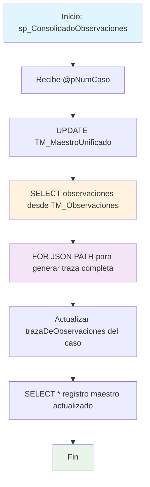

### sp_ConsolidadoObservaciones

Procedimiento utilitario que consolida y actualiza la traza completa de observaciones en formato JSON para un caso específico. Regenera el campo trazaDeObservaciones desde todas las observaciones relacionadas y retorna el registro maestro actualizado.

#### Diagrama de flujo


#### Procedimiento almacenado
```sql
/*--=================================================================================================================================================================
Author: Johana Henao
Create Date: 26/06/2024
Description: 1.Procedimiento almacenado para capturar los datos del conjunto de datos y consolidarlos en maestro unificado [CUN].[TM_MaestroUnificado]
Version: 01
Modificado por: María Cristina Díaz Torres
Fecha modificación: 2024/09/27
Descripción: Se actualiza el campo trazaDeObservaciones de la tabla [CUN].[TM_MaestroUnificado] con el json de la tabla [CUN].[TM_Observaciones]
EXEC CUN.sp_ConsolidadoObservaciones '000000001625'

EXEC CUN.sp_ConsolidadoObservaciones '000000002329'

EXEC CUN.sp_ConsolidadoObservaciones '000000009207'
--=================================================================================================================================================================\*/

CREATE Procedure [CUN].[sp_ConsolidadoObservaciones](@pNumCaso VARCHAR(250)) --[sp_Pruebas_Consulta]
AS
BEGIN

---

UPDATE A
SET A.trazaDeObservaciones = (SELECT B.Fecha AS fechaDeLaObservacion
,B.Usuario AS personaObservacion
,B.Condicion AS condicionOFormularioDeOrigen
,B.Observacion AS observacionesH
FROM CUN.TM_Observaciones B
WHERE B.Id_TM_MaestroUnificado = A.Id
FOR JSON PATH )
FROM CUN.TM_MaestroUnificado A
WHERE A.NumeroCaso = @pNumCaso;
--------------------------------------------------------------
SELECT A.\*
FROM [CUN].[TM_MaestroUnificado] A
WHERE A.NumeroCaso = @pNumCaso;
--------------------------------------------------------------
END;
```
#### Operaciones Principales

- Consolidación observaciones: SELECT desde TM_Observaciones por Id_TM_MaestroUnificado
- Generación JSON: FOR JSON PATH convierte observaciones en estructura JSON
- Actualización traza: UPDATE campo trazaDeObservaciones con JSON consolidado
- Filtrado específico: WHERE NumeroCaso para actualizar solo el caso solicitado
- Retorno actualizado: SELECT completo del registro maestro con traza renovada
- Sincronización datos: Garantiza coherencia entre observaciones y traza JSON

#### Tablas afectadas

##### Actualizadas:

- CUN.TM_MaestroUnificado: Campo trazaDeObservaciones actualizado con JSON consolidado

##### Consultadas:

- CUN.TM_Observaciones: Fuente de observaciones para generar traza JSON
- CUN.TM_MaestroUnificado: Consulta final para retornar registro actualizado

#### Procedimientos Almacenados Anidados