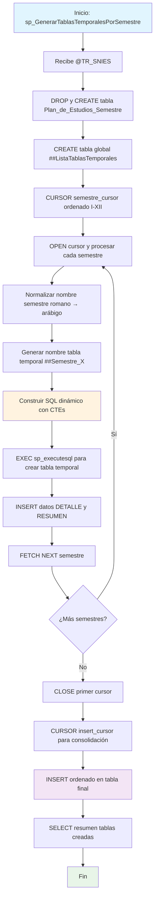

### sp_GenerarTablasTemporalesPorSemestre

Procedimiento complejo que genera dinámicamente tablas temporales globales para cada semestre de un programa académico específico. Utiliza doble cursor, SQL dinámico y CTEs para procesar, normalizar y consolidar datos curriculares con registros detalle y resumen por semestre.

#### Diagrama de flujo


#### Procedimiento almacenado
```sql
CREATE PROCEDURE RCAL.sp_GenerarTablasTemporalesPorSemestre
@TR_SNIES VARCHAR(50)
AS
BEGIN
SET NOCOUNT ON;

    drop table RCAL.Plan_de_Estudios_Semestre;

    CREATE TABLE RCAL.Plan_de_Estudios_Semestre (
    TR_SNIES NVARCHAR(50),
    Orden_Asignatura INT ,
    TR_Semestre NVARCHAR(100) ,
    TR_Asignatura NVARCHAR(255) ,
    TR_Tipologia NVARCHAR(50) ,
    TR_CreditosAcademicos INT ,
    TR_HorastrabajoAcom INT ,
    TR_HorastrabajoIndp INT ,
    TR_Horastrabajototales INT ,
    TipoRegistro NVARCHAR(20)  -- 'DETALLE' o 'RESUMEN'

);

    DECLARE @TR_SemestreOriginal VARCHAR(100);
    DECLARE @TR_Semestre VARCHAR(100);
    DECLARE @sql NVARCHAR(MAX);
    DECLARE @tabla_temp NVARCHAR(100);

    DROP TABLE IF EXISTS ##ListaTablasTemporales;
    CREATE TABLE ##ListaTablasTemporales (
        TablaTemporal NVARCHAR(128),
        TR_Semestre NVARCHAR(100)
    );

    -- ✅ CURSOR corregido usando subconsulta con DISTINCT + ORDER BY
    DECLARE semestre_cursor CURSOR FOR
    SELECT TR_Semestre
    FROM (
        SELECT DISTINCT TR_Semestre
        FROM RCAL.tbl_malla
        WHERE TR_SNIES = @TR_SNIES
    ) AS Semestres
    ORDER BY
        CASE TR_Semestre
            WHEN 'I SEMESTRE' THEN 1
            WHEN 'II SEMESTRE' THEN 2
            WHEN 'III SEMESTRE' THEN 3
            WHEN 'IV SEMESTRE' THEN 4
            WHEN 'V SEMESTRE' THEN 5
            WHEN 'VI SEMESTRE' THEN 6
            WHEN 'VII SEMESTRE' THEN 7
            WHEN 'VIII SEMESTRE' THEN 8
            WHEN 'IX SEMESTRE' THEN 9
            WHEN 'X SEMESTRE' THEN 10
            WHEN 'XI SEMESTRE' THEN 11
            WHEN 'XII SEMESTRE' THEN 12
            ELSE 999
        END;

    OPEN semestre_cursor;
    FETCH NEXT FROM semestre_cursor INTO @TR_SemestreOriginal;

    WHILE @@FETCH_STATUS = 0
    BEGIN
        -- Normalizar nombre del semestre
        SET @TR_Semestre =
            CASE @TR_SemestreOriginal
                WHEN 'I SEMESTRE' THEN '1 SEMESTRE'
                WHEN 'II SEMESTRE' THEN '2 SEMESTRE'
                WHEN 'III SEMESTRE' THEN '3 SEMESTRE'
                WHEN 'IV SEMESTRE' THEN '4 SEMESTRE'
                WHEN 'V SEMESTRE' THEN '5 SEMESTRE'
                WHEN 'VI SEMESTRE' THEN '6 SEMESTRE'
                WHEN 'VII SEMESTRE' THEN '7 SEMESTRE'
                WHEN 'VIII SEMESTRE' THEN '8 SEMESTRE'
                WHEN 'IX SEMESTRE' THEN '9 SEMESTRE'
                WHEN 'X SEMESTRE' THEN '10 SEMESTRE'
                WHEN 'XI SEMESTRE' THEN '11 SEMESTRE'
                WHEN 'XII SEMESTRE' THEN '12 SEMESTRE'
                ELSE @TR_SemestreOriginal
            END;

        SET @tabla_temp = '##Semestre_' + REPLACE(REPLACE(@TR_Semestre, ' ', ''), '.', '');

        INSERT INTO ##ListaTablasTemporales (TablaTemporal, TR_Semestre)
        VALUES (@tabla_temp, @TR_Semestre);


        DELETE FROM RCAL.Plan_de_Estudios_Semestre;
        --WHERE TR_SNIES = @TR_SNIES AND TR_Semestre = @TR_Semestre;

        SET @sql = '
        DROP TABLE IF EXISTS ' + @tabla_temp + ';
        CREATE TABLE ' + @tabla_temp + ' (
            TR_SNIES NVARCHAR(50),
            Orden_Asignatura INT,
            TR_Semestre NVARCHAR(100),
            TR_Asignatura NVARCHAR(255),
            TR_Tipologia NVARCHAR(50),
            TR_CreditosAcademicos INT,
            TR_HorastrabajoAcom INT,
            TR_HorastrabajoIndp INT,
            TR_Horastrabajototales INT,
            TipoRegistro NVARCHAR(20)
        );

        WITH MateriasUnicas AS (
            SELECT DISTINCT
                ''' + @TR_SNIES + ''' AS TR_SNIES,
                TR_Asignatura,
                TR_Tipologia,
                CAST(TR_CreditosAcademicos AS INT) AS TR_CreditosAcademicos,
                CAST(TR_HorastrabajoAcom AS INT) AS TR_HorastrabajoAcom,
                CAST(TR_HorastrabajoIndp AS INT) AS TR_HorastrabajoIndp,
                CAST(TR_Horastrabajototales AS INT) AS TR_Horastrabajototales
            FROM RCAL.tbl_malla
            WHERE TR_SNIES = ''' + @TR_SNIES + ''' AND TR_Semestre = ''' + @TR_SemestreOriginal + '''
        ),
        MateriasEnumeradas AS (
            SELECT
                TR_SNIES,
                ROW_NUMBER() OVER (ORDER BY TR_Asignatura) AS Orden_Asignatura,
                ''' + @TR_Semestre + ''' AS TR_Semestre,
                TR_Asignatura,
                TR_Tipologia,
                TR_CreditosAcademicos,
                TR_HorastrabajoAcom,
                TR_HorastrabajoIndp,
                TR_Horastrabajototales
            FROM MateriasUnicas
        )
        INSERT INTO ' + @tabla_temp + '
        SELECT
            TR_SNIES,
            Orden_Asignatura,
            TR_Semestre,
            TR_Asignatura,
            TR_Tipologia,
            TR_CreditosAcademicos,
            TR_HorastrabajoAcom,
            TR_HorastrabajoIndp,
            TR_Horastrabajototales,
            ''DETALLE''
        FROM MateriasEnumeradas;

        -- Insertar fila resumen
        INSERT INTO ' + @tabla_temp + '
        SELECT
            ''' + @TR_SNIES + ''',
            NULL,
            ''' + @TR_Semestre + ''',
            ''TOTAL'',
            NULL,
            SUM(CAST(TR_CreditosAcademicos AS INT)),
            SUM(CAST(TR_HorastrabajoAcom AS INT)),
            SUM(CAST(TR_HorastrabajoIndp AS INT)),
            SUM(CAST(TR_Horastrabajototales AS INT)),
            ''RESUMEN''
        FROM (
            SELECT DISTINCT
                TR_Asignatura,
                TR_CreditosAcademicos,
                TR_HorastrabajoAcom,
                TR_HorastrabajoIndp,
                TR_Horastrabajototales
            FROM RCAL.tbl_malla
            WHERE TR_SNIES = ''' + @TR_SNIES + ''' AND TR_Semestre = ''' + @TR_SemestreOriginal + '''
        ) AS sub;
        ';

        EXEC sp_executesql @sql;

        FETCH NEXT FROM semestre_cursor INTO @TR_SemestreOriginal;
    END

    CLOSE semestre_cursor;
    DEALLOCATE semestre_cursor;

    -- Insertar contenido ordenado en tabla final
    DECLARE @nombre_tabla NVARCHAR(128);
    DECLARE @sqlInsert NVARCHAR(MAX);

    DECLARE insert_cursor CURSOR FOR
    SELECT TablaTemporal FROM ##ListaTablasTemporales;

    OPEN insert_cursor;
    FETCH NEXT FROM insert_cursor INTO @nombre_tabla;

    WHILE @@FETCH_STATUS = 0
    BEGIN
        SET @sqlInsert = '
        INSERT INTO RCAL.Plan_de_Estudios_Semestre (
            TR_SNIES,
            Orden_Asignatura,
            TR_Semestre,
            TR_Asignatura,
            TR_Tipologia,
            TR_CreditosAcademicos,
            TR_HorastrabajoAcom,
            TR_HorastrabajoIndp,
            TR_Horastrabajototales,
            TipoRegistro
        )
        SELECT
            TR_SNIES,
            Orden_Asignatura,
            TR_Semestre,
            TR_Asignatura,
            TR_Tipologia,
            TR_CreditosAcademicos,
            TR_HorastrabajoAcom,
            TR_HorastrabajoIndp,
            TR_Horastrabajototales,
            TipoRegistro
        FROM ' + @nombre_tabla + '
        ORDER BY
            TRY_CAST(LEFT(TR_Semestre, CHARINDEX('' '', TR_Semestre + '' '') - 1) AS INT),
            Orden_Asignatura;';

        EXEC sp_executesql @sqlInsert;

        FETCH NEXT FROM insert_cursor INTO @nombre_tabla;
    END

    CLOSE insert_cursor;
    DEALLOCATE insert_cursor;

    -- Mostrar resumen de tablas creadas
    SELECT 'Estas son las tablas temporales generadas:' AS Mensaje;
    SELECT TablaTemporal, TR_Semestre FROM ##ListaTablasTemporales;

END;
```
#### Operaciones Principales

- Preparación estructura: DROP/CREATE tablas destino y control
- Doble cursor: Primer cursor para procesar semestres, segundo para consolidación
- SQL dinámico: Genera CTEs complejos con MateriasUnicas y MateriasEnumeradas
- Normalización: Convierte numeración romana a arábiga (I→1, II→2, etc.)
- Tablas temporales globales: Crea ##Semestre_X para cada semestre encontrado
- Doble inserción: Registros DETALLE por asignatura + RESUMEN totalizador
- Consolidación final: Segundo cursor inserta todo en tabla principal ordenada

#### Tablas afectadas

##### Creadas/Recreadas:

- RCAL.Plan_de_Estudios_Semestre: Tabla destino consolidada
- ##ListaTablasTemporales: Tabla global de control
- ##Semestre_X: Múltiples tablas temporales globales (una por semestre)

##### Consultadas:

- RCAL.tbl_malla: Fuente de datos curriculares por TR_SNIES

#### Procedimientos Almacenados Anidados