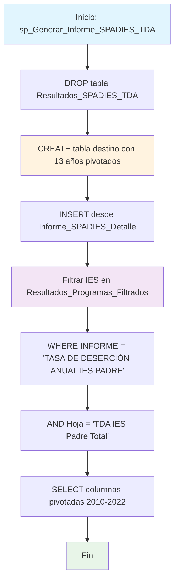

### sp_Generar_Informe_SPADIES_TDA

Procedimiento que genera un informe específico de Tasa de Deserción Anual (TDA) del sistema SPADIES para instituciones filtradas. Extrae datos históricos de deserción (2010-2022) solo para instituciones que aparecen en programas previamente filtrados, creando una tabla pivotada por años.

#### Diagrama de flujo


#### Procedimiento almacenado
```sql
CREATE PROCEDURE RCAL.sp_Generar_Informe_SPADIES_TDA
AS
BEGIN
SET NOCOUNT ON;

    -- 1. Eliminar tabla si ya existe
    DROP TABLE IF EXISTS RCAL.Resultados_SPADIES_TDA;

    -- 2. Crear tabla destino (sin Nivel_Formacion, Hoja, ni INFORME)
    CREATE TABLE RCAL.Resultados_SPADIES_TDA (
        CODIGO_IES_PADRE NVARCHAR(100),
        IES              NVARCHAR(255),
        [2010]           FLOAT,
        [2011]           FLOAT,
        [2012]           FLOAT,
        [2013]           FLOAT,
        [2014]           FLOAT,
        [2015]           FLOAT,
        [2016]           FLOAT,
        [2017]           FLOAT,
        [2018]           FLOAT,
        [2019]           FLOAT,
        [2020]           FLOAT,
        [2021]           FLOAT,
        [2022]           FLOAT
    );

    -- 3. Insertar los datos filtrados
    INSERT INTO RCAL.Resultados_SPADIES_TDA (
        CODIGO_IES_PADRE,
        IES,
        [2010], [2011], [2012], [2013], [2014],
        [2015], [2016], [2017], [2018], [2019],
        [2020], [2021], [2022]
    )
    SELECT
        [CODIGO IES PADRE],
        [IES],
        [2010], [2011], [2012], [2013], [2014],
        [2015], [2016], [2017], [2018], [2019],
        [2020], [2021], [2022]
    FROM [REGISTRO_CALIFICADO].[dbo].[Informe_SPADIES_Detalle]
    WHERE IES COLLATE Latin1_General_CI_AI IN (
        SELECT DISTINCT INSTITUCION
        FROM RCAL.Resultados_Programas_Filtrados
    )
    AND INFORME = 'TASA DE DESERCIÓN ANUAL IES PADRE'
    AND Hoja = 'TDA IES Padre Total';

    -- 4. Devolver los resultados
    --SELECT * FROM RCAL.Resultados_SPADIES_TDA;

END;
```
#### Operaciones Principales

- Recreación tabla: DROP/CREATE tabla Resultados_SPADIES_TDA con estructura pivotada
- Filtrado institucional: IN con subconsulta desde Resultados_Programas_Filtrados
- Filtrado específico: WHERE para obtener solo datos TDA de IES Padre
- Comparación flexible: COLLATE Latin1_General_CI_AI para matching insensible
- Inserción selectiva: Solo registros que cumplen filtros múltiples
- Estructura temporal: 13 columnas para años 2010-2022

#### Tablas afectadas

##### Creadas/Recreadas:

- RCAL.Resultados_SPADIES_TDA: Tabla destino con datos TDA pivotados

##### Consultadas:

- REGISTRO_CALIFICADO.dbo.Informe_SPADIES_Detalle: Fuente de datos SPADIES
- RCAL.Resultados_Programas_Filtrados: Filtro de instituciones relevantes (dependencia de otros procedimientos)

#### Procedimientos Almacenados Anidados