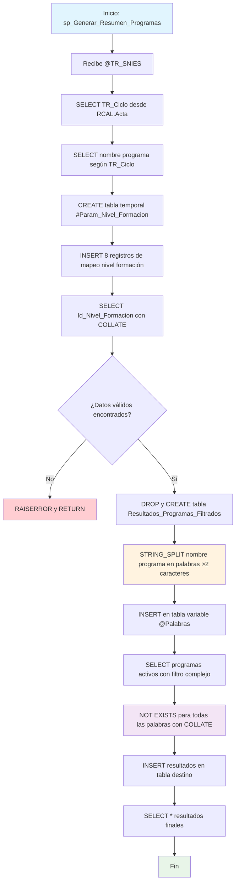

### sp_Generar_Resumen_Programas

Procedimiento inteligente que busca programas académicos similares basándose en análisis semántico del nombre del programa. Utiliza mapeo de niveles de formación, separación de palabras clave y filtrado por coincidencias múltiples para generar una lista de programas relacionados con collation insensible a tildes.

#### Diagrama de flujo


#### Procedimiento almacenado
```sql
CREATE PROCEDURE [RCAL].[sp_Generar_Resumen_Programas]
@TR_SNIES VARCHAR(50)
AS
BEGIN
SET NOCOUNT ON;

    -- 1. Declarar variables
    DECLARE @CategoriaAgrupada NVARCHAR(50);
    DECLARE @NombrePrograma NVARCHAR(255);
    DECLARE @IdNivelFormacion INT;

    -- 2. Obtener TR_Ciclo (categoría agrupada)
    SELECT @CategoriaAgrupada = TR_Ciclo
    FROM RCAL.Acta
    WHERE TR_SNIES = @TR_SNIES;

    -- 3. Obtener el nombre correcto del programa según TR_Ciclo
    SELECT
        @NombrePrograma =
            CASE
                WHEN TR_Ciclo = 'TECNÓLOGO' THEN TR_NombreProgramaTG
                WHEN TR_Ciclo = 'TÉCNICO PROFESIONAL' THEN TR_NombreProgramaTP
                WHEN TR_Ciclo = 'ESPECIALIZACIÓN' THEN TR_NombreProgramaEsp
                WHEN TR_Ciclo = 'PROFESIONAL' THEN TR_NombreProgramaPro
                ELSE NULL
            END
    FROM RCAL.Acta
    WHERE TR_SNIES = @TR_SNIES;

    -- 4. Crear tabla temporal Param_Nivel_Formacion
    CREATE TABLE #Param_Nivel_Formacion (
        Categoria_Agrupada NVARCHAR(50),
        Nivel_Academico NVARCHAR(50),
        Id_Nivel_Formacion INT,
        Descripcion_Formacion NVARCHAR(100)
    );

    INSERT INTO #Param_Nivel_Formacion
    VALUES
    ('ESPECIALIZACIÓN',     'POSGRADO', 1,  'Especialización universitaria'),
    ('POSGRADO',            'POSGRADO', 2,  'Maestría'),
    ('POSGRADO',            'POSGRADO', 3,  'Doctorado'),
    ('TÉCNICO PROFESIONAL', 'PREGRADO', 4,  'Formación técnica profesional'),
    ('TECNÓLOGO',           'PREGRADO', 5,  'Tecnológica'),
    ('PROFESIONAL',         'PREGRADO', 6,  'Universitario'),
    ('ESPECIALIZACIÓN',     'POSGRADO', 7,  'Especialización técnico profesional'),
    ('ESPECIALIZACIÓN',     'POSGRADO', 8,  'Especialización tecnológica');

    -- 5. Obtener ID del nivel de formación con collation insensible a tildes
    SELECT @IdNivelFormacion = Id_Nivel_Formacion
    FROM #Param_Nivel_Formacion
    WHERE Categoria_Agrupada COLLATE Latin1_General_CI_AI = @CategoriaAgrupada COLLATE Latin1_General_CI_AI;

    -- 6. Validar datos requeridos
    IF @NombrePrograma IS NULL OR @IdNivelFormacion IS NULL
    BEGIN
        RAISERROR('No se encontraron datos válidos en ACTA o Param_Nivel_Formacion para el TR_SNIES.', 16, 1);
        RETURN;
    END

    -- 7. Eliminar tabla destino si existe
    DROP TABLE IF EXISTS RCAL.Resultados_Programas_Filtrados;

    -- 8. Crear tabla destino con TR_SNIES incluido
    CREATE TABLE RCAL.Resultados_Programas_Filtrados (
        TR_SNIES                    VARCHAR(50),
        CODIGO_SNIES_DEL_PROGRAMA  NVARCHAR(50),
        INSTITUCION                NVARCHAR(255),
        PROGRAMA                   NVARCHAR(255),
        MODALIDAD                  NVARCHAR(100),
        CREDITOS                   INT,
        PERIODOS                   INT,
        PERIODICIDAD               NVARCHAR(50),
        MUNICIPIO                  NVARCHAR(100)
    );

    -- 9. Separar palabras del nombre del programa
    DECLARE @Palabras TABLE (Palabra NVARCHAR(100));

    INSERT INTO @Palabras (Palabra)
    SELECT value
    FROM STRING_SPLIT(@NombrePrograma, ' ')
    WHERE LEN(value) > 2;

    -- 10. Insertar los datos incluyendo TR_SNIES, con comparaciones insensibles a tildes
    INSERT INTO RCAL.Resultados_Programas_Filtrados (
        TR_SNIES,
        CODIGO_SNIES_DEL_PROGRAMA,
        INSTITUCION,
        PROGRAMA,
        MODALIDAD,
        CREDITOS,
        PERIODOS,
        PERIODICIDAD,
        MUNICIPIO
    )
    SELECT
        @TR_SNIES,
        P.CODIGO_SNIES_DEL_PROGRAMA,
        P.NOMBRE_INSTITUCION,
        P.NOMBRE_DEL_PROGRAMA,
        P.MODALIDAD,
        P.NUMERO_CREDITOS,
        P.NUMERO_PERIODOS_DE_DURACION,
        P.PERIODICIDAD,
        P.MUNICIPIO_OFERTA_PROGRAMA
    FROM RCAL.Programas_SNIES P
    WHERE P.ESTADO_PROGRAMA = 'Activo'
      -- AND P.id_nivel_formacion = @IdNivelFormacion
      AND NOT EXISTS (
            SELECT 1
            FROM @Palabras W
            WHERE P.NOMBRE_DEL_PROGRAMA COLLATE Latin1_General_CI_AI NOT LIKE '%' + W.Palabra + '%' COLLATE Latin1_General_CI_AI
      );

    -- 11. Mostrar resultados al final
    SELECT * FROM RCAL.Resultados_Programas_Filtrados;

END;

```
#### Operaciones Principales

- Extracción contexto: Obtiene TR_Ciclo y nombre programa específico según tipo
- Mapeo niveles: Tabla temporal con 8 categorías de formación académica
- Validación datos: RAISERROR si no encuentra información válida
- Análisis semántico: STRING_SPLIT para extraer palabras clave (>2 caracteres)
- Filtrado inteligente: NOT EXISTS garantiza que ALL palabras estén presentes
- Comparación flexible: COLLATE Latin1_General_CI_AI insensible a tildes/mayúsculas

#### Tablas afectadas

##### Creadas/Recreadas:

- RCAL.Resultados_Programas_Filtrados: Tabla destino con programas similares
- #Param_Nivel_Formacion: Tabla temporal con mapeo de niveles académicos

##### Consultadas:

- RCAL.Acta: Fuente de información del programa base
- RCAL.Programas_SNIES: Catálogo nacional de programas académicos

##### Variables temporales:

- @Palabras: Tabla variable con palabras clave del programa

#### Procedimientos Almacenados Anidados