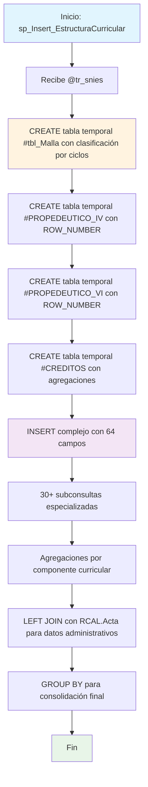

### sp_Insert_EstructuraCurricular

Procedimiento complejo que genera la estructura curricular completa de un programa académico específico. Procesa mallas curriculares mediante tablas temporales, calcula agregaciones por ciclos educativos (Técnico/Tecnólogo/Profesional) y consolida 64 campos diferentes en una sola inserción con subconsultas especializadas.

#### Diagrama de flujo


#### Procedimiento almacenado
```sql
-- exec [dbo].[sp_Insert_EstructuraCurricular] '202500160'
CREATE PROCEDURE [dbo].[sp_Insert_EstructuraCurricular]
@tr_snies VARCHAR(50)
AS
BEGIN
SET NOCOUNT ON;

    -- exec [dbo].[sp_Insert_EstructuraCurricular] '202500195'
    -----------------------------
    -- 1. Generar tabla temporal #tbl_Malla
    -----------------------------
    SELECT DISTINCT
    TE_Componente,
    TR_Asignatura,
    CAST(TR_CreditosAcademicos AS INT) AS TR_CreditosAcademicos,
    CAST(TR_Horastrabajototales AS INT) AS TR_Horastrabajototales,
    CAST(TR_HorastrabajoAcom AS INT) AS TR_HorastrabajoAcom,
    CAST(TR_HorastrabajoIndp AS INT) AS TR_HorastrabajoIndp,
    TR_SNIES,
    TR_Semestre,
    CASE
        WHEN TR_Semestre IN ('I SEMESTRE', 'II SEMESTRE', 'III SEMESTRE', 'IV SEMESTRE') THEN 'TECNICO'
        WHEN TR_Semestre IN ('V SEMESTRE', 'VI SEMESTRE', 'IX SEMESTRE') THEN 'TECNOLOGO'
        WHEN TR_Semestre IN ('VII SEMESTRE', 'VIII SEMESTRE') THEN 'PROFESIONAL'
        ELSE 'SIN DEFINIR' -- Para casos no contemplados
    END AS Ciclos

INTO #tbl_Malla
FROM rcal.tbl_Malla
WHERE TR_SNIES = @tr_snies;

    -----------------------------
    -- 2. Generar tabla temporal #PROPEDEUTICO_IV
    -----------------------------
    SELECT DISTINCT
        ROW_NUMBER() OVER (ORDER BY TR_Asignatura) AS Item,
        TE_Componente,
        TR_Asignatura,
        TR_SEMESTRE,
        TR_CreditosAcademicos,
        TR_Horastrabajototales,
        TR_HorastrabajoAcom,
        TR_HorastrabajoIndp,
        TR_SNIES
    INTO #PROPEDEUTICO_IV
    FROM rcal.tbl_Malla
    WHERE TE_Componente = 'PROPEDÉUTICO'
      AND TR_SNIES = @tr_snies
      AND TR_Semestre = 'IV SEMESTRE';

    -----------------------------
    -- 3. Generar tabla temporal #PROPEDEUTICO_VI
    -----------------------------
    SELECT DISTINCT
        ROW_NUMBER() OVER (ORDER BY TR_Asignatura) AS Item,
        TE_Componente,
        TR_Asignatura,
        TR_SEMESTRE,
        TR_CreditosAcademicos,
        TR_Horastrabajototales,
        TR_HorastrabajoAcom,
        TR_HorastrabajoIndp,
        TR_SNIES
    INTO #PROPEDEUTICO_VI
    FROM rcal.tbl_Malla
    WHERE TE_Componente = 'PROPEDÉUTICO'
      AND TR_SNIES = @tr_snies
      AND TR_Semestre = 'VI SEMESTRE';

    -----------------------------
    -- 4. Generar tabla temporal #CREDITOS
    -----------------------------
    SELECT
        CASE
            WHEN TR_Semestre IN ('I SEMESTRE','II SEMESTRE','III SEMESTRE','IV SEMESTRE') THEN 'TR_Creditos_Tec_Tecno_V2'
            WHEN TR_Semestre IN ('V SEMESTRE','VI SEMESTRE') THEN 'TR_Creditos_Tecno_Prof_V2'
        END AS Clasificacion_Creditos,
        SUM(CAST(TR_CreditosAcademicos AS INT)) AS Total_CreditosAcademicos
    INTO #CREDITOS
    FROM rcal.tbl_Malla
    WHERE TR_SNIES = @tr_snies
      AND TE_Componente <> 'PROPEDÉUTICO'
      AND TR_Semestre IN ('I SEMESTRE','II SEMESTRE','III SEMESTRE','IV SEMESTRE','V SEMESTRE','VI SEMESTRE')
    GROUP BY
        CASE
            WHEN TR_Semestre IN ('I SEMESTRE','II SEMESTRE','III SEMESTRE','IV SEMESTRE') THEN 'TR_Creditos_Tec_Tecno_V2'
            WHEN TR_Semestre IN ('V SEMESTRE','VI SEMESTRE') THEN 'TR_Creditos_Tecno_Prof_V2'
        END;

    -----------------------------
    -- 5. Insertar en la tabla de destino
    -----------------------------
    INSERT INTO Registro_Calificado.RCAL.tbl_EstructuraCurricular
    (
        TR_SNIES,
        TR_CredProgramTotal,
        TR_AsignaturasPropedeuticas,
        TR_CreditosPropedeuticos,
        TR_Modalidades,
        TR_Regionales,
        TR_DuracionTP,
        TR_ModalidadAnt,
        TR_CreditosTP,
        TR_CreditosTG,
        TR_NivelInglesTG,
        TR_NivelInglesTP,
        TR_NivelInglesPro,
        TR_Modalidad,
        TR_Duracion,
        Cal_UnidadPeriodicidad,
        TR_CreditosPro,
        TR_NivelInglesEsp,
        TR_DuracionPro,
        TR_DuracionTG,
        TR_AñoActual,
        TR_ListaMaterias,
        TR_ListaMateria_Creditos,
        TR_ListaMateria_Horas,
        TR_CreditosAcademicos,
        TR_CreditosElectivos,
        TR_CreditosDisciplinar,
        TR_TotalCreditos,
        TE_CursosTransversal,
        TE_CursosElectivo,
        TE_CursoDisciplinar,
        TE_CursosComplementario,
        TE_CursosProfundizacion,
        TR_CursosTransversales,
        TR_CursosDisciplinares,
        TR_CursosElectivas,
        TR_CursosInvestigacion,
        TR_CursoIntegracion,
        TR_CursoProyectoI,
        TR_CursoProyectoII,
        TE_PerfilEgreso,
        TE_PerfilIngreso,
        TE_PerfilOcupacional,
        TE_PerfilProfesional,
        TR_RAE,
        TE_RAE,
        TE_Componente,
        TR_NivelFormacion,
        TR_Min_Max_Asignaturas,
        TR_Min_Max_Creditos_V2,
        TR_Semestre_Asignatura_Contenido_V2,
        TR_Creditos_Tec_Tecno_V2,
        TR_Creditos_Tecno_Prof_V2,
        TR_Asignaturas_Tec_Tecno_V2,
        TR_I_Asignatura_Tec_Tecno_V2,
        TR_II_Asignatura_Tec_Tecno_V2,
        TR_III_Asignatura_Tec_Tecno_V2,
        TR_Asignaturas_Tecno_Prof_V2,
        TR_I_Asignatura_Tecno_Prof_V2,
        TR_II_Asignatura_Tecno_Prof_V2,
        TR_III_Asignatura_Tecno_Prof_V2,
        Asignaturas_Propedeuticas,
        Horas_Acomp_Presencial,
        Horas_Acomp_Virtual
    )
    SELECT
        a.TR_SNIES,                                                                          -- 1. TR_SNIES
        (SELECT SUM(m.TR_CreditosAcademicos)
         FROM #tbl_Malla m
         WHERE m.TR_SNIES = a.TR_SNIES),                                                     -- 2. TR_CredProgramTotal
        (SELECT STRING_AGG(m.TR_Asignatura, ' / ')
         FROM #tbl_Malla m
         WHERE m.TR_SNIES = a.TR_SNIES AND m.TE_Componente = 'PROPEDÉUTICO'),                  -- 3. TR_AsignaturasPropedeuticas
        (SELECT SUM(m.TR_CreditosAcademicos)
         FROM #tbl_Malla m
         WHERE m.TR_SNIES = a.TR_SNIES AND m.TE_Componente = 'PROPEDÉUTICO'),                  -- 4. TR_CreditosPropedeuticos
        b.TR_Modalidad,                                                                       -- 5. TR_Modalidades
        b.TR_Regionales,                                                                      -- 6. TR_Regionales
        b.TR_DuracionTP,                                                                      -- 7. TR_DuracionTP
        b.TR_Modalidad,                                                                       -- 8. TR_ModalidadAnt
        (select sum(TR_CreditosAcademicos)
    	from #tbl_Malla m
    	where m.TR_SNIES = a.TR_SNIES and Ciclos='TECNICO'),								  -- 9. TR_CreditosTP
        (select sum(TR_CreditosAcademicos)
    	from #tbl_Malla m
    	where m.TR_SNIES = a.TR_SNIES and Ciclos='TECNOLOGO'),                                -- 10. TR_CreditosTG
        'A1',                                                                                 -- 11. TR_NivelInglesTG
        'A2',                                                                                 -- 12. TR_NivelInglesTP
        'B1',                                                                                 -- 13. TR_NivelInglesPro
        b.TR_Modalidad,                                                                       -- 14. TR_Modalidad
        (SELECT COUNT(DISTINCT m.TR_Semestre)
         FROM RCAL.tbl_Malla m
         WHERE m.TR_SNIES = a.TR_SNIES),                                                     -- 15. TR_Duracion
        b.TR_PeriocidadAdmision,                                                              -- 16. Cal_UnidadPeriodicidad
        (select sum(TR_CreditosAcademicos)
    	from #tbl_Malla m
    	where m.TR_SNIES = a.TR_SNIES and Ciclos='PROFESIONAL'),                              -- 17. TR_CreditosPro
        'B1',                                                                                 -- 18. TR_NivelInglesEsp
        b.TR_DuracionPro,                                                                     -- 19. TR_DuracionPro
        b.TR_DuracionTG,                                                                      -- 20. TR_DuracionTG
        YEAR(GETDATE()),                                                                      -- 21. TR_AñoActual
        (SELECT COUNT(DISTINCT m.TR_Asignatura)
         FROM RCAL.tbl_Malla m
         WHERE m.TR_SNIES = a.TR_SNIES),                                                     -- 22. TR_ListaMaterias
        (SELECT SUM(m.TR_CreditosAcademicos)
         FROM #tbl_Malla m
         WHERE m.TR_SNIES = a.TR_SNIES),                                                     -- 23. TR_ListaMateria_Creditos
        (SELECT SUM(m.TR_Horastrabajototales)
         FROM #tbl_Malla m
         WHERE m.TR_SNIES = a.TR_SNIES),                                                     -- 24. TR_ListaMateria_Horas
        (SELECT SUM(m.TR_CreditosAcademicos)
         FROM #tbl_Malla m
         WHERE m.TR_SNIES = a.TR_SNIES AND m.TE_Componente = 'TRANSVERSAL- INSTITUCIONAL'),   -- 25. TR_CreditosAcademicos
        (SELECT SUM(m.TR_CreditosAcademicos)
         FROM #tbl_Malla m
         WHERE m.TE_Componente = 'ELECTIVOS' AND m.TR_SNIES = a.TR_SNIES),                   -- 26. TR_CreditosElectivos
        (SELECT SUM(m.TR_CreditosAcademicos)
         FROM #tbl_Malla m
         WHERE m.TE_Componente = 'DISCIPLINAR' AND m.TR_SNIES = a.TR_SNIES),                   -- 27. TR_CreditosDisciplinar
        (SELECT SUM(m.TR_CreditosAcademicos)
         FROM #tbl_Malla m
         WHERE m.TR_SNIES = a.TR_SNIES),                                                     -- 28. TR_TotalCreditos
        (SELECT STRING_AGG(m.TR_Asignatura, ' / ')
         FROM #tbl_Malla m
         WHERE m.TR_SNIES = a.TR_SNIES AND m.TE_Componente = 'TRANSVERSAL- INSTITUCIONAL'),   -- 29. TE_CursosTransversal
        (SELECT STRING_AGG(m.TR_Asignatura, ' / ')
         FROM #tbl_Malla m
         WHERE m.TR_SNIES = a.TR_SNIES AND m.TE_Componente = 'ELECTIVOS'),                     -- 30. TE_CursosElectivo
        (SELECT STRING_AGG(m.TR_Asignatura, ' / ')
         FROM #tbl_Malla m
         WHERE m.TR_SNIES = a.TR_SNIES AND m.TE_Componente = 'DISCIPLINAR'),                     -- 31. TE_CursoDisciplinar
        0,                                                                                    -- 32. TE_CursosComplementario
        0,                                                                                    -- 33. TE_CursosProfundizacion
        0,                                                                                    -- 34. TR_CursosTransversales
        0,                                                                                    -- 35. TR_CursosDisciplinares
        (SELECT STRING_AGG(m.TR_Asignatura, ' / ')
         FROM #tbl_Malla m
         WHERE m.TR_SNIES = a.TR_SNIES AND m.TE_Componente = 'ELECTIVOS'),                     -- 36. TR_CursosElectivas
        0,                                                                                    -- 37. TR_CursosInvestigacion
        0,                                                                                    -- 38. TR_CursoIntegracion
        0,                                                                                    -- 39. TR_CursoProyectoI
        0,                                                                                    -- 40. TR_CursoProyectoII
        0,                                                                                    -- 41. TE_PerfilEgreso
        0,                                                                                    -- 42. TE_PerfilIngreso
        0,                                                                                    -- 43. TE_PerfilOcupacional
        0,                                                                                    -- 44. TE_PerfilProfesional
        0,                                                                                    -- 45. TR_RAE
        0,                                                                                    -- 46. TE_RAE
        0,                                                                                    -- 47. TE_Componente
        b.TR_Nivel,                                                                         -- 48. TR_NivelFormacion
        '4 y 8',                                                                                    -- 49. TR_Min_Max_Asignaturas
        '13 y 17',                                                                                    -- 50. TR_Min_Max_Creditos_V2
        0,                                                                                    -- 51. TR_Semestre_Asignatura_Contenido_V2
        (SELECT Total_CreditosAcademicos
         FROM #CREDITOS
         WHERE Clasificacion_Creditos = 'TR_Creditos_Tec_Tecno_V2'),                         -- 52. TR_Creditos_Tec_Tecno_V2
        (SELECT Total_CreditosAcademicos
         FROM #CREDITOS
         WHERE Clasificacion_Creditos = 'TR_Creditos_Tecno_Prof_V2'),                         -- 53. TR_Creditos_Tecno_Prof_V2
        (SELECT COUNT(*) FROM #PROPEDEUTICO_IV),                                                 -- 54. TR_Asignaturas_Tec_Tecno_V2
        ISNULL((SELECT TR_Asignatura FROM #PROPEDEUTICO_IV WHERE Item = 1), '-'),               -- 55. TR_I_Asignatura_Tec_Tecno_V2
        ISNULL((SELECT TR_Asignatura FROM #PROPEDEUTICO_IV WHERE Item = 2), '-'),               -- 56. TR_II_Asignatura_Tec_Tecno_V2
        ISNULL((SELECT TR_Asignatura FROM #PROPEDEUTICO_IV WHERE Item = 3), '-'),               -- 57. TR_III_Asignatura_Tec_Tecno_V2
        (SELECT COUNT(*) FROM #PROPEDEUTICO_VI),                                                 -- 58. TR_Asignaturas_Tecno_Prof_V2
        ISNULL((SELECT TR_Asignatura FROM #PROPEDEUTICO_VI WHERE Item = 1), '-'),               -- 59. TR_I_Asignatura_Tecno_Prof_V2
        ISNULL((SELECT TR_Asignatura FROM #PROPEDEUTICO_VI WHERE Item = 2), '-'),               -- 60. TR_II_Asignatura_Tecno_Prof_V2
        ISNULL((SELECT TR_Asignatura FROM #PROPEDEUTICO_VI WHERE Item = 3), '-'),               -- 61. TR_III_Asignatura_Tecno_Prof_V2
        (SELECT STRING_AGG(m.TR_Asignatura, ' / ')
         FROM #tbl_Malla m
         WHERE m.TR_SNIES = a.TR_SNIES AND m.TE_Componente = 'PROPEDÉUTICO'),                  -- 62. Asignaturas_Propedeuticas
        2,                                                                                    -- 63. Horas_Acomp_Presencial
        2                                                                                     -- 64. Horas_Acomp_Virtual
    FROM
        RCAL.tbl_Malla a
    LEFT JOIN
        RCAL.Acta b ON a.TR_SNIES = b.TR_SNIES
    WHERE
        a.TR_SNIES = @tr_snies
    GROUP BY
        a.TR_SNIES,
        b.TR_Modalidad,
        b.TR_Regionales,
        b.TR_DuracionTP,
        b.TR_Modalidad,
        b.TR_PeriocidadAdmision,
        b.TR_DuracionPro,
        b.TR_DuracionTG,
        b.TR_Nivel;

END

```
#### Operaciones Principales

- Preparación datos: 4 tablas temporales con clasificaciones específicas por ciclo educativo
- Clasificación automática: CASE WHEN para asignar ciclos según semestres (I-IV=Técnico, V-VI=Tecnólogo, VII-VIII=Profesional)
- Conteos propedéuticos: ROW_NUMBER() para ordenar asignaturas propedéuticas por semestre
- Agregaciones múltiples: SUM, COUNT, STRING_AGG por diferentes componentes curriculares
- Inserción masiva: 64 campos con subconsultas especializadas para cada métrica
- Valores calculados: Niveles de inglés, duración, créditos por ciclo, etc.

#### Tablas afectadas

##### Actualizadas:

- Registro_Calificado.RCAL.tbl_EstructuraCurricular: Tabla destino con estructura curricular completa

##### Consultadas:

- RCAL.tbl_Malla: Fuente principal de datos curriculares
- RCAL.Acta: Datos administrativos del programa (LEFT JOIN)

##### Temporales:

- #tbl_Malla: Datos base con clasificación de ciclos
- #PROPEDEUTICO_IV: Asignaturas propedéuticas de IV semestre ordenadas
- #PROPEDEUTICO_VI: Asignaturas propedéuticas de VI semestre ordenadas
- #CREDITOS: Agregaciones de créditos por clasificación


#### Procedimientos Almacenados Anidados