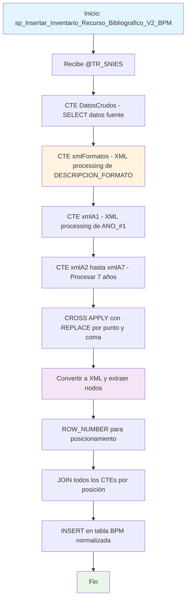

### sp_Insertar_Inventario_Recurso_Bibliografico_V2_BPM

Procedimiento avanzado que normaliza datos bibliográficos mediante procesamiento XML. Transforma campos delimitados por punto y coma en registros individuales, utilizando CTEs complejos para descomponer y reorganizar inventarios de recursos bibliográficos por año y formato.

#### Diagrama de flujo


#### Procedimiento almacenado
```sql
CREATE PROCEDURE [RCAL].[sp_Insertar_Inventario_Recurso_Bibliografico_V2_BPM]
@TR_SNIES VARCHAR(20)
AS
BEGIN
SET NOCOUNT ON;

    -- Datos de entrada
    WITH DatosCrudos AS (
        SELECT
            TR_SNIES,
            DESCRIPCION_FORMATO,
            ANO_#1,
            [ANO_#2],
            [ANO_#3],
            [ANO_#4],
            [ANO_#5],
            [ANO_#6],
            [ANO_#7],
            Enlace
        FROM RCAL.Inventario_Recurso_Bibliografico_V2
        WHERE TR_SNIES = @TR_SNIES
    ),
    xmlFormatos AS (
        SELECT ROW_NUMBER() OVER (ORDER BY (SELECT NULL)) AS Pos,
               LTRIM(RTRIM(x.value('.', 'NVARCHAR(MAX)'))) AS Formato
        FROM DatosCrudos
        CROSS APPLY (SELECT CAST('<x>' + REPLACE(DESCRIPCION_FORMATO, ';', '</x><x>') + '</x>' AS XML)) AS T(xml)
        CROSS APPLY xml.nodes('/x') AS Nodo(x)
    ),
    xmlA1 AS (
        SELECT ROW_NUMBER() OVER (ORDER BY (SELECT NULL)) AS Pos,
               LTRIM(RTRIM(x.value('.', 'NVARCHAR(100)'))) AS Valor
        FROM DatosCrudos
        CROSS APPLY (SELECT CAST('<x>' + REPLACE([ANO_#1], ';', '</x><x>') + '</x>' AS XML)) AS T(xml)
        CROSS APPLY xml.nodes('/x') AS Nodo(x)
    ),
    xmlA2 AS (
        SELECT ROW_NUMBER() OVER (ORDER BY (SELECT NULL)) AS Pos,
               LTRIM(RTRIM(x.value('.', 'NVARCHAR(100)'))) AS Valor
        FROM DatosCrudos
        CROSS APPLY (SELECT CAST('<x>' + REPLACE([ANO_#2], ';', '</x><x>') + '</x>' AS XML)) AS T(xml)
        CROSS APPLY xml.nodes('/x') AS Nodo(x)
    ),
    xmlA3 AS (
        SELECT ROW_NUMBER() OVER (ORDER BY (SELECT NULL)) AS Pos,
               LTRIM(RTRIM(x.value('.', 'NVARCHAR(100)'))) AS Valor
        FROM DatosCrudos
        CROSS APPLY (SELECT CAST('<x>' + REPLACE([ANO_#3], ';', '</x><x>') + '</x>' AS XML)) AS T(xml)
        CROSS APPLY xml.nodes('/x') AS Nodo(x)
    ),
    xmlA4 AS (
        SELECT ROW_NUMBER() OVER (ORDER BY (SELECT NULL)) AS Pos,
               LTRIM(RTRIM(x.value('.', 'NVARCHAR(100)'))) AS Valor
        FROM DatosCrudos
        CROSS APPLY (SELECT CAST('<x>' + REPLACE([ANO_#4], ';', '</x><x>') + '</x>' AS XML)) AS T(xml)
        CROSS APPLY xml.nodes('/x') AS Nodo(x)
    ),
    xmlA5 AS (
        SELECT ROW_NUMBER() OVER (ORDER BY (SELECT NULL)) AS Pos,
               LTRIM(RTRIM(x.value('.', 'NVARCHAR(100)'))) AS Valor
        FROM DatosCrudos
        CROSS APPLY (SELECT CAST('<x>' + REPLACE([ANO_#5], ';', '</x><x>') + '</x>' AS XML)) AS T(xml)
        CROSS APPLY xml.nodes('/x') AS Nodo(x)
    ),
    xmlA6 AS (
        SELECT ROW_NUMBER() OVER (ORDER BY (SELECT NULL)) AS Pos,
               LTRIM(RTRIM(x.value('.', 'NVARCHAR(100)'))) AS Valor
        FROM DatosCrudos
        CROSS APPLY (SELECT CAST('<x>' + REPLACE([ANO_#6], ';', '</x><x>') + '</x>' AS XML)) AS T(xml)
        CROSS APPLY xml.nodes('/x') AS Nodo(x)
    ),
    xmlA7 AS (
        SELECT ROW_NUMBER() OVER (ORDER BY (SELECT NULL)) AS Pos,
               LTRIM(RTRIM(x.value('.', 'NVARCHAR(100)'))) AS Valor
        FROM DatosCrudos
        CROSS APPLY (SELECT CAST('<x>' + REPLACE([ANO_#7], ';', '</x><x>') + '</x>' AS XML)) AS T(xml)
        CROSS APPLY xml.nodes('/x') AS Nodo(x)
    )

    -- Inserción final
    INSERT INTO [RCAL].[Inventario_Recurso_Bibliografico_V2_BPM] (
        TR_SNIES,
        DESCRIPCION_FORMATO,
        [ANO_#1],
        [ANO_#2],
        [ANO_#3],
        [ANO_#4],
        [ANO_#5],
        [ANO_#6],
        [ANO_#7],
        Enlace
    )
    SELECT
        d.TR_SNIES,
        f.Formato,
        a1.Valor,
        a2.Valor,
        a3.Valor,
        a4.Valor,
        a5.Valor,
        a6.Valor,
        a7.Valor,
        d.Enlace
    FROM DatosCrudos d
    JOIN xmlFormatos f ON 1 = 1 AND f.Pos <= 100  -- para evitar duplicados extremos
    JOIN xmlA1 a1 ON f.Pos = a1.Pos
    JOIN xmlA2 a2 ON f.Pos = a2.Pos
    JOIN xmlA3 a3 ON f.Pos = a3.Pos
    JOIN xmlA4 a4 ON f.Pos = a4.Pos
    JOIN xmlA5 a5 ON f.Pos = a5.Pos
    JOIN xmlA6 a6 ON f.Pos = a6.Pos
    JOIN xmlA7 a7 ON f.Pos = a7.Pos;

END;
```
#### Operaciones Principales

- Extracción datos: CTE DatosCrudos obtiene registros por TR_SNIES específico
- Procesamiento XML: 8 CTEs independientes procesan campos delimitados
- Transformación formato: REPLACE convierte punto y coma en etiquetas XML
- Extracción nodos: xml.nodes() descompone cada valor individual
- Normalización posicional: ROW_NUMBER() sincroniza correspondencia entre CTEs
- Reconstrucción relacional: JOIN por posición para combinar valores relacionados

#### Tablas afectadas

##### Actualizadas:

- RCAL.Inventario_Recurso_Bibliografico_V2_BPM: Tabla destino normalizada

##### Consultadas:

- RCAL.Inventario_Recurso_Bibliografico_V2: Tabla fuente con datos delimitados

#### Procedimientos Almacenados Anidados