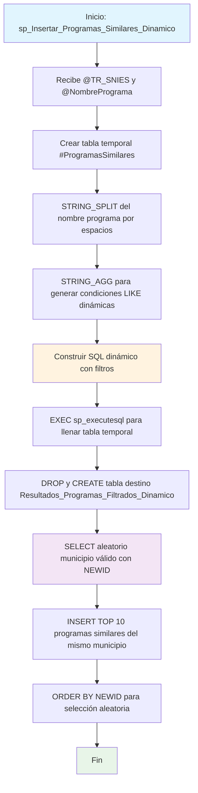

### sp_Insertar_Programas_Similares_Dinamico

Procedimiento dinámico que busca programas académicos similares basándose en palabras clave del nombre del programa. Utiliza SQL dinámico, funciones fonéticas (DIFFERENCE) y selección aleatoria para generar una muestra de 10 programas comparables por municipio específico.

#### Diagrama de flujo


#### Procedimiento almacenado
```sql
CREATE PROCEDURE [RCAL].[sp_Insertar_Programas_Similares_Dinamico]
@TR_SNIES VARCHAR(50),
@NombrePrograma NVARCHAR(200)
AS
BEGIN
SET NOCOUNT ON;

    -- 1. Construcción dinámica de condiciones LIKE
    DECLARE @sql NVARCHAR(MAX) = '';
    DECLARE @whereLike NVARCHAR(MAX) = '';
    DECLARE @NombreBase NVARCHAR(200) = QUOTENAME(@NombrePrograma, '''');

    -- 2. Crear tabla temporal para guardar resultados similares dinámicos
    DROP TABLE IF EXISTS #ProgramasSimilares;
    CREATE TABLE #ProgramasSimilares (
        NOMBRE_DEL_PROGRAMA NVARCHAR(255)
    );

    SELECT @whereLike = STRING_AGG('P.NOMBRE_DEL_PROGRAMA LIKE ''%'+value+'%''', ' AND ')
    FROM STRING_SPLIT(@NombrePrograma, ' ')
    WHERE LEN(value) > 2;

    -- 3. Armar SQL que llena #ProgramasSimilares
    SET @sql = '
        INSERT INTO #ProgramasSimilares (NOMBRE_DEL_PROGRAMA)
        SELECT DISTINCT P.NOMBRE_DEL_PROGRAMA
        FROM RCAL.Programas_SNIES P
        WHERE ' + @whereLike + '
          AND DIFFERENCE(P.NOMBRE_DEL_PROGRAMA, ' + @NombreBase + ') >= 2
    ';

    EXEC sp_executesql @sql;

    -- 4. Eliminar tabla destino si ya existe
    DROP TABLE IF EXISTS RCAL.Resultados_Programas_Filtrados_Dinamico;

    CREATE TABLE RCAL.Resultados_Programas_Filtrados_Dinamico (
        TR_SNIES                    VARCHAR(50),
        CODIGO_SNIES_DEL_PROGRAMA  NVARCHAR(50),
        INSTITUCION                NVARCHAR(255),
        PROGRAMA                   NVARCHAR(255),
        MODALIDAD                  NVARCHAR(100),
        CREDITOS                   INT,
        PERIODOS                   INT,
        PERIODICIDAD               NVARCHAR(50),
        MUNICIPIO                  NVARCHAR(100)
    );

    -- 5. Obtener municipio válido aleatorio de los programas similares
    DECLARE @MunicipioFiltro NVARCHAR(100);

    SELECT TOP 1 @MunicipioFiltro = P.MUNICIPIO_OFERTA_PROGRAMA
    FROM RCAL.Programas_SNIES P
    INNER JOIN #ProgramasSimilares S ON LTRIM(RTRIM(P.NOMBRE_DEL_PROGRAMA)) = LTRIM(RTRIM(S.NOMBRE_DEL_PROGRAMA))
    WHERE P.MUNICIPIO_OFERTA_PROGRAMA IS NOT NULL
    ORDER BY NEWID();

    -- 6. Insertar 10 registros aleatorios en tabla destino
    INSERT INTO RCAL.Resultados_Programas_Filtrados_Dinamico (
        TR_SNIES,
        CODIGO_SNIES_DEL_PROGRAMA,
        INSTITUCION,
        PROGRAMA,
        MODALIDAD,
        CREDITOS,
        PERIODOS,
        PERIODICIDAD,
        MUNICIPIO
    )
    SELECT TOP (10)
        @TR_SNIES AS TR_SNIES,
        P.CODIGO_SNIES_DEL_PROGRAMA,
        P.NOMBRE_INSTITUCION,
        P.NOMBRE_DEL_PROGRAMA,
        P.MODALIDAD,
        P.NUMERO_CREDITOS,
        P.NUMERO_PERIODOS_DE_DURACION,
        P.PERIODICIDAD,
        P.MUNICIPIO_OFERTA_PROGRAMA
    FROM RCAL.Programas_SNIES P
    INNER JOIN #ProgramasSimilares S ON LTRIM(RTRIM(P.NOMBRE_DEL_PROGRAMA)) = LTRIM(RTRIM(S.NOMBRE_DEL_PROGRAMA))
    WHERE P.MUNICIPIO_OFERTA_PROGRAMA = @MunicipioFiltro
    ORDER BY NEWID();

END;
```
#### Operaciones Principales

- Análisis semántico: Descompone nombre del programa en palabras clave (>2 caracteres)
- SQL dinámico: Construye condiciones LIKE automáticamente con STRING_AGG
- Búsqueda fonética: Usa función DIFFERENCE para similaridad semántica (>=2)
- Filtrado geográfico: Selecciona municipio aleatorio de programas similares
- Muestreo aleatorio: Retorna TOP 10 con ORDER BY NEWID() para aleatoriedad
- Recreación tabla: DROP/CREATE tabla destino en cada ejecución

#### Tablas afectadas

##### Creadas/Recreadas:

- RCAL.Resultados_Programas_Filtrados_Dinamico: Tabla destino con 10 programas similares
- #ProgramasSimilares: Tabla temporal con programas que cumplen criterios

##### Consultadas:

- RCAL.Programas_SNIES: Fuente principal de datos de programas académicos nacionales

#### Procedimientos Almacenados Anidados