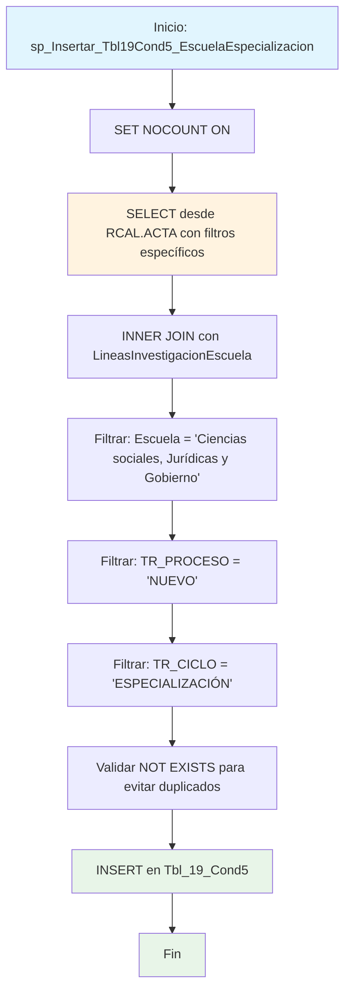

### sp_Insertar_Tbl19Cond5_EscuelaEspecializacion

Procedimiento especializado que inserta líneas de investigación específicas para programas de especialización de la escuela "Ciencias sociales, Jurídicas y Gobierno" en la tabla Tbl_19_Cond5. Filtra por proceso NUEVO y ciclo ESPECIALIZACIÓN, evitando duplicados mediante validación NOT EXISTS.

#### Diagrama de flujo


#### Procedimiento almacenado
```sql
CREATE PROCEDURE [RCAL].[sp_Insertar_Tbl19Cond5_EscuelaEspecializacion]
AS
BEGIN
SET NOCOUNT ON;

    INSERT INTO [REGISTRO_CALIFICADO].[RCAL].[Tbl_19_Cond5] (
        TR_SNIES,
        Escuela,
        Lineas_De_Escuela
    )
    SELECT
        A.TR_SNIES,
        L.NombreEscuela AS Escuela,
        L.NombreLinea AS Lineas_De_Escuela
    FROM [REGISTRO_CALIFICADO].[RCAL].[ACTA] A
    INNER JOIN [RCAL].[LineasInvestigacionEscuela] L
        ON L.NombreEscuela = 'Ciencias sociales, Jurídicas y Gobierno'
    WHERE A.TR_ESCUELA = 'Ciencias sociales, Jurídicas y Gobierno'
      AND A.TR_PROCESO = 'NUEVO'
      AND A.TR_CICLO = 'ESPECIALIZACIÓN'
      -- Para evitar duplicados si ya existe esa combinación:
      AND NOT EXISTS (
            SELECT 1
            FROM [REGISTRO_CALIFICADO].[RCAL].[Tbl_19_Cond5] T
            WHERE T.TR_SNIES = A.TR_SNIES
              AND T.Escuela = L.NombreEscuela
              AND T.Lineas_De_Escuela = L.NombreLinea
      );

END;
```
#### Operaciones Principales

- Configuración optimización: SET NOCOUNT ON para mejorar rendimiento
- Filtrado específico: Selecciona solo programas de especialización nuevos
- Restricción por escuela: Enfoque exclusivo en "Ciencias sociales, Jurídicas y Gobierno"
- Mapeo líneas investigación: Asocia líneas de investigación de la escuela con programas
- Prevención duplicados: Validación NOT EXISTS por combinación TR_SNIES + Escuela + Línea
- Inserción controlada: Solo inserta registros que cumplan todos los criterios

#### Tablas afectadas

##### Actualizadas:

REGISTRO_CALIFICADO.RCAL.Tbl_19_Cond5: Tabla destino con líneas de investigación por programa

##### Consultadas:

REGISTRO_CALIFICADO.RCAL.ACTA: Fuente de programas académicos con filtros específicos
RCAL.LineasInvestigacionEscuela: Catálogo de líneas de investigación por escuela

#### Procedimientos Almacenados Anidados