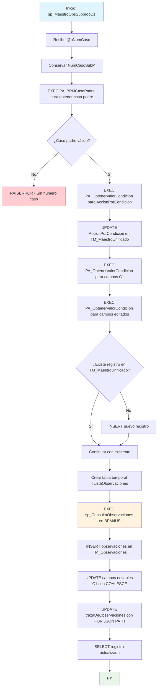

### sp_MaestroObsSubprocC1

Procedimiento original de la Condición 1 (Denominación) que utiliza procedimientos auxiliares y conexión a servidor vinculado BPM4US para obtener observaciones. Maneja actualización de campos editables relacionados con ajustes semánticos y análisis de correspondencia de títulos.

#### Diagrama de flujo


#### Procedimiento almacenado
```sql
--=================================================================================================================================================================
--Author: Johana Henao
--Create Date: 02/07/2024
--Description: Procedimiento almacenado para el llamado de observaciones de los subprocesos (c/u de las condiciones) y realizar almacenamiento en TM_Observaciones
-- Se realiza además el proceso de actualización de los campos que requiera actualizar en cada condición en TM_MaestroUnificado
-- Este sp hace un llamado a CUN.sp_ConsultaObservaciones de la db BPM4UsCun
--Version: 01

-- EXEC [CUN].[sp_MaestroObsSubprocC1] '000000002088'
-- EXEC [CUN].[sp_MaestroObsSubprocC1] '000000002098'

-- update [CUN].[TM_MaestroUnificado] set AccionPorCondicion = 0 where id = 67

--=================================================================================================================================================================

CREATE Procedure [CUN].[sp_MaestroObsSubprocC1] (@pNumCaso VARCHAR(250))
AS
BEGIN
DECLARE @NumCasoSubP VARCHAR(250)
DECLARE @C1_AjusteSemantico VARCHAR(255)
DECLARE @C1_AnalisisTitulo VARCHAR(255)
DECLARE @C1_AjusteSemanticoEdit VARCHAR(255)
DECLARE @C1_AnalisisTituloEdit VARCHAR(255)
DECLARE @VAccionPorCondicion INT --MCDT20240814

    --Conservar el número de caso del subproceso para las actualizaciones de campos editables
    SET @NumCasoSubP = @pNumCaso

    --Consulta número de caso de proceso papá =======================================================

exec [CUN].[PA_BPMCasoPadre] @NumCasoSubP, @pNumCaso output

    IF ISNULL (@pNumCaso, '') = ''
    BEGIN
    	RAISERROR  ('No existe número de caso', 18, 18);
    	RETURN;
    END
    --Actualización de AccionPorCondicion------------------------------------------------------------------------------------------------------------------------------------------------
    exec  [CUN].[PA_ObtenerValorCondicion]  @NumCasoSubP, 'AccionPorCondicion', @VAccionPorCondicion  output
    ----
    --Actualización en MaestroUnificado del campo AccionPorCondicion
    UPDATE [CUN].[TM_MaestroUnificado]
       SET AccionPorCondicion = @VAccionPorCondicion
     WHERE @VAccionPorCondicion < 4
       AND @VAccionPorCondicion > AccionPorCondicion;

    --Actualización de campos editables--------------------------------------------------------------------------------------------------------------------------------------------------

exec [CUN].[PA_ObtenerValorCondicion] @pNumCaso, 'ajusteSemantico',@C1_AjusteSemantico output

---

    exec  [CUN].[PA_ObtenerValorCondicion]  @pNumCaso, 'F1_AnalisisCorrespondenciaTitulo', @C1_AnalisisTitulo  output

---

    --Guardar los campos editados

exec [CUN].[PA_ObtenerValorCondicion] @NumCasoSubP, 'ajusteSemantico', @C1_AjusteSemanticoEdit output

---

exec [CUN].[PA_ObtenerValorCondicion] @NumCasoSubP, 'F1_AnalisisCorrespondenciaTitulo', @C1_AnalisisTituloEdit output

---

    --Consulta y almacenamiento de observaciones-----------------------------------------------------------------------------------------------------------
    -- Inserta solo si no existe un registro con el mismo NumeroCaso
    IF NOT EXISTS (
    	SELECT 1
    	FROM [CUN].[TM_MaestroUnificado]
    	WHERE NumeroCaso = @pNumCaso
    )
    BEGIN
    	INSERT INTO [CUN].[TM_MaestroUnificado] (NumeroCaso)
    	VALUES (@pNumCaso);
    END

    CREATE TABLE #ListaObservaciones (IdFormulario INT
    								 ,NumCaso VARCHAR(250)
    								 ,Condicion VARCHAR(250)
    								 ,API VARCHAR(200)
    								 ,Nombre VARCHAR(500)
    								 ,FchObservacion DATETIME
    								 ,Observaciones VARCHAR(MAX)
    								 ,Usuario VARCHAR(200));

    -- Llamado al procedimiento almacenado en el servidor vinculado
    INSERT INTO #ListaObservaciones (IdFormulario, NumCaso,	Condicion, API,	Nombre,	FchObservacion,	Observaciones, Usuario)
    EXEC [BPM4US].[BPM4UsCun].CUN.sp_ConsultaObservaciones @NumCasoSubP;

    --Captura el Id de maestro unificado a partir del número de caso
    DECLARE @Id_TM_MaestroUnificado INT
    SET @Id_TM_MaestroUnificado = (SELECT Id FROM [CUN].[TM_MaestroUnificado] WHERE NumeroCaso = @pNumCaso)

    --Almacena en la tabla Observaciones los datos enviados por parámetro
    INSERT INTO [CUN].[TM_Observaciones] (Fecha,Usuario,Condicion,Observacion,Estado,Auditoria,Id_TM_MaestroUnificado)
    SELECT FchObservacion, Usuario, Condicion, Observaciones, null, null, @Id_TM_MaestroUnificado
    FROM #ListaObservaciones

    --Proceso de actualización campos editables condicion 1
    UPDATE A
    SET A.AjusteSemantico     = COALESCE(@C1_AjusteSemanticoEdit, @C1_AjusteSemantico)
       ,A.F1_AnalisisCorrespondenciaTitulo = COALESCE(@C1_AnalisisTituloEdit, @C1_AnalisisTitulo)
       ,observaDenominacionC1 = case when  @VAccionPorCondicion = 2 then 1 else 0 end
       ,trazaDeObservaciones  = (SELECT B.Fecha       AS fechaDeLaObservacion
    								   ,B.Usuario     AS personaObservacion
    								   ,B.Condicion   AS condicionOFormularioDeOrigen
    								   ,B.Observacion AS observacionesH
    							   FROM [CUN].[TM_Observaciones] B
    							  WHERE B.Id_TM_MaestroUnificado = A.Id
    							    FOR JSON PATH  )
    FROM [CUN].[TM_MaestroUnificado] A
    WHERE A.NumeroCaso = @pNumCaso

     SELECT *
     FROM [CUN].[TM_MaestroUnificado] A
     WHERE A.NumeroCaso = @pNumCaso;

END;
```
#### Operaciones Principales

- Obtención caso padre: Utiliza PA_BPMCasoPadre para resolver jerarquía de casos
- Obtención valores condición: Múltiples llamadas a PA_ObtenerValorCondicion
- Actualización acción: Modifica AccionPorCondicion con validaciones específicas
- Consulta observaciones externas: Conexión a BPM4US via servidor vinculado
- Actualización inteligente: Usa COALESCE para priorizar valores editados
- Consolidación traza: Genera JSON con observaciones históricas

#### Tablas afectadas

##### Actualizadas:

- CUN.TM_MaestroUnificado: Campos AccionPorCondicion, AjusteSemantico, F1_AnalisisCorrespondenciaTitulo, observaDenominacionC1, trazaDeObservaciones
- CUN.TM_Observaciones: Inserción de observaciones desde BPM4US

##### Temporales:

- #ListaObservaciones: Tabla temporal para almacenar observaciones del servidor vinculado

#### Procedimientos Almacenados Anidados

- CUN.PA_BPMCasoPadre: Obtiene el caso padre del subproceso
- CUN.PA_ObtenerValorCondicion: Obtiene valores específicos por condición (4 llamadas)
- [BPM4US].[BPM4UsCun].CUN.sp_ConsultaObservaciones: Consulta observaciones en servidor vinculado