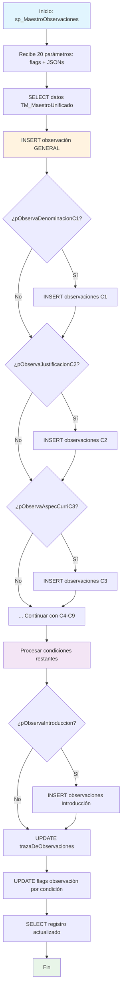

### sp_MaestroObservaciones

Procedimiento maestro centralizado para procesar observaciones de todas las condiciones académicas (C1-C9 + Introducción) en una sola operación. Recibe 20 parámetros (10 flags booleanos + 10 JSONs) para manejar observaciones por condición de forma condicional y actualizar el maestro unificado.

#### Diagrama de flujo


#### Procedimiento almacenado
```sql
/*
|sp_MaestroObservaciones|/\*
[CUN].[sp_MaestroObservaciones]
Procedimiento Consulta las observaciones del formulario de Revisión de Calidad, adiciona las observaciones general o particular a cada condición
actualiza la información en la tabla [CUN].[TM_Observaciones].
Creador por: María Cristina Díaz Torres  
 Fecha: 2024/09/30  
 Version: 0
Ejecución:

\*/

CREATE PROCEDURE [CUN].[sp_MaestroObservaciones] @pNumCaso VARCHAR(250), @pObservaciones varchar(max),  
 @pObservaDenominacionC1 bit = false, @pDatagridObsDenominacionC1 varchar(max),
@pObservaJustificacionC2 bit = false, @pDatagridObsJustificacionC2 varchar(max),
@pObservaAspecCurriC3 bit = false, @pDatagridObsAspectosC3 varchar(max),
@pObservaContenidosCurriC4 bit = false, @pDatagridObsOrganizacionC4 varchar(max),
@pObservaInvestigacionC5 bit = false, @pDatagridObsInvestigacionC5 varchar(max),
@pObservaRelacionExtC6 bit = false, @pDatagridObsRelacionExrC6 varchar(max),
@pObservaProfesoresC7 bit = false, @pDatagridObsProfesoresC7 varchar(max),
@pObservaMediosEducaC8 bit = false, @pDatagridObsMediosEducaC8 varchar(max),
@pObservaInfraestructuraC9 bit = false, @pDatagridObsInfraestructuraC9 varchar(max),
@pObservaIntroduccion bit = false, @pDatagridObsIntroduccion varchar(max)
  
AS

---

-- DECLARACION DE TABLAS

---

    DECLARE @ListaObservaciones  TABLE  ( IdFormulario INT
    								                     ,NumCaso VARCHAR(250)
    								                     ,Condicion VARCHAR(250)
    								                     ,API VARCHAR(200)
    								                     ,Nombre VARCHAR(500)
    								                     ,FchObservacion DATETIME
    								                     ,Observaciones VARCHAR(MAX)
    								                     ,Usuario VARCHAR(200));

---

-- DECLARACION DE VARIABLES

---

DECLARE @Id_TM_MaestroUnificado INT
DECLARE @Condicion VARCHAR(MAX)
DECLARE @IdFormulario int
declare @Id_Director nvarchar(450)
Declare @DirectorNombre varchar(300)

---

BEGIN -- INICIO

---

Set @IdFormulario = 5

---

SELECT @Id_TM_MaestroUnificado = Id
,@Id_Director = IdDirector
,@DirectorNombre = Director
FROM [CUN].[TM_MaestroUnificado]
WHERE NumeroCaso = @pNumCaso

---

--Almacena en la tabla Observacion GENERAL
INSERT INTO [CUN].[TM_Observaciones] (Fecha,Usuario,Condicion,Observacion,Estado,Auditoria,IdFormulario,Id_TM_MaestroUnificado)
SELECT CONVERT(datetime, SWITCHOFFSET(CONVERT(datetimeoffset, fechaDeLaObservacion), DATENAME(TzOffset, SYSDATETIMEOFFSET())))
,@DirectorNombre
,'GENERAL'
,observacionesH
,1 estado
,'CUN.sp_MaestroObservaciones: GENERAL '+@pNumCaso+convert(varchar(200), getdate(), 103) Auditoria
,@IdFormulario
,@Id_TM_MaestroUnificado
FROM OPENJSON(CASE WHEN ISJSON(@pObservaciones) = 1 THEN @pObservaciones ELSE '[]' END) --valida que el campo C.Valor sea un JSON
WITH (personalORolQueHizoLaObservacion NVARCHAR(MAX) '$.personalORolQueHizoLaObservacion',
  		  fechaDeLaObservacion             NVARCHAR(MAX) '$.fechaDeLaObservacion',
observacionesH NVARCHAR(MAX) '$.observacionesH',
  		  personaObservacion               NVARCHAR(MAX) '$.personaObservacion')

---

if @pObservaDenominacionC1 = 1
begin
--------------------------------------------------------------------------------------
INSERT INTO [CUN].[TM_Observaciones] (Fecha,Usuario,Condicion,Observacion,Estado,Auditoria,IdFormulario,Id_TM_MaestroUnificado)
SELECT CONVERT(datetime, SWITCHOFFSET(CONVERT(datetimeoffset, fechaDeLaObservacion), DATENAME(TzOffset, SYSDATETIMEOFFSET())))
,@DirectorNombre
,'Condición 1 - Denominación'
,observacionesH
,1 estado
,'CUN.sp_MaestroObservaciones: Denominacion '+@pNumCaso+convert(varchar(200), getdate(), 103) Auditoria
,@IdFormulario
,@Id_TM_MaestroUnificado
FROM OPENJSON(CASE WHEN ISJSON(@pDatagridObsDenominacionC1 ) = 1 THEN @pDatagridObsDenominacionC1 ELSE '[]' END) --valida que el campo C.Valor sea un JSON
WITH (personalORolQueHizoLaObservacion NVARCHAR(MAX) '$.personalORolQueHizoLaObservacion',
    		  fechaDeLaObservacion             NVARCHAR(MAX) '$.fechaDeLaObservacion',
observacionesH NVARCHAR(MAX) '$.observacionesH',
    		  personaObservacion               NVARCHAR(MAX) '$.personaObservacion')
--------------------------------------------------------------------------------------
end -- if @pObservaDenominacionC1 = 1

---

if @pObservaJustificacionC2 = 1
begin
--------------------------------------------------------------------------------------
INSERT INTO [CUN].[TM_Observaciones] (Fecha,Usuario,Condicion,Observacion,Estado,Auditoria,IdFormulario,Id_TM_MaestroUnificado)
SELECT CONVERT(datetime, SWITCHOFFSET(CONVERT(datetimeoffset, fechaDeLaObservacion), DATENAME(TzOffset, SYSDATETIMEOFFSET())))
,@DirectorNombre
,'Condición 2 - Justificación'  
 ,observacionesH
,1 estado
,'CUN.sp_MaestroObservaciones: Justificación '+@pNumCaso+convert(varchar(200), getdate(), 103) Auditoria
,@IdFormulario
,@Id_TM_MaestroUnificado
FROM OPENJSON(CASE WHEN ISJSON(@pDatagridObsJustificacionC2 ) = 1 THEN @pDatagridObsJustificacionC2 ELSE '[]' END) --valida que el campo C.Valor sea un JSON
WITH (personalORolQueHizoLaObservacion NVARCHAR(MAX) '$.personalORolQueHizoLaObservacion',
    		  fechaDeLaObservacion             NVARCHAR(MAX) '$.fechaDeLaObservacion',
observacionesH NVARCHAR(MAX) '$.observacionesH',
    		  personaObservacion               NVARCHAR(MAX) '$.personaObservacion')
--------------------------------------------------------------------------------------
end -- if @pObservaJustificacionC2 = 1

---

if @pObservaAspecCurriC3 = 1
begin
--------------------------------------------------------------------------------------
INSERT INTO [CUN].[TM_Observaciones] (Fecha,Usuario,Condicion,Observacion,Estado,Auditoria,IdFormulario,Id_TM_MaestroUnificado)
SELECT CONVERT(datetime, SWITCHOFFSET(CONVERT(datetimeoffset, fechaDeLaObservacion), DATENAME(TzOffset, SYSDATETIMEOFFSET())))
,@DirectorNombre
,'Condición 3 - Aspectos curriculares'
,observacionesH
,1 estado
,'CUN.sp_MaestroObservaciones: Aspectos curriculares '+@pNumCaso+convert(varchar(200), getdate(), 103) Auditoria
,@IdFormulario
,@Id_TM_MaestroUnificado
FROM OPENJSON(CASE WHEN ISJSON(@pDatagridObsAspectosC3) = 1 THEN @pDatagridObsAspectosC3 ELSE '[]' END) --valida que el campo C.Valor sea un JSON
WITH (personalORolQueHizoLaObservacion NVARCHAR(MAX) '$.personalORolQueHizoLaObservacion',
    		  fechaDeLaObservacion             NVARCHAR(MAX) '$.fechaDeLaObservacion',
observacionesH NVARCHAR(MAX) '$.observacionesH',
    		  personaObservacion               NVARCHAR(MAX) '$.personaObservacion')
--------------------------------------------------------------------------------------
end -- if @pObservaAspecCurriC3 = 1

---

if @pObservaContenidosCurriC4 = 1
begin
--------------------------------------------------------------------------------------
INSERT INTO [CUN].[TM_Observaciones] (Fecha,Usuario,Condicion,Observacion,Estado,Auditoria,IdFormulario,Id_TM_MaestroUnificado)
SELECT CONVERT(datetime, SWITCHOFFSET(CONVERT(datetimeoffset, fechaDeLaObservacion), DATENAME(TzOffset, SYSDATETIMEOFFSET())))
,@DirectorNombre
,'Condición 4 - Organización académica'
,observacionesH
,1 estado
,'CUN.sp_MaestroObservaciones: Organización académica '+@pNumCaso+convert(varchar(200), getdate(), 103) Auditoria
,@IdFormulario
,@Id_TM_MaestroUnificado
FROM OPENJSON(CASE WHEN ISJSON(@pDatagridObsOrganizacionC4) = 1 THEN @pDatagridObsOrganizacionC4 ELSE '[]' END) --valida que el campo C.Valor sea un JSON
WITH (personalORolQueHizoLaObservacion NVARCHAR(MAX) '$.personalORolQueHizoLaObservacion',
    		  fechaDeLaObservacion             NVARCHAR(MAX) '$.fechaDeLaObservacion',
observacionesH NVARCHAR(MAX) '$.observacionesH',
    		  personaObservacion               NVARCHAR(MAX) '$.personaObservacion')
--------------------------------------------------------------------------------------
end -- if @pObservaContenidosCurriC4 = 1

---

    if @pObservaInvestigacionC5  = 1

begin
--------------------------------------------------------------------------------------
INSERT INTO [CUN].[TM_Observaciones] (Fecha,Usuario,Condicion,Observacion,Estado,Auditoria,IdFormulario,Id_TM_MaestroUnificado)
SELECT CONVERT(datetime, SWITCHOFFSET(CONVERT(datetimeoffset, fechaDeLaObservacion), DATENAME(TzOffset, SYSDATETIMEOFFSET())))
,@DirectorNombre
,'Condición 5 - Investigación '
,observacionesH
,1 estado
,'CUN.sp_MaestroObservaciones: Investigación '+@pNumCaso+convert(varchar(200), getdate(), 103) Auditoria
,@IdFormulario
,@Id_TM_MaestroUnificado
FROM OPENJSON(CASE WHEN ISJSON(@pDatagridObsInvestigacionC5 ) = 1 THEN @pDatagridObsInvestigacionC5 ELSE '[]' END) --valida que el campo C.Valor sea un JSON
WITH (personalORolQueHizoLaObservacion NVARCHAR(MAX) '$.personalORolQueHizoLaObservacion',
    		  fechaDeLaObservacion             NVARCHAR(MAX) '$.fechaDeLaObservacion',
observacionesH NVARCHAR(MAX) '$.observacionesH',
    		  personaObservacion               NVARCHAR(MAX) '$.personaObservacion')
--------------------------------------------------------------------------------------
end -- if @pObservaInvestigacionC5 = 1

---

if @pObservaRelacionExtC6 = 1
begin
--------------------------------------------------------------------------------------
INSERT INTO [CUN].[TM_Observaciones] (Fecha,Usuario,Condicion,Observacion,Estado,Auditoria,IdFormulario,Id_TM_MaestroUnificado)
SELECT CONVERT(datetime, SWITCHOFFSET(CONVERT(datetimeoffset, fechaDeLaObservacion), DATENAME(TzOffset, SYSDATETIMEOFFSET())))
,@DirectorNombre
,'Condición 6 - Relación con el sector exterior'  
 ,observacionesH
,1 estado
,'CUN.sp_MaestroObservaciones: Relación con el sector exterior '+@pNumCaso+convert(varchar(200), getdate(), 103) Auditoria
,@IdFormulario
,@Id_TM_MaestroUnificado
FROM OPENJSON(CASE WHEN ISJSON(@pDatagridObsRelacionExrC6 ) = 1 THEN @pDatagridObsRelacionExrC6 ELSE '[]' END) --valida que el campo C.Valor sea un JSON
WITH (personalORolQueHizoLaObservacion NVARCHAR(MAX) '$.personalORolQueHizoLaObservacion',
    		  fechaDeLaObservacion             NVARCHAR(MAX) '$.fechaDeLaObservacion',
observacionesH NVARCHAR(MAX) '$.observacionesH',
    		  personaObservacion               NVARCHAR(MAX) '$.personaObservacion')
--------------------------------------------------------------------------------------
end -- if @pObservaRelacionExtC6 = 1

---

    if @pObservaProfesoresC7  = 1

begin
--------------------------------------------------------------------------------------
INSERT INTO [CUN].[TM_Observaciones] (Fecha,Usuario,Condicion,Observacion,Estado,Auditoria,IdFormulario,Id_TM_MaestroUnificado)
SELECT CONVERT(datetime, SWITCHOFFSET(CONVERT(datetimeoffset, fechaDeLaObservacion), DATENAME(TzOffset, SYSDATETIMEOFFSET())))
,@DirectorNombre
,'Condición 7 - profesores '
,observacionesH
,1 estado
,'CUN.sp_MaestroObservaciones: profesores '+@pNumCaso+convert(varchar(200), getdate(), 103) Auditoria
,@IdFormulario
,@Id_TM_MaestroUnificado
FROM OPENJSON(CASE WHEN ISJSON(@pDatagridObsProfesoresC7 ) = 1 THEN @pDatagridObsProfesoresC7 ELSE '[]' END) --valida que el campo C.Valor sea un JSON
WITH (personalORolQueHizoLaObservacion NVARCHAR(MAX) '$.personalORolQueHizoLaObservacion',
    		  fechaDeLaObservacion             NVARCHAR(MAX) '$.fechaDeLaObservacion',
observacionesH NVARCHAR(MAX) '$.observacionesH',
    		  personaObservacion               NVARCHAR(MAX) '$.personaObservacion')
--------------------------------------------------------------------------------------
end -- if @pObservaProfesoresC7 = 1

---

if @pObservaMediosEducaC8 = 1
begin
--------------------------------------------------------------------------------------
INSERT INTO [CUN].[TM_Observaciones] (Fecha,Usuario,Condicion,Observacion,Estado,Auditoria,IdFormulario,Id_TM_MaestroUnificado)
SELECT CONVERT(datetime, SWITCHOFFSET(CONVERT(datetimeoffset, fechaDeLaObservacion), DATENAME(TzOffset, SYSDATETIMEOFFSET())))
,@DirectorNombre
,'Condición 8 - Medios educativos'  
 ,observacionesH
,1 estado
,'CUN.sp_MaestroObservaciones: Medios educativos'+@pNumCaso+convert(varchar(200), getdate(), 103) Auditoria
,@IdFormulario
,@Id_TM_MaestroUnificado
FROM OPENJSON(CASE WHEN ISJSON(@pDatagridObsMediosEducaC8 ) = 1 THEN @pDatagridObsMediosEducaC8 ELSE '[]' END) --valida que el campo C.Valor sea un JSON
WITH (personalORolQueHizoLaObservacion NVARCHAR(MAX) '$.personalORolQueHizoLaObservacion',
    		  fechaDeLaObservacion             NVARCHAR(MAX) '$.fechaDeLaObservacion',
observacionesH NVARCHAR(MAX) '$.observacionesH',
    		  personaObservacion               NVARCHAR(MAX) '$.personaObservacion')
--------------------------------------------------------------------------------------
end -- if @pObservaMediosEducaC8 = 1

---

    if @pObservaInfraestructuraC9  = 1

begin
--------------------------------------------------------------------------------------
INSERT INTO [CUN].[TM_Observaciones] (Fecha,Usuario,Condicion,Observacion,Estado,Auditoria,IdFormulario,Id_TM_MaestroUnificado)
SELECT CONVERT(datetime, SWITCHOFFSET(CONVERT(datetimeoffset, fechaDeLaObservacion), DATENAME(TzOffset, SYSDATETIMEOFFSET())))
,@DirectorNombre
,'Condición 9 - Infraestructura'  
 ,observacionesH
,1 estado
,'CUN.sp_MaestroObservaciones: Infraestructura '+@pNumCaso+convert(varchar(200), getdate(), 103) Auditoria
,@IdFormulario
,@Id_TM_MaestroUnificado
FROM OPENJSON(CASE WHEN ISJSON(@pDatagridObsInfraestructuraC9 ) = 1 THEN @pDatagridObsInfraestructuraC9 ELSE '[]' END) --valida que el campo C.Valor sea un JSON
WITH (personalORolQueHizoLaObservacion NVARCHAR(MAX) '$.personalORolQueHizoLaObservacion',
    		  fechaDeLaObservacion             NVARCHAR(MAX) '$.fechaDeLaObservacion',
observacionesH NVARCHAR(MAX) '$.observacionesH',
    		  personaObservacion               NVARCHAR(MAX) '$.personaObservacion')
--------------------------------------------------------------------------------------
end -- if @@pObservaInfraestructuraC9 = 1

---

if @pObservaIntroduccion = 1
begin
--------------------------------------------------------------------------------------
INSERT INTO [CUN].[TM_Observaciones] (Fecha,Usuario,Condicion,Observacion,Estado,Auditoria,IdFormulario,Id_TM_MaestroUnificado)
SELECT CONVERT(datetime, SWITCHOFFSET(CONVERT(datetimeoffset, fechaDeLaObservacion), DATENAME(TzOffset, SYSDATETIMEOFFSET())))
,@DirectorNombre
,'Introducción'
,observacionesH
,1 estado
,'CUN.sp_MaestroObservaciones: Introducción '+@pNumCaso+convert(varchar(200), getdate(), 103) Auditoria
,@IdFormulario
,@Id_TM_MaestroUnificado
FROM OPENJSON(CASE WHEN ISJSON(@pDatagridObsIntroduccion ) = 1 THEN @pDatagridObsIntroduccion ELSE '[]' END) --valida que el campo C.Valor sea un JSON
WITH (personalORolQueHizoLaObservacion NVARCHAR(MAX) '$.personalORolQueHizoLaObservacion',
    		  fechaDeLaObservacion             NVARCHAR(MAX) '$.fechaDeLaObservacion',
observacionesH NVARCHAR(MAX) '$.observacionesH',
    		  personaObservacion               NVARCHAR(MAX) '$.personaObservacion')
--------------------------------------------------------------------------------------
end -- if @pObservaIntroduccion = 1

---

--Proceso de actualización campo TRAZADEOBSERVACIONES

---

UPDATE A
SET A.trazaDeObservaciones = (SELECT B.Fecha AS fechaDeLaObservacion
,B.Usuario AS personaObservacion
,B.Condicion AS condicionOFormularioDeOrigen
,B.Observacion AS observacionesH
FROM CUN.TM_Observaciones B
WHERE B.Id_TM_MaestroUnificado = A.Id
FOR JSON PATH )
,A.observaDenominacionC1 = isnull(@pObservaDenominacionC1 , 0)
,A.ObservaJustificacionC2 = isnull(@pObservaJustificacionC2 , 0)
,A.ObservaAspecCurriC3 = isnull(@pObservaAspecCurriC3 , 0)
,A.ObservaContenidosCurriC4 = isnull(@pObservaContenidosCurriC4, 0)
,A.ObservaInvestigacionC5 = isnull(@pObservaInvestigacionC5 , 0)
,A.ObservaRelacionExtC6 = isnull(@pObservaRelacionExtC6 , 0)
,A.ObservaProfesoresC7 = isnull(@pObservaProfesoresC7 , 0)
,A.ObservaMediosEducaC8 = isnull(@pObservaMediosEducaC8 , 0)
,A.ObservaInfraestructuraC9 = isnull(@pObservaInfraestructuraC9, 0)
,A.observaIntroduccion = isnull(@pObservaIntroduccion , 0)
FROM CUN.TM_MaestroUnificado A
WHERE A.NumeroCaso = @pNumCaso

---

SELECT \*
FROM CUN.TM_MaestroUnificado A
WHERE A.NumeroCaso = @pNumCaso;

---

END; --- FINAL PROCEDIMIENTO
```
#### Operaciones Principales

- Validación inicial: Obtiene datos del maestro unificado para el caso
- Observación general: Siempre inserta observación GENERAL con IdFormulario 5
- Procesamiento condicional: Evalúa 10 flags booleanos para cada condición
- Inserción selectiva: Solo procesa JSON si el flag correspondiente es true
- Consolidación final: Actualiza trazaDeObservaciones y todos los flags de observación
- Retorno completo: Devuelve el registro actualizado del maestro unificado

#### Tablas afectadas

##### Actualizadas:

- CUN.TM_MaestroUnificado: Campos trazaDeObservaciones y 10 flags de observación (observaDenominacionC1, ObservaJustificacionC2, ObservaAspecCurriC3, ObservaContenidosCurriC4, ObservaInvestigacionC5, ObservaRelacionExtC6, ObservaProfesoresC7, ObservaMediosEducaC8, ObservaInfraestructuraC9, observaIntroduccion)
- CUN.TM_Observaciones: Inserción múltiple de observaciones (1 general + hasta 10 condicionales)

#### Procedimientos Almacenados Anidados