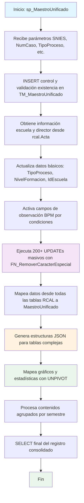

### sp_MaestroUnificado

Procedimiento masivo del sistema BPM4US que consolida datos de un programa académico en el maestro unificado. Realiza más de 200 operaciones UPDATE para mapear datos desde múltiples tablas del registro calificado hacia campos específicos del maestro unificado, aplicando limpieza de caracteres especiales y generando estructuras JSON para integración con BPM.

#### Diagrama de flujo


#### Procedimiento almacenado
```sql
|
|sp_MaestroUnificado|//*-=================================================================================================================================================================
Author: Johana Henao
Create Date: 26/06/2024
Description: 1.Procedimiento almacenado para capturar los datos del conjunto de datos y consolidarlos en maestro unificado [CUN].[TM_MaestroUnificado]
Version: 01
EXEC CUN.sp_MaestroUnificado '54639', '000000010596 ',3,1,'Alejandra Porras Alarcón','Alejandra Porras Alarcón'
EXEC CUN.sp_MaestroUnificado '54639', '000000011495 ',1,2,'Alejandra Porras Alarcón','Alejandra Porras Alarcón'
EXEC CUN.sp_MaestroUnificado '20241120', '000000012419 ', 1, 4, 'Alejandra Porras Alarcón','Alejandra Porras Alarcón'
EXEC CUN.sp_MaestroUnificado 202400140, '000000000143', 1, 4, 'Alejandra Porras Alarcón','Alejandra Porras Alarcón'
EXEC CUN.sp_MaestroUnificado 202400120, '000000013126', 1, 4, 'Alejandra Porras Alarcón','Alejandra Porras Alarcón'
EXEC CUN.sp_MaestroUnificado 20250030, '000000016169', 1, 4, 'Alejandra Porras Alarcón','Alejandra Porras Alarcón'
--=================================================================================================================================================================_/
*/
CREATE Procedure [CUN].[sp_MaestroUnificado]
( @pSNIES varchar(255)
,@pNumCaso VARCHAR(250)
,@pTipoProceso int
,@pNivel int
,@Instanciador nvarchar(450)
,@NombreInstanciador varchar(450)
)
AS

---

declare @Escuela varchar(max)
declare @idDirector varchar(max)
declare @Director varchar(max)
declare @idEscuela int
---Actualiza datos del director y escuela --------------------------------------------------------
-- DECLARE @pSNIES varchar(255) = 202500195, @pNumCaso VARCHAR(250) ='000000013231' ,@pTipoProceso int = 1 ,@pNivel int= 4 ,@Instanciador nvarchar(450) ='Alejandra Porras Alarcón' ,@NombreInstanciador varchar(450)='Alejandra Porras Alarcón' , @Escuela varchar(max)='' , @idDirector varchar(max)='' , @Director varchar(max)='' , @idEscuela int=;

DECLARE @sqlQuery NVARCHAR(450);

CREATE TABLE #ResultadoTemporal (
FirstName NVARCHAR(256),
LastName NVARCHAR(256),
Id VARCHAR(160),
NumCaso VARCHAR(250)
);

---

---

    ---Actualiza datos del director y escuela


BEGIN
print 1
print convert(varchar(40), getdate(), 109)
--Valida si el Número de caso enviado por parámetro existe o no en el maestro unificado
INSERT INTO [CUN].[TM_Control] (Fecha, SNIES, NumCaso)
VALUES (GETDATE(), @pSNIES, @pNumCaso);
IF NOT EXISTS (
SELECT 1
FROM [CUN].[TM_MaestroUnificado]
WHERE NumeroCaso = @pNumCaso and CodigoSnies =@pSNIES
)
BEGIN
INSERT INTO [CUN].[TM_MaestroUnificado] (NumeroCaso, codigoSnies)
VALUES (@pNumCaso, @pSNIES);
END

    --se pone condicional 17-sept joha
    UPDATE [CUN].[TM_MaestroUnificado]
    SET TipoDeProceso = @pTipoProceso --CASE WHEN @pTipoProceso = 3 THEN 0 ELSE @pTipoProceso END
       ,NivelFormacion = @pNivel
    WHERE NumeroCaso = @pNumCaso;

/_ SET @sqlQuery = '
INSERT INTO #ResultadoTemporal (FirstName, LastName, Id)
SELECT PrimerNombre, PrimerApellido, Id
FROM OPENQUERY([BPM4US],
''SELECT _
FROM BPM4USCUN.dbo.AspNetUsers
WHERE Id = (SELECT InstanciadoPor
FROM BPM4UsCun.casos.TM_Caso
WHERE Numero = ''''' + @pNumCaso + ''''')'')';

    --print @sqlQuery
    -- Se ejecuta la consulta dinámica y se inserta los resultados en la tabla temporal para buscar luego los datos de escuela y director
    EXEC sp_executesql @sqlQuery;
    if not exists (SELECT top 1 1 FROM #ResultadoTemporal)
    begin
      raiserror('No se encontró al instanciador del caso: ', 18, 18 )
      return;
    end;
    update #ResultadoTemporal
    set NumCaso = @pNumCaso*/

if @NombreInstanciador is null
begin
raiserror('No se encontró al instanciador del caso: ', 18, 18 )
return;
end;
SELECT @Escuela = TR_Escuela
FROM rcal.Acta
WHERE TR_SNIES = @pSNIES;
Print '@Escuela'
Print @Escuela
if @Escuela is null  
 begin
raiserror('No se encontró la escuela ', 18, 18 )
return;
end;
SELECT @idEscuela = id,
@idDirector = Id_director
FROM cun.TP_Escuela
WHERE Nombre = @Escuela
if @idEscuela is null  
 begin
raiserror('La escuela no coincide con el maestro ', 18, 18 )
return;
end;

    UPDATE [CUN].[TM_MaestroUnificado]
    SET IdEscuela = @idEscuela
       ,Escuela  = @Escuela
       ,IdDirector = @idDirector
       ,Director = @NombreInstanciador
    WHERE NumeroCaso = @pNumCaso;

    DROP TABLE #ResultadoTemporal;
    ----------------------------------------------------------------------------------------------

    --Activación de campos usados en BPM =============================================================================
    UPDATE [CUN].[TM_MaestroUnificado]
    SET AccionPorCondicion			= NULL
       ,ObservaAcuerdo				= 1
       ,observaIntroduccion			= 1
       ,observaDenominacionC1		= CASE WHEN @pTipoProceso = 3 THEN 0 ELSE 1 END
       ,ObservaJustificacionC2		= 1
       ,ObservaAspecCurriC3			= 1
       ,ObservaContenidosCurriC4	= 1
       ,ObservaInvestigacionC5		= 1
       ,ObservaRelacionExtC6		= 1
       ,ObservaProfesoresC7			= 1
       ,ObservaMediosEducaC8		= 1
       ,ObservaInfraestructuraC9	= 1
     WHERE NumeroCaso = @pNumCaso


    --Mapeo de datos tablas CUN a Maestro Unificado =============================================================================
     UPDATE A
     SET A.NumeroDeActa = CUN.FN_RemoverCaracterEspecial(B.TR_NumeroActa)
        ,A.CodigoSnies = CUN.FN_RemoverCaracterEspecial(B.TR_SNIES) --se descomenta 10-09 joha
    	--,A.TipoDeProceso = CUN.FN_RemoverCaracterEspecial(B.TR_Proceso)
    	,A.NombreProgramaPro = CUN.FN_RemoverCaracterEspecial(B.TR_NombreProgramaPro)
    	,A.NombreProgramaTP = CUN.FN_RemoverCaracterEspecial(B.TR_NombreProgramaTP)
    	,A.NombreProgramaTG = CUN.FN_RemoverCaracterEspecial(B.TR_NombreProgramaTG)
    	,A.Modalidades = CUN.FN_RemoverCaracterEspecial(B.TR_Modalidad)
    	,A.Regionales = CUN.FN_RemoverCaracterEspecial(B.TR_Regionales)
    	,A.TipoRegistro = CUN.FN_RemoverCaracterEspecial(B.TR_TipoRegistro)
    	,A.NombrePosgrado = CUN.FN_RemoverCaracterEspecial(B.TR_NombreProgramaEsp)
    	,A.DuracionTecnico = CUN.FN_RemoverCaracterEspecial(B.TR_DuracionTP)
    	,A.Duraciontecnologo = CUN.FN_RemoverCaracterEspecial(B.TR_DuracionTG)
    	,A.DuracionProfesional = CUN.FN_RemoverCaracterEspecial(B.TR_DuracionPro)
    	,A.DuracionEspecializacion =  CUN.FN_RemoverCaracterEspecial(B.TR_DuracionEsp)
    	,A.NombreDeLaEscuela = CUN.FN_RemoverCaracterEspecial(B.TR_Escuela)
    	,A.Ciudad = CUN.FN_RemoverCaracterEspecial(B.TR_Regionales)
    	--,A.TotalDeEstudiantes = CUN.FN_RemoverCaracterEspecial(B.TR_EstudiantesPrimerSemestre)--CUN.FN_RemoverCaracterEspecial(B.TR_NumeroEstudiantes)
    	,A.TR_EstudiantesPrimerSemestre = CUN.FN_RemoverCaracterEspecial(B.TR_EstudiantesPrimerSemestre)
        ,A.TituloEsp =  CUN.FN_RemoverCaracterEspecial(B.TR_TituloEsp)

,A.TituloProfesional = CUN.FN_RemoverCaracterEspecial(B.TR_TitulopRO) --MCDT20240823 Plantilla c3_renovacionpro
,A.TR_TituloTG = CUN.FN_RemoverCaracterEspecial(B.TR_TituloTG) --MCDT20240828 --Se actualiza nombre de etiqueta 17-09 Joha
,A.TR_TituloTp = CUN.FN_RemoverCaracterEspecial(B.TR_TituloTP) --MCDT20240828 --Se actualiza nombre de etiqueta 17-09 Joha
--,A.F2_NombrePrograma = CUN.FN_RemoverCaracterEspecial(B.TR_NombreProgramaPro) --25-9 Joha: se agrega campo --2-10 Joha: Se comenta línea porque se actualiza al final dependiente del programa
FROM [CUN].[TM_MaestroUnificado] A
INNER JOIN [RCAL].[Acta] B
ON B.TR_SNIES = A.CodigoSnies
WHERE A.NumeroCaso = @pNumCaso
--16 sept - ajuste mapeo
UPDATE A
SET A.NumeroDeAcuerdo = CUN.FN_RemoverCaracterEspecial(B.F_NumeroAcuerdo)
,A.FechaDelAcuerdo = cast(CUN.FN_RemoverCaracterEspecial(B.F_FechaAcuerdo)as date)
FROM [CUN].[TM_MaestroUnificado] A
INNER JOIN [RCAL].[Acuerdo] B
ON B.TR_SNIES = A.CodigoSnies
WHERE A.NumeroCaso = @pNumCaso

    --Nuevo 11-9 joha
    UPDATE A
    SET A.ImpactoCuantitativo = CUN.FN_RemoverCaracterEspecial(B.F3_DescripccionImpactCuant)
    FROM [CUN].[TM_MaestroUnificado] A
    INNER JOIN [RCAL].F3_DescripccionImpactCuant B
    		ON B.TR_SNIES = A.CodigoSnies
    WHERE A.NumeroCaso = @pNumCaso

    --Nuevo 18-9 joha
    UPDATE A
    SET A.AnalisisPeriodoRegional = CUN.FN_RemoverCaracterEspecial(B.F2_AnalisisPeriodoRegional)
    FROM [CUN].[TM_MaestroUnificado] A
    INNER JOIN [RCAL].F2_AnalisisPeriodoRegional B
    		ON B.TR_SNIES = A.CodigoSnies
    WHERE A.NumeroCaso = @pNumCaso

    --Nuevo 11-9 joha
    UPDATE A
    SET A.AnalisisConvenioRegional1 = CUN.FN_RemoverCaracterEspecial(B.F6_ConvenioRegional)
    FROM [CUN].[TM_MaestroUnificado] A
    INNER JOIN [RCAL].F6_ConvenioRegional B
    		ON B.TR_SNIES = A.CodigoSnies
    WHERE A.NumeroCaso = @pNumCaso

    UPDATE A
    SET A.TR_RangoA = CAST(YEAR(GETDATE()) - 7 AS VARCHAR(4)) + ' - ' + CAST(YEAR(GETDATE()) - 1 AS VARCHAR(4))
    FROM [CUN].[TM_MaestroUnificado] A
    WHERE A.NumeroCaso = @pNumCaso

    --8-10 joha: nuevo mapeo
    UPDATE A
    SET A.F6_CantidadA = CAST(YEAR(GETDATE())  AS VARCHAR(4)) + ' - ' + CAST(YEAR(GETDATE()) + 7 AS VARCHAR(4))
    FROM [CUN].[TM_MaestroUnificado] A
    WHERE A.NumeroCaso = @pNumCaso

    UPDATE A
    SET A.AjusteSemantico = CUN.FN_RemoverCaracterEspecial(B.F1_AjusteSemantico)
    FROM [CUN].[TM_MaestroUnificado] A
    INNER JOIN [RCAL].[F1_AjusteSemantico] B
    		ON B.TR_SNIES = A.CodigoSnies
    WHERE A.NumeroCaso = @pNumCaso

    UPDATE A
    SET A.AnalisisDeDescercion = CUN.FN_RemoverCaracterEspecial(B.F2_AnalisisDesercion)
    FROM [CUN].[TM_MaestroUnificado] A
    INNER JOIN [RCAL].[F2_AnalisisDesercion] B
    		ON B.TR_SNIES = A.CodigoSnies
    WHERE A.NumeroCaso = @pNumCaso

    --Nuevo mapeo 10-09 joha
    UPDATE A
    SET A.F1_CampoAED = CUN.FN_RemoverCaracterEspecial(B.F1_CampoAED)
    FROM [CUN].[TM_MaestroUnificado] A
    INNER JOIN [RCAL].[F1_CampoAED] B
    		ON B.TR_SNIES = A.CodigoSnies
    WHERE A.NumeroCaso = @pNumCaso

    UPDATE A
    SET A.AnalisisEmpleabilidadH = CUN.FN_RemoverCaracterEspecial(B.F2_AnalisisEmpleabilidadH)
    FROM [CUN].[TM_MaestroUnificado] A
    INNER JOIN [RCAL].[F2_AnalisisEmpleabilidadH] B
    		ON B.TR_SNIES = A.CodigoSnies
    WHERE A.NumeroCaso = @pNumCaso

    UPDATE A
    SET A.AnalisisDeDatos = CUN.FN_RemoverCaracterEspecial(B.F2_AnalisisEstadistico)
    FROM [CUN].[TM_MaestroUnificado] A
    INNER JOIN [RCAL].[F2_AnalisisEstadistico] B
    		ON B.TR_SNIES = A.CodigoSnies
    WHERE A.NumeroCaso = @pNumCaso

    UPDATE A
    SET A.Factual = CUN.FN_RemoverCaracterEspecial(B.TR_AñoActual)
      , A.TR_SectorEconomico = CUN.FN_RemoverCaracterEspecial(B.TR_SectorEconomico) --se mapea campo 10-09 joha
      , A.TR_NivelDeFormacion = CUN.FN_RemoverCaracterEspecial(B.TR_NivelFormacion) --se mapea campo 25-09 joha
    FROM [CUN].[TM_MaestroUnificado] A
    INNER JOIN [RCAL].[tbl_Programa] B
    		ON B.TR_SNIES = A.CodigoSnies
    WHERE A.NumeroCaso = @pNumCaso

    UPDATE A
    SET A.ExpectativaEstudiantil = CUN.FN_RemoverCaracterEspecial(B.F2_AnalisisExpectativasEstd)
    FROM [CUN].[TM_MaestroUnificado] A
    INNER JOIN [RCAL].[F2_AnalisisExpectativasEstd] B
    		ON B.TR_SNIES = A.CodigoSnies
    WHERE A.NumeroCaso = @pNumCaso

    UPDATE A
    SET A.AnalisisReferentes = CUN.FN_RemoverCaracterEspecial(B.F2_AnalisisReferentes)
    FROM [CUN].[TM_MaestroUnificado] A
    INNER JOIN [RCAL].[F2_AnalisisReferentes] B
    		ON B.TR_SNIES = A.CodigoSnies
    WHERE A.NumeroCaso = @pNumCaso

    UPDATE A
    SET A.AnalisisEscenario = CUN.FN_RemoverCaracterEspecial(B.F6_AnalaisisTablaEscPract)
    FROM [CUN].[TM_MaestroUnificado] A
    INNER JOIN [RCAL].[F6_AnalaisisTablaEscPract] B
    		ON B.TR_SNIES = A.CodigoSnies
    WHERE A.NumeroCaso = @pNumCaso

    UPDATE A
    SET A.AnalisisProgramaInt = CUN.FN_RemoverCaracterEspecial(B.F2_AnalisisTendCompInt)
    FROM [CUN].[TM_MaestroUnificado] A
    INNER JOIN [RCAL].[F2_AnalisisTendCompInt] B
    		ON B.TR_SNIES = A.CodigoSnies
    WHERE A.NumeroCaso = @pNumCaso

    UPDATE A
    SET A.AporteSociedad = CUN.FN_RemoverCaracterEspecial(B.F2_AporteSociedad)
    FROM [CUN].[TM_MaestroUnificado] A
    INNER JOIN [RCAL].[F2_AporteSociedad] B
    		ON B.TR_SNIES = A.CodigoSnies
    WHERE A.NumeroCaso = @pNumCaso

    UPDATE A
    SET A.AtributosProgramas = CUN.FN_RemoverCaracterEspecial(B.F2_AtributosProgramas)
    FROM [CUN].[TM_MaestroUnificado] A
    INNER JOIN [RCAL].[F2_AtributosProgramas] B
    		ON B.TR_SNIES = A.CodigoSnies
    WHERE A.NumeroCaso = @pNumCaso

    UPDATE A
    SET A.EnfoqueHaciaLaIndustria = CUN.FN_RemoverCaracterEspecial(B.F2_EnfoqueInd)
    FROM [CUN].[TM_MaestroUnificado] A
    INNER JOIN [RCAL].[F2_EnfoqueInd] B
    		ON B.TR_SNIES = A.CodigoSnies
    WHERE A.NumeroCaso = @pNumCaso

    UPDATE A
    SET A.EnfoqueLogicoMatematico = CUN.FN_RemoverCaracterEspecial(B.F2_EnfoqueMat)
    FROM [CUN].[TM_MaestroUnificado] A
    INNER JOIN [RCAL].[F2_EnfoqueMat] B
    		ON B.TR_SNIES = A.CodigoSnies
    WHERE A.NumeroCaso = @pNumCaso

    UPDATE A
    SET A.EnfoqueDeResposabilidadSocial = CUN.FN_RemoverCaracterEspecial(B.F2_EnfoqueRS)
    FROM [CUN].[TM_MaestroUnificado] A
    INNER JOIN [RCAL].[F2_EnfoqueRS] B
    		ON B.TR_SNIES = A.CodigoSnies
    WHERE A.NumeroCaso = @pNumCaso

    UPDATE A
    SET A.EnfoqueHaciaLaSostenibilidad = CUN.FN_RemoverCaracterEspecial(B.F2_EnfoqueSos)
    FROM [CUN].[TM_MaestroUnificado] A
    INNER JOIN [RCAL].[F2_EnfoqueSos] B
    		ON B.TR_SNIES = A.CodigoSnies
    WHERE A.NumeroCaso = @pNumCaso

print 'Es aqui el error? 0'
UPDATE A
SET A.JustificacionModalidades = CUN.FN_RemoverCaracterEspecial(B.F2_JustificacionModalidad)
FROM [CUN].[TM_MaestroUnificado] A
INNER JOIN [RCAL].[F2_JustificacionModalidad] B
ON B.TR_SNIES = A.CodigoSnies
WHERE A.NumeroCaso = @pNumCaso
print 'Es aqui el error? 1'
UPDATE A
SET A.ExplicacionModalidades = CUN.FN_RemoverCaracterEspecial(B.F2_ExplicacionModalidades)
FROM [CUN].[TM_MaestroUnificado] A
INNER JOIN [RCAL].[F2_ExplicacionModalidades] B
ON B.TR_SNIES = A.CodigoSnies
WHERE A.NumeroCaso = @pNumCaso
print 'Es aqui el error? 2'
--mapeo campo 09-09 joha
UPDATE A
SET A.Salarios = CUN.FN_RemoverCaracterEspecial(B.F2_Salarios)
FROM [CUN].[TM_MaestroUnificado] A
INNER JOIN [RCAL].[F2_Salarios] B
ON B.TR_SNIES = A.CodigoSnies
WHERE A.NumeroCaso = @pNumCaso

    UPDATE A
    SET A.AnalisisGruposInvestigacion = CUN.FN_RemoverCaracterEspecial(B.F5_AnalasisTabla17)
    FROM [CUN].[TM_MaestroUnificado] A
    INNER JOIN [RCAL].[F5_AnalasisTabla17] B
    		ON B.TR_SNIES = A.CodigoSnies
    WHERE A.NumeroCaso = @pNumCaso

    UPDATE A
    SET A.ResumenD = CUN.FN_RemoverCaracterEspecial(B.F2_ResumenModificacion)
    FROM [CUN].[TM_MaestroUnificado] A
    INNER JOIN [RCAL].[F2_ResumenModificacion] B
            ON B.TR_SNIES = A.CodigoSnies
    WHERE A.NumeroCaso = @pNumCaso

    UPDATE A
    SET A.SectorEmpleabilidad = CUN.FN_RemoverCaracterEspecial(B.F2_SectorEmpleabilidad)
    FROM [CUN].[TM_MaestroUnificado] A
    INNER JOIN [RCAL].[F2_SectorEmpleabilidad] B
    		ON B.TR_SNIES = A.CodigoSnies
    WHERE A.NumeroCaso = @pNumCaso

    UPDATE A
    SET A.JustificacionDelPlanNrl = CUN.FN_RemoverCaracterEspecial(B.F2_JustificacionPlanNRL)
    FROM [CUN].[TM_MaestroUnificado] A
    INNER JOIN [RCAL].[F2_JustificacionPlanNRL] B
    		ON B.TR_SNIES = A.CodigoSnies
    WHERE A.NumeroCaso = @pNumCaso

    UPDATE A
    SET A.PlanDeDesarrolloNrl = CUN.FN_RemoverCaracterEspecial(B.F2_RedaccionPlanDesarrolloNRL)
    FROM [CUN].[TM_MaestroUnificado] A
    INNER JOIN [RCAL].[F2_RedaccionPlanDesarrolloNRL] B
    		ON B.TR_SNIES = A.CodigoSnies
    WHERE A.NumeroCaso = @pNumCaso

    UPDATE A
    SET A.ResumenConceptTyE = CUN.FN_RemoverCaracterEspecial(B.F3_ResumenConceptTyE)
    FROM [CUN].[TM_MaestroUnificado] A
    INNER JOIN [RCAL].[F3_ResumenConceptTyE] B
    		ON B.TR_SNIES = A.CodigoSnies
    WHERE A.NumeroCaso = @pNumCaso

    UPDATE A
    SET A.tipoDeFormacion = CUN.FN_RemoverCaracterEspecial(B.TR_NivelFormacion),
    	A.NumeroCreditos = CUN.FN_RemoverCaracterEspecial(B.TR_TotalCreditos),
    	A.Cal_UnidadPeriodicidad = CUN.FN_RemoverCaracterEspecial(B.Cal_UnidadPeriodicidad)
    FROM [CUN].[TM_MaestroUnificado] A
    INNER JOIN [RCAL].[Tbl_1_Cond1] B
    		ON B.TR_SNIES = A.CodigoSnies
    WHERE A.NumeroCaso = @pNumCaso

    UPDATE A
    SET A.ElementoTyE = CUN.FN_RemoverCaracterEspecial(B.F3_ElementosTyE)
    FROM [CUN].[TM_MaestroUnificado] A
    INNER JOIN [RCAL].[F3_ElementosTyE] B
    		ON B.TR_SNIES = A.CodigoSnies
    WHERE A.NumeroCaso = @pNumCaso

    UPDATE A
    SET A.CompetenciaHabilidades = CUN.FN_RemoverCaracterEspecial(B.F4_CompetenciaHabilidades)
    FROM [CUN].[TM_MaestroUnificado] A
    INNER JOIN [RCAL].[F4_CompetenciaHabilidades] B
    		ON B.TR_SNIES = A.CodigoSnies
    WHERE A.NumeroCaso = @pNumCaso

    UPDATE A
    SET A.parrafo_resumen_sedes = CUN.FN_RemoverCaracterEspecial(B.parrafo)
    FROM [CUN].[TM_MaestroUnificado] A
    INNER JOIN rcal.parrafo_resumen_sedes B
    		ON B.TR_SNIES = A.CodigoSnies
    WHERE A.NumeroCaso = @pNumCaso


    UPDATE A
    SET A.EnfoqueComplementario = CUN.FN_RemoverCaracterEspecial(B.F4_EnfoqueCompnComp)
    FROM [CUN].[TM_MaestroUnificado] A
    INNER JOIN [RCAL].[F4_EnfoqueCompnComp] B
    		ON B.TR_SNIES = A.CodigoSnies
    WHERE A.NumeroCaso = @pNumCaso

    UPDATE A
    SET A.GrupoInvestigacion = CUN.FN_RemoverCaracterEspecial(B.GrupoInvestigacion)
    FROM [CUN].[TM_MaestroUnificado] A
    INNER JOIN [RCAL].[Tbl_21_Cond5] B  --Cambio tabla 13-09 joha
    		ON B.TR_SNIES = A.CodigoSnies
    WHERE A.NumeroCaso = @pNumCaso

    UPDATE A
    SET A.ResumenInvsProgram = CUN.FN_RemoverCaracterEspecial(B.F5_ResumenInvsProgram)
    FROM [CUN].[TM_MaestroUnificado] A
    INNER JOIN [RCAL].[F5_ResumenInvsProgram] B
    		ON B.TR_SNIES = A.CodigoSnies
    WHERE A.NumeroCaso = @pNumCaso

    UPDATE A
    SET A.AnalisisProyeccion = CUN.FN_RemoverCaracterEspecial(B.F6_AnalisisProyecSoci)
    FROM [CUN].[TM_MaestroUnificado] A
    INNER JOIN [RCAL].[F6_AnalisisProyecSoci] B
    		ON B.TR_SNIES = A.CodigoSnies
    WHERE A.NumeroCaso = @pNumCaso

    UPDATE A
    SET A.AnalisisDocente1 = CUN.FN_RemoverCaracterEspecial(B.F7_AnalisisDocente)
    FROM [CUN].[TM_MaestroUnificado] A
    INNER JOIN [RCAL].[F7_AnalisisDocente] B
    		ON B.TR_SNIES = A.CodigoSnies
    WHERE A.NumeroCaso = @pNumCaso

    --Nuevo  18-09 joha
    UPDATE A
    SET A.TR_MaxEst = CUN.FN_RemoverCaracterEspecial(B.F7_ConteoProfEstud)
    FROM [CUN].[TM_MaestroUnificado] A
    INNER JOIN [RCAL].[F7_ConteoProfEstud] B
    		ON B.TR_SNIES = A.CodigoSnies
    WHERE A.NumeroCaso = @pNumCaso

    ---19-09 la se actualiza la tabla
    UPDATE A
    SET A.TotalDeProfesores = CUN.FN_RemoverCaracterEspecial(B.TR_TotalProfesores)
    FROM [CUN].[TM_MaestroUnificado] A
    INNER JOIN [RCAL].[Tbl_conteo] B
    		ON B.TR_SNIES = A.CodigoSnies
    WHERE A.NumeroCaso = @pNumCaso

    --19-09 Nuevo Joha
    UPDATE A
    SET A.TR_Maximo = CUN.FN_RemoverCaracterEspecial(B.TR_Maximo)
    FROM [CUN].[TM_MaestroUnificado] A
    INNER JOIN [RCAL].[Tbl_conteo] B
    		ON B.TR_SNIES = A.CodigoSnies
    WHERE A.NumeroCaso = @pNumCaso

    --19-09 Nuevo Joha
    UPDATE A
    SET A.TR_Minimo = CUN.FN_RemoverCaracterEspecial(B.TR_Minimo)
    FROM [CUN].[TM_MaestroUnificado] A
    INNER JOIN [RCAL].[Tbl_conteo] B
    		ON B.TR_SNIES = A.CodigoSnies
    WHERE A.NumeroCaso = @pNumCaso

    UPDATE A
    SET A.InstruccionesParaElIngreso = CUN.FN_RemoverCaracterEspecial(B.F8_IngresoAulaVirtual)
    FROM [CUN].[TM_MaestroUnificado] A
    INNER JOIN [RCAL].[F8_IngresoAulaVirtual] B
    		ON B.TR_SNIES = A.CodigoSnies
    WHERE A.NumeroCaso = @pNumCaso

    UPDATE A
    SET A.DuracionProfesional = CUN.FN_RemoverCaracterEspecial(B.TR_Duracion)
       ,A.Titulo_Otorgado = CUN.FN_RemoverCaracterEspecial(B.TR_Titulo) --Cambio nombre campo 12-09 joha
       --,A.CursosDeInvestigacion = CUN.FN_RemoverCaracterEspecial(B.TR_totalCreditos)
       ,A.TR_PeriodicidadAdmision = CUN.FN_RemoverCaracterEspecial(B.TR_PeriodicidadAdminision)
       --,A.Modalidades = B.TR_Modalidad
    FROM [CUN].[TM_MaestroUnificado] A
    INNER JOIN [RCAL].[Tbl_1_Cond1] B
    		ON B.TR_SNIES = A.CodigoSnies
    WHERE A.NumeroCaso = @pNumCaso

    UPDATE A
    SET A.CapacidadEnMbps = CUN.FN_RemoverCaracterEspecial(B.TR_Mbps)
    FROM [CUN].[TM_MaestroUnificado] A
    INNER JOIN [RCAL].[tbl_MedioEducativoRecursos] B
    		ON B.TR_SNIES = A.CodigoSnies
    WHERE A.NumeroCaso = @pNumCaso

    UPDATE A
    SET A.ResolucionAnterior = CUN.FN_RemoverCaracterEspecial(B.TR_ResolucionRCAnt)
       ,A.TR_AnexoProcSelecAdq = CUN.FN_RemoverCaracterEspecial(B.TR_AnexoProcSelecAdq)
       ,A.TR_AnexoPoltDesarColec1 = CUN.FN_RemoverCaracterEspecial(B.TR_AnexoPoltDesarColec)
       ,A.TR_AnexoPolitUsoBiblioteca = CUN.FN_RemoverCaracterEspecial(B.TR_AnexoPolitUsoBiblioteca)
       ,A.TR_AnexoPolitGestBiblioteca = CUN.FN_RemoverCaracterEspecial(B.TR_AnexoPolitGestBiblioteca)
       ,A.TR_AnexoPolitARMEquipCompu = CUN.FN_RemoverCaracterEspecial(B.TR_AnexoPolitARMEquipCompu)
       ,A.TR_AnexoReglamentoBiblioteca = CUN.FN_RemoverCaracterEspecial(B.TR_AnexoReglamentoBiblioteca)
       ,A.TR_AnexoInstrucIngBibliVirt = CUN.FN_RemoverCaracterEspecial(B.TR_AnexoInstrucIngBibliVirt)
       ,A.TR_AnexoContBibliVirt = CUN.FN_RemoverCaracterEspecial(B.TR_AnexoContBibliVirt)
       ,A.TR_AnexoInforConsRecurBibli = CUN.FN_RemoverCaracterEspecial(B.TR_AnexoInforConsRecurBibli)
       ,A.TR_AnexoCaracterizacionPrograma = CUN.FN_RemoverCaracterEspecial(B.TR_AnexoCaracterizacionPrograma)
       ,A.TR_AnexoConveniosActivosNacInct = CUN.FN_RemoverCaracterEspecial(B.TR_AnexoConveniosActivosNacInct)
    FROM [CUN].[TM_MaestroUnificado] A
    INNER JOIN [RCAL].[tbl_Anexos] B
    		ON B.TR_SNIES = A.CodigoSnies
    WHERE A.NumeroCaso = @pNumCaso

    UPDATE A
    SET A.TR_NombreProgramaPro_Ant = CUN.FN_RemoverCaracterEspecial(B.TR_NombreProgramaPro_Ant)
       ,A.TR_NombreProgramaTP_Ant = CUN.FN_RemoverCaracterEspecial(B.TR_NombreProgramaTP_Ant)
       ,A.TR_NombreProgramaTG_Ant = CUN.FN_RemoverCaracterEspecial(B.TR_NombreProgramaTG_Ant)
       ,A.TR_TituloPro_Ant = CUN.FN_RemoverCaracterEspecial(B.TR_TituloPro_Ant)
       ,A.TR_TituloTP_Ant = CUN.FN_RemoverCaracterEspecial(B.TR_TituloTP_Ant)
       ,A.TR_TituloTG_Ant = CUN.FN_RemoverCaracterEspecial(B.TR_TituloTG_Ant)
       ,A.CreditosPro_Ant = CUN.FN_RemoverCaracterEspecial(B.CreditosPro_Ant)
       ,A.CreditosTP_Ant = CUN.FN_RemoverCaracterEspecial(B.CreditosTP_Ant)
       ,A.CreditosTG_Ant = CUN.FN_RemoverCaracterEspecial(B.CreditosTG_Ant)
       ,A.TR_Duracion_Ant = CUN.FN_RemoverCaracterEspecial(B.TR_Duracion_Ant)
       ,A.TR_PeriodicidadAdminision_Ant = CUN.FN_RemoverCaracterEspecial(B.TR_PeriodicidadAdminision_Ant)
       ,A.TR_EstudiantesPrimerSemestre_Ant = CUN.FN_RemoverCaracterEspecial(B.TR_EstudiantesPrimerSemestre_Ant)
       ,A.TR_Creditos_Tecno_Prof_V2__Ant = CUN.FN_RemoverCaracterEspecial(B.TR_Creditos_Tecno_Prof_V2__Ant)
       ,A.TR_Creditos_Tec_Tecno_V2__Ant = CUN.FN_RemoverCaracterEspecial(B.TR_Creditos_Tec_Tecno_V2__Ant)
       ,A.TR_Modalidad_Ant = CUN.FN_RemoverCaracterEspecial(B.TR_Modalidad_Ant)
    FROM [CUN].[TM_MaestroUnificado] A
    INNER JOIN REGISTRO_CALIFICADO.RCAL.Modificacion B
    		ON B.TR_SNIES = A.CodigoSnies
    WHERE A.NumeroCaso = @pNumCaso


    UPDATE A

SET
A.TotalDeMaterias = CUN.FN_RemoverCaracterEspecial(B.TR_ListaMaterias),  
 A.ListaMateriaCreditos = CUN.FN_RemoverCaracterEspecial(B.TR_ListaMateria_Creditos),
A.TotalDeHoras = CUN.FN_RemoverCaracterEspecial(B.TR_ListaMateria_Horas),
A.CreditosPro = CUN.FN_RemoverCaracterEspecial(B.TR_CreditosPro),
A.CreditosTp = CUN.FN_RemoverCaracterEspecial(B.TR_CreditosTP),
A.CreditosTg = CUN.FN_RemoverCaracterEspecial(B.TR_CreditosTG),
A.CreditoDisciplinar = CUN.FN_RemoverCaracterEspecial(B.TR_CreditosDisciplinar),
A.CreditoAcademico = CUN.FN_RemoverCaracterEspecial(B.TR_CreditosAcademicos),
A.CreditoElectivo = CUN.FN_RemoverCaracterEspecial(B.TR_CreditosElectivos),
A.CreditosPropedeuticos = CUN.FN_RemoverCaracterEspecial(B.TR_CreditosPropedeuticos),
A.AsignaturasPropedeuticas = CUN.FN_RemoverCaracterEspecial(B.TR_AsignaturasPropedeuticas),
A.Rae = CUN.FN_RemoverCaracterEspecial(B.TR_RAE),
A.CursoDisciplinar = CUN.FN_RemoverCaracterEspecial(B.TE_CursoDisciplinar),
A.EditableRae = CUN.FN_RemoverCaracterEspecial(B.TE_RAE),
A.CursosTransversales = CUN.FN_RemoverCaracterEspecial(B.TE_CursosTransversal),
A.CursosElectivos = CUN.FN_RemoverCaracterEspecial(B.TE_CursosElectivo),
A.CursosComplementarios = CUN.FN_RemoverCaracterEspecial(B.TE_CursosComplementario),
A.CursosDeProfundizacion = CUN.FN_RemoverCaracterEspecial(B.TE_CursosProfundizacion),
A.Componente = CUN.FN_RemoverCaracterEspecial(B.TE_Componente),
A.TR_CursoIntegracion = CUN.FN_RemoverCaracterEspecial(B.TR_CursoIntegracion),
A.TR_CursoProyectoI = CUN.FN_RemoverCaracterEspecial(B.TR_CursoProyectoI),
A.TR_CursoProyectoII = CUN.FN_RemoverCaracterEspecial(B.TR_CursoProyectoII),
A.TR_Duracion = CUN.FN_RemoverCaracterEspecial(B.TR_Duracion),
A.TR_CursosElectivas = CUN.FN_RemoverCaracterEspecial(B.TR_CursosElectivas),
A.TR_CursosInvest = CUN.FN_RemoverCaracterEspecial(B.TR_CursosInvestigacion),
A.TR_Min_Max_Asignaturas = CUN.FN_RemoverCaracterEspecial(B.TR_Min_Max_Asignaturas),
A.TR_Min_Max_Creditos_V2 = CUN.FN_RemoverCaracterEspecial(B.TR_Min_Max_Creditos_V2),
A.TR_Creditos_Tec_Tecno_V2 = CUN.FN_RemoverCaracterEspecial(B.TR_Creditos_Tec_Tecno_V2),
A.TR_Creditos_Tecno_Prof_V2 = CUN.FN_RemoverCaracterEspecial(B.TR_Creditos_Tecno_Prof_V2),
A.TR_Asignaturas_Tec_Tecno_V2 = CUN.FN_RemoverCaracterEspecial(B.TR_Asignaturas_Tec_Tecno_V2),
A.TR_I_Asignatura_Tec_Tecno_V2 = CUN.FN_RemoverCaracterEspecial(B.TR_I_Asignatura_Tec_Tecno_V2),
A.TR_II_Asignatura_Tec_Tecno_V2 = CUN.FN_RemoverCaracterEspecial(B.TR_II_Asignatura_Tec_Tecno_V2),
A.TR_III_Asignatura_Tec_Tecno_V2 = CUN.FN_RemoverCaracterEspecial(B.TR_III_Asignatura_Tec_Tecno_V2),
A.TR_Asignaturas_Tecno_Prof_V2 = CUN.FN_RemoverCaracterEspecial(B.TR_Asignaturas_Tecno_Prof_V2),
A.TR_I_Asignatura_Tecno_Prof_V2 = CUN.FN_RemoverCaracterEspecial(B.TR_I_Asignatura_Tecno_Prof_V2),
A.TR_II_Asignatura_Tecno_Prof_V2 = CUN.FN_RemoverCaracterEspecial(B.TR_II_Asignatura_Tecno_Prof_V2),
A.TR_III_Asignatura_Tecno_Prof_V2 = CUN.FN_RemoverCaracterEspecial(B.TR_III_Asignatura_Tecno_Prof_V2),
A.Asignaturas_Propedeuticas = CUN.FN_RemoverCaracterEspecial(B.Asignaturas_Propedeuticas),
A.Horas_Acomp_Presencial = CUN.FN_RemoverCaracterEspecial(B.Horas_Acomp_Presencial),
A.Horas_Acomp_Virtual = CUN.FN_RemoverCaracterEspecial(B.Horas_Acomp_Virtual),
A.TR_NivelInglesPro = CUN.FN_RemoverCaracterEspecial(B.TR_NivelInglesPro)
FROM
[CUN].[TM_MaestroUnificado] A
INNER JOIN
[RCAL].[tbl_EstructuraCurricular] B ON B.TR_SNIES = A.CodigoSnies
WHERE
LTRIM(RTRIM( A.NumeroCaso)) = @pNumCaso;

UPDATE A
SET A.elementos_reforma_curricular = CUN.FN_RemoverCaracterEspecial(B.elementos_reforma_curricular)
FROM [CUN].[TM_MaestroUnificado] A
INNER JOIN rcal.F3_elementos_reforma_curricular B
ON B.TR_SNIES = A.CodigoSnies
WHERE A.NumeroCaso = @pNumCaso

    UPDATE A
    SET A.ANALISIS_MATRICULADOS = CUN.FN_RemoverCaracterEspecial(B.ANALISIS_MATRICULADOS)
    FROM [CUN].[TM_MaestroUnificado] A
    INNER JOIN RCAL.ANALISIS_MATRICULADOS B
    		ON B.TR_SNIES = A.CodigoSnies
    WHERE A.NumeroCaso = @pNumCaso

    UPDATE A
    SET A.TBL_ANALISIS_CIFRASCONTRATACIONDOCENTE = CUN.FN_RemoverCaracterEspecial(B.TBL_ANALISIS_CIFRASCONTRATACIONDOCENTE)
    FROM [CUN].[TM_MaestroUnificado] A
    INNER JOIN RCAL.TBL_ANALISIS_CIFRASCONTRATACIONDOCENTE B
    		ON B.TR_SNIES = A.CodigoSnies
    WHERE A.NumeroCaso = @pNumCaso

    UPDATE A
    SET A.TBL_ANALISIS_EVALUACION_DOCENTE = CUN.FN_RemoverCaracterEspecial(B.TBL_ANALISIS_EVALUACION_DOCENTE)
    FROM [CUN].[TM_MaestroUnificado] A
    INNER JOIN RCAL.F7_TBL_ANALISIS_EVALUACION_DOCENTE B
    		ON B.TR_SNIES = A.CodigoSnies
    WHERE A.NumeroCaso = @pNumCaso

    UPDATE A
    SET A.TBL_ANALISIS_USUARIOS_CAPACITACIONES = CUN.FN_RemoverCaracterEspecial(B.TBL_ANALISIS_USUARIOS_CAPACITACIONES)
    FROM [CUN].[TM_MaestroUnificado] A
    INNER JOIN RCAL.F7_TBL_ANALISIS_USUARIOS_CAPACITACIONES B
    		ON B.TR_SNIES = A.CodigoSnies
    WHERE A.NumeroCaso = @pNumCaso


    UPDATE A
    SET A.ANALISIS_GRADUADOS = CUN.FN_RemoverCaracterEspecial(B.ANALISIS_GRADUADOS)
    FROM [CUN].[TM_MaestroUnificado] A
    INNER JOIN RCAL.F2_ANALISIS_GRADUADOS B
    		ON B.TR_SNIES = A.CodigoSnies
    WHERE A.NumeroCaso = @pNumCaso

    UPDATE A
    SET A.ANALISIS_MATRICULADOS_NUEVOS = CUN.FN_RemoverCaracterEspecial(B.ANALISIS_MATRICULADOS_NUEVOS)
    FROM [CUN].[TM_MaestroUnificado] A
    INNER JOIN RCAL.F2_ANALISIS_MATRICULADOS_NUEVOS B
    		ON B.TR_SNIES = A.CodigoSnies
    WHERE A.NumeroCaso = @pNumCaso


    --nuevo 11-09 joha
    UPDATE A
    SET A.PerfilProfesional = CUN.FN_RemoverCaracterEspecial(B.F3_PerfilProfesional)
    FROM [CUN].[TM_MaestroUnificado] A
    INNER JOIN [RCAL].F3_PerfilProfesional B
    		ON B.TR_SNIES = A.CodigoSnies
    WHERE A.NumeroCaso = @pNumCaso

    UPDATE A
    SET A.PerfilEgreso = CUN.FN_RemoverCaracterEspecial(B.F3_PerfilEgreso)
    FROM [CUN].[TM_MaestroUnificado] A
    INNER JOIN [RCAL].[F3_PerfilEgreso] B
    		ON B.TR_SNIES = A.CodigoSnies
    WHERE A.NumeroCaso = @pNumCaso

    UPDATE A
    SET A.PerfilOcupacional = CUN.FN_RemoverCaracterEspecial(B.F3_PerfilOcupacional)
    FROM [CUN].[TM_MaestroUnificado] A
    INNER JOIN [RCAL].[F3_PerfilOcupacional] B
    		ON B.TR_SNIES = A.CodigoSnies
    WHERE A.NumeroCaso = @pNumCaso

    --se actualiza etiqueta -- joha 9-09
    UPDATE A
    SET A.TE_PerfilIngreso = CUN.FN_RemoverCaracterEspecial(B.F3_PerfilIngreso)
    FROM [CUN].[TM_MaestroUnificado] A
    INNER JOIN [RCAL].[F3_PerfilIngreso] B
    		ON B.TR_SNIES = A.CodigoSnies
    WHERE A.NumeroCaso = @pNumCaso

    --UPDATE A

-- SET A.MetrosDeConstruccion = CUN.FN_RemoverCaracterEspecial(B.TR_M2)
-- ,A.TotalDeSalones = COUNT(B.TR_Salones)
-- ,A.TotalDeSalas = CUN.FN_RemoverCaracterEspecial(B.TR_SalaProfesores)
-- ,A.NumeroEspacios = CUN.FN_RemoverCaracterEspecial(B.TE_NumeroEspacios)
-- ,A.TR_CantidadA = CUN.FN_RemoverCaracterEspecial(B.TR_CantidadAños)
-- ,A.TR_SedeCUN = CUN.FN_RemoverCaracterEspecial(B.TR_SedeCUN)
-- ,A.TotalDeEstudiantes = COUNT(B.TR_NumeroEstudiantes)
--FROM [CUN].[TM_MaestroUnificado] A
--INNER JOIN [RCAL].[tbl_InfraestructuraFisica] B
-- ON B.TR_SNIES = A.CodigoSnies
--WHERE A.CodigoSnies = @pSNIES

    --se descomenta: joha 06-09
    UPDATE A
    SET A.IntroduccionConvenios = CUN.FN_RemoverCaracterEspecial(B.F6_IntroducConven)
    FROM [CUN].[TM_MaestroUnificado] A
    INNER JOIN [RCAL].[F6_IntroducConven] B
    		ON B.TR_SNIES = A.CodigoSnies
    WHERE A.CodigoSnies = @pSNIES

    UPDATE A
    SET A.MetrosDeConstruccion = CUN.FN_RemoverCaracterEspecial(B.TR_M2),
    	A.TotalDeSalones = SubQuery.TotalSalones,
    	A.TotalDeSalas = CUN.FN_RemoverCaracterEspecial(B.TR_SalaProfesores),
    	A.NumeroEspacios = CUN.FN_RemoverCaracterEspecial(B.TE_NumeroEspacios),
    	A.TR_CantidadA = CUN.FN_RemoverCaracterEspecial(B.TR_CantidadAños),
    	A.TR_SedeCUN = CUN.FN_RemoverCaracterEspecial(B.TR_SedeCUN),
    	A.TotalDeEstudiantes = SubQuery.TotalEstudiantes
    FROM [CUN].[TM_MaestroUnificado] A
    INNER JOIN [RCAL].[tbl_InfraestructuraFisica] B
    	    ON B.TR_SNIES = A.CodigoSnies
    INNER JOIN (SELECT TR_SNIES,
    				   COUNT(TR_Salones) AS TotalSalones,
    				   COUNT(TR_NumeroEstudiantes) AS TotalEstudiantes
    			FROM [RCAL].[tbl_InfraestructuraFisica]
    			GROUP BY TR_SNIES) SubQuery
    			ON SubQuery.TR_SNIES = B.TR_SNIES
    WHERE A.NumeroCaso = @pNumCaso;

    UPDATE A
    SET A.CursosDeInvestigacion = CUN.FN_RemoverCaracterEspecial(B.TR_CursosInvestg)
       ,A.TR_DescrpnLineasPrograma = CUN.FN_RemoverCaracterEspecial(B.TR_DescrpLineasPrograma)
    FROM [CUN].[TM_MaestroUnificado] A
    INNER JOIN [RCAL].[tbl_Investigacion] B
    		ON B.TR_SNIES = A.CodigoSnies
    WHERE A.NumeroCaso = @pNumCaso

    UPDATE A
    SET A.ProgramaAnterior = CUN.FN_RemoverCaracterEspecial(B.TR_NombreProgramaProAnt)
       ,A.ModalidadAnterior = CUN.FN_RemoverCaracterEspecial(B.TR_ModalidadAnt)
       ,A.SemestreDeIngreso = CUN.FN_RemoverCaracterEspecial(B.F_SemestreIngreso)
       ,A.FDeIngreso = CUN.FN_RemoverCaracterEspecial(B.F_AñoIngreso)
       ,A.NumeroProgramas = CUN.FN_RemoverCaracterEspecial(B.TR_NumeroProgramas)
       ,A.TE_AreaFormacion = CUN.FN_RemoverCaracterEspecial(B.TE_AreaFormacion)
    FROM [CUN].[TM_MaestroUnificado] A
    INNER JOIN [RCAL].[tbl_Programa] B
    		ON B.TR_SNIES = A.CodigoSnies
    WHERE A.NumeroCaso = @pNumCaso

    UPDATE A
    SET A.ModeloPedagogico = CUN.FN_RemoverCaracterEspecial(B.[F3_DescripccionModPedag])
    FROM [CUN].[TM_MaestroUnificado] A
    INNER JOIN [RCAL].[F3_DescripccionModPedag] B
    		ON B.TR_SNIES = A.CodigoSnies
    WHERE A.NumeroCaso = @pNumCaso

    UPDATE A
    SET A.NumeroPorcentual = CUN.FN_RemoverCaracterEspecial(B.F2_NumeroPorcentual)
    FROM [CUN].[TM_MaestroUnificado] A
    INNER JOIN [RCAL].F2_NumeroPorcentual B
    		ON B.TR_SNIES = A.CodigoSnies
    WHERE A.NumeroCaso = @pNumCaso

    UPDATE A
    SET A.F3_AlianzasCUN = CUN.FN_RemoverCaracterEspecial(B.F3_AlianzasCUN)
    FROM [CUN].[TM_MaestroUnificado] A
    INNER JOIN [RCAL].[F3_AlianzasCUN] B
    		ON B.TR_SNIES = A.CodigoSnies
    WHERE A.NumeroCaso = @pNumCaso

    UPDATE A
    SET A.ProfesoresTiempoCompleto = CUN.FN_RemoverCaracterEspecial(B.TR_NumeroDocentesTiempoComplt)
       ,A.ProfesoresMedioTiempo = CUN.FN_RemoverCaracterEspecial(B.TR_NumeroDocentesMedioTiempo)
       ,A.TR_Modificacion = CUN.FN_RemoverCaracterEspecial(B.TR_Modificacion)
    FROM [CUN].[TM_MaestroUnificado] A
    INNER JOIN [RCAL].[tbl_Profesor] B
    		ON B.TR_SNIES = A.CodigoSnies
    WHERE A.NumeroCaso = @pNumCaso

    UPDATE A
    SET A.ConvenioVigente1 = CUN.FN_RemoverCaracterEspecial(B.TR_ConvenioVigente)
    FROM [CUN].[TM_MaestroUnificado] A
    INNER JOIN [RCAL].[tbl_SectorExterno] B
    		ON B.TR_SNIES = A.CodigoSnies
    WHERE A.NumeroCaso = @pNumCaso

    UPDATE A
    SET A.F1_AnalisisCorrespondenciaTitulo = CUN.FN_RemoverCaracterEspecial(B.F1_AnalisisCorrespondenciaTitulo)
    FROM [CUN].[TM_MaestroUnificado] A
    INNER JOIN [RCAL].[F1_AnalisisCorrespondenciaTitulo] B
    		ON B.TR_SNIES = A.CodigoSnies
    WHERE A.NumeroCaso = @pNumCaso

    UPDATE A
    SET A.AjusteDeAsignaturas = CUN.FN_RemoverCaracterEspecial(B.F4_AjusteAsignaturas)
    FROM [CUN].[TM_MaestroUnificado] A
    INNER JOIN [RCAL].[F4_AjusteAsignaturas] B
    		ON B.TR_SNIES = A.CodigoSnies
    WHERE A.NumeroCaso = @pNumCaso

    UPDATE A
    SET A.PlanTransicion = CUN.FN_RemoverCaracterEspecial(B.F4_DescripcionPlanTransicion)
    FROM [CUN].[TM_MaestroUnificado] A
    INNER JOIN [RCAL].[F4_DescripcionPlanTransicion] B
    		ON B.TR_SNIES = A.CodigoSnies
    WHERE A.NumeroCaso = @pNumCaso

    UPDATE A
    SET A.ActividadAcademica = CUN.FN_RemoverCaracterEspecial(B.F4_ActividadAcademica)
    FROM [CUN].[TM_MaestroUnificado] A
    INNER JOIN [RCAL].[F4_ActividadAcademica] B
    		ON B.TR_SNIES = A.CodigoSnies
    WHERE A.NumeroCaso = @pNumCaso

    UPDATE A
    SET A.F3_ImplementacionRA = CUN.FN_RemoverCaracterEspecial(B.F3_ImplementacionRA)
    FROM [CUN].[TM_MaestroUnificado] A
    INNER JOIN [RCAL].[F3_ImplementacionRA] B
    		ON B.TR_SNIES = A.CodigoSnies
    WHERE A.NumeroCaso = @pNumCaso

    --UPDATE A --- MCDT 20241028
    --SET A.F8_CantidadA = CUN.FN_RemoverCaracterEspecial(B.F8_CantidadAños)
    --FROM [CUN].[TM_MaestroUnificado] A
    --INNER JOIN [RCAL].[F8_CantidadAños] B
    --		ON B.TR_SNIES = A.CodigoSnies
    --WHERE A.NumeroCaso = @pNumCaso

    --se actualiza nombre de etiqueta y lógica a campo 17-9 joha
    --se actualiza etiqueta 11-9 joha
    UPDATE [CUN].[TM_MaestroUnificado] --MCDT20240829 La asignacion del campo esta  duplicada LAS
    SET TR_NumeroDocente  = (SELECT COUNT(CUN.FN_RemoverCaracterEspecial(TR_NumeroDocentes)) 'TR_NumeroDocente'
    						 FROM [RCAL].[tbl_Profesor]
    						 WHERE TR_SNIES = @pSNIES )
    WHERE NumeroCaso = @pNumCaso;


    -----------------------------------------insertar cantidad de profesores ---------------------


    UPDATE [CUN].[TM_MaestroUnificado] --MCDT20240829 La asignacion del campo esta  duplicada LAS
    SET TR_Numero_Docentes_Proyeccion_Social  = (SELECT COUNT(CUN.FN_RemoverCaracterEspecial(Nombre)) 'Cantidad'
    											 FROM [RCAL].[Tbl_24_Cond6]
    											 WHERE TR_SNIES = @pSNIES )
    WHERE NumeroCaso = @pNumCaso;


    ----------------------------------------------------------------------------------------------


    UPDATE MU -- MCDT20240916 se elimina como json.
    SET AnalisisEstudiantes = CUN.FN_RemoverCaracterEspecial(F2_AnalisisEstudiantes)
    FROM [CUN].[TM_MaestroUnificado] MU
    INNER JOIN [RCAL].[F2_AnalisisEstudiantes] FA
    		ON FA.TR_SNIES = MU.CodigoSnies
    WHERE NumeroCaso = @pNumCaso;
    -----------------------------------------------------------------------------------
    UPDATE A  -- mcdt20240823 pm
    SET A.AportesPlanes = CUN.FN_RemoverCaracterEspecial(B.F2_AportePlanes)
    FROM [CUN].[TM_MaestroUnificado] A
    INNER JOIN [RCAL].[F2_AportePlanes] B
    		ON B.TR_SNIES = A.CodigoSnies
    WHERE A.NumeroCaso = @pNumCaso

    UPDATE A
    SET A.F3_CreditosPropedeuticos = CUN.FN_RemoverCaracterEspecial(B.F3_CreditosPropedeutico)
    FROM [CUN].[TM_MaestroUnificado] A
    INNER JOIN [RCAL].[F3_CreditosPropedeutico] B
    		ON B.TR_SNIES = A.CodigoSnies
    WHERE A.NumeroCaso = @pNumCaso

    UPDATE [CUN].[TM_MaestroUnificado]
       SET tipoDeRegistro = (SELECT CUN.FN_RemoverCaracterEspecial(TR_TipoRegistro)
    						 FROM [RCAL].[Acta]
    						 WHERE TR_SNIES = @pSNIES )
     WHERE NumeroCaso = @pNumCaso;

     --Actualización de F2_NombrePrograma para Modificación: profesional, Tecnologo, Tecnico Profesional, Especializacion, no se encotro nombre de programa solo para modificación
     UPDATE [CUN].[TM_MaestroUnificado]
    	SET F2_NombrePrograma = COALESCE(NombreProgramaPro, NombreProgramaTP, NombreProgramaTG, NombrePosgrado,  'No se encotró nombre de programa')
     WHERE NumeroCaso = @pNumCaso;

     --02-10 Joha: Mapeo de nuevas etiquetas
     --08-10 Joha: Se elimina tabla desde CUN
     --UPDATE A

-- SET A.F6_CantidadA = CUN.FN_RemoverCaracterEspecial(B.F6_CabtidadAños)
--FROM [CUN].[TM_MaestroUnificado] A
--INNER JOIN RCAL.F6_CabtidadAños B
-- ON B.TR_SNIES = A.CodigoSnies
--WHERE A.NumeroCaso = @pNumCaso

     --UPDATE A -- MCDT20241025 ELIMINAN LA TABLA

-- SET A.F7_CantidadA = CUN.FN_RemoverCaracterEspecial(B.F7_CabtidadAños)
--FROM [CUN].[TM_MaestroUnificado] A
--INNER JOIN RCAL.F7_CantidadAños B
-- ON B.TR_SNIES = A.CodigoSnies
--WHERE A.NumeroCaso = @pNumCaso

    	 --08-10: Joha: Se comentan por solicitud de Daniel, ya no se van a usar
    --UPDATE A

-- SET A.F2_AObtencionTitulo = CUN.FN_RemoverCaracterEspecial(B.F2_AñosObtencionTitulo)
--FROM [CUN].[TM_MaestroUnificado] A
--INNER JOIN RCAL.F2_AñosObtencionTitulo B
-- ON B.TR_SNIES = A.CodigoSnies
--WHERE A.NumeroCaso = @pNumCaso

     --UPDATE A

-- SET A.F2_ImpactoSalarial = CUN.FN_RemoverCaracterEspecial(B.F2_ImpactoSalarial)
--FROM [CUN].[TM_MaestroUnificado] A
--INNER JOIN RCAL.F2_ImpactoSalarial B
-- ON B.TR_SNIES = A.CodigoSnies
--WHERE A.NumeroCaso = @pNumCaso

     --08-10 Joha: Se elimina por solicitud de Daniel
     --UPDATE A

-- SET A.F4_NumeroDeSemanas = CUN.FN_RemoverCaracterEspecial(B.F4_NumeroSemanas)
--FROM [CUN].[TM_MaestroUnificado] A
--INNER JOIN RCAL.F4_NumeroSemanas B
-- ON B.TR_SNIES = A.CodigoSnies
--WHERE A.NumeroCaso = @pNumCaso

     --03-10 Joha: Mapeo nueva etiqueta
     UPDATE A
     SET A.TR_TipoModificacion = CUN.FN_RemoverCaracterEspecial(B.TR_TipoModificacion)
     FROM [CUN].[TM_MaestroUnificado] A
     INNER JOIN RCAL.tbl_MedioEducativoRecursos  B
    		 ON B.TR_SNIES = A.CodigoSnies
     WHERE A.NumeroCaso = @pNumCaso

    --Actualización de Tablas ====================================================================================================================
    UPDATE [CUN].[TM_MaestroUnificado]
    SET tablaDetallePrograma = (SELECT CUN.FN_RemoverCaracterEspecial(TR_NombrePrograma)                               'Denominación del programa' --Cambio nombre campo 12-09 joha
    								  ,CUN.FN_RemoverCaracterEspecial(TR_Titulo)                                       'Título que otorga' --Cambio nombre campo 12-09 joha
    								  ,CUN.FN_RemoverCaracterEspecial(TR_totalCreditos)                                   'Créditos académicos'
    								  ,CUN.FN_RemoverCaracterEspecial(TR_Modalidad)                                       'Modalidad'
    								  ,CUN.FN_RemoverCaracterEspecial(TR_NivelFormacion)                                  'Nivel formación'
    								  ,CUN.FN_RemoverCaracterEspecial(TR_Regionales)                                      'Regionales'
    								  ,CUN.FN_RemoverCaracterEspecial(CONCAT(TR_Duracion, ' - ', Cal_UnidadPeriodicidad)) 'Duración Estimada'
    								  ,CUN.FN_RemoverCaracterEspecial(TR_PeriodicidadAdminision)                          'Periodicidad de admisión'
    								  ,CUN.FN_RemoverCaracterEspecial(TR_EstudiantesPrimerSemestre)                       'Estudiantes 1er Semestre'
    								  ,CUN.FN_RemoverCaracterEspecial(CONCAT('acuerdo institucional ', F_NumeroAcuerdo, ' del consejo Directivo expedido el DIA ', TR_FechaAcuerdo_dia, ' de MES ', TR_FechaAcuerdo_mes, ' del año ', TR_FechaAcuerdo_año)) 'Acto interno de creación'
    								  ,CUN.FN_RemoverCaracterEspecial(TR_SNIES)                            'Código SNIES'
    							FROM [RCAL].[Tbl_1_Cond1]
    							WHERE TR_SNIES = @pSNIES --, WITHOUT_ARRAY_WRAPPER
    							FOR JSON PATH)
    WHERE NumeroCaso = @pNumCaso;

    UPDATE [CUN].[TM_MaestroUnificado]
    SET Proyeccionmediosindividuales = (SELECT	CUN.FN_RemoverCaracterEspecial([TR_SNIES]) AS [TR_SNIES],
    											CUN.FN_RemoverCaracterEspecial([ITEM]) AS [ITEM],
    											CUN.FN_RemoverCaracterEspecial([2024]) AS [2024],
    											CUN.FN_RemoverCaracterEspecial([2025]) AS [2025],
    											CUN.FN_RemoverCaracterEspecial([2026]) AS [2026],
    											CUN.FN_RemoverCaracterEspecial([2027]) AS [2027],
    											CUN.FN_RemoverCaracterEspecial([2028]) AS [2028],
    											CUN.FN_RemoverCaracterEspecial([2029]) AS [2029],
    											CUN.FN_RemoverCaracterEspecial([2030]) AS [2030]
    											FROM [REGISTRO_CALIFICADO].[RCAL].[proyeccionmediosindividuales]
    											WHERE TR_SNIES = @pSNIES --, WITHOUT_ARRAY_WRAPPER
    							FOR JSON PATH)
    WHERE NumeroCaso = @pNumCaso;


    --UPDATE [CUN].[TM_MaestroUnificado]
    --SET TablaReferentes  = (SELECT CUN.FN_RemoverCaracterEspecial(Institucion)           'Institución'
    --							  ,CUN.FN_RemoverCaracterEspecial(Denominacion)          'Programa'
    --							  ,CUN.FN_RemoverCaracterEspecial(Modalidad)             'Modalidad'
    --							  ,CUN.FN_RemoverCaracterEspecial(Número_créditos)       'créditos'
    --							  ,CUN.FN_RemoverCaracterEspecial(Título_Otorgado)       'Título otorgado'
    --							  ,CUN.FN_RemoverCaracterEspecial(Duracion_estimada)     'Periodos'
    --							  ,CUN.FN_RemoverCaracterEspecial(Lugar_de_ofrecimiento) 'Municipio'
    --							  --,CUN.FN_RemoverCaracterEspecial(Perfil)                'Perfil'
    --							  --,CUN.FN_RemoverCaracterEspecial(Valor_Semestre)        'Valor semestre'
    --						FROM [RCAL].[F2_Referentes]
    --						WHERE TR_SNIES = @pSNIES
    --						FOR JSON PATH)
    --WHERE NumeroCaso = @pNumCaso;


    UPDATE [CUN].[TM_MaestroUnificado]
    SET TablaReferentes  = ( select CUN.FN_RemoverCaracterEspecial(INSTITUCION) as INSTITUCION ,
    								CUN.FN_RemoverCaracterEspecial(PROGRAMA) as PROGRAMA ,
    								CUN.FN_RemoverCaracterEspecial(MODALIDAD) as MODALIDAD ,
    								CUN.FN_RemoverCaracterEspecial(CREDITOS) as CREDITOS ,
    								CUN.FN_RemoverCaracterEspecial(PERIODOS) as PERIODOS  ,
    								CUN.FN_RemoverCaracterEspecial(PERIODICIDAD) as PERIODICIDAD ,
    								CUN.FN_RemoverCaracterEspecial(MUNICIPIO) as MUNICIPIO

from RCAL.Resultados_Programas_Filtrados
WHERE TR_SNIES = @pSNIES
FOR JSON PATH)
WHERE NumeroCaso = @pNumCaso;

    UPDATE [CUN].[TM_MaestroUnificado]
    SET ComProgramasInt  = (SELECT CUN.FN_RemoverCaracterEspecial(TR_regionales)      'Pais'
    							  ,CUN.FN_RemoverCaracterEspecial(Institucion)        'Universidad'
    							  ,CUN.FN_RemoverCaracterEspecial(Denominacion)       'Denominación'
    							  ,CUN.FN_RemoverCaracterEspecial(Duracion_estimada)  'Duración estimada'
    							  ,CUN.FN_RemoverCaracterEspecial(Modalidad)		  'Modalidad'
    							  ,CUN.FN_RemoverCaracterEspecial(Perfil)			  'Perfil'
    							  --,CUN.FN_RemoverCaracterEspecial(Caracter_Academico) 'Carácter académico'
    							  --,CUN.FN_RemoverCaracterEspecial(TR_TituloPro)       'Título otorgado'
    							  --,CUN.FN_RemoverCaracterEspecial(Numero_creditos)    'Número créditos'
    							  --,CUN.FN_RemoverCaracterEspecial(Pagina_Web_Fuente)  'Página web (Fuente)'
    						FROM [RCAL].[F2_ComProgramasInt]
    						WHERE TR_SNIES = @pSNIES
    						FOR JSON PATH)
    WHERE NumeroCaso = @pNumCaso;


    -- PROCESO DE INFORMACION NO PROCEDENTE, DATA HARDCODEADA --------
    --UPDATE [CUN].[TM_MaestroUnificado]
    --SET estadisticaEstudianteIaM  = (SELECT
    --									  CUN.FN_RemoverCaracterEspecial([INSTITUCIÓN DE EDUCACIÓN SUPERIOR (IES)])  as 'INSTITUCION'
    --									  ,CUN.FN_RemoverCaracterEspecial([DENOMINACIÓN]) AS 'DENOMINACION'
    --									  ,CUN.FN_RemoverCaracterEspecial([INSCRITOS_2020]) AS [INSCRITOS_2020]
    --									  ,CUN.FN_RemoverCaracterEspecial([INSCRITOS_2021]) AS [INSCRITOS_2021]
    --									  ,CUN.FN_RemoverCaracterEspecial([INSCRITOS_2022]) AS [INSCRITOS_2022]
    --									  ,CUN.FN_RemoverCaracterEspecial([INSCRITOS_2023]) AS [INSCRITOS_2023]
    --									  ,CUN.FN_RemoverCaracterEspecial([ADMITIDOS_2020]) AS [ADMITIDOS_2020]
    --									  ,CUN.FN_RemoverCaracterEspecial([ADMITIDOS_2021]) AS [ADMITIDOS_2021]
    --									  ,CUN.FN_RemoverCaracterEspecial([ADMITIDOS_2022]) AS [ADMITIDOS_2022]
    --									  ,CUN.FN_RemoverCaracterEspecial([ADMITIDOS_2023]) AS [ADMITIDOS_2023]
    --									  ,CUN.FN_RemoverCaracterEspecial([MATRICULADOS_2020]) as [MATRICULADOS_2020]
    --									  ,CUN.FN_RemoverCaracterEspecial([MATRICULADOS_2021]) as [MATRICULADOS_2021]
    --									  ,CUN.FN_RemoverCaracterEspecial([MATRICULADOS_2022]) as [MATRICULADOS_2022]
    --									  ,CUN.FN_RemoverCaracterEspecial([MATRICULADOS_2023]) as [MATRICULADOS_2023]
    --									  ,CUN.FN_RemoverCaracterEspecial([GRADUADOS_2020]) as [GRADUADOS_2020]
    --									  ,CUN.FN_RemoverCaracterEspecial([GRADUADOS_2021]) as [GRADUADOS_2021]
    --									  ,CUN.FN_RemoverCaracterEspecial([GRADUADOS_2022]) as [GRADUADOS_2022]
    --									  ,CUN.FN_RemoverCaracterEspecial([GRADUADOS_2023]) as [GRADUADOS_2023]
    --								  FROM [REGISTRO_CALIFICADO].[RCAL].[Resultados_SNIES_Resumen_Historico]
    --								 WHERE TR_SNIES = @pSNIES
    --								 FOR JSON PATH)
    --WHERE NumeroCaso = @pNumCaso;

    -----------------------------------------------------------------------------------------------


    --CREACION DE TABLA PARA ETIQUETA A BPM estadisticaEstudianteIaM

    -----------------------------------------------------------------

    UPDATE [CUN].[TM_MaestroUnificado]
    SET C9EditableRae = (
    SELECT
        CUN.FN_RemoverCaracterEspecial(CARACTERISTICAS)   AS [CARACTERISTICAS],
        CUN.FN_RemoverCaracterEspecial(TOTAL)               AS [TOTAL]

    FROM [REGISTRO_CALIFICADO].[RCAL].[ResumenInfraFisiCCUN]
    WHERE TR_SNIES = @pSNIES
    FOR JSON PATH

)
WHERE NumeroCaso = @pNumCaso;

    --CREACION DE TABLA PARA ETIQUETA A BPM prueba miguel :c

    -----------------------------------------------------------------

    UPDATE [CUN].[TM_MaestroUnificado]
    	SET pruebamiguel = (
        SELECT
            CUN.FN_RemoverCaracterEspecial(Columna1)   AS [COL]
        FROM [REGISTRO_CALIFICADO].[RCAL].[prueba]
    	WHERE TR_SNIES = @pSNIES
    FOR JSON PATH
    )
    WHERE NumeroCaso = @pNumCaso;


    ----------------------------------------------------------------
    UPDATE [CUN].[TM_MaestroUnificado]
    SET estadisticaEstudianteIaM = (
    SELECT
        CUN.FN_RemoverCaracterEspecial(ISNULL(institucion_educacion_superior, ''))   AS [Institución Educativa Superior],
        CUN.FN_RemoverCaracterEspecial(ISNULL(programa_academico, ''))               AS [Programa Academico],
        CUN.FN_RemoverCaracterEspecial(ISNULL(CAST(anio AS NVARCHAR), '0'))          AS [Año],
        CUN.FN_RemoverCaracterEspecial(ISNULL(CAST(inscritos AS NVARCHAR), '0'))     AS [Inscritos],
        CUN.FN_RemoverCaracterEspecial(ISNULL(CAST(admitidos AS NVARCHAR), '0'))     AS [Admitidos],
        CUN.FN_RemoverCaracterEspecial(ISNULL(CAST(matriculados AS NVARCHAR), '0'))  AS [Matriculados],
    	CUN.FN_RemoverCaracterEspecial(ISNULL(CAST(matriculados AS NVARCHAR), '0'))  AS [graduados]
    FROM [REGISTRO_CALIFICADO].[RCAL].[EstadísticasCondicion2Ma_Ins_ad_gra]
    WHERE TR_SNIES = @pSNIES
    FOR JSON PATH

)
WHERE NumeroCaso = @pNumCaso;

    ---------------------------------------------------------------


    UPDATE [CUN].[TM_MaestroUnificado]
    SET ConvenioRegional1  = (SELECT CUN.FN_RemoverCaracterEspecial(Codigo_Convenio)                  AS 'Cod_Convenio'
    								,CUN.FN_RemoverCaracterEspecial(Nombre_Entidad_se_tiene_convenio) AS 'Nombre Entidad'
    								,CUN.FN_RemoverCaracterEspecial(Regional)                         AS 'Regional'
    								,CUN.FN_RemoverCaracterEspecial(Fecha_Inicio_Convenio)            AS 'Inicio Convenio'
    								,CUN.FN_RemoverCaracterEspecial(Fecha_fin_Convenio)               AS 'Fin Convenio'
    								,CUN.FN_RemoverCaracterEspecial(Prorroga_Automática_Regional)     AS 'Prorroga Regional'
    							FROM [RCAL].[Tbl_21_Cond6]
    							WHERE TR_SNIES = @pSNIES
    							FOR JSON PATH)
    WHERE NumeroCaso = @pNumCaso;

    --UPDATE A

-- SET A.ConvenioRegional1 = CUN.FN_RemoverCaracterEspecial(B.F6_ConvenioRegional)
--FROM [CUN].[TM_MaestroUnificado] A
--INNER JOIN [RCAL].[Tbl_21_Cond6] B
-- ON B.TR_SNIES = A.CodigoSnies
--WHERE A.CodigoSnies = @pSNIES
UPDATE [CUN].[TM_MaestroUnificado]
SET periodoEstudioRegional = (SELECT CUN.FN_RemoverCaracterEspecial(TR_AñoActual) 'Año(1)'
,CUN.FN_RemoverCaracterEspecial(Periodo) 'Período'
,CUN.FN_RemoverCaracterEspecial(Matriculados_total) 'Total Matriculados'
FROM [RCAL].[Tbl_5_Cond2]
WHERE TR_SNIES = @pSNIES
FOR JSON PATH)
WHERE NumeroCaso = @pNumCaso;

    --Cambio por completo la tabla ******************************************************************************************************************
    UPDATE [CUN].[TM_MaestroUnificado] ---- modificar  mcdt20240823 pm cambia toda la tabla -
    SET inscritosAdmitidosMatriculados = (SELECT   CUN.FN_RemoverCaracterEspecial([TR_AñoActual])                  'Año Actual'
    											  ,CUN.FN_RemoverCaracterEspecial([Periodo])                       'Periodo'
    											  ,CUN.FN_RemoverCaracterEspecial([Inscritos])                     'Inscritos'
    											  ,CUN.FN_RemoverCaracterEspecial([Admitidos])                     'Admitidos'
    											  ,CUN.FN_RemoverCaracterEspecial([Matriculados_Total])            'Total Matriculados'
    											  ,CUN.FN_RemoverCaracterEspecial([TR_EstudiantesPrimerSemestre])  'Estudiantes 1er Semestre'
    											  ,CUN.FN_RemoverCaracterEspecial([Graduados])       'Graduados'
    											  ,CUN.FN_RemoverCaracterEspecial([Retirados])                     'Retirados'
    											  ,CUN.FN_RemoverCaracterEspecial([Tasa_de_desercion])             'Tasa desercion'
    									  FROM [RCAL].[Tbl_6_Cond2]
    								WHERE TR_SNIES = @pSNIES
    								FOR JSON PATH)
    WHERE NumeroCaso = @pNumCaso;

    UPDATE [CUN].[TM_MaestroUnificado]
    SET tablaEmpleabilidad = (SELECT CUN.FN_RemoverCaracterEspecial(TR_SectorEconomico)    'Sector Económico'
    							    ,CUN.FN_RemoverCaracterEspecial(TR_NivelFormacion)     'Formación Técnica'
    							    ,CUN.FN_RemoverCaracterEspecial(Formacion_Tecnologica) 'Formación Tecnológica'
    							    ,CUN.FN_RemoverCaracterEspecial(Formacion_profesional) 'Formación profesional'
    							    ,CUN.FN_RemoverCaracterEspecial(Total)                 'Total'
    						  FROM [RCAL].[F2_EmpleabilidadEgresado]
    						  WHERE TR_SNIES = @pSNIES
    						  FOR JSON PATH)
    WHERE NumeroCaso = @pNumCaso;

    ---30-08-2024 (Joha) --- De la CUN cambiaron la estructura de la tabla
    --cambio tabla 09-09 joha
    --16 sept joha: de la cun cambiaron nombres de campos
    UPDATE [CUN].[TM_MaestroUnificado]
    SET TablaRangoSalarial = (SELECT CUN.FN_RemoverCaracterEspecial(Rango_salarial)  AS 'Rango Salarial'
    								,CUN.FN_RemoverCaracterEspecial([2024])          AS '2024'
    								,CUN.FN_RemoverCaracterEspecial([2024%])         AS '% 2024'
    								,CUN.FN_RemoverCaracterEspecial([2023])          AS '2023'
    								,CUN.FN_RemoverCaracterEspecial([2023%])         AS '% 2023'
    								,CUN.FN_RemoverCaracterEspecial([2022])          AS '2022'
    								,CUN.FN_RemoverCaracterEspecial([2022%])         AS '% 2022'
    								,CUN.FN_RemoverCaracterEspecial([2021])          AS '2021'
    								,CUN.FN_RemoverCaracterEspecial([2021%])         AS '% 2021'
    								,CUN.FN_RemoverCaracterEspecial([2020])          AS '2020'
    								,CUN.FN_RemoverCaracterEspecial([2020%])         AS '% 2020'
    						  FROM [RCAL].Tbl6_Cond2_ESP
    						  WHERE TR_SNIES = @pSNIES
    						  FOR JSON PATH)
    WHERE NumeroCaso = @pNumCaso;

    --UPDATE [CUN].[TM_MaestroUnificado]
    --SET estudiosRepresentado = (SELECT   CUN.FN_RemoverCaracterEspecial([Semestre])		                                 AS 'Semestre'
    --									,CUN.FN_RemoverCaracterEspecial([Asignatura])		                             AS 'Asignatura'
    --									,CUN.FN_RemoverCaracterEspecial([Tipologia])			                         AS 'Tipologia'
    --									,CUN.FN_RemoverCaracterEspecial([Creditos_academicos])	                         AS 'Creditos academicos'
    --									,CUN.FN_RemoverCaracterEspecial([Horas_de_trabajo_academico_acompañado])       AS 'Horas_de_trabajo_academico_acompañado'
    --									,CUN.FN_RemoverCaracterEspecial([Horas_de_trabajo_academico_independiente])    AS 'Horas_de_trabajo_academico_independiente'
    --									,CUN.FN_RemoverCaracterEspecial([Horas_de_trabajo_academico_totales])            AS 'Horas académicas totales'
    --									,CUN.FN_RemoverCaracterEspecial([Componente_de_Formacion_disciplinar])         AS 'Componente_de_Formacion_disciplinar'
    --									,CUN.FN_RemoverCaracterEspecial([Componente_de_Formacion_propedeutica])        AS 'Componente_de_Formacion_propedeutica'
    --									,CUN.FN_RemoverCaracterEspecial([Componente_de_Formacion_transversal])         AS 'Componente_de_Formacion_transversal'
    --									,CUN.FN_RemoverCaracterEspecial([Componente_de_Formacion_electivo])            AS 'Componente_de_Formacion_electivo'
    --							FROM [RCAL].[Tbl_8_Cond3]
    --							WHERE TR_SNIES = @pSNIES
    --							FOR JSON PATH)
    --WHERE NumeroCaso = @pNumCaso;


    UPDATE [CUN].[TM_MaestroUnificado]
    SET estudiosRepresentado = (SELECT  CUN.FN_RemoverCaracterEspecial(Semestre) as Semestre ,
    									CUN.FN_RemoverCaracterEspecial([No]) as [No] ,
    									CUN.FN_RemoverCaracterEspecial(Asignaturas) as Asignatura ,
    									CUN.FN_RemoverCaracterEspecial(TR_Tipologia) as Tipologia ,
    									CUN.FN_RemoverCaracterEspecial(Creditos_Academicos) as Creditos_Academicos,
    									CUN.FN_RemoverCaracterEspecial(Horas_de_trabajo_totales) AS Horas_de_trabajo_totales
    							from  [RCAL].[Plan_de_Estudios_Semestre_VF]
    							WHERE TR_SNIES = @pSNIES
    							FOR JSON PATH)
    WHERE NumeroCaso = @pNumCaso;


    UPDATE [CUN].[TM_MaestroUnificado]
    SET InvestigacionDeLaEscuela = (SELECT CUN.FN_RemoverCaracterEspecial([Lineas_De_Escuela]) AS 'Lineas Escuela'
    								FROM [RCAL].[Tbl_19_Cond5]
    								WHERE TR_SNIES = @pSNIES
    								FOR JSON PATH)
    WHERE NumeroCaso = @pNumCaso;

    --se comentan lineas esto no es una tabla: joha 6-09
    --UPDATE [CUN].[TM_MaestroUnificado]
    --SET IntroduccionConvenios = (SELECT  CUN.FN_RemoverCaracterEspecial([Codigo_Convenio])                  AS 'Codigo_Convenio'
    --									,CUN.FN_RemoverCaracterEspecial([Nombre_Entidad_se_tiene_convenio]) AS 'Nombre_Entidad_se_tiene_convenio'
    --									,CUN.FN_RemoverCaracterEspecial([Regional])                         AS 'Regional'
    --									,CUN.FN_RemoverCaracterEspecial([Fecha_Inicio_Convenio])            AS 'Fecha_Inicio_Convenio'
    --									,CUN.FN_RemoverCaracterEspecial([Fecha_fin_Convenio])               AS 'Fecha_fin_Convenio'
    --									,CUN.FN_RemoverCaracterEspecial([Prorroga_Automática_Regional])     AS 'Prorroga_Automática_Regional'
    --							FROM [RCAL].[Tbl_21_Cond6]
    --							WHERE TR_SNIES = @pSNIES
    --							FOR JSON PATH)
    --WHERE NumeroCaso = @pNumCaso;

    UPDATE [CUN].[TM_MaestroUnificado]
    SET contenidosGeneralesActividades	 = (SELECT CUN.FN_RemoverCaracterEspecial(Semestre)   'Semestre'
    											  ,CUN.FN_RemoverCaracterEspecial(Asignatura) 'Asignatura'
    											  ,CUN.FN_RemoverCaracterEspecial(Contenidos) 'Contenidos'
    										FROM [RCAL].[Tbl_9_Cond3]
    									    WHERE TR_SNIES = @pSNIES
    									    FOR JSON PATH)

    UPDATE [CUN].[TM_MaestroUnificado]
    SET contenidosAsignaturasElectivas = (SELECT --  CUN.FN_RemoverCaracterEspecial(Asignatura) 'Asignatura'
    											 --, CUN.FN_RemoverCaracterEspecial(Contenidos) 'Contenidos'
    											 CUN.FN_RemoverCaracterEspecial([Electivas_de_profundizacion_Asignatura])  'Electivas de profundizacion Asignatura'
                                                ,CUN.FN_RemoverCaracterEspecial([Electivas_de_profundizacion_Contenidos])  'Electivas de profundizacion Contenidos'
                                                ,CUN.FN_RemoverCaracterEspecial([Electivas_Complementarias_Asignatura])    'Electivas Complementarias Asignatura'
                                                ,CUN.FN_RemoverCaracterEspecial([Electivas_Complementarias_Contenidos])    'Electivas Complementarias Contenidos'
    										FROM [RCAL].Tbl_10_Cond3     ---[Tbl_12_Cond3] mcdt20240823 pm cambia la tabla ---Tbl_9_Cond3_ESP cambio la tabla 09-09 joha  --25-9 Joha: se cambia a tabla Tbl_10_Cond3
    											 WHERE TR_SNIES = @pSNIES
    										 FOR JSON PATH)
    WHERE NumeroCaso = @pNumCaso;

    UPDATE [CUN].[TM_MaestroUnificado]
    SET InvestigacionPrograma = (SELECT  CUN.FN_RemoverCaracterEspecial([LINEAS_DE_PROGRAMA]) AS 'Lineas de Programa'
    									,CUN.FN_RemoverCaracterEspecial([PROGRAMA_ACADEMICO]) AS 'Programa Academico'
    									  FROM [RCAL].[Tbl_20_Cond5]
    								WHERE TR_SNIES = @pSNIES
    								FOR JSON PATH)
    WHERE NumeroCaso = @pNumCaso;

    UPDATE [CUN].[TM_MaestroUnificado]  -- MCDT20240823  PM estaba comentarizado , se activa y se agrega el campo
    SET TablaRae  = (SELECT CUN.FN_RemoverCaracterEspecial(DOMINIO_DE_COMPETENCIA)                                         'Dominio de competencia'
    					   ,CUN.FN_RemoverCaracterEspecial(MACROCOMPETENCIAS_NIVEL_AXONOMICO)                              'Nivel taxoníomico de la competencia'
    					   ,CUN.FN_RemoverCaracterEspecial(MACROCOMPETENCIAS_OBJETO_CONDICION_FINALIDAD)                   'Macrocompetencias Objeto-Condición-Finalidad'
    					   ,CUN.FN_RemoverCaracterEspecial(ESPACIOS_ACADEMICOS_ASOCIADO_AL_RESULTADO)                      'Espacios académico asociados al resultado de aprendizaje'
    					   ,CUN.FN_RemoverCaracterEspecial(RESULTADOS_APRENDIZAJE_DEL_PROGRAMA_NIVEL_TAXONOMICO)           'Nivel tazonómico del resultado de aprendizaje'
    					   ,CUN.FN_RemoverCaracterEspecial(RESULTADOS_APRENDIZAJE_DEL_PROGRAMA_OBJETO_CONDICION_FINALIDAD) 'Resultado aprendizaje Objeto-Condición-Finalidad'
    					   --se agregan campos: 13-9 joha
    					   ,CUN.FN_RemoverCaracterEspecial(NOMBRE_PROGRAMA) 'NOMBRE PROGRAMA'
    					   ,CUN.FN_RemoverCaracterEspecial(TR_NumeroActa) 'Numero Acta'
    					   ,CUN.FN_RemoverCaracterEspecial(F_NumeroAcuerdo) 'NumeroAcuerdo'
    				 FROM [RCAL].[F3_RAE] --21-10 Joha: Se actualiza tabla
    				WHERE TR_SNIES = @pSNIES
    				 FOR JSON PATH)
    WHERE NumeroCaso = @pNumCaso;

    --cambio tabla y estructura 11-09 joha
    --cambia tabla 17-09 joha
    UPDATE [CUN].[TM_MaestroUnificado] -- MCDT20240823 PM se decomentariza sesion de trabajo
    SET impactoDeProyeccionSocial = (SELECT
    										CUN.FN_RemoverCaracterEspecial(Poblacion_Beneficiada)                'Población beneficiada'
    									   ,CUN.FN_RemoverCaracterEspecial(Num_proyectos)                        'Nº de proyectos'
    									   ,CUN.FN_RemoverCaracterEspecial(Num_actividades)                      'Nº de actividades'
    									   ,CUN.FN_RemoverCaracterEspecial(Relacionamiento_con_actores_externos) 'Vinculación externa'
    									   ,CUN.FN_RemoverCaracterEspecial(Num_convenios)                        'Nº de convenios'
    								 FROM [RCAL].[F3_ImpactProyeccSoci]
    								 WHERE TR_SNIES = @pSNIES
    							     FOR JSON PATH)
    WHERE NumeroCaso = @pNumCaso;

    UPDATE [CUN].[TM_MaestroUnificado]/* -- MCDT20240823 PM se decomentariza sesion de trabajo OJO REVISAR EL SELECT SIN SNIES*/ ---ERROR REVISAR
       SET consolidadoDeResultados = (SELECT   CUN.FN_RemoverCaracterEspecial([Item_Año])   'Item_Año'
       									      ,CUN.FN_RemoverCaracterEspecial([2016])       '2016'
       									      ,CUN.FN_RemoverCaracterEspecial([2017])       '2017'
       									      ,CUN.FN_RemoverCaracterEspecial([2018])       '2018'
       									      ,CUN.FN_RemoverCaracterEspecial([2019])       '2019'
       									      ,CUN.FN_RemoverCaracterEspecial([2020])       '2020'
       									      ,CUN.FN_RemoverCaracterEspecial([2021])       '2021'
       									      ,CUN.FN_RemoverCaracterEspecial([2022])       '2022'
       									      ,CUN.FN_RemoverCaracterEspecial([2023])       '2023'
    										  ,CUN.FN_RemoverCaracterEspecial([2024_A])     '2024_A'
       								    FROM rcal.Tbl_13_Cond3 --- MCDT20240904 -anterior tabla rcal.F3_ResulotProyeccSoci email Julio Cesar Ortiz
       								   WHERE TR_SNIES = @pSNIES
       								     FOR JSON PATH)
     WHERE NumeroCaso = @pNumCaso;

    ---Se elimina por solicitud de Alberto-------------------- --+++++++++++++++++++++++++++++++++++++++++++++si se debe devolver
    UPDATE [CUN].[TM_MaestroUnificado]  -- MCDT20240823 PM se decomentariza sesion de trabajo OJO REVISAR EL SELECT SIN SNIES
       SET tablanivelesingles  = (SELECT CUN.FN_RemoverCaracterEspecial(CICLO) 'Ciclo'
                                        ,CUN.FN_RemoverCaracterEspecial(NIVEL) 'Nivel'
    							   FROM [RCAL].[Tbl_14_Cond3]
    						      WHERE TR_SNIES = @pSNIES
    								FOR JSON PATH)
     WHERE NumeroCaso = @pNumCaso;

--/_
-- UPDATE [CUN].[TM_MaestroUnificado]
-- SET estrategiasFomento = (SELECT Estrategia
-- ,Descripcion 'Descripción'
-- FROM [RCAL].[Tbl_15_Cond3]
-- WHERE TR_SNIES = @pSNIES
-- FOR JSON PATH)
--_/

-- -- print 3
-- --print convert(varchar(40), getdate(), 109)
UPDATE [CUN].[TM_MaestroUnificado]
SET HorasSincronicasAsincronicas = (SELECT CUN.FN_RemoverCaracterEspecial(Asignatura) 'Asignatura'
,CUN.FN_RemoverCaracterEspecial(Creditos_academicos) 'Créditos académicos'
,CUN.FN_RemoverCaracterEspecial(Horas_de_trabajo_acompañado) 'HAD'
,CUN.FN_RemoverCaracterEspecial([Horas_de trabajo_independiente]) 'HTI'
,CUN.FN_RemoverCaracterEspecial(Horas_de_trabajo_totales) 'HT'
,CUN.FN_RemoverCaracterEspecial(Semestre) 'Semestre'
,CUN.FN_RemoverCaracterEspecial(Tipologia) 'Tipologia'
FROM [RCAL].[Tbl_9_Cond4]
WHERE TR_SNIES = @pSNIES
FOR JSON PATH)
WHERE NumeroCaso = @pNumCaso;
UPDATE [CUN].[TM_MaestroUnificado]
SET ProfesoresTrabajosDeGrado = (SELECT --CUN.FN_RemoverCaracterEspecial([TR_Profesor_Id]) AS 'TR_Profesor_Id'
CUN.FN_RemoverCaracterEspecial([Tipo_Vinculacion]) AS 'Vinculacion'
,CUN.FN_RemoverCaracterEspecial([Nivel_Formacion]) AS 'Nivel Formacion'
,CUN.FN_RemoverCaracterEspecial([Area_Conocimiento]) AS 'Area Conocimiento'
,CUN.FN_RemoverCaracterEspecial([TR_NombreProfesor]) AS 'Nombre Profesor'
FROM [RCAL].[Tbl_33_Cond7]
WHERE TR_SNIES = @pSNIES
FOR JSON PATH)
WHERE NumeroCaso = @pNumCaso;
UPDATE [CUN].[TM_MaestroUnificado]
SET AsignacionHorariaDeProfesores = (SELECT -- CUN.FN_RemoverCaracterEspecial([Num]) AS 'Num'
--,CUN.FN_RemoverCaracterEspecial([TR_Profesor_Id]) AS 'TR_Profesor_Id'
CUN.FN_RemoverCaracterEspecial([Nombre_Profesor]) AS 'Nombre Profesor'
,CUN.FN_RemoverCaracterEspecial([Vinculacion]) AS 'Vinculacion'
,CUN.FN_RemoverCaracterEspecial([%_Dedicación_al_Programa]) AS '% Dedicación'
,CUN.FN_RemoverCaracterEspecial([%_Docencia]) AS '% Docencia'
,CUN.FN_RemoverCaracterEspecial([%_Investigación]) AS '% Investigación'
,CUN.FN_RemoverCaracterEspecial([%_Proyección Social]) AS '% Proyección Social'
,CUN.FN_RemoverCaracterEspecial([%_Otros]) AS '% Otros'
FROM [RCAL].[Tbl_20_Cond7]
WHERE TR_SNIES = @pSNIES
FOR JSON PATH)
WHERE NumeroCaso = @pNumCaso;

    UPDATE [CUN].[TM_MaestroUnificado]
    SET ListadoDeLibros = (SELECT    CUN.FN_RemoverCaracterEspecial([Item])            'Item'
    								,CUN.FN_RemoverCaracterEspecial([Titulo])          'Titulo'
    								,CUN.FN_RemoverCaracterEspecial([Autor])           'Autor'
    								,CUN.FN_RemoverCaracterEspecial([Año])             'Año'
    								--,CUN.FN_RemoverCaracterEspecial([SigTopografica])  'SigTopografica'
    								,CUN.FN_RemoverCaracterEspecial([Formato])         'Formato'
    								,CUN.FN_RemoverCaracterEspecial([enlace])         'Enlace'
    							FROM [RCAL].[Tbl_Bibliografia_TBL_31]--[RCAL].[Tbl_31_Cond8]
    							WHERE TR_SNIES = @pSNIES
    							FOR JSON PATH)
    WHERE NumeroCaso = @pNumCaso;

    --mapeo tabla 9-09 joha
    UPDATE [CUN].[TM_MaestroUnificado]
    SET TablaVincLaboral = (SELECT CUN.FN_RemoverCaracterEspecial(Vinculación_Laboral_de_Recien_Graduados) 'Vinculación Inicial'
    							 ,CUN.FN_RemoverCaracterEspecial(Total) 'Total'
    							FROM RCAL.Tbl_5_Cond2_ESP
    							WHERE TR_SNIES = @pSNIES
    							FOR JSON PATH)
    WHERE NumeroCaso = @pNumCaso;


    UPDATE [CUN].[TM_MaestroUnificado]
    SET GruposInvestigacionInstitucionales = (SELECT CUN.FN_RemoverCaracterEspecial(Escuela)               'Escuela'
    												,CUN.FN_RemoverCaracterEspecial(Grupo)                 'Grupo'
    												,CUN.FN_RemoverCaracterEspecial(Categoria_Colciencias) 'Categoría Colciencias'
    										  FROM [RCAL].[Tbl_17_Cond5]
    										  WHERE TR_SNIES = @pSNIES
    										  FOR JSON PATH)
    WHERE NumeroCaso = @pNumCaso;

    UPDATE [CUN].[TM_MaestroUnificado]
    SET LineasDeInvestigacion = (SELECT CUN.FN_RemoverCaracterEspecial(Gestion_y_Tecnologias)  'Gestión y Tecnologías'
    								   ,CUN.FN_RemoverCaracterEspecial(Innovación_Pedagogica)  'Innovación Pedagógica'
    								   ,CUN.FN_RemoverCaracterEspecial(Responsabilidad_Social) 'Responsabilidad Social'
    						     FROM [RCAL].[Tbl_18_Cond5]
    							 WHERE TR_SNIES = @pSNIES
    							 FOR JSON PATH)
    WHERE NumeroCaso = @pNumCaso;

    UPDATE [CUN].[TM_MaestroUnificado]
    SET PlanDeInvestigacionDelPrograma  = (SELECT CUN.FN_RemoverCaracterEspecial(Objetivo)       'Objetivo'
                                                 ,CUN.FN_RemoverCaracterEspecial(Estrategia)     'Estrategia'
    											 ,CUN.FN_RemoverCaracterEspecial(Tactica)        'Tactica'
    											 ,CUN.FN_RemoverCaracterEspecial(Resultado)      'Resultado'
    											 ,CUN.FN_RemoverCaracterEspecial(Indicador)      'Indicador'
    											 ,CUN.FN_RemoverCaracterEspecial(Responsable)    'Responsable'
    									   FROM [RCAL].[F5_PlanInvestigacion]
    									   WHERE TR_SNIES = @pSNIES
    									   FOR JSON PATH)
    WHERE NumeroCaso = @pNumCaso; --24-9 joha:faltaba esta línea

    UPDATE [CUN].[TM_MaestroUnificado]
    SET PlanDeInteraccion = (SELECT  CUN.FN_RemoverCaracterEspecial([Objetivo])      'Objetivo'
    								,CUN.FN_RemoverCaracterEspecial([Campo_Accion])  'Campo Accion'
    								,CUN.FN_RemoverCaracterEspecial([Estrategias])   'Estrategias'
    								,CUN.FN_RemoverCaracterEspecial([Actividades])   'Actividades'
    								,CUN.FN_RemoverCaracterEspecial([Resultado])     'Resultado'
    								,CUN.FN_RemoverCaracterEspecial([Indicadores])   'Indicadores'
    								,CUN.FN_RemoverCaracterEspecial([Responsable])   'Responsable'
    						     FROM [RCAL].[F6_PlanInteraccionSectExtr]
    							   WHERE TR_SNIES = @pSNIES
    							   FOR JSON PATH)
    WHERE NumeroCaso = @pNumCaso;

    UPDATE [CUN].[TM_MaestroUnificado]
    SET InversionesEstimadas1 = (SELECT CUN.FN_RemoverCaracterEspecial(TR_AñoActual)                            'Año'
    								   ,CUN.FN_RemoverCaracterEspecial(Proyeccion_Inversión_para_Investigación) 'Inversión en Investigación'
    						     FROM [RCAL].[F5_InversionesEstimadas]
    							   WHERE TR_SNIES = @pSNIES
    							   FOR JSON PATH)
    WHERE NumeroCaso = @pNumCaso;

UPDATE [CUN].[TM_MaestroUnificado]
SET ProduccionUltimos = (SELECT --CUN.FN_RemoverCaracterEspecial(TR_SNIES) 'TR_SNIES'
CUN.FN_RemoverCaracterEspecial([Maximo_nivel_Formacion]) 'Max nivel Formacion'
,CUN.FN_RemoverCaracterEspecial([TR_CyLac]) 'CyLac'
,CUN.FN_RemoverCaracterEspecial([Asignacion_Horaria]) 'Asig Horaria'
,CUN.FN_RemoverCaracterEspecial([Tipo_Contrato]) 'Tipo Contrato'
FROM [RCAL].[F5_ProduccInvsProgram]
WHERE TR_SNIES = @pSNIES
FOR JSON PATH)
WHERE NumeroCaso = @pNumCaso;

    UPDATE [CUN].[TM_MaestroUnificado]
    SET TresProfesores  = (SELECT CUN.FN_RemoverCaracterEspecial(TR_Profesor)       'Nombre'
    							 ,CUN.FN_RemoverCaracterEspecial(TR_NivelFormacion) 'Max nivel de formación'
    							 ,CUN.FN_RemoverCaracterEspecial(TR_CyLac)          'CyLac'
    							 ,CUN.FN_RemoverCaracterEspecial(TR_TipoContrato)   'Tipo de contrato'
    							 ,CUN.FN_RemoverCaracterEspecial(TR_horasAsignadas) 'Asig horaria'
    						  FROM [RCAL].[Tbl_22_Cond5] --13-9 joha cambio tabla
    							   WHERE TR_SNIES = @pSNIES
    							   FOR JSON PATH)
    WHERE NumeroCaso = @pNumCaso;

    UPDATE [CUN].[TM_MaestroUnificado]
    SET ConveniosEstablecidos  = (SELECT CUN.FN_RemoverCaracterEspecial( [Eje])                         'Eje'
    									,CUN.FN_RemoverCaracterEspecial([Objetivo])                     'Objetivo'
    									,CUN.FN_RemoverCaracterEspecial([Actividad])                    'Actividad'
    									,CUN.FN_RemoverCaracterEspecial([Resultados_esperados])         'Resultados esperados'
    									,CUN.FN_RemoverCaracterEspecial([Año_1])                        '2019'
    									,CUN.FN_RemoverCaracterEspecial([Año_2])           '2020'
    									,CUN.FN_RemoverCaracterEspecial([Año_3])                        '2021'
    									,CUN.FN_RemoverCaracterEspecial([Año_4])                        '2022'
    									,CUN.FN_RemoverCaracterEspecial([Año_5])                        '2023'
    									,CUN.FN_RemoverCaracterEspecial([Año_6])                        '2024'
    									,CUN.FN_RemoverCaracterEspecial([Año_7])                        '2025'
    									,CUN.FN_RemoverCaracterEspecial([Responsable_de_la_actividad])  'Resp de la actividad'
    									,CUN.FN_RemoverCaracterEspecial([Recursos_requeridos])          'Recursos requeridos'
    									,CUN.FN_RemoverCaracterEspecial([Presupuesto])                  'Presupuesto'
    									--,CUN.FN_RemoverCaracterEspecial([JSON_Response])  'JSON_Response' MCDT202240828 NO VAN LOS JSONRESPONSE
    						  FROM [RCAL].[F6_PlanRelacSectExter]
    							   WHERE TR_SNIES = @pSNIES
    							   FOR JSON PATH)
    WHERE NumeroCaso = @pNumCaso;

    UPDATE [CUN].[TM_MaestroUnificado]
    SET ConveniosDeCooperacion  = (SELECT    CUN.FN_RemoverCaracterEspecial( [Vigencia_convenio])     'Vigencia convenio'
    										,CUN.FN_RemoverCaracterEspecial([Numero_convenio])        'N° convenio'
    										,CUN.FN_RemoverCaracterEspecial([Objeto_convenio])        'Objeto convenio'
    							   FROM [RCAL].[Tbl20_Cond6_ESP]
    							   WHERE TR_SNIES = @pSNIES
    							   FOR JSON PATH)
    WHERE NumeroCaso = @pNumCaso;

------------------------------------------INSERTAR DATOS DE CANTIDAD DE PROFESORES ---------------------------------------------

---

    UPDATE [CUN].[TM_MaestroUnificado]
    SET DocentesDelPrograma  = (SELECT CUN.FN_RemoverCaracterEspecial(Nombre)             'Nombre'
    								  ,CUN.FN_RemoverCaracterEspecial(Formación)          'Formación'
    								  ,CUN.FN_RemoverCaracterEspecial(Vinculación)        'Vinculación'
    								  ,CUN.FN_RemoverCaracterEspecial(Asignación_Horaria) 'Asig horaria'
    						  FROM [RCAL].[Tbl_24_Cond6] --13-9 joha cambia tabla
    							   WHERE TR_SNIES = @pSNIES
    							   FOR JSON PATH)
    WHERE NumeroCaso = @pNumCaso;

    UPDATE [CUN].[TM_MaestroUnificado]
    SET ConvenioVigente1  = (SELECT  CUN.FN_RemoverCaracterEspecial([Codigo])                         'Codigo'
    								,CUN.FN_RemoverCaracterEspecial([Nombre_o_Razon_Social_Aliado])   'Nombre del Aliado'
    								,CUN.FN_RemoverCaracterEspecial([Inicio_Vigencia_Regional])       'Inicio Vigencia Regional'
    								,CUN.FN_RemoverCaracterEspecial([Fin_Vigencia_Regional])          'Fin Vigencia Regional'
    								,CUN.FN_RemoverCaracterEspecial([Prorroga_Automatica_Regional])   'Prórroga Regional'
    						   FROM [RCAL].[Tbl_22_Cond6]
    						  WHERE TR_SNIES = @pSNIES
    						    FOR JSON PATH)
    WHERE NumeroCaso = @pNumCaso;

    UPDATE [CUN].[TM_MaestroUnificado]
    SET ConveniosDePracticasVigentes  = (SELECT CUN.FN_RemoverCaracterEspecial(Codigo)                       'Codigo'
    										   ,CUN.FN_RemoverCaracterEspecial(Nombre_o_Razon_Social_Aliado) 'Nombre aliado'
    										   ,CUN.FN_RemoverCaracterEspecial(Inicio_Vigencia_Regional)     'Inicio de vigencia'
    										   ,CUN.FN_RemoverCaracterEspecial(Fin_Vigencia_Regional)        'Fin de vigencia'
    										   ,CUN.FN_RemoverCaracterEspecial(Prorroga_Automatica_Regional) 'Prórroga automática'
    									  FROM [RCAL].[Tbl_22_Cond6]
    							         WHERE TR_SNIES = @pSNIES
    							           FOR JSON PATH)
    WHERE NumeroCaso = @pNumCaso;

    UPDATE [CUN].[TM_MaestroUnificado]
    SET EscenarioDePracticas  = (SELECT CUN.FN_RemoverCaracterEspecial(NOMBRE_DE_LA_INSTITUCIÓN_DE_ESCENARIO_DE_PRÁCTICA) 'Institución de Práctica'
    								   ,CUN.FN_RemoverCaracterEspecial(NÚMERO_DE_ESTUDIANTES_EN_PRÁCTICA)                 '	N° Est. en práctica'
    									FROM [RCAL].[F6_InstPractNumEstud]
    							   WHERE TR_SNIES = @pSNIES
    							   FOR JSON PATH)
    WHERE NumeroCaso = @pNumCaso;


    UPDATE [CUN].[TM_MaestroUnificado]
    SET PlanProspectivoDeIntern  = (SELECT CUN.FN_RemoverCaracterEspecial(Eje)                         'Eje'
    									  ,CUN.FN_RemoverCaracterEspecial(Objetivo)                    'Objetivo'
    									  ,CUN.FN_RemoverCaracterEspecial(Actividad)                   'Actividad'
    									  ,CUN.FN_RemoverCaracterEspecial(Resultados_esperados)        'Resul. esperados'
    									  ,CUN.FN_RemoverCaracterEspecial(Año_1)                       'Año 1'
    									  ,CUN.FN_RemoverCaracterEspecial(Año_2)                       'Año 2'
    									  ,CUN.FN_RemoverCaracterEspecial(Año_3)                       'Año 3'
    									  ,CUN.FN_RemoverCaracterEspecial(Año_4)                       'Año 4'
    									  ,CUN.FN_RemoverCaracterEspecial(Año_5)                       'Año 5'
    									  ,CUN.FN_RemoverCaracterEspecial(Año_6)                       'Año 6'
    									  ,CUN.FN_RemoverCaracterEspecial(Año_7)                       'Año 7'
    									  ,CUN.FN_RemoverCaracterEspecial(Responsable_de_la_actividad) 'Responsable'
    									  ,CUN.FN_RemoverCaracterEspecial(Recursos_requeridos)         'Recursos Requeridos'
    									  ,CUN.FN_RemoverCaracterEspecial(Presupuesto)                 'Presupuesto'
    									FROM RCAL.Tbl_29_Cond6 --3-10: Joha: Se actualiza tabla
    							   WHERE TR_SNIES = @pSNIES
    							   FOR JSON PATH)
    WHERE NumeroCaso = @pNumCaso;

    UPDATE [CUN].[TM_MaestroUnificado]
    SET HistoricoContratacionDocente  = (SELECT -- CUN.FN_RemoverCaracterEspecial(Num)               'N°'
    										   CUN.FN_RemoverCaracterEspecial(TR_NombreDocente)  'Nombre profesor'
    										   ,CUN.FN_RemoverCaracterEspecial(TR_NivelFormacion) 'Nivel formación'
    										   ,CUN.FN_RemoverCaracterEspecial(TR_Escalafon)      'Escalafón'
    										   ,CUN.FN_RemoverCaracterEspecial(TR_Contrato)       'Tipo de contrato'
    										   ,CUN.FN_RemoverCaracterEspecial(TR_Dedicacion)     'Dedicación'
    										   ,CUN.FN_RemoverCaracterEspecial(TR_ExpProfesional) 'Exp profesional'
    										   ,CUN.FN_RemoverCaracterEspecial(TR_ExpDocente)     'Exp docente'
    										   ,CUN.FN_RemoverCaracterEspecial(TR_Antguedadinst)  'Antigüedad Institucional'
    									 FROM [RCAL].[Tbl_18_Cond7]
    							   WHERE TR_SNIES = @pSNIES
    							   FOR JSON PATH)
    WHERE NumeroCaso = @pNumCaso;

print 4
print convert(varchar(40), getdate(), 109)
--UPDATE [CUN].[TM_MaestroUnificado]
--SET profesoresDelPrograma = (SELECT CUN.FN_RemoverCaracterEspecial([Num]) 'Num'
-- ,CUN.FN_RemoverCaracterEspecial([TR_Profesor_Id]) 'TR_Profesor_Id'
-- ,CUN.FN_RemoverCaracterEspecial([Nombre_Profesor]) 'Nombre_Profesor'
-- ,CUN.FN_RemoverCaracterEspecial([Vinculacion]) 'Vinculacion'
-- ,CUN.FN_RemoverCaracterEspecial([%_Dedicación_al_Programa]) '%\_Dedicación_al_Programa'
-- ,CUN.FN_RemoverCaracterEspecial([%_Docencia]) '%\_Docencia'
-- ,CUN.FN_RemoverCaracterEspecial([%_Investigación]) '%\_Investigación'
-- ,CUN.FN_RemoverCaracterEspecial([%_Proyección Social]) '%\_Proyección Social'
-- ,CUN.FN_RemoverCaracterEspecial([%_Otros]) '%\_Otros'
-- FROM [RCAL].[Tbl_20_Cond7]
-- WHERE TR_SNIES = @pSNIES
-- FOR JSON PATH)
--WHERE NumeroCaso = @pNumCaso;

    --UPDATE [CUN].[TM_MaestroUnificado]
    --SET ProfesoresDelPrograma  = (SELECT --CUN.FN_RemoverCaracterEspecial(Num)               'No'
    --									 --,CUN.FN_RemoverCaracterEspecial(TR_Profesor)      'Nombre del profesor'
    --									 CUN.FN_RemoverCaracterEspecial(Tipo_de_Vinculacion) 'Tipo de vinculación'
    --									 --,CUN.FN_RemoverCaracterEspecial(TR_FormAcademica) 'Formación académica'
    --									,CUN.FN_RemoverCaracterEspecial(Area_de_Conocimiento) 'Área de conocimiento'
    --								 FROM [RCAL].[Tbl_21_Cond7]
    --							   WHERE TR_SNIES = @pSNIES
    --							   FOR JSON PATH)
    --WHERE NumeroCaso = @pNumCaso;

    --UPDATE [CUN].[TM_MaestroUnificado]
    --SET ProfesoresDelPrograma  = (SELECT CUN.FN_RemoverCaracterEspecial(Num)                            'No'
    --									   ,CUN.FN_RemoverCaracterEspecial(Nombre_Profesor)             'Nombre del profesor'
    --									   ,CUN.FN_RemoverCaracterEspecial(Vinculacion)                 'Vinculación'
    --									   ,CUN.FN_RemoverCaracterEspecial([%_Dedicación_al_Programa])  '% Dedicación al programa'
    --									   ,CUN.FN_RemoverCaracterEspecial([%_Docencia])                '% Docencia'
    --									   ,CUN.FN_RemoverCaracterEspecial([%_Investigación])           '% Investigación'
    --									   ,CUN.FN_RemoverCaracterEspecial([%_Proyección Social])       '% Proyección social'
    --									   ,CUN.FN_RemoverCaracterEspecial([%_Otros])                   '% Otros'
    --								 FROM [RCAL].[Tbl_20_Cond7]
    --							   WHERE TR_SNIES = @pSNIES
    --							   FOR JSON PATH)
    --WHERE NumeroCaso = @pNumCaso;

    --se comentan lineas anteriores y se actualiza tabla	9-09 joha
    UPDATE [CUN].[TM_MaestroUnificado]
    SET ProfesoresDelPrograma  = (SELECT

    									CUN.FN_RemoverCaracterEspecial(TR_NombreProfesor)	'Nombre_Profesor'
    									,CUN.FN_RemoverCaracterEspecial(TR_TipoVinculacion) 'Vinculacion'
    									,CUN.FN_RemoverCaracterEspecial(TR_FormacionAcadm)	'% Form Acade'
    									,CUN.FN_RemoverCaracterEspecial(TR_FormacionPedag)	'% Form Pedag'
    									,CUN.FN_RemoverCaracterEspecial(TE_FormacionModVirt)'% Form Virt'
    								 FROM [RCAL].Tbl_19_Cond7
    							   WHERE TR_SNIES = @pSNIES
    							   FOR JSON PATH)
    WHERE NumeroCaso = @pNumCaso;

    UPDATE [CUN].[TM_MaestroUnificado]
    SET PlanDeVinculacionDocente  = (SELECT  CUN.FN_RemoverCaracterEspecial([Tipo_de_Vinculacion])        'Vinculacion'
    										,CUN.FN_RemoverCaracterEspecial([Maximo_Nivel_de_Formacion])  'Max Nivel Formacion'
    										,CUN.FN_RemoverCaracterEspecial([Area_de_Conocimiento])       'Area Conocimiento'
    										,CUN.FN_RemoverCaracterEspecial([Formacion_Adicional])        'Formacion Adicional'
    								 FROM [RCAL].[Tbl_21_Cond7]
    							     WHERE TR_SNIES = @pSNIES
    							     FOR JSON PATH)
    WHERE NumeroCaso = @pNumCaso;

    UPDATE [CUN].[TM_MaestroUnificado]
    SET ExperienciaProfesional  = (SELECT CUN.FN_RemoverCaracterEspecial(Num)                'N°'
    									 ,CUN.FN_RemoverCaracterEspecial(TR_Profesor)        'Nombre del profesor'
    									 ,CUN.FN_RemoverCaracterEspecial(TR_ExpProfesional)  'Exp profesional'
    									 ,CUN.FN_RemoverCaracterEspecial(TR_ExpDocente)      'Exp docente'
    									 ,CUN.FN_RemoverCaracterEspecial(TR_Antguedadinst)   'Antigüedad institución'
    								 FROM [RCAL].[Tbl_23_Cond7]
    							   WHERE TR_SNIES = @pSNIES
    							   FOR JSON PATH)
    WHERE NumeroCaso = @pNumCaso;

    UPDATE [CUN].[TM_MaestroUnificado]
    SET DocentesFomentoInvest  = (SELECT CUN.FN_RemoverCaracterEspecial(Docente)   'Nombre'
    								    ,CUN.FN_RemoverCaracterEspecial(Formacion) 'Nivel Formación'
    									,CUN.FN_RemoverCaracterEspecial(Cvlac)     'CyLac'
    									--,CUN.FN_RemoverCaracterEspecial(TR_Contrato) 'Tipo de contrato'
    									--,CUN.FN_RemoverCaracterEspecial(TR_horasAsignadas) 'Asignación horaria'
    								 FROM [RCAL].[Tbl_24_Cond7]
    							   WHERE TR_SNIES = @pSNIES
    							   FOR JSON PATH)
    WHERE NumeroCaso = @pNumCaso;

    /*Validar nombre api
    UPDATE [CUN].[TM_MaestroUnificado]
    SET procesoSeleccionDocente = (SELECT TR_Profesor_Id ' '
    									 ,Perfil_Tecnico 'Perfil técnico'
    									 ,Perfil_Comportamental 'Perfil Comportamental'
    									 ,Rol_Docente 'Rol Docente'
    								 FROM [RCAL].[Tbl_25_Cond7]
    							   WHERE TR_SNIES = @pSNIES
    							   FOR JSON PATH)
    WHERE CodigoSnies = @pSNIES

    UPDATE [CUN].[TM_MaestroUnificado]
    SET ProcesoEvaluativo = (SELECT Semestre
    							   ,Mes_de_aplicacion 'Mes de aplicacion'
    								 FROM [RCAL].[Tbl_26_Cond7]
    							   WHERE TR_SNIES = @pSNIES
    							   FOR JSON PATH)
    WHERE CodigoSnies = @pSNIES


    UPDATE [CUN].[TM_MaestroUnificado]
    SET planFormacionDocente = (SELECT Año
    								  ,Actividad
    								  ,Objetivo
    								 FROM [RCAL].[Tbl_27_Cond7]
    							   WHERE TR_SNIES = @pSNIES
    							   FOR JSON PATH)
    WHERE CodigoSnies = @pSNIES


    UPDATE [CUN].[TM_MaestroUnificado]
    SET materialBibliografico = (SELECT Item
    								  ,Titulo
    								  ,Autor
    								  ,Año
    								  ,SigTopografica
    								  ,Formato
    								 FROM [RCAL].[Tbl_31_Cond8]
    							   WHERE TR_SNIES = @pSNIES
    							   FOR JSON PATH)
    WHERE CodigoSnies = @pSNIES

\*/

/_Validar nombre de la api
UPDATE [CUN].[TM_MaestroUnificado]
SET materialBibliografico = (SELECT Item
,Titulo
,Autor
,Año
,SigTopografica
,Formato
FROM [RCAL].[Tbl_31_Cond8]
WHERE TR_SNIES = @pSNIES
FOR JSON PATH)
WHERE CodigoSnies = @pSNIES
_/
--Se ajustan líneas por cambio en la estructura de la tabla: joha 9-09
-- MCDT20241218: Estaba incorrecta la construción del select, no devolvía la información correcta de la tabla
UPDATE [CUN].[TM_MaestroUnificado]
SET TablaProyeccionDeEquipos = (SELECT CUN.FN_RemoverCaracterEspecial(CONCAT([TR_NombreRegional], '/', [TR_NomSede])) 'Regional/Sede'
,CUN.FN_RemoverCaracterEspecial([2023]) '2023'
,CUN.FN_RemoverCaracterEspecial([2024]) '2024'
,CUN.FN_RemoverCaracterEspecial([2025]) '2025'
,CUN.FN_RemoverCaracterEspecial([2026]) '2026'
,CUN.FN_RemoverCaracterEspecial([2027]) '2027'
,CUN.FN_RemoverCaracterEspecial([2028]) '2028'
,CUN.FN_RemoverCaracterEspecial([2029]) '2029'
--,[JSON_Response] 'JSON Response'
FROM [RCAL].[Tbl_32_Cond8] ---13-9 joha cambio tabla
WHERE TR_SNIES = @pSNIES
FOR JSON PATH)
WHERE NumeroCaso = @pNumCaso;

    UPDATE [CUN].[TM_MaestroUnificado]
       SET ProyeccionDeConectividad = (SELECT    CUN.FN_RemoverCaracterEspecial([Periodo])  'Periodo'
    											,CUN.FN_RemoverCaracterEspecial([2024A])  '2024A'
    											,CUN.FN_RemoverCaracterEspecial([2024B])  '2024B'
    											,CUN.FN_RemoverCaracterEspecial([2025A])  '2025A'
    											,CUN.FN_RemoverCaracterEspecial([2025B])  '2025B'
    											,CUN.FN_RemoverCaracterEspecial([2026A])  '2026A'
    											,CUN.FN_RemoverCaracterEspecial([2026B])  '2026B'
    											,CUN.FN_RemoverCaracterEspecial([2027A])  '2027A'
    											,CUN.FN_RemoverCaracterEspecial([2027B])  '2027B'
    											,CUN.FN_RemoverCaracterEspecial([2028A])  '2028A'
    											,CUN.FN_RemoverCaracterEspecial([2028B])  '2028B'
    											,CUN.FN_RemoverCaracterEspecial([2029A])  '2029A'
    											,CUN.FN_RemoverCaracterEspecial([2029B])  '2029B'
    											,CUN.FN_RemoverCaracterEspecial([2030A])  '2030A'
    											,CUN.FN_RemoverCaracterEspecial([2030B])  '2030B'
    								   FROM [RCAL].[Tbl_42_Cond8]
    								   WHERE TR_SNIES = @pSNIES
    								    FOR JSON PATH)
    WHERE NumeroCaso = @pNumCaso;

    UPDATE [CUN].[TM_MaestroUnificado]
       SET ListadoDeEquiposPorSede = (SELECT CUN.FN_RemoverCaracterEspecial(TR_NomSede )       'Sede'
    										,CUN.FN_RemoverCaracterEspecial(TR_NombreRegional) 'Regional'
    										,CUN.FN_RemoverCaracterEspecial(Cantidad)	       'Cantidad'
    										,CUN.FN_RemoverCaracterEspecial(Tipo_De_Equipo)	   'Tipo ' --nuevo campo 10-9 joha
    								   FROM [RCAL].[Tbl_33_Cond8] ---13-9 joha cambio tabla
    								  WHERE TR_SNIES = @pSNIES
    								    FOR JSON PATH)

WHERE NumeroCaso = @pNumCaso;

UPDATE [CUN].[TM_MaestroUnificado]
SET CursosVirtualizados = (SELECT CUN.FN_RemoverCaracterEspecial(Programa) 'Programa'
,CUN.FN_RemoverCaracterEspecial(Total_cursos) 'Total cursos'
,CUN.FN_RemoverCaracterEspecial(Virtualizados) 'Virtualizados'
,CUN.FN_RemoverCaracterEspecial([Proyección II semestre]) 'Proyección II semestre'
FROM [RCAL].[Tbl_34_Cond8] ---13-9 joha cambio tabla
WHERE TR_SNIES = @pSNIES
FOR JSON PATH)
WHERE NumeroCaso = @pNumCaso;

    --24-09 Joha: Nuevo mapeo
    UPDATE [CUN].[TM_MaestroUnificado]
       SET CronogramaMantenimientos  = (SELECT CUN.FN_RemoverCaracterEspecial(Sala_de_sistemas) 'Salas de Sistemas'
    									 ,CUN.FN_RemoverCaracterEspecial(Responsable) 'Responsable'
    									 ,CUN.FN_RemoverCaracterEspecial(Periodo) 'Periodo'
    									 ,CUN.FN_RemoverCaracterEspecial(Regional) 'Regional'
    									 ,CUN.FN_RemoverCaracterEspecial(Fecha_Mantenimiento) 'Fecha Mantenimiento'
    									 ,CUN.FN_RemoverCaracterEspecial(Mes_Mantenimiento) 'Mes Mantenimiento'
    									 ,CUN.FN_RemoverCaracterEspecial(Preventivo) 'Preventivo'
    									 ,CUN.FN_RemoverCaracterEspecial(Correctivo) 'Correctivo'
    								  FROM [RCAL].[Tbl_41_Cond9]
       								 WHERE TR_SNIES = @pSNIES
    								   FOR JSON PATH)
    WHERE NumeroCaso = @pNumCaso;

    UPDATE [CUN].[TM_MaestroUnificado]
       SET PlanDeVirtualizacion = (SELECT    CUN.FN_RemoverCaracterEspecial([Asignatura])    'Asignatura'
    										,CUN.FN_RemoverCaracterEspecial([Virtualizado])  'Virtualizado'
    										,CUN.FN_RemoverCaracterEspecial([Mes 1])         'Mes 1'
    										,CUN.FN_RemoverCaracterEspecial([Mes 2])         'Mes 2'
    										,CUN.FN_RemoverCaracterEspecial([Mes 3])         'Mes 3'
    										,CUN.FN_RemoverCaracterEspecial([Mes 4])         'Mes 4'
    										,CUN.FN_RemoverCaracterEspecial([Mes 5])         'Mes 5'
    										,CUN.FN_RemoverCaracterEspecial([Mes 6])         'Mes 6'
    										,CUN.FN_RemoverCaracterEspecial([Semestre])      'Semestre'
    						 FROM [RCAL].[Tbl_37_Cond8]
    					    WHERE TR_SNIES = @pSNIES
    					FOR JSON PATH)
    WHERE NumeroCaso = @pNumCaso;

    UPDATE [CUN].[TM_MaestroUnificado]
       SET sedesResumen = (SELECT CUN.FN_RemoverCaracterEspecial(Salon )        'Item'
    							 ,CUN.FN_RemoverCaracterEspecial(Total_Espacios	)    'Total_Espacios'
    							 ,CUN.FN_RemoverCaracterEspecial(Capacidad_Total)	  'Capacidad_Total'
    					     FROM  rcal.RESUMEN_SEDES
    					     WHERE TR_SNIES = @pSNIES
    					FOR JSON PATH)
    WHERE NumeroCaso = @pNumCaso; --24-9 joha: faltaba esta línea

print '5.1'
print convert(varchar(40), getdate(), 109)

    --02-10 Joha: Cambió estrctura de la tabla
    --24-09 Joha: se agregan campos  Sede, Semestre y Valor y se elimina nombre de la sede
    UPDATE [CUN].[TM_MaestroUnificado]
       SET proyeccionAsignacionDeRecursos = (SELECT CUN.FN_RemoverCaracterEspecial(Nombre)             'Nombre'
    											   ,CUN.FN_RemoverCaracterEspecial([Año 1_Sem 1])      '[Año 1_Sem 1]'
    											   ,CUN.FN_RemoverCaracterEspecial([Año 1_Sem 2])      '[Año 1_Sem 2]'
    											   ,CUN.FN_RemoverCaracterEspecial([Año 2_Sem 3])      '[Año 2_Sem 3]'
    											   ,CUN.FN_RemoverCaracterEspecial([Año 2_Sem 4])      '[Año 2_Sem 4]'
    											   ,CUN.FN_RemoverCaracterEspecial([Año 3_Sem 5])      '[Año 3_Sem 5]'
    											   ,CUN.FN_RemoverCaracterEspecial([Año 3_Sem 6])      '[Año 3_Sem 6]'
    											   ,CUN.FN_RemoverCaracterEspecial([Año 4_Sem 7])      '[Año 4_Sem 7]'
    											   ,CUN.FN_RemoverCaracterEspecial([Año 4_Sem 8])	   '[Año 4_Sem 8]'
    											   ,CUN.FN_RemoverCaracterEspecial([Año 5_Sem 9])	    '[Año 5_Sem 9]'
    											   ,CUN.FN_RemoverCaracterEspecial([Año 5_Sem 10])      '[Año 5_Sem 10]'
    											   ,CUN.FN_RemoverCaracterEspecial([Año 6_Sem 11])      '[Año 6_Sem 11]'
    											   ,CUN.FN_RemoverCaracterEspecial([Año 6_Sem 12])      '[Año 6_Sem 12]'
    											   ,CUN.FN_RemoverCaracterEspecial([Año 7_Sem 13])      '[Año 7_Sem 13]'
    											   ,CUN.FN_RemoverCaracterEspecial([Año 7_Sem 14])	   '[Año 7_Sem 14]'
    											   ,CUN.FN_RemoverCaracterEspecial([TR_REGIONAL])      '[Regional]'
    								  FROM [RCAL].[Tbl_43_Cond9]---13-9 joha cambio tabla
    								 WHERE TR_SNIES = @pSNIES
    								   FOR JSON PATH)
    WHERE NumeroCaso = @pNumCaso;

    --21-10 Joha: Se realiza cambio en la estructura de la tabla
    UPDATE [CUN].[TM_MaestroUnificado]
       SET CronogramaMantenimientos = (SELECT    CUN.FN_RemoverCaracterEspecial([Sala_de_sistemas])    'Sala sistemas'
    											,CUN.FN_RemoverCaracterEspecial([Responsable])         'Responsable'
    											,CUN.FN_RemoverCaracterEspecial([Periodo])			   'Periodo'
    											,CUN.FN_RemoverCaracterEspecial(Regional)			   'Regional'
    											,CUN.FN_RemoverCaracterEspecial([Fecha_Mantenimiento]) 'Fecha Mantenimiento'
    											,CUN.FN_RemoverCaracterEspecial([Mes_Mantenimiento])   'Mes Mantenimiento'
    											,CUN.FN_RemoverCaracterEspecial(Preventivo)				'Preventivo'
    											,CUN.FN_RemoverCaracterEspecial(Correctivo)				'Correctivo'
    								  FROM [RCAL].[Tbl41_Cond9_ESP] --cambia tabla 10-09 joha
    								 WHERE TR_SNIES = @pSNIES
    								   FOR JSON PATH)
    WHERE NumeroCaso = @pNumCaso;
    -----VALIDAR DONDE SE USAN ?
    UPDATE [CUN].[TM_MaestroUnificado]
       SET tasaDeCotizacion = 0
     WHERE NumeroCaso = @pNumCaso;
     --No se usa la etiqueta ajusteDeAsignaturas1 Joha 26-09

-- UPDATE [CUN].[TM_MaestroUnificado]
-- SET ajusteDeAsignaturas1 = CUN.FN_RemoverCaracterEspecial(ajusteDeAsignaturas)
--WHERE NumeroCaso = @pNumCaso;
-------------------------------------------------------------------------------------------------------------------
-- MCDT20241023: Inclusión graficas - grafica 1: Inscritos
--UPDATE [CUN].[TM_MaestroUnificado]
-- SET GC_Inscritos = (select convert( int, substring(Agno,11,5)) Campo, Valor
-- from (select tr_snies, Inscritos_2018, Inscritos_2019, Inscritos_2020, Inscritos_2021, Inscritos_2022, Inscritos_2023, Inscritos_2024
-- from rcal.F2_AnalisisEstaMatri
-- where TR_SNIES = '202500195' ) p
-- unpivot
-- ( Valor for agno in (Inscritos_2018, Inscritos_2019, Inscritos_2020, Inscritos_2021, Inscritos_2022, Inscritos_2023, Inscritos_2024)
-- ) as Inscritos
-- FOR JSON PATH
-- )
--WHERE NumeroCaso = @pNumCaso;

    UPDATE [CUN].[TM_MaestroUnificado]

SET GC_Inscritos = (
SELECT CONVERT(INT, SUBSTRING(Agno, 11, 5)) AS [Año], Inscritos
FROM (SELECT TR_SNIES, Institucion,Inscritos_2018, Inscritos_2019, Inscritos_2020, Inscritos_2021, Inscritos_2022, Inscritos_2023, Inscritos_2024
FROM rcal.F2_AnalisisEstaMatri
WHERE TR_SNIES = @pSNIES) p
UNPIVOT (Inscritos FOR Agno IN (Inscritos_2018, Inscritos_2019, Inscritos_2020, Inscritos_2021, Inscritos_2022, Inscritos_2023, Inscritos_2024)) AS Inscritos
FOR JSON PATH
)
WHERE NumeroCaso = @pNumCaso;

    -------------------------------------------------------------------------------------------------------------------
    -- MCDT20241023: Inclusión graficas - grafica 1: Admitidos
    UPDATE [CUN].[TM_MaestroUnificado]
       SET GC_Admitidos = (select convert( int, substring(Agno,11,5)) [Año],Admitidos
    						 from (select tr_snies,Institucion, Admitidos_2018, Admitidos_2019, Admitidos_2020, Admitidos_2021, Admitidos_2022, Admitidos_2023, Admitidos_2024
    							   	 from rcal.F2_AnalisisEstaMatri
    							    where TR_SNIES = @pSNIES  ) p
    								unpivot
    								(  Admitidos for agno in (Admitidos_2018, Admitidos_2019, Admitidos_2020, Admitidos_2021, Admitidos_2022, Admitidos_2023, Admitidos_2024)
    								) as Admitidos
    						  FOR JSON PATH
                          )
    WHERE NumeroCaso = @pNumCaso;
    -------------------------------------------------------------------------------------------------------------------
    -- MCDT20241023: Inclusión graficas - grafica 1: Matriculados
    UPDATE [CUN].[TM_MaestroUnificado]
       SET GC_Matriculados = (select convert( int, substring(Agno,14,5))  [Año], Matriculados
    							from (select tr_snies,Institucion, Matriculados_2018, Matriculados_2019, Matriculados_2020, Matriculados_2021, Matriculados_2022, Matriculados_2024
    									from rcal.F2_AnalisisEstaMatri
    								   where TR_SNIES = @pSNIES  ) p
    								   unpivot
    								   (  Matriculados for agno in ( Matriculados_2018, Matriculados_2019, Matriculados_2020, Matriculados_2021, Matriculados_2022, Matriculados_2024)
    								   ) as matriculados
    							FOR JSON PATH
                              )
    WHERE NumeroCaso = @pNumCaso;
    -------------------------------------------------------------------------------------------------------------------
    print 'Aqui hay error'
    -- MCDT20241023: Inclusión graficas - grafica 1: Graduados
    UPDATE [CUN].[TM_MaestroUnificado]
    									SET GC_Graduados = (
    														SELECT Año, Graduados
    														FROM (
    														SELECT Graduados_2019, Graduados_2020, Graduados_2021, Graduados_2022, Graduados_2023, Graduados_2024
    														FROM rcal.F2_AnalisisEstaMatri where TR_SNIES =@pSNIES

    	) g
    	UNPIVOT (
    		Graduados FOR Año IN (
    			Graduados_2019, Graduados_2020, Graduados_2021, Graduados_2022, Graduados_2023, Graduados_2024
    		)
    	) u
    	FOR JSON PATH
    )
    WHERE NumeroCaso = @pNumCaso;


    -------------------------------------------------------------------------------------------------------------------
    -- MCDT20241023: Inclusión graficas - grafica 2: Tasa de deserción
    UPDATE [CUN].[TM_MaestroUnificado]
       SET GC_TasaDesercion = (
    							SELECT
    								CUN.FN_RemoverCaracterEspecial(IES) as ies,
    								CUN.FN_RemoverCaracterEspecial([2017%]) as [2017],
    								CUN.FN_RemoverCaracterEspecial([2018%]) as [2018],
    								CUN.FN_RemoverCaracterEspecial([2019%]) as [2019],
    								CUN.FN_RemoverCaracterEspecial([2020%]) as [2020],
    								CUN.FN_RemoverCaracterEspecial([2021%]) as [2021],
    								CUN.FN_RemoverCaracterEspecial([2022%]) as [2022]
    							FROM RCAL.DESERCION where tr_snies = @pSNIES
    						      FOR JSON PATH
                               )
    WHERE NumeroCaso = @pNumCaso;
    -------------------------------------------------------------------------------------------------------------------
    -- MCDT20241023: Inclusión graficas - grafica 3: Distribución de créditos por componentes
    --UPDATE [CUN].[TM_MaestroUnificado]
    --   SET GP_DistribucionCreditos = (select TE_Componente AS Componente, convert( int, CREDITO) [Porcent_Distribucion]
    --							       from graf.Cond4_Figura_4
    --							       where TR_SNIES = @pSNIES
    --							         FOR JSON PATH
    --                                  )
    --WHERE NumeroCaso = @pNumCaso;

    -------------------------------------------------------------------------------------------------------------------------
    ---- MODIFICACION POR ERROR en GP_DistribucionCreditos

    UPDATE [CUN].[TM_MaestroUnificado]
    SET GP_DistribucionCreditos = (
    SELECT
        CUN.FN_RemoverCaracterEspecial(TE_Componente) AS Componente,
        CONVERT(INT, CREDITO) AS Porcent_Distribucion
    FROM graf.Cond4_Figura_4
    WHERE TR_SNIES = @pSNIES
    FOR JSON PATH
    )

    WHERE NumeroCaso = @pNumCaso;
    --------------------------------------------------------------------------------------------------------------------------

    ---- MODIFICACION POR ERROR en GP_DistribucionCreditos

    --UPDATE [CUN].[TM_MaestroUnificado]
    --   SET distribucion_componente = (select TR_Area AS Componente, convert( int, CREDITO) [Porcent_Distribucion]
    --							       from rcal.distribucion_componente
    --							       where TR_SNIES = @pSNIES
    --							         FOR JSON PATH
    --                                  )
    --WHERE NumeroCaso = @pNumCaso;


    -----------------------------------------------------------------------------------------------------------------------------

    ---- MODIFICACION POR ERROR en GP_DistribucionCreditos

    UPDATE [CUN].[TM_MaestroUnificado]
    SET distribucion_componente = (
    SELECT
        CUN.FN_RemoverCaracterEspecial(TR_Area) AS Componente,
        CONVERT(INT, CREDITO) AS Porcent_Distribucion
    FROM rcal.distribucion_componente
    WHERE TR_SNIES = @pSNIES
    FOR JSON PATH
    )
    WHERE NumeroCaso = @pNumCaso;


    -------------------------------------------------------------------------------------------------------------------
    -- MCDT20241023: Inclusión graficas - grafica 4: Contratación Docentes
    UPDATE [CUN].[TM_MaestroUnificado]
       SET GC_ContratacionDocentes = (select  TR_NivelFormacion Campo, convert( int, #CONTRATADOS) Valor
                                        from graf.Cond7_Figura_6
                                       where TR_SNIES = @pSNIES
                                         FOR JSON PATH
                                     )
    WHERE NumeroCaso = @pNumCaso;
    -------------------------------------------------------------------------------------------------------------------
    -- MCDT20241023: Inclusión graficas - grafica 5: Crecimiento salarial de los recien egresados Profesional
    UPDATE [CUN].[TM_MaestroUnificado]
       SET GC_CrecimientoSalarialProfesional = (select Pregunta18Bloque5_R14 Campo,
                                                       convert ( decimal(10,2),Profesional) Valor
    											  from graf.Cond2_Figura_4
    											 where TR_SNIES = @pSNIES
    											   FOR JSON PATH
                                                 )
    WHERE NumeroCaso = @pNumCaso;
    -------------------------------------------------------------------------------------------------------------------
    -- MCDT20241023: Inclusión graficas - grafica 5: Crecimiento salarial de los recien egresados técnico
    UPDATE [CUN].[TM_MaestroUnificado]
       SET GC_CrecimientoSalarialTecnico = (select Pregunta18Bloque5_R14 Campo,
                                                       convert ( decimal(10,2), Técnico) Valor
    										  from graf.Cond2_Figura_4
    										 where TR_SNIES = @pSNIES
    										   FOR JSON PATH
                                            )
    WHERE NumeroCaso = @pNumCaso;
    -------------------------------------------------------------------------------------------------------------------
    -- MCDT20241023: Inclusión graficas - grafica 6: Crecimiento salarial de los recien egresados Tecnologo
    UPDATE [CUN].[TM_MaestroUnificado]
       SET GC_CrecimientoSalarialTecnologo = (select Pregunta18Bloque5_R14 Campo,
                                                     convert ( decimal(10,2),Tecnólogo) Valor
    											from graf.Cond2_Figura_5
    										   where TR_SNIES = @pSNIES
    										     FOR JSON PATH
                                              )
    WHERE NumeroCaso = @pNumCaso;
    -------------------------------------------------------------------------------------------------------------------
    -- MCDT20241023: Inclusión graficas - grafica 7: Cotizantes
    UPDATE [CUN].[TM_MaestroUnificado]
       SET GP_CotizantesEgresados = (select Cotizante Campo,
                                                     convert ( decimal(10,2),Participacion) Valor
    											from graf.Cond2_Figura_3
    										   where TR_SNIES = @pSNIES
    										     FOR JSON PATH
                                              )
    WHERE NumeroCaso = @pNumCaso;
    -------------------------------------------------------------------------------------------------------------------

--MCDT20241219: NUEVO
UPDATE [CUN].[TM_MaestroUnificado]
SET TR_ResultadoImpactProyect = (SELECT CUN.FN_RemoverCaracterEspecial([Item_Año]) 'Item_Año'
,CUN.FN_RemoverCaracterEspecial([2016]) '2016'
,CUN.FN_RemoverCaracterEspecial([2017]) '2017'
,CUN.FN_RemoverCaracterEspecial([2018]) '2018'
,CUN.FN_RemoverCaracterEspecial([2019]) '2019'
,CUN.FN_RemoverCaracterEspecial([2020]) '2020'
,CUN.FN_RemoverCaracterEspecial([2021]) '2021'
,CUN.FN_RemoverCaracterEspecial([2022]) '2022'
,CUN.FN_RemoverCaracterEspecial([2023]) '2023'
,CUN.FN_RemoverCaracterEspecial([2024_A]) '2024_A'
FROM [RCAL].[Tbl_13_Cond3] --cambia tabla 10-09 joha
WHERE TR_SNIES = @pSNIES
FOR JSON PATH)
WHERE NumeroCaso = @pNumCaso;
-------------------------------------------------------------------------------------------------------------------
print '20241212'
-- MCDT20241025: TR_NroEncuentros
UPDATE [CUN].[TM_MaestroUnificado]
SET TR_NroEncuentros = (SELECT TOP (1) CUN.FN_RemoverCaracterEspecial(TR_NroEncuentros)
FROM RCAL.tbl_Conteo
where TR_SNIES = @pSNIES
)
WHERE NumeroCaso = @pNumCaso;
-------------------------------------------------------------------------------------------------------------------
-------------------------------------------------------------------------------------------------------------------
--------
UPDATE A
SET A.F1_Area_Conocimiento_V2 = CUN.FN_RemoverCaracterEspecial(B.F1_Area_Conocimiento_V2)
FROM [CUN].[TM_MaestroUnificado] A
INNER JOIN [RCAL].[F1_Area_Conocimiento_V2] B
ON B.TR_SNIES = A.CodigoSnies
WHERE A.NumeroCaso = @pNumCaso

    UPDATE A
    SET A.F1_Exigencias_Mercado_v2 = CUN.FN_RemoverCaracterEspecial(B.F1_Exigencias_Mercado_v2)
    FROM [CUN].[TM_MaestroUnificado] A
    INNER JOIN [RCAL].F1_Exigencias_Mercado_v2 B
    		ON B.TR_SNIES = A.CodigoSnies
    WHERE A.NumeroCaso = @pNumCaso

    UPDATE A
    SET A.F1_Pertinencia_Titulo_V2 = CUN.FN_RemoverCaracterEspecial(B.F1_Pertinencia_Titulo_V2)
    FROM [CUN].[TM_MaestroUnificado] A
    INNER JOIN [RCAL].F1_Pertinencia_Titulo_V2 B
    		ON B.TR_SNIES = A.CodigoSnies
    WHERE A.NumeroCaso = @pNumCaso

    UPDATE A
    SET A.F1_Pertinencia_Duracion_v2 = CUN.FN_RemoverCaracterEspecial(B.F1_Pertinencia_Duracion_v2)
    FROM [CUN].[TM_MaestroUnificado] A
    INNER JOIN [RCAL].F1_Pertinencia_Duracion_v2 B
    		ON B.TR_SNIES = A.CodigoSnies
    WHERE A.NumeroCaso = @pNumCaso

    UPDATE A
    SET A.F1_Articulacion_Campos_V2 = CUN.FN_RemoverCaracterEspecial(B.F1_Articulacion_Campos_V2)
    FROM [CUN].[TM_MaestroUnificado] A
    INNER JOIN [RCAL].F1_Articulacion_Campos_V2 B
    		ON B.TR_SNIES = A.CodigoSnies
    WHERE A.NumeroCaso = @pNumCaso

    UPDATE A
    SET A.F2_Analisis_Campos_V2 = CUN.FN_RemoverCaracterEspecial(B.F2_Analisis_Campos_V2)
    FROM [CUN].[TM_MaestroUnificado] A
    INNER JOIN [RCAL].F2_Analisis_Campos_V2 B
    		ON B.TR_SNIES = A.CodigoSnies
    WHERE A.NumeroCaso = @pNumCaso

    UPDATE A
    SET A.F2_Analisis_Tasa_Vinculacion_V2 = CUN.FN_RemoverCaracterEspecial(B.F2_Analisis_Tasa_Vinculacion_V2)
    FROM [CUN].[TM_MaestroUnificado] A
    INNER JOIN [RCAL].F2_Analisis_Tasa_Vinculacion_V2 B
    		ON B.TR_SNIES = A.CodigoSnies
    WHERE A.NumeroCaso = @pNumCaso

    UPDATE A
    SET A.F2_Expectativas_Laborales_V2 = CUN.FN_RemoverCaracterEspecial(B.F2_Expectativas_Laborales_V2)
    FROM [CUN].[TM_MaestroUnificado] A
    INNER JOIN [RCAL].F2_Expectativas_Laborales_V2 B
    		ON B.TR_SNIES = A.CodigoSnies
    WHERE A.NumeroCaso = @pNumCaso

    UPDATE A
    SET A.F2_Impacto_ODS_V2 = CUN.FN_RemoverCaracterEspecial(B.F2_Impacto_ODS_V2)
    FROM [CUN].[TM_MaestroUnificado] A
    INNER JOIN [RCAL].F2_Impacto_ODS_V2 B
    		ON B.TR_SNIES = A.CodigoSnies
    WHERE A.NumeroCaso = @pNumCaso

    UPDATE A
    SET A.F2_Impacto_PDE_V2 = CUN.FN_RemoverCaracterEspecial(B.F2_Impacto_PDE_V2)
    FROM [CUN].[TM_MaestroUnificado] A
    INNER JOIN [RCAL].F2_Impacto_PDE_V2 B
    		ON B.TR_SNIES = A.CodigoSnies
    WHERE A.NumeroCaso = @pNumCaso

    UPDATE A
    SET A.F2_Impacto_Acuerdo_V2 = CUN.FN_RemoverCaracterEspecial(B.F2_Impacto_Acuerdo_V2)
    FROM [CUN].[TM_MaestroUnificado] A
    INNER JOIN [RCAL].F2_Impacto_Acuerdo_V2 B
    		ON B.TR_SNIES = A.CodigoSnies
    WHERE A.NumeroCaso = @pNumCaso

    UPDATE A
    SET A.F2_Impacto_Desarrollo_Local_V2 = CUN.FN_RemoverCaracterEspecial(B.F2_Impacto_Desarrollo_Local_V2)
    FROM [CUN].[TM_MaestroUnificado] A
    INNER JOIN [RCAL].F2_Impacto_Desarrollo_Local_V2 B
    		ON B.TR_SNIES = A.CodigoSnies
    WHERE A.NumeroCaso = @pNumCaso

    UPDATE A
    SET A.F2_Diferenciadores_Programa_V2 = CUN.FN_RemoverCaracterEspecial(B.F2_Diferenciadores_Programa_V2)
    FROM [CUN].[TM_MaestroUnificado] A
    INNER JOIN [RCAL].F2_Diferenciadores_Programa_V2 B
    		ON B.TR_SNIES = A.CodigoSnies
    WHERE A.NumeroCaso = @pNumCaso


    UPDATE A
    SET A.F3_Aporte_I_Asig_Tec_Tecno_V2 = CUN.FN_RemoverCaracterEspecial(B.F3_Aporte_I_Asig_Tec_Tecno_V2)
    FROM [CUN].[TM_MaestroUnificado] A
    INNER JOIN [RCAL].F3_Aporte_I_Asig_Tec_Tecno_V2 B
    		ON B.TR_SNIES = A.CodigoSnies
    WHERE A.NumeroCaso = @pNumCaso

    UPDATE A
    SET A.F3_Aporte_II_Asig_Tec_Tecno_V2 = CUN.FN_RemoverCaracterEspecial(B.F3_Aporte_II_Asig_Tec_Tecno_V2)
    FROM [CUN].[TM_MaestroUnificado] A
    INNER JOIN [RCAL].F3_Aporte_II_Asig_Tec_Tecno_V2 B
    		ON B.TR_SNIES = A.CodigoSnies
    WHERE A.NumeroCaso = @pNumCaso

    UPDATE A
    SET A.F3_Aporte_III_Asig_Tec_Tecno_V2 = CUN.FN_RemoverCaracterEspecial(B.F3_Aporte_III_Asig_Tec_Tecno_V2)
    FROM [CUN].[TM_MaestroUnificado] A
    INNER JOIN [RCAL].F3_Aporte_III_Asig_Tec_Tecno_V2 B
    		ON B.TR_SNIES = A.CodigoSnies
    WHERE A.NumeroCaso = @pNumCaso

    UPDATE A
    SET A.F3_Competencias_Tec_Tecno_V2 = CUN.FN_RemoverCaracterEspecial(B.F3_Competencias_Tec_Tecno_V2)
    FROM [CUN].[TM_MaestroUnificado] A
    INNER JOIN [RCAL].F3_Competencias_Tec_Tecno_V2 B
    		ON B.TR_SNIES = A.CodigoSnies
    WHERE A.NumeroCaso = @pNumCaso

    UPDATE A
    SET A.F3_Aporte_I_Asignatura_Tecno_Prof_V2 = CUN.FN_RemoverCaracterEspecial(B.F3_Aporte_I_Asignatura_Tecno_Prof_V2)
    FROM [CUN].[TM_MaestroUnificado] A
    INNER JOIN [RCAL].F3_Aporte_I_Asignatura_Tecno_Prof_V2 B
    		ON B.TR_SNIES = A.CodigoSnies
    WHERE A.NumeroCaso = @pNumCaso

    UPDATE A
    SET A.F3_Aporte_II_Asignatura_Tecno_Prof_V2 = CUN.FN_RemoverCaracterEspecial(B.F3_Aporte_II_Asignatura_Tecno_Prof_V2)
    FROM [CUN].[TM_MaestroUnificado] A
    INNER JOIN [RCAL].F3_Aporte_II_Asignatura_Tecno_Prof_V2	 B
    		ON B.TR_SNIES = A.CodigoSnies
    WHERE A.NumeroCaso = @pNumCaso

    UPDATE A
    SET A.F3_Aporte_III_Asignatura_Tecno_Prof_V2 = CUN.FN_RemoverCaracterEspecial(B.F3_Aporte_III_Asignatura_Tecno_Prof_V2)
    FROM [CUN].[TM_MaestroUnificado] A
    INNER JOIN [RCAL].F3_Aporte_III_Asignatura_Tecno_Prof_V2 B
    		ON B.TR_SNIES = A.CodigoSnies
    WHERE A.NumeroCaso = @pNumCaso

    UPDATE A
    SET A.F4_Profundizacion_Competencias_V2 = CUN.FN_RemoverCaracterEspecial(B.F4_Profundizacion_Competencias_V2)
    FROM [CUN].[TM_MaestroUnificado] A
    INNER JOIN [RCAL].F4_Profundizacion_Competencias_V2	 B
    		ON B.TR_SNIES = A.CodigoSnies
    WHERE A.NumeroCaso = @pNumCaso


    UPDATE A
    SET A.Grupos_Investigacion = CUN.FN_RemoverCaracterEspecial(B.Grupos_Investigacion)
    FROM [CUN].[TM_MaestroUnificado] A
    INNER JOIN [RCAL].Grupos_Investigacion	 B
    		ON B.TR_SNIES = A.CodigoSnies
    WHERE A.NumeroCaso = @pNumCaso

    UPDATE A
    SET A.F5_Grupos_Interinstitucionales_V2 = CUN.FN_RemoverCaracterEspecial(B.F5_Grupos_Interinstitucionales_V2)
    FROM [CUN].[TM_MaestroUnificado] A
    INNER JOIN [RCAL].F5_Grupos_Interinstitucionales_V2	 B
    		ON B.TR_SNIES = A.CodigoSnies
    WHERE A.NumeroCaso = @pNumCaso


    UPDATE A
    SET A.F5_Objetivos_Lineas_Investigacion_V2 = CUN.FN_RemoverCaracterEspecial(B.F5_Objetivos_Lineas_Investigacion_V2)
    FROM [CUN].[TM_MaestroUnificado] A
    INNER JOIN [RCAL].F5_Objetivos_Lineas_Investigacion_V2	 B
    		ON B.TR_SNIES = A.CodigoSnies
    WHERE A.NumeroCaso = @pNumCaso

    UPDATE A
    SET A.F5_Interrelacion_Lineas_Investigacion_v2 = CUN.FN_RemoverCaracterEspecial(B.F5_Interrelacion_Lineas_Investigacion_v2)
    FROM [CUN].[TM_MaestroUnificado] A
    INNER JOIN [RCAL].F5_Interrelacion_Lineas_Investigacion_v2	 B
    		ON B.TR_SNIES = A.CodigoSnies
    WHERE A.NumeroCaso = @pNumCaso

     UPDATE [CUN].[TM_MaestroUnificado]
       SET Acceso_CUNdigital  = (SELECT  CUN.FN_RemoverCaracterEspecial(Usuario)		 'Usuario'
    									 ,CUN.FN_RemoverCaracterEspecial(Clave_acceso)	 'Clave_acceso'
    								  FROM [RCAL].[Acceso_CUNdigital] ---13-9 joha cambio tabla
       								 WHERE TR_SNIES = @pSNIES
    								   FOR JSON PATH)
    WHERE NumeroCaso = @pNumCaso;


    UPDATE [CUN].[TM_MaestroUnificado]  --
    SET F3_RAE_TEC  = (SELECT CUN.FN_RemoverCaracterEspecial(DOMINIO_DE_COMPETENCIA)                                       'Dominio de competencia'
    					   ,CUN.FN_RemoverCaracterEspecial(MACROCOMPETENCIAS_NIVEL_AXONOMICO)                              'Nivel taxoníomico de la competencia'
    					   ,CUN.FN_RemoverCaracterEspecial(MACROCOMPETENCIAS_OBJETO_CONDICION_FINALIDAD)                   'Macrocompetencias Objeto-Condición-Finalidad'
    					   ,CUN.FN_RemoverCaracterEspecial(ESPACIOS_ACADEMICOS_ASOCIADO_AL_RESULTADO)                      'Espacios académico asociados al resultado de aprendizaje'
    					   ,CUN.FN_RemoverCaracterEspecial(RESULTADOS_APRENDIZAJE_DEL_PROGRAMA_NIVEL_TAXONOMICO)           'Nivel tazonómico del resultado de aprendizaje'
    					   ,CUN.FN_RemoverCaracterEspecial(RESULTADOS_APRENDIZAJE_DEL_PROGRAMA_OBJETO_CONDICION_FINALIDAD) 'Resultado aprendizaje Objeto-Condición-Finalidad'
    					   --se agregan campos: 13-9 joha
    					   ,CUN.FN_RemoverCaracterEspecial(NOMBRE_PROGRAMA) 'NOMBRE PROGRAMA'
    					   ,CUN.FN_RemoverCaracterEspecial(TR_NumeroActa) 'Numero Acta'
    					   ,CUN.FN_RemoverCaracterEspecial(F_NumeroAcuerdo) 'NumeroAcuerdo'
    				 FROM RCAL.F3_RAE_TEC --21-10 Joha: Se actualiza tabla
    				WHERE TR_SNIES = @pSNIES
    				 FOR JSON PATH)
    WHERE NumeroCaso = @pNumCaso;


    UPDATE [CUN].[TM_MaestroUnificado]  --
    SET F3_RAE_TP  = (SELECT CUN.FN_RemoverCaracterEspecial(DOMINIO_DE_COMPETENCIA)                                         'Dominio de competencia'
    					   ,CUN.FN_RemoverCaracterEspecial(MACROCOMPETENCIAS_NIVEL_AXONOMICO)                              'Nivel taxoníomico de la competencia'
    					   ,CUN.FN_RemoverCaracterEspecial(MACROCOMPETENCIAS_OBJETO_CONDICION_FINALIDAD)                   'Macrocompetencias Objeto-Condición-Finalidad'
    					   ,CUN.FN_RemoverCaracterEspecial(ESPACIOS_ACADEMICOS_ASOCIADO_AL_RESULTADO)                      'Espacios académico asociados al resultado de aprendizaje'
    					   ,CUN.FN_RemoverCaracterEspecial(RESULTADOS_APRENDIZAJE_DEL_PROGRAMA_NIVEL_TAXONOMICO)           'Nivel tazonómico del resultado de aprendizaje'
    					   ,CUN.FN_RemoverCaracterEspecial(RESULTADOS_APRENDIZAJE_DEL_PROGRAMA_OBJETO_CONDICION_FINALIDAD) 'Resultado aprendizaje Objeto-Condición-Finalidad'
    					   --se agregan campos: 13-9 joha
    					   ,CUN.FN_RemoverCaracterEspecial(NOMBRE_PROGRAMA) 'NOMBRE PROGRAMA'
    					   ,CUN.FN_RemoverCaracterEspecial(TR_NumeroActa) 'Numero Acta'
    					   ,CUN.FN_RemoverCaracterEspecial(F_NumeroAcuerdo) 'NumeroAcuerdo'
    				 FROM rcal.F3_RAE_TP --21-10 Joha: Se actualiza tabla
    				WHERE TR_SNIES = @pSNIES
    				 FOR JSON PATH)
    WHERE NumeroCaso = @pNumCaso;

    UPDATE [CUN].[TM_MaestroUnificado]  --
    SET F3_RAE_PROF  = (SELECT CUN.FN_RemoverCaracterEspecial(DOMINIO_DE_COMPETENCIA)                                      'Dominio de competencia'
    					   ,CUN.FN_RemoverCaracterEspecial(MACROCOMPETENCIAS_NIVEL_AXONOMICO)                              'Nivel taxoníomico de la competencia'
    					   ,CUN.FN_RemoverCaracterEspecial(MACROCOMPETENCIAS_OBJETO_CONDICION_FINALIDAD)                   'Macrocompetencias Objeto-Condición-Finalidad'
    					   ,CUN.FN_RemoverCaracterEspecial(ESPACIOS_ACADEMICOS_ASOCIADO_AL_RESULTADO)                      'Espacios académico asociados al resultado de aprendizaje'
    					   ,CUN.FN_RemoverCaracterEspecial(RESULTADOS_APRENDIZAJE_DEL_PROGRAMA_NIVEL_TAXONOMICO)           'Nivel tazonómico del resultado de aprendizaje'
    					   ,CUN.FN_RemoverCaracterEspecial(RESULTADOS_APRENDIZAJE_DEL_PROGRAMA_OBJETO_CONDICION_FINALIDAD) 'Resultado aprendizaje Objeto-Condición-Finalidad'
    					   --se agregan campos: 13-9 joha
    					   ,CUN.FN_RemoverCaracterEspecial(NOMBRE_PROGRAMA) 'NOMBRE PROGRAMA'
    					   ,CUN.FN_RemoverCaracterEspecial(TR_NumeroActa) 'Numero Acta'
    					   ,CUN.FN_RemoverCaracterEspecial(F_NumeroAcuerdo) 'NumeroAcuerdo'
    				 FROM rcal.F3_RAE_PROF --21-10 Joha: Se actualiza tabla
    				WHERE TR_SNIES = @pSNIES
    				 FOR JSON PATH)
    WHERE NumeroCaso = @pNumCaso;

    UPDATE [CUN].[TM_MaestroUnificado]  --
    SET F3_RAE_TEC_TP_PROPODEUTICO  = (SELECT CUN.FN_RemoverCaracterEspecial(DOMINIO_DE_COMPETENCIA)                       'Dominio de competencia'
    					   ,CUN.FN_RemoverCaracterEspecial(MACROCOMPETENCIAS_NIVEL_AXONOMICO)                              'Nivel taxoníomico de la competencia'
    					   ,CUN.FN_RemoverCaracterEspecial(MACROCOMPETENCIAS_OBJETO_CONDICION_FINALIDAD)                   'Macrocompetencias Objeto-Condición-Finalidad'
    					   ,CUN.FN_RemoverCaracterEspecial(ESPACIOS_ACADEMICOS_ASOCIADO_AL_RESULTADO)                      'Espacios académico asociados al resultado de aprendizaje'
    					   ,CUN.FN_RemoverCaracterEspecial(RESULTADOS_APRENDIZAJE_DEL_PROGRAMA_NIVEL_TAXONOMICO)           'Nivel tazonómico del resultado de aprendizaje'
    					   ,CUN.FN_RemoverCaracterEspecial(RESULTADOS_APRENDIZAJE_DEL_PROGRAMA_OBJETO_CONDICION_FINALIDAD) 'Resultado aprendizaje Objeto-Condición-Finalidad'
    					   --se agregan campos: 13-9 joha
    					   --,CUN.FN_RemoverCaracterEspecial(NOMBRE_PROGRAMA) 'NOMBRE PROGRAMA'
    					   --,CUN.FN_RemoverCaracterEspecial(TR_NumeroActa) 'Numero Acta'
    					   --,CUN.FN_RemoverCaracterEspecial(F_NumeroAcuerdo) 'NumeroAcuerdo'
    				 FROM RCAL.F3_RAE_TEC_TP_PROPODEUTICO --21-10 Joha: Se actualiza tabla
    				WHERE TR_SNIES = @pSNIES
    				 FOR JSON PATH)
    WHERE NumeroCaso = @pNumCaso;

    UPDATE [CUN].[TM_MaestroUnificado]  --
    SET F3_RAE_TP_PRO_PROPODEUTICO  = (SELECT CUN.FN_RemoverCaracterEspecial(DOMINIO_DE_COMPETENCIA)                       'Dominio de competencia'
    					   ,CUN.FN_RemoverCaracterEspecial(MACROCOMPETENCIAS_NIVEL_AXONOMICO)                              'Nivel taxoníomico de la competencia'
    					   ,CUN.FN_RemoverCaracterEspecial(MACROCOMPETENCIAS_OBJETO_CONDICION_FINALIDAD)                   'Macrocompetencias Objeto-Condición-Finalidad'
    					   ,CUN.FN_RemoverCaracterEspecial(ESPACIOS_ACADEMICOS_ASOCIADO_AL_RESULTADO)                      'Espacios académico asociados al resultado de aprendizaje'
    					   ,CUN.FN_RemoverCaracterEspecial(RESULTADOS_APRENDIZAJE_DEL_PROGRAMA_NIVEL_TAXONOMICO)           'Nivel tazonómico del resultado de aprendizaje'
    					   ,CUN.FN_RemoverCaracterEspecial(RESULTADOS_APRENDIZAJE_DEL_PROGRAMA_OBJETO_CONDICION_FINALIDAD) 'Resultado aprendizaje Objeto-Condición-Finalidad'
    					   --se agregan campos: 13-9 joha
    					   --,CUN.FN_RemoverCaracterEspecial(NOMBRE_PROGRAMA) 'NOMBRE PROGRAMA'
    					   --,CUN.FN_RemoverCaracterEspecial(TR_NumeroActa) 'Numero Acta'
    					   --,CUN.FN_RemoverCaracterEspecial(F_NumeroAcuerdo) 'NumeroAcuerdo'
    				 FROM RCAL.F3_RAE_TP_PRO_PROPODEUTICO --21-10 Joha: Se actualiza tabla
    				WHERE TR_SNIES = @pSNIES
    				 FOR JSON PATH)
    WHERE NumeroCaso = @pNumCaso;


    UPDATE [CUN].[TM_MaestroUnificado]  --
    SET Inter_del_Programa  = (SELECT --CUN.FN_RemoverCaracterEspecial(TR_SNIES)	'TR_SNIES'
    					   CUN.FN_RemoverCaracterEspecial(AREA_DE_TRABAJO)		'Area de Trabajo'
    					   ,CUN.FN_RemoverCaracterEspecial(CONCEPTO)			'Concepto'
    					   ,CUN.FN_RemoverCaracterEspecial(ACCIONES)			'Acciones'
    					   ,CUN.FN_RemoverCaracterEspecial(META)				'Meta'
    					   --,CUN.FN_RemoverCaracterEspecial(RESULTADOS_APRENDIZAJE_DEL_PROGRAMA_OBJETO_CONDICION_FINALIDAD) 'Resultado aprendizaje Objeto-Condición-Finalidad'
    					 --se agregan campos: 13-9 joha
    					   --,CUN.FN_RemoverCaracterEspecial(NOMBRE_PROGRAMA) 'NOMBRE PROGRAMA'
    					   --,CUN.FN_RemoverCaracterEspecial(TR_NumeroActa) 'Numero Acta'
    					   --,CUN.FN_RemoverCaracterEspecial(F_NumeroAcuerdo) 'NumeroAcuerdo'
    				 FROM RCAL.Inter_del_Programa --21-10 Joha: Se actualiza tabla
    				WHERE TR_SNIES = @pSNIES
    				 FOR JSON PATH)
    WHERE NumeroCaso = @pNumCaso;


    	UPDATE [CUN].[TM_MaestroUnificado]  --
    SET Distribucion_Creditos_Areas  = (SELECT --CUN.FN_RemoverCaracterEspecial(TR_SNIES)		'TR_SNIES'
    					   CUN.FN_RemoverCaracterEspecial(COMPONENTE)						'Componente'
    					   ,CUN.FN_RemoverCaracterEspecial(AREA)							'Area'
    					   ,CUN.FN_RemoverCaracterEspecial(ASIGNATURA)						'Asignatura'
    					   ,CUN.FN_RemoverCaracterEspecial(CREDITOS)						'Creditos'
    					   ,CUN.FN_RemoverCaracterEspecial([%_AREA_CONOCIMIENTO])			'% Area Conocimiento'
    					   ,CUN.FN_RemoverCaracterEspecial(TOTAL_CREDITOS)					'Total Creditos'
    					   ,CUN.FN_RemoverCaracterEspecial([%_COMPONENTE])					'% Componente'
    					   --,CUN.FN_RemoverCaracterEspecial(RESULTADOS_APRENDIZAJE_DEL_PROGRAMA_OBJETO_CONDICION_FINALIDAD) 'Resultado aprendizaje Objeto-Condición-Finalidad'
    					   --se agregan campos: 13-9 joha
    					   --,CUN.FN_RemoverCaracterEspecial(NOMBRE_PROGRAMA) 'NOMBRE PROGRAMA'
    					   --,CUN.FN_RemoverCaracterEspecial(TR_NumeroActa) 'Numero Acta'
    					   --,CUN.FN_RemoverCaracterEspecial(F_NumeroAcuerdo) 'NumeroAcuerdo'
    				 FROM RCAL.Distribucion_Creditos_Areas --21-10 Joha: Se actualiza tabla
    				WHERE TR_SNIES = @pSNIES
    				 FOR JSON PATH)
    WHERE NumeroCaso = @pNumCaso;

    UPDATE [CUN].[TM_MaestroUnificado]  --
    SET Distribucion_Trabajo_Academico  = (SELECT CUN.FN_RemoverCaracterEspecial(Proporcionalidad)				'Proporcionalidad'
    					   ,CUN.FN_RemoverCaracterEspecial(N_Semanas)						'N° Semanas'
    					   ,CUN.FN_RemoverCaracterEspecial(Creditos)						'Creditos'
    					   ,CUN.FN_RemoverCaracterEspecial(HAD)								'HAD'
    					   ,CUN.FN_RemoverCaracterEspecial(HTI)								'HTI'
    					   ,CUN.FN_RemoverCaracterEspecial(HT)								'HT'
    					   --,CUN.FN_RemoverCaracterEspecial([%_COMPONENTE])					'%_COMPONENTE'
    					   --,CUN.FN_RemoverCaracterEspecial(RESULTADOS_APRENDIZAJE_DEL_PROGRAMA_OBJETO_CONDICION_FINALIDAD) 'Resultado aprendizaje Objeto-Condición-Finalidad'
    					   --se agregan campos: 13-9 joha
    					   --,CUN.FN_RemoverCaracterEspecial(NOMBRE_PROGRAMA) 'NOMBRE PROGRAMA'
    					   --,CUN.FN_RemoverCaracterEspecial(TR_NumeroActa) 'Numero Acta'
    					   --,CUN.FN_RemoverCaracterEspecial(F_NumeroAcuerdo) 'NumeroAcuerdo'
    				 FROM RCAL.Distribucion_Trabajo_Academico --21-10 Joha: Se actualiza tabla
    				WHERE TR_SNIES = @pSNIES
    				 FOR JSON PATH)
    WHERE NumeroCaso = @pNumCaso;


    UPDATE [CUN].[TM_MaestroUnificado]  --
    SET tbl_ProfesorExperiencia  = (SELECT CUN.FN_RemoverCaracterEspecial(TR_NombreDocente)		'Nombre del Docente'
    					   ,CUN.FN_RemoverCaracterEspecial(TR_ExpProfesional)					'Exp Profesional'
    					   ,CUN.FN_RemoverCaracterEspecial(TR_ExpDocente)						'Exp Docente'
    					   ,CUN.FN_RemoverCaracterEspecial(TR_AntiguedadInstAnos)			    'Ant Inst Anos'
    					   --,CUN.FN_RemoverCaracterEspecial(HAD)								'HAD'
    					   --,CUN.FN_RemoverCaracterEspecial(HTI)								'HTI'
    					   --,CUN.FN_RemoverCaracterEspecial(HT)								'HT'
    					   --,CUN.FN_RemoverCaracterEspecial([%_COMPONENTE])					'%_COMPONENTE'
    					   --,CUN.FN_RemoverCaracterEspecial(RESULTADOS_APRENDIZAJE_DEL_PROGRAMA_OBJETO_CONDICION_FINALIDAD) 'Resultado aprendizaje Objeto-Condición-Finalidad'
    					   --se agregan campos: 13-9 joha
    					   --,CUN.FN_RemoverCaracterEspecial(NOMBRE_PROGRAMA) 'NOMBRE PROGRAMA'
    					   --,CUN.FN_RemoverCaracterEspecial(TR_NumeroActa) 'Numero Acta'
    					   --,CUN.FN_RemoverCaracterEspecial(F_NumeroAcuerdo) 'NumeroAcuerdo'
    				 FROM RCAL.tbl_ProfesorExperiencia --21-10 Joha: Se actualiza tabla
    				WHERE TR_SNIES = @pSNIES
    				 FOR JSON PATH)
    WHERE NumeroCaso = @pNumCaso;

UPDATE [CUN].[TM_MaestroUnificado] --
SET Inventario_software = (SELECT CUN.FN_RemoverCaracterEspecial(Asignatura_segun_el_plan_de_estudios_Actividad_Academica) 'Asignatura según Plan de Estudios'
,CUN.FN_RemoverCaracterEspecial(Nombre_del_medio_educativo) 'Nombre_del_medio_educativo'
,CUN.FN_RemoverCaracterEspecial(Descripcion_del_medio_educativo) 'Descr medio educativo'
FROM RCAL.F8_Inventario_software --21-10 Joha: Se actualiza tabla
WHERE TR_SNIES = @pSNIES
FOR JSON PATH)
WHERE NumeroCaso = @pNumCaso;

    UPDATE [CUN].[TM_MaestroUnificado]  --
    SET Inventario_laboratorios  = (SELECT CUN.FN_RemoverCaracterEspecial(Asignatura_segun_el_plan_de_estudios_Actividad_Academica)		'Asignatura según Plan de Estudios'
    					   ,CUN.FN_RemoverCaracterEspecial(Nombre_del_medio_educativo)												'Nombre_del_medio_educativo'
    					   ,CUN.FN_RemoverCaracterEspecial(Descripcion_del_medio_educativo)											'Descr medio educativo'
    				 FROM RCAL.F8_Inventario_laboratorios --21-10 Joha: Se actualiza tabla
    				WHERE TR_SNIES = @pSNIES
    				 FOR JSON PATH)
    WHERE NumeroCaso = @pNumCaso;

UPDATE [CUN].[TM_MaestroUnificado] --
SET Inventario*Recurso_Bibliografico = (SELECT CUN.FN_RemoverCaracterEspecial(DESCRIPCION_FORMATO) 'Descr Formato'
,CUN.FN_RemoverCaracterEspecial(ANO*#1) 'Periodo 1'
,CUN.FN*RemoverCaracterEspecial(ANO*#2) 'Periodo 2'
,CUN.FN*RemoverCaracterEspecial(ANO*#3) 'Periodo 3'
,CUN.FN*RemoverCaracterEspecial(ANO*#4) 'Periodo 4'
,CUN.FN*RemoverCaracterEspecial(ANO*#5) 'Periodo 5'
,CUN.FN*RemoverCaracterEspecial(ANO*#6) 'Periodo 6'
,CUN.FN*RemoverCaracterEspecial(ANO*#7) 'Periodo 7'
,CUN.FN_RemoverCaracterEspecial(enlace) 'Enlace'
FROM [RCAL].[Inventario_Recurso_Bibliografico_V2_BPM]--RCAL.Inventario_Recurso_Bibliografico_V2 --21-10 Joha: Se actualiza tabla
WHERE TR_SNIES = @pSNIES
FOR JSON PATH)
WHERE NumeroCaso = @pNumCaso;

--UPDATE [CUN].[TM_MaestroUnificado] --
-- SET Proyeccion_Financiera = (SELECT CUN.FN_RemoverCaracterEspecial(Descripcion_Formato) 'Formato'
-- ,CUN.FN_RemoverCaracterEspecial(P_Periodo_1) 'Periodo 1'
-- ,CUN.FN_RemoverCaracterEspecial(P_Periodo_2) 'Periodo 2'
-- ,CUN.FN_RemoverCaracterEspecial(P_Periodo_3) 'Periodo 3'
-- ,CUN.FN_RemoverCaracterEspecial(P_Periodo_4) 'Periodo 4'
-- ,CUN.FN_RemoverCaracterEspecial(P_Periodo_5) 'Periodo 5'
-- ,CUN.FN_RemoverCaracterEspecial(P_Periodo_6) 'Periodo 6'
-- ,CUN.FN_RemoverCaracterEspecial(P_Periodo_7) 'Periodo 7'
-- ,CUN.FN_RemoverCaracterEspecial(enlace) 'Enlace'
-- FROM RCAL.Proyeccion_Financiera --21-10 Joha: Se actualiza tabla
-- WHERE TR_SNIES = @pSNIES
-- FOR JSON PATH)
-- WHERE NumeroCaso = @pNumCaso;

--UPDATE [CUN].[TM_MaestroUnificado] --
-- SET proyeccioninfraestructura = (SELECT CUN.FN_RemoverCaracterEspecial(item) 'ITEM',
-- CUN.FN_RemoverCaracterEspecial(INVENTARIO_ACTUAL_2024) 'Inv Actual'
-- ,CUN.FN_RemoverCaracterEspecial(CANTIDAD_2025) '2025'
-- ,CUN.FN_RemoverCaracterEspecial(CANTIDAD_2026) '2026'
-- ,CUN.FN_RemoverCaracterEspecial(CANTIDAD_2027) '2027'
-- ,CUN.FN_RemoverCaracterEspecial(CANTIDAD_2028) '2028'
-- ,CUN.FN_RemoverCaracterEspecial(CANTIDAD_2029) '2029'
-- ,CUN.FN_RemoverCaracterEspecial(CANTIDAD_2030) '2030'
-- FROM RCAL.Proyeccion_Infraestructura_Física_Tecnologica_v2 --21-10 Joha: Se actualiza tabla
-- WHERE TR_SNIES = @pSNIES
-- FOR JSON PATH)
-- WHERE NumeroCaso = @pNumCaso;

---

-- RESUMEN INFRAESTRUCTURA FISICA CUN

---

UPDATE [CUN].[TM_MaestroUnificado] --
SET proyeccioninfraestructura = (SELECT CUN.FN_RemoverCaracterEspecial([Rubro]) 'ITEM',
CUN.FN_RemoverCaracterEspecial([año 1 matrix]) 'Inv Actual'
,CUN.FN_RemoverCaracterEspecial([año 2]) '2025'
,CUN.FN_RemoverCaracterEspecial([año 3]) '2026'
,CUN.FN_RemoverCaracterEspecial([año 4]) '2027'
,CUN.FN_RemoverCaracterEspecial([año 5]) '2028'
,CUN.FN_RemoverCaracterEspecial([año 6]) '2029'
,CUN.FN_RemoverCaracterEspecial([año 7]) '2030'
FROM [REGISTRO_CALIFICADO].[RCAL].[PROYECCION_INFRAESTRUCTURA] --21-10 Joha: Se actualiza tabla
WHERE [SNIES] = @pSNIES
FOR JSON PATH)
WHERE NumeroCaso = @pNumCaso;

    		UPDATE [CUN].[TM_MaestroUnificado]
    	SET Proyeccion_Financiera = (
    		SELECT
    			CUN.FN_RemoverCaracterEspecial([Rubro])                               AS 'Formato',
    			CUN.FN_RemoverCaracterEspecial([año 1 A])                             AS 'Periodo 1',
    			CUN.FN_RemoverCaracterEspecial([año 2 A])                             AS 'Periodo 2',
    			CUN.FN_RemoverCaracterEspecial([año 3 A])                             AS 'Periodo 3',
    			CUN.FN_RemoverCaracterEspecial([año 4 A])                             AS 'Periodo 4',
    			CUN.FN_RemoverCaracterEspecial([año 5 A])                             AS 'Periodo 5',
    			CUN.FN_RemoverCaracterEspecial([año 6 A])                             AS 'Periodo 6',
    			CUN.FN_RemoverCaracterEspecial([año 7 A])                             AS 'Periodo 7'
    		FROM [RCAL].[PROYECCION_FINANCIERA_PV]
    		WHERE SNIES = @pSNIES
    		FOR JSON PATH
    	)
    	WHERE NumeroCaso = @pNumCaso;


    UPDATE [CUN].[TM_MaestroUnificado]
    SET TBL_USUARIOS_CAPACITACIONES  = (SELECT  CUN.FN_RemoverCaracterEspecial(ANO)									'AÑO'
    										    ,CUN.FN_RemoverCaracterEspecial(DOCENTES)							'DOCENTES'
    					                       ,CUN.FN_RemoverCaracterEspecial(ESTUDIANTES)						    'ESTUDIANTES'

    				 FROM [REGISTRO_CALIFICADO].[RCAL].[TBL_USUARIOS_CAPACITACIONES]
    				WHERE TR_SNIES = @pSNIES
    				 FOR JSON PATH)
    WHERE NumeroCaso = @pNumCaso;


    UPDATE [CUN].[TM_MaestroUnificado]
    SET TBL_RECURSOSLOGISTICOS  = (SELECT CUN.FN_RemoverCaracterEspecial(TIPO_RECURSO_LOGISTICO)		'TIPO_RECURSO_LOGISTICO'
    									  ,CUN.FN_RemoverCaracterEspecial(CANTIDAD)						'CANTIDAD'
    									  ,CUN.FN_RemoverCaracterEspecial(UBICACION)					'UBICACION'
    									  ,CUN.FN_RemoverCaracterEspecial(UNIDAD_ACADEMICA)				'UNIDAD_ACADEMICA'
    									  ,CUN.FN_RemoverCaracterEspecial(DESCRIPCION)					'DESCRIPCION'
    				 FROM REGISTRO_CALIFICADO.RCAL.TBL_RECURSOSLOGISTICOS
    				WHERE TR_SNIES = @pSNIES
    				 FOR JSON PATH)
    WHERE NumeroCaso = @pNumCaso;

    UPDATE [CUN].[TM_MaestroUnificado]
    SET TBL_EVALUACION_DOCENTE  = (SELECT  CUN.FN_RemoverCaracterEspecial(EVALUACION)		'AÑO DE EVALUACION'
    									  ,CUN.FN_RemoverCaracterEspecial(PARTICIPACION)	'PARTICIPACION'
    				 FROM [REGISTRO_CALIFICADO].[RCAL].[TBL_EVALUACION_DOCENTE]
    				WHERE TR_SNIES = @pSNIES
    				 FOR JSON PATH)
    WHERE NumeroCaso = @pNumCaso;


    	UPDATE [CUN].[TM_MaestroUnificado]
    SET TBL_DOCENTESBENEFICIADOSFORMACION  = (SELECT CUN.FN_RemoverCaracterEspecial(NOMBRE)				'NOMBRE'
    									  ,CUN.FN_RemoverCaracterEspecial(PROGRAMA)				'PROGRAMA'
    									  ,CUN.FN_RemoverCaracterEspecial(REGIONAL)				'REGIONAL'
    									  ,CUN.FN_RemoverCaracterEspecial(NIVEL)				'NIVEL'
    									  ,CUN.FN_RemoverCaracterEspecial(ANO)					'ANO'
    									  ,CUN.FN_RemoverCaracterEspecial(MODALIDAD)			'MODALIDAD'
    				 FROM [REGISTRO_CALIFICADO].[RCAL].[TBL_DOCENTESBENEFICIADOSFORMACION]
    				WHERE TR_SNIES = @pSNIES
    				 FOR JSON PATH)
    WHERE NumeroCaso = @pNumCaso;

    		UPDATE [CUN].[TM_MaestroUnificado]
    SET TBL_CIFRASCONTRATACIONDOCENTE  = (SELECT CUN.FN_RemoverCaracterEspecial(SEMESTRE)			'SEMESTRE'
    									  ,CUN.FN_RemoverCaracterEspecial(MEDIO_TIEMPO)		'MEDIO_TIEMPO'
    									  ,CUN.FN_RemoverCaracterEspecial(TIEMPO_COMPLETO)	'TIEMPO_COMPLETO'
    									  ,CUN.FN_RemoverCaracterEspecial(HORA_CATEDRA)		'HORA_CATEDRA'
    									  ,CUN.FN_RemoverCaracterEspecial(LUGAR_DESARROLLO)	'LUGAR_DESARROLLO'
    									  ,CUN.FN_RemoverCaracterEspecial(TOTAL)			 'TOTAL'
    				 FROM [REGISTRO_CALIFICADO].[RCAL].[TBL_CIFRASCONTRATACIONDOCENTE]
    				WHERE TR_SNIES = @pSNIES
    				 FOR JSON PATH)
    WHERE NumeroCaso = @pNumCaso;


    		UPDATE [CUN].[TM_MaestroUnificado]
    SET Ciclo_PHVA  = (SELECT CUN.FN_RemoverCaracterEspecial(TR_SNIES)	'TR_SNIES'
    									  ,CUN.FN_RemoverCaracterEspecial(ITEM)			'ITEM'
    									  ,CUN.FN_RemoverCaracterEspecial(CARACTERISTICA_1)		'CARACTERISTICA_1'
    									  ,CUN.FN_RemoverCaracterEspecial(CARACTERISTICA_2)	'CARACTERISTICA_2'
    				 FROM [REGISTRO_CALIFICADO].[RCAL].[Ciclo_PHVA]
    				WHERE TR_SNIES = @pSNIES
    				 FOR JSON PATH)
    WHERE NumeroCaso = @pNumCaso;

    	UPDATE [CUN].[TM_MaestroUnificado]
    SET MECANISMO_EVALUACION  = (SELECT CUN.FN_RemoverCaracterEspecial(TR_SNIES)	'TR_SNIES'
    									  ,CUN.FN_RemoverCaracterEspecial(ITEM)			'ITEM'
    									  ,CUN.FN_RemoverCaracterEspecial(CARACTERISTICA_1)		'CARACTERISTICA_1'
    				 FROM [REGISTRO_CALIFICADO].[RCAL].MECANISMO_EVALUACION
    				WHERE TR_SNIES = @pSNIES
    				 FOR JSON PATH)
    WHERE NumeroCaso = @pNumCaso;


    	UPDATE [CUN].[TM_MaestroUnificado]
    SET EVALUACION_MECANISMOS  = (SELECT  CUN.FN_RemoverCaracterEspecial(Factor_Exito)							'ITEM'
    									  ,CUN.FN_RemoverCaracterEspecial(Ponderacion)							'Ponderacion'
    									  ,CUN.FN_RemoverCaracterEspecial(TR_NombreProgramaTP_Valoracion)		'Tecnico Pro Valoracion'
    									  ,CUN.FN_RemoverCaracterEspecial(TR_NombreProgramaTP_Resultado)		'Tecnico Pro Resultado'
    									  ,CUN.FN_RemoverCaracterEspecial(TR_NombreProgramaTG_Valoracion)		'Tecnologo Pro Valoracion'
    									  ,CUN.FN_RemoverCaracterEspecial(TR_NombreProgramaTG_Resultado)		'Tecnologo Pro Resultado'
    									  ,CUN.FN_RemoverCaracterEspecial(TR_NombreProgramaPro_Valoracion)		'Profesional Valoracion'
    									  ,CUN.FN_RemoverCaracterEspecial(TR_NombreProgramaPro_Resultado)		'Profesional Resultado'
    				 FROM [REGISTRO_CALIFICADO].[RCAL].EVALUACION_MECANISMOS
    				WHERE TR_SNIES = @pSNIES
    				 FOR JSON PATH)
    WHERE NumeroCaso = @pNumCaso;


    	UPDATE [CUN].[TM_MaestroUnificado]
    SET AJUSTES_PLAN_CURRICULAR  = (SELECT CUN.FN_RemoverCaracterEspecial(SEMESTRE)							'Semestre'
    									  ,CUN.FN_RemoverCaracterEspecial(ASIGNATURA)						'Asig_Ant'
    									  ,CUN.FN_RemoverCaracterEspecial(CREDITOS_ACADEMICOS)				'Cred_Ant '
    									  ,CUN.FN_RemoverCaracterEspecial(ASIGNATURA_2)						'Asig_Nuev'
    									  ,CUN.FN_RemoverCaracterEspecial(CREDITOS_ACADEMICOS_2)			'Cred_Nuev'
    									  ,CUN.FN_RemoverCaracterEspecial(JUSTIFICACION)					'Just_Cambio'
    				 FROM [REGISTRO_CALIFICADO].[RCAL].AJUSTES_PLAN_CURRICULAR
    				WHERE TR_SNIES = @pSNIES
    				 FOR JSON PATH)
    WHERE NumeroCaso = @pNumCaso;


    UPDATE [CUN].[TM_MaestroUnificado]
    SET RESULTADOS_PROYECCION_SOCIAL  = (SELECT CUN.FN_RemoverCaracterEspecial(ITEM) AS 'ITEM'
    									  , CUN.FN_RemoverCaracterEspecial(AÑO_1)		'2020'
    									  ,CUN.FN_RemoverCaracterEspecial(AÑO_2)			'2021'
    									  ,CUN.FN_RemoverCaracterEspecial(AÑO_3)			'2022'
    									  ,CUN.FN_RemoverCaracterEspecial(AÑO_4)			'2023'
    									  ,CUN.FN_RemoverCaracterEspecial(AÑO_5)			'2024'
    									  ,CUN.FN_RemoverCaracterEspecial(AÑO_6)			'2025'
    				 FROM [REGISTRO_CALIFICADO].[RCAL].[RESULTADOS_PROYECCION_SOCIAL]
    				WHERE TR_SNIES = @pSNIES
    				 FOR JSON PATH)
    WHERE NumeroCaso = @pNumCaso;


    UPDATE [CUN].[TM_MaestroUnificado]
    SET PROYECTOS_ACTIVIDADES  = (SELECT   CUN.FN_RemoverCaracterEspecial(ITEM)						'ITEM'
    									  ,CUN.FN_RemoverCaracterEspecial(AÑO)						'AÑO'
    									  ,CUN.FN_RemoverCaracterEspecial(NOMBRE_PROYECTO)			'NOMBRE_PROYECTO'
    									  ,CUN.FN_RemoverCaracterEspecial(PROYECTO_ACTIVIDAD)		'PROYECTO ACTIVIDAD'
    									  ,CUN.FN_RemoverCaracterEspecial(OBJETO)					'OBJETO'
    									  ,CUN.FN_RemoverCaracterEspecial(AREA_TEMATICA)			'AREA TEMATICA'
    									  ,CUN.FN_RemoverCaracterEspecial(POBLACION_BENEFICIADA)	'POBLACION BENEFICIADA'
    				 FROM [REGISTRO_CALIFICADO].[RCAL].[PROYECTOS_ACTIVIDADES]
    				WHERE TR_SNIES = @pSNIES
    				 FOR JSON PATH)
    WHERE NumeroCaso = @pNumCaso;


    UPDATE [CUN].[TM_MaestroUnificado]
    SET PROYECTOS_INVESTIGACION  = (SELECT CUN.FN_RemoverCaracterEspecial(Año)						'Año'
    									  ,CUN.FN_RemoverCaracterEspecial(Titulo_Proyecto)			'Titulo_Proyecto'
    									  ,CUN.FN_RemoverCaracterEspecial(Responsable)				'Responsable'
    				 FROM [REGISTRO_CALIFICADO].[RCAL].[PROYECTOS_INVESTIGACION]
    				WHERE TR_SNIES = @pSNIES
    				 FOR JSON PATH)
    WHERE NumeroCaso = @pNumCaso;

    UPDATE [CUN].[TM_MaestroUnificado]
    SET PRODUCTOS_INVESTIGACION  = (SELECT CUN.FN_RemoverCaracterEspecial(Nombre)					'Nombre'
    									  ,CUN.FN_RemoverCaracterEspecial(Producto)					'Titulo_Proyecto'
    									  ,CUN.FN_RemoverCaracterEspecial(Lineas_Investigacion)		'Responsable'
    									  ,CUN.FN_RemoverCaracterEspecial(Año)						'Año'
    				 FROM [REGISTRO_CALIFICADO].[RCAL].[PRODUCTOS_INVESTIGACION]
    				WHERE TR_SNIES = @pSNIES
    				 FOR JSON PATH)
    WHERE NumeroCaso = @pNumCaso;

    UPDATE [CUN].[TM_MaestroUnificado]
    SET ACTIVIDADES_INTERNACIONALES  = (SELECT CUN.FN_RemoverCaracterEspecial(ANO)							'Año'
    									  ,CUN.FN_RemoverCaracterEspecial(Institucion_Aliada)				'Institucion_Aliada'
    									  ,CUN.FN_RemoverCaracterEspecial(Pais_Procedencia)					'Pais_Procedencia'
    									  ,CUN.FN_RemoverCaracterEspecial(Nombre_Actividad)					'Nombre_Actividad'
    									  ,CUN.FN_RemoverCaracterEspecial(Modalidad)						'Modalidad'
    									  ,CUN.FN_RemoverCaracterEspecial(Numero_Total_Participantes)		'Numero_Total_Participantes'
    				 FROM [REGISTRO_CALIFICADO].[CUN].[ACTIVIDADES_INTERNACIONALES]
    				WHERE TR_SNIES = @pSNIES
    				 FOR JSON PATH)
    WHERE NumeroCaso = @pNumCaso;


    	UPDATE [CUN].[TM_MaestroUnificado]
    SET MOVILIDAD_ACADEMICA_DISCRIMINADA  = (SELECT CUN.FN_RemoverCaracterEspecial(ano)				'ano'
    									  ,CUN.FN_RemoverCaracterEspecial(Nombres_Apellidos)		'Nombres_Apellidos'
    									  ,CUN.FN_RemoverCaracterEspecial(Tipo_Movilidad)			'Tipo_Movilidad'
    									  ,CUN.FN_RemoverCaracterEspecial(Resultado)				'Resultado'
    									  ,CUN.FN_RemoverCaracterEspecial(Modalidad_Movilidad)		'Modalidad_Movilidad'
    									  ,CUN.FN_RemoverCaracterEspecial(IES_Origen)				'IES_Origen'
    									  ,CUN.FN_RemoverCaracterEspecial(Pais_Origen)				'Pais_Origen'
    									  ,CUN.FN_RemoverCaracterEspecial(IES_Destino)				'IES_Destino'
    									  ,CUN.FN_RemoverCaracterEspecial(Pais_Destino)				'Pais_Destino'
    									  ,CUN.FN_RemoverCaracterEspecial(Duracion)					'Duracion'
    				 FROM REGISTRO_CALIFICADO.CUN.MOVILIDAD_ACADEMICA_DISCRIMINADA
    				WHERE TR_SNIES = @pSNIES
    				 FOR JSON PATH)
    WHERE NumeroCaso = @pNumCaso;

    		UPDATE [CUN].[TM_MaestroUnificado]
    SET MOVILIDAD_ACADEMICA_ENTRANTE  = (SELECT CUN.FN_RemoverCaracterEspecial(ano)						'ano'
    									  ,CUN.FN_RemoverCaracterEspecial(Nombres_Apellidos)		'Nombres_Apellidos'
    									  ,CUN.FN_RemoverCaracterEspecial(Tipo_Movilidad)			'Tipo_Movilidad'
    									  ,CUN.FN_RemoverCaracterEspecial(Resultado)				'Resultado'
    									  ,CUN.FN_RemoverCaracterEspecial(Modalidad_Movilidad)		'Modalidad_Movilidad'
    									  ,CUN.FN_RemoverCaracterEspecial(IES_Origen)				'IES_Origen'
    									  ,CUN.FN_RemoverCaracterEspecial(Pais_Origen)				'Pais_Origen'
    									  ,CUN.FN_RemoverCaracterEspecial(IES_Destino)				'IES_Destino'
    									  ,CUN.FN_RemoverCaracterEspecial(Pais_Destino)				'Pais_Destino'
    									  ,CUN.FN_RemoverCaracterEspecial(Duracion)					'Duracion'
    				 FROM REGISTRO_CALIFICADO.CUN.MOVILIDAD_ACADEMICA_ENTRANTE
    				WHERE TR_SNIES = @pSNIES
    				 FOR JSON PATH)
    WHERE NumeroCaso = @pNumCaso;


    	UPDATE [CUN].[TM_MaestroUnificado]
    SET MOVILIDAD_ACADEMICA_SALIENTE  = (SELECT CUN.FN_RemoverCaracterEspecial(ano)					'ano'
    									  ,CUN.FN_RemoverCaracterEspecial(Nombres_Apellidos)		'Nombres_Apellidos'
    									  ,CUN.FN_RemoverCaracterEspecial(Tipo_Movilidad)			'Tipo_Movilidad'
    									  ,CUN.FN_RemoverCaracterEspecial(Resultado)				'Resultado'
    									  ,CUN.FN_RemoverCaracterEspecial(Modalidad_Movilidad)		'Modalidad_Movilidad'
    									  ,CUN.FN_RemoverCaracterEspecial(IES_Origen)				'IES_Origen'
    									  ,CUN.FN_RemoverCaracterEspecial(Pais_Origen)				'Pais_Origen'
    									  ,CUN.FN_RemoverCaracterEspecial(IES_Destino)				'IES_Destino'
    									  ,CUN.FN_RemoverCaracterEspecial(Pais_Destino)				'Pais_Destino'
    									  ,CUN.FN_RemoverCaracterEspecial(Duracion)					'Duracion'
    				 FROM [CUN].[MOVILIDAD_ACADEMICA_SALIENTE]
    				WHERE TR_SNIES = @pSNIES
    				 FOR JSON PATH)
    WHERE NumeroCaso = @pNumCaso;

    UPDATE [CUN].[TM_MaestroUnificado]
    SET MATRICULADOS_NUEVOS  = (SELECT 	  CUN.FN_RemoverCaracterEspecial(PERIODO)					'PERIODO'
    									  ,CUN.FN_RemoverCaracterEspecial(MATRICULADOS_NUEVOS)		'MATRICULADOS_NUEVOS'
    									  ,CUN.FN_RemoverCaracterEspecial(TOTAL_ESTUDIANTES)		'TOTAL_ESTUDIANTES'
    				 FROM RCAL.[MATRICULADOS_NUEVOS]
    				WHERE TR_SNIES = @pSNIES
    				 FOR JSON PATH)
    WHERE NumeroCaso = @pNumCaso;

    	UPDATE [CUN].[TM_MaestroUnificado]
    SET VINCULACION_LABORAL  = (SELECT   CUN.FN_RemoverCaracterEspecial(NIVEL)						'NIVEL'
    									  ,CUN.FN_RemoverCaracterEspecial(AÑO)						'AÑO'
    									  ,CUN.FN_RemoverCaracterEspecial(CANTIDAD)					'CANTIDAD_VINCULADOS'
    				 FROM RCAL.VINCULACION_LABORAL
    				WHERE TR_SNIES = @pSNIES
    				 FOR JSON PATH)
    WHERE NumeroCaso = @pNumCaso;

    		UPDATE [CUN].[TM_MaestroUnificado]
    SET AVR_VINCULACION_LABORAL  = (SELECT CUN.FN_RemoverCaracterEspecial(TR_SNIES)		'TR_SNIES'
    									  ,CUN.FN_RemoverCaracterEspecial(AVR)						'AVR'

    				 FROM RCAL.AVR_VINCULACION_LABORAL
    				WHERE TR_SNIES = @pSNIES
    				 FOR JSON PATH)
    WHERE NumeroCaso = @pNumCaso;


    		UPDATE [CUN].[TM_MaestroUnificado]
    SET VINCULACION_LABORAL_CUN  = (SELECT CUN.FN_RemoverCaracterEspecial(AÑO)		'AÑO'
    									  ,CUN.FN_RemoverCaracterEspecial(CANTIDAD)	'CANTIDAD'
    				 FROM RCAL.VINCULACION_LABORAL_CUN
    				WHERE TR_SNIES = @pSNIES
    				 FOR JSON PATH)
    WHERE NumeroCaso = @pNumCaso;


    		UPDATE [CUN].[TM_MaestroUnificado]
    	SET ancho_de_banda = (SELECT * FROM [REGISTRO_CALIFICADO].[RCAL].[Velocidades_Internet_Regional]
    	WHERE Regional = (
    		SELECT TOP 1 TR_Regionales
    		FROM rcal.acta
    		WHERE TR_SNIES = @pSNIES
    	)
    	FOR JSON PATH)
    	where CodigoSnies = @pSNIES


    UPDATE [CUN].[TM_MaestroUnificado]  --
    SET TR_Semestre_Asignatura_Contenido  = (SELECT --tr_snies				'TR_SNIES'
    					  CUN.FN_RemoverCaracterEspecial(SEMESTRE)			'Semestre'
    					  ,CUN.FN_RemoverCaracterEspecial(TR_ASIGNATURA)	'Asignatura'
    					  ,CUN.FN_RemoverCaracterEspecial(CONTENIDO)		'Contenido'
    				 FROM RCAL.TR_Semestre_Asignatura_Contenido --21-10 Joha: Se actualiza tabla
    				WHERE TR_SNIES = @pSNIES
    				 FOR JSON PATH)
    WHERE NumeroCaso = @pNumCaso;


    	UPDATE A
    SET A.F1_referencias_C1 = CUN.FN_RemoverCaracterEspecial(B.F1_referencias_C1)
    FROM [CUN].[TM_MaestroUnificado] A
    INNER JOIN [RCAL].F1_referencias_C1	 B
    		ON B.TR_SNIES = A.CodigoSnies
    WHERE A.NumeroCaso = @pNumCaso ;

    WITH DatosComponentes AS (
    SELECT
        A.NumeroCaso,
        A.CodigoSnies,
        A.F4_Componente_Uniestructural,
        A.F4_Componente_multiestructural,
        A.F4_Componente_integrador,
        A.F4_Componente_relacional,
        A.F4_Componente_investigacion,
        A.F4_Componente_accion,
        B1.F4_Componente_Uniestructural AS Uniestructural,
        B2.F4_Componente_multiestructural AS Multiestructural,
        B3.F4_Componente_integrador AS Integrador,
        B4.F4_Componente_relacional AS Relacional,
        B5.F4_Componente_investigacion AS Investigacion,
        B6.F4_Componente_accion AS Accion
    FROM CUN.TM_MaestroUnificado A
    LEFT JOIN RCAL.F4_Componente_Uniestructural B1 ON B1.TR_SNIES = A.CodigoSnies
    LEFT JOIN RCAL.F4_Componente_multiestructural B2 ON B2.TR_SNIES = A.CodigoSnies
    LEFT JOIN RCAL.F4_Componente_integrador B3 ON B3.TR_SNIES = A.CodigoSnies
    LEFT JOIN RCAL.F4_Componente_relacional B4 ON B4.TR_SNIES = A.CodigoSnies
    LEFT JOIN RCAL.F4_Componente_investigacion B5 ON B5.TR_SNIES = A.CodigoSnies
    LEFT JOIN RCAL.F4_Componente_accion B6 ON B6.TR_SNIES = A.CodigoSnies
    WHERE A.NumeroCaso = @pNumCaso

)
UPDATE MU
SET
F4_Componente_Uniestructural = CUN.FN_RemoverCaracterEspecial(DC.Uniestructural),
F4_Componente_multiestructural = CUN.FN_RemoverCaracterEspecial(DC.Multiestructural),
F4_Componente_integrador = CUN.FN_RemoverCaracterEspecial(DC.Integrador),
F4_Componente_relacional = CUN.FN_RemoverCaracterEspecial(DC.Relacional),
F4_Componente_investigacion = CUN.FN_RemoverCaracterEspecial(DC.Investigacion),
F4_Componente_accion = CUN.FN_RemoverCaracterEspecial(DC.Accion)
FROM CUN.TM_MaestroUnificado MU
INNER JOIN DatosComponentes DC ON DC.NumeroCaso = MU.NumeroCaso;

    UPDATE A
    SET A.campo_Amplio = CUN.FN_RemoverCaracterEspecial(B.campo_Amplio)
    FROM [CUN].[TM_MaestroUnificado] A
    INNER JOIN [RCAL].campo_Amplio	 B
    		ON B.TR_SNIES = A.CodigoSnies
    WHERE A.NumeroCaso = @pNumCaso

    UPDATE A
    SET A.campo_Especifico = CUN.FN_RemoverCaracterEspecial(B.campo_Especifico)
    FROM [CUN].[TM_MaestroUnificado] A
    INNER JOIN [RCAL].campo_Especifico	 B
    		ON B.TR_SNIES = A.CodigoSnies
    WHERE A.NumeroCaso = @pNumCaso

    UPDATE A
    SET A.campo_Detallado = CUN.FN_RemoverCaracterEspecial(B.campo_Detallado)
    FROM [CUN].[TM_MaestroUnificado] A
    INNER JOIN [RCAL].campo_Detallado	 B
    		ON B.TR_SNIES = A.CodigoSnies
    WHERE A.NumeroCaso = @pNumCaso


    UPDATE A
    SET A.area_Conocimiento = CUN.FN_RemoverCaracterEspecial(B.area_Conocimiento)
    FROM [CUN].[TM_MaestroUnificado] A
    INNER JOIN [RCAL].area_Conocimiento	 B
    		ON B.TR_SNIES = A.CodigoSnies
    WHERE A.NumeroCaso = @pNumCaso


    UPDATE A
    SET A.Nucleo_Basico = CUN.FN_RemoverCaracterEspecial(B.Nucleo_Basico)
    FROM [CUN].[TM_MaestroUnificado] A
    INNER JOIN [RCAL].Nucleo_Basico	 B
    		ON B.TR_SNIES = A.CodigoSnies
    WHERE A.NumeroCaso = @pNumCaso

    -- ActuaLizacion planes Regionales

UPDATE MU
SET
REGIONAL_1 = COALESCE(CUN.FN_RemoverCaracterEspecial(PR1.TR_REGIONAL), ''), PLAN_DEPARTAMENTAL_1 = COALESCE(CUN.FN_RemoverCaracterEspecial(PR1.PLAN_DEPARTAMENTAL), '-'),
REGIONAL_2 = COALESCE(CUN.FN_RemoverCaracterEspecial(PR2.TR_REGIONAL), ''), PLAN_DEPARTAMENTAL_2 = COALESCE(CUN.FN_RemoverCaracterEspecial(PR2.PLAN_DEPARTAMENTAL), '-'),
REGIONAL_3 = COALESCE(CUN.FN_RemoverCaracterEspecial(PR3.TR_REGIONAL), ''), PLAN_DEPARTAMENTAL_3 = COALESCE(CUN.FN_RemoverCaracterEspecial(PR3.PLAN_DEPARTAMENTAL), '-'),
REGIONAL_4 = COALESCE(CUN.FN_RemoverCaracterEspecial(PR4.TR_REGIONAL), ''), PLAN_DEPARTAMENTAL_4 = COALESCE(CUN.FN_RemoverCaracterEspecial(PR4.PLAN_DEPARTAMENTAL), '-'),
REGIONAL_5 = COALESCE(CUN.FN_RemoverCaracterEspecial(PR5.TR_REGIONAL), ''), PLAN_DEPARTAMENTAL_5 = COALESCE(CUN.FN_RemoverCaracterEspecial(PR5.PLAN_DEPARTAMENTAL), '-'),
REGIONAL_6 = COALESCE(CUN.FN_RemoverCaracterEspecial(PR6.TR_REGIONAL), ''), PLAN_DEPARTAMENTAL_6 = COALESCE(CUN.FN_RemoverCaracterEspecial(PR6.PLAN_DEPARTAMENTAL), '-'),
REGIONAL_7 = COALESCE(CUN.FN_RemoverCaracterEspecial(PR7.TR_REGIONAL), ''), PLAN_DEPARTAMENTAL_7 = COALESCE(CUN.FN_RemoverCaracterEspecial(PR7.PLAN_DEPARTAMENTAL), '-'),
REGIONAL_8 = COALESCE(CUN.FN_RemoverCaracterEspecial(PR8.TR_REGIONAL), ''), PLAN_DEPARTAMENTAL_8 = COALESCE(CUN.FN_RemoverCaracterEspecial(PR8.PLAN_DEPARTAMENTAL), '-')
FROM [CUN].[TM_MaestroUnificado] MU
LEFT JOIN RCAL.REGIONALES_PLANES PR1 ON PR1.numero = 1
LEFT JOIN RCAL.REGIONALES_PLANES PR2 ON PR2.numero = 2
LEFT JOIN RCAL.REGIONALES_PLANES PR3 ON PR3.numero = 3
LEFT JOIN RCAL.REGIONALES_PLANES PR4 ON PR4.numero = 4
LEFT JOIN RCAL.REGIONALES_PLANES PR5 ON PR5.numero = 5
LEFT JOIN RCAL.REGIONALES_PLANES PR6 ON PR6.numero = 6
LEFT JOIN RCAL.REGIONALES_PLANES PR7 ON PR7.numero = 7
LEFT JOIN RCAL.REGIONALES_PLANES PR8 ON PR8.numero = 8
WHERE MU.CodigoSnies = @pSNIES and mu.NumeroCaso=@pNumCaso ;

UPDATE A
SET
A.Semestre_1 = CUN.FN_RemoverCaracterEspecial(B.TR_Semestre)
FROM [CUN].[TM_MaestroUnificado] A
INNER JOIN RCAL.ContenidoAgrupado B ON B.TR_SNIES = A.CodigoSnies
WHERE A.NumeroCaso = @pNumCaso
AND B.TR_SEMESTRE ='1 SEMESTRE'

UPDATE A
SET
A.Semestre_2 = CUN.FN_RemoverCaracterEspecial(B.TR_Semestre)
FROM [CUN].[TM_MaestroUnificado] A
INNER JOIN RCAL.ContenidoAgrupado B ON B.TR_SNIES = A.CodigoSnies
WHERE A.NumeroCaso = @pNumCaso
AND B.TR_SEMESTRE ='2 SEMESTRE'

UPDATE A
SET
A.Semestre_3 = CUN.FN_RemoverCaracterEspecial(B.TR_Semestre)
FROM [CUN].[TM_MaestroUnificado] A
INNER JOIN RCAL.ContenidoAgrupado B ON B.TR_SNIES = A.CodigoSnies
WHERE A.NumeroCaso = @pNumCaso
AND B.TR_SEMESTRE ='3 SEMESTRE'

UPDATE A
SET
A.Semestre_4 = CUN.FN_RemoverCaracterEspecial(B.TR_Semestre)
FROM [CUN].[TM_MaestroUnificado] A
INNER JOIN RCAL.ContenidoAgrupado B ON B.TR_SNIES = A.CodigoSnies
WHERE A.NumeroCaso = @pNumCaso
AND B.TR_SEMESTRE ='4 SEMESTRE'

UPDATE A
SET
A.Semestre_5 = CUN.FN_RemoverCaracterEspecial(B.TR_Semestre)
FROM [CUN].[TM_MaestroUnificado] A
INNER JOIN RCAL.ContenidoAgrupado B ON B.TR_SNIES = A.CodigoSnies
WHERE A.NumeroCaso = @pNumCaso
AND B.TR_SEMESTRE ='5 SEMESTRE'

UPDATE A
SET
A.Semestre_6 = CUN.FN_RemoverCaracterEspecial(B.TR_Semestre)
FROM [CUN].[TM_MaestroUnificado] A
INNER JOIN RCAL.ContenidoAgrupado B ON B.TR_SNIES = A.CodigoSnies
WHERE A.NumeroCaso = @pNumCaso
AND B.TR_SEMESTRE ='6 SEMESTRE'

UPDATE A
SET
A.Semestre_7 = CUN.FN_RemoverCaracterEspecial(B.TR_Semestre)
FROM [CUN].[TM_MaestroUnificado] A
INNER JOIN RCAL.ContenidoAgrupado B ON B.TR_SNIES = A.CodigoSnies
WHERE A.NumeroCaso = @pNumCaso
AND B.TR_SEMESTRE ='7 SEMESTRE'

UPDATE A
SET
A.Semestre_8 = CUN.FN_RemoverCaracterEspecial(B.TR_Semestre)
FROM [CUN].[TM_MaestroUnificado] A
INNER JOIN RCAL.ContenidoAgrupado B ON B.TR_SNIES = A.CodigoSnies
WHERE A.NumeroCaso = @pNumCaso
AND B.TR_SEMESTRE ='8 SEMESTRE'

UPDATE A
SET
A.Semestre_9 = CUN.FN_RemoverCaracterEspecial(B.TR_Semestre)
FROM [CUN].[TM_MaestroUnificado] A
INNER JOIN RCAL.ContenidoAgrupado B ON B.TR_SNIES = A.CodigoSnies
WHERE A.NumeroCaso = @pNumCaso
AND B.TR_SEMESTRE ='9 SEMESTRE'

UPDATE A
SET
A.P_Semestre_1 = CUN.FN_RemoverCaracterEspecial(B.ParrafoCompleto)
FROM [CUN].[TM_MaestroUnificado] A
INNER JOIN RCAL.ContenidoAgrupado B ON B.TR_SNIES = A.CodigoSnies
WHERE A.NumeroCaso = @pNumCaso
AND B.TR_SEMESTRE ='1 SEMESTRE'

UPDATE A
SET
A.P_Semestre_2 = CUN.FN_RemoverCaracterEspecial(B.ParrafoCompleto)
FROM [CUN].[TM_MaestroUnificado] A
INNER JOIN RCAL.ContenidoAgrupado B ON B.TR_SNIES = A.CodigoSnies
WHERE A.NumeroCaso = @pNumCaso
AND B.TR_SEMESTRE ='2 SEMESTRE'

    UPDATE A

SET
A.P_Semestre_3 = CUN.FN_RemoverCaracterEspecial(B.ParrafoCompleto)
FROM [CUN].[TM_MaestroUnificado] A
INNER JOIN RCAL.ContenidoAgrupado B ON B.TR_SNIES = A.CodigoSnies
WHERE A.NumeroCaso = @pNumCaso
AND B.TR_SEMESTRE ='3 SEMESTRE'

UPDATE A
SET
A.P_Semestre_4 = CUN.FN_RemoverCaracterEspecial(B.ParrafoCompleto)
FROM [CUN].[TM_MaestroUnificado] A
INNER JOIN RCAL.ContenidoAgrupado B ON B.TR_SNIES = A.CodigoSnies
WHERE A.NumeroCaso = @pNumCaso
AND B.TR_SEMESTRE ='4 SEMESTRE'

UPDATE A
SET
A.P_Semestre_5 = CUN.FN_RemoverCaracterEspecial(B.ParrafoCompleto)
FROM [CUN].[TM_MaestroUnificado] A
INNER JOIN RCAL.ContenidoAgrupado B ON B.TR_SNIES = A.CodigoSnies
WHERE A.NumeroCaso = @pNumCaso
AND B.TR_SEMESTRE ='5 SEMESTRE'

UPDATE A
SET
A.P_Semestre_6 = CUN.FN_RemoverCaracterEspecial(B.ParrafoCompleto)
FROM [CUN].[TM_MaestroUnificado] A
INNER JOIN RCAL.ContenidoAgrupado B ON B.TR_SNIES = A.CodigoSnies
WHERE A.NumeroCaso = @pNumCaso
AND B.TR_SEMESTRE ='6 SEMESTRE'

UPDATE A
SET
A.P_Semestre_7 = CUN.FN_RemoverCaracterEspecial(B.ParrafoCompleto)
FROM [CUN].[TM_MaestroUnificado] A
INNER JOIN RCAL.ContenidoAgrupado B ON B.TR_SNIES = A.CodigoSnies
WHERE A.NumeroCaso = @pNumCaso
AND B.TR_SEMESTRE ='7 SEMESTRE'

UPDATE A
SET
A.P_Semestre_8 = CUN.FN_RemoverCaracterEspecial(B.ParrafoCompleto)
FROM [CUN].[TM_MaestroUnificado] A
INNER JOIN RCAL.ContenidoAgrupado B ON B.TR_SNIES = A.CodigoSnies
WHERE A.NumeroCaso = @pNumCaso
AND B.TR_SEMESTRE ='8 SEMESTRE'

UPDATE A
SET
A.P_Semestre_9 = CUN.FN_RemoverCaracterEspecial(B.ParrafoCompleto)
FROM [CUN].[TM_MaestroUnificado] A
INNER JOIN RCAL.ContenidoAgrupado B ON B.TR_SNIES = A.CodigoSnies
WHERE A.NumeroCaso = @pNumCaso
AND B.TR_SEMESTRE ='9 SEMESTRE'

UPDATE A
SET
A.linea_escuela = CUN.FN_RemoverCaracterEspecial(B.Parrafo_Lineas_Escuela)
FROM [CUN].[TM_MaestroUnificado] A
INNER JOIN RCAL.LINEAS_DE_ESCUELA B ON B.TR_SNIES = A.CodigoSnies
WHERE A.NumeroCaso = @pNumCaso

UPDATE A
SET
A.linea_programa = CUN.FN_RemoverCaracterEspecial(B.Parrafo_Lineas_Escuela)
FROM [CUN].[TM_MaestroUnificado] A
INNER JOIN RCAL.LINEAS_DE_PROGRAMA B ON B.TR_SNIES = A.CodigoSnies
WHERE A.NumeroCaso = @pNumCaso

    -------------------------------------------------------------------------------------------------------------------
    --------------------------------------------------------------------------------------------------------------------

print '5.2'
print convert(varchar(40), getdate(), 109)

---

    SELECT 	*
    FROM  [CUN].[TM_MaestroUnificado]
    WHERE  NumeroCaso = @pNumCaso and CodigoSnies=@pSNIES

---

--- Actaulizacion planes de Desarrollo
print 'final'
print convert(varchar(40), getdate(), 109)
END

```
#### Operaciones Principales

- Validación e inserción inicial: Control de existencia en TM_MaestroUnificado y TM_Control
- Mapeo masivo de datos: 200+ operaciones UPDATE desde todas las tablas RCAL usando FN_RemoverCaracterEspecial
- Generación de JSON: Creación de estructuras JSON complejas para tablas relacionales usando FOR JSON PATH
- Procesamiento de gráficos: Transformaciones UNPIVOT/PIVOT para estadísticas y visualizaciones
- Consolidación semestral: Mapeo individual de contenidos por semestre (1-9)

#### Tablas afectadas

##### Principal:

- [CUN].[TM_MaestroUnificado]: Tabla destino principal (más de 300 campos actualizados)
- [CUN].[TM_Control]: Control de ejecuciones

##### Origen (más de 100 tablas RCAL):

- Todas las tablas de condiciones (Cond1-Cond9)
- Tablas de análisis (F1-F8)
- Tablas gráficas y estadísticas
- Tablas de inventarios y proyecciones
- Tablas de personal docente y estudiantes

#### Procedimientos Almacenados Anidados
