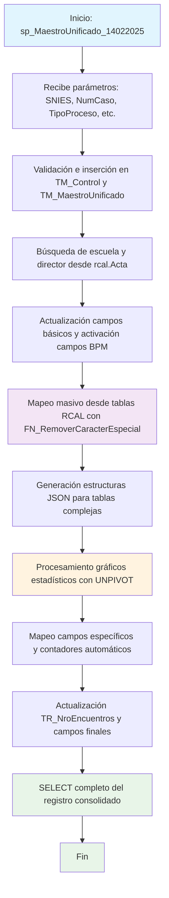

### sp_MaestroUnificado_14022025

Versión actualizada del procedimiento maestro del sistema BPM4US para consolidar datos académicos en el maestro unificado. Mantiene la funcionalidad principal del procedimiento anterior pero con optimizaciones y correcciones específicas implementadas en febrero 2025, incluyendo mejoras en el mapeo de datos, generación de gráficos estadísticos y estructura JSON.

#### Diagrama de flujo


#### Procedimiento almacenado
```sql
/*
|sp_MaestroUnificado_04022024||
|sp_MaestroUnificado_14022025|/_-=================================================================================================================================================================
Author: Johana Henao
Create Date: 26/06/2024
Description: 1.Procedimiento almacenado para capturar los datos del conjunto de datos y consolidarlos en maestro unificado [CUN].[TM_MaestroUnificado]
Version: 01
EXEC CUN.sp_MaestroUnificado '54639', '000000010596 ',3,1,'Alejandra Porras Alarcón','Alejandra Porras Alarcón'
EXEC CUN.sp_MaestroUnificado '54639', '000000011495 ',1,2,'Alejandra Porras Alarcón','Alejandra Porras Alarcón'
EXEC CUN.sp_MaestroUnificado '20241120', '000000012419 ', 1, 4, 'Alejandra Porras Alarcón','Alejandra Porras Alarcón'
EXEC CUN.sp_MaestroUnificado 202400140, '000000000143', 1, 4, 'Alejandra Porras Alarcón','Alejandra Porras Alarcón'
EXEC CUN.sp_MaestroUnificado 202400120, '000000013126', 1, 4, 'Alejandra Porras Alarcón','Alejandra Porras Alarcón'
--=================================================================================================================================================================_/
*/
create Procedure [CUN].[sp_MaestroUnificado_14022025]
( @pSNIES varchar(255)
,@pNumCaso VARCHAR(250)
,@pTipoProceso int
,@pNivel int
,@Instanciador nvarchar(450)
,@NombreInstanciador varchar(450)
)
AS

---

declare @Escuela varchar(max)
declare @idDirector varchar(max)
declare @Director varchar(max)
declare @idEscuela int
---Actualiza datos del director y escuela --------------------------------------------------------
DECLARE @sqlQuery NVARCHAR(450);

CREATE TABLE #ResultadoTemporal (
FirstName NVARCHAR(256),
LastName NVARCHAR(256),
Id VARCHAR(160),
NumCaso VARCHAR(250)
);

---

BEGIN
print 1
print convert(varchar(40), getdate(), 109)
--Valida si el Número de caso enviado por parámetro existe o no en el maestro unificado
INSERT INTO [CUN].[TM_Control] (Fecha, SNIES, NumCaso)
VALUES (GETDATE(), @pSNIES, @pNumCaso);
IF NOT EXISTS (
SELECT 1
FROM [CUN].[TM_MaestroUnificado]
WHERE NumeroCaso = @pNumCaso
)
BEGIN
INSERT INTO [CUN].[TM_MaestroUnificado] (NumeroCaso, codigoSnies)
VALUES (@pNumCaso, @pSNIES);
END

    --se pone condicional 17-sept joha
    UPDATE [CUN].[TM_MaestroUnificado]
    SET TipoDeProceso = @pTipoProceso --CASE WHEN @pTipoProceso = 3 THEN 0 ELSE @pTipoProceso END
       ,NivelFormacion = @pNivel
    WHERE NumeroCaso = @pNumCaso;

/_ SET @sqlQuery = '
INSERT INTO #ResultadoTemporal (FirstName, LastName, Id)
SELECT PrimerNombre, PrimerApellido, Id
FROM OPENQUERY([BPM4US],
''SELECT _
FROM BPM4USCUN.dbo.AspNetUsers
WHERE Id = (SELECT InstanciadoPor
FROM BPM4UsCun.casos.TM_Caso
WHERE Numero = ''''' + @pNumCaso + ''''')'')';

    --print @sqlQuery
    -- Se ejecuta la consulta dinámica y se inserta los resultados en la tabla temporal para buscar luego los datos de escuela y director
    EXEC sp_executesql @sqlQuery;
    if not exists (SELECT top 1 1 FROM #ResultadoTemporal)
    begin
      raiserror('No se encontró al instanciador del caso: ', 18, 18 )
      return;
    end;
    update #ResultadoTemporal
    set NumCaso = @pNumCaso*/

if @NombreInstanciador is null
begin
raiserror('No se encontró al instanciador del caso: ', 18, 18 )
return;
end;
SELECT @Escuela = TR_Escuela
FROM rcal.Acta
WHERE TR_SNIES = @pSNIES;
Print '@Escuela'
Print @Escuela
if @Escuela is null  
 begin
raiserror('No se encontró la escuela ', 18, 18 )
return;
end;
SELECT @idEscuela = id,
@idDirector = Id_director
FROM cun.TP_Escuela
WHERE Nombre = @Escuela
if @idEscuela is null  
 begin
raiserror('La escuela no coincide con el maestro ', 18, 18 )
return;
end;

    UPDATE [CUN].[TM_MaestroUnificado]
    SET IdEscuela = @idEscuela
       ,Escuela  = @Escuela
       ,IdDirector = @idDirector
       ,Director = @NombreInstanciador
    WHERE NumeroCaso = @pNumCaso;

    DROP TABLE #ResultadoTemporal;
    ----------------------------------------------------------------------------------------------

    --Activación de campos usados en BPM =============================================================================
    UPDATE [CUN].[TM_MaestroUnificado]
    SET AccionPorCondicion			= NULL
       ,ObservaAcuerdo				= 1
       ,observaIntroduccion			= 1
       ,observaDenominacionC1		= CASE WHEN @pTipoProceso = 3 THEN 0 ELSE 1 END
       ,ObservaJustificacionC2		= 1
       ,ObservaAspecCurriC3			= 1
       ,ObservaContenidosCurriC4	= 1
       ,ObservaInvestigacionC5		= 1
       ,ObservaRelacionExtC6		= 1
       ,ObservaProfesoresC7			= 1
       ,ObservaMediosEducaC8		= 1
       ,ObservaInfraestructuraC9	= 1
     WHERE NumeroCaso = @pNumCaso


    --Mapeo de datos tablas CUN a Maestro Unificado =============================================================================
     UPDATE A
     SET A.NumeroDeActa = CUN.FN_RemoverCaracterEspecial(B.TR_NumeroActa)
        ,A.CodigoSnies = CUN.FN_RemoverCaracterEspecial(B.TR_SNIES) --se descomenta 10-09 joha
    	--,A.TipoDeProceso = CUN.FN_RemoverCaracterEspecial(B.TR_Proceso)
    	,A.NombreProgramaPro = CUN.FN_RemoverCaracterEspecial(B.TR_NombreProgramaPro)
    	,A.NombreProgramaTP = CUN.FN_RemoverCaracterEspecial(B.TR_NombreProgramaTP)
    	,A.NombreProgramaTG = CUN.FN_RemoverCaracterEspecial(B.TR_NombreProgramaTG)
    	,A.Modalidades = CUN.FN_RemoverCaracterEspecial(B.TR_Modalidad)
    	,A.Regionales = CUN.FN_RemoverCaracterEspecial(B.TR_Regionales)
    	,A.TipoRegistro = CUN.FN_RemoverCaracterEspecial(B.TR_TipoRegistro)
    	,A.NombrePosgrado = CUN.FN_RemoverCaracterEspecial(B.TR_NombreProgramaEsp)
    	,A.DuracionTecnico = CUN.FN_RemoverCaracterEspecial(B.TR_DuracionTP)
    	,A.Duraciontecnologo = CUN.FN_RemoverCaracterEspecial(B.TR_DuracionTG)
    	,A.DuracionProfesional = CUN.FN_RemoverCaracterEspecial(B.TR_DuracionPro)
    	,A.DuracionEspecializacion =  CUN.FN_RemoverCaracterEspecial(B.TR_DuracionEsp)
    	,A.NombreDeLaEscuela = CUN.FN_RemoverCaracterEspecial(B.TR_Escuela)
    	,A.Ciudad = CUN.FN_RemoverCaracterEspecial(B.TR_Regionales)
    	--,A.TotalDeEstudiantes = CUN.FN_RemoverCaracterEspecial(B.TR_EstudiantesPrimerSemestre)--CUN.FN_RemoverCaracterEspecial(B.TR_NumeroEstudiantes)
    	,A.TR_EstudiantesPrimerSemestre = CUN.FN_RemoverCaracterEspecial(B.TR_EstudiantesPrimerSemestre)
        ,A.TituloEsp =  CUN.FN_RemoverCaracterEspecial(B.TR_TituloEsp)

,A.TituloProfesional = CUN.FN_RemoverCaracterEspecial(B.TR_TitulopRO) --MCDT20240823 Plantilla c3_renovacionpro
,A.TR_TituloTG = CUN.FN_RemoverCaracterEspecial(B.TR_TituloTG) --MCDT20240828 --Se actualiza nombre de etiqueta 17-09 Joha
,A.TR_TituloTp = CUN.FN_RemoverCaracterEspecial(B.TR_TituloTP) --MCDT20240828 --Se actualiza nombre de etiqueta 17-09 Joha
--,A.F2_NombrePrograma = CUN.FN_RemoverCaracterEspecial(B.TR_NombreProgramaPro) --25-9 Joha: se agrega campo --2-10 Joha: Se comenta línea porque se actualiza al final dependiente del programa
FROM [CUN].[TM_MaestroUnificado] A
INNER JOIN [RCAL].[Acta] B
ON B.TR_SNIES = A.CodigoSnies
WHERE A.NumeroCaso = @pNumCaso
--16 sept - ajuste mapeo
UPDATE A
SET A.NumeroDeAcuerdo = CUN.FN_RemoverCaracterEspecial(B.F_NumeroAcuerdo)
,A.FechaDelAcuerdo = cast(CUN.FN_RemoverCaracterEspecial(B.F_FechaAcuerdo)as date)
FROM [CUN].[TM_MaestroUnificado] A
INNER JOIN [RCAL].[Acuerdo] B
ON B.TR_SNIES = A.CodigoSnies
WHERE A.NumeroCaso = @pNumCaso

    --Nuevo 11-9 joha
    UPDATE A
    SET A.ImpactoCuantitativo = CUN.FN_RemoverCaracterEspecial(B.F3_DescripccionImpactCuant)
    FROM [CUN].[TM_MaestroUnificado] A
    INNER JOIN [RCAL].F3_DescripccionImpactCuant B
    		ON B.TR_SNIES = A.CodigoSnies
    WHERE A.NumeroCaso = @pNumCaso

    --Nuevo 18-9 joha
    UPDATE A
    SET A.AnalisisPeriodoRegional = CUN.FN_RemoverCaracterEspecial(B.F2_AnalisisPeriodoRegional)
    FROM [CUN].[TM_MaestroUnificado] A
    INNER JOIN [RCAL].F2_AnalisisPeriodoRegional B
    		ON B.TR_SNIES = A.CodigoSnies
    WHERE A.NumeroCaso = @pNumCaso

    --Nuevo 11-9 joha
    UPDATE A
    SET A.AnalisisConvenioRegional1 = CUN.FN_RemoverCaracterEspecial(B.F6_ConvenioRegional)
    FROM [CUN].[TM_MaestroUnificado] A
    INNER JOIN [RCAL].F6_ConvenioRegional B
    		ON B.TR_SNIES = A.CodigoSnies
    WHERE A.NumeroCaso = @pNumCaso

    UPDATE A
    SET A.TR_RangoA = CAST(YEAR(GETDATE()) - 7 AS VARCHAR(4)) + ' - ' + CAST(YEAR(GETDATE()) - 1 AS VARCHAR(4))
    FROM [CUN].[TM_MaestroUnificado] A
    WHERE A.NumeroCaso = @pNumCaso

    --8-10 joha: nuevo mapeo
    UPDATE A
    SET A.F6_CantidadA = CAST(YEAR(GETDATE())  AS VARCHAR(4)) + ' - ' + CAST(YEAR(GETDATE()) + 7 AS VARCHAR(4))
    FROM [CUN].[TM_MaestroUnificado] A
    WHERE A.NumeroCaso = @pNumCaso

    UPDATE A
    SET A.AjusteSemantico = CUN.FN_RemoverCaracterEspecial(B.F1_AjusteSemantico)
    FROM [CUN].[TM_MaestroUnificado] A
    INNER JOIN [RCAL].[F1_AjusteSemantico] B
    		ON B.TR_SNIES = A.CodigoSnies
    WHERE A.NumeroCaso = @pNumCaso

    UPDATE A
    SET A.AnalisisDeDescercion = CUN.FN_RemoverCaracterEspecial(B.F2_AnalisisDesercion)
    FROM [CUN].[TM_MaestroUnificado] A
    INNER JOIN [RCAL].[F2_AnalisisDesercion] B
    		ON B.TR_SNIES = A.CodigoSnies
    WHERE A.NumeroCaso = @pNumCaso

    --Nuevo mapeo 10-09 joha
    UPDATE A
    SET A.F1_CampoAED = CUN.FN_RemoverCaracterEspecial(B.F1_CampoAED)
    FROM [CUN].[TM_MaestroUnificado] A
    INNER JOIN [RCAL].[F1_CampoAED] B
    		ON B.TR_SNIES = A.CodigoSnies
    WHERE A.NumeroCaso = @pNumCaso

    UPDATE A
    SET A.AnalisisEmpleabilidadH = CUN.FN_RemoverCaracterEspecial(B.F2_AnalisisEmpleabilidadH)
    FROM [CUN].[TM_MaestroUnificado] A
    INNER JOIN [RCAL].[F2_AnalisisEmpleabilidadH] B
    		ON B.TR_SNIES = A.CodigoSnies
    WHERE A.NumeroCaso = @pNumCaso

    UPDATE A
    SET A.AnalisisDeDatos = CUN.FN_RemoverCaracterEspecial(B.F2_AnalisisEstadistico)
    FROM [CUN].[TM_MaestroUnificado] A
    INNER JOIN [RCAL].[F2_AnalisisEstadistico] B
    		ON B.TR_SNIES = A.CodigoSnies
    WHERE A.NumeroCaso = @pNumCaso

    UPDATE A
    SET A.Factual = CUN.FN_RemoverCaracterEspecial(B.TR_AñoActual)
      , A.TR_SectorEconomico = CUN.FN_RemoverCaracterEspecial(B.TR_SectorEconomico) --se mapea campo 10-09 joha
      , A.TR_NivelDeFormacion = CUN.FN_RemoverCaracterEspecial(B.TR_NivelFormacion) --se mapea campo 25-09 joha
    FROM [CUN].[TM_MaestroUnificado] A
    INNER JOIN [RCAL].[tbl_Programa] B
    		ON B.TR_SNIES = A.CodigoSnies
    WHERE A.NumeroCaso = @pNumCaso

    UPDATE A
    SET A.ExpectativaEstudiantil = CUN.FN_RemoverCaracterEspecial(B.F2_AnalisisExpectativasEstd)
    FROM [CUN].[TM_MaestroUnificado] A
    INNER JOIN [RCAL].[F2_AnalisisExpectativasEstd] B
    		ON B.TR_SNIES = A.CodigoSnies
    WHERE A.NumeroCaso = @pNumCaso

    UPDATE A
    SET A.AnalisisReferentes = CUN.FN_RemoverCaracterEspecial(B.F2_AnalisisReferentes)
    FROM [CUN].[TM_MaestroUnificado] A
    INNER JOIN [RCAL].[F2_AnalisisReferentes] B
    		ON B.TR_SNIES = A.CodigoSnies
    WHERE A.NumeroCaso = @pNumCaso

    UPDATE A
    SET A.AnalisisEscenario = CUN.FN_RemoverCaracterEspecial(B.F6_AnalaisisTablaEscPract)
    FROM [CUN].[TM_MaestroUnificado] A
    INNER JOIN [RCAL].[F6_AnalaisisTablaEscPract] B
    		ON B.TR_SNIES = A.CodigoSnies
    WHERE A.NumeroCaso = @pNumCaso

    UPDATE A
    SET A.AnalisisProgramaInt = CUN.FN_RemoverCaracterEspecial(B.F2_AnalisisTendCompInt)
    FROM [CUN].[TM_MaestroUnificado] A
    INNER JOIN [RCAL].[F2_AnalisisTendCompInt] B
    		ON B.TR_SNIES = A.CodigoSnies
    WHERE A.NumeroCaso = @pNumCaso

    UPDATE A
    SET A.AporteSociedad = CUN.FN_RemoverCaracterEspecial(B.F2_AporteSociedad)
    FROM [CUN].[TM_MaestroUnificado] A
    INNER JOIN [RCAL].[F2_AporteSociedad] B
    		ON B.TR_SNIES = A.CodigoSnies
    WHERE A.NumeroCaso = @pNumCaso

    UPDATE A
    SET A.AtributosProgramas = CUN.FN_RemoverCaracterEspecial(B.F2_AtributosProgramas)
    FROM [CUN].[TM_MaestroUnificado] A
    INNER JOIN [RCAL].[F2_AtributosProgramas] B
    		ON B.TR_SNIES = A.CodigoSnies
    WHERE A.NumeroCaso = @pNumCaso

    UPDATE A
    SET A.EnfoqueHaciaLaIndustria = CUN.FN_RemoverCaracterEspecial(B.F2_EnfoqueInd)
    FROM [CUN].[TM_MaestroUnificado] A
    INNER JOIN [RCAL].[F2_EnfoqueInd] B
    		ON B.TR_SNIES = A.CodigoSnies
    WHERE A.NumeroCaso = @pNumCaso

    UPDATE A
    SET A.EnfoqueLogicoMatematico = CUN.FN_RemoverCaracterEspecial(B.F2_EnfoqueMat)
    FROM [CUN].[TM_MaestroUnificado] A
    INNER JOIN [RCAL].[F2_EnfoqueMat] B
    		ON B.TR_SNIES = A.CodigoSnies
    WHERE A.NumeroCaso = @pNumCaso

    UPDATE A
    SET A.EnfoqueDeResposabilidadSocial = CUN.FN_RemoverCaracterEspecial(B.F2_EnfoqueRS)
    FROM [CUN].[TM_MaestroUnificado] A
    INNER JOIN [RCAL].[F2_EnfoqueRS] B
    		ON B.TR_SNIES = A.CodigoSnies
    WHERE A.NumeroCaso = @pNumCaso

    UPDATE A
    SET A.EnfoqueHaciaLaSostenibilidad = CUN.FN_RemoverCaracterEspecial(B.F2_EnfoqueSos)
    FROM [CUN].[TM_MaestroUnificado] A
    INNER JOIN [RCAL].[F2_EnfoqueSos] B
    		ON B.TR_SNIES = A.CodigoSnies
    WHERE A.NumeroCaso = @pNumCaso

print 'Es aqui el error? 0'
UPDATE A
SET A.JustificacionModalidades = CUN.FN_RemoverCaracterEspecial(B.F2_JustificacionModalidad)
FROM [CUN].[TM_MaestroUnificado] A
INNER JOIN [RCAL].[F2_JustificacionModalidad] B
ON B.TR_SNIES = A.CodigoSnies
WHERE A.NumeroCaso = @pNumCaso
print 'Es aqui el error? 1'
UPDATE A
SET A.ExplicacionModalidades = CUN.FN_RemoverCaracterEspecial(B.F2_ExplicacionModalidades)
FROM [CUN].[TM_MaestroUnificado] A
INNER JOIN [RCAL].[F2_ExplicacionModalidades] B
ON B.TR_SNIES = A.CodigoSnies
WHERE A.NumeroCaso = @pNumCaso
print 'Es aqui el error? 2'
--mapeo campo 09-09 joha
UPDATE A
SET A.Salarios = CUN.FN_RemoverCaracterEspecial(B.F2_Salarios)
FROM [CUN].[TM_MaestroUnificado] A
INNER JOIN [RCAL].[F2_Salarios] B
ON B.TR_SNIES = A.CodigoSnies
WHERE A.NumeroCaso = @pNumCaso

    UPDATE A
    SET A.AnalisisGruposInvestigacion = CUN.FN_RemoverCaracterEspecial(B.F5_AnalasisTabla17)
    FROM [CUN].[TM_MaestroUnificado] A
    INNER JOIN [RCAL].[F5_AnalasisTabla17] B
    		ON B.TR_SNIES = A.CodigoSnies
    WHERE A.NumeroCaso = @pNumCaso

    UPDATE A
    SET A.ResumenD = CUN.FN_RemoverCaracterEspecial(B.F2_ResumenModificacion)
    FROM [CUN].[TM_MaestroUnificado] A
    INNER JOIN [RCAL].[F2_ResumenModificacion] B
            ON B.TR_SNIES = A.CodigoSnies
    WHERE A.NumeroCaso = @pNumCaso

    UPDATE A
    SET A.SectorEmpleabilidad = CUN.FN_RemoverCaracterEspecial(B.F2_SectorEmpleabilidad)
    FROM [CUN].[TM_MaestroUnificado] A
    INNER JOIN [RCAL].[F2_SectorEmpleabilidad] B
    		ON B.TR_SNIES = A.CodigoSnies
    WHERE A.NumeroCaso = @pNumCaso

    UPDATE A
    SET A.JustificacionDelPlanNrl = CUN.FN_RemoverCaracterEspecial(B.F2_JustificacionPlanNRL)
    FROM [CUN].[TM_MaestroUnificado] A
    INNER JOIN [RCAL].[F2_JustificacionPlanNRL] B
    		ON B.TR_SNIES = A.CodigoSnies
    WHERE A.NumeroCaso = @pNumCaso

    UPDATE A
    SET A.PlanDeDesarrolloNrl = CUN.FN_RemoverCaracterEspecial(B.F2_RedaccionPlanDesarrolloNRL)
    FROM [CUN].[TM_MaestroUnificado] A
    INNER JOIN [RCAL].[F2_RedaccionPlanDesarrolloNRL] B
    		ON B.TR_SNIES = A.CodigoSnies
    WHERE A.NumeroCaso = @pNumCaso

    UPDATE A
    SET A.ResumenConceptTyE = CUN.FN_RemoverCaracterEspecial(B.F3_ResumenConceptTyE)
    FROM [CUN].[TM_MaestroUnificado] A
    INNER JOIN [RCAL].[F3_ResumenConceptTyE] B
    		ON B.TR_SNIES = A.CodigoSnies
    WHERE A.NumeroCaso = @pNumCaso

    UPDATE A
    SET A.tipoDeFormacion = CUN.FN_RemoverCaracterEspecial(B.TR_NivelFormacion),
    	A.NumeroCreditos = CUN.FN_RemoverCaracterEspecial(B.TR_TotalCreditos),
    	A.Cal_UnidadPeriodicidad = CUN.FN_RemoverCaracterEspecial(B.Cal_UnidadPeriodicidad)
    FROM [CUN].[TM_MaestroUnificado] A
    INNER JOIN [RCAL].[Tbl_1_Cond1] B
    		ON B.TR_SNIES = A.CodigoSnies
    WHERE A.NumeroCaso = @pNumCaso

    UPDATE A
    SET A.ElementoTyE = CUN.FN_RemoverCaracterEspecial(B.F3_ElementosTyE)
    FROM [CUN].[TM_MaestroUnificado] A
    INNER JOIN [RCAL].[F3_ElementosTyE] B
    		ON B.TR_SNIES = A.CodigoSnies
    WHERE A.NumeroCaso = @pNumCaso

    UPDATE A
    SET A.CompetenciaHabilidades = CUN.FN_RemoverCaracterEspecial(B.F4_CompetenciaHabilidades)
    FROM [CUN].[TM_MaestroUnificado] A
    INNER JOIN [RCAL].[F4_CompetenciaHabilidades] B
    		ON B.TR_SNIES = A.CodigoSnies
    WHERE A.NumeroCaso = @pNumCaso

    UPDATE A
    SET A.EnfoqueComplementario = CUN.FN_RemoverCaracterEspecial(B.F4_EnfoqueCompnComp)
    FROM [CUN].[TM_MaestroUnificado] A
    INNER JOIN [RCAL].[F4_EnfoqueCompnComp] B
    		ON B.TR_SNIES = A.CodigoSnies
    WHERE A.NumeroCaso = @pNumCaso

    UPDATE A
    SET A.GrupoInvestigacion = CUN.FN_RemoverCaracterEspecial(B.GrupoInvestigacion)
    FROM [CUN].[TM_MaestroUnificado] A
    INNER JOIN [RCAL].[Tbl_21_Cond5] B  --Cambio tabla 13-09 joha
    		ON B.TR_SNIES = A.CodigoSnies
    WHERE A.NumeroCaso = @pNumCaso

    UPDATE A
    SET A.ResumenInvsProgram = CUN.FN_RemoverCaracterEspecial(B.F5_ResumenInvsProgram)
    FROM [CUN].[TM_MaestroUnificado] A
    INNER JOIN [RCAL].[F5_ResumenInvsProgram] B
    		ON B.TR_SNIES = A.CodigoSnies
    WHERE A.NumeroCaso = @pNumCaso

    UPDATE A
    SET A.AnalisisProyeccion = CUN.FN_RemoverCaracterEspecial(B.F6_AnalisisProyecSoci)
    FROM [CUN].[TM_MaestroUnificado] A
    INNER JOIN [RCAL].[F6_AnalisisProyecSoci] B
    		ON B.TR_SNIES = A.CodigoSnies
    WHERE A.NumeroCaso = @pNumCaso

    UPDATE A
    SET A.AnalisisDocente1 = CUN.FN_RemoverCaracterEspecial(B.F7_AnalisisDocente)
    FROM [CUN].[TM_MaestroUnificado] A
    INNER JOIN [RCAL].[F7_AnalisisDocente] B
    		ON B.TR_SNIES = A.CodigoSnies
    WHERE A.NumeroCaso = @pNumCaso

    --Nuevo  18-09 joha
    UPDATE A
    SET A.TR_MaxEst = CUN.FN_RemoverCaracterEspecial(B.F7_ConteoProfEstud)
    FROM [CUN].[TM_MaestroUnificado] A
    INNER JOIN [RCAL].[F7_ConteoProfEstud] B
    		ON B.TR_SNIES = A.CodigoSnies
    WHERE A.NumeroCaso = @pNumCaso

    ---19-09 la se actualiza la tabla
    UPDATE A
    SET A.TotalDeProfesores = CUN.FN_RemoverCaracterEspecial(B.TR_TotalProfesores)
    FROM [CUN].[TM_MaestroUnificado] A
    INNER JOIN [RCAL].[Tbl_conteo] B
    		ON B.TR_SNIES = A.CodigoSnies
    WHERE A.NumeroCaso = @pNumCaso

    --19-09 Nuevo Joha
    UPDATE A
    SET A.TR_Maximo = CUN.FN_RemoverCaracterEspecial(B.TR_Maximo)
    FROM [CUN].[TM_MaestroUnificado] A
    INNER JOIN [RCAL].[Tbl_conteo] B
    		ON B.TR_SNIES = A.CodigoSnies
    WHERE A.NumeroCaso = @pNumCaso

    --19-09 Nuevo Joha
    UPDATE A
    SET A.TR_Minimo = CUN.FN_RemoverCaracterEspecial(B.TR_Minimo)
    FROM [CUN].[TM_MaestroUnificado] A
    INNER JOIN [RCAL].[Tbl_conteo] B
    		ON B.TR_SNIES = A.CodigoSnies
    WHERE A.NumeroCaso = @pNumCaso

    UPDATE A
    SET A.InstruccionesParaElIngreso = CUN.FN_RemoverCaracterEspecial(B.F8_IngresoAulaVirtual)
    FROM [CUN].[TM_MaestroUnificado] A
    INNER JOIN [RCAL].[F8_IngresoAulaVirtual] B
    		ON B.TR_SNIES = A.CodigoSnies
    WHERE A.NumeroCaso = @pNumCaso

    UPDATE A
    SET A.DuracionProfesional = CUN.FN_RemoverCaracterEspecial(B.TR_Duracion)
       ,A.Titulo_Otorgado = CUN.FN_RemoverCaracterEspecial(B.TR_Titulo) --Cambio nombre campo 12-09 joha
       --,A.CursosDeInvestigacion = CUN.FN_RemoverCaracterEspecial(B.TR_totalCreditos)
       ,A.TR_PeriodicidadAdmision = CUN.FN_RemoverCaracterEspecial(B.TR_PeriodicidadAdminision)
       --,A.Modalidades = B.TR_Modalidad
    FROM [CUN].[TM_MaestroUnificado] A
    INNER JOIN [RCAL].[Tbl_1_Cond1] B
    		ON B.TR_SNIES = A.CodigoSnies
    WHERE A.NumeroCaso = @pNumCaso

    UPDATE A
    SET A.CapacidadEnMbps = CUN.FN_RemoverCaracterEspecial(B.TR_Mbps)
    FROM [CUN].[TM_MaestroUnificado] A
    INNER JOIN [RCAL].[tbl_MedioEducativoRecursos] B
    		ON B.TR_SNIES = A.CodigoSnies
    WHERE A.NumeroCaso = @pNumCaso

    UPDATE A
    SET A.ResolucionAnterior = CUN.FN_RemoverCaracterEspecial(B.TR_ResolucionRCAnt)
       ,A.TR_AnexoProcSelecAdq = CUN.FN_RemoverCaracterEspecial(B.TR_AnexoProcSelecAdq)
       ,A.TR_AnexoPoltDesarColec1 = CUN.FN_RemoverCaracterEspecial(B.TR_AnexoPoltDesarColec)
       ,A.TR_AnexoPolitUsoBiblioteca = CUN.FN_RemoverCaracterEspecial(B.TR_AnexoPolitUsoBiblioteca)
       ,A.TR_AnexoPolitGestBiblioteca = CUN.FN_RemoverCaracterEspecial(B.TR_AnexoPolitGestBiblioteca)
       ,A.TR_AnexoPolitARMEquipCompu = CUN.FN_RemoverCaracterEspecial(B.TR_AnexoPolitARMEquipCompu)
       ,A.TR_AnexoReglamentoBiblioteca = CUN.FN_RemoverCaracterEspecial(B.TR_AnexoReglamentoBiblioteca)
       ,A.TR_AnexoInstrucIngBibliVirt = CUN.FN_RemoverCaracterEspecial(B.TR_AnexoInstrucIngBibliVirt)
       ,A.TR_AnexoContBibliVirt = CUN.FN_RemoverCaracterEspecial(B.TR_AnexoContBibliVirt)
       ,A.TR_AnexoInforConsRecurBibli = CUN.FN_RemoverCaracterEspecial(B.TR_AnexoInforConsRecurBibli)
       ,A.TR_AnexoCaracterizacionPrograma = CUN.FN_RemoverCaracterEspecial(B.TR_AnexoCaracterizacionPrograma)
       ,A.TR_AnexoConveniosActivosNacInct = CUN.FN_RemoverCaracterEspecial(B.TR_AnexoConveniosActivosNacInct)
    FROM [CUN].[TM_MaestroUnificado] A
    INNER JOIN [RCAL].[tbl_Anexos] B
    		ON B.TR_SNIES = A.CodigoSnies
    WHERE A.NumeroCaso = @pNumCaso

    UPDATE A
    SET -- A.ModalidadAnterior = CUN.FN_RemoverCaracterEspecial(B.TR_ModalidadAnt) mcdt20240823 pm
         A.TotalDeMaterias = CUN.FN_RemoverCaracterEspecial(B.TR_ListaMaterias)   -- van a validar total es int y el otro es un varchar(max)
    	,A.ListaMateriaCreditos = CUN.FN_RemoverCaracterEspecial(B.TR_ListaMateria_Creditos)
    	,A.TotalDeHoras = CUN.FN_RemoverCaracterEspecial(B.TR_ListaMateria_Horas)
    	--,A.DuracionProfesional = CUN.FN_RemoverCaracterEspecial(B.TR_Duracion)  --- mcdt20240823 pm -- Esto para estructura curricular, c3-renovacionpro id 1571 OJO REVISAR
    	--,A.DuracionTecnico     = CUN.FN_RemoverCaracterEspecial(B.TR_DuracionTP) -- mcdt20240823 pm -- Esto para estructura curricular, c3-renovacionpro id 1571
    	--,A.Duraciontecnologo  = CUN.FN_RemoverCaracterEspecial(B.TR_DuracionTG)-- mcdt20240823 pm -- Esto para estructura curricular, c3-renovacionpro id 1571
    	,A.CreditosPro = CUN.FN_RemoverCaracterEspecial(B.TR_CreditosPro)
    	,A.CreditosTp = CUN.FN_RemoverCaracterEspecial(B.TR_CreditosTP)
    	,A.CreditosTg = CUN.FN_RemoverCaracterEspecial(B.TR_CreditosTG)
    	,A.CreditoDisciplinar = CUN.FN_RemoverCaracterEspecial(B.TR_CreditosDisciplinar)
    	,A.CreditoAcademico = CUN.FN_RemoverCaracterEspecial(B.TR_CreditosAcademicos)
    	,A.CreditoElectivo = CUN.FN_RemoverCaracterEspecial(B.TR_CreditosElectivos)
        ,A.CreditosPropedeuticos = CUN.FN_RemoverCaracterEspecial(B.TR_CreditosPropedeuticos) --- mcdt20240823 pm -- Esto para estructura curricular,
    	,A.AsignaturasPropedeuticas = CUN.FN_RemoverCaracterEspecial(B.TR_AsignaturasPropedeuticas)
    	,A.Rae = CUN.FN_RemoverCaracterEspecial(B.TR_RAE)
    	--,A.PerfilEgreso = CUN.FN_RemoverCaracterEspecial(B.TE_PerfilEgreso)
    	--,A.PerfilProfesional = CUN.FN_RemoverCaracterEspecial(B.TE_PerfilProfesional) --cambio tabla 11-09 joha
        ,A.CursoDisciplinar = CUN.FN_RemoverCaracterEspecial(B.TE_CursoDisciplinar)
    	,A.EditableRae = CUN.FN_RemoverCaracterEspecial(B.TE_RAE)
    	,A.CursosTransversales = CUN.FN_RemoverCaracterEspecial(B.TE_CursosTransversal)
        ,A.cursosElectivos = CUN.FN_RemoverCaracterEspecial(B.TE_CursosElectivo)
    	,A.CursosComplementarios = CUN.FN_RemoverCaracterEspecial(B.TE_CursosComplementario)
    	,A.CursosDeProfundizacion = CUN.FN_RemoverCaracterEspecial(B.TE_CursosProfundizacion)
    	,A.Componente = CUN.FN_RemoverCaracterEspecial(B.TE_Componente)
    	,A.TR_CursoIntegracion = CUN.FN_RemoverCaracterEspecial(B.TR_CursoIntegracion)
    	,A.TR_CursoProyectoI = CUN.FN_RemoverCaracterEspecial(B.TR_CursoProyectoI)
    	,A.TR_CursoProyectoII = CUN.FN_RemoverCaracterEspecial(B.TR_CursoProyectoII)
    	,A.TR_Duracion = CUN.FN_RemoverCaracterEspecial(B.TR_Duracion)
    	,A.TR_CursosInvest = CUN.FN_RemoverCaracterEspecial(B.TR_CursosInvestigacion) --se agrega campo 11-09- joha
    	--,A.Cal_UnidadPeriodicidad = CUN.FN_RemoverCaracterEspecial(B.Cal_UnidadPeriodicidad) --se mueve a Tbl1_Cond1 9-09 joha
    	--,A.NumeroCreditos = CUN.FN_RemoverCaracterEspecial(B.TR_TotalCreditos) -- se cambia a tabla Tbl1_cond1 9-09 joha
    	--,A.PerfilOcupacional = CUN.FN_RemoverCaracterEspecial(B.TE_PerfilOcupacional)
    	--, A.FDeIngreso = CUN.FN_RemoverCaracterEspecial(B.TE_PerfilIngreso) -- mcdt20240823 pm -- Esto para estructura curricular, c3-renovacionpro id 1571 REVISAR CAMPO DUPLICADO
    	,A.TR_CursosElectivas = CUN.FN_RemoverCaracterEspecial(B.TR_CursosElectivas)
    FROM [CUN].[TM_MaestroUnificado] A
    INNER JOIN [RCAL].[tbl_EstructuraCurricular] B
    		ON B.TR_SNIES = A.CodigoSnies
    WHERE A.NumeroCaso = @pNumCaso

    --nuevo 11-09 joha
    UPDATE A
    SET A.PerfilProfesional = CUN.FN_RemoverCaracterEspecial(B.F3_PerfilProfesional)
    FROM [CUN].[TM_MaestroUnificado] A
    INNER JOIN [RCAL].F3_PerfilProfesional B
    		ON B.TR_SNIES = A.CodigoSnies
    WHERE A.NumeroCaso = @pNumCaso

    UPDATE A
    SET A.PerfilEgreso = CUN.FN_RemoverCaracterEspecial(B.F3_PerfilEgreso)
    FROM [CUN].[TM_MaestroUnificado] A
    INNER JOIN [RCAL].[F3_PerfilEgreso] B
    		ON B.TR_SNIES = A.CodigoSnies
    WHERE A.NumeroCaso = @pNumCaso

    UPDATE A
    SET A.PerfilOcupacional = CUN.FN_RemoverCaracterEspecial(B.F3_PerfilOcupacional)
    FROM [CUN].[TM_MaestroUnificado] A
    INNER JOIN [RCAL].[F3_PerfilOcupacional] B
    		ON B.TR_SNIES = A.CodigoSnies
    WHERE A.NumeroCaso = @pNumCaso

    --se actualiza etiqueta -- joha 9-09
    UPDATE A
    SET A.TE_PerfilIngreso = CUN.FN_RemoverCaracterEspecial(B.F3_PerfilIngreso)
    FROM [CUN].[TM_MaestroUnificado] A
    INNER JOIN [RCAL].[F3_PerfilIngreso] B
    		ON B.TR_SNIES = A.CodigoSnies
    WHERE A.NumeroCaso = @pNumCaso

    --UPDATE A

-- SET A.MetrosDeConstruccion = CUN.FN_RemoverCaracterEspecial(B.TR_M2)
-- ,A.TotalDeSalones = COUNT(B.TR_Salones)
-- ,A.TotalDeSalas = CUN.FN_RemoverCaracterEspecial(B.TR_SalaProfesores)
-- ,A.NumeroEspacios = CUN.FN_RemoverCaracterEspecial(B.TE_NumeroEspacios)
-- ,A.TR_CantidadA = CUN.FN_RemoverCaracterEspecial(B.TR_CantidadAños)
-- ,A.TR_SedeCUN = CUN.FN_RemoverCaracterEspecial(B.TR_SedeCUN)
-- ,A.TotalDeEstudiantes = COUNT(B.TR_NumeroEstudiantes)
--FROM [CUN].[TM_MaestroUnificado] A
--INNER JOIN [RCAL].[tbl_InfraestructuraFisica] B
-- ON B.TR_SNIES = A.CodigoSnies
--WHERE A.CodigoSnies = @pSNIES

    --se descomenta: joha 06-09
    UPDATE A
    SET A.IntroduccionConvenios = CUN.FN_RemoverCaracterEspecial(B.F6_IntroducConven)
    FROM [CUN].[TM_MaestroUnificado] A
    INNER JOIN [RCAL].[F6_IntroducConven] B
    		ON B.TR_SNIES = A.CodigoSnies
    WHERE A.CodigoSnies = @pSNIES

    UPDATE A
    SET A.MetrosDeConstruccion = CUN.FN_RemoverCaracterEspecial(B.TR_M2),
    	A.TotalDeSalones = SubQuery.TotalSalones,
    	A.TotalDeSalas = CUN.FN_RemoverCaracterEspecial(B.TR_SalaProfesores),
    	A.NumeroEspacios = CUN.FN_RemoverCaracterEspecial(B.TE_NumeroEspacios),
    	A.TR_CantidadA = CUN.FN_RemoverCaracterEspecial(B.TR_CantidadAños),
    	A.TR_SedeCUN = CUN.FN_RemoverCaracterEspecial(B.TR_SedeCUN),
    	A.TotalDeEstudiantes = SubQuery.TotalEstudiantes
    FROM [CUN].[TM_MaestroUnificado] A
    INNER JOIN [RCAL].[tbl_InfraestructuraFisica] B
    	    ON B.TR_SNIES = A.CodigoSnies
    INNER JOIN (SELECT TR_SNIES,
    				   COUNT(TR_Salones) AS TotalSalones,
    				   COUNT(TR_NumeroEstudiantes) AS TotalEstudiantes
    			FROM [RCAL].[tbl_InfraestructuraFisica]
    			GROUP BY TR_SNIES) SubQuery
    			ON SubQuery.TR_SNIES = B.TR_SNIES
    WHERE A.NumeroCaso = @pNumCaso;

    UPDATE A
    SET A.CursosDeInvestigacion = CUN.FN_RemoverCaracterEspecial(B.TR_CursosInvestg)
       ,A.TR_DescrpnLineasPrograma = CUN.FN_RemoverCaracterEspecial(B.TR_DescrpLineasPrograma)
    FROM [CUN].[TM_MaestroUnificado] A
    INNER JOIN [RCAL].[tbl_Investigacion] B
    		ON B.TR_SNIES = A.CodigoSnies
    WHERE A.NumeroCaso = @pNumCaso

    UPDATE A
    SET A.ProgramaAnterior = CUN.FN_RemoverCaracterEspecial(B.TR_NombreProgramaProAnt)
       ,A.ModalidadAnterior = CUN.FN_RemoverCaracterEspecial(B.TR_ModalidadAnt)
       ,A.SemestreDeIngreso = CUN.FN_RemoverCaracterEspecial(B.F_SemestreIngreso)
       ,A.FDeIngreso = CUN.FN_RemoverCaracterEspecial(B.F_AñoIngreso)
       ,A.NumeroProgramas = CUN.FN_RemoverCaracterEspecial(B.TR_NumeroProgramas)
       ,A.TE_AreaFormacion = CUN.FN_RemoverCaracterEspecial(B.TE_AreaFormacion)
    FROM [CUN].[TM_MaestroUnificado] A
    INNER JOIN [RCAL].[tbl_Programa] B
    		ON B.TR_SNIES = A.CodigoSnies
    WHERE A.NumeroCaso = @pNumCaso

    UPDATE A
    SET A.ModeloPedagogico = CUN.FN_RemoverCaracterEspecial(B.[F3_DescripccionModPedag])
    FROM [CUN].[TM_MaestroUnificado] A
    INNER JOIN [RCAL].[F3_DescripccionModPedag] B
    		ON B.TR_SNIES = A.CodigoSnies
    WHERE A.NumeroCaso = @pNumCaso

    UPDATE A
    SET A.NumeroPorcentual = CUN.FN_RemoverCaracterEspecial(B.F2_NumeroPorcentual)
    FROM [CUN].[TM_MaestroUnificado] A
    INNER JOIN [RCAL].F2_NumeroPorcentual B
    		ON B.TR_SNIES = A.CodigoSnies
    WHERE A.NumeroCaso = @pNumCaso

    UPDATE A
    SET A.F3_AlianzasCUN = CUN.FN_RemoverCaracterEspecial(B.F3_AlianzasCUN)
    FROM [CUN].[TM_MaestroUnificado] A
    INNER JOIN [RCAL].[F3_AlianzasCUN] B
    		ON B.TR_SNIES = A.CodigoSnies
    WHERE A.NumeroCaso = @pNumCaso

    UPDATE A
    SET A.ProfesoresTiempoCompleto = CUN.FN_RemoverCaracterEspecial(B.TR_NumeroDocentesTiempoComplt)
       ,A.ProfesoresMedioTiempo = CUN.FN_RemoverCaracterEspecial(B.TR_NumeroDocentesMedioTiempo)
       ,A.TR_Modificacion = CUN.FN_RemoverCaracterEspecial(B.TR_Modificacion)
    FROM [CUN].[TM_MaestroUnificado] A
    INNER JOIN [RCAL].[tbl_Profesor] B
    		ON B.TR_SNIES = A.CodigoSnies
    WHERE A.NumeroCaso = @pNumCaso

    UPDATE A
    SET A.ConvenioVigente1 = CUN.FN_RemoverCaracterEspecial(B.TR_ConvenioVigente)
    FROM [CUN].[TM_MaestroUnificado] A
    INNER JOIN [RCAL].[tbl_SectorExterno] B
    		ON B.TR_SNIES = A.CodigoSnies
    WHERE A.NumeroCaso = @pNumCaso

    UPDATE A
    SET A.F1_AnalisisCorrespondenciaTitulo = CUN.FN_RemoverCaracterEspecial(B.F1_AnalisisCorrespondenciaTitulo)
    FROM [CUN].[TM_MaestroUnificado] A
    INNER JOIN [RCAL].[F1_AnalisisCorrespondenciaTitulo] B
    		ON B.TR_SNIES = A.CodigoSnies
    WHERE A.NumeroCaso = @pNumCaso

    UPDATE A
    SET A.AjusteDeAsignaturas = CUN.FN_RemoverCaracterEspecial(B.F4_AjusteAsignaturas)
    FROM [CUN].[TM_MaestroUnificado] A
    INNER JOIN [RCAL].[F4_AjusteAsignaturas] B
    		ON B.TR_SNIES = A.CodigoSnies
    WHERE A.NumeroCaso = @pNumCaso

    UPDATE A
    SET A.PlanTransicion = CUN.FN_RemoverCaracterEspecial(B.F4_DescripcionPlanTransicion)
    FROM [CUN].[TM_MaestroUnificado] A
    INNER JOIN [RCAL].[F4_DescripcionPlanTransicion] B
    		ON B.TR_SNIES = A.CodigoSnies
    WHERE A.NumeroCaso = @pNumCaso

    UPDATE A
    SET A.ActividadAcademica = CUN.FN_RemoverCaracterEspecial(B.F4_ActividadAcademica)
    FROM [CUN].[TM_MaestroUnificado] A
    INNER JOIN [RCAL].[F4_ActividadAcademica] B
    		ON B.TR_SNIES = A.CodigoSnies
    WHERE A.NumeroCaso = @pNumCaso

    UPDATE A
    SET A.F3_ImplementacionRA = CUN.FN_RemoverCaracterEspecial(B.F3_ImplementacionRA)
    FROM [CUN].[TM_MaestroUnificado] A
    INNER JOIN [RCAL].[F3_ImplementacionRA] B
    		ON B.TR_SNIES = A.CodigoSnies
    WHERE A.NumeroCaso = @pNumCaso

    --UPDATE A --- MCDT 20241028
    --SET A.F8_CantidadA = CUN.FN_RemoverCaracterEspecial(B.F8_CantidadAños)
    --FROM [CUN].[TM_MaestroUnificado] A
    --INNER JOIN [RCAL].[F8_CantidadAños] B
    --		ON B.TR_SNIES = A.CodigoSnies
    --WHERE A.NumeroCaso = @pNumCaso

    --se actualiza nombre de etiqueta y lógica a campo 17-9 joha
    --se actualiza etiqueta 11-9 joha
    UPDATE [CUN].[TM_MaestroUnificado] --MCDT20240829 La asignacion del campo esta  duplicada LAS
    SET TR_NumeroDocente  = (SELECT COUNT(CUN.FN_RemoverCaracterEspecial(TR_NumeroDocentes)) 'TR_NumeroDocente'
    						 FROM [RCAL].[tbl_Profesor]
    						 WHERE TR_SNIES = @pSNIES )
    WHERE NumeroCaso = @pNumCaso;

    UPDATE MU -- MCDT20240916 se elimina como json.
    SET AnalisisEstudiantes = CUN.FN_RemoverCaracterEspecial(F2_AnalisisEstudiantes)
    FROM [CUN].[TM_MaestroUnificado] MU
    INNER JOIN [RCAL].[F2_AnalisisEstudiantes] FA
    		ON FA.TR_SNIES = MU.CodigoSnies
    WHERE NumeroCaso = @pNumCaso;
    -----------------------------------------------------------------------------------
    UPDATE A  -- mcdt20240823 pm
    SET A.AportesPlanes = CUN.FN_RemoverCaracterEspecial(B.F2_AportePlanes)
    FROM [CUN].[TM_MaestroUnificado] A
    INNER JOIN [RCAL].[F2_AportePlanes] B
    		ON B.TR_SNIES = A.CodigoSnies
    WHERE A.NumeroCaso = @pNumCaso

    UPDATE A
    SET A.F3_CreditosPropedeuticos = CUN.FN_RemoverCaracterEspecial(B.F3_CreditosPropedeutico)
    FROM [CUN].[TM_MaestroUnificado] A
    INNER JOIN [RCAL].[F3_CreditosPropedeutico] B
    		ON B.TR_SNIES = A.CodigoSnies
    WHERE A.NumeroCaso = @pNumCaso

    UPDATE [CUN].[TM_MaestroUnificado]
       SET tipoDeRegistro = (SELECT CUN.FN_RemoverCaracterEspecial(TR_TipoRegistro)
    						 FROM [RCAL].[Acta]
    						 WHERE TR_SNIES = @pSNIES )
     WHERE NumeroCaso = @pNumCaso;

     --Actualización de F2_NombrePrograma para Modificación: profesional, Tecnologo, Tecnico Profesional, Especializacion, no se encotro nombre de programa solo para modificación
     UPDATE [CUN].[TM_MaestroUnificado]
    	SET F2_NombrePrograma = COALESCE(NombreProgramaPro, NombreProgramaTP, NombreProgramaTG, NombrePosgrado,  'No se encotró nombre de programa')
     WHERE NumeroCaso = @pNumCaso;

     --02-10 Joha: Mapeo de nuevas etiquetas
     --08-10 Joha: Se elimina tabla desde CUN
     --UPDATE A

-- SET A.F6_CantidadA = CUN.FN_RemoverCaracterEspecial(B.F6_CabtidadAños)
--FROM [CUN].[TM_MaestroUnificado] A
--INNER JOIN RCAL.F6_CabtidadAños B
-- ON B.TR_SNIES = A.CodigoSnies
--WHERE A.NumeroCaso = @pNumCaso

     --UPDATE A -- MCDT20241025 ELIMINAN LA TABLA

-- SET A.F7_CantidadA = CUN.FN_RemoverCaracterEspecial(B.F7_CabtidadAños)
--FROM [CUN].[TM_MaestroUnificado] A
--INNER JOIN RCAL.F7_CantidadAños B
-- ON B.TR_SNIES = A.CodigoSnies
--WHERE A.NumeroCaso = @pNumCaso

    	 --08-10: Joha: Se comentan por solicitud de Daniel, ya no se van a usar
    --UPDATE A

-- SET A.F2_AObtencionTitulo = CUN.FN_RemoverCaracterEspecial(B.F2_AñosObtencionTitulo)
--FROM [CUN].[TM_MaestroUnificado] A
--INNER JOIN RCAL.F2_AñosObtencionTitulo B
-- ON B.TR_SNIES = A.CodigoSnies
--WHERE A.NumeroCaso = @pNumCaso

     --UPDATE A

-- SET A.F2_ImpactoSalarial = CUN.FN_RemoverCaracterEspecial(B.F2_ImpactoSalarial)
--FROM [CUN].[TM_MaestroUnificado] A
--INNER JOIN RCAL.F2_ImpactoSalarial B
-- ON B.TR_SNIES = A.CodigoSnies
--WHERE A.NumeroCaso = @pNumCaso

     --08-10 Joha: Se elimina por solicitud de Daniel
     --UPDATE A

-- SET A.F4_NumeroDeSemanas = CUN.FN_RemoverCaracterEspecial(B.F4_NumeroSemanas)
--FROM [CUN].[TM_MaestroUnificado] A
--INNER JOIN RCAL.F4_NumeroSemanas B
-- ON B.TR_SNIES = A.CodigoSnies
--WHERE A.NumeroCaso = @pNumCaso

     --03-10 Joha: Mapeo nueva etiqueta
     UPDATE A
     SET A.TR_TipoModificacion = CUN.FN_RemoverCaracterEspecial(B.TR_TipoModificacion)
     FROM [CUN].[TM_MaestroUnificado] A
     INNER JOIN RCAL.tbl_MedioEducativoRecursos  B
    		 ON B.TR_SNIES = A.CodigoSnies
     WHERE A.NumeroCaso = @pNumCaso

    --Actualización de Tablas ====================================================================================================================
    UPDATE [CUN].[TM_MaestroUnificado]
    SET tablaDetallePrograma = (SELECT CUN.FN_RemoverCaracterEspecial(TR_NombrePrograma)                               'Denominación del programa' --Cambio nombre campo 12-09 joha
    								  ,CUN.FN_RemoverCaracterEspecial(TR_Titulo)                                       'Título que otorga' --Cambio nombre campo 12-09 joha
    								  ,CUN.FN_RemoverCaracterEspecial(TR_totalCreditos)                                   'Número de créditos académicos'
    								  ,CUN.FN_RemoverCaracterEspecial(TR_Modalidad)                                       'Modalidad'
    								  ,CUN.FN_RemoverCaracterEspecial(TR_NivelFormacion)                                  'Nivel de formación'
    								  ,CUN.FN_RemoverCaracterEspecial(TR_Regionales)                                      'Regionales'
    								  ,CUN.FN_RemoverCaracterEspecial(CONCAT(TR_Duracion, ' - ', Cal_UnidadPeriodicidad)) 'Duración Estimada'
    								  ,CUN.FN_RemoverCaracterEspecial(TR_PeriodicidadAdminision)                          'Periodicidad de admisión'
    								  ,CUN.FN_RemoverCaracterEspecial(TR_EstudiantesPrimerSemestre)                       'Número de estudiantes a admitir en primer semestre'
    								  ,CUN.FN_RemoverCaracterEspecial(CONCAT('acuerdo institucional ', F_NumeroAcuerdo, ' del consejo Directivo expedido el DIA ', TR_FechaAcuerdo_dia, ' de MES ', TR_FechaAcuerdo_mes, ' del año ', TR_FechaAcuerdo_año)) 'Acto interno de creación'
    								  ,CUN.FN_RemoverCaracterEspecial(TR_SNIES)                            'Código SNIES'
    							FROM [RCAL].[Tbl_1_Cond1]
    							WHERE TR_SNIES = @pSNIES --, WITHOUT_ARRAY_WRAPPER
    							FOR JSON PATH)
    WHERE NumeroCaso = @pNumCaso;

    UPDATE [CUN].[TM_MaestroUnificado]
    SET TablaReferentes  = (SELECT CUN.FN_RemoverCaracterEspecial(Institucion)           'Institución'
    							  ,CUN.FN_RemoverCaracterEspecial(Denominacion)          'Denominación'
    							  ,CUN.FN_RemoverCaracterEspecial(Título_Otorgado)       'Título otorgado'
    							  ,CUN.FN_RemoverCaracterEspecial(Número_créditos)       'Número créditos'
    							  ,CUN.FN_RemoverCaracterEspecial(Modalidad)             'Modalidad'
    							  ,CUN.FN_RemoverCaracterEspecial(Lugar_de_ofrecimiento) 'Lugar de ofrecimiento'
    							  ,CUN.FN_RemoverCaracterEspecial(Duracion_estimada)     'Duración estimada'
    							  ,CUN.FN_RemoverCaracterEspecial(Perfil)                'Perfil'
    							  ,CUN.FN_RemoverCaracterEspecial(Valor_Semestre)        'Valor semestre'
    						FROM [RCAL].[F2_Referentes]
    						WHERE TR_SNIES = @pSNIES
    						FOR JSON PATH)
    WHERE NumeroCaso = @pNumCaso;

    UPDATE [CUN].[TM_MaestroUnificado]
    SET ComProgramasInt  = (SELECT CUN.FN_RemoverCaracterEspecial(Institucion)        'Institución'
    							  ,CUN.FN_RemoverCaracterEspecial(Caracter_Academico) 'Carácter académico'
    							  ,CUN.FN_RemoverCaracterEspecial(Denominacion)       'Denominación'
    							  ,CUN.FN_RemoverCaracterEspecial(TR_TituloPro)       'Título otorgado'
    							  ,CUN.FN_RemoverCaracterEspecial(Numero_creditos)    'Número créditos'
    							  ,CUN.FN_RemoverCaracterEspecial(Duracion_estimada)  'Duración estimada'
    							  ,CUN.FN_RemoverCaracterEspecial(TR_regionales)      'Lugar de ofrecimiento'
    							  ,CUN.FN_RemoverCaracterEspecial(Pagina_Web_Fuente)  'Página web (Fuente)'
    						FROM [RCAL].[F2_ComProgramasInt]
    						WHERE TR_SNIES = @pSNIES
    						FOR JSON PATH)
    WHERE NumeroCaso = @pNumCaso;

    UPDATE [CUN].[TM_MaestroUnificado]
    SET estadisticaEstudianteIaM  = (SELECT  CUN.FN_RemoverCaracterEspecial(Institucion)        AS 'Institucion'
    										,CUN.FN_RemoverCaracterEspecial(      Denominacion) AS 'Denominacion'
    										,CUN.FN_RemoverCaracterEspecial(JSON_Response)      AS 'JSON_Response'
    										,CUN.FN_RemoverCaracterEspecial(Inscritos_2018)     AS 'Inscritos_2018'
    										,CUN.FN_RemoverCaracterEspecial(Inscritos_2019)     AS 'Inscritos_2019'
    										,CUN.FN_RemoverCaracterEspecial(Inscritos_2020)     AS 'Inscritos_2020'
    										,CUN.FN_RemoverCaracterEspecial(Inscritos_2021)     AS 'Inscritos_2021'
    										,CUN.FN_RemoverCaracterEspecial(Inscritos_2022)     AS 'Inscritos_2022'
    										,CUN.FN_RemoverCaracterEspecial(Inscritos_2023)     AS 'Inscritos_2023'
    										,CUN.FN_RemoverCaracterEspecial(Inscritos_2024)     AS 'Inscritos_2024'
    										,CUN.FN_RemoverCaracterEspecial(Admitidos_2018)     AS 'Admitidos_2018'
    										,CUN.FN_RemoverCaracterEspecial(Admitidos_2019)     AS 'Admitidos_2019'
    										,CUN.FN_RemoverCaracterEspecial(Admitidos_2020)     AS 'Admitidos_2020'
    										,CUN.FN_RemoverCaracterEspecial(Admitidos_2021)     AS 'Admitidos_2021'
    										,CUN.FN_RemoverCaracterEspecial(Admitidos_2022)     AS 'Admitidos_2022'
    										,CUN.FN_RemoverCaracterEspecial(Admitidos_2023)     AS 'Admitidos_2023'
    										,CUN.FN_RemoverCaracterEspecial(Admitidos_2024)     AS 'Admitidos_2024'
    										,CUN.FN_RemoverCaracterEspecial(Matriculados_2018)  AS 'Matriculados_2018'
    										,CUN.FN_RemoverCaracterEspecial(Matriculados_2019)  AS 'Matriculados_2019'
    										,CUN.FN_RemoverCaracterEspecial(Matriculados_2020)  AS 'Matriculados_2020'
    										,CUN.FN_RemoverCaracterEspecial(Matriculados_2021)  AS 'Matriculados_2021'
    										,CUN.FN_RemoverCaracterEspecial(Matriculados_2022)  AS 'Matriculados_2022'
    										,CUN.FN_RemoverCaracterEspecial(Matriculados_2023)  AS 'Matriculados_2023'
    										,CUN.FN_RemoverCaracterEspecial(Matriculados_2024)  AS 'Matriculados_2024'
    										,CUN.FN_RemoverCaracterEspecial(Graduados_2018)     AS 'Graduados_2018'
    										,CUN.FN_RemoverCaracterEspecial(Graduados_2019)     AS 'Graduados_2019'
    										,CUN.FN_RemoverCaracterEspecial(Graduados_2020)     AS 'Graduados_2020'
    										,CUN.FN_RemoverCaracterEspecial(Graduados_2021)     AS 'Graduados_2021'
    										,CUN.FN_RemoverCaracterEspecial(Graduados_2022)     AS 'Graduados_2022'
    										,CUN.FN_RemoverCaracterEspecial(Graduados_2023)     AS 'Graduados_2023'
    										,CUN.FN_RemoverCaracterEspecial(Graduados_2024)     AS 'Graduados_2024'
    								 FROM [RCAL].[F2_AnalisisEstaMatri]
    								 WHERE TR_SNIES = @pSNIES
    								 FOR JSON PATH)
    WHERE NumeroCaso = @pNumCaso;

    UPDATE [CUN].[TM_MaestroUnificado]
    SET ConvenioRegional1  = (SELECT CUN.FN_RemoverCaracterEspecial(Codigo_Convenio)                  AS 'Codigo_Convenio'
    								,CUN.FN_RemoverCaracterEspecial(Nombre_Entidad_se_tiene_convenio) AS 'Nombre_Entidad_se_tiene_convenio'
    								,CUN.FN_RemoverCaracterEspecial(Regional)                         AS 'Regional'
    								,CUN.FN_RemoverCaracterEspecial(Fecha_Inicio_Convenio)            AS 'Fecha_Inicio_Convenio'
    								,CUN.FN_RemoverCaracterEspecial(Fecha_fin_Convenio)               AS 'Fecha_fin_Convenio'
    								,CUN.FN_RemoverCaracterEspecial(Prorroga_Automática_Regional)     AS 'Prorroga_Automática_Regional'
    							FROM [RCAL].[Tbl_21_Cond6]
    							WHERE TR_SNIES = @pSNIES
    							FOR JSON PATH)
    WHERE NumeroCaso = @pNumCaso;

    --UPDATE A

-- SET A.ConvenioRegional1 = CUN.FN_RemoverCaracterEspecial(B.F6_ConvenioRegional)
--FROM [CUN].[TM_MaestroUnificado] A
--INNER JOIN [RCAL].[Tbl_21_Cond6] B
-- ON B.TR_SNIES = A.CodigoSnies
--WHERE A.CodigoSnies = @pSNIES
UPDATE [CUN].[TM_MaestroUnificado]
SET periodoEstudioRegional = (SELECT CUN.FN_RemoverCaracterEspecial(TR_AñoActual) 'Año(1)'
,CUN.FN_RemoverCaracterEspecial(Periodo) 'Período'
,CUN.FN_RemoverCaracterEspecial(Matriculados_total) 'Matriculados Total'
FROM [RCAL].[Tbl_5_Cond2]
WHERE TR_SNIES = @pSNIES
FOR JSON PATH)
WHERE NumeroCaso = @pNumCaso;

    --Cambio por completo la tabla ******************************************************************************************************************
    UPDATE [CUN].[TM_MaestroUnificado] ---- modificar  mcdt20240823 pm cambia toda la tabla -
    SET inscritosAdmitidosMatriculados = (SELECT   CUN.FN_RemoverCaracterEspecial([TR_AñoActual])                  'Año Actual'
    											  ,CUN.FN_RemoverCaracterEspecial([Periodo])                       'Periodo'
    											  ,CUN.FN_RemoverCaracterEspecial([Inscritos])                     'Inscritos'
    											  ,CUN.FN_RemoverCaracterEspecial([Admitidos])                     'Admitidos'
    											  ,CUN.FN_RemoverCaracterEspecial([Matriculados_Total])            'Matriculados_Total'
    											  ,CUN.FN_RemoverCaracterEspecial([TR_EstudiantesPrimerSemestre])  'Estudiantes Primer Semestre'
    											  ,CUN.FN_RemoverCaracterEspecial([Graduados])                     'Graduados'
    											  ,CUN.FN_RemoverCaracterEspecial([Retirados])                     'Retirados'
    											  ,CUN.FN_RemoverCaracterEspecial([Tasa_de_desercion])             'Tasa de desercion'
    									  FROM [RCAL].[Tbl_6_Cond2]
    								WHERE TR_SNIES = @pSNIES
    								FOR JSON PATH)
    WHERE NumeroCaso = @pNumCaso;

    UPDATE [CUN].[TM_MaestroUnificado]
    SET tablaEmpleabilidad = (SELECT CUN.FN_RemoverCaracterEspecial(TR_SectorEconomico)    'Sector Económico'
    							    ,CUN.FN_RemoverCaracterEspecial(TR_NivelFormacion)     'Formación Técnica profesional'
    							    ,CUN.FN_RemoverCaracterEspecial(Formacion_Tecnologica) 'Formación Tecnológica'
    							    ,CUN.FN_RemoverCaracterEspecial(Formacion_profesional) 'Formación profesional'
    							    ,CUN.FN_RemoverCaracterEspecial(Total)                 'Total'
    						  FROM [RCAL].[F2_EmpleabilidadEgresado]
    						  WHERE TR_SNIES = @pSNIES
    						  FOR JSON PATH)
    WHERE NumeroCaso = @pNumCaso;

    ---30-08-2024 (Joha) --- De la CUN cambiaron la estructura de la tabla
    --cambio tabla 09-09 joha
    --16 sept joha: de la cun cambiaron nombres de campos
    UPDATE [CUN].[TM_MaestroUnificado]
    SET TablaRangoSalarial = (SELECT CUN.FN_RemoverCaracterEspecial(Rango_salarial)  AS 'Rango Salarial'
    								,CUN.FN_RemoverCaracterEspecial([2024])          AS '2024'
    								,CUN.FN_RemoverCaracterEspecial([2024%])         AS '2024%'
    								,CUN.FN_RemoverCaracterEspecial([2023])          AS '2023'
    								,CUN.FN_RemoverCaracterEspecial([2023%])         AS '2023%'
    								,CUN.FN_RemoverCaracterEspecial([2022])          AS '2022'
    								,CUN.FN_RemoverCaracterEspecial([2022%])         AS '2022%'
    								,CUN.FN_RemoverCaracterEspecial([2021])          AS '2021'
    								,CUN.FN_RemoverCaracterEspecial([2021%])         AS '2021%'
    								,CUN.FN_RemoverCaracterEspecial([2020])          AS '2020'
    								,CUN.FN_RemoverCaracterEspecial([2020%])         AS '2020%'
    						  FROM [RCAL].Tbl6_Cond2_ESP
    						  WHERE TR_SNIES = @pSNIES
    						  FOR JSON PATH)
    WHERE NumeroCaso = @pNumCaso;

    UPDATE [CUN].[TM_MaestroUnificado]
    SET estudiosRepresentado = (SELECT   CUN.FN_RemoverCaracterEspecial([Asignatura])                               AS 'Asignatura'
    									,CUN.FN_RemoverCaracterEspecial([Creditos_academicos])                      AS 'Creditos_academicos'
    									--,CUN.FN_RemoverCaracterEspecial([Horas_de_trabajo_academico_acompañado])    AS 'Horas_de_trabajo_academico_acompañado'
    									--,CUN.FN_RemoverCaracterEspecial([Horas_de_trabajo_academico_independiente]) AS 'Horas_de_trabajo_academico_independiente'
    									,CUN.FN_RemoverCaracterEspecial([Horas_de_trabajo_academico_totales])       AS 'Horas_de_trabajo_academico_totales'
    									--,CUN.FN_RemoverCaracterEspecial([Componente_de_Formacion_disciplinar])      AS 'Componente_de_Formacion_disciplinar'
    									--,CUN.FN_RemoverCaracterEspecial([Componente_de_Formacion_propedeutica])     AS 'Componente_de_Formacion_propedeutica'
    									--,CUN.FN_RemoverCaracterEspecial([Componente_de_Formacion_transversal])      AS 'Componente_de_Formacion_transversal'
    									--,CUN.FN_RemoverCaracterEspecial([Componente_de_Formacion_electivo])         AS 'Componente_de_Formacion_electivo'
    									,CUN.FN_RemoverCaracterEspecial([Semestre])                                 AS 'Semestre'
    							FROM [RCAL].[Tbl_8_Cond3]
    							WHERE TR_SNIES = @pSNIES
    							FOR JSON PATH)
    WHERE NumeroCaso = @pNumCaso;

    UPDATE [CUN].[TM_MaestroUnificado]
    SET InvestigacionDeLaEscuela = (SELECT CUN.FN_RemoverCaracterEspecial([Escuela])           AS 'Escuela'
    									  ,CUN.FN_RemoverCaracterEspecial([Lineas_De_Escuela]) AS 'Lineas_De_Escuela'
    								FROM [RCAL].[Tbl_19_Cond5]
    								WHERE TR_SNIES = @pSNIES
    								FOR JSON PATH)
    WHERE NumeroCaso = @pNumCaso;

    --se comentan lineas esto no es una tabla: joha 6-09
    --UPDATE [CUN].[TM_MaestroUnificado]
    --SET IntroduccionConvenios = (SELECT  CUN.FN_RemoverCaracterEspecial([Codigo_Convenio])                  AS 'Codigo_Convenio'
    --									,CUN.FN_RemoverCaracterEspecial([Nombre_Entidad_se_tiene_convenio]) AS 'Nombre_Entidad_se_tiene_convenio'
    --									,CUN.FN_RemoverCaracterEspecial([Regional])                         AS 'Regional'
    --									,CUN.FN_RemoverCaracterEspecial([Fecha_Inicio_Convenio])            AS 'Fecha_Inicio_Convenio'
    --									,CUN.FN_RemoverCaracterEspecial([Fecha_fin_Convenio])               AS 'Fecha_fin_Convenio'
    --									,CUN.FN_RemoverCaracterEspecial([Prorroga_Automática_Regional])     AS 'Prorroga_Automática_Regional'
    --							FROM [RCAL].[Tbl_21_Cond6]
    --							WHERE TR_SNIES = @pSNIES
    --							FOR JSON PATH)
    --WHERE NumeroCaso = @pNumCaso;

    UPDATE [CUN].[TM_MaestroUnificado]
    SET contenidosGeneralesActividades	 = (SELECT CUN.FN_RemoverCaracterEspecial(Semestre)   'Semestre'
    											  ,CUN.FN_RemoverCaracterEspecial(Asignatura) 'Asignatura'
    											  ,CUN.FN_RemoverCaracterEspecial(Contenidos) 'Contenidos'
    										FROM [RCAL].[Tbl_9_Cond3]
    									    WHERE TR_SNIES = @pSNIES
    									    FOR JSON PATH)

    UPDATE [CUN].[TM_MaestroUnificado]
    SET contenidosAsignaturasElectivas = (SELECT --  CUN.FN_RemoverCaracterEspecial(Asignatura) 'Asignatura'
    											 --, CUN.FN_RemoverCaracterEspecial(Contenidos) 'Contenidos'
    											 CUN.FN_RemoverCaracterEspecial([Electivas_de_profundizacion_Asignatura])  'Electivas de profundizacion Asignatura'
                                                ,CUN.FN_RemoverCaracterEspecial([Electivas_de_profundizacion_Contenidos])  'Electivas de profundizacion Contenidos'
                                                ,CUN.FN_RemoverCaracterEspecial([Electivas_Complementarias_Asignatura])    'Electivas Complementarias Asignatura'
                                                ,CUN.FN_RemoverCaracterEspecial([Electivas_Complementarias_Contenidos])    'Electivas Complementarias Contenidos'
    										FROM [RCAL].Tbl_10_Cond3     ---[Tbl_12_Cond3] mcdt20240823 pm cambia la tabla ---Tbl_9_Cond3_ESP cambio la tabla 09-09 joha  --25-9 Joha: se cambia a tabla Tbl_10_Cond3
    											 WHERE TR_SNIES = @pSNIES
    										 FOR JSON PATH)
    WHERE NumeroCaso = @pNumCaso;

    UPDATE [CUN].[TM_MaestroUnificado]
    SET InvestigacionPrograma = (SELECT  CUN.FN_RemoverCaracterEspecial([LINEAS_DE_PROGRAMA]) AS 'Lineas de Programa'
    									,CUN.FN_RemoverCaracterEspecial([PROGRAMA_ACADEMICO]) AS 'Programa Academico'
    									  FROM [RCAL].[Tbl_20_Cond5]
    								WHERE TR_SNIES = @pSNIES
    								FOR JSON PATH)
    WHERE NumeroCaso = @pNumCaso;

    UPDATE [CUN].[TM_MaestroUnificado]  -- MCDT20240823  PM estaba comentarizado , se activa y se agrega el campo
    SET TablaRae  = (SELECT CUN.FN_RemoverCaracterEspecial(DOMINIO_DE_COMPETENCIA)                                         'Dominio de competencia'
    					   ,CUN.FN_RemoverCaracterEspecial(MACROCOMPETENCIAS_NIVEL_AXONOMICO)                              'Nivel taxoníomico de la competencia'
    					   ,CUN.FN_RemoverCaracterEspecial(MACROCOMPETENCIAS_OBJETO_CONDICION_FINALIDAD)                   'Macrocompetencias Objeto-Condición-Finalidad'
    					   ,CUN.FN_RemoverCaracterEspecial(ESPACIOS_ACADEMICOS_ASOCIADO_AL_RESULTADO)                      'Espacios académico asociados al resultado de aprendizaje'
    					   ,CUN.FN_RemoverCaracterEspecial(RESULTADOS_APRENDIZAJE_DEL_PROGRAMA_NIVEL_TAXONOMICO)           'Nivel tazonómico del resultado de aprendizaje'
    					   ,CUN.FN_RemoverCaracterEspecial(RESULTADOS_APRENDIZAJE_DEL_PROGRAMA_OBJETO_CONDICION_FINALIDAD) 'Resultado aprendizaje Objeto-Condición-Finalidad'
    					   --se agregan campos: 13-9 joha
    					   ,CUN.FN_RemoverCaracterEspecial(NOMBRE_PROGRAMA) 'NOMBRE PROGRAMA'
    					   ,CUN.FN_RemoverCaracterEspecial(TR_NumeroActa) 'Numero Acta'
    					   ,CUN.FN_RemoverCaracterEspecial(F_NumeroAcuerdo) 'NumeroAcuerdo'
    				 FROM [RCAL].[F3_RAE] --21-10 Joha: Se actualiza tabla
    				WHERE TR_SNIES = @pSNIES
    				 FOR JSON PATH)
    WHERE NumeroCaso = @pNumCaso;

    --cambio tabla y estructura 11-09 joha
    --cambia tabla 17-09 joha
    UPDATE [CUN].[TM_MaestroUnificado] -- MCDT20240823 PM se decomentariza sesion de trabajo
    SET impactoDeProyeccionSocial = (SELECT
    										CUN.FN_RemoverCaracterEspecial(Poblacion_Beneficiada)                'Población beneficiada'
    									   ,CUN.FN_RemoverCaracterEspecial(Num_proyectos)                        'Nº de proyectos'
    									   ,CUN.FN_RemoverCaracterEspecial(Num_actividades)                      'Nº de actividades'
    									   ,CUN.FN_RemoverCaracterEspecial(Relacionamiento_con_actores_externos) 'Relacionamiento con actores externos'
    									   ,CUN.FN_RemoverCaracterEspecial(Num_convenios)                        'Nº de convenios'
    								 FROM [RCAL].[F3_ImpactProyeccSoci]
    								 WHERE TR_SNIES = @pSNIES
    							     FOR JSON PATH)
    WHERE NumeroCaso = @pNumCaso;

    UPDATE [CUN].[TM_MaestroUnificado]/* -- MCDT20240823 PM se decomentariza sesion de trabajo OJO REVISAR EL SELECT SIN SNIES*/ ---ERROR REVISAR
       SET consolidadoDeResultados = (SELECT   CUN.FN_RemoverCaracterEspecial([Item_Año])   'Item_Año'
       									      ,CUN.FN_RemoverCaracterEspecial([2016])       '2016'
       									      ,CUN.FN_RemoverCaracterEspecial([2017])       '2017'
       									      ,CUN.FN_RemoverCaracterEspecial([2018])       '2018'
       									      ,CUN.FN_RemoverCaracterEspecial([2019])       '2019'
       									      ,CUN.FN_RemoverCaracterEspecial([2020])       '2020'
       									      ,CUN.FN_RemoverCaracterEspecial([2021])       '2021'
       									      ,CUN.FN_RemoverCaracterEspecial([2022])       '2022'
       									      ,CUN.FN_RemoverCaracterEspecial([2023])       '2023'
    										  ,CUN.FN_RemoverCaracterEspecial([2024_A])       '2024_A'
       								    FROM rcal.Tbl_13_Cond3 --- MCDT20240904 -anterior tabla rcal.F3_ResulotProyeccSoci email Julio Cesar Ortiz
       								   WHERE TR_SNIES = @pSNIES
       								     FOR JSON PATH)
     WHERE NumeroCaso = @pNumCaso;

    ---Se elimina por solicitud de Alberto-------------------- --+++++++++++++++++++++++++++++++++++++++++++++si se debe devolver
    UPDATE [CUN].[TM_MaestroUnificado]  -- MCDT20240823 PM se decomentariza sesion de trabajo OJO REVISAR EL SELECT SIN SNIES
       SET tablanivelesingles  = (SELECT CUN.FN_RemoverCaracterEspecial(CICLO) 'Ciclo'
                                        ,CUN.FN_RemoverCaracterEspecial(NIVEL) 'Nivel'
    							   FROM [RCAL].[Tbl_14_Cond3]
    						      WHERE TR_SNIES = @pSNIES
    								FOR JSON PATH)
     WHERE NumeroCaso = @pNumCaso;

--/_
-- UPDATE [CUN].[TM_MaestroUnificado]
-- SET estrategiasFomento = (SELECT Estrategia
-- ,Descripcion 'Descripción'
-- FROM [RCAL].[Tbl_15_Cond3]
-- WHERE TR_SNIES = @pSNIES
-- FOR JSON PATH)
--_/

-- -- print 3
-- --print convert(varchar(40), getdate(), 109)
UPDATE [CUN].[TM_MaestroUnificado]
SET HorasSincronicasAsincronicas = (SELECT CUN.FN_RemoverCaracterEspecial(Asignatura) 'Asignatura'
,CUN.FN_RemoverCaracterEspecial(Creditos_academicos) 'Créditos académicos'
,CUN.FN_RemoverCaracterEspecial(Horas_de_trabajo_acompañado) 'Horas de trabajo acompañado'
,CUN.FN_RemoverCaracterEspecial([Horas_de trabajo_independiente]) 'Horas de trabajo independiente'
,CUN.FN_RemoverCaracterEspecial(Horas_de_trabajo_totales) 'Horas de trabajo totales'
,CUN.FN_RemoverCaracterEspecial(Semestre) 'Semestre'
FROM [RCAL].[Tbl_9_Cond4]
WHERE TR_SNIES = @pSNIES
FOR JSON PATH)
WHERE NumeroCaso = @pNumCaso;
UPDATE [CUN].[TM_MaestroUnificado]
SET ProfesoresTrabajosDeGrado = (SELECT CUN.FN_RemoverCaracterEspecial([TR_Profesor_Id]) AS 'TR_Profesor_Id'
,CUN.FN_RemoverCaracterEspecial([Tipo_Vinculacion]) AS 'Tipo_Vinculacion'
,CUN.FN_RemoverCaracterEspecial([Nivel_Formacion]) AS 'Nivel_Formacion'
,CUN.FN_RemoverCaracterEspecial([Area_Conocimiento]) AS 'Area_Conocimiento'
,CUN.FN_RemoverCaracterEspecial([TR_NombreProfesor]) AS 'TR_NombreProfesor'
FROM [RCAL].[Tbl_33_Cond7]
WHERE TR_SNIES = @pSNIES
FOR JSON PATH)
WHERE NumeroCaso = @pNumCaso;
UPDATE [CUN].[TM_MaestroUnificado]
SET AsignacionHorariaDeProfesores = (SELECT CUN.FN_RemoverCaracterEspecial([Num]) AS 'Num'
,CUN.FN_RemoverCaracterEspecial([TR_Profesor_Id]) AS 'TR_Profesor_Id'
,CUN.FN_RemoverCaracterEspecial([Nombre_Profesor]) AS 'Nombre_Profesor'
,CUN.FN_RemoverCaracterEspecial([Vinculacion]) AS 'Vinculacion'
,CUN.FN_RemoverCaracterEspecial([%_Dedicación_al_Programa]) AS '%\_Dedicación_al_Programa'
,CUN.FN_RemoverCaracterEspecial([%_Docencia]) AS '%\_Docencia'
,CUN.FN_RemoverCaracterEspecial([%_Investigación]) AS '%\_Investigación'
,CUN.FN_RemoverCaracterEspecial([%_Proyección Social]) AS '%\_Proyección Social'
,CUN.FN_RemoverCaracterEspecial([%_Otros]) AS '%\_Otros'
FROM [RCAL].[Tbl_20_Cond7]
WHERE TR_SNIES = @pSNIES
FOR JSON PATH)
WHERE NumeroCaso = @pNumCaso;

    UPDATE [CUN].[TM_MaestroUnificado]
    SET ListadoDeLibros = (SELECT    CUN.FN_RemoverCaracterEspecial([Item])            'Item'
    								,CUN.FN_RemoverCaracterEspecial([Titulo])          'Titulo'
    								,CUN.FN_RemoverCaracterEspecial([Autor])           'Autor'
    								,CUN.FN_RemoverCaracterEspecial([Año])             'Año'
    								--,CUN.FN_RemoverCaracterEspecial([SigTopografica])  'SigTopografica'
    								,CUN.FN_RemoverCaracterEspecial([Formato])         'Formato'
    							FROM [RCAL].[Tbl_31_Cond8]
    							WHERE TR_SNIES = @pSNIES
    							FOR JSON PATH)
    WHERE NumeroCaso = @pNumCaso;

    --mapeo tabla 9-09 joha
    UPDATE [CUN].[TM_MaestroUnificado]
    SET TablaVincLaboral = (SELECT CUN.FN_RemoverCaracterEspecial(Vinculación_Laboral_de_Recien_Graduados) 'Vinculacoón laboral de recien graduados'
    							 ,CUN.FN_RemoverCaracterEspecial(Total) 'Total'
    							FROM RCAL.Tbl_5_Cond2_ESP
    							WHERE TR_SNIES = @pSNIES
    							FOR JSON PATH)
    WHERE NumeroCaso = @pNumCaso;

    UPDATE [CUN].[TM_MaestroUnificado]
    SET GruposInvestigacionInstitucionales = (SELECT CUN.FN_RemoverCaracterEspecial(Escuela)               'Escuela'
    												,CUN.FN_RemoverCaracterEspecial(Grupo)                 'Grupo'
    												,CUN.FN_RemoverCaracterEspecial(Categoria_Colciencias) 'Categoría Colciencias'
    										  FROM [RCAL].[Tbl_17_Cond5]
    										  WHERE TR_SNIES = @pSNIES
    										  FOR JSON PATH)
    WHERE NumeroCaso = @pNumCaso;

    UPDATE [CUN].[TM_MaestroUnificado]
    SET LineasDeInvestigacion = (SELECT CUN.FN_RemoverCaracterEspecial(Gestion_y_Tecnologias)  'Gestión y Tecnologías'
    								   ,CUN.FN_RemoverCaracterEspecial(Innovación_Pedagogica)  'Innovación Pedagógica'
    								   ,CUN.FN_RemoverCaracterEspecial(Responsabilidad_Social) 'Responsabilidad_Social'
    						     FROM [RCAL].[Tbl_18_Cond5]
    							 WHERE TR_SNIES = @pSNIES
    							 FOR JSON PATH)
    WHERE NumeroCaso = @pNumCaso;

    UPDATE [CUN].[TM_MaestroUnificado]
    SET PlanDeInvestigacionDelPrograma  = (SELECT CUN.FN_RemoverCaracterEspecial(Objetivo)       'Objetivo'
                                                 ,CUN.FN_RemoverCaracterEspecial(Estrategia)     'Estrategia'
    											 ,CUN.FN_RemoverCaracterEspecial(Tactica)        'Tactica'
    											 ,CUN.FN_RemoverCaracterEspecial(Resultado)      'Resultado'
    											 ,CUN.FN_RemoverCaracterEspecial(Indicador)      'Indicador'
    											 ,CUN.FN_RemoverCaracterEspecial(Responsable)    'Responsable'
    									   FROM [RCAL].[F5_PlanInvestigacion]
    									   WHERE TR_SNIES = @pSNIES
    									   FOR JSON PATH)
    WHERE NumeroCaso = @pNumCaso; --24-9 joha:faltaba esta línea

    UPDATE [CUN].[TM_MaestroUnificado]
    SET PlanDeInteraccion = (SELECT  CUN.FN_RemoverCaracterEspecial([Objetivo])      'Objetivo'
    								,CUN.FN_RemoverCaracterEspecial([Campo_Accion])  'Campo_Accion'
    								,CUN.FN_RemoverCaracterEspecial([Estrategias])   'Estrategias'
    								,CUN.FN_RemoverCaracterEspecial([Actividades])   'Actividades'
    								,CUN.FN_RemoverCaracterEspecial([Resultado])     'Resultado'
    								,CUN.FN_RemoverCaracterEspecial([Indicadores])   'Indicadores'
    								,CUN.FN_RemoverCaracterEspecial([Responsable])   'Responsable'
    						     FROM [RCAL].[F6_PlanInteraccionSectExtr]
    							   WHERE TR_SNIES = @pSNIES
    							   FOR JSON PATH)
    WHERE NumeroCaso = @pNumCaso;

    UPDATE [CUN].[TM_MaestroUnificado]
    SET InversionesEstimadas1 = (SELECT CUN.FN_RemoverCaracterEspecial(TR_AñoActual)                            'Año'
    								   ,CUN.FN_RemoverCaracterEspecial(Proyeccion_Inversión_para_Investigación) 'Proyección de Inversión para la Investigación'
    						     FROM [RCAL].[F5_InversionesEstimadas]
    							   WHERE TR_SNIES = @pSNIES
    							   FOR JSON PATH)
    WHERE NumeroCaso = @pNumCaso;

    UPDATE [CUN].[TM_MaestroUnificado]
    SET ProduccionUltimos  = (SELECT CUN.FN_RemoverCaracterEspecial(TR_AñoActual)             'Año'
    								,CUN.FN_RemoverCaracterEspecial(TR_Profesor)              'Nombre'
    								,CUN.FN_RemoverCaracterEspecial(Producto_investigacion)   'Producto investigación'
    								,CUN.FN_RemoverCaracterEspecial(Lineas_de_investigacion)  'Lineas de investigación'
    								,CUN.FN_RemoverCaracterEspecial(TR_CyLac)                 'Cylac'
    						  FROM [RCAL].[F5_ProduccInvsProgram]
    							   WHERE TR_SNIES = @pSNIES
    							   FOR JSON PATH)
    WHERE NumeroCaso = @pNumCaso;

    UPDATE [CUN].[TM_MaestroUnificado]
    SET TresProfesores  = (SELECT CUN.FN_RemoverCaracterEspecial(TR_Profesor)       'Nombre'
    							 ,CUN.FN_RemoverCaracterEspecial(TR_NivelFormacion) 'Máximo nivel de formación'
    							 ,CUN.FN_RemoverCaracterEspecial(TR_CyLac)          'CyLac'
    							 ,CUN.FN_RemoverCaracterEspecial(TR_TipoContrato)   'Tipo de contrato'
    							 ,CUN.FN_RemoverCaracterEspecial(TR_horasAsignadas) 'Asignación horaria'
    						  FROM [RCAL].[Tbl_22_Cond5] --13-9 joha cambio tabla
    							   WHERE TR_SNIES = @pSNIES
    							   FOR JSON PATH)
    WHERE NumeroCaso = @pNumCaso;

    UPDATE [CUN].[TM_MaestroUnificado]
    SET ConveniosEstablecidos  = (SELECT CUN.FN_RemoverCaracterEspecial( [Eje])                         'Eje'
    									,CUN.FN_RemoverCaracterEspecial([Objetivo])                     'Objetivo'
    									,CUN.FN_RemoverCaracterEspecial([Actividad])                    'Actividad'
    									,CUN.FN_RemoverCaracterEspecial([Resultados_esperados])         'Resultados esperados'
    									,CUN.FN_RemoverCaracterEspecial([Año_1])                        'Año_1'
    									,CUN.FN_RemoverCaracterEspecial([Año_2])                        'Año_2'
    									,CUN.FN_RemoverCaracterEspecial([Año_3])                        'Año_3'
    									,CUN.FN_RemoverCaracterEspecial([Año_4])                        'Año_4'
    									,CUN.FN_RemoverCaracterEspecial([Año_5])                        'Año_5'
    									,CUN.FN_RemoverCaracterEspecial([Año_6])                        'Año_6'
    									,CUN.FN_RemoverCaracterEspecial([Año_7])                        'Año_7'
    									,CUN.FN_RemoverCaracterEspecial([Responsable_de_la_actividad])  'Responsable de la actividad'
    									,CUN.FN_RemoverCaracterEspecial([Recursos_requeridos])          'Recursos requeridos'
    									,CUN.FN_RemoverCaracterEspecial([Presupuesto])                  'Presupuesto'
    									--,CUN.FN_RemoverCaracterEspecial([JSON_Response])  'JSON_Response' MCDT202240828 NO VAN LOS JSONRESPONSE
    						  FROM [RCAL].[F6_PlanRelacSectExter]
    							   WHERE TR_SNIES = @pSNIES
    							   FOR JSON PATH)
    WHERE NumeroCaso = @pNumCaso;

    UPDATE [CUN].[TM_MaestroUnificado]
    SET ConveniosDeCooperacion  = (SELECT    CUN.FN_RemoverCaracterEspecial( [Vigencia_convenio])     'Vigencia_convenio'
    										,CUN.FN_RemoverCaracterEspecial([Numero_convenio])        'Numero_convenio'
    										,CUN.FN_RemoverCaracterEspecial([Objeto_convenio])        'Objeto_convenio'
    							   FROM [RCAL].[Tbl20_Cond6_ESP]
    							   WHERE TR_SNIES = @pSNIES
    							   FOR JSON PATH)
    WHERE NumeroCaso = @pNumCaso;

    UPDATE [CUN].[TM_MaestroUnificado]
    SET DocentesDelPrograma  = (SELECT CUN.FN_RemoverCaracterEspecial(Nombre)             'Nombre'
    								  ,CUN.FN_RemoverCaracterEspecial(Formación)          'Formación'
    								  ,CUN.FN_RemoverCaracterEspecial(Vinculación)        'Vinculación'
    								  ,CUN.FN_RemoverCaracterEspecial(Asignación_Horaria) 'Asignación horaria'
    						  FROM [RCAL].[Tbl_24_Cond6] --13-9 joha cambia tabla
    							   WHERE TR_SNIES = @pSNIES
    							   FOR JSON PATH)
    WHERE NumeroCaso = @pNumCaso;

    UPDATE [CUN].[TM_MaestroUnificado]
    SET ConvenioVigente1  = (SELECT  CUN.FN_RemoverCaracterEspecial([Codigo])                         'Codigo'
    								,CUN.FN_RemoverCaracterEspecial([Nombre_o_Razon_Social_Aliado])   'Nombre_o_Razon_Social_Aliado'
    								,CUN.FN_RemoverCaracterEspecial([Inicio_Vigencia_Regional])       'Inicio_Vigencia_Regional'
    								,CUN.FN_RemoverCaracterEspecial([Fin_Vigencia_Regional])          'Fin_Vigencia_Regional'
    								,CUN.FN_RemoverCaracterEspecial([Prorroga_Automatica_Regional])   'Prorroga_Automatica_Regional'
    						   FROM [RCAL].[Tbl_22_Cond6]
    						  WHERE TR_SNIES = @pSNIES
    						    FOR JSON PATH)
    WHERE NumeroCaso = @pNumCaso;

    UPDATE [CUN].[TM_MaestroUnificado]
    SET ConveniosDePracticasVigentes  = (SELECT CUN.FN_RemoverCaracterEspecial(Codigo)                       'Codigo'
    										   ,CUN.FN_RemoverCaracterEspecial(Nombre_o_Razon_Social_Aliado) 'Nombre o razón social aliado'
    										   ,CUN.FN_RemoverCaracterEspecial(Inicio_Vigencia_Regional)     'Inicio de vigencia regional'
    										   ,CUN.FN_RemoverCaracterEspecial(Fin_Vigencia_Regional)        'Fin de vigencia regional'
    										   ,CUN.FN_RemoverCaracterEspecial(Prorroga_Automatica_Regional) 'Prórroga automática regional'
    									  FROM [RCAL].[Tbl_22_Cond6]
    							         WHERE TR_SNIES = @pSNIES
    							           FOR JSON PATH)
    WHERE NumeroCaso = @pNumCaso;

    UPDATE [CUN].[TM_MaestroUnificado]
    SET EscenarioDePracticas  = (SELECT CUN.FN_RemoverCaracterEspecial(NOMBRE_DE_LA_INSTITUCIÓN_DE_ESCENARIO_DE_PRÁCTICA) 'Nombre de la insitución de escenario de práctica'
    								   ,CUN.FN_RemoverCaracterEspecial(NÚMERO_DE_ESTUDIANTES_EN_PRÁCTICA)                 'Número de estudiantes en práctica'
    									FROM [RCAL].[F6_InstPractNumEstud]
    							   WHERE TR_SNIES = @pSNIES
    							   FOR JSON PATH)
    WHERE NumeroCaso = @pNumCaso;


    UPDATE [CUN].[TM_MaestroUnificado]
    SET PlanProspectivoDeIntern  = (SELECT CUN.FN_RemoverCaracterEspecial(Eje)                         'Eje'
    									  ,CUN.FN_RemoverCaracterEspecial(Objetivo)                    'Objetivo'
    									  ,CUN.FN_RemoverCaracterEspecial(Actividad)                   'Actividad'
    									  ,CUN.FN_RemoverCaracterEspecial(Resultados_esperados)        'Resultados esperados'
    									  ,CUN.FN_RemoverCaracterEspecial(Año_1)                       'Año 1'
    									  ,CUN.FN_RemoverCaracterEspecial(Año_2)                       'Año 2'
    									  ,CUN.FN_RemoverCaracterEspecial(Año_3)                       'Año 3'
    									  ,CUN.FN_RemoverCaracterEspecial(Año_4)                       'Año 4'
    									  ,CUN.FN_RemoverCaracterEspecial(Año_5)                       'Año 5'
    									  ,CUN.FN_RemoverCaracterEspecial(Año_6)                       'Año 6'
    									  ,CUN.FN_RemoverCaracterEspecial(Año_7)                       'Año 7'
    									  ,CUN.FN_RemoverCaracterEspecial(Responsable_de_la_actividad) 'Responsable de la actividad'
    									  ,CUN.FN_RemoverCaracterEspecial(Recursos_requeridos)         'Recursos requeridos'
    									  ,CUN.FN_RemoverCaracterEspecial(Presupuesto)                 'Presupuesto'
    									FROM RCAL.Tbl_29_Cond6 --3-10: Joha: Se actualiza tabla
    							   WHERE TR_SNIES = @pSNIES
    							   FOR JSON PATH)
    WHERE NumeroCaso = @pNumCaso;

    UPDATE [CUN].[TM_MaestroUnificado]
    SET HistoricoContratacionDocente  = (SELECT CUN.FN_RemoverCaracterEspecial(Num)               'N°'
    										   ,CUN.FN_RemoverCaracterEspecial(TR_NombreDocente)  'Nombre del profesor'
    										   ,CUN.FN_RemoverCaracterEspecial(TR_NivelFormacion) 'Nivel de formación'
    										   ,CUN.FN_RemoverCaracterEspecial(TR_Escalafon)      'Escalafón'
    										   ,CUN.FN_RemoverCaracterEspecial(TR_Contrato)       'Tipo de contrato'
    										   ,CUN.FN_RemoverCaracterEspecial(TR_Dedicacion)     'Dedicación'
    										   ,CUN.FN_RemoverCaracterEspecial(TR_ExpProfesional) 'Experiencia profesional'
    										   ,CUN.FN_RemoverCaracterEspecial(TR_ExpDocente)     'Experiencia docente'
    										   ,CUN.FN_RemoverCaracterEspecial(TR_Antguedadinst)  'Antigüedad de la institución'
    									 FROM [RCAL].[Tbl_18_Cond7]
    							   WHERE TR_SNIES = @pSNIES
    							   FOR JSON PATH)
    WHERE NumeroCaso = @pNumCaso;

print 4
print convert(varchar(40), getdate(), 109)
--UPDATE [CUN].[TM_MaestroUnificado]
--SET profesoresDelPrograma = (SELECT CUN.FN_RemoverCaracterEspecial([Num]) 'Num'
-- ,CUN.FN_RemoverCaracterEspecial([TR_Profesor_Id]) 'TR_Profesor_Id'
-- ,CUN.FN_RemoverCaracterEspecial([Nombre_Profesor]) 'Nombre_Profesor'
-- ,CUN.FN_RemoverCaracterEspecial([Vinculacion]) 'Vinculacion'
-- ,CUN.FN_RemoverCaracterEspecial([%_Dedicación_al_Programa]) '%\_Dedicación_al_Programa'
-- ,CUN.FN_RemoverCaracterEspecial([%_Docencia]) '%\_Docencia'
-- ,CUN.FN_RemoverCaracterEspecial([%_Investigación]) '%\_Investigación'
-- ,CUN.FN_RemoverCaracterEspecial([%_Proyección Social]) '%\_Proyección Social'
-- ,CUN.FN_RemoverCaracterEspecial([%_Otros]) '%\_Otros'
-- FROM [RCAL].[Tbl_20_Cond7]
-- WHERE TR_SNIES = @pSNIES
-- FOR JSON PATH)
--WHERE NumeroCaso = @pNumCaso;

    --UPDATE [CUN].[TM_MaestroUnificado]
    --SET ProfesoresDelPrograma  = (SELECT --CUN.FN_RemoverCaracterEspecial(Num)               'No'
    --									 --,CUN.FN_RemoverCaracterEspecial(TR_Profesor)      'Nombre del profesor'
    --									 CUN.FN_RemoverCaracterEspecial(Tipo_de_Vinculacion) 'Tipo de vinculación'
    --									 --,CUN.FN_RemoverCaracterEspecial(TR_FormAcademica) 'Formación académica'
    --									,CUN.FN_RemoverCaracterEspecial(Area_de_Conocimiento) 'Área de conocimiento'
    --								 FROM [RCAL].[Tbl_21_Cond7]
    --							   WHERE TR_SNIES = @pSNIES
    --							   FOR JSON PATH)
    --WHERE NumeroCaso = @pNumCaso;

    --UPDATE [CUN].[TM_MaestroUnificado]
    --SET ProfesoresDelPrograma  = (SELECT CUN.FN_RemoverCaracterEspecial(Num)                            'No'
    --									   ,CUN.FN_RemoverCaracterEspecial(Nombre_Profesor)             'Nombre del profesor'
    --									   ,CUN.FN_RemoverCaracterEspecial(Vinculacion)                 'Vinculación'
    --									   ,CUN.FN_RemoverCaracterEspecial([%_Dedicación_al_Programa])  '% Dedicación al programa'
    --									   ,CUN.FN_RemoverCaracterEspecial([%_Docencia])                '% Docencia'
    --									   ,CUN.FN_RemoverCaracterEspecial([%_Investigación])           '% Investigación'
    --									   ,CUN.FN_RemoverCaracterEspecial([%_Proyección Social])       '% Proyección social'
    --									   ,CUN.FN_RemoverCaracterEspecial([%_Otros])                   '% Otros'
    --								 FROM [RCAL].[Tbl_20_Cond7]
    --							   WHERE TR_SNIES = @pSNIES
    --							   FOR JSON PATH)
    --WHERE NumeroCaso = @pNumCaso;

    --se comentan lineas anteriores y se actualiza tabla	9-09 joha
    UPDATE [CUN].[TM_MaestroUnificado]
    SET ProfesoresDelPrograma  = (SELECT CUN.FN_RemoverCaracterEspecial([Num])				'Num'
    									,CUN.FN_RemoverCaracterEspecial([TR_Profesor_Id])	'TR_Profesor_Id'
    									,CUN.FN_RemoverCaracterEspecial(TR_NombreProfesor)	'Nombre_Profesor'
    									,CUN.FN_RemoverCaracterEspecial(TR_FormacionAcadm)	'FormacionAcadm'
    									,CUN.FN_RemoverCaracterEspecial(TR_TipoVinculacion) 'TipoVinculacion'
    									,CUN.FN_RemoverCaracterEspecial(TR_FormacionPedag)	'FormacionPedag'
    									,CUN.FN_RemoverCaracterEspecial(TE_FormacionModVirt) '%FormacionModVirt'
    								 FROM [RCAL].Tbl_19_Cond7
    							   WHERE TR_SNIES = @pSNIES
    							   FOR JSON PATH)
    WHERE NumeroCaso = @pNumCaso;

    UPDATE [CUN].[TM_MaestroUnificado]
    SET PlanDeVinculacionDocente  = (SELECT  CUN.FN_RemoverCaracterEspecial([Tipo_de_Vinculacion])        'Tipo_de_Vinculacion'
    										,CUN.FN_RemoverCaracterEspecial([Maximo_Nivel_de_Formacion])  'Maximo_Nivel_de_Formacion'
    										,CUN.FN_RemoverCaracterEspecial([Area_de_Conocimiento])       'Area_de_Conocimiento'
    										,CUN.FN_RemoverCaracterEspecial([Formacion_Adicional])        'Formacion_Adicional'
    								 FROM [RCAL].[Tbl_21_Cond7]
    							     WHERE TR_SNIES = @pSNIES
    							     FOR JSON PATH)
    WHERE NumeroCaso = @pNumCaso;

    UPDATE [CUN].[TM_MaestroUnificado]
    SET ExperienciaProfesional  = (SELECT CUN.FN_RemoverCaracterEspecial(Num)                'N°'
    									 ,CUN.FN_RemoverCaracterEspecial(TR_Profesor)        'Nombre del profesor'
    									 ,CUN.FN_RemoverCaracterEspecial(TR_ExpProfesional)  'Experiencia profesional'
    									 ,CUN.FN_RemoverCaracterEspecial(TR_ExpDocente)      'Experiencia docente'
    									 ,CUN.FN_RemoverCaracterEspecial(TR_Antguedadinst)   'Antigüedad en la institución'
    								 FROM [RCAL].[Tbl_23_Cond7]
    							   WHERE TR_SNIES = @pSNIES
    							   FOR JSON PATH)
    WHERE NumeroCaso = @pNumCaso;

    UPDATE [CUN].[TM_MaestroUnificado]
    SET DocentesFomentoInvest  = (SELECT CUN.FN_RemoverCaracterEspecial(Docente)   'Nombre'
    								    ,CUN.FN_RemoverCaracterEspecial(Formacion) 'Máximo nivel de formación'
    									,CUN.FN_RemoverCaracterEspecial(Cvlac)     'CyLac'
    									--,CUN.FN_RemoverCaracterEspecial(TR_Contrato) 'Tipo de contrato'
    									--,CUN.FN_RemoverCaracterEspecial(TR_horasAsignadas) 'Asignación horaria'
    								 FROM [RCAL].[Tbl_24_Cond7]
    							   WHERE TR_SNIES = @pSNIES
    							   FOR JSON PATH)
    WHERE NumeroCaso = @pNumCaso;

    /*Validar nombre api
    UPDATE [CUN].[TM_MaestroUnificado]
    SET procesoSeleccionDocente = (SELECT TR_Profesor_Id ' '
    									 ,Perfil_Tecnico 'Perfil técnico'
    									 ,Perfil_Comportamental 'Perfil Comportamental'
    									 ,Rol_Docente 'Rol Docente'
    								 FROM [RCAL].[Tbl_25_Cond7]
    							   WHERE TR_SNIES = @pSNIES
    							   FOR JSON PATH)
    WHERE CodigoSnies = @pSNIES

    UPDATE [CUN].[TM_MaestroUnificado]
    SET ProcesoEvaluativo = (SELECT Semestre
    							   ,Mes_de_aplicacion 'Mes de aplicacion'
    								 FROM [RCAL].[Tbl_26_Cond7]
    							   WHERE TR_SNIES = @pSNIES
    							   FOR JSON PATH)
    WHERE CodigoSnies = @pSNIES


    UPDATE [CUN].[TM_MaestroUnificado]
    SET planFormacionDocente = (SELECT Año
    								  ,Actividad
    								  ,Objetivo
    								 FROM [RCAL].[Tbl_27_Cond7]
    							   WHERE TR_SNIES = @pSNIES
    							   FOR JSON PATH)
    WHERE CodigoSnies = @pSNIES


    UPDATE [CUN].[TM_MaestroUnificado]
    SET materialBibliografico = (SELECT Item
    								  ,Titulo
    								  ,Autor
    								  ,Año
    								  ,SigTopografica
    								  ,Formato
    								 FROM [RCAL].[Tbl_31_Cond8]
    							   WHERE TR_SNIES = @pSNIES
    							   FOR JSON PATH)
    WHERE CodigoSnies = @pSNIES

\*/

/_Validar nombre de la api
UPDATE [CUN].[TM_MaestroUnificado]
SET materialBibliografico = (SELECT Item
,Titulo
,Autor
,Año
,SigTopografica
,Formato
FROM [RCAL].[Tbl_31_Cond8]
WHERE TR_SNIES = @pSNIES
FOR JSON PATH)
WHERE CodigoSnies = @pSNIES
_/
--Se ajustan líneas por cambio en la estructura de la tabla: joha 9-09
-- MCDT20241218: Estaba incorrecta la construción del select, no devolvía la información correcta de la tabla
UPDATE [CUN].[TM_MaestroUnificado]
SET TablaProyeccionDeEquipos = (SELECT CUN.FN_RemoverCaracterEspecial(CONCAT([TR_NombreRegional], '/', [TR_NomSede])) 'Regional/Sede'
,CUN.FN_RemoverCaracterEspecial([2023]) '2023'
,CUN.FN_RemoverCaracterEspecial([2024]) '2024'
,CUN.FN_RemoverCaracterEspecial([2025]) '2025'
,CUN.FN_RemoverCaracterEspecial([2026]) '2026'
,CUN.FN_RemoverCaracterEspecial([2027]) '2027'
,CUN.FN_RemoverCaracterEspecial([2028]) '2028'
,CUN.FN_RemoverCaracterEspecial([2029]) '2029'
--,[JSON_Response] 'JSON Response'
FROM [RCAL].[Tbl_32_Cond8] ---13-9 joha cambio tabla
WHERE TR_SNIES = @pSNIES
FOR JSON PATH)
WHERE NumeroCaso = @pNumCaso;

    UPDATE [CUN].[TM_MaestroUnificado]
       SET ProyeccionDeConectividad = (SELECT    CUN.FN_RemoverCaracterEspecial([Periodo])  'Periodo'
    											,CUN.FN_RemoverCaracterEspecial([2024A])  '2024A'
    											,CUN.FN_RemoverCaracterEspecial([2024B])  '2024B'
    											,CUN.FN_RemoverCaracterEspecial([2025A])  '2025A'
    											,CUN.FN_RemoverCaracterEspecial([2025B])  '2025B'
    											,CUN.FN_RemoverCaracterEspecial([2026A])  '2026A'
    											,CUN.FN_RemoverCaracterEspecial([2026B])  '2026B'
    											,CUN.FN_RemoverCaracterEspecial([2027A])  '2027A'
    											,CUN.FN_RemoverCaracterEspecial([2027B])  '2027B'
    											,CUN.FN_RemoverCaracterEspecial([2028A])  '2028A'
    											,CUN.FN_RemoverCaracterEspecial([2028B])  '2028B'
    											,CUN.FN_RemoverCaracterEspecial([2029A])  '2029A'
    											,CUN.FN_RemoverCaracterEspecial([2029B])  '2029B'
    											,CUN.FN_RemoverCaracterEspecial([2030A])  '2030A'
    											,CUN.FN_RemoverCaracterEspecial([2030B])  '2030B'
    								   FROM [RCAL].[Tbl_42_Cond8]
    								   WHERE TR_SNIES = @pSNIES
    								    FOR JSON PATH)
    WHERE NumeroCaso = @pNumCaso;

    UPDATE [CUN].[TM_MaestroUnificado]
       SET ListadoDeEquiposPorSede = (SELECT CUN.FN_RemoverCaracterEspecial(TR_NomSede )       'Sede'
    										,CUN.FN_RemoverCaracterEspecial(TR_NombreRegional) 'TR_NombreRegional'
    										,CUN.FN_RemoverCaracterEspecial(Cantidad)	       'Cantidad'
    										,CUN.FN_RemoverCaracterEspecial(Tipo_De_Equipo)	   'Tipo_De_Equipo' --nuevo campo 10-9 joha
    								   FROM [RCAL].[Tbl_33_Cond8] ---13-9 joha cambio tabla
    								  WHERE TR_SNIES = @pSNIES
    								    FOR JSON PATH)

WHERE NumeroCaso = @pNumCaso;

UPDATE [CUN].[TM_MaestroUnificado]
SET CursosVirtualizados = (SELECT CUN.FN_RemoverCaracterEspecial(Programa) 'Programa'
,CUN.FN_RemoverCaracterEspecial(Total_cursos) 'Total cursos'
,CUN.FN_RemoverCaracterEspecial(Virtualizados) 'Virtualizados'
,CUN.FN_RemoverCaracterEspecial([Proyección II semestre]) 'Proyección II semestre'
FROM [RCAL].[Tbl_34_Cond8] ---13-9 joha cambio tabla
WHERE TR_SNIES = @pSNIES
FOR JSON PATH)
WHERE NumeroCaso = @pNumCaso;

    --24-09 Joha: Nuevo mapeo
    UPDATE [CUN].[TM_MaestroUnificado]
       SET CronogramaMantenimientos  = (SELECT CUN.FN_RemoverCaracterEspecial(Sala_de_sistemas) 'Salas de Sistemas'
    									 ,CUN.FN_RemoverCaracterEspecial(Responsable) 'Responsable'
    									 ,CUN.FN_RemoverCaracterEspecial(Periodo) 'Periodo'
    									 ,CUN.FN_RemoverCaracterEspecial(Regional) 'Regional'
    									 ,CUN.FN_RemoverCaracterEspecial(Fecha_Mantenimiento) 'Fecha_Mantenimiento'
    									 ,CUN.FN_RemoverCaracterEspecial(Mes_Mantenimiento) 'Mes_Mantenimiento'
    									 ,CUN.FN_RemoverCaracterEspecial(Preventivo) 'Preventivo'
    									 ,CUN.FN_RemoverCaracterEspecial(Correctivo) 'Correctivo'
    								  FROM [RCAL].[Tbl_41_Cond9]
       								 WHERE TR_SNIES = @pSNIES
    								   FOR JSON PATH)
    WHERE NumeroCaso = @pNumCaso;

    UPDATE [CUN].[TM_MaestroUnificado]
       SET PlanDeVirtualizacion = (SELECT    CUN.FN_RemoverCaracterEspecial([Asignatura])    'Asignatura'
    										,CUN.FN_RemoverCaracterEspecial([Virtualizado])  'Virtualizado'
    										,CUN.FN_RemoverCaracterEspecial([Mes 1])         'Mes 1'
    										,CUN.FN_RemoverCaracterEspecial([Mes 2])         'Mes 2'
    										,CUN.FN_RemoverCaracterEspecial([Mes 3])         'Mes 3'
    										,CUN.FN_RemoverCaracterEspecial([Mes 4])         'Mes 4'
    										,CUN.FN_RemoverCaracterEspecial([Mes 5])         'Mes 5'
    										,CUN.FN_RemoverCaracterEspecial([Mes 6])         'Mes 6'
    										,CUN.FN_RemoverCaracterEspecial([Semestre])      'Semestre'
    						 FROM [RCAL].[Tbl_37_Cond8]
    					    WHERE TR_SNIES = @pSNIES
    					FOR JSON PATH)
    WHERE NumeroCaso = @pNumCaso;

    UPDATE [CUN].[TM_MaestroUnificado]
       SET sedesResumen = (SELECT CUN.FN_RemoverCaracterEspecial(Cantidad_de_salones     )        'Cantidad de salones'
    							 ,CUN.FN_RemoverCaracterEspecial(Cantidad_salas_de_sistemas	 )    'Cantidad salas desistemas'
    							 ,CUN.FN_RemoverCaracterEspecial(Cantidad_de_laboratorios	 )	  'Cantidad de laboratorios'
    							 ,CUN.FN_RemoverCaracterEspecial(Zonas_bienestar			 )	  'Zonas bienestar'
    							 ,CUN.FN_RemoverCaracterEspecial(Salas_profesores			 )	  'Salas profesores'
    							 ,CUN.FN_RemoverCaracterEspecial(Auditorios					 )    'Auditorios'
    							 ,CUN.FN_RemoverCaracterEspecial(Bibliotecas				 )	  'Bibliotecas'
    							 ,CUN.FN_RemoverCaracterEspecial(Oficinas					 )	  'Oficinas'
    							 ,CUN.FN_RemoverCaracterEspecial(Baños						 )	  'Baños'
    							 ,CUN.FN_RemoverCaracterEspecial(Total_capacidad_salones_clase)	  'Total capacidad salones clase'
    							 ,CUN.FN_RemoverCaracterEspecial(Uso_suelo					 )	  'Uso suelo'
    							 --,CUN.FN_RemoverCaracterEspecial(Arriendo					 )	  'Arriendo'
    							 --,CUN.FN_RemoverCaracterEspecial(Propia						 )    'Propia'
    							 ,CUN.FN_RemoverCaracterEspecial(TR_CodSede					 )    'TR CodSede'
    							 ,CUN.FN_RemoverCaracterEspecial(Tenencia)    'Tenencia'
    							 ,CUN.FN_RemoverCaracterEspecial(Cap_de_salones)    'Cap_de_salones'
    							 ,CUN.FN_RemoverCaracterEspecial(Cap_salas_de_sistemas)    'Cap_salas_de_sistemas'
    							 ,CUN.FN_RemoverCaracterEspecial(Cap_de_laboratorios)    'Cap_de_laboratorios'
    							 ,CUN.FN_RemoverCaracterEspecial(Cap_Zonas_bienestar)    'Cap_Zonas_bienestar'
    							 ,CUN.FN_RemoverCaracterEspecial(Cap_Salas_profesores)    'Cap_Salas_profesores'
    							 ,CUN.FN_RemoverCaracterEspecial(Cap_Auditorios)    'Cap_Auditorios'
    							 ,CUN.FN_RemoverCaracterEspecial(Cap_Bibliotecas)    'Cap_Bibliotecas'
    							 ,CUN.FN_RemoverCaracterEspecial(Cap_Oficinas)    'Cap_Oficinas'
    							 ,CUN.FN_RemoverCaracterEspecial(Cap_Baños)    'Cap_Baños'
    							-- ,JSON_Response						  'JSON Response'
    					     FROM  [RCAL].[Tbl_42_Cond9]
    					     WHERE TR_SNIES = @pSNIES
    					FOR JSON PATH)
    WHERE NumeroCaso = @pNumCaso; --24-9 joha: faltaba esta línea

print '5.1'
print convert(varchar(40), getdate(), 109)

    --02-10 Joha: Cambió estrctura de la tabla
    --24-09 Joha: se agregan campos  Sede, Semestre y Valor y se elimina nombre de la sede
    UPDATE [CUN].[TM_MaestroUnificado]
       SET proyeccionAsignacionDeRecursos = (SELECT CUN.FN_RemoverCaracterEspecial(Nombre)      'Nombre'
    											   ,CUN.FN_RemoverCaracterEspecial([Año 1_Sem 1])      '[Año 1_Sem 1]'
    											   ,CUN.FN_RemoverCaracterEspecial([Año 1_Sem 2])      '[Año 1_Sem 2]'
    											   ,CUN.FN_RemoverCaracterEspecial([Año 2_Sem 3])      '[Año 2_Sem 3]'
    											   ,CUN.FN_RemoverCaracterEspecial([Año 2_Sem 4])      '[Año 2_Sem 4]'
    											   ,CUN.FN_RemoverCaracterEspecial([Año 3_Sem 5])      '[Año 3_Sem 5]'
    											   ,CUN.FN_RemoverCaracterEspecial([Año 3_Sem 6])      '[Año 3_Sem 6]'
    											   ,CUN.FN_RemoverCaracterEspecial([Año 4_Sem 7])      '[Año 4_Sem 7]'
    											   ,CUN.FN_RemoverCaracterEspecial([Año 4_Sem 8])	   '[Año 4_Sem 8]'
    											   ,CUN.FN_RemoverCaracterEspecial([Año 5_Sem 9])	    '[Año 5_Sem 9]'
    											   ,CUN.FN_RemoverCaracterEspecial([Año 5_Sem 10])      '[Año 5_Sem 10]'
    											   ,CUN.FN_RemoverCaracterEspecial([Año 6_Sem 11])      '[Año 6_Sem 11]'
    											   ,CUN.FN_RemoverCaracterEspecial([Año 6_Sem 12])      '[Año 6_Sem 12]'
    											   ,CUN.FN_RemoverCaracterEspecial([Año 7_Sem 13])      '[Año 7_Sem 13]'
    											   ,CUN.FN_RemoverCaracterEspecial([Año 7_Sem 14])	   '[Año 7_Sem 14]'
    											   ,CUN.FN_RemoverCaracterEspecial([TR_REGIONAL])      '[TR_REGIONAL]'
    								  FROM [RCAL].[Tbl_43_Cond9]---13-9 joha cambio tabla
    								 WHERE TR_SNIES = @pSNIES
    								   FOR JSON PATH)
    WHERE NumeroCaso = @pNumCaso;

    --21-10 Joha: Se realiza cambio en la estructura de la tabla
    UPDATE [CUN].[TM_MaestroUnificado]
       SET CronogramaMantenimientos = (SELECT    CUN.FN_RemoverCaracterEspecial([Sala_de_sistemas])    'Sala_de_sistemas'
    											,CUN.FN_RemoverCaracterEspecial([Responsable])         'Responsable'
    											,CUN.FN_RemoverCaracterEspecial([Periodo])			   'Periodo'
    											,CUN.FN_RemoverCaracterEspecial(Regional)			   'Regional'
    											,CUN.FN_RemoverCaracterEspecial([Fecha_Mantenimiento]) 'Fecha_Mantenimiento'
    											,CUN.FN_RemoverCaracterEspecial([Mes_Mantenimiento])   'Mes_Mantenimiento'
    											,CUN.FN_RemoverCaracterEspecial(Preventivo)				'Preventivo'
    											,CUN.FN_RemoverCaracterEspecial(Correctivo)				'Correctivo'
    								  FROM [RCAL].[Tbl41_Cond9_ESP] --cambia tabla 10-09 joha
    								 WHERE TR_SNIES = @pSNIES
    								   FOR JSON PATH)
    WHERE NumeroCaso = @pNumCaso;
    -----VALIDAR DONDE SE USAN ?
    UPDATE [CUN].[TM_MaestroUnificado]
       SET tasaDeCotizacion = 0
     WHERE NumeroCaso = @pNumCaso;
     --No se usa la etiqueta ajusteDeAsignaturas1 Joha 26-09

-- UPDATE [CUN].[TM_MaestroUnificado]
-- SET ajusteDeAsignaturas1 = CUN.FN_RemoverCaracterEspecial(ajusteDeAsignaturas)
--WHERE NumeroCaso = @pNumCaso;
-------------------------------------------------------------------------------------------------------------------
-- MCDT20241023: Inclusión graficas - grafica 1: Inscritos
UPDATE [CUN].[TM_MaestroUnificado]
SET GC_Inscritos = (select convert( int, substring(Agno,11,5)) Campo, Valor
from (select tr_snies, Inscritos_2018, Inscritos_2019, Inscritos_2020, Inscritos_2021, Inscritos_2022, Inscritos_2023, Inscritos_2024
from rcal.F2_AnalisisEstaMatri
where TR_SNIES = @pSNIES ) p
unpivot
( Valor for agno in (Inscritos_2018, Inscritos_2019, Inscritos_2020, Inscritos_2021, Inscritos_2022, Inscritos_2023, Inscritos_2024)
) as Inscritos
FOR JSON PATH
)
WHERE NumeroCaso = @pNumCaso;
-------------------------------------------------------------------------------------------------------------------
-- MCDT20241023: Inclusión graficas - grafica 1: Admitidos
UPDATE [CUN].[TM_MaestroUnificado]
SET GC_Admitidos = (select convert( int, substring(Agno,11,5)) Campo, Valor
from (select tr_snies, Admitidos_2018, Admitidos_2019, Admitidos_2020, Admitidos_2021, Admitidos_2022, Admitidos_2023, Admitidos_2024
from rcal.F2_AnalisisEstaMatri
where TR_SNIES = @pSNIES ) p
unpivot
( Valor for agno in (Admitidos_2018, Admitidos_2019, Admitidos_2020, Admitidos_2021, Admitidos_2022, Admitidos_2023, Admitidos_2024)
) as Admitidos
FOR JSON PATH
)
WHERE NumeroCaso = @pNumCaso;
-------------------------------------------------------------------------------------------------------------------
-- MCDT20241023: Inclusión graficas - grafica 1: Matriculados
UPDATE [CUN].[TM_MaestroUnificado]
SET GC_Matriculados = (select convert( int, substring(Agno,14,5)) Campo, Valor
from (select tr_snies, Matriculados_2018, Matriculados_2019, Matriculados_2020, Matriculados_2021, Matriculados_2022, Matriculados_2024
from rcal.F2_AnalisisEstaMatri
where TR_SNIES = @pSNIES ) p
unpivot
( Valor for agno in ( Matriculados_2018, Matriculados_2019, Matriculados_2020, Matriculados_2021, Matriculados_2022, Matriculados_2024)
) as matriculados
FOR JSON PATH
)
WHERE NumeroCaso = @pNumCaso;
-------------------------------------------------------------------------------------------------------------------
print 'Aqui hay error'
-- MCDT20241023: Inclusión graficas - grafica 1: Graduados
UPDATE [CUN].[TM_MaestroUnificado]
SET GC_Graduados = (select convert( int, substring(Agno,14,5)) Campo, Valor
from (select tr_snies, Matriculados_2018, Matriculados_2019, Matriculados_2020, Matriculados_2021, Matriculados_2022, Matriculados_2024
from rcal.F2_AnalisisEstaMatri
where TR_SNIES = @pSNIES ) p
unpivot
( Valor for agno in ( Matriculados_2018, Matriculados_2019, Matriculados_2020, Matriculados_2021, Matriculados_2022, Matriculados_2024)
) as matriculados
FOR JSON PATH
)
WHERE NumeroCaso = @pNumCaso;
-------------------------------------------------------------------------------------------------------------------
-- MCDT20241023: Inclusión graficas - grafica 2: Tasa de deserción
UPDATE [CUN].[TM_MaestroUnificado]
SET GC_TasaDesercion = (select Periodo Campo, convert( decimal(5,2) , replace(Tasa_de_desercion,'No aplica','0')) Valor
from rcal.Tbl_6_Cond2
where TR_SNIES = @pSNIES
FOR JSON PATH
)
WHERE NumeroCaso = @pNumCaso;
-------------------------------------------------------------------------------------------------------------------
-- MCDT20241023: Inclusión graficas - grafica 3: Distribución de créditos por componentes
UPDATE [CUN].[TM_MaestroUnificado]
SET GP_DistribucionCreditos = (select TE_Componente Campo, convert( int, CREDITO) Valor
from graf.Cond4_Figura_4
where TR_SNIES = @pSNIES
FOR JSON PATH
)
WHERE NumeroCaso = @pNumCaso;
-------------------------------------------------------------------------------------------------------------------
-- MCDT20241023: Inclusión graficas - grafica 4: Contratación Docentes
UPDATE [CUN].[TM_MaestroUnificado]
SET GC_ContratacionDocentes = (select TR_NivelFormacion Campo, convert( int, #CONTRATADOS) Valor
from graf.Cond7_Figura_6
where TR_SNIES = @pSNIES
FOR JSON PATH
)
WHERE NumeroCaso = @pNumCaso;
-------------------------------------------------------------------------------------------------------------------
-- MCDT20241023: Inclusión graficas - grafica 5: Crecimiento salarial de los recien egresados Profesional
UPDATE [CUN].[TM_MaestroUnificado]
SET GC_CrecimientoSalarialProfesional = (select Pregunta18Bloque5_R14 Campo,
convert ( decimal(10,2),Profesional) Valor
from graf.Cond2_Figura_4
where TR_SNIES = @pSNIES
FOR JSON PATH
)
WHERE NumeroCaso = @pNumCaso;
-------------------------------------------------------------------------------------------------------------------
-- MCDT20241023: Inclusión graficas - grafica 5: Crecimiento salarial de los recien egresados técnico
UPDATE [CUN].[TM_MaestroUnificado]
SET GC_CrecimientoSalarialTecnico = (select Pregunta18Bloque5_R14 Campo,
convert ( decimal(10,2), Técnico) Valor
from graf.Cond2_Figura_4
where TR_SNIES = @pSNIES
FOR JSON PATH
)
WHERE NumeroCaso = @pNumCaso;
-------------------------------------------------------------------------------------------------------------------
-- MCDT20241023: Inclusión graficas - grafica 6: Crecimiento salarial de los recien egresados Tecnologo
UPDATE [CUN].[TM_MaestroUnificado]
SET GC_CrecimientoSalarialTecnologo = (select Pregunta18Bloque5_R14 Campo,
convert ( decimal(10,2),Tecnólogo) Valor
from graf.Cond2_Figura_5
where TR_SNIES = @pSNIES
FOR JSON PATH
)
WHERE NumeroCaso = @pNumCaso;
-------------------------------------------------------------------------------------------------------------------
-- MCDT20241023: Inclusión graficas - grafica 7: Cotizantes
UPDATE [CUN].[TM_MaestroUnificado]
SET GP_CotizantesEgresados = (select Cotizante Campo,
convert ( decimal(10,2),Participacion) Valor
from graf.Cond2_Figura_3
where TR_SNIES = @pSNIES
FOR JSON PATH
)
WHERE NumeroCaso = @pNumCaso;
-------------------------------------------------------------------------------------------------------------------
--MCDT20241219: NUEVO
UPDATE [CUN].[TM_MaestroUnificado]
SET TR_ResultadoImpactProyect = (SELECT CUN.FN_RemoverCaracterEspecial([Item_Año]) 'Item_Año'
,CUN.FN_RemoverCaracterEspecial([2016]) '2016'
,CUN.FN_RemoverCaracterEspecial([2017]) '2017'
,CUN.FN_RemoverCaracterEspecial([2018]) '2018'
,CUN.FN_RemoverCaracterEspecial([2019]) '2019'
,CUN.FN_RemoverCaracterEspecial([2020]) '2020'
,CUN.FN_RemoverCaracterEspecial([2021]) '2021'
,CUN.FN_RemoverCaracterEspecial([2022]) '2022'
,CUN.FN_RemoverCaracterEspecial([2023]) '2023'
,CUN.FN_RemoverCaracterEspecial([2024_A]) '2024_A'
FROM [RCAL].[Tbl_13_Cond3] --cambia tabla 10-09 joha
WHERE TR_SNIES = @pSNIES
FOR JSON PATH)
WHERE NumeroCaso = @pNumCaso;
-------------------------------------------------------------------------------------------------------------------
print '20241212'
-- MCDT20241025: TR_NroEncuentros
UPDATE [CUN].[TM_MaestroUnificado]
SET TR_NroEncuentros = (SELECT TOP (1) CUN.FN_RemoverCaracterEspecial(TR_NroEncuentros)
FROM RCAL.tbl_Conteo
where TR_SNIES = @pSNIES
)
WHERE NumeroCaso = @pNumCaso;
-------------------------------------------------------------------------------------------------------------------
print '5.2'
print convert(varchar(40), getdate(), 109)

---

    SELECT 	*
    FROM  [CUN].[TM_MaestroUnificado]
    WHERE  NumeroCaso = @pNumCaso

---

print 'final'
print convert(varchar(40), getdate(), 109)
END
```
#### Operaciones Principales

- Control y validación: Inserción en TM_Control y validación de existencia en maestro unificado
- Mapeo masivo actualizado: 200+ operaciones UPDATE optimizadas desde tablas RCAL
- Generación JSON mejorada: Estructuras JSON corregidas para tablas relacionales
- Gráficos estadísticos: Transformaciones UNPIVOT para visualizaciones de datos académicos
- Campos calculados: Contadores automáticos como TR_NumeroDocente y TR_NroEncuentros

#### Tablas afectadas

##### Principal:

- [CUN].[TM_MaestroUnificado]: Tabla destino con más de 300 campos actualizados
- [CUN].[TM_Control]: Registro de ejecuciones

##### Fuentes principales (100+ tablas RCAL):

- Tablas de condiciones académicas (Cond1-Cond9)
- Tablas de análisis por factores (F1-F8)
- Tablas de gráficos estadísticos (graf.*)
- Tablas de personal, infraestructura y proyecciones

#### Procedimientos Almacenados Anidados