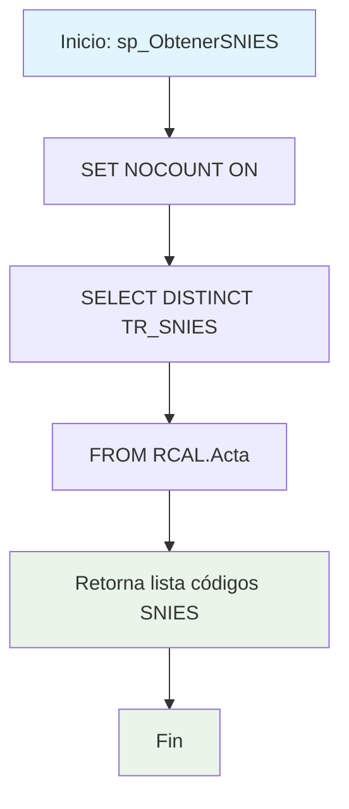

### sp_ObtenerSNIES

Procedimiento simple que retorna la lista única de códigos SNIES disponibles en la tabla Acta del esquema RCAL. Utilizado para obtener catálogo de programas académicos registrados en el sistema.

#### Diagrama de flujo


#### Procedimiento almacenado
```sql
/*
|sp_MaestroUnificadoV2||
|sp_ObtenerSNIES|/_-=================================================================================================================================================================
Author: Johana Henao
Create Date: 31/10/2024
Description: 1.Procedimiento almacenado para
EXEC CUN.sp_ObtenerSNIES
--=================================================================================================================================================================_/
*/
CREATE PROCEDURE CUN.sp_ObtenerSNIES
AS
BEGIN
SET NOCOUNT ON;

    SELECT DISTINCT TR_SNIES FROM RCAL.Acta

END;
```
#### Operaciones Principales

- Configuración consulta: SET NOCOUNT ON para optimizar rendimiento
- Consulta catálogo: SELECT DISTINCT para eliminar duplicados
- Retorno resultados: Lista única de códigos SNIES activos

#### Tablas afectadas

- RCAL.Acta: Fuente de códigos SNIES únicos

#### Procedimientos Almacenados Anidados