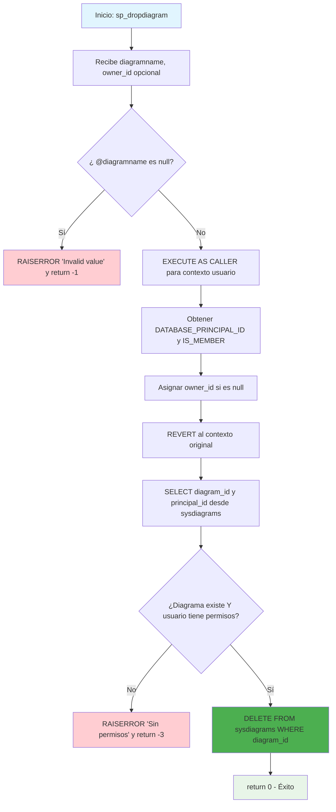

### sp_dropdiagram

Procedimiento estándar de SQL Server para eliminar diagramas de base de datos. Implementa validaciones de seguridad robustas para verificar existencia del diagrama, permisos del usuario y autorización antes de ejecutar la eliminación de la tabla sysdiagrams.

#### Diagrama de flujo


#### Procedimiento almacenado
```sql
CREATE PROCEDURE dbo.sp_dropdiagram
(
@diagramname sysname,
@owner_id int = null
)
WITH EXECUTE AS 'dbo'
AS
BEGIN
set nocount on
declare @theId int
declare @IsDbo int
declare @UIDFound int
declare @DiagId int
if(@diagramname is null)
begin
RAISERROR ('Invalid value', 16, 1);
return -1
end
EXECUTE AS CALLER;
select @theId = DATABASE_PRINCIPAL_ID();
select @IsDbo = IS_MEMBER(N'db_owner');
if(@owner_id is null)
select @owner_id = @theId;
REVERT;
select @DiagId = diagram_id, @UIDFound = principal_id from dbo.sysdiagrams where principal_id = @owner_id and name = @diagramname
if(@DiagId IS NULL or (@IsDbo = 0 and @UIDFound <> @theId))
begin
RAISERROR ('Diagram does not exist or you do not have permission.', 16, 1)
return -3
end
delete from dbo.sysdiagrams where diagram_id = @DiagId;
return 0;
END
```
#### Operaciones Principales

- Validación parámetros: Verifica que diagramname no sea null
- Control de seguridad: EXECUTE AS CALLER/REVERT para verificar permisos reales
- Resolución propietario: Asigna owner_id del usuario actual si no se especifica
- Verificación existencia: Busca diagrama por principal_id y nombre
- Validación permisos: Confirma que usuario tenga acceso (db_owner o propietario)
- Eliminación: DELETE del registro específico en sysdiagrams

#### Tablas afectadas

##### Actualizadas:

- dbo.sysdiagrams: Eliminación del diagrama específico por diagram_id

#### Procedimientos Almacenados Anidados