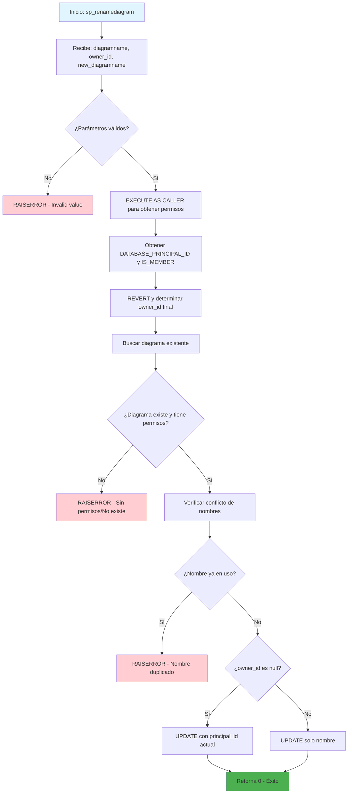

### sp_renamediagram

Procedimiento estándar de SQL Server para renombrar diagramas de base de datos almacenados en la tabla sysdiagrams. Incluye validaciones de permisos, verificación de duplicados y manejo de propietarios con control de seguridad mediante EXECUTE AS.

#### Diagrama de flujo


#### Procedimiento almacenado
```sql
CREATE PROCEDURE dbo.sp_renamediagram
(
@diagramname sysname,
@owner_id int = null,
@new_diagramname sysname
)
WITH EXECUTE AS 'dbo'
AS
BEGIN
set nocount on
declare @theId int
declare @IsDbo int
declare @UIDFound int
declare @DiagId int
declare @DiagIdTarg int
declare @u_name sysname
if((@diagramname is null) or (@new_diagramname is null))
begin
RAISERROR ('Invalid value', 16, 1);
return -1
end
EXECUTE AS CALLER;
select @theId = DATABASE_PRINCIPAL_ID();
select @IsDbo = IS_MEMBER(N'db_owner');
if(@owner_id is null)
select @owner_id = @theId;
REVERT;
select @u_name = USER_NAME(@owner_id)
select @DiagId = diagram_id, @UIDFound = principal_id from dbo.sysdiagrams where principal_id = @owner_id and name = @diagramname
if(@DiagId IS NULL or (@IsDbo = 0 and @UIDFound <> @theId))
begin
RAISERROR ('Diagram does not exist or you do not have permission.', 16, 1)
return -3
end
-- if((@u_name is not null) and (@new_diagramname = @diagramname)) -- nothing will change
-- return 0;
if(@u_name is null)
select @DiagIdTarg = diagram_id from dbo.sysdiagrams where principal_id = @theId and name = @new_diagramname
else
select @DiagIdTarg = diagram_id from dbo.sysdiagrams where principal_id = @owner_id and name = @new_diagramname
if((@DiagIdTarg is not null) and @DiagId <> @DiagIdTarg)
begin
RAISERROR ('The name is already used.', 16, 1);
return -2
end
if(@u_name is null)
update dbo.sysdiagrams set [name] = @new_diagramname, principal_id = @theId where diagram_id = @DiagId
else
update dbo.sysdiagrams set [name] = @new_diagramname where diagram_id = @DiagId
return 0
END
```
#### Operaciones Principales

- Validación parámetros: Verifica que diagramname y new_diagramname no sean null
- Control de seguridad: Usa EXECUTE AS CALLER/REVERT para verificar permisos del usuario
- Verificación existencia: Busca el diagrama por principal_id y nombre
- Validación permisos: Confirma que el usuario tenga derecho a modificar el diagrama
- Prevención duplicados: Verifica que el nuevo nombre no esté en uso
- Actualización condicional: UPDATE diferente según si owner_id es null o no

#### Tablas afectadas

##### Consultadas y Actualizadas:

- dbo.sysdiagrams: Tabla sistema que almacena diagramas de base de datos

#### Procedimientos Almacenados Anidados