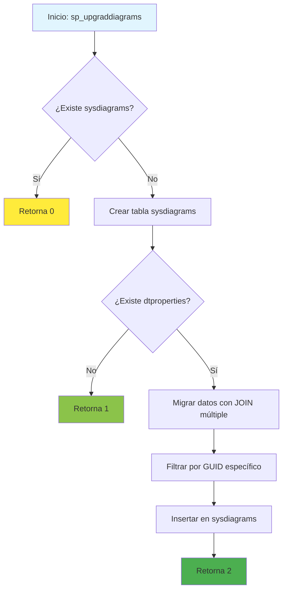

### sp_upgraddiagrams

Procedimiento estándar de SQL Server para migrar diagramas de base de datos desde el formato legacy (dtproperties) hacia el formato moderno (sysdiagrams). Ejecutado automáticamente por SSMS durante actualizaciones de versión.

#### Diagrama de flujo


#### Procedimiento almacenado
```sql
CREATE PROCEDURE dbo.sp_upgraddiagrams
AS
BEGIN
IF OBJECT_ID(N'dbo.sysdiagrams') IS NOT NULL
return 0;
CREATE TABLE dbo.sysdiagrams
(
name sysname NOT NULL,
principal_id int NOT NULL, -- we may change it to varbinary(85)
diagram_id int PRIMARY KEY IDENTITY,
version int,
definition varbinary(max)
CONSTRAINT UK_principal_name UNIQUE
(
principal_id,
name
)
);

        /* Add this if we need to have some form of extended properties for diagrams /
        /
        IF OBJECT_ID(N'dbo.sysdiagram_properties') IS NULL
        BEGIN
            CREATE TABLE dbo.sysdiagram_properties
            (
                diagram_id int,
                name sysname,
                value varbinary(max) NOT NULL
            )
        END
        */

        IF OBJECT_ID(N'dbo.dtproperties') IS NOT NULL
        begin
            insert into dbo.sysdiagrams
            (
                [name],
                [principal_id],
                [version],
                [definition]
            )
            select
                convert(sysname, dgnm.[uvalue]),
                DATABASE_PRINCIPAL_ID(N'dbo'),            -- will change to the sid of sa
                0,                            -- zero for old format, dgdef.[version],
                dgdef.[lvalue]
            from dbo.[dtproperties] dgnm
                inner join dbo.[dtproperties] dggd on dggd.[property] = 'DtgSchemaGUID' and dggd.[objectid] = dgnm.[objectid]
                inner join dbo.[dtproperties] dgdef on dgdef.[property] = 'DtgSchemaDATA' and dgdef.[objectid] = dgnm.[objectid]

            where dgnm.[property] = 'DtgSchemaNAME' and dggd.[uvalue] like N'EA3E6268-D998-11CE-9454-00AA00A3F36E'
            return 2;
        end
        return 1;
    END
    |
```
#### Operaciones Principales

- Verificación de existencia: Valida si sysdiagrams ya existe
- Creación de estructura: Crea tabla con constraints y IDENTITY
- Migración condicional: Transfiere datos desde dtproperties si existe
- Transformación de datos: Convierte formato legacy a estándar moderno

#### Tablas afectadas

##### Creadas:

- dbo.sysdiagrams: Tabla moderna para almacenar diagramas

##### Consultadas:

- dbo.dtproperties: Tabla legacy con propiedades de diagramas (si existe)

#### Procedimientos Almacenados Anidados


