## API Schema

### 1. Descripción de cada procedimiento

#### Procedimientos de ESCUELA (TP_ESCUELA)

- PA_TP_ESCUELAAdd: Crea nuevas escuelas con nombre y director, retorna el registro completo
- PA_TP_ESCUELADelete: Eliminación lógica de escuelas con validación de dependencias
- PA_TP_ESCUELAGetAll: Consulta todas las escuelas activas (campos básicos)
- PA_TP_ESCUELAGetAllFull: Consulta todas las escuelas activas incluyendo auditoría
- PA_TP_ESCUELAGetByFilter: Búsqueda filtrada de escuelas con paginación
- PA_TP_ESCUELAUpdate: Actualiza datos de escuelas existentes
- PA_TP_ESCUELAgetByKey: Obtiene una escuela específica por ID

#### Procedimientos de GESTOR (TP_GESTOR)

- PA_TP_GESTORAdd: Crea nuevos gestores asociados a escuelas
- PA_TP_GESTORDelete: Eliminación lógica de gestores con validación de dependencias
- PA_TP_GESTORGetAll: Consulta todos los gestores activos (campos básicos)
- PA_TP_GESTORAllFull: Consulta todos los gestores activos incluyendo auditoría
- PA_TP_GESTORGetAllWithRelation: Consulta gestores con información de la escuela asociada (JOIN)
- PA_TP_GESTORGetByFilter: Búsqueda filtrada de gestores con paginación
- PA_TP_GESTORUpdate: Actualiza datos de gestores existentes
- PA_TP_GESTORgetByKey: Obtiene un gestor específico por ID

### 2. Funcionamiento en conjunto
Los procedimientos implementan operaciones CRUD completas para un sistema de gestión educativa con dos entidades principales:

- ESCUELA: Entidad principal con nombre y director
- GESTOR: Entidad dependiente asociada a una escuela específica

La relación es 1:N (una escuela puede tener múltiples gestores).
### 3. Dependencias externas al esquema
Ambos procedimientos de eliminación (PA_TP_ESCUELADelete y PA_TP_GESTORDelete) llaman a:

- [dbo].[ValidarDependencias]: Procedimiento del esquema dbo que verifica si existen registros dependientes antes de permitir la eliminación lógica.

### 4. Diagrama de interacciones

```mermaid
flowchart TB
    subgraph "ESCUELA CRUD"
        EA[PA_TP_ESCUELAAdd]
        EG[PA_TP_ESCUELAGetAll]
        EGF[PA_TP_ESCUELAGetAllFull]
        EGK[PA_TP_ESCUELAgetByKey]
        EGF_Filter[PA_TP_ESCUELAGetByFilter]
        EU[PA_TP_ESCUELAUpdate]
        ED[PA_TP_ESCUELADelete]
    end
    
    subgraph "GESTOR CRUD"
        GA[PA_TP_GESTORAdd]
        GG[PA_TP_GESTORGetAll]
        GGF[PA_TP_GESTORAllFull]
        GGR[PA_TP_GESTORGetAllWithRelation]
        GGK[PA_TP_GESTORgetByKey]
        GGF_Filter[PA_TP_GESTORGetByFilter]
        GU[PA_TP_GESTORUpdate]
        GD[PA_TP_GESTORDelete]
    end
    
    subgraph "Tablas"
        TE[(CUN.TP_ESCUELA)]
        TG[(CUN.TP_GESTOR)]
    end
    
    subgraph "Procedimiento Externo"
        VD[dbo.ValidarDependencias]
    end
    
    %% Relaciones ESCUELA
    EA --> TE
    EG --> TE
    EGF --> TE
    EGK --> TE
    EGF_Filter --> TE
    EU --> TE
    ED --> TE
    ED --> VD
    
    %% Relaciones GESTOR
    GA --> TG
    GG --> TG
    GGF --> TG
    GGR --> TG
    GGR --> TE
    GGK --> TG
    GGF_Filter --> TG
    GU --> TG
    GD --> TG
    GD --> VD
    
    %% Relación entre tablas
    TG -.->|Id_Escuela| TE
    
    %% Estilos
    classDef crud fill:#e3f2fd,stroke:#1976d2,stroke-width:2px
    classDef table fill:#f1f8e9,stroke:#388e3c,stroke-width:2px
    classDef external fill:#fff3e0,stroke:#f57c00,stroke-width:2px
    
    class EA,EG,EGF,EGK,EGF_Filter,EU,ED,GA,GG,GGF,GGR,GGK,GGF_Filter,GU,GD crud
    class TE,TG table
    class VD external

```

### 5. Lógica general del sistema
El conjunto de procedimientos implementa un sistema CRUD completo para gestión educativa con dos niveles jerárquicos: Escuelas como entidades principales y Gestores como entidades dependientes. Utiliza eliminación lógica con validación de integridad referencial, auditoría completa para trazabilidad, y múltiples modalidades de consulta (básica, completa, filtrada y relacional). La arquitectura garantiza la consistencia de datos mediante validaciones de dependencias antes de cualquier eliminación, manteniendo la integridad del modelo relacional escuela-gestor.

