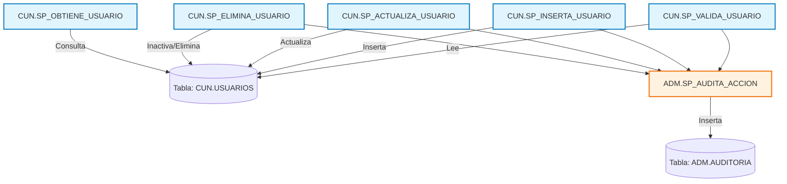

## CUN Schema

### 1. Descripción breve de cada procedimiento

- CUN.SP_VALIDA_USUARIO: Valida las credenciales de un usuario revisando si existe en la base de datos y si está activo.

- CUN.SP_INSERTA_USUARIO: Inserta un nuevo usuario en la tabla correspondiente, guardando información básica como nombre, correo y estado.

- CUN.SP_ACTUALIZA_USUARIO: Actualiza los datos de un usuario existente (correo, estado, etc.).

- CUN.SP_ELIMINA_USUARIO: Cambia el estado de un usuario a inactivo o lo elimina lógicamente de la base de datos.

- CUN.SP_OBTIENE_USUARIO: Recupera información detallada de un usuario (id, nombre, correo, estado).

- ADM.SP_AUDITA_ACCION: Inserta un registro en una tabla de auditoría para dejar constancia de acciones ejecutadas (creación, modificación, eliminación, login).

### 2. Funcionamiento en conjunto

Los procedimientos del esquema CUN son los principales para la gestión de usuarios (validación, inserción, actualización, eliminación y consulta).

Cada vez que se realiza una acción sensible (crear, actualizar, eliminar o validar usuario), el procedimiento respectivo llama a ADM.SP_AUDITA_ACCION para registrar en la auditoría lo ocurrido.

Así, el flujo general es: acciones sobre usuario → registro en auditoría.

### 3. Llamadas a otros esquemas

Los procedimientos de CUN llaman a ADM.SP_AUDITA_ACCION, que pertenece a otro esquema (ADM).

Esto significa que hay dependencia entre dos esquemas distintos: CUN (usuarios) y ADM (auditoría).

### 4. Diagrama de interacciones

### 5. Lógica general del conjunto

En conjunto, los procedimientos implementan un módulo de gestión de usuarios: permiten crear, actualizar, eliminar, validar y consultar usuarios. Además, todas las operaciones relevantes quedan registradas en el sistema de auditoría mediante el procedimiento del esquema ADM.