## DBO Schema

### 1. Descripción de cada procedimiento
- ActualizarCamposLargos: Trunca campos de texto que excedan 250 caracteres en 44 tablas del esquema RCAL, aplicando filtros por código SNIES específico.
- sp_InsertMallasLauraUnificada: Consolida datos de mallas curriculares desde múltiples niveles académicos (Profesional, Técnico, Tecnológico, Especialización) en una tabla centralizada con validaciones anti-duplicados.
- sp_Insert_EstructuraCurricular: Genera la estructura curricular completa de un programa académico mediante tablas temporales, calculando agregaciones por ciclos educativos y consolidando 64 campos diferentes.
- sp_InsertarProfesoresTipoProcesoNuevo: Extrae información docente desde servidor remoto via OPENQUERY, procesando datos académicos complejos con horarios y asignaciones, mapeando profesores con escuelas.
- sp_alterdiagram: Procedimiento estándar de SQL Server para modificar diagramas existentes, actualizando definición binaria con validaciones de permisos.
- sp_creatediagram: Crea nuevos diagramas de base de datos con validaciones de parámetros y control de permisos.
- sp_dropdiagram: Elimina diagramas con validaciones de seguridad robustas.
- sp-_helpdiagramdefinition: Retorna la definición completa de un diagrama específico con validaciones de seguridad.
- sp_helpdiagrams: Consulta diagramas accesibles según permisos del usuario con filtros opcionales.
- sp_renamediagram: Renombra diagramas con validaciones de duplicados y control de seguridad.
- sp_upgraddiagrams: Migra diagramas desde formato legacy (dtproperties) hacia formato moderno (sysdiagrams).

### 2. Flujo de llamadas y dependencias
Los procedimientos operan en dos grupos independientes:
#### Grupo A - Gestión Académica: Los procedimientos académicos no se llaman directamente entre sí, pero siguen un flujo lógico:

- sp_InsertMallasLauraUnificada consolida datos base
- sp_Insert_EstructuraCurricular usa esos datos para generar estructuras curriculares
- sp_InsertarProfesoresTipoProcesoNuevo agrega información docente
- ActualizarCamposLargos limpia/normaliza datos finales

#### Grupo B - Diagramas SQL Server: Son procedimientos estándar independientes que no interactúan entre los procedimientos académicos.

### 3. Llamadas a otros esquemas

- sp_InsertMallasLauraUnificada: Consulta CUN_REPOSITORIO.CUN.MallasLaura y CUN_REPOSITORIO.cun.MALLASCun
- sp_Insert_EstructuraCurricular: Usa RCAL.tbl_Malla y RCAL.Acta
- sp_InsertarProfesoresTipoProcesoNuevo: OPENQUERY a servidor remoto y [CUN_REPOSITORIO].[CUN].[nuevas_escuelas]
- ActualizarCamposLargos: Opera en múltiples tablas del esquema RCAL

### 4. Diagrama de interacciones

```mermaid
flowchart TD
    %% Fuentes de datos externas
    A1[(CUN_REPOSITORIO.CUN.MallasLaura)]
    A2[(CUN_REPOSITORIO.cun.MALLASCun)]
    A3[(Servidor Remoto 172.16.1.175)]
    A4[(CUN_REPOSITORIO.CUN.nuevas_escuelas)]
    
    %% Grupo Académico - Flujo lógico
    B1[sp_InsertMallasLauraUnificada]
    B2[sp_Insert_EstructuraCurricular]
    B3[sp_InsertarProfesoresTipoProcesoNuevo]
    B4[ActualizarCamposLargos]
    
    %% Tablas centrales
    T1[(RCAL.tbl_Malla)]
    T2[(RCAL.Acta)]
    T3[(Dev.MallasLauraUnificada)]
    T4[(RCAL.tbl_EstructuraCurricular)]
    T5[(dev.tbl_profesores_tipo_proceso_nuevo)]
    T6[(44 Tablas RCAL F1-F8)]
    
    %% Grupo Diagramas SQL Server (independiente)
    C1[sp_creatediagram]
    C2[sp_alterdiagram]
    C3[sp_dropdiagram]
    C4[sp_helpdiagrams]
    C5[sp_helpdiagramdefinition]
    C6[sp_renamediagram]
    C7[sp_upgraddiagrams]
    C8[(sysdiagrams)]
    C9[(dtproperties)]
    
    %% Conexiones Grupo Académico
    A1 --> B1
    A2 --> B1
    B1 --> T3
    
    T1 --> B2
    T2 --> B2
    B2 --> T4
    
    A3 --> B3
    A4 --> B3
    B3 --> T5
    
    T6 --> B4
    
    %% Conexiones Grupo Diagramas
    C1 --> C8
    C2 --> C8
    C3 --> C8
    C4 --> C8
    C5 --> C8
    C6 --> C8
    C7 --> C8
    C9 --> C7
    
    %% Estilos
    classDef academico fill:#e1f5fe
    classDef diagrama fill:#f3e5f5
    classDef fuente fill:#fff3e0
    classDef tabla fill:#e8f5e8
    
    class B1,B2,B3,B4 academico
    class C1,C2,C3,C4,C5,C6,C7 diagrama
    class A1,A2,A3,A4,C9 fuente
    class T1,T2,T3,T4,T5,T6,C8 tabla
```

    
### 5. Lógica general del conjunto
Los procedimientos implementan un sistema de gestión académica integral que consolida datos curriculares desde múltiples fuentes externas, procesa información de mallas académicas por niveles educativos, integra datos docentes desde servidores remotos, y finalmente normaliza/limpia la información almacenada. Paralelamente, incluye un conjunto completo de procedimientos estándar de SQL Server para gestión de diagramas de base de datos, operando de forma independiente al flujo académico principal.
En esencia, es un ETL académico (Extract-Transform-Load) que unifica datos educativos dispersos en un repositorio centralizado, con herramientas adicionales para mantenimiento de esquemas de base de datos.