## DEV Schema

### 1. Descripción breve de cada procedimiento
Procedimientos de Borrado:

Borrado_PoblacionTablasRCAL: Elimina masivamente datos de ~120 tablas para un código SNIES específico (reseteo completo)
Borrado_TablasPrompt: Elimina selectivamente solo datos de formularios F1-F8 (61 tablas)

Procedimientos de Inserción por Condición:

Insertar_Datos_Cond1: Inserta datos básicos del programa (denominación, títulos, créditos)
Insertar_Datos_Cond2: Procesa estadísticas de matrícula, deserción y empleabilidad
Insertar_Datos_Cond3: Maneja estructura curricular, proyección social e internacionalización
Insertar_Datos_Cond4: Gestiona distribución de créditos y actividades académicas
Insertar_Datos_Cond5: Administra datos de investigación y grupos académicos
Insertar_Datos_Cond6: Procesa relaciones con sector externo y convenios
Insertar_Datos_Cond7: Maneja información docente y experiencia profesoral
Insertar_Datos_Cond8: Gestiona recursos educativos y tecnológicos
Insertar_Datos_Cond9: Procesa infraestructura física y proyecciones

Procedimientos Auxiliares:

NUEVO_TR_SNIES: Valida y registra nuevo código SNIES en catálogo
PoblarTablaEscuelas: Pobla catálogo de escuelas académicas
PoblarTablaPensum/Regional/Sedes: Sincroniza datos desde servidor remoto
Profesores: Extrae información docente consolidada
sp_Insertar_Datos_Historicos: Inserta datos bibliográficos históricos
sp_Insertar_Datos_Maestros: Consolida información principal del programa
insertarDatosPrueba: Copia masiva desde programa de referencia (54639)
Validacion_Poblacion: Valida existencia de datos en ~90 tablas
SP_ConsultarExistenciaRegistro: Utilitario de validación dinámica

Procedimiento Orquestador:

sp_Procesar_Insertar_Datos: Coordina ejecución secuencial de todas las condiciones

### 2. Flujo de funcionamiento conjunto
El sistema sigue este flujo principal:

Inicialización: Se ejecuta NUEVO_TR_SNIES para validar el código
Población de catálogos: Los procedimientos Poblar* sincronizan datos maestros
Procesamiento principal: sp_Procesar_Insertar_Datos orquesta todo el proceso:

Inserta estructura curricular base
Ejecuta secuencialmente las 9 condiciones (Cond1-Cond9)
Finaliza con anexos

Validación: Validacion_Poblacion verifica completitud
Limpieza: Los procedimientos Borrado_* permiten resetear datos cuando es necesario

### 3. Llamadas a procedimientos externos
Varios procedimientos llaman a otros que no están en el conjunto documentado:

sp_Insert_EstructuraCurricular (llamado desde sp_Procesar_Insertar_Datos)
sp_Insertar_Programas_Similares (llamado desde Insertar_Datos_Cond2)
sp_Generar_Resumen_Programas (llamado desde Insertar_Datos_Cond2)
sp_GenerarTablasTemporalesPorSemestre (llamado desde Insertar_Datos_Cond3)
sp_Insertar_Bibliografia_TBL_31 (llamado desde Insertar_Datos_Cond8)
sp_Generar_ResumenInfraFisiCCUN (llamado desde Insertar_Datos_Cond9)

### 4. Diagrama de interacción

```mermaid
flowchart TD
    A[sp_Procesar_Insertar_Datos] --> B[NUEVO_TR_SNIES]
    A --> C[sp_Insert_EstructuraCurricular]
    A --> D[Insertar_Datos_Cond1]
    A --> E[Insertar_Datos_Cond2]
    A --> F[Insertar_Datos_Cond3]
    A --> G[Insertar_Datos_Cond4]
    A --> H[Insertar_Datos_Cond5]
    A --> I[Insertar_Datos_Cond6]
    A --> J[Insertar_Datos_Cond7]
    A --> K[Insertar_Datos_Cond8]
    A --> L[Insertar_Datos_Cond9]
    
    %% Procedimientos auxiliares de población
    M[PoblarTablaEscuelas] -.-> N[Catálogos Base]
    O[PoblarTablaPensum] -.-> N
    P[PoblarTablaRegional] -.-> N
    Q[PoblarTablaSedes] -.-> N
    R[Profesores] -.-> N
    
    %% Procedimientos de soporte
    S[sp_Insertar_Datos_Maestros] -.-> T[Datos Maestros]
    U[sp_Insertar_Datos_Historicos] -.-> T
    
    %% Procedimientos de validación
    V[Validacion_Poblacion] --> W[Reporte Estado]
    X[SP_ConsultarExistenciaRegistro] --> W
    
    %% Procedimientos de limpieza
    Y[Borrado_PoblacionTablasRCAL] -.-> Z[Limpieza]
    AA[Borrado_TablasPrompt] -.-> Z
    
    %% Procedimiento de pruebas
    BB[insertarDatosPrueba] -.-> CC[Datos Prueba]
    
    %% Llamadas a procedimientos externos
    E --> DD[sp_Insertar_Programas_Similares]
    E --> EE[sp_Generar_Resumen_Programas]
    F --> FF[sp_GenerarTablasTemporalesPorSemestre]
    K --> GG[sp_Insertar_Bibliografia_TBL_31]
    L --> HH[sp_Generar_ResumenInfraFisiCCUN]
    
    style A fill:#e1f5fe
    style N fill:#f3e5f5
    style T fill:#fff3e0
    style W fill:#e8f5e8
    style Z fill:#ffcdd2
    style CC fill:#f0f4c3
```

### 5. Lógica general del sistema
El sistema implementa un pipeline completo de gestión académica para registro calificado que:

Valida y registra nuevos programas académicos mediante códigos SNIES
Procesa sistemáticamente las 9 condiciones obligatorias del MEN (Ministerio de Educación Nacional)
Integra múltiples fuentes de datos (académicos, administrativos, bibliográficos, infraestructura)
Mantiene sincronización con sistemas remotos y repositorios externos
Proporciona herramientas de validación, limpieza y pruebas para garantizar la integridad de los datos
Genera reportes y análisis estadísticos requeridos para los procesos de acreditación académica

La arquitectura es modular y permite tanto procesamiento completo como operaciones selectivas por condición específica.