## RCAL Schema

### 1. Descripción de cada procedimiento
- Generar_PlanGeneralEst_Academicos_Todos: Genera tablas temporales dinámicas con información académica detallada para cada asignatura de un programa específico, incluyendo automáticamente filas resumen con totales.
- Get_Infraestructura_Sede: Consulta información de infraestructura física de sedes específicas o todas las sedes de Bogotá mediante consultas dinámicas.
- SP_Eliminar_Datos: Elimina registros masivamente de múltiples tablas basándose en una configuración centralizada para un TR_SNIES específico.
- consultar_informacion_prompt: Genera un reporte de existencia de datos verificando si existen registros en 79 tablas del sistema para un código SNIES específico.
- eliminar_snies_prompt: Realiza eliminación masiva de datos relacionados con un código SNIES en 73 tablas específicas del sistema.
- sp_GenerarTablasTemporalesPorSemestre: Genera dinámicamente tablas temporales globales para cada semestre de un programa académico, normalizando datos curriculares.
- sp_Generar_Informe_SPADIES_TDA: Genera informes de Tasa de Deserción Anual del sistema SPADIES para instituciones filtradas con datos históricos 2010-2022.
- sp_Generar_ResumenInfraFisiCCUN: Genera resumen estadístico de infraestructura física de la sede Bogotá con 8 tipos de espacios académicos.
- sp_Generar_Resumen_Programas: Busca programas académicos similares mediante análisis semántico del nombre del programa y mapeo de niveles de formación.
- sp_Generar_Resumen_SNIES_Historico: Genera resumen histórico pivotado de estadísticas académicas (2020-2023) para programas similares filtrados.
- sp_Insertar_Contenidos_Plan: Normaliza y reorganiza contenidos curriculares de un plan de estudios convirtiendo numeración romana a arábiga.
- sp_Insertar_EstadisticasCondicion2Ma_Ins_ad_gra: Extrae y consolida estadísticas académicas históricas para programas filtrados relacionados con un TR_SNIES específico.
- sp_Insertar_Inventario_Recurso_Bibliografico_V2_BPM: Normaliza datos bibliográficos mediante procesamiento XML, transformando campos delimitados por punto y coma.
- sp_Insertar_Programas_Similares: Busca programas similares basándose en una tabla de configuración preestablecida con selección aleatoria de 10 registros.
- sp_Insertar_Programas_Similares_Dinamico: Busca programas similares dinámicamente usando palabras clave del nombre del programa y funciones fonéticas.
- sp_Insertar_Tbl19Cond5_EscuelaEspecializacion: Inserta líneas de investigación específicas para programas de especialización de una escuela particular.

### 2. Flujo de llamadas y dependencias
Los procedimientos funcionan en una arquitectura de dependencias donde varios procedimientos crean tablas que otros utilizan como fuente:

- sp_Generar_Resumen_Programas genera Resultados_Programas_Filtrados
- sp_Generar_Resumen_SNIES_Historico y sp_Generar_Informe_SPADIES_TDA dependen de Resultados_Programas_Filtrados
- sp_Insertar_EstadisticasCondicion2Ma_Ins_ad_gra requiere tabla Resumen_SNIES (generada externamente)

Los procedimientos de inserción múltiple operan sobre datos previamente procesados

### 3. Llamadas a otros esquemas

- sp_Generar_Informe_SPADIES_TDA accede a REGISTRO_CALIFICADO.dbo.Informe_SPADIES_Detalle
- sp_Generar_Resumen_SNIES_Historico usa REGISTRO_CALIFICADO.RCAL.Datos_SNIES_2023
- sp_Insertar_Tbl19Cond5_EscuelaEspecializacion opera sobre REGISTRO_CALIFICADO.RCAL.Tbl_19_Cond5 y REGISTRO_CALIFICADO.RCAL.ACTA

### 4. Diagrama de interacciones

```mermaid
flowchart TD
    A[TR_SNIES Input] --> B[sp_Generar_Resumen_Programas]
    B --> C[Resultados_Programas_Filtrados]
    
    C --> D[sp_Generar_Resumen_SNIES_Historico]
    C --> E[sp_Generar_Informe_SPADIES_TDA]
    
    D --> F[Resultados_SNIES_Resumen_Historico]
    E --> G[Resultados_SPADIES_TDA]
    
    H[Resumen_SNIES] --> I[sp_Insertar_EstadisticasCondicion2Ma_Ins_ad_gra]
    C --> I
    I --> J[EstadísticasCondicion2Ma_Ins_ad_gra]
    
    A --> K[sp_Insertar_Programas_Similares]
    K --> L[Resultados_Programas_Filtrados - Alt]
    
    A --> M[sp_Insertar_Programas_Similares_Dinamico]
    M --> N[Resultados_Programas_Filtrados_Dinamico]
    
    A --> O[sp_GenerarTablasTemporalesPorSemestre]
    O --> P[Plan_de_Estudios_Semestre + Tablas Temporales ##Semestre_X]
    
    A --> Q[sp_Insertar_Contenidos_Plan]
    Q --> R[Plan_de_Estudios_Contenidos]
    
    A --> S[Generar_PlanGeneralEst_Academicos_Todos]
    S --> T[Tablas Temporales #OrdenAsignatura_X]
    
    A --> U[sp_Generar_ResumenInfraFisiCCUN]
    U --> V[ResumenInfraFisiCCUN]
    
    A --> W[Get_Infraestructura_Sede]
    W --> X[Consulta Dinámica Infraestructura]
    
    A --> Y[consultar_informacion_prompt]
    Y --> Z[Reporte Existencia 79 Tablas]
    
    A --> AA[eliminar_snies_prompt]
    AA --> BB[Eliminación 73 Tablas]
    
    A --> CC[SP_Eliminar_Datos]
    CC --> DD[Eliminación Configurada]
    
    EE[sp_Insertar_Inventario_Recurso_Bibliografico_V2_BPM] --> FF[Inventario_Recurso_Bibliografico_V2_BPM]
    
    GG[sp_Insertar_Tbl19Cond5_EscuelaEspecializacion] --> HH[Tbl_19_Cond5 - Líneas Investigación]
    
    style C fill:#e8f5e8
    style F fill:#e8f5e8
    style G fill:#e8f5e8
    style J fill:#e8f5e8
    style A fill:#e1f5fe
    style B fill:#fff3e0
```

### 5. Lógica general del conjunto
El conjunto de procedimientos implementa un sistema integral de gestión académica que procesa, analiza y reporta información de programas educativos basándose en códigos SNIES. La lógica central consiste en:

Búsqueda de programas similares como punto de partida para análisis comparativos
Generación de reportes históricos con datos estadísticos pivotados por años
Procesamiento curricular mediante normalización de planes de estudio y contenidos
Gestión de infraestructura con reportes dinámicos de recursos físicos y bibliográficos
Operaciones de mantenimiento para consulta de existencia y eliminación masiva de datos

El sistema sigue un patrón donde los procedimientos principales generan tablas intermedias que alimentan análisis posteriores, creando un flujo de datos estructurado para la toma de decisiones académicas.