# Documentación de Base de Datos - Registro Calificado

## Tablas Independientes

- **RCAL.Acta** → Cargue de informacion sobre el programa
- **RCAL.Acuerdo** → Informacion predeterminada de Acuerdo
- **RCAL.tbl_Malla** → Las materias por semestre de el programa
- **RCAL.Programas_SNIES** → Informacion general de programas en otras instituciones
- **RCAL.PROGRAMAS_SIMILARES** → Programas similares al inscrito
- **RCAL.F2_VinculacionLaboral** → Vinculacion labora de recien graduados
- **RCAL.F2_RangoSalarial** → Rango salarial por años
- **RCAL.Datos_SNIES_2023** → Informacion de otras instituciones
- **RCAL.Resumen_SNIES** → Informacion por año de otras instituciones de inscritos, graduados, etc.
- **CUN.TP_Escuela** → Escuelas con su director y estado
- **Dev.tbl_profesores_tipo_proceso_nuevo** → Info de Profesores por escuela
- **Dev.Kactus_BI_EMPLE** → Info de empleados desde Kactus
- **RCAL.TBL_Grupos_Investigacion** → Grupos de investigacion por escuela
- **Dev.Listado_Convenios** → Vigencias, Numeros, Objetivos de convenios
- **RCAL.Inventario_Recurso_Bibliografico_V2** → ??
- **RCAL.Proyeccion_Financiera** → proyecciones de los programas
- **RCAL.Invent_Fisico_Infraestructura_2024** → Invetario infraestructura fisica (salones)
- **RCAl.Data_Infraestructura_BGTA** → Informacion de infraestructura fisica de sedes bogota
- **Dev.Profesores_Consolidado** → informacion de profesores y materias
- **RCAL.tbl_Escuelas** → Escuela y nombre de unidad

---

## SP: Dev.NUEVO_TR_SNIES @SNIES

- **#creditos** → Materias unicas del programa (RCAL.tbl_malla)
- **Dev.MallasLauraUnificada** → Toda la informacion general del programa a postural (desde RCAL.tbl_Malla, RCAL.tbl_Acta y #creditos)

---

## SP: DBO.sp_Insert_EstructuraCurricular @SNIES

- **#tbl_Malla** → Materias por ciclos (RCAL.tbl_Malla)
- **#PROPEDEUTICO_VI** → materias del 6 semestre (RCAL.tbl_Malla)
- **#PROPEDEUTICO_IV** → materias del 4 semestre (RCAL.tbl_Malla)
- **#CREDITOS** → creditos por ciclo (RCAL.tbl_malla)
- **RCAL.tbl_EstructuraCurricular** → tabla para estructura curricular del programa (RCAL.tbl_Malla, RCAL.tbl_Acta y all temp)

---

## SP: Dev.Insertar_Datos_Cond1

- **#MALLA** → Materias unicas del programa(RCAL.tbl_Malla)
- **RCAL.tbl_1_Cond1** → Informacion del programa (RCAL.Acta, Dev.MallasLauraUnificada y RCAL.Acuerdo , #MALLA)
- **#DatosUnicos** → Copia datos de malla segun snies(CUN_REPOSITORIO.CUN.MallasLaura)
- **#ProgramasSNIES** → Programa unico sin registro duplicado (#DatosUnicos)
- **RCAL.MODIFICACION** → Histórico de modificaciones de los programas (#ProgramasSNIES)
- **RCAL.F3_PerfilEgreso** → Perfiles de egreso por ciclo (RCAL.Acta)

---

## SP: Dev.Insertar_Datos_Cond2

- **RCAL.F2_AnalisisEstaMatri** → Estadisitica de Matricula (Dev.MallasLauraUnificada, AUTOEVALUACION.stg.P1_Admision_matricula)
- **#Temp_Analisis** → Analisis de estadistica por año(RCAL.F2_AnalisisEstaMatri)
- **Dev.Analisis_Incritos** → Estadisticas por año y periodo (#Temp_Analisis)
- **RCAL.tbl_Programa** → Informacion general del programa (RCAL.Acta, Dev.MallasLauraUnificada, RCAL.Acuerdo)
- **RCAL.F2_NumeroProcentual** → Informacion sobre vinculacion laboral(RCAL.F2_VinculacionLaboral)

### *SP: RCAL.sp_Insertar_Programas_Similares*
{
- **RCAL.Resultados_Programas_Filtrados** → (RCAL.PROGRAMAS_SIMILARES ,RCAL.Programas_SNIES)
}

- **RCAL.ProgramasAleatoriosPorInstitucion** → Informacion de programas en otras instituciones (Resultados_Programas_Filtrados)
- **RCAL.Tbl_5_Cond2** → Analisis de Matriculados por snies (Dev.Analisis_Inscritos)
- **RCAL.Tbl_5_Cond2_ESP** → Vinculacion laboral de recien graduados por snies (CUN_REPOSITORIO.dbo.Forms_M0_Graduados)
- **RCAL.Tbl_6_Cond2** → Informacion de matriculados, admitidos y graduados por periodo (dev.Analisis_Inscritos)
- **#Forms_M0_Graduados** → Programas academicos desde los graduados (CUN_REPOSITORIO.dbo.Forms_M0_Graduados)
- **RCAL.VINCULACION_LABORAL** → registro de contratacion por año por snies (Copia registro por el snies 54639)
- **RCAL.VINCULACION_LABORAL_CUN** → registro de contratacion por año por snies (Copia registro por el snies 54639)
- **#Forms_M0_Graduados_a** → Informacion salarial de graduados- no especifica(#Forms_M0_Graduados)
- **RCAL.Tbl6_Cond2_ESP** → informacion salarial por año por snies (#Forms_M0_Graduados_a)
- **#temp** → ??(#Forms_M0_Graduados,RCAL.Acta)
- **graf.Cond2_Figura_4** → Informacion para tablas profesional vs tecnico salarios agrupado salarios y snies (#temp,TotalEncuestas)
- **#tempa_a** → (#Forms_M0_Graduados, RCAL.Acta)
- **graf.Cond2_Figura_5** → Informacion para tablas profesional vs tecnico salarios agrupado salarios y snies (#temp_a,TotalEncuestas)
- **#base_final** → Informacion de ubicacion? (RCAL.Acta)
- **RCAL.REGIONALES_PLANES** → Planes regionales para la implementacion del programa (#base_final)
- **graf.Cond2_Figura3** → porcentaje de Contizantes y no cotizantes por snies (RCAL.Acta)
- **RCAL.Tbl6_Cond2_ESP** → Rango salarial por años (RCAL.F2_RangoSalarial plantilla snies = 54639)
- **#Inscritos** → (RCAL.Datos_SNIES_2023)
- **#Admitidos** → (RCAL.Datos_SNIES_2023)
- **#Matriculados** → (RCAL.Datos_SNIES_2023)
- **#Graduados** → (RCAL.Datos_SNIES_2023)
- **#Resumen_SNIES** → Consolidado de la informacion (#Incritos,#Admitidps,Graduados)
- **RCAL.F2_Salarios** → Salario por Snies (Crea una copia de un registro del snies 54639)
- **RCAl.F2_AnalisisReferentes** → Analisis de referentes (Crea una copia de un registro del snies 54639)
- **RCAL.F2_AnalisisTendCompInt** → Analisis General de los datos observados (Crea una copia de un registro del snies 54639)
- **RCAL.ANALISIS_MATRICULADOS** → Analisis del comportamiento de matriculas por carrera (Crea una copia de un registro del snies 54639)

### *SP: RCAL.sp_Generar_Resumen_Programas*
{
- **#Param_Nivel_Formacion** → Parametros fijo de nivel de formacion (Son los mismo valores siempre)
- **RCAL.Resultados_Programas_Filtrados** → Informacion de otras instituciones (RCAL.Programas_SNIES, RCAL.Acta)
}

### *SP: RCAL.sp_Generar_Informe_SPADIES_TDA*
{
- **RCAL.sp_Generar_Informe_SPADIES_TDA** → Tasa de desercion?(REGISTRO_CALIFICADO.dbo.Informe_SPADIES_Detalle)
}

### *SP: RCAL.sp_Insertar_EstadisticasCondicion2Ma_Ins_ad_gra*
{
- **RCAL.EstadisticasCondicion2Ma_Ins_ad_gra** → Estadisticas de otras instituciones inscritos, admitidos ,etc con base al programa que estamos ingresando (RCAL.Resultados_Programas_Filtrados, RCAL.Resumen_SNIES)
}

- **RCAL.DESERCION** → porcentajes de desercion de otras instituciones por años([REGISTRO_CALIFICADO].[RCAL].[Resultados_SPADIES_TDA])
- **RCAL.MATRICULADOS_NUEVOS** → (AUTOEVALUACION.stg.P1_Admision_matricula)
- **RCAL.Tbl_6_Cond2** → ano actual separada por periodos de inscritos, graduados, etc por snies(AUTOEVALUACION.stg.P1_Admision_matricula)
- **TotalEncuestas = #temp**
- **TotalEncuestas = #temp_a**

---

## SP: Dev.Insertar_Datos_Cond3

- **RCAL.tbl_8_Cond3** → materias con creditos relacionada con el snies con horas de trabajo academico totales (Desde RCAL.tbl_Malla)
- **RCAL.tbl_9_Cond3** → asiganaturas con una lista de contenidos (Desde RCAL.tbl_Malla)
- **RCAL.tbl_9_Cond3_ESP** → asiganaturas electivas con una lista de contenidos (Desde RCAL.tbl_Malla)
- **RCAL.tbl_10_Cond3** → asignaturas de profundizacion (Desde RCAL.tbl_Malla)
- **RCAL.tbl_12_Cond3** → Tasignaturas con una lista de contenidos (Desde RCAL.tbl_Malla)
- **RCAL.tbl_14_Cond3** → Niveles requeridos de ingles para cada ciclo relacionado con el snies (Plantilla en la misma tablas snies 54639)
- **RCAL.tbl_15_Cond3** → Estratategias de estudio y descripcion para le programa (Plantilla en la misma tablas snies 54639)
- **CTE** → trae una informacion desconocida por año([CUN_REPOSITORIO].DBO.[proyeccion_social_2])
- **RCAL.Tbl_13_Con3** → informacion del impacto social y cosas relacionadas (CTE, se hace update para cambiar nombres)
- **#Tbl11_Cond3_ESP** → Nivel de ingles (copia RCAL.tbl11_COND3_ESP por SNIES 54639)
- **RCAL.tbl11_COND3_ESP** → indica si el programa aplica o no a ingles y a que nivel (#Tbl11_Cond3_ESP, RCAL.ACTA)
- **RCAL.F3_ImpactProyeccSoci** → Proyeccion social e impacto por snies([CUN_REPOSITORIO].DBO.[proyeccion_social_2], CTE)
- **RCAL.[F3_CreditosPropedeutico]** → Numero de creditos por snies (RCAL.tbl_Malla])
- **RCAL.Distribucion_Trabajo_Academico** → Distribucion rara de horas de trabajo academico (Copia registro de si misma dpnd de modalidad)
- **RCAl.TR_Semestre_Asignatura_Contenido** → Materias por semestre (RCAL.tbl_Malla)
- **RCAL.Inter_del_Programa** → Informacion sobre internacionalizacion de; programa (Hace una copia de un registro SNIES 54639)
- **CUN.ACTIVIDADES_INTERNACIONALES** → Activdades Internacionales por defecto (Hace una copia de un registro SNIES 54639)
- **CUN.MOVILIDAD_ACADEMICA_SALIENTE** → Estudiantes de intercambio?([AUTOEVALUACION].[stg].[P6_P10_Movilidad_internacionalizacion])
- **CUN.MOVILIDAD_ACADEMICA_ENTRANTE** → Estudiantes de intercambio?([AUTOEVALUACION].[stg].[P6_P10_Movilidad_internacionalizacion])
- **CUN.MOVILIDAD_ACADEMICA_DISCRIMINADA** → Estudiantes de intercambio?([AUTOEVALUACION].[stg].[P6_P10_Movilidad_internacionalizacion])
- **RCAL.EVALUACION_MECANISMOS** → Parecen facortes de exito y calificaciones por default(Hace una copia de un registro SNIES 54639)
- **RCAL.AJUSTES_PLAN_CURRICULAR** → Plan curricular de materias por semestres (RCAL.TBL_MALLA)
- **RCAL.Plan_de_Estudios_Semestre_VF** → La borran por alguna razon

### *SP: RCAL.sp_GenerarTablasTemporalesPorSemestre*
{
- **#ListaTablasTemporales** → Semestres normalizados (RCAL.tbl_malla)
- **##Semestre_??** → se crean tablas temporales para cada semestre de la asignatura (RCAL.tbl_Malla)
- **RCAL.Plan_de_Estudios_Semestre** → Datos por semestres y por orden del programa (##Semestre_??)
}

- **RCAL.Plan_de_Estudios_Semestre_VF** → Datos por semestres y por orden del programa (RCAL.Plan_de_Estudios_Semestre)

### *SP: RCAL.sp_Insertar_Contenidos_Plan*
{
- **RCAL.Plan_de_Estudios_Contenidos** → Informacion de materia por semestre del programa (RCAL.tbl_malla)
}

- **RCAL.ContenidoAgrupado** → todas las materias agrupadas por el semestre (RCAL.Plan_de_Estudios_Contenidos)

---

## SP: Dev.Insertar_Datos_Cond4

- **RCAL.Tbl_41_Cond9** → Mantenimientos de sistema relacionados con el Snies?(Hace una copia de datos Regional Bogota)
- **RCAL.Distribucion_Creditos_Areas** → Creditos por areas (RCAL.tbl_malla)
- **RCAL.Tbl_9_Cond4** → materias por creditos,horas totales, etc(RCAL.Tbl_Malla)
- **RCAL.F4_ActividadAcademica** → (copia un registro snies 54639-NO EXISTE)
- **RCAL.F4_EnfoqueCompncomp** → (copia un registro snies 54639-NO EXISTE)
- **RCAL.tbl_Conteo** → Se lleva un conteo desconocido Virtual 5 Presencial 3(RCAL.Acta y si misma copiando registro 54639)
- **#malla** → Copia algunos registros(RCAL.tbl_Malla)
- **graf.Cond4_Figura_4** → componente y creditos agrupado por snies (#malla)
- **#malla_2** → Copia algunos registros del componente Disciplinar (RCAL.tbl_Malla)
- **RCAL.distribucion_componente** → numero de creditos por area agrupado por snies(#malla_2)

---

## SP Dev.Insertar_Datos_Cond5

- **RCAL.tbl_Investigacion** → Solo dice pruebas, puede que sea temas de investigacion(copia un registro snies 2024007-NO EXISTE)
- **RCAL.Tbl_17_Cond5** → Plantilla Escuelas por grupo y categorias en colciencias pos snies (Copia un registro snies 54639)
- **RCAL.Tbl_18_Cond5** → Plantilla Gestion,Innovacion y Responsabilidad social por snies (Copia un registro snies 54639)
- **#19_Cond5** → (Tbl_19_Cond5 Copia un registro snies 202400150)
- **RCAL.Tbl_19_Cond5** → Lineas de cada escuela por snies(#19_Cond5 , RCAL.Acta)
- **#20_Cond5** → Plantilla de Lineas del programa(RCAL.Tbl_20_Cond5 se copia un registro snies 54639)
- **RCAL.Tbl_20_Cond5** → Lineas del programa academico por snies (#20_Cond5 ,RCAL.Acta)
- **#Tbl_21_Cond5** → Plantilla para grupo de investigacion (RCAL.Tbl_21_Cond5 se copia un registro snies 54639)
- **RCAL.Tbl_21_Cond5** → Grupo de investigacion con escuela por snies (RCAL.Acta, #Tbl_21_Cond5, CUN.TP_Escuela)
- **#Investigadores** → Informacion de los docentes a cargo de las investigaciones(CUN_REPOSITORIO.dbo.hub_empleados)
- **#INVESTIGACION** → Infor de docentes de investigacion para el snies(#Investigadores, Dev.tbl_profesores_tipo_proceso_nuevo, RCAL.Acta)
- **RCAL.Tbl_22_Cond5** → Informacion de profesores y acreditaciones para el snies (Dev.tbl_profesores_tipo_proceso_nuevo, [CUN_REPOSITORIO].dbo.[PLANTA_ACTIVA_DOCENTES_ACTIVOS], Dev.Kactus_BI_EMPLE, #INVESTIGACION)
- **RCAL.F5_PlanINvestigacion** → Plantilla de Objetivos, Estrategias, etc de investigacion(copia un registro snies 54639)
- **RCAL.F5_InversionesEstimadas** → Proyeccion de inversion para investigacion por snies y año(copia un registro snies 54639)
- **RCAL.Grupos_Investicaion** → Grupos de investigacion asignado por escuela del snies(RCAL.TBL_Grupos_Investigacion, RCAL.Acta)
- **RCAL.F5_Grupos_Interinstitucionales_V2** → Se le agrega el grupo insteinstitucional al snies(RCAL.TBL_Grupos_Investigacion)
- **RCAL.PRODUCTOS_INVESTIGACION** → Plantilla lineas de investigacion que se han hecho(copia un registro snies 54639)
- **RCAL.PROYECTOS_INVESTIGACION** → Plantilla Proyectos de investigacion con año y responsable(copia un registro snies 54639)
- **RCAL.F5_INterrelacion_Lineas_Investigaicon_v2** → Plantilla de texto lineas de investigacion(copia un registro snies 54639)
- **RCAL.Tbl_19_Cond5** → Se copia asi mismo por snies?()
- **RCAL.LINEAS_DE_ESCUELA** → Parrafo de Lineas de Escuela por snies (RCAL.Tbl_19_Cond5)
- **RCAL.LINEAS_DE_PROGRAMA** → Parrado de lineas de programa por snies (RCAL.Tbl_20_Cond5)

---

## SP Dev.Insertar_Datos_Cond6

- **RCAL.Tbl_21_Cond6** → Plantilla info de convenios por snies(copia un registro snies 54639)
- **RCAL.Tbl_22_Cond6** → Plantilla info de razon social por snies(copia un registro snies 54639)
- **RCAl.Tbl_23_Con6** → Plantilla Estrategias y acciones universitarias(copia un registro snies 54639)
- **#Docentes_Sector_Externo** → ??([CUN_REPOSITORIO].dbo.Docentes_Sector_Externo)
- **RCAL.Tbl_24_Cond6** → Profesores segun formacion Academica (RCAl.Acta, #Docentes_Sector_Externo)
- **RCAL.Tbl20_Cond6_ESP** → convenios por snies(Dev.Listado_Convenios)
- **RCAL.F6_PlanRelacSectExter** → Plantilla de ?? (copia un registro snies 54639)
- **RCAL.F6_InstPractNumEstud** → Estudiantes en practicas (Dev.NumEstuPracticas, Dev.MallasLauraUnificada)
- **RCAl.Tbl_29_Cond6** → Plantilla para Internacionalizacion Actividades y resultados esperados (copia un registro snies 54639)
- **RCAl.F6_ConvenioRegional** → Numero de convenio regional (copia un registro snies 54639)
- **RCAL.RESULTADOS_PROYECCION_SOCIAL** → Plantilla de proyeccion social por item y año (copia un registro snies 54639)
- **RCAl.PROYECTOS_ACTIVIDADES** → Plantilla Informacion sobre poryectos (copia un registro snies 54639)

---

## SP Dev.Insertar_Datos_Cond7

- **RCAL.tbl_Conteo** → Se lleva un conteo desconocido Virtual 5 Presencial 3(copiando registro 54639)

**Si el proceso es nuevo:**
- **RCAL.Tbl_2_Cond7** → Profesores por nivel de formacion asignados al snies(Dev.tbl_profesores_tipo_proceso_nuevo, Dev.Kactus_BI_EMPLE, [CUN_REPOSITORIO].dbo.[PLANTA_ACTIVA_DOCENTES_ACTIVOS], RCAL.Acta)

**Si el proceso es NO nuevo:**
- **RCAL.Tbl_2_Cond7** → Profesores por nivel de formacion asignados al snies (Dev.Profesores_Consolidado , Dev.MallasLauraUnificada, [CUN_REPOSITORIO].dbo.[PLANTA_ACTIVA_DOCENTES_ACTIVOS], RCAL.tbl_Escuelas, Dev.kactus_BI_EMPLE)

**Si el proceso es nuevo:**
- **RCAL.Tbl_18_Cond7** → Informacion profesional y de afiliacion de los profesores (RCAL.Acta, Dev.tbl_profesores_tipo_proceso_nuevo, [CUN_REPOSITORIO].dbo.[PLANTA_ACTIVA_DOCENTES_ACTIVOS], [CUN_REPOSITORIO].[dbo].[Experiencia_docentes])

**Si el proceso es NO nuevo:**
- **RCAL.Tbl_18_Cond7** → Informacion profesional y de afiliacion de los profesores (Dev.Profesores_Consolidado,[CUN_REPOSITORIO].dbo.[PLANTA_ACTIVA_DOCENTES_ACTIVOS], [CUN_REPOSITORIO].[dbo].[Experiencia_docentes], Dev.MallasLauraUnificada)

**Si el proceso es nuevo:**
- **RCAl.Tbl_19_Cond7** → Informacion formacion profesores(Dev.tbl_profesores_tipo_proceso_nuevo, [CUN_REPOSITORIO].dbo.[PLANTA_ACTIVA_DOCENTES_ACTIVOS], RCAl.Acta)

**Si el proceso es NO nuevo:**
- **RCAl.Tbl_19_Cond7** → Informacion formacion profesores(Dev.Profesores_Consolidado, [CUN_REPOSITORIO].dbo.[PLANTA_ACTIVA_DOCENTES_ACTIVOS], Dev.MallasLauraUnificada)

**Si el proceso es nuevo:**
- **RCAl.Tbl_20_Cond7** → % Asignacion de tiempos del docente (RCAL.Acta, Dev.tbl_profesores_tipo_proceso_nuevo ,[CUN_REPOSITORIO].dbo.[PLANTA_ACTIVA_DOCENTES_ACTIVOS])

**Si el proceso es NO nuevo:**
- **RCAl.Tbl_20_Cond7** → % Asignacion de tiempos del docente (Dev.Profesores_Consolidado, [CUN_REPOSITORIO].dbo.[PLANTA_ACTIVA_DOCENTES_ACTIVOS], Dev.MallasLauraUnificada)

**Si el proceso es nuevo:**
- **RCAl.Tbl_21_Cond7** → Tipo de vinculacion de docente por nivel de formacion al snies (Dev.tbl_profesores_tipo_proceso_nuevo, [CUN_REPOSITORIO].dbo.[PLANTA_ACTIVA_DOCENTES_ACTIVOS], RCAl.Acta)

**Si el proceso es NO nuevo:**
- **RCAl.Tbl_21_Cond7** → Tipo de vinculacion de docente por nivel de formacion al snies (Dev.Profesores_Consolidado, [CUN_REPOSITORIO].dbo.[PLANTA_ACTIVA_DOCENTES_ACTIVOS], Dev.MallasLauraUnificada)

**Si el proceso es nuevo:**
- **RCAl.Tbl_23_Cond7** → Experiencia docente (Dev.tbl_profesores_tipo_proceso_nuevo, [CUN_REPOSITORIO].dbo.[PLANTA_ACTIVA_DOCENTES_ACTIVOS], RCAl.Acta, [CUN_REPOSITORIO].[dbo].[Experiencia_docentes])

**Si el proceso es NO nuevo:**
- **RCAl.Tbl_23_Cond7** → Experiencia docente (Dev.Profesores_Consolidado, [CUN_REPOSITORIO].dbo.[PLANTA_ACTIVA_DOCENTES_ACTIVOS], Dev.MallasLauraUnificada, [CUN_REPOSITORIO].[dbo].[Experiencia_docentes])

**Si el proceso es nuevo:**
- **RCAl.Tbl_24_Cond7** → Docente informacion cvlac con asignacion horaria (Dev.tbl_profesores_tipo_proceso_nuevo, [CUN_REPOSITORIO].dbo.[PLANTA_ACTIVA_DOCENTES_ACTIVOS], RCAl.Acta, Dev.kactus_BI_EMPLE)

**Si el proceso es NO nuevo:**
- **RCAl.Tbl_24_Cond7** → Docente informacion cvlac con asignacion horaria (Dev.Profesores_Consolidado, [CUN_REPOSITORIO].dbo.[PLANTA_ACTIVA_DOCENTES_ACTIVOS], Dev.MallasLauraUnificada, Dev.kactus_BI_EMPLE)

---

- **RCAL.Tbl_25_Cond7** → Plantilla de requerimientos y evaluacion para docentes(Copia registro snies 54639)

- **RCAL.Tbl_27_Cond7** → Plantilla para actividades preparacion docente(Copia registro snies 54639)

---
**Si el proceso es nuevo:**
- **RCAl.Tbl_33_Cond7** → Informacion docente tipo de vinculacion (Dev.tbl_profesores_tipo_proceso_nuevo, [CUN_REPOSITORIO].dbo.[PLANTA_ACTIVA_DOCENTES_ACTIVOS], RCAL.Acta)

**Si el proceso es NO nuevo:**
- **RCAl.Tbl_33_Cond7** → Informacion docente tipo de vinculacion (Dev.Profesores_Consolidado, [CUN_REPOSITORIO].dbo.[PLANTA_ACTIVA_DOCENTES_ACTIVOS], Dev.MallasLauraUnificada)

- **RCAL.Tbl23_Cond7_ESP** → ???( Copia registro 202400120 -NO Existe -No hay nada en la tabla)
- **graf.Cond7_Figura_6** → Contratados por nivel de formacion para cada programa (RCAL.Tbl_18_Cond7)
- **RCAl.tbl_Profesor** → Informacion completa de docentes por snies (RCAL.tbl_2_Cond7)
- **RCAl.F7_ConteoProfEstud** → Conteo de profesores y estudiantes por programa snies(RCAL.Acta)
- **RCAL.tbl_ProfesorExperiencia** → Experiencia del docente (Se copian los registros snies 202500195)
- **RCAL.TBL_EVALUACION_DOCENTE** → Participacion de evaluacion docente por año (Se copian los registros snies 54639)
- **RCAl.TBL_DOCENTESBENEFICIADOSFORMACION** → Docentes beneficiados (Se copian los registros snies 54639)

---

## SP Dev.Insertar_Datos_Cond8

- **RCAL.Tbl_28_Cond8** → Plantilla libros (copia un registro snies 54639)
- **RCAL.Tbl_29_Cond8** → Plantilla para bibliotecas digitales (copia un registro snies 54639)
- **RCAl.Tbl_30_Cond8** → Herramientas Bibliograficas(copia un registro snies 54639)
- **RCAL.Tbl_35_Cond8** → Software misional(copia un registro snies 54639)
- **RCAL.Tbl_37_Cond8** → Materias vigentes 1 semestre (Dev.MallasLauraUnificada)
- **RCAL.Tbl_42_Con8** → Ancho de banda de internet por periodo para Snies
- **RCAL.Tbl_32_Cond8** → Ancho de banda de internet por Regional y sede para snies(RCAl.Acta)
- **#Tbl_33_Cond8** → Plantilla Inventario de equipos de computo (RCAL.Tbl_33_Cond8 copia un registro snies 54639)
- **RCAL.Tbl_33_Cond8** → Inventario de equipos de computo por regional y sede(#Tbl_33_Cond8,RCAL.Acta)
- **RCAL.F8_IngresoAulaVirtual** → Plantilla Para link de video de ingreso virtual por snies (copia un registro snies 54639)
- **RCAL.Tbl_34_Cond8** → Cursos total y virtualizados por por progama y snies (RCAL.Acta)
- **RCAl.tbl_MedioEducativoRecursos** → informacion de un arhivo pdf (copia un registro snies 54639)
- **RCAL.Inventario_Recurso_Bibliografico** → Plantilla de inventario fuente info por formatos y periodos(copia registro snies 202500195)
- **RCAL.TBL_USUARIOS_CAPACITACIONES** → Plantilla de numero de docentes/estudiantes por año(copia un registro snies 54639)
- **RCAL.TBL_RECURSOSLOGISTICOS** → Plantilla recursos logisticos (copia un registro snies 54639)

### *SP: rcal.sp_Insertar_Inventario_Recurso_Bibliografico_V2_BPM*
{

- **RCAL.Inventario_Recurso_Bibliografico_V2_BPM** → Inventario recursos biblioteca (RCAl.Inventario_Recurso_Bibliografico_V2)
}

--- 

## SP Dev.Insertar_Datos_Cond9

- **#Tbl_41_Cond9** → Plantilla Mantenimientos de sistema relacionados con el Snies?(Copia de registro snies 54639)
- **RCAl.Tbl_41_Cond9** → Mantenimientos de sistema relacionados con el Snies(#Tbl_41_Cond9, RCAL.Acta)
- **#Invent_Fisico_Infraestructura_2024** → (RCAl.Tbl_42_Cond9)
- **RCAl.Tbl_42_Cond9**→ Infraestructura fisica para snies(#Invent_Fisico_Infraestructura_2024, RCAl,Acta)
- **#Tbl_43_Cond9** → Plantilla Inventario y control de software y hardware(Copia de registro snies 54639)
- **RCAl.Tbl_43_Cond9** → Inventario y control de software y hardware para el snies (#Tbl_43_Cond9, RCAl.Acta)
- **#Tbl41_Cond9_ESP** → Inventario y control de software y hardware para el snies (RCAl.Tbl_41_Cond9) NO SE USA
- **RCAl.proyeccionmediosindividuales** → Plantilla proyeccion medios audivisuales por año (Copia de registro snies 54639)
- **#Proyeccion_Infraestructura** → Proyecciones de infraestructura (RCAl.Proyeccion_Infraestructura_Física_Tecnologica_v2)
- **RCAl.PROYECCION_INFRAESTRUCTURA** → Proyeccion de infraestrcutura(#Proyeccion_Infraestructura)
- **#proyeccion_financiera** → Proyeccon financiera (RCAL.Proyeccion_Financiera)
- **RCAL.PROYECCION_FINANCIERA_PV** → Proyeccion por periodos y Rubro (#proyeccion_financiera)
- **#CAPACIDAD** → Capacidad fisica de los salones (RCAL.Invent_Fisico_Infraestructura_2024)
- **RCAl.RESUMEN_SEDES** → Resumen de total_locaciones y capacidad por sede(#CAPACIDAD, RCAl.REGIONALES_PLANES)
- **RCAl.parrafo_resumen_sedes** → Informacion por sede de resumen de espacios para el snies (RCAl.RESUMEN_SEDES)

### *SP: RCAL.sp_Generar_ResumenInfraFisiCCUN*
{

- **RCAl.ResumenInfraFisiCCUN** → Cantidad y Capacidad total de aulas y salas (RCAl.Data_Infraestructura_BGTA)
}

---

- **RCAL.tbl_Anexos** → Anexos (Copia de registro snies 54639)

### CONEXION DE LA INFORMACION

```mermaid
graph TD
    %% Tablas Base/Independientes
    A[RCAL.Acta] --> B[Dev.MallasLauraUnificada]
    C[RCAL.tbl_Malla] --> B
    D[RCAL.Acuerdo] --> B
    E[#creditos] --> B
    
    %% Flujo principal hacia condiciones
    B --> F[RCAL.tbl_1_Cond1]
    A --> F
    D --> F
    
    %% Condición 2
    B --> G[RCAL.F2_AnalisisEstaMatri]
    G --> H[#Temp_Analisis]
    H --> I[Dev.Analisis_Incritos]
    I --> J[RCAL.Tbl_5_Cond2]
    I --> K[RCAL.Tbl_6_Cond2]
    
    %% Programas Similares
    L[RCAL.PROGRAMAS_SIMILARES] --> M[RCAL.Resultados_Programas_Filtrados]
    N[RCAL.Programas_SNIES] --> M
    M --> O[RCAL.ProgramasAleatoriosPorInstitucion]
    
    %% Condición 3
    C --> P[RCAL.tbl_8_Cond3]
    C --> Q[RCAL.tbl_9_Cond3]
    C --> R[RCAL.tbl_10_Cond3]
    C --> S[RCAL.tbl_12_Cond3]
    C --> T[RCAl.TR_Semestre_Asignatura_Contenido]
    
    %% Plan de Estudios
    C --> U[RCAL.Plan_de_Estudios_Contenidos]
    U --> V[RCAL.ContenidoAgrupado]
    
    %% Condición 4
    C --> W[RCAL.Distribucion_Creditos_Areas]
    C --> X[RCAL.Tbl_9_Cond4]
    C --> Y[#malla]
    Y --> Z[graf.Cond4_Figura_4]
    
    %% Condición 5 - Investigación
    AA[CUN.TP_Escuela] --> BB[RCAL.Tbl_21_Cond5]
    A --> BB
    CC[Dev.tbl_profesores_tipo_proceso_nuevo] --> DD[RCAL.Tbl_22_Cond5]
    EE[RCAL.TBL_Grupos_Investigacion] --> FF[RCAL.Grupos_Investicaion]
    A --> FF
    
    %% Condición 6 - Convenios
    GG[Dev.Listado_Convenios] --> HH[RCAL.Tbl20_Cond6_ESP]
    
    %% Condición 7 - Profesores (Proceso Nuevo)
    CC --> II[RCAL.Tbl_2_Cond7]
    JJ[Dev.Kactus_BI_EMPLE] --> II
    KK[CUN_REPOSITORIO.PLANTA_ACTIVA_DOCENTES_ACTIVOS] --> II
    A --> II
    
    %% Condición 7 - Profesores (Proceso NO Nuevo)
    LL[Dev.Profesores_Consolidado] --> MM[RCAL.Tbl_2_Cond7_ALT]
    B --> MM
    KK --> MM
    
    %% Condición 8 - Recursos
    B --> NN[RCAL.Tbl_37_Cond8]
    A --> OO[RCAL.Tbl_32_Cond8]
    A --> PP[RCAL.Tbl_33_Cond8]
    A --> QQ[RCAL.Tbl_34_Cond8]
    
    %% Condición 9 - Infraestructura
    RR[RCAL.Invent_Fisico_Infraestructura_2024] --> SS[RCAl.Tbl_42_Cond9]
    A --> SS
    TT[RCAL.Proyeccion_Financiera] --> UU[RCAL.PROYECCION_FINANCIERA_PV]
    
    %% Conexiones externas importantes
    VV[AUTOEVALUACION.stg.P1_Admision_matricula] --> G
    VV --> WW[RCAL.MATRICULADOS_NUEVOS]
    XX[CUN_REPOSITORIO.dbo.Forms_M0_Graduados] --> YY[RCAL.Tbl_5_Cond2_ESP]
    
    %% Tablas de graficas
    ZZ[#temp] --> AAA[graf.Cond2_Figura_4]
    BBB[#temp_a] --> CCC[graf.Cond2_Figura_5]
    II --> DDD[graf.Cond7_Figura_6]
    
    %% Estilos
    classDef baseTable fill:#e1f5fe
    classDef tempTable fill:#fff3e0
    classDef condTable fill:#f3e5f5
    classDef graphTable fill:#e8f5e8
    
    class A,C,D,N,L,AA,CC,GG,JJ,KK,LL,RR,TT,VV,XX baseTable
    class E,H,Y,ZZ,BBB tempTable
    class F,J,K,P,Q,R,S,BB,DD,HH,II,MM,NN,OO,PP,QQ,SS,UU,YY condTable
    class Z,AAA,CCC,DDD graphTable

```

# Estadísticas Completas de Tablas - Sistema RCAL

## Resumen Ejecutivo

### Totales por Categoría
- **Tablas Base/Independientes**: 17 tablas
- **Tablas Temporales (#)**: 23 tablas
- **Tablas de Condiciones**: 91 tablas
- **Tablas de Gráficas**: 5 tablas
- **Stored Procedures**: 13 SP
- **TOTAL GENERAL**: 149 objetos

---

## 1. TABLAS BASE/INDEPENDIENTES (17)

| Tabla | Esquema | Descripción |
|-------|---------|-------------|
| RCAL.Acta | RCAL | Cargue de informacion sobre el programa |
| RCAL.Acuerdo | RCAL | Informacion predeterminada de Acuerdo |
| RCAL.tbl_Malla | RCAL | Las materias por semestre de el programa |
| RCAL.Programas_SNIES | RCAL | Informacion general de programas en otras instituciones |
| RCAL.PROGRAMAS_SIMILARES | RCAL | Programas similares al inscrito |
| RCAL.F2_VinculacionLaboral | RCAL | Vinculacion labora de recien graduados |
| RCAL.F2_RangoSalarial | RCAL | Rango salarial por años |
| RCAL.Datos_SNIES_2023 | RCAL | Informacion de otras instituciones |
| RCAL.Resumen_SNIES | RCAL | Informacion por año de otras instituciones de inscritos, graduados, etc. |
| CUN.TP_Escuela | CUN | Escuelas con su director y estado |
| Dev.tbl_profesores_tipo_proceso_nuevo | Dev | Info de Profesores por escuela |
| Dev.Kactus_BI_EMPLE | Dev | Info de empleados desde Kactus |
| RCAL.TBL_Grupos_Investigacion | RCAL | Grupos de investigacion por escuela |
| Dev.Listado_Convenios | Dev | Vigencias, Numeros, Objetivos de convenios |
| RCAL.Inventario_Recurso_Bibliografico_V2 | RCAL | ?? |
| RCAL.Proyeccion_Financiera | RCAL | proyecciones de los programas |
| RCAL.Invent_Fisico_Infraestructura_2024 | RCAL | Invetario infraestructura fisica (salones) |

---

## 2. TABLAS TEMPORALES (#) (23)

| Tabla Temporal | Origen | SP donde se usa |
|---------------|--------|-----------------|
| #creditos | RCAL.tbl_malla | Dev.NUEVO_TR_SNIES |
| #tbl_Malla | RCAL.tbl_Malla | sp_Insert_EstructuraCurricular |
| #PROPEDEUTICO_VI | RCAL.tbl_Malla | sp_Insert_EstructuraCurricular |
| #PROPEDEUTICO_IV | RCAL.tbl_Malla | sp_Insert_EstructuraCurricular |
| #CREDITOS | RCAL.tbl_malla | sp_Insert_EstructuraCurricular |
| #MALLA | RCAL.tbl_Malla | Dev.Insertar_Datos_Cond1 |
| #DatosUnicos | CUN_REPOSITORIO.CUN.MallasLaura | Dev.Insertar_Datos_Cond1 |
| #ProgramasSNIES | #DatosUnicos | Dev.Insertar_Datos_Cond1 |
| #Temp_Analisis | RCAL.F2_AnalisisEstaMatri | Dev.Insertar_Datos_Cond2 |
| #Forms_M0_Graduados | CUN_REPOSITORIO.dbo.Forms_M0_Graduados | Dev.Insertar_Datos_Cond2 |
| #Forms_M0_Graduados_a | #Forms_M0_Graduados | Dev.Insertar_Datos_Cond2 |
| #temp | #Forms_M0_Graduados,RCAL.Acta | Dev.Insertar_Datos_Cond2 |
| #tempa_a | #Forms_M0_Graduados, RCAL.Acta | Dev.Insertar_Datos_Cond2 |
| #base_final | RCAL.Acta | Dev.Insertar_Datos_Cond2 |
| #Inscritos | RCAL.Datos_SNIES_2023 | Dev.Insertar_Datos_Cond2 |
| #Admitidos | RCAL.Datos_SNIES_2023 | Dev.Insertar_Datos_Cond2 |
| #Matriculados | RCAL.Datos_SNIES_2023 | Dev.Insertar_Datos_Cond2 |
| #Graduados | RCAL.Datos_SNIES_2023 | Dev.Insertar_Datos_Cond2 |
| #Resumen_SNIES | #Incritos,#Admitidps,Graduados | Dev.Insertar_Datos_Cond2 |
| #Tbl11_Cond3_ESP | RCAL.tbl11_COND3_ESP | Dev.Insertar_Datos_Cond3 |
| #ListaTablasTemporales | RCAL.tbl_malla | sp_GenerarTablasTemporalesPorSemestre |
| ##Semestre_?? | RCAL.tbl_Malla | sp_GenerarTablasTemporalesPorSemestre |
| #malla | RCAL.tbl_Malla | Dev.Insertar_Datos_Cond4 |

---

## 3. TABLAS DE CONDICIONES (91)

### Condición 1 (3 tablas)
| Tabla | Origen |
|-------|--------|
| RCAL.tbl_1_Cond1 | RCAL.Acta, Dev.MallasLauraUnificada, RCAL.Acuerdo, #MALLA |
| RCAL.MODIFICACION | #ProgramasSNIES |
| RCAL.F3_PerfilEgreso | RCAL.Acta |

### Condición 2 (21 tablas)
| Tabla | Origen |
|-------|--------|
| RCAL.F2_AnalisisEstaMatri | Dev.MallasLauraUnificada, AUTOEVALUACION.stg.P1_Admision_matricula |
| Dev.Analisis_Incritos | #Temp_Analisis |
| RCAL.tbl_Programa | RCAL.Acta, Dev.MallasLauraUnificada, RCAL.Acuerdo |
| RCAL.F2_NumeroProcentual | RCAL.F2_VinculacionLaboral |
| RCAL.Resultados_Programas_Filtrados | RCAL.PROGRAMAS_SIMILARES, RCAL.Programas_SNIES |
| RCAL.ProgramasAleatoriosPorInstitucion | Resultados_Programas_Filtrados |
| RCAL.Tbl_5_Cond2 | Dev.Analisis_Inscritos |
| RCAL.Tbl_5_Cond2_ESP | CUN_REPOSITORIO.dbo.Forms_M0_Graduados |
| RCAL.Tbl_6_Cond2 | dev.Analisis_Inscritos |
| RCAL.VINCULACION_LABORAL | Copia registro snies 54639 |
| RCAL.VINCULACION_LABORAL_CUN | Copia registro snies 54639 |
| RCAL.Tbl6_Cond2_ESP | #Forms_M0_Graduados_a |
| RCAL.REGIONALES_PLANES | #base_final |
| RCAL.F2_Salarios | Copia registro snies 54639 |
| RCAl.F2_AnalisisReferentes | Copia registro snies 54639 |
| RCAL.F2_AnalisisTendCompInt | Copia registro snies 54639 |
| RCAL.ANALISIS_MATRICULADOS | Copia registro snies 54639 |
| RCAL.EstadisticasCondicion2Ma_Ins_ad_gra | RCAL.Resultados_Programas_Filtrados, RCAL.Resumen_SNIES |
| RCAL.DESERCION | REGISTRO_CALIFICADO.RCAL.Resultados_SPADIES_TDA |
| RCAL.MATRICULADOS_NUEVOS | AUTOEVALUACION.stg.P1_Admision_matricula |
| RCAL.Tbl_6_Cond2 | AUTOEVALUACION.stg.P1_Admision_matricula |

### Condición 3 (18 tablas)
| Tabla | Origen |
|-------|--------|
| RCAL.tbl_8_Cond3 | RCAL.tbl_Malla |
| RCAL.tbl_9_Cond3 | RCAL.tbl_Malla |
| RCAL.tbl_9_Cond3_ESP | RCAL.tbl_Malla |
| RCAL.tbl_10_Cond3 | RCAL.tbl_Malla |
| RCAL.tbl_12_Cond3 | RCAL.tbl_Malla |
| RCAL.tbl_14_Cond3 | Plantilla snies 54639 |
| RCAL.tbl_15_Cond3 | Plantilla snies 54639 |
| CTE | CUN_REPOSITORIO.DBO.proyeccion_social_2 |
| RCAL.Tbl_13_Con3 | CTE |
| RCAL.tbl11_COND3_ESP | #Tbl11_Cond3_ESP, RCAL.ACTA |
| RCAL.F3_ImpactProyeccSoci | CUN_REPOSITORIO.DBO.proyeccion_social_2, CTE |
| RCAL.F3_CreditosPropedeutico | RCAL.tbl_Malla |
| RCAL.Distribucion_Trabajo_Academico | Copia registro modalidad |
| RCAl.TR_Semestre_Asignatura_Contenido | RCAL.tbl_Malla |
| RCAL.Inter_del_Programa | Copia registro SNIES 54639 |
| CUN.ACTIVIDADES_INTERNACIONALES | Copia registro SNIES 54639 |
| CUN.MOVILIDAD_ACADEMICA_SALIENTE | AUTOEVALUACION.stg.P6_P10_Movilidad_internacionalizacion |
| CUN.MOVILIDAD_ACADEMICA_ENTRANTE | AUTOEVALUACION.stg.P6_P10_Movilidad_internacionalizacion |

### Condición 4 (7 tablas)
| Tabla | Origen |
|-------|--------|
| RCAL.Tbl_41_Cond9 | Copia Regional Bogota |
| RCAL.Distribucion_Creditos_Areas | RCAL.tbl_malla |
| RCAL.Tbl_9_Cond4 | RCAL.Tbl_Malla |
| RCAL.F4_ActividadAcademica | Copia snies 54639 |
| RCAL.F4_EnfoqueCompncomp | Copia snies 54639 |
| RCAL.tbl_Conteo | RCAL.Acta, copia 54639 |
| RCAL.distribucion_componente | #malla_2 |

### Condición 5 (18 tablas)
| Tabla | Origen |
|-------|--------|
| RCAL.tbl_Investigacion | Copia snies 2024007 |
| RCAL.Tbl_17_Cond5 | Copia snies 54639 |
| RCAL.Tbl_18_Cond5 | Copia snies 54639 |
| RCAL.Tbl_19_Cond5 | #19_Cond5, RCAL.Acta |
| RCAL.Tbl_20_Cond5 | #20_Cond5, RCAL.Acta |
| RCAL.Tbl_21_Cond5 | RCAL.Acta, #Tbl_21_Cond5, CUN.TP_Escuela |
| RCAL.Tbl_22_Cond5 | Dev.tbl_profesores_tipo_proceso_nuevo, CUN_REPOSITORIO.dbo.PLANTA_ACTIVA_DOCENTES_ACTIVOS, Dev.Kactus_BI_EMPLE, #INVESTIGACION |
| RCAL.F5_PlanINvestigacion | Copia snies 54639 |
| RCAL.F5_InversionesEstimadas | Copia snies 54639 |
| RCAL.Grupos_Investicaion | RCAL.TBL_Grupos_Investigacion, RCAL.Acta |
| RCAL.F5_Grupos_Interinstitucionales_V2 | RCAL.TBL_Grupos_Investigacion |
| RCAL.PRODUCTOS_INVESTIGACION | Copia snies 54639 |
| RCAL.PROYECTOS_INVESTIGACION | Copia snies 54639 |
| RCAL.F5_INterrelacion_Lineas_Investigaicon_v2 | Copia snies 54639 |
| RCAL.Tbl_19_Cond5 | Se copia a si mismo |
| RCAL.LINEAS_DE_ESCUELA | RCAL.Tbl_19_Cond5 |
| RCAL.LINEAS_DE_PROGRAMA | RCAL.Tbl_20_Cond5 |
| #INVESTIGACION | #Investigadores, Dev.tbl_profesores_tipo_proceso_nuevo, RCAL.Acta |

### Condición 6 (10 tablas)
| Tabla | Origen |
|-------|--------|
| RCAL.Tbl_21_Cond6 | Copia snies 54639 |
| RCAL.Tbl_22_Cond6 | Copia snies 54639 |
| RCAl.Tbl_23_Con6 | Copia snies 54639 |
| RCAL.Tbl_24_Cond6 | RCAl.Acta, #Docentes_Sector_Externo |
| RCAL.Tbl20_Cond6_ESP | Dev.Listado_Convenios |
| RCAL.F6_PlanRelacSectExter | Copia snies 54639 |
| RCAL.F6_InstPractNumEstud | Dev.NumEstuPracticas, Dev.MallasLauraUnificada |
| RCAl.Tbl_29_Cond6 | Copia snies 54639 |
| RCAl.F6_ConvenioRegional | Copia snies 54639 |
| RCAL.RESULTADOS_PROYECCION_SOCIAL | Copia snies 54639 |

### Condición 7 (14 tablas)
**Nota: Las tablas de Condición 7 tienen variaciones según si el proceso es nuevo o no**
| Tabla | Tipo Proceso | Origen Principal |
|-------|--------------|------------------|
| RCAL.Tbl_2_Cond7 | Nuevo | Dev.tbl_profesores_tipo_proceso_nuevo |
| RCAL.Tbl_2_Cond7 | No Nuevo | Dev.Profesores_Consolidado |
| RCAL.Tbl_18_Cond7 | Nuevo | Dev.tbl_profesores_tipo_proceso_nuevo |
| RCAL.Tbl_18_Cond7 | No Nuevo | Dev.Profesores_Consolidado |
| RCAl.Tbl_19_Cond7 | Nuevo | Dev.tbl_profesores_tipo_proceso_nuevo |
| RCAl.Tbl_19_Cond7 | No Nuevo | Dev.Profesores_Consolidado |
| RCAl.Tbl_20_Cond7 | Nuevo | Dev.tbl_profesores_tipo_proceso_nuevo |
| RCAl.Tbl_20_Cond7 | No Nuevo | Dev.Profesores_Consolidado |
| RCAl.Tbl_21_Cond7 | Nuevo | Dev.tbl_profesores_tipo_proceso_nuevo |
| RCAl.Tbl_21_Cond7 | No Nuevo | Dev.Profesores_Consolidado |
| RCAl.Tbl_23_Cond7 | Nuevo | Dev.tbl_profesores_tipo_proceso_nuevo |
| RCAl.Tbl_23_Cond7 | No Nuevo | Dev.Profesores_Consolidado |
| RCAl.Tbl_24_Cond7 | Nuevo | Dev.tbl_profesores_tipo_proceso_nuevo |
| RCAl.Tbl_24_Cond7 | No Nuevo | Dev.Profesores_Consolidado |

---

## 4. TABLAS DE GRÁFICAS (5)

| Tabla | Origen |
|-------|--------|
| graf.Cond2_Figura_4 | #temp, TotalEncuestas |
| graf.Cond2_Figura_5 | #temp_a, TotalEncuestas |
| graf.Cond2_Figura3 | RCAL.Acta |
| graf.Cond4_Figura_4 | #malla |
| graf.Cond7_Figura_6 | RCAL.Tbl_18_Cond7 |

---

## 5. STORED PROCEDURES (13)

| SP | Tipo | Función |
|----|------|---------|
| Dev.NUEVO_TR_SNIES | Principal | Gestión general del programa |
| DBO.sp_Insert_EstructuraCurricular | Principal | Estructura curricular |
| Dev.Insertar_Datos_Cond1 | Principal | Datos Condición 1 |
| Dev.Insertar_Datos_Cond2 | Principal | Datos Condición 2 |
| RCAL.sp_Insertar_Programas_Similares | Anidado | Programas similares |
| RCAL.sp_Generar_Resumen_Programas | Anidado | Resumen de programas |
| RCAL.sp_Generar_Informe_SPADIES_TDA | Anidado | Informe deserción |
| RCAL.sp_Insertar_EstadisticasCondicion2Ma_Ins_ad_gra | Anidado | Estadísticas Cond2 |
| Dev.Insertar_Datos_Cond3 | Principal | Datos Condición 3 |
| RCAL.sp_GenerarTablasTemporalesPorSemestre | Anidado | Tablas por semestre |
| RCAL.sp_Insertar_Contenidos_Plan | Anidado | Contenidos plan |
| rcal.sp_Insertar_Inventario_Recurso_Bibliografico_V2_BPM | Anidado | Inventario biblioteca |
| RCAL.sp_Generar_ResumenInfraFisiCCUN | Anidado | Resumen infraestructura |

---

## 6. ANÁLISIS POR ESQUEMAS

| Esquema | Cantidad | Porcentaje |
|---------|----------|------------|
| RCAL | 98 tablas | 65.8% |
| Dev | 8 tablas | 5.4% |
| CUN | 7 tablas | 4.7% |
| graf | 5 tablas | 3.4% |
| Temporales (#) | 23 tablas | 15.4% |
| Externos | 8 tablas | 5.4% |

---

## 7. PATRONES IDENTIFICADOS

### Tipos de Carga de Datos
1. **Copias de Plantillas**: 45 tablas (30.2%) - Copian datos de SNIES 54639 o otros códigos
2. **Transformaciones Directas**: 62 tablas (41.6%) - Procesan datos de tablas fuente
3. **Tablas Temporales**: 23 tablas (15.4%) - Almacenamiento intermedio
4. **Consolidaciones**: 19 tablas (12.8%) - Agrupan múltiples fuentes

### Dependencias Más Frecuentes
1. **RCAL.Acta**: 47 dependencias (31.5%)
2. **RCAL.tbl_Malla**: 34 dependencias (22.8%)
3. **Dev.MallasLauraUnificada**: 15 dependencias (10.1%)
4. **SNIES 54639 (Plantilla)**: 32 dependencias (21.5%)

---

## 8. RECOMENDACIONES

### Optimización
- Reducir dependencia de plantillas fijas (SNIES 54639)
- Consolidar tablas temporales similares
- Implementar versionado para tablas históricas

### Documentación
- 8 tablas tienen descripción incompleta o "??"
- Falta documentación en tablas "NO EXISTE"
- Necesidad de describir lógica condicional en Cond7