# Análisis de Procedimientos Almacenados (SQL Server)

## ActualizarCamposLargos
**Descripción**:  
Consulta datos; modifica datos; orquesta llamadas a otros procedimientos.
**Parámetros de entrada**:  
@FiltroSNIES NVARCHAR(255)
**Tablas afectadas**:  
- Lectura: Tables, sys.tables  
- Escritura: —
**Operaciones realizadas**:  
EXEC, SELECT, UPDATE
**Dependencias**:  
Procedimientos: sp_executesql; Funciones/vistas: IN, NVARCHAR, tabla
**Comentarios relevantes**:  
Usa CURSOR: considerar set-based para rendimiento.; Realiza escritura pero no se detectaron tablas (posible SQL dinámico).
**Diagrama**:


## Borrado_PoblacionTablasRCAL
**Descripción**:  
Modifica datos.
**Parámetros de entrada**:  
@SNIES INT
**Tablas afectadas**:  
- Lectura: RCAL.Acuerdo, RCAL.BibliotecaHist, RCAL.F1_AjusteSemantico, RCAL.F1_AnalisisCorrespondenciaTitulo, RCAL.F1_CampoAED, RCAL.F2_AnalisisDesercion, RCAL.F2_AnalisisEmpleabilidadH, RCAL.F2_AnalisisEstaMatri, RCAL.F2_AnalisisEstadistico, RCAL.F2_AnalisisEstudiantes, RCAL.F2_AnalisisExpectativasEstd, RCAL.F2_AnalisisReferentes, RCAL.F2_AnalisisTendCompInt, RCAL.F2_AportePlanes, RCAL.F2_AporteSociedad, RCAL.F2_AtributosProgramas, RCAL.F2_AñosObtencionTitulo, RCAL.F2_ComProgramasInt, RCAL.F2_EmpleabilidadEgresado, RCAL.F2_EnfoqueInd, RCAL.F2_EnfoqueMat, RCAL.F2_EnfoqueRS, RCAL.F2_EnfoqueSos, RCAL.F2_ExplicacionModalidades, RCAL.F2_ImpactoSalarial, RCAL.F2_JustificacionModalidad, RCAL.F2_JustificacionPlanNRL, RCAL.F2_NumeroPorcentual, RCAL.F2_RedaccionPlanDesarrolloNRL, RCAL.F2_Referentes, RCAL.F2_ResumenModificacion, RCAL.F2_Salarios, RCAL.F2_SectorEmpleabilidad, RCAL.F3_AlianzasCUN, RCAL.F3_AnexoEstructuraCurricular, RCAL.F3_CreditosPropedeutico, RCAL.F3_DescripccionImpactCuant, RCAL.F3_DescripccionModPedag, RCAL.F3_DescripccionModVirt, RCAL.F3_ElementosTyE, RCAL.F3_ImpactProyeccSoci, RCAL.F3_ImplementacionRA, RCAL.F3_PerfilEgreso, RCAL.F3_PerfilIngreso, RCAL.F3_PerfilOcupacional, RCAL.F3_PerfilProfesional, RCAL.F3_ResumenConceptTyE, RCAL.F4_ActividadAcademica, RCAL.F4_AjusteAsignaturas, RCAL.F4_CompetenciaHabilidades, RCAL.F4_DescripcionPlanTransicion, RCAL.F4_EnfoqueCompnComp, RCAL.F4_NumeroSemanas, RCAL.F5_AnalasisTabla17, RCAL.F5_DocnProgramInvst, RCAL.F5_GrupoInvestigacion, RCAL.F5_InversionesEstimadas, RCAL.F5_PlanInvestigacion, RCAL.F5_ProduccInvsProgram, RCAL.F5_ResumenInvsProgram, RCAL.F6_AnalaisisTablaEscPract, RCAL.F6_AnalisisProyecSoci, RCAL.F6_CabtidadAños, RCAL.F6_ConvenioRegional, RCAL.F6_DocentesProgramSectExtr, RCAL.F6_InstPractNumEstud, RCAL.F6_IntroducConven, RCAL.F6_PlanInteraccionSectExtr, RCAL.F6_PlanRelacSectExter, RCAL.F7_AnalisisDocente, RCAL.F7_ConteoProfEstud, RCAL.F8_CantidadAños, RCAL.F8_CursosVirtualizadoProyecc, RCAL.F8_EquiposSala, RCAL.F8_ProyeccionEquipos, RCAL.F9_CantidadSedesCUN, RCAL.F9_ProyeccAsigRecurTecng, RCAL.InternacionalizacionEjeHist, RCAL.InternacionalizacionHist, RCAL.NivelInglesHist, RCAL.PracticasHist, RCAL.ProyecSocHist, RCAL.Tbl11_Cond3_ESP, RCAL.Tbl20_Cond6_ESP, RCAL.Tbl23_Cond7_ESP, RCAL.Tbl41_Cond9_ESP, RCAL.Tbl6_Cond2_ESP, RCAL.Tbl_10_Cond3, RCAL.Tbl_12_Cond3, RCAL.Tbl_14_Cond3, RCAL.Tbl_15_Cond3, RCAL.Tbl_17_Cond5, RCAL.Tbl_18_Cond5, RCAL.Tbl_18_Cond7, RCAL.Tbl_19_Cond5, RCAL.Tbl_19_Cond7, RCAL.Tbl_1_Cond1, RCAL.Tbl_20_Cond5, RCAL.Tbl_20_Cond7, RCAL.Tbl_21_Cond6, RCAL.Tbl_21_Cond7, RCAL.Tbl_22_Cond6, RCAL.Tbl_23_Cond6, RCAL.Tbl_23_Cond7, RCAL.Tbl_24_Cond6, RCAL.Tbl_24_Cond7, RCAL.Tbl_25_Cond7, RCAL.Tbl_27_Cond7, RCAL.Tbl_28_Cond8, RCAL.Tbl_29_Cond6, RCAL.Tbl_29_Cond8, RCAL.Tbl_2_Cond7, RCAL.Tbl_30_Cond8, RCAL.Tbl_31_Cond8, RCAL.Tbl_32_Cond8, RCAL.Tbl_33_Cond7, RCAL.Tbl_34_Cond8, RCAL.Tbl_35_Cond8, RCAL.Tbl_37_Cond8, RCAL.Tbl_41_Cond9, RCAL.Tbl_42_Cond8, RCAL.Tbl_5_Cond2, RCAL.Tbl_5_Cond2_ESP, RCAL.Tbl_6_Cond2, RCAL.Tbl_8_Cond3, RCAL.Tbl_9_Cond3, RCAL.Tbl_9_Cond3_ESP, RCAL.Tbl_9_Cond4, RCAL.tbl_Anexos, RCAL.tbl_EstructuraCurricular, RCAL.tbl_InfraestructuraFisica, RCAL.tbl_Investigacion, RCAL.tbl_Malla, RCAL.tbl_MedioEducativoRecursos, RCAL.tbl_Profesor, RCAL.tbl_Programa, RCAL.tbl_SectorExterno, REGISTRO_CALIFICADO.RCAL  
- Escritura: RCAL.Acuerdo, RCAL.BibliotecaHist, RCAL.F1_AjusteSemantico, RCAL.F1_AnalisisCorrespondenciaTitulo, RCAL.F1_CampoAED, RCAL.F2_AnalisisDesercion, RCAL.F2_AnalisisEmpleabilidadH, RCAL.F2_AnalisisEstaMatri, RCAL.F2_AnalisisEstadistico, RCAL.F2_AnalisisEstudiantes, RCAL.F2_AnalisisExpectativasEstd, RCAL.F2_AnalisisReferentes, RCAL.F2_AnalisisTendCompInt, RCAL.F2_AportePlanes, RCAL.F2_AporteSociedad, RCAL.F2_AtributosProgramas, RCAL.F2_AñosObtencionTitulo, RCAL.F2_ComProgramasInt, RCAL.F2_EmpleabilidadEgresado, RCAL.F2_EnfoqueInd, RCAL.F2_EnfoqueMat, RCAL.F2_EnfoqueRS, RCAL.F2_EnfoqueSos, RCAL.F2_ExplicacionModalidades, RCAL.F2_ImpactoSalarial, RCAL.F2_JustificacionModalidad, RCAL.F2_JustificacionPlanNRL, RCAL.F2_NumeroPorcentual, RCAL.F2_RedaccionPlanDesarrolloNRL, RCAL.F2_Referentes, RCAL.F2_ResumenModificacion, RCAL.F2_Salarios, RCAL.F2_SectorEmpleabilidad, RCAL.F3_AlianzasCUN, RCAL.F3_AnexoEstructuraCurricular, RCAL.F3_CreditosPropedeutico, RCAL.F3_DescripccionImpactCuant, RCAL.F3_DescripccionModPedag, RCAL.F3_DescripccionModVirt, RCAL.F3_ElementosTyE, RCAL.F3_ImpactProyeccSoci, RCAL.F3_ImplementacionRA, RCAL.F3_PerfilEgreso, RCAL.F3_PerfilIngreso, RCAL.F3_PerfilOcupacional, RCAL.F3_PerfilProfesional, RCAL.F3_ResumenConceptTyE, RCAL.F4_ActividadAcademica, RCAL.F4_AjusteAsignaturas, RCAL.F4_CompetenciaHabilidades, RCAL.F4_DescripcionPlanTransicion, RCAL.F4_EnfoqueCompnComp, RCAL.F4_NumeroSemanas, RCAL.F5_AnalasisTabla17, RCAL.F5_DocnProgramInvst, RCAL.F5_GrupoInvestigacion, RCAL.F5_InversionesEstimadas, RCAL.F5_PlanInvestigacion, RCAL.F5_ProduccInvsProgram, RCAL.F5_ResumenInvsProgram, RCAL.F6_AnalaisisTablaEscPract, RCAL.F6_AnalisisProyecSoci, RCAL.F6_CabtidadAños, RCAL.F6_ConvenioRegional, RCAL.F6_DocentesProgramSectExtr, RCAL.F6_InstPractNumEstud, RCAL.F6_IntroducConven, RCAL.F6_PlanInteraccionSectExtr, RCAL.F6_PlanRelacSectExter, RCAL.F7_AnalisisDocente, RCAL.F7_ConteoProfEstud, RCAL.F8_CantidadAños, RCAL.F8_CursosVirtualizadoProyecc, RCAL.F8_EquiposSala, RCAL.F8_ProyeccionEquipos, RCAL.F9_CantidadSedesCUN, RCAL.F9_ProyeccAsigRecurTecng, RCAL.InternacionalizacionEjeHist, RCAL.InternacionalizacionHist, RCAL.NivelInglesHist, RCAL.PracticasHist, RCAL.ProyecSocHist, RCAL.Tbl11_Cond3_ESP, RCAL.Tbl20_Cond6_ESP, RCAL.Tbl23_Cond7_ESP, RCAL.Tbl41_Cond9_ESP, RCAL.Tbl6_Cond2_ESP, RCAL.Tbl_10_Cond3, RCAL.Tbl_12_Cond3, RCAL.Tbl_14_Cond3, RCAL.Tbl_15_Cond3, RCAL.Tbl_17_Cond5, RCAL.Tbl_18_Cond5, RCAL.Tbl_18_Cond7, RCAL.Tbl_19_Cond5, RCAL.Tbl_19_Cond7, RCAL.Tbl_1_Cond1, RCAL.Tbl_20_Cond5, RCAL.Tbl_20_Cond7, RCAL.Tbl_21_Cond6, RCAL.Tbl_21_Cond7, RCAL.Tbl_22_Cond6, RCAL.Tbl_23_Cond6, RCAL.Tbl_23_Cond7, RCAL.Tbl_24_Cond6, RCAL.Tbl_24_Cond7, RCAL.Tbl_25_Cond7, RCAL.Tbl_27_Cond7, RCAL.Tbl_28_Cond8, RCAL.Tbl_29_Cond6, RCAL.Tbl_29_Cond8, RCAL.Tbl_2_Cond7, RCAL.Tbl_30_Cond8, RCAL.Tbl_31_Cond8, RCAL.Tbl_32_Cond8, RCAL.Tbl_33_Cond7, RCAL.Tbl_34_Cond8, RCAL.Tbl_35_Cond8, RCAL.Tbl_37_Cond8, RCAL.Tbl_41_Cond9, RCAL.Tbl_42_Cond8, RCAL.Tbl_5_Cond2, RCAL.Tbl_5_Cond2_ESP, RCAL.Tbl_6_Cond2, RCAL.Tbl_8_Cond3, RCAL.Tbl_9_Cond3, RCAL.Tbl_9_Cond3_ESP, RCAL.Tbl_9_Cond4, RCAL.tbl_Anexos, RCAL.tbl_EstructuraCurricular, RCAL.tbl_InfraestructuraFisica, RCAL.tbl_Investigacion, RCAL.tbl_Malla, RCAL.tbl_MedioEducativoRecursos, RCAL.tbl_Profesor, RCAL.tbl_Programa, RCAL.tbl_SectorExterno, REGISTRO_CALIFICADO.RCAL
**Operaciones realizadas**:  
DELETE
**Dependencias**:  
Funciones/vistas: VARCHAR
**Comentarios relevantes**:  
—
**Diagrama**:
```mermaid
flowchart TD
  Borrado_PoblacionTablasRCAL["Borrado_PoblacionTablasRCAL"]
  Borrado_PoblacionTablasRCAL_op1(["DELETE"])
  Borrado_PoblacionTablasRCAL_RCAL_Acuerdo["RCAL.Acuerdo"]
  Borrado_PoblacionTablasRCAL_RCAL_BibliotecaHist["RCAL.BibliotecaHist"]
  Borrado_PoblacionTablasRCAL_RCAL_F1_AjusteSemantico["RCAL.F1_AjusteSemantico"]
  Borrado_PoblacionTablasRCAL_RCAL_F1_AnalisisCorrespondenciaTitulo["RCAL.F1_AnalisisCorrespondenciaTitulo"]
  Borrado_PoblacionTablasRCAL_RCAL_F1_CampoAED["RCAL.F1_CampoAED"]
  Borrado_PoblacionTablasRCAL_RCAL_F2_AnalisisDesercion["RCAL.F2_AnalisisDesercion"]
  Borrado_PoblacionTablasRCAL_RCAL_F2_AnalisisEmpleabilidadH["RCAL.F2_AnalisisEmpleabilidadH"]
  Borrado_PoblacionTablasRCAL_RCAL_F2_AnalisisEstaMatri["RCAL.F2_AnalisisEstaMatri"]
  Borrado_PoblacionTablasRCAL_RCAL_F2_AnalisisEstadistico["RCAL.F2_AnalisisEstadistico"]
  Borrado_PoblacionTablasRCAL_RCAL_F2_AnalisisEstudiantes["RCAL.F2_AnalisisEstudiantes"]
  Borrado_PoblacionTablasRCAL_RCAL_F2_AnalisisExpectativasEstd["RCAL.F2_AnalisisExpectativasEstd"]
  Borrado_PoblacionTablasRCAL_RCAL_F2_AnalisisReferentes["RCAL.F2_AnalisisReferentes"]
  Borrado_PoblacionTablasRCAL_RCAL_F2_AnalisisTendCompInt["RCAL.F2_AnalisisTendCompInt"]
  Borrado_PoblacionTablasRCAL_RCAL_F2_AportePlanes["RCAL.F2_AportePlanes"]
  Borrado_PoblacionTablasRCAL_RCAL_F2_AporteSociedad["RCAL.F2_AporteSociedad"]
  Borrado_PoblacionTablasRCAL_RCAL_F2_AtributosProgramas["RCAL.F2_AtributosProgramas"]
  Borrado_PoblacionTablasRCAL_RCAL_F2_A_osObtencionTitulo["RCAL.F2_AñosObtencionTitulo"]
  Borrado_PoblacionTablasRCAL_RCAL_F2_ComProgramasInt["RCAL.F2_ComProgramasInt"]
  Borrado_PoblacionTablasRCAL_RCAL_F2_EmpleabilidadEgresado["RCAL.F2_EmpleabilidadEgresado"]
  Borrado_PoblacionTablasRCAL_RCAL_F2_EnfoqueInd["RCAL.F2_EnfoqueInd"]
  Borrado_PoblacionTablasRCAL_RCAL_F2_EnfoqueMat["RCAL.F2_EnfoqueMat"]
  Borrado_PoblacionTablasRCAL_RCAL_F2_EnfoqueRS["RCAL.F2_EnfoqueRS"]
  Borrado_PoblacionTablasRCAL_RCAL_F2_EnfoqueSos["RCAL.F2_EnfoqueSos"]
  Borrado_PoblacionTablasRCAL_RCAL_F2_ExplicacionModalidades["RCAL.F2_ExplicacionModalidades"]
  Borrado_PoblacionTablasRCAL_RCAL_F2_ImpactoSalarial["RCAL.F2_ImpactoSalarial"]
  Borrado_PoblacionTablasRCAL_RCAL_F2_JustificacionModalidad["RCAL.F2_JustificacionModalidad"]
  Borrado_PoblacionTablasRCAL_RCAL_F2_JustificacionPlanNRL["RCAL.F2_JustificacionPlanNRL"]
  Borrado_PoblacionTablasRCAL_RCAL_F2_NumeroPorcentual["RCAL.F2_NumeroPorcentual"]
  Borrado_PoblacionTablasRCAL_RCAL_F2_RedaccionPlanDesarrolloNRL["RCAL.F2_RedaccionPlanDesarrolloNRL"]
  Borrado_PoblacionTablasRCAL_RCAL_F2_Referentes["RCAL.F2_Referentes"]
  Borrado_PoblacionTablasRCAL_RCAL_F2_ResumenModificacion["RCAL.F2_ResumenModificacion"]
  Borrado_PoblacionTablasRCAL_RCAL_F2_Salarios["RCAL.F2_Salarios"]
  Borrado_PoblacionTablasRCAL_RCAL_F2_SectorEmpleabilidad["RCAL.F2_SectorEmpleabilidad"]
  Borrado_PoblacionTablasRCAL_RCAL_F3_AlianzasCUN["RCAL.F3_AlianzasCUN"]
  Borrado_PoblacionTablasRCAL_RCAL_F3_AnexoEstructuraCurricular["RCAL.F3_AnexoEstructuraCurricular"]
  Borrado_PoblacionTablasRCAL_RCAL_F3_CreditosPropedeutico["RCAL.F3_CreditosPropedeutico"]
  Borrado_PoblacionTablasRCAL_RCAL_F3_DescripccionImpactCuant["RCAL.F3_DescripccionImpactCuant"]
  Borrado_PoblacionTablasRCAL_RCAL_F3_DescripccionModPedag["RCAL.F3_DescripccionModPedag"]
  Borrado_PoblacionTablasRCAL_RCAL_F3_DescripccionModVirt["RCAL.F3_DescripccionModVirt"]
  Borrado_PoblacionTablasRCAL_RCAL_F3_ElementosTyE["RCAL.F3_ElementosTyE"]
  Borrado_PoblacionTablasRCAL_RCAL_F3_ImpactProyeccSoci["RCAL.F3_ImpactProyeccSoci"]
  Borrado_PoblacionTablasRCAL_RCAL_F3_ImplementacionRA["RCAL.F3_ImplementacionRA"]
  Borrado_PoblacionTablasRCAL_RCAL_F3_PerfilEgreso["RCAL.F3_PerfilEgreso"]
  Borrado_PoblacionTablasRCAL_RCAL_F3_PerfilIngreso["RCAL.F3_PerfilIngreso"]
  Borrado_PoblacionTablasRCAL_RCAL_F3_PerfilOcupacional["RCAL.F3_PerfilOcupacional"]
  Borrado_PoblacionTablasRCAL_RCAL_F3_PerfilProfesional["RCAL.F3_PerfilProfesional"]
  Borrado_PoblacionTablasRCAL_RCAL_F3_ResumenConceptTyE["RCAL.F3_ResumenConceptTyE"]
  Borrado_PoblacionTablasRCAL_RCAL_F4_ActividadAcademica["RCAL.F4_ActividadAcademica"]
  Borrado_PoblacionTablasRCAL_RCAL_F4_AjusteAsignaturas["RCAL.F4_AjusteAsignaturas"]
  Borrado_PoblacionTablasRCAL_RCAL_F4_CompetenciaHabilidades["RCAL.F4_CompetenciaHabilidades"]
  Borrado_PoblacionTablasRCAL_RCAL_F4_DescripcionPlanTransicion["RCAL.F4_DescripcionPlanTransicion"]
  Borrado_PoblacionTablasRCAL_RCAL_F4_EnfoqueCompnComp["RCAL.F4_EnfoqueCompnComp"]
  Borrado_PoblacionTablasRCAL_RCAL_F4_NumeroSemanas["RCAL.F4_NumeroSemanas"]
  Borrado_PoblacionTablasRCAL_RCAL_F5_AnalasisTabla17["RCAL.F5_AnalasisTabla17"]
  Borrado_PoblacionTablasRCAL_RCAL_F5_DocnProgramInvst["RCAL.F5_DocnProgramInvst"]
  Borrado_PoblacionTablasRCAL_RCAL_F5_GrupoInvestigacion["RCAL.F5_GrupoInvestigacion"]
  Borrado_PoblacionTablasRCAL_RCAL_F5_InversionesEstimadas["RCAL.F5_InversionesEstimadas"]
  Borrado_PoblacionTablasRCAL_RCAL_F5_PlanInvestigacion["RCAL.F5_PlanInvestigacion"]
  Borrado_PoblacionTablasRCAL_RCAL_F5_ProduccInvsProgram["RCAL.F5_ProduccInvsProgram"]
  Borrado_PoblacionTablasRCAL_RCAL_F5_ResumenInvsProgram["RCAL.F5_ResumenInvsProgram"]
  Borrado_PoblacionTablasRCAL_RCAL_F6_AnalaisisTablaEscPract["RCAL.F6_AnalaisisTablaEscPract"]
  Borrado_PoblacionTablasRCAL_RCAL_F6_AnalisisProyecSoci["RCAL.F6_AnalisisProyecSoci"]
  Borrado_PoblacionTablasRCAL_RCAL_F6_CabtidadA_os["RCAL.F6_CabtidadAños"]
  Borrado_PoblacionTablasRCAL_RCAL_F6_ConvenioRegional["RCAL.F6_ConvenioRegional"]
  Borrado_PoblacionTablasRCAL_RCAL_F6_DocentesProgramSectExtr["RCAL.F6_DocentesProgramSectExtr"]
  Borrado_PoblacionTablasRCAL_RCAL_F6_InstPractNumEstud["RCAL.F6_InstPractNumEstud"]
  Borrado_PoblacionTablasRCAL_RCAL_F6_IntroducConven["RCAL.F6_IntroducConven"]
  Borrado_PoblacionTablasRCAL_RCAL_F6_PlanInteraccionSectExtr["RCAL.F6_PlanInteraccionSectExtr"]
  Borrado_PoblacionTablasRCAL_RCAL_F6_PlanRelacSectExter["RCAL.F6_PlanRelacSectExter"]
  Borrado_PoblacionTablasRCAL_RCAL_F7_AnalisisDocente["RCAL.F7_AnalisisDocente"]
  Borrado_PoblacionTablasRCAL_RCAL_F7_ConteoProfEstud["RCAL.F7_ConteoProfEstud"]
  Borrado_PoblacionTablasRCAL_RCAL_F8_CantidadA_os["RCAL.F8_CantidadAños"]
  Borrado_PoblacionTablasRCAL_RCAL_F8_CursosVirtualizadoProyecc["RCAL.F8_CursosVirtualizadoProyecc"]
  Borrado_PoblacionTablasRCAL_RCAL_F8_EquiposSala["RCAL.F8_EquiposSala"]
  Borrado_PoblacionTablasRCAL_RCAL_F8_ProyeccionEquipos["RCAL.F8_ProyeccionEquipos"]
  Borrado_PoblacionTablasRCAL_RCAL_F9_CantidadSedesCUN["RCAL.F9_CantidadSedesCUN"]
  Borrado_PoblacionTablasRCAL_RCAL_F9_ProyeccAsigRecurTecng["RCAL.F9_ProyeccAsigRecurTecng"]
  Borrado_PoblacionTablasRCAL_RCAL_InternacionalizacionEjeHist["RCAL.InternacionalizacionEjeHist"]
  Borrado_PoblacionTablasRCAL_RCAL_InternacionalizacionHist["RCAL.InternacionalizacionHist"]
  Borrado_PoblacionTablasRCAL_RCAL_NivelInglesHist["RCAL.NivelInglesHist"]
  Borrado_PoblacionTablasRCAL_RCAL_PracticasHist["RCAL.PracticasHist"]
  Borrado_PoblacionTablasRCAL_RCAL_ProyecSocHist["RCAL.ProyecSocHist"]
  Borrado_PoblacionTablasRCAL_RCAL_Tbl11_Cond3_ESP["RCAL.Tbl11_Cond3_ESP"]
  Borrado_PoblacionTablasRCAL_RCAL_Tbl20_Cond6_ESP["RCAL.Tbl20_Cond6_ESP"]
  Borrado_PoblacionTablasRCAL_RCAL_Tbl23_Cond7_ESP["RCAL.Tbl23_Cond7_ESP"]
  Borrado_PoblacionTablasRCAL_RCAL_Tbl41_Cond9_ESP["RCAL.Tbl41_Cond9_ESP"]
  Borrado_PoblacionTablasRCAL_RCAL_Tbl6_Cond2_ESP["RCAL.Tbl6_Cond2_ESP"]
  Borrado_PoblacionTablasRCAL_RCAL_Tbl_10_Cond3["RCAL.Tbl_10_Cond3"]
  Borrado_PoblacionTablasRCAL_RCAL_Tbl_12_Cond3["RCAL.Tbl_12_Cond3"]
  Borrado_PoblacionTablasRCAL_RCAL_Tbl_14_Cond3["RCAL.Tbl_14_Cond3"]
  Borrado_PoblacionTablasRCAL_RCAL_Tbl_15_Cond3["RCAL.Tbl_15_Cond3"]
  Borrado_PoblacionTablasRCAL_RCAL_Tbl_17_Cond5["RCAL.Tbl_17_Cond5"]
  Borrado_PoblacionTablasRCAL_RCAL_Tbl_18_Cond5["RCAL.Tbl_18_Cond5"]
  Borrado_PoblacionTablasRCAL_RCAL_Tbl_18_Cond7["RCAL.Tbl_18_Cond7"]
  Borrado_PoblacionTablasRCAL_RCAL_Tbl_19_Cond5["RCAL.Tbl_19_Cond5"]
  Borrado_PoblacionTablasRCAL_RCAL_Tbl_19_Cond7["RCAL.Tbl_19_Cond7"]
  Borrado_PoblacionTablasRCAL_RCAL_Tbl_1_Cond1["RCAL.Tbl_1_Cond1"]
  Borrado_PoblacionTablasRCAL_RCAL_Tbl_20_Cond5["RCAL.Tbl_20_Cond5"]
  Borrado_PoblacionTablasRCAL_RCAL_Tbl_20_Cond7["RCAL.Tbl_20_Cond7"]
  Borrado_PoblacionTablasRCAL_RCAL_Tbl_21_Cond6["RCAL.Tbl_21_Cond6"]
  Borrado_PoblacionTablasRCAL_RCAL_Tbl_21_Cond7["RCAL.Tbl_21_Cond7"]
  Borrado_PoblacionTablasRCAL_RCAL_Tbl_22_Cond6["RCAL.Tbl_22_Cond6"]
  Borrado_PoblacionTablasRCAL_RCAL_Tbl_23_Cond6["RCAL.Tbl_23_Cond6"]
  Borrado_PoblacionTablasRCAL_RCAL_Tbl_23_Cond7["RCAL.Tbl_23_Cond7"]
  Borrado_PoblacionTablasRCAL_RCAL_Tbl_24_Cond6["RCAL.Tbl_24_Cond6"]
  Borrado_PoblacionTablasRCAL_RCAL_Tbl_24_Cond7["RCAL.Tbl_24_Cond7"]
  Borrado_PoblacionTablasRCAL_RCAL_Tbl_25_Cond7["RCAL.Tbl_25_Cond7"]
  Borrado_PoblacionTablasRCAL_RCAL_Tbl_27_Cond7["RCAL.Tbl_27_Cond7"]
  Borrado_PoblacionTablasRCAL_RCAL_Tbl_28_Cond8["RCAL.Tbl_28_Cond8"]
  Borrado_PoblacionTablasRCAL_RCAL_Tbl_29_Cond6["RCAL.Tbl_29_Cond6"]
  Borrado_PoblacionTablasRCAL_RCAL_Tbl_29_Cond8["RCAL.Tbl_29_Cond8"]
  Borrado_PoblacionTablasRCAL_RCAL_Tbl_2_Cond7["RCAL.Tbl_2_Cond7"]
  Borrado_PoblacionTablasRCAL_RCAL_Tbl_30_Cond8["RCAL.Tbl_30_Cond8"]
  Borrado_PoblacionTablasRCAL_RCAL_Tbl_31_Cond8["RCAL.Tbl_31_Cond8"]
  Borrado_PoblacionTablasRCAL_RCAL_Tbl_32_Cond8["RCAL.Tbl_32_Cond8"]
  Borrado_PoblacionTablasRCAL_RCAL_Tbl_33_Cond7["RCAL.Tbl_33_Cond7"]
  Borrado_PoblacionTablasRCAL_RCAL_Tbl_34_Cond8["RCAL.Tbl_34_Cond8"]
  Borrado_PoblacionTablasRCAL_RCAL_Tbl_35_Cond8["RCAL.Tbl_35_Cond8"]
  Borrado_PoblacionTablasRCAL_RCAL_Tbl_37_Cond8["RCAL.Tbl_37_Cond8"]
  Borrado_PoblacionTablasRCAL_RCAL_Tbl_41_Cond9["RCAL.Tbl_41_Cond9"]
  Borrado_PoblacionTablasRCAL_RCAL_Tbl_42_Cond8["RCAL.Tbl_42_Cond8"]
  Borrado_PoblacionTablasRCAL_RCAL_Tbl_5_Cond2["RCAL.Tbl_5_Cond2"]
  Borrado_PoblacionTablasRCAL_RCAL_Tbl_5_Cond2_ESP["RCAL.Tbl_5_Cond2_ESP"]
  Borrado_PoblacionTablasRCAL_RCAL_Tbl_6_Cond2["RCAL.Tbl_6_Cond2"]
  Borrado_PoblacionTablasRCAL_RCAL_Tbl_8_Cond3["RCAL.Tbl_8_Cond3"]
  Borrado_PoblacionTablasRCAL_RCAL_Tbl_9_Cond3["RCAL.Tbl_9_Cond3"]
  Borrado_PoblacionTablasRCAL_RCAL_Tbl_9_Cond3_ESP["RCAL.Tbl_9_Cond3_ESP"]
  Borrado_PoblacionTablasRCAL_RCAL_Tbl_9_Cond4["RCAL.Tbl_9_Cond4"]
  Borrado_PoblacionTablasRCAL_RCAL_tbl_Anexos["RCAL.tbl_Anexos"]
  Borrado_PoblacionTablasRCAL_RCAL_tbl_EstructuraCurricular["RCAL.tbl_EstructuraCurricular"]
  Borrado_PoblacionTablasRCAL_RCAL_tbl_InfraestructuraFisica["RCAL.tbl_InfraestructuraFisica"]
  Borrado_PoblacionTablasRCAL_RCAL_tbl_Investigacion["RCAL.tbl_Investigacion"]
  Borrado_PoblacionTablasRCAL_RCAL_tbl_Malla["RCAL.tbl_Malla"]
  Borrado_PoblacionTablasRCAL_RCAL_tbl_MedioEducativoRecursos["RCAL.tbl_MedioEducativoRecursos"]
  Borrado_PoblacionTablasRCAL_RCAL_tbl_Profesor["RCAL.tbl_Profesor"]
  Borrado_PoblacionTablasRCAL_RCAL_tbl_Programa["RCAL.tbl_Programa"]
  Borrado_PoblacionTablasRCAL_RCAL_tbl_SectorExterno["RCAL.tbl_SectorExterno"]
  Borrado_PoblacionTablasRCAL_REGISTRO_CALIFICADO_RCAL["REGISTRO_CALIFICADO.RCAL"]
  Borrado_PoblacionTablasRCAL --> Borrado_PoblacionTablasRCAL_op1
  Borrado_PoblacionTablasRCAL_op1 -.escribe.-> Borrado_PoblacionTablasRCAL_RCAL_Acuerdo
  Borrado_PoblacionTablasRCAL_op1 -.escribe.-> Borrado_PoblacionTablasRCAL_RCAL_BibliotecaHist
  Borrado_PoblacionTablasRCAL_op1 -.escribe.-> Borrado_PoblacionTablasRCAL_RCAL_F1_AjusteSemantico
  Borrado_PoblacionTablasRCAL_op1 -.escribe.-> Borrado_PoblacionTablasRCAL_RCAL_F1_AnalisisCorrespondenciaTitulo
  Borrado_PoblacionTablasRCAL_op1 -.escribe.-> Borrado_PoblacionTablasRCAL_RCAL_F1_CampoAED
  Borrado_PoblacionTablasRCAL_op1 -.escribe.-> Borrado_PoblacionTablasRCAL_RCAL_F2_AnalisisDesercion
  Borrado_PoblacionTablasRCAL_op1 -.escribe.-> Borrado_PoblacionTablasRCAL_RCAL_F2_AnalisisEmpleabilidadH
  Borrado_PoblacionTablasRCAL_op1 -.escribe.-> Borrado_PoblacionTablasRCAL_RCAL_F2_AnalisisEstaMatri
  Borrado_PoblacionTablasRCAL_op1 -.escribe.-> Borrado_PoblacionTablasRCAL_RCAL_F2_AnalisisEstadistico
  Borrado_PoblacionTablasRCAL_op1 -.escribe.-> Borrado_PoblacionTablasRCAL_RCAL_F2_AnalisisEstudiantes
  Borrado_PoblacionTablasRCAL_op1 -.escribe.-> Borrado_PoblacionTablasRCAL_RCAL_F2_AnalisisExpectativasEstd
  Borrado_PoblacionTablasRCAL_op1 -.escribe.-> Borrado_PoblacionTablasRCAL_RCAL_F2_AnalisisReferentes
  Borrado_PoblacionTablasRCAL_op1 -.escribe.-> Borrado_PoblacionTablasRCAL_RCAL_F2_AnalisisTendCompInt
  Borrado_PoblacionTablasRCAL_op1 -.escribe.-> Borrado_PoblacionTablasRCAL_RCAL_F2_AportePlanes
  Borrado_PoblacionTablasRCAL_op1 -.escribe.-> Borrado_PoblacionTablasRCAL_RCAL_F2_AporteSociedad
  Borrado_PoblacionTablasRCAL_op1 -.escribe.-> Borrado_PoblacionTablasRCAL_RCAL_F2_AtributosProgramas
  Borrado_PoblacionTablasRCAL_op1 -.escribe.-> Borrado_PoblacionTablasRCAL_RCAL_F2_A_osObtencionTitulo
  Borrado_PoblacionTablasRCAL_op1 -.escribe.-> Borrado_PoblacionTablasRCAL_RCAL_F2_ComProgramasInt
  Borrado_PoblacionTablasRCAL_op1 -.escribe.-> Borrado_PoblacionTablasRCAL_RCAL_F2_EmpleabilidadEgresado
  Borrado_PoblacionTablasRCAL_op1 -.escribe.-> Borrado_PoblacionTablasRCAL_RCAL_F2_EnfoqueInd
  Borrado_PoblacionTablasRCAL_op1 -.escribe.-> Borrado_PoblacionTablasRCAL_RCAL_F2_EnfoqueMat
  Borrado_PoblacionTablasRCAL_op1 -.escribe.-> Borrado_PoblacionTablasRCAL_RCAL_F2_EnfoqueRS
  Borrado_PoblacionTablasRCAL_op1 -.escribe.-> Borrado_PoblacionTablasRCAL_RCAL_F2_EnfoqueSos
  Borrado_PoblacionTablasRCAL_op1 -.escribe.-> Borrado_PoblacionTablasRCAL_RCAL_F2_ExplicacionModalidades
  Borrado_PoblacionTablasRCAL_op1 -.escribe.-> Borrado_PoblacionTablasRCAL_RCAL_F2_ImpactoSalarial
  Borrado_PoblacionTablasRCAL_op1 -.escribe.-> Borrado_PoblacionTablasRCAL_RCAL_F2_JustificacionModalidad
  Borrado_PoblacionTablasRCAL_op1 -.escribe.-> Borrado_PoblacionTablasRCAL_RCAL_F2_JustificacionPlanNRL
  Borrado_PoblacionTablasRCAL_op1 -.escribe.-> Borrado_PoblacionTablasRCAL_RCAL_F2_NumeroPorcentual
  Borrado_PoblacionTablasRCAL_op1 -.escribe.-> Borrado_PoblacionTablasRCAL_RCAL_F2_RedaccionPlanDesarrolloNRL
  Borrado_PoblacionTablasRCAL_op1 -.escribe.-> Borrado_PoblacionTablasRCAL_RCAL_F2_Referentes
  Borrado_PoblacionTablasRCAL_op1 -.escribe.-> Borrado_PoblacionTablasRCAL_RCAL_F2_ResumenModificacion
  Borrado_PoblacionTablasRCAL_op1 -.escribe.-> Borrado_PoblacionTablasRCAL_RCAL_F2_Salarios
  Borrado_PoblacionTablasRCAL_op1 -.escribe.-> Borrado_PoblacionTablasRCAL_RCAL_F2_SectorEmpleabilidad
  Borrado_PoblacionTablasRCAL_op1 -.escribe.-> Borrado_PoblacionTablasRCAL_RCAL_F3_AlianzasCUN
  Borrado_PoblacionTablasRCAL_op1 -.escribe.-> Borrado_PoblacionTablasRCAL_RCAL_F3_AnexoEstructuraCurricular
  Borrado_PoblacionTablasRCAL_op1 -.escribe.-> Borrado_PoblacionTablasRCAL_RCAL_F3_CreditosPropedeutico
  Borrado_PoblacionTablasRCAL_op1 -.escribe.-> Borrado_PoblacionTablasRCAL_RCAL_F3_DescripccionImpactCuant
  Borrado_PoblacionTablasRCAL_op1 -.escribe.-> Borrado_PoblacionTablasRCAL_RCAL_F3_DescripccionModPedag
  Borrado_PoblacionTablasRCAL_op1 -.escribe.-> Borrado_PoblacionTablasRCAL_RCAL_F3_DescripccionModVirt
  Borrado_PoblacionTablasRCAL_op1 -.escribe.-> Borrado_PoblacionTablasRCAL_RCAL_F3_ElementosTyE
  Borrado_PoblacionTablasRCAL_op1 -.escribe.-> Borrado_PoblacionTablasRCAL_RCAL_F3_ImpactProyeccSoci
  Borrado_PoblacionTablasRCAL_op1 -.escribe.-> Borrado_PoblacionTablasRCAL_RCAL_F3_ImplementacionRA
  Borrado_PoblacionTablasRCAL_op1 -.escribe.-> Borrado_PoblacionTablasRCAL_RCAL_F3_PerfilEgreso
  Borrado_PoblacionTablasRCAL_op1 -.escribe.-> Borrado_PoblacionTablasRCAL_RCAL_F3_PerfilIngreso
  Borrado_PoblacionTablasRCAL_op1 -.escribe.-> Borrado_PoblacionTablasRCAL_RCAL_F3_PerfilOcupacional
  Borrado_PoblacionTablasRCAL_op1 -.escribe.-> Borrado_PoblacionTablasRCAL_RCAL_F3_PerfilProfesional
  Borrado_PoblacionTablasRCAL_op1 -.escribe.-> Borrado_PoblacionTablasRCAL_RCAL_F3_ResumenConceptTyE
  Borrado_PoblacionTablasRCAL_op1 -.escribe.-> Borrado_PoblacionTablasRCAL_RCAL_F4_ActividadAcademica
  Borrado_PoblacionTablasRCAL_op1 -.escribe.-> Borrado_PoblacionTablasRCAL_RCAL_F4_AjusteAsignaturas
  Borrado_PoblacionTablasRCAL_op1 -.escribe.-> Borrado_PoblacionTablasRCAL_RCAL_F4_CompetenciaHabilidades
  Borrado_PoblacionTablasRCAL_op1 -.escribe.-> Borrado_PoblacionTablasRCAL_RCAL_F4_DescripcionPlanTransicion
  Borrado_PoblacionTablasRCAL_op1 -.escribe.-> Borrado_PoblacionTablasRCAL_RCAL_F4_EnfoqueCompnComp
  Borrado_PoblacionTablasRCAL_op1 -.escribe.-> Borrado_PoblacionTablasRCAL_RCAL_F4_NumeroSemanas
  Borrado_PoblacionTablasRCAL_op1 -.escribe.-> Borrado_PoblacionTablasRCAL_RCAL_F5_AnalasisTabla17
  Borrado_PoblacionTablasRCAL_op1 -.escribe.-> Borrado_PoblacionTablasRCAL_RCAL_F5_DocnProgramInvst
  Borrado_PoblacionTablasRCAL_op1 -.escribe.-> Borrado_PoblacionTablasRCAL_RCAL_F5_GrupoInvestigacion
  Borrado_PoblacionTablasRCAL_op1 -.escribe.-> Borrado_PoblacionTablasRCAL_RCAL_F5_InversionesEstimadas
  Borrado_PoblacionTablasRCAL_op1 -.escribe.-> Borrado_PoblacionTablasRCAL_RCAL_F5_PlanInvestigacion
  Borrado_PoblacionTablasRCAL_op1 -.escribe.-> Borrado_PoblacionTablasRCAL_RCAL_F5_ProduccInvsProgram
  Borrado_PoblacionTablasRCAL_op1 -.escribe.-> Borrado_PoblacionTablasRCAL_RCAL_F5_ResumenInvsProgram
  Borrado_PoblacionTablasRCAL_op1 -.escribe.-> Borrado_PoblacionTablasRCAL_RCAL_F6_AnalaisisTablaEscPract
  Borrado_PoblacionTablasRCAL_op1 -.escribe.-> Borrado_PoblacionTablasRCAL_RCAL_F6_AnalisisProyecSoci
  Borrado_PoblacionTablasRCAL_op1 -.escribe.-> Borrado_PoblacionTablasRCAL_RCAL_F6_CabtidadA_os
  Borrado_PoblacionTablasRCAL_op1 -.escribe.-> Borrado_PoblacionTablasRCAL_RCAL_F6_ConvenioRegional
  Borrado_PoblacionTablasRCAL_op1 -.escribe.-> Borrado_PoblacionTablasRCAL_RCAL_F6_DocentesProgramSectExtr
  Borrado_PoblacionTablasRCAL_op1 -.escribe.-> Borrado_PoblacionTablasRCAL_RCAL_F6_InstPractNumEstud
  Borrado_PoblacionTablasRCAL_op1 -.escribe.-> Borrado_PoblacionTablasRCAL_RCAL_F6_IntroducConven
  Borrado_PoblacionTablasRCAL_op1 -.escribe.-> Borrado_PoblacionTablasRCAL_RCAL_F6_PlanInteraccionSectExtr
  Borrado_PoblacionTablasRCAL_op1 -.escribe.-> Borrado_PoblacionTablasRCAL_RCAL_F6_PlanRelacSectExter
  Borrado_PoblacionTablasRCAL_op1 -.escribe.-> Borrado_PoblacionTablasRCAL_RCAL_F7_AnalisisDocente
  Borrado_PoblacionTablasRCAL_op1 -.escribe.-> Borrado_PoblacionTablasRCAL_RCAL_F7_ConteoProfEstud
  Borrado_PoblacionTablasRCAL_op1 -.escribe.-> Borrado_PoblacionTablasRCAL_RCAL_F8_CantidadA_os
  Borrado_PoblacionTablasRCAL_op1 -.escribe.-> Borrado_PoblacionTablasRCAL_RCAL_F8_CursosVirtualizadoProyecc
  Borrado_PoblacionTablasRCAL_op1 -.escribe.-> Borrado_PoblacionTablasRCAL_RCAL_F8_EquiposSala
  Borrado_PoblacionTablasRCAL_op1 -.escribe.-> Borrado_PoblacionTablasRCAL_RCAL_F8_ProyeccionEquipos
  Borrado_PoblacionTablasRCAL_op1 -.escribe.-> Borrado_PoblacionTablasRCAL_RCAL_F9_CantidadSedesCUN
  Borrado_PoblacionTablasRCAL_op1 -.escribe.-> Borrado_PoblacionTablasRCAL_RCAL_F9_ProyeccAsigRecurTecng
  Borrado_PoblacionTablasRCAL_op1 -.escribe.-> Borrado_PoblacionTablasRCAL_RCAL_InternacionalizacionEjeHist
  Borrado_PoblacionTablasRCAL_op1 -.escribe.-> Borrado_PoblacionTablasRCAL_RCAL_InternacionalizacionHist
  Borrado_PoblacionTablasRCAL_op1 -.escribe.-> Borrado_PoblacionTablasRCAL_RCAL_NivelInglesHist
  Borrado_PoblacionTablasRCAL_op1 -.escribe.-> Borrado_PoblacionTablasRCAL_RCAL_PracticasHist
  Borrado_PoblacionTablasRCAL_op1 -.escribe.-> Borrado_PoblacionTablasRCAL_RCAL_ProyecSocHist
  Borrado_PoblacionTablasRCAL_op1 -.escribe.-> Borrado_PoblacionTablasRCAL_RCAL_Tbl11_Cond3_ESP
  Borrado_PoblacionTablasRCAL_op1 -.escribe.-> Borrado_PoblacionTablasRCAL_RCAL_Tbl20_Cond6_ESP
  Borrado_PoblacionTablasRCAL_op1 -.escribe.-> Borrado_PoblacionTablasRCAL_RCAL_Tbl23_Cond7_ESP
  Borrado_PoblacionTablasRCAL_op1 -.escribe.-> Borrado_PoblacionTablasRCAL_RCAL_Tbl41_Cond9_ESP
  Borrado_PoblacionTablasRCAL_op1 -.escribe.-> Borrado_PoblacionTablasRCAL_RCAL_Tbl6_Cond2_ESP
  Borrado_PoblacionTablasRCAL_op1 -.escribe.-> Borrado_PoblacionTablasRCAL_RCAL_Tbl_10_Cond3
  Borrado_PoblacionTablasRCAL_op1 -.escribe.-> Borrado_PoblacionTablasRCAL_RCAL_Tbl_12_Cond3
  Borrado_PoblacionTablasRCAL_op1 -.escribe.-> Borrado_PoblacionTablasRCAL_RCAL_Tbl_14_Cond3
  Borrado_PoblacionTablasRCAL_op1 -.escribe.-> Borrado_PoblacionTablasRCAL_RCAL_Tbl_15_Cond3
  Borrado_PoblacionTablasRCAL_op1 -.escribe.-> Borrado_PoblacionTablasRCAL_RCAL_Tbl_17_Cond5
  Borrado_PoblacionTablasRCAL_op1 -.escribe.-> Borrado_PoblacionTablasRCAL_RCAL_Tbl_18_Cond5
  Borrado_PoblacionTablasRCAL_op1 -.escribe.-> Borrado_PoblacionTablasRCAL_RCAL_Tbl_18_Cond7
  Borrado_PoblacionTablasRCAL_op1 -.escribe.-> Borrado_PoblacionTablasRCAL_RCAL_Tbl_19_Cond5
  Borrado_PoblacionTablasRCAL_op1 -.escribe.-> Borrado_PoblacionTablasRCAL_RCAL_Tbl_19_Cond7
  Borrado_PoblacionTablasRCAL_op1 -.escribe.-> Borrado_PoblacionTablasRCAL_RCAL_Tbl_1_Cond1
  Borrado_PoblacionTablasRCAL_op1 -.escribe.-> Borrado_PoblacionTablasRCAL_RCAL_Tbl_20_Cond5
  Borrado_PoblacionTablasRCAL_op1 -.escribe.-> Borrado_PoblacionTablasRCAL_RCAL_Tbl_20_Cond7
  Borrado_PoblacionTablasRCAL_op1 -.escribe.-> Borrado_PoblacionTablasRCAL_RCAL_Tbl_21_Cond6
  Borrado_PoblacionTablasRCAL_op1 -.escribe.-> Borrado_PoblacionTablasRCAL_RCAL_Tbl_21_Cond7
  Borrado_PoblacionTablasRCAL_op1 -.escribe.-> Borrado_PoblacionTablasRCAL_RCAL_Tbl_22_Cond6
  Borrado_PoblacionTablasRCAL_op1 -.escribe.-> Borrado_PoblacionTablasRCAL_RCAL_Tbl_23_Cond6
  Borrado_PoblacionTablasRCAL_op1 -.escribe.-> Borrado_PoblacionTablasRCAL_RCAL_Tbl_23_Cond7
  Borrado_PoblacionTablasRCAL_op1 -.escribe.-> Borrado_PoblacionTablasRCAL_RCAL_Tbl_24_Cond6
  Borrado_PoblacionTablasRCAL_op1 -.escribe.-> Borrado_PoblacionTablasRCAL_RCAL_Tbl_24_Cond7
  Borrado_PoblacionTablasRCAL_op1 -.escribe.-> Borrado_PoblacionTablasRCAL_RCAL_Tbl_25_Cond7
  Borrado_PoblacionTablasRCAL_op1 -.escribe.-> Borrado_PoblacionTablasRCAL_RCAL_Tbl_27_Cond7
  Borrado_PoblacionTablasRCAL_op1 -.escribe.-> Borrado_PoblacionTablasRCAL_RCAL_Tbl_28_Cond8
  Borrado_PoblacionTablasRCAL_op1 -.escribe.-> Borrado_PoblacionTablasRCAL_RCAL_Tbl_29_Cond6
  Borrado_PoblacionTablasRCAL_op1 -.escribe.-> Borrado_PoblacionTablasRCAL_RCAL_Tbl_29_Cond8
  Borrado_PoblacionTablasRCAL_op1 -.escribe.-> Borrado_PoblacionTablasRCAL_RCAL_Tbl_2_Cond7
  Borrado_PoblacionTablasRCAL_op1 -.escribe.-> Borrado_PoblacionTablasRCAL_RCAL_Tbl_30_Cond8
  Borrado_PoblacionTablasRCAL_op1 -.escribe.-> Borrado_PoblacionTablasRCAL_RCAL_Tbl_31_Cond8
  Borrado_PoblacionTablasRCAL_op1 -.escribe.-> Borrado_PoblacionTablasRCAL_RCAL_Tbl_32_Cond8
  Borrado_PoblacionTablasRCAL_op1 -.escribe.-> Borrado_PoblacionTablasRCAL_RCAL_Tbl_33_Cond7
  Borrado_PoblacionTablasRCAL_op1 -.escribe.-> Borrado_PoblacionTablasRCAL_RCAL_Tbl_34_Cond8
  Borrado_PoblacionTablasRCAL_op1 -.escribe.-> Borrado_PoblacionTablasRCAL_RCAL_Tbl_35_Cond8
  Borrado_PoblacionTablasRCAL_op1 -.escribe.-> Borrado_PoblacionTablasRCAL_RCAL_Tbl_37_Cond8
  Borrado_PoblacionTablasRCAL_op1 -.escribe.-> Borrado_PoblacionTablasRCAL_RCAL_Tbl_41_Cond9
  Borrado_PoblacionTablasRCAL_op1 -.escribe.-> Borrado_PoblacionTablasRCAL_RCAL_Tbl_42_Cond8
  Borrado_PoblacionTablasRCAL_op1 -.escribe.-> Borrado_PoblacionTablasRCAL_RCAL_Tbl_5_Cond2
  Borrado_PoblacionTablasRCAL_op1 -.escribe.-> Borrado_PoblacionTablasRCAL_RCAL_Tbl_5_Cond2_ESP
  Borrado_PoblacionTablasRCAL_op1 -.escribe.-> Borrado_PoblacionTablasRCAL_RCAL_Tbl_6_Cond2
  Borrado_PoblacionTablasRCAL_op1 -.escribe.-> Borrado_PoblacionTablasRCAL_RCAL_Tbl_8_Cond3
  Borrado_PoblacionTablasRCAL_op1 -.escribe.-> Borrado_PoblacionTablasRCAL_RCAL_Tbl_9_Cond3
  Borrado_PoblacionTablasRCAL_op1 -.escribe.-> Borrado_PoblacionTablasRCAL_RCAL_Tbl_9_Cond3_ESP
  Borrado_PoblacionTablasRCAL_op1 -.escribe.-> Borrado_PoblacionTablasRCAL_RCAL_Tbl_9_Cond4
  Borrado_PoblacionTablasRCAL_op1 -.escribe.-> Borrado_PoblacionTablasRCAL_RCAL_tbl_Anexos
  Borrado_PoblacionTablasRCAL_op1 -.escribe.-> Borrado_PoblacionTablasRCAL_RCAL_tbl_EstructuraCurricular
  Borrado_PoblacionTablasRCAL_op1 -.escribe.-> Borrado_PoblacionTablasRCAL_RCAL_tbl_InfraestructuraFisica
  Borrado_PoblacionTablasRCAL_op1 -.escribe.-> Borrado_PoblacionTablasRCAL_RCAL_tbl_Investigacion
  Borrado_PoblacionTablasRCAL_op1 -.escribe.-> Borrado_PoblacionTablasRCAL_RCAL_tbl_Malla
  Borrado_PoblacionTablasRCAL_op1 -.escribe.-> Borrado_PoblacionTablasRCAL_RCAL_tbl_MedioEducativoRecursos
  Borrado_PoblacionTablasRCAL_op1 -.escribe.-> Borrado_PoblacionTablasRCAL_RCAL_tbl_Profesor
  Borrado_PoblacionTablasRCAL_op1 -.escribe.-> Borrado_PoblacionTablasRCAL_RCAL_tbl_Programa
  Borrado_PoblacionTablasRCAL_op1 -.escribe.-> Borrado_PoblacionTablasRCAL_RCAL_tbl_SectorExterno
  Borrado_PoblacionTablasRCAL_op1 -.escribe.-> Borrado_PoblacionTablasRCAL_REGISTRO_CALIFICADO_RCAL
```

## Borrado_TablasPrompt
**Descripción**:  
Modifica datos.
**Parámetros de entrada**:  
@SNIES INT
**Tablas afectadas**:  
- Lectura: RCAL.F1_AjusteSemantico, RCAL.F1_AnalisisCorrespondenciaTitulo, RCAL.F1_CampoAED, RCAL.F2_AnalisisDesercion, RCAL.F2_AnalisisEmpleabilidadH, RCAL.F2_AnalisisEstaMatri, RCAL.F2_AnalisisEstadistico, RCAL.F2_AnalisisEstudiantes, RCAL.F2_AnalisisExpectativasEstd, RCAL.F2_AnalisisReferentes, RCAL.F2_AnalisisTendCompInt, RCAL.F2_AportePlanes, RCAL.F2_AporteSociedad, RCAL.F2_AtributosProgramas, RCAL.F2_ComProgramasInt, RCAL.F2_EmpleabilidadEgresado, RCAL.F2_EnfoqueInd, RCAL.F2_EnfoqueMat, RCAL.F2_EnfoqueRS, RCAL.F2_EnfoqueSos, RCAL.F2_ExplicacionModalidades, RCAL.F2_JustificacionModalidad, RCAL.F2_JustificacionPlanNRL, RCAL.F2_NumeroPorcentual, RCAL.F2_RedaccionPlanDesarrolloNRL, RCAL.F2_Referentes, RCAL.F2_ResumenModificacion, RCAL.F2_Salarios, RCAL.F2_SectorEmpleabilidad, RCAL.F3_AlianzasCUN, RCAL.F3_AnexoEstructuraCurricular, RCAL.F3_CreditosPropedeutico, RCAL.F3_DescripccionImpactCuant, RCAL.F3_DescripccionModPedag, RCAL.F3_DescripccionModVirt, RCAL.F3_ElementosTyE, RCAL.F3_ImpactProyeccSoci, RCAL.F3_ImplementacionRA, RCAL.F3_PerfilEgreso, RCAL.F3_PerfilIngreso, RCAL.F3_PerfilOcupacional, RCAL.F3_PerfilProfesional, RCAL.F3_ResumenConceptTyE, RCAL.F4_ActividadAcademica, RCAL.F4_AjusteAsignaturas, RCAL.F4_CompetenciaHabilidades, RCAL.F4_DescripcionPlanTransicion, RCAL.F4_EnfoqueCompnComp, RCAL.F5_AnalasisTabla17, RCAL.F5_DocnProgramInvst, RCAL.F5_GrupoInvestigacion, RCAL.F5_InversionesEstimadas, RCAL.F5_PlanInvestigacion, RCAL.F5_ProduccInvsProgram, RCAL.F5_ResumenInvsProgram, RCAL.F6_AnalaisisTablaEscPract, RCAL.F6_AnalisisProyecSoci, RCAL.F6_CabtidadAños, RCAL.F6_ConvenioRegional, RCAL.F6_DocentesProgramSectExtr, RCAL.F6_InstPractNumEstud, RCAL.F6_IntroducConven, RCAL.F6_PlanInteraccionSectExtr, RCAL.F6_PlanRelacSectExter, RCAL.F7_AnalisisDocente, RCAL.F7_ConteoProfEstud, RCAL.F8_CantidadAños, RCAL.F8_CursosVirtualizadoProyecc, RCAL.F8_EquiposSala, RCAL.F8_ProyeccionEquipos, RCAL.F9_CantidadSedesCUN, RCAL.F9_ProyeccAsigRecurTecng  
- Escritura: RCAL.F1_AjusteSemantico, RCAL.F1_AnalisisCorrespondenciaTitulo, RCAL.F1_CampoAED, RCAL.F2_AnalisisDesercion, RCAL.F2_AnalisisEmpleabilidadH, RCAL.F2_AnalisisEstaMatri, RCAL.F2_AnalisisEstadistico, RCAL.F2_AnalisisEstudiantes, RCAL.F2_AnalisisExpectativasEstd, RCAL.F2_AnalisisReferentes, RCAL.F2_AnalisisTendCompInt, RCAL.F2_AportePlanes, RCAL.F2_AporteSociedad, RCAL.F2_AtributosProgramas, RCAL.F2_ComProgramasInt, RCAL.F2_EmpleabilidadEgresado, RCAL.F2_EnfoqueInd, RCAL.F2_EnfoqueMat, RCAL.F2_EnfoqueRS, RCAL.F2_EnfoqueSos, RCAL.F2_ExplicacionModalidades, RCAL.F2_JustificacionModalidad, RCAL.F2_JustificacionPlanNRL, RCAL.F2_NumeroPorcentual, RCAL.F2_RedaccionPlanDesarrolloNRL, RCAL.F2_Referentes, RCAL.F2_ResumenModificacion, RCAL.F2_Salarios, RCAL.F2_SectorEmpleabilidad, RCAL.F3_AlianzasCUN, RCAL.F3_AnexoEstructuraCurricular, RCAL.F3_CreditosPropedeutico, RCAL.F3_DescripccionImpactCuant, RCAL.F3_DescripccionModPedag, RCAL.F3_DescripccionModVirt, RCAL.F3_ElementosTyE, RCAL.F3_ImpactProyeccSoci, RCAL.F3_ImplementacionRA, RCAL.F3_PerfilEgreso, RCAL.F3_PerfilIngreso, RCAL.F3_PerfilOcupacional, RCAL.F3_PerfilProfesional, RCAL.F3_ResumenConceptTyE, RCAL.F4_ActividadAcademica, RCAL.F4_AjusteAsignaturas, RCAL.F4_CompetenciaHabilidades, RCAL.F4_DescripcionPlanTransicion, RCAL.F4_EnfoqueCompnComp, RCAL.F5_AnalasisTabla17, RCAL.F5_DocnProgramInvst, RCAL.F5_GrupoInvestigacion, RCAL.F5_InversionesEstimadas, RCAL.F5_PlanInvestigacion, RCAL.F5_ProduccInvsProgram, RCAL.F5_ResumenInvsProgram, RCAL.F6_AnalaisisTablaEscPract, RCAL.F6_AnalisisProyecSoci, RCAL.F6_CabtidadAños, RCAL.F6_ConvenioRegional, RCAL.F6_DocentesProgramSectExtr, RCAL.F6_InstPractNumEstud, RCAL.F6_IntroducConven, RCAL.F6_PlanInteraccionSectExtr, RCAL.F6_PlanRelacSectExter, RCAL.F7_AnalisisDocente, RCAL.F7_ConteoProfEstud, RCAL.F8_CantidadAños, RCAL.F8_CursosVirtualizadoProyecc, RCAL.F8_EquiposSala, RCAL.F8_ProyeccionEquipos, RCAL.F9_CantidadSedesCUN, RCAL.F9_ProyeccAsigRecurTecng
**Operaciones realizadas**:  
DELETE
**Dependencias**:  
—
**Comentarios relevantes**:  
—
**Diagrama**:


## consultar_informacion_prompt
**Descripción**:  
Consulta datos; modifica datos; orquesta llamadas a otros procedimientos.
**Parámetros de entrada**:  
@TR_SNIES VARCHAR(20)
**Tablas afectadas**:  
- Lectura: RCAL, tabla_cursor  
- Escritura: —
**Operaciones realizadas**:  
EXEC, INSERT, SELECT
**Dependencias**:  
Procedimientos: sp_executesql; Funciones/vistas: EXISTS, NVARCHAR, QUOTENAME, TABLE, VALUES, VARCHAR, tablas
**Comentarios relevantes**:  
Usa CURSOR: considerar set-based para rendimiento.; Realiza escritura pero no se detectaron tablas (posible SQL dinámico).
**Diagrama**:


## eliminar_snies_prompt
**Descripción**:  
Consulta datos; modifica datos; orquesta llamadas a otros procedimientos.
**Parámetros de entrada**:  
@TR_SNIES VARCHAR(20)
**Tablas afectadas**:  
- Lectura: RCAL, tabla_cursor  
- Escritura: RCAL
**Operaciones realizadas**:  
DELETE, EXEC, INSERT, SELECT
**Dependencias**:  
Procedimientos: sp_executesql; Funciones/vistas: NVARCHAR, QUOTENAME, TABLE, VALUES, VARCHAR, tablas
**Comentarios relevantes**:  
Usa CURSOR: considerar set-based para rendimiento.
**Diagrama**:


## Generar_PlanGeneralEst_Academicos_Todos
**Descripción**:  
Consulta datos; modifica datos; orquesta llamadas a otros procedimientos.
**Parámetros de entrada**:  
@TR_SNIES VARCHAR(50)
**Tablas afectadas**:  
- Lectura: RCAL.tbl_malla, cur  
- Escritura: —
**Operaciones realizadas**:  
EXEC, INSERT, SELECT
**Dependencias**:  
Funciones/vistas: EXEC, NVARCHAR, VARCHAR
**Comentarios relevantes**:  
Usa CURSOR: considerar set-based para rendimiento.; SQL dinámico detectado: validar parámetros para evitar SQL injection y revisar planes de ejecución.; Realiza escritura pero no se detectaron tablas (posible SQL dinámico).
**Diagrama**:


## Get_Infraestructura_Sede
**Descripción**:  
Consulta datos; orquesta llamadas a otros procedimientos.
**Parámetros de entrada**:  
@Sede NVARCHAR(100)
**Tablas afectadas**:  
- Lectura: rcal.Infraestructura_Fisica_Sedes, sys.columns  
- Escritura: —
**Operaciones realizadas**:  
EXEC, SELECT
**Dependencias**:  
Procedimientos: sp_executesql; Funciones/vistas: EXISTS, NVARCHAR, QUOTENAME, RAISERROR, STRING_AGG
**Comentarios relevantes**:  
Manejo de errores presente.
**Diagrama**:


## Insertar_Datos_Cond1
**Descripción**:  
Consulta datos; modifica datos; orquesta llamadas a otros procedimientos.
**Parámetros de entrada**:  
@TR_SNIES VARCHAR(255)
**Tablas afectadas**:  
- Lectura: CUN_REPOSITORIO.CUN, DEV.MallasLauraUnificada, RCAL.Acuerdo, RCAL.MODIFICACION, RCAL.tbl_Malla, REGISTRO_CALIFICADO.RCAL, rcal.acta  
- Escritura: RCAL.F3_PerfilEgreso, RCAL.MODIFICACION, REGISTRO_CALIFICADO.RCAL
**Operaciones realizadas**:  
EXEC, INSERT, SELECT
**Dependencias**:  
Procedimientos: Dev.Insertar_Datos_Cond1; Funciones/vistas: CONCAT, EXISTS, FROM, ProgramasSNIES, RCAL.F3_PerfilEgreso, RCAL.MODIFICACION, VARCHAR
**Comentarios relevantes**:  
—
**Diagrama**:


```mermaid
flowchart TD
  Insertar_Datos_Cond1["Insertar_Datos_Cond1"]
  Insertar_Datos_Cond1_op1(["EXEC"])
  Insertar_Datos_Cond1_Dev_Insertar_Datos_Cond1["Dev.Insertar_Datos_Cond1"]
  Insertar_Datos_Cond1_op2(["INSERT"])
  Insertar_Datos_Cond1_RCAL_F3_PerfilEgreso["RCAL.F3_PerfilEgreso"]
  Insertar_Datos_Cond1_RCAL_MODIFICACION["RCAL.MODIFICACION"]
  Insertar_Datos_Cond1_REGISTRO_CALIFICADO_RCAL["REGISTRO_CALIFICADO.RCAL"]
  Insertar_Datos_Cond1_op3(["SELECT"])
  Insertar_Datos_Cond1_CUN_REPOSITORIO_CUN["CUN_REPOSITORIO.CUN"]
  Insertar_Datos_Cond1_DEV_MallasLauraUnificada["DEV.MallasLauraUnificada"]
  Insertar_Datos_Cond1_RCAL_Acuerdo["RCAL.Acuerdo"]
  Insertar_Datos_Cond1_RCAL_tbl_Malla["RCAL.tbl_Malla"]
  Insertar_Datos_Cond1_rcal_acta["rcal.acta"]
  Insertar_Datos_Cond1 --> Insertar_Datos_Cond1_op1
  Insertar_Datos_Cond1_op1 --> Insertar_Datos_Cond1_Dev_Insertar_Datos_Cond1
  Insertar_Datos_Cond1 --> Insertar_Datos_Cond1_op2
  Insertar_Datos_Cond1_op2 -.escribe.-> Insertar_Datos_Cond1_RCAL_F3_PerfilEgreso
  Insertar_Datos_Cond1_op2 -.escribe.-> Insertar_Datos_Cond1_RCAL_MODIFICACION
  Insertar_Datos_Cond1_op2 -.escribe.-> Insertar_Datos_Cond1_REGISTRO_CALIFICADO_RCAL
  Insertar_Datos_Cond1 --> Insertar_Datos_Cond1_op3
  Insertar_Datos_Cond1_op3 -.lee.-> Insertar_Datos_Cond1_CUN_REPOSITORIO_CUN
  Insertar_Datos_Cond1_op3 -.lee.-> Insertar_Datos_Cond1_DEV_MallasLauraUnificada
  Insertar_Datos_Cond1_op3 -.lee.-> Insertar_Datos_Cond1_RCAL_Acuerdo
  Insertar_Datos_Cond1_op3 -.lee.-> Insertar_Datos_Cond1_RCAL_MODIFICACION
  Insertar_Datos_Cond1_op3 -.lee.-> Insertar_Datos_Cond1_RCAL_tbl_Malla
  Insertar_Datos_Cond1_op3 -.lee.-> Insertar_Datos_Cond1_REGISTRO_CALIFICADO_RCAL
  Insertar_Datos_Cond1_op3 -.lee.-> Insertar_Datos_Cond1_rcal_acta
```

## Insertar_Datos_Cond2
**Descripción**:  
Consulta datos; modifica datos; orquesta llamadas a otros procedimientos.
**Parámetros de entrada**:  
@TR_SNIES VARCHAR(255)
**Tablas afectadas**:  
- Lectura: AUTOEVALUACION.stg, BaseFinal, CUN_REPOSITORIO.dbo, Dev.Analisis_Inscritos, Dev.MallasLauraUnificada, Escuelas, GraduadosFiltrados, ParticipacionPorCotizante, ProgramasAleatoriosPorInstitucion, ProgramasConFila, RCAL.ACTA, RCAL.Acta, RCAL.F2_AnalisisEstaMatri, RCAL.F2_NumeroPorcentual, RCAL.PLAN_DEPARTAMENTAL, RCAL.Resultados_Programas_Filtrados, REGISTRO_CALIFICADO.Dev, REGISTRO_CALIFICADO.RCAL, REGISTRO_CALIFICADO.graf, RegionalesLimpios, RegionalesSeparados, TotalEncuestas, rcal.Acta, rcal.Acuerdo, rcal.F2_VinculaciónLaboral, rcal.MATRICULADOS_NUEVOS, rcal.Tbl_6_Cond2, rcal.acta  
- Escritura: Dev.Analisis_Inscritos, RCAL.DESERCION, RCAL.F2_AnalisisEstaMatri, RCAL.F2_NumeroPorcentual, RCAL.ProgramasAleatoriosPorInstitucion, RCAL.REGIONALES_PLANES, RCAL.Tbl6_Cond2_ESP, RCAL.Tbl_5_Cond2_ESP, REGISTRO_CALIFICADO.RCAL, REGISTRO_CALIFICADO.graf, rcal.MATRICULADOS_NUEVOS, rcal.Tbl_6_Cond2
**Operaciones realizadas**:  
EXEC, INSERT, SELECT
**Dependencias**:  
Procedimientos: RCAL.sp_Generar_Informe_SPADIES_TDA, RCAL.sp_Generar_Resumen_Programas, RCAL.sp_Insertar_EstadisticasCondicion2Ma_Ins_ad_gra, RCAL.sp_Insertar_Programas_Similares, sp_executesql; Funciones/vistas: AS, CHARINDEX, CONCAT, DECIMAL, EXISTS, FROM, IN, NVARCHAR, OVER, PIVOT, QUOTENAME, RCAL.ProgramasAleatoriosPorInstitucion, ROW_NUMBER, STRING_AGG, STRING_SPLIT, TOP, TR_Regional, VARCHAR, in, rcal.MATRICULADOS_NUEVOS, rcal.Tbl_6_Cond2
**Comentarios relevantes**:  
—
**Diagrama**:


## Insertar_Datos_Cond3
**Descripción**:  
Consulta datos; modifica datos; orquesta llamadas a otros procedimientos.
**Parámetros de entrada**:  
@TR_SNIES VARCHAR(255)
**Tablas afectadas**:  
- Lectura: AUTOEVALUACION.stg, CTE, CUN.ACTIVIDADES_INTERNACIONALES, CUN_REPOSITORIO.DBO, Complementarias_Formateada, ContenidoAgrupado, Contenidos_Formateados, Enumerados, Enumerados_Complementarias, Enumerados_Profundizacion, Profundizacion_Formateada, RCAL.Plan_de_Estudios_Contenidos, RCAL.Plan_de_Estudios_Semestre, RCAL.TBL_MALLA, RCAL.Tbl11_Cond3_ESP, RCAL.tbl_Malla, REGISTRO_CALIFICADO.RCAL, rcal.Acta, rcal.tbl_Malla  
- Escritura: CUN.ACTIVIDADES_INTERNACIONALES, CUN.MOVILIDAD_ACADEMICA_DISCRIMINADA, CUN.MOVILIDAD_ACADEMICA_ENTRANTE, CUN.MOVILIDAD_ACADEMICA_SALIENTE, RCAL.ContenidoAgrupado, REGISTRO_CALIFICADO.RCAL, rcal.TR_Semestre_Asignatura_Contenido, rcal.Tbl_12_Cond3
**Operaciones realizadas**:  
EXEC, INSERT, SELECT, UPDATE
**Dependencias**:  
Procedimientos: Dev.Insertar_Datos_Cond3, RCAL.sp_GenerarTablasTemporalesPorSemestre, RCAL.sp_Insertar_Contenidos_Plan; Funciones/vistas: AS, CHAR, CUN.MOVILIDAD_ACADEMICA_DISCRIMINADA, CUN.MOVILIDAD_ACADEMICA_ENTRANTE, CUN.MOVILIDAD_ACADEMICA_SALIENTE, EXISTS, Externos, FROM, GROUP, IIF, IN, OVER, PIVOT, ROW_NUMBER, STRING_AGG, TR_SNIES, VARCHAR, WHERE, rcal.Tbl_12_Cond3
**Comentarios relevantes**:  
—
**Diagrama**:


## Insertar_Datos_Cond4
**Descripción**:  
Consulta datos; modifica datos; orquesta llamadas a otros procedimientos.
**Parámetros de entrada**:  
@TR_SNIES NVARCHAR(255)
**Tablas afectadas**:  
- Lectura: RCAL.Acta, RCAL.tbl_Conteo, RCAL.tbl_Malla, REGISTRO_CALIFICADO.RCAL, cte, cte2, cte3, cte_total, rcal.tbl_Malla, rcal.tbl_malla  
- Escritura: C, RCAL.distribucion_componente, REGISTRO_CALIFICADO.RCAL, REGISTRO_CALIFICADO.graf, rcal.Distribucion_Creditos_Areas
**Operaciones realizadas**:  
EXEC, INSERT, SELECT, UPDATE
**Dependencias**:  
Procedimientos: Dev.Insertar_Datos_Cond4; Funciones/vistas: AS, IN, NVARCHAR, OVER, ROW_NUMBER, THEN, créditos, rcal.Distribucion_Creditos_Areas
**Comentarios relevantes**:  
—
**Diagrama**:


## Insertar_Datos_Cond5
**Descripción**:  
Consulta datos; modifica datos; orquesta llamadas a otros procedimientos.
**Parámetros de entrada**:  
@TR_SNIES VARCHAR(255)
**Tablas afectadas**:  
- Lectura: CUN_REPOSITORIO.dbo, Dev.kactus_BI_EMPLE, Dev.tbl_profesores_tipo_proceso_nuevo, RCAL.Acta, RCAL.Tbl_17_Cond5, RCAL.Tbl_19_Cond5, RCAL.Tbl_20_Cond5, REGISTRO_CALIFICADO.Dev, REGISTRO_CALIFICADO.RCAL, cun.TP_Escuela, rcal.Acta, rcal.acta  
- Escritura: RCAL.F5_Grupos_Interinstitucionales_V2, RCAL.Grupos_Investigacion, RCAL.LINEAS_DE_ESCUELA, RCAL.Tbl_17_Cond5, RCAL.Tbl_19_Cond5, REGISTRO_CALIFICADO.RCAL, rcal.LINEAS_DE_PROGRAMA, rcal.Tbl_22_Cond5
**Operaciones realizadas**:  
EXEC, INSERT, SELECT
**Dependencias**:  
Procedimientos: Dev.Insertar_Datos_Cond5; Funciones/vistas: CHAR, GROUP, STRING_AGG, TR_SNIES, VARCHAR, in, nvarchar
**Comentarios relevantes**:  
—
**Diagrama**:


## Insertar_Datos_Cond6
**Descripción**:  
Consulta datos; modifica datos; orquesta llamadas a otros procedimientos.
**Parámetros de entrada**:  
@TR_SNIES VARCHAR(255)
**Tablas afectadas**:  
- Lectura: CUN_REPOSITORIO.dbo, Dev.MallasLauraUnificada, REGISTRO_CALIFICADO.Dev, REGISTRO_CALIFICADO.RCAL, dev.Listado_Convenios, rcal.Acta  
- Escritura: RCAL.Tbl_24_Cond6, REGISTRO_CALIFICADO.RCAL
**Operaciones realizadas**:  
EXEC, INSERT, SELECT
**Dependencias**:  
Procedimientos: Dev.Insertar_Datos_Cond6; Funciones/vistas: EXISTS, VARCHAR
**Comentarios relevantes**:  
—
**Diagrama**:


## Insertar_Datos_Cond7
**Descripción**:  
Consulta datos; modifica datos; orquesta llamadas a otros procedimientos.
**Parámetros de entrada**:  
@TR_SNIES NVARCHAR(255)
**Tablas afectadas**:  
- Lectura: CUN_REPOSITORIO.dbo, Dev.kactus_BI_EMPLE, Dev.tbl_profesores_tipo_proceso_nuevo, RCAL.Acta, REGISTRO_CALIFICADO.Dev, REGISTRO_CALIFICADO.RCAL, REGISTRO_CALIFICADO.dev, REGISTRO_CALIFICADO.rcal, dbo.Hub_Empleados, rcal.Acta, rcal.Tbl_18_Cond7  
- Escritura: REGISTRO_CALIFICADO.RCAL, REGISTRO_CALIFICADO.graf, rcal.F7_ConteoProfEstud
**Operaciones realizadas**:  
EXEC, INSERT, SELECT
**Dependencias**:  
Procedimientos: Dev.Insertar_Datos_Cond7; Funciones/vistas: CONCAT, EXISTS, FLOOR, IIF, IN, JOIN, NVARCHAR, STRING_SPLIT, nvarchar
**Comentarios relevantes**:  
—
**Diagrama**:


## Insertar_Datos_Cond8
**Descripción**:  
Consulta datos; modifica datos; orquesta llamadas a otros procedimientos.
**Parámetros de entrada**:  
@TR_SNIES VARCHAR(255)
**Tablas afectadas**:  
- Lectura: CTE, CUN_REPOSITORIO.SRUBIO, CUN_REPOSITORIO.dbo, Dev.MallasLauraUnificada, RCAL.ACTA, REGISTRO_CALIFICADO.Dev, REGISTRO_CALIFICADO.RCAL, REGISTRO_CALIFICADO.rcal, STRING_SPLIT, openquery, rcal.Acta, rcal.Tbl_33_Cond8  
- Escritura: RCAL.Tbl_31_Cond8, RCAL.Tbl_37_Cond8, REGISTRO_CALIFICADO.RCAL, rcal.Tbl_33_Cond8
**Operaciones realizadas**:  
EXEC, INSERT, SELECT
**Dependencias**:  
Procedimientos: Dev.Insertar_Datos_Cond8, RCAL.sp_Insertar_Bibliografia_TBL_31, RCAL.sp_Insertar_Inventario_Recurso_Bibliografico_V2_BPM; Funciones/vistas: BY, EXISTS, FROM, IN, OVER, PIVOT, ROW_NUMBER, STRING_SPLIT, VALUES, VARCHAR, openquery, to_timestamp
**Comentarios relevantes**:  
—
**Diagrama**:


## Insertar_Datos_Cond9
**Descripción**:  
Consulta datos; modifica datos; orquesta llamadas a otros procedimientos.
**Parámetros de entrada**:  
@TR_SNIES VARCHAR(50)
**Tablas afectadas**:  
- Lectura: CUN_REPOSITORIO.dbo, ConOrden, OrdenRubro, Pivoted, RCAL.Acta, RCAL.REGIONALES_PLANES, RCAL.Tbl_41_Cond9, REGISTRO_CALIFICADO.RCAL, REGISTRO_CALIFICADO.rcal, Separado, Unpivoted, rcal.Invent_Fisico_Infraestructura_2024, rcal.Proyeccion_Financiera, rcal.Proyeccion_Infraestructura_Física_Tecnologica_v2, rcal.RESUMEN_SEDES  
- Escritura: RCAL.PROYECCION_FINANCIERA_PV, RCAL.PROYECCION_INFRAESTRUCTURA, RCAL.Tbl41_Cond9_ESP, RCAL.Tbl_41_Cond9, REGISTRO_CALIFICADO.RCAL, rcal.RESUMEN_SEDES, rcal.parrafo_resumen_sedes, rcal.tbl_InfraestructuraFisica
**Operaciones realizadas**:  
EXEC, INSERT, MERGE, SELECT
**Dependencias**:  
Procedimientos: RCAL.sp_Generar_ResumenInfraFisiCCUN; Funciones/vistas: APPLY, AS, CHARINDEX, CONCAT, DECIMAL, EXISTS, FROM, IN, INSERT, Invent_Fisico_Infraestructura_2024, NVARCHAR, PIVOT, STRING_SPLIT, USING, VALUES, VARCHAR, rcal.parrafo_resumen_sedes, source, t, v
**Comentarios relevantes**:  
—
**Diagrama**:


## insertarDatosPrueba
**Descripción**:  
Consulta datos; modifica datos; orquesta llamadas a otros procedimientos.
**Parámetros de entrada**:  
@SNIES INT
**Tablas afectadas**:  
- Lectura: REGISTRO_CALIFICADO.RCAL  
- Escritura: REGISTRO_CALIFICADO.RCAL
**Operaciones realizadas**:  
EXEC, INSERT, SELECT
**Dependencias**:  
Procedimientos: Dev.insertarDatosPrueba; Funciones/vistas: TOP
**Comentarios relevantes**:  
—
**Diagrama**:


## NUEVO_TR_SNIES
**Descripción**:  
Consulta datos; modifica datos.
**Parámetros de entrada**:  
@TR_SNIES VARCHAR(50)
**Tablas afectadas**:  
- Lectura: RCAL.tbl_Malla, REGISTRO_CALIFICADO.Dev, REGISTRO_CALIFICADO.RCAL  
- Escritura: REGISTRO_CALIFICADO.Dev
**Operaciones realizadas**:  
INSERT, SELECT
**Dependencias**:  
Funciones/vistas: EXISTS, VARCHAR
**Comentarios relevantes**:  
—
**Diagrama**:


## PA_BPMCasoPadre
**Descripción**:  
Consulta datos; modifica datos; orquesta llamadas a otros procedimientos.
**Parámetros de entrada**:  
@NumeroCaso varchar(250), @NroCasoPadre varchar
**Tablas afectadas**:  
- Lectura: BPM4US.Bpm4usCUN  
- Escritura: —
**Operaciones realizadas**:  
EXEC, INSERT, SELECT
**Dependencias**:  
Procedimientos: CUN.PA_BPMCasoPadre; Funciones/vistas: TmpCasoPadre, VARCHAR, table, varchar
**Comentarios relevantes**:  
Realiza escritura pero no se detectaron tablas (posible SQL dinámico).
**Diagrama**:


## PA_ObtenerValorCondicion
**Descripción**:  
Consulta datos; modifica datos; orquesta llamadas a otros procedimientos.
**Parámetros de entrada**:  
@NumeroCaso varchar(250), @NomDetalleAct varchar(200), @ValorCondicion varchar
**Tablas afectadas**:  
- Lectura: —  
- Escritura: —
**Operaciones realizadas**:  
EXEC, INSERT, SELECT
**Dependencias**:  
Procedimientos: CUN.PA_ObtenerValorCondicion, [172.16.41.4\SQLEXPRESS].BPM4UsCun; Funciones/vistas: TmpDatos, VARCHAR, table, varchar
**Comentarios relevantes**:  
Hace SELECT pero no se detectaron tablas (posible SQL dinámico o vistas anidadas).; Realiza escritura pero no se detectaron tablas (posible SQL dinámico).
**Diagrama**:


## PA_TP_ESCUELAAdd
**Descripción**:  
Consulta datos; modifica datos.
**Parámetros de entrada**:  
@Id Int, @Nombre VarChar(160), @Id_director NVarChar(450), @auditoria VarChar
**Tablas afectadas**:  
- Lectura: CUN.TP_ESCUELA  
- Escritura: CUN.TP_ESCUELA
**Operaciones realizadas**:  
INSERT, SELECT
**Dependencias**:  
Funciones/vistas: NVarChar, VarChar, values
**Comentarios relevantes**:  
—
**Diagrama**:


## PA_TP_ESCUELADelete
**Descripción**:  
Consulta datos; modifica datos; orquesta llamadas a otros procedimientos.
**Parámetros de entrada**:  
@Id Int, @Auditoria VarChar
**Tablas afectadas**:  
- Lectura: —  
- Escritura: CUN.TP_ESCUELA
**Operaciones realizadas**:  
EXEC, INSERT, SELECT, UPDATE
**Dependencias**:  
Procedimientos: dbo.ValidarDependencias; Funciones/vistas: VarChar, raiserror, table, varchar
**Comentarios relevantes**:  
Manejo de errores presente.; Hace SELECT pero no se detectaron tablas (posible SQL dinámico o vistas anidadas).
**Diagrama**:
```mermaid
flowchart TD
  PA_TP_ESCUELADelete["PA_TP_ESCUELADelete"]
  PA_TP_ESCUELADelete_op1(["EXEC"])
  PA_TP_ESCUELADelete_dbo_ValidarDependencias["dbo.ValidarDependencias"]
  PA_TP_ESCUELADelete_op2(["INSERT"])
  PA_TP_ESCUELADelete_CUN_TP_ESCUELA["CUN.TP_ESCUELA"]
  PA_TP_ESCUELADelete_op3(["SELECT"])
  PA_TP_ESCUELADelete_op4(["UPDATE"])
  PA_TP_ESCUELADelete --> PA_TP_ESCUELADelete_op1
  PA_TP_ESCUELADelete_op1 --> PA_TP_ESCUELADelete_dbo_ValidarDependencias
  PA_TP_ESCUELADelete --> PA_TP_ESCUELADelete_op2
  PA_TP_ESCUELADelete_op2 -.escribe.-> PA_TP_ESCUELADelete_CUN_TP_ESCUELA
  PA_TP_ESCUELADelete --> PA_TP_ESCUELADelete_op3
  PA_TP_ESCUELADelete --> PA_TP_ESCUELADelete_op4
  PA_TP_ESCUELADelete_op4 -.escribe.-> PA_TP_ESCUELADelete_CUN_TP_ESCUELA
```

## PA_TP_ESCUELAGetAll
**Descripción**:  
Consulta datos.
**Parámetros de entrada**:  
Sin parámetros o no detectados.
**Tablas afectadas**:  
- Lectura: CUN.TP_ESCUELA  
- Escritura: —
**Operaciones realizadas**:  
SELECT
**Dependencias**:  
—
**Comentarios relevantes**:  
—
**Diagrama**:
```mermaid
flowchart TD
  PA_TP_ESCUELAGetAll["PA_TP_ESCUELAGetAll"]
  PA_TP_ESCUELAGetAll_op1(["SELECT"])
  PA_TP_ESCUELAGetAll_CUN_TP_ESCUELA["CUN.TP_ESCUELA"]
  PA_TP_ESCUELAGetAll --> PA_TP_ESCUELAGetAll_op1
  PA_TP_ESCUELAGetAll_op1 -.lee.-> PA_TP_ESCUELAGetAll_CUN_TP_ESCUELA
```

## PA_TP_ESCUELAGetAllFull
**Descripción**:  
Consulta datos.
**Parámetros de entrada**:  
Sin parámetros o no detectados.
**Tablas afectadas**:  
- Lectura: CUN.TP_ESCUELA  
- Escritura: —
**Operaciones realizadas**:  
SELECT
**Dependencias**:  
—
**Comentarios relevantes**:  
—
**Diagrama**:
```mermaid
flowchart TD
  PA_TP_ESCUELAGetAllFull["PA_TP_ESCUELAGetAllFull"]
  PA_TP_ESCUELAGetAllFull_op1(["SELECT"])
  PA_TP_ESCUELAGetAllFull_CUN_TP_ESCUELA["CUN.TP_ESCUELA"]
  PA_TP_ESCUELAGetAllFull --> PA_TP_ESCUELAGetAllFull_op1
  PA_TP_ESCUELAGetAllFull_op1 -.lee.-> PA_TP_ESCUELAGetAllFull_CUN_TP_ESCUELA
```

## PA_TP_ESCUELAGetByFilter
**Descripción**:  
Consulta datos.
**Parámetros de entrada**:  
@Id Int, @Nombre VarChar(160), @Id_director NVarChar(450), @auditoria VarChar, @TamPag int, @pag int, @OrdenBy nvarchar(255)
**Tablas afectadas**:  
- Lectura: CUN.TP_ESCUELA  
- Escritura: —
**Operaciones realizadas**:  
SELECT
**Dependencias**:  
Funciones/vistas: IF, NVarChar, VarChar, nvarchar
**Comentarios relevantes**:  
—
**Diagrama**:
```mermaid
flowchart TD
  PA_TP_ESCUELAGetByFilter["PA_TP_ESCUELAGetByFilter"]
  PA_TP_ESCUELAGetByFilter_op1(["SELECT"])
  PA_TP_ESCUELAGetByFilter_CUN_TP_ESCUELA["CUN.TP_ESCUELA"]
  PA_TP_ESCUELAGetByFilter --> PA_TP_ESCUELAGetByFilter_op1
  PA_TP_ESCUELAGetByFilter_op1 -.lee.-> PA_TP_ESCUELAGetByFilter_CUN_TP_ESCUELA
```

## PA_TP_ESCUELAgetByKey
**Descripción**:  
Consulta datos.
**Parámetros de entrada**:  
@Id Int
**Tablas afectadas**:  
- Lectura: CUN.TP_ESCUELA  
- Escritura: —
**Operaciones realizadas**:  
SELECT
**Dependencias**:  
—
**Comentarios relevantes**:  
—
**Diagrama**:
```mermaid
flowchart TD
  PA_TP_ESCUELAgetByKey["PA_TP_ESCUELAgetByKey"]
  PA_TP_ESCUELAgetByKey_op1(["SELECT"])
  PA_TP_ESCUELAgetByKey_CUN_TP_ESCUELA["CUN.TP_ESCUELA"]
  PA_TP_ESCUELAgetByKey --> PA_TP_ESCUELAgetByKey_op1
  PA_TP_ESCUELAgetByKey_op1 -.lee.-> PA_TP_ESCUELAgetByKey_CUN_TP_ESCUELA
```

## PA_TP_ESCUELAUpdate
**Descripción**:  
Modifica datos.
**Parámetros de entrada**:  
@Id Int, @Nombre VarChar(160), @Id_director NVarChar(450), @auditoria VarChar
**Tablas afectadas**:  
- Lectura: —  
- Escritura: CUN.TP_ESCUELA
**Operaciones realizadas**:  
UPDATE
**Dependencias**:  
Funciones/vistas: NVarChar, VarChar
**Comentarios relevantes**:  
—
**Diagrama**:
```mermaid
flowchart TD
  PA_TP_ESCUELAUpdate["PA_TP_ESCUELAUpdate"]
  PA_TP_ESCUELAUpdate_op1(["UPDATE"])
  PA_TP_ESCUELAUpdate_CUN_TP_ESCUELA["CUN.TP_ESCUELA"]
  PA_TP_ESCUELAUpdate --> PA_TP_ESCUELAUpdate_op1
  PA_TP_ESCUELAUpdate_op1 -.escribe.-> PA_TP_ESCUELAUpdate_CUN_TP_ESCUELA
```

## PA_TP_GESTORAdd
**Descripción**:  
Consulta datos; modifica datos.
**Parámetros de entrada**:  
@Id Int, @Id_Escuela Int, @Id_gestor NVarChar(450), @auditoria VarChar
**Tablas afectadas**:  
- Lectura: CUN.TP_GESTOR  
- Escritura: CUN.TP_GESTOR
**Operaciones realizadas**:  
INSERT, SELECT
**Dependencias**:  
Funciones/vistas: NVarChar, VarChar, values
**Comentarios relevantes**:  
—
**Diagrama**:
```mermaid
flowchart TD
  PA_TP_GESTORAdd["PA_TP_GESTORAdd"]
  PA_TP_GESTORAdd_op1(["INSERT"])
  PA_TP_GESTORAdd_CUN_TP_GESTOR["CUN.TP_GESTOR"]
  PA_TP_GESTORAdd_op2(["SELECT"])
  PA_TP_GESTORAdd --> PA_TP_GESTORAdd_op1
  PA_TP_GESTORAdd_op1 -.escribe.-> PA_TP_GESTORAdd_CUN_TP_GESTOR
  PA_TP_GESTORAdd --> PA_TP_GESTORAdd_op2
  PA_TP_GESTORAdd_op2 -.lee.-> PA_TP_GESTORAdd_CUN_TP_GESTOR
```

## PA_TP_GESTORDelete
**Descripción**:  
Consulta datos; modifica datos; orquesta llamadas a otros procedimientos.
**Parámetros de entrada**:  
@Id Int, @Auditoria VarChar
**Tablas afectadas**:  
- Lectura: —  
- Escritura: CUN.TP_GESTOR
**Operaciones realizadas**:  
EXEC, INSERT, SELECT, UPDATE
**Dependencias**:  
Procedimientos: dbo.ValidarDependencias; Funciones/vistas: VarChar, raiserror, table, varchar
**Comentarios relevantes**:  
Manejo de errores presente.; Hace SELECT pero no se detectaron tablas (posible SQL dinámico o vistas anidadas).
**Diagrama**:
```mermaid
flowchart TD
  PA_TP_GESTORDelete["PA_TP_GESTORDelete"]
  PA_TP_GESTORDelete_op1(["EXEC"])
  PA_TP_GESTORDelete_dbo_ValidarDependencias["dbo.ValidarDependencias"]
  PA_TP_GESTORDelete_op2(["INSERT"])
  PA_TP_GESTORDelete_CUN_TP_GESTOR["CUN.TP_GESTOR"]
  PA_TP_GESTORDelete_op3(["SELECT"])
  PA_TP_GESTORDelete_op4(["UPDATE"])
  PA_TP_GESTORDelete --> PA_TP_GESTORDelete_op1
  PA_TP_GESTORDelete_op1 --> PA_TP_GESTORDelete_dbo_ValidarDependencias
  PA_TP_GESTORDelete --> PA_TP_GESTORDelete_op2
  PA_TP_GESTORDelete_op2 -.escribe.-> PA_TP_GESTORDelete_CUN_TP_GESTOR
  PA_TP_GESTORDelete --> PA_TP_GESTORDelete_op3
  PA_TP_GESTORDelete --> PA_TP_GESTORDelete_op4
  PA_TP_GESTORDelete_op4 -.escribe.-> PA_TP_GESTORDelete_CUN_TP_GESTOR
```

## PA_TP_GESTORGetAll
**Descripción**:  
Consulta datos.
**Parámetros de entrada**:  
Sin parámetros o no detectados.
**Tablas afectadas**:  
- Lectura: CUN.TP_GESTOR  
- Escritura: —
**Operaciones realizadas**:  
SELECT
**Dependencias**:  
—
**Comentarios relevantes**:  
—
**Diagrama**:
```mermaid
flowchart TD
  PA_TP_GESTORGetAll["PA_TP_GESTORGetAll"]
  PA_TP_GESTORGetAll_op1(["SELECT"])
  PA_TP_GESTORGetAll_CUN_TP_GESTOR["CUN.TP_GESTOR"]
  PA_TP_GESTORGetAll --> PA_TP_GESTORGetAll_op1
  PA_TP_GESTORGetAll_op1 -.lee.-> PA_TP_GESTORGetAll_CUN_TP_GESTOR
```

## PA_TP_GESTORGetAllbyId_Escuela
**Descripción**:  
Consulta datos; orquesta llamadas a otros procedimientos.
**Parámetros de entrada**:  
@NumeroCaso varchar(250)
**Tablas afectadas**:  
- Lectura: CUN.TM_MaestroUnificado, CUN.TP_GESTOR, [172.16.41.4\SQLEXPRESS].Bpm4usCun  
- Escritura: —
**Operaciones realizadas**:  
EXEC, SELECT
**Dependencias**:  
Procedimientos: CUN.PA_BPMCasoPadre; Funciones/vistas: varchar
**Comentarios relevantes**:  
—
**Diagrama**:
```mermaid
flowchart TD
  PA_TP_GESTORGetAllbyId_Escuela["PA_TP_GESTORGetAllbyId_Escuela"]
  PA_TP_GESTORGetAllbyId_Escuela_op1(["EXEC"])
  PA_TP_GESTORGetAllbyId_Escuela_CUN_PA_BPMCasoPadre["CUN.PA_BPMCasoPadre"]
  PA_TP_GESTORGetAllbyId_Escuela_op2(["SELECT"])
  PA_TP_GESTORGetAllbyId_Escuela_CUN_TM_MaestroUnificado["CUN.TM_MaestroUnificado"]
  PA_TP_GESTORGetAllbyId_Escuela_CUN_TP_GESTOR["CUN.TP_GESTOR"]
  PA_TP_GESTORGetAllbyId_Escuela__172_16_41_4_SQLEXPRESS__Bpm4usCun["[172.16.41.4\SQLEXPRESS].Bpm4usCun"]
  PA_TP_GESTORGetAllbyId_Escuela --> PA_TP_GESTORGetAllbyId_Escuela_op1
  PA_TP_GESTORGetAllbyId_Escuela_op1 --> PA_TP_GESTORGetAllbyId_Escuela_CUN_PA_BPMCasoPadre
  PA_TP_GESTORGetAllbyId_Escuela --> PA_TP_GESTORGetAllbyId_Escuela_op2
  PA_TP_GESTORGetAllbyId_Escuela_op2 -.lee.-> PA_TP_GESTORGetAllbyId_Escuela_CUN_TM_MaestroUnificado
  PA_TP_GESTORGetAllbyId_Escuela_op2 -.lee.-> PA_TP_GESTORGetAllbyId_Escuela_CUN_TP_GESTOR
  PA_TP_GESTORGetAllbyId_Escuela_op2 -.lee.-> PA_TP_GESTORGetAllbyId_Escuela__172_16_41_4_SQLEXPRESS__Bpm4usCun
```

## PA_TP_GESTORGetAllbyNumeroCaso
**Descripción**:  
Consulta datos.
**Parámetros de entrada**:  
@NumeroCaso varchar(250), @NumeroCasoPadre varchar(250)
**Tablas afectadas**:  
- Lectura: CUN.TM_MaestroUnificado, CUN.TP_GESTOR  
- Escritura: —
**Operaciones realizadas**:  
SELECT
**Dependencias**:  
Funciones/vistas: varchar
**Comentarios relevantes**:  
—
**Diagrama**:
```mermaid
flowchart TD
  PA_TP_GESTORGetAllbyNumeroCaso["PA_TP_GESTORGetAllbyNumeroCaso"]
  PA_TP_GESTORGetAllbyNumeroCaso_op1(["SELECT"])
  PA_TP_GESTORGetAllbyNumeroCaso_CUN_TM_MaestroUnificado["CUN.TM_MaestroUnificado"]
  PA_TP_GESTORGetAllbyNumeroCaso_CUN_TP_GESTOR["CUN.TP_GESTOR"]
  PA_TP_GESTORGetAllbyNumeroCaso --> PA_TP_GESTORGetAllbyNumeroCaso_op1
  PA_TP_GESTORGetAllbyNumeroCaso_op1 -.lee.-> PA_TP_GESTORGetAllbyNumeroCaso_CUN_TM_MaestroUnificado
  PA_TP_GESTORGetAllbyNumeroCaso_op1 -.lee.-> PA_TP_GESTORGetAllbyNumeroCaso_CUN_TP_GESTOR
```

## PA_TP_GESTORGetAllFull
**Descripción**:  
Consulta datos.
**Parámetros de entrada**:  
Sin parámetros o no detectados.
**Tablas afectadas**:  
- Lectura: CUN.TP_GESTOR  
- Escritura: —
**Operaciones realizadas**:  
SELECT
**Dependencias**:  
—
**Comentarios relevantes**:  
—
**Diagrama**:
```mermaid
flowchart TD
  PA_TP_GESTORGetAllFull["PA_TP_GESTORGetAllFull"]
  PA_TP_GESTORGetAllFull_op1(["SELECT"])
  PA_TP_GESTORGetAllFull_CUN_TP_GESTOR["CUN.TP_GESTOR"]
  PA_TP_GESTORGetAllFull --> PA_TP_GESTORGetAllFull_op1
  PA_TP_GESTORGetAllFull_op1 -.lee.-> PA_TP_GESTORGetAllFull_CUN_TP_GESTOR
```

## PA_TP_GESTORGetAllWithRelation
**Descripción**:  
Consulta datos.
**Parámetros de entrada**:  
Sin parámetros o no detectados.
**Tablas afectadas**:  
- Lectura: CUN.TP_Escuela, CUN.TP_GESTOR  
- Escritura: —
**Operaciones realizadas**:  
SELECT
**Dependencias**:  
—
**Comentarios relevantes**:  
—
**Diagrama**:
```mermaid
flowchart TD
  PA_TP_GESTORGetAllWithRelation["PA_TP_GESTORGetAllWithRelation"]
  PA_TP_GESTORGetAllWithRelation_op1(["SELECT"])
  PA_TP_GESTORGetAllWithRelation_CUN_TP_Escuela["CUN.TP_Escuela"]
  PA_TP_GESTORGetAllWithRelation_CUN_TP_GESTOR["CUN.TP_GESTOR"]
  PA_TP_GESTORGetAllWithRelation --> PA_TP_GESTORGetAllWithRelation_op1
  PA_TP_GESTORGetAllWithRelation_op1 -.lee.-> PA_TP_GESTORGetAllWithRelation_CUN_TP_Escuela
  PA_TP_GESTORGetAllWithRelation_op1 -.lee.-> PA_TP_GESTORGetAllWithRelation_CUN_TP_GESTOR
```

## PA_TP_GESTORGetByFilter
**Descripción**:  
Consulta datos.
**Parámetros de entrada**:  
@Id Int, @Id_Escuela Int, @Id_gestor NVarChar(450), @auditoria VarChar, @TamPag int, @pag int, @OrdenBy nvarchar(255)
**Tablas afectadas**:  
- Lectura: CUN.TP_GESTOR  
- Escritura: —
**Operaciones realizadas**:  
SELECT
**Dependencias**:  
Funciones/vistas: IF, NVarChar, VarChar, nvarchar
**Comentarios relevantes**:  
—
**Diagrama**:
```mermaid
flowchart TD
  PA_TP_GESTORGetByFilter["PA_TP_GESTORGetByFilter"]
  PA_TP_GESTORGetByFilter_op1(["SELECT"])
  PA_TP_GESTORGetByFilter_CUN_TP_GESTOR["CUN.TP_GESTOR"]
  PA_TP_GESTORGetByFilter --> PA_TP_GESTORGetByFilter_op1
  PA_TP_GESTORGetByFilter_op1 -.lee.-> PA_TP_GESTORGetByFilter_CUN_TP_GESTOR
```

## PA_TP_GESTORgetByKey
**Descripción**:  
Consulta datos.
**Parámetros de entrada**:  
@Id Int
**Tablas afectadas**:  
- Lectura: CUN.TP_GESTOR  
- Escritura: —
**Operaciones realizadas**:  
SELECT
**Dependencias**:  
—
**Comentarios relevantes**:  
—
**Diagrama**:
```mermaid
flowchart TD
  PA_TP_GESTORgetByKey["PA_TP_GESTORgetByKey"]
  PA_TP_GESTORgetByKey_op1(["SELECT"])
  PA_TP_GESTORgetByKey_CUN_TP_GESTOR["CUN.TP_GESTOR"]
  PA_TP_GESTORgetByKey --> PA_TP_GESTORgetByKey_op1
  PA_TP_GESTORgetByKey_op1 -.lee.-> PA_TP_GESTORgetByKey_CUN_TP_GESTOR
```

## PA_TP_GESTORUpdate
**Descripción**:  
Modifica datos.
**Parámetros de entrada**:  
@Id Int, @Id_Escuela Int, @Id_gestor NVarChar(450), @auditoria VarChar
**Tablas afectadas**:  
- Lectura: —  
- Escritura: CUN.TP_GESTOR
**Operaciones realizadas**:  
UPDATE
**Dependencias**:  
Funciones/vistas: NVarChar, VarChar
**Comentarios relevantes**:  
—
**Diagrama**:
```mermaid
flowchart TD
  PA_TP_GESTORUpdate["PA_TP_GESTORUpdate"]
  PA_TP_GESTORUpdate_op1(["UPDATE"])
  PA_TP_GESTORUpdate_CUN_TP_GESTOR["CUN.TP_GESTOR"]
  PA_TP_GESTORUpdate --> PA_TP_GESTORUpdate_op1
  PA_TP_GESTORUpdate_op1 -.escribe.-> PA_TP_GESTORUpdate_CUN_TP_GESTOR
```

## PoblarTablaEscuelas
**Descripción**:  
Consulta datos; modifica datos.
**Parámetros de entrada**:  
Sin parámetros o no detectados.
**Tablas afectadas**:  
- Lectura: CUN.TP_Escuela, CUN_REPOSITORIO.CUN, DEV.MallasLauraUnificada  
- Escritura: REGISTRO_CALIFICADO.RCAL
**Operaciones realizadas**:  
INSERT, SELECT
**Dependencias**:  
—
**Comentarios relevantes**:  
—
**Diagrama**:
```mermaid
flowchart TD
  PoblarTablaEscuelas["PoblarTablaEscuelas"]
  PoblarTablaEscuelas_op1(["INSERT"])
  PoblarTablaEscuelas_REGISTRO_CALIFICADO_RCAL["REGISTRO_CALIFICADO.RCAL"]
  PoblarTablaEscuelas_op2(["SELECT"])
  PoblarTablaEscuelas_CUN_TP_Escuela["CUN.TP_Escuela"]
  PoblarTablaEscuelas_CUN_REPOSITORIO_CUN["CUN_REPOSITORIO.CUN"]
  PoblarTablaEscuelas_DEV_MallasLauraUnificada["DEV.MallasLauraUnificada"]
  PoblarTablaEscuelas --> PoblarTablaEscuelas_op1
  PoblarTablaEscuelas_op1 -.escribe.-> PoblarTablaEscuelas_REGISTRO_CALIFICADO_RCAL
  PoblarTablaEscuelas --> PoblarTablaEscuelas_op2
  PoblarTablaEscuelas_op2 -.lee.-> PoblarTablaEscuelas_CUN_TP_Escuela
  PoblarTablaEscuelas_op2 -.lee.-> PoblarTablaEscuelas_CUN_REPOSITORIO_CUN
  PoblarTablaEscuelas_op2 -.lee.-> PoblarTablaEscuelas_DEV_MallasLauraUnificada
```

## PoblarTablaPensum
**Descripción**:  
Consulta datos; modifica datos.
**Parámetros de entrada**:  
Sin parámetros o no detectados.
**Tablas afectadas**:  
- Lectura: OPENQUERY, src_mat_pensum  
- Escritura: RCAL.Pensum
**Operaciones realizadas**:  
INSERT, SELECT
**Dependencias**:  
Funciones/vistas: OPENQUERY, RCAL.Pensum
**Comentarios relevantes**:  
—
**Diagrama**:
```mermaid
flowchart TD
  PoblarTablaPensum["PoblarTablaPensum"]
  PoblarTablaPensum_op1(["INSERT"])
  PoblarTablaPensum_RCAL_Pensum["RCAL.Pensum"]
  PoblarTablaPensum_op2(["SELECT"])
  PoblarTablaPensum_OPENQUERY["OPENQUERY"]
  PoblarTablaPensum_src_mat_pensum["src_mat_pensum"]
  PoblarTablaPensum --> PoblarTablaPensum_op1
  PoblarTablaPensum_op1 -.escribe.-> PoblarTablaPensum_RCAL_Pensum
  PoblarTablaPensum --> PoblarTablaPensum_op2
  PoblarTablaPensum_op2 -.lee.-> PoblarTablaPensum_OPENQUERY
  PoblarTablaPensum_op2 -.lee.-> PoblarTablaPensum_src_mat_pensum
```

## PoblarTablaRegional
**Descripción**:  
Consulta datos; modifica datos.
**Parámetros de entrada**:  
Sin parámetros o no detectados.
**Tablas afectadas**:  
- Lectura: OPENQUERY, sinu.src_seccional  
- Escritura: RCAL.Regional
**Operaciones realizadas**:  
INSERT, SELECT
**Dependencias**:  
Funciones/vistas: NVARCHAR, OPENQUERY, RCAL.Regional
**Comentarios relevantes**:  
—
**Diagrama**:
```mermaid
flowchart TD
  PoblarTablaRegional["PoblarTablaRegional"]
  PoblarTablaRegional_op1(["INSERT"])
  PoblarTablaRegional_RCAL_Regional["RCAL.Regional"]
  PoblarTablaRegional_op2(["SELECT"])
  PoblarTablaRegional_OPENQUERY["OPENQUERY"]
  PoblarTablaRegional_sinu_src_seccional["sinu.src_seccional"]
  PoblarTablaRegional --> PoblarTablaRegional_op1
  PoblarTablaRegional_op1 -.escribe.-> PoblarTablaRegional_RCAL_Regional
  PoblarTablaRegional --> PoblarTablaRegional_op2
  PoblarTablaRegional_op2 -.lee.-> PoblarTablaRegional_OPENQUERY
  PoblarTablaRegional_op2 -.lee.-> PoblarTablaRegional_sinu_src_seccional
```

## PoblarTablaSedes
**Descripción**:  
Consulta datos; modifica datos.
**Parámetros de entrada**:  
Sin parámetros o no detectados.
**Tablas afectadas**:  
- Lectura: OPENQUERY, sinu.src_sede  
- Escritura: RCAL.tbl_Sedes
**Operaciones realizadas**:  
INSERT, SELECT
**Dependencias**:  
Funciones/vistas: NVARCHAR, OPENQUERY, RCAL.tbl_Sedes
**Comentarios relevantes**:  
—
**Diagrama**:
```mermaid
flowchart TD
  PoblarTablaSedes["PoblarTablaSedes"]
  PoblarTablaSedes_op1(["INSERT"])
  PoblarTablaSedes_RCAL_tbl_Sedes["RCAL.tbl_Sedes"]
  PoblarTablaSedes_op2(["SELECT"])
  PoblarTablaSedes_OPENQUERY["OPENQUERY"]
  PoblarTablaSedes_sinu_src_sede["sinu.src_sede"]
  PoblarTablaSedes --> PoblarTablaSedes_op1
  PoblarTablaSedes_op1 -.escribe.-> PoblarTablaSedes_RCAL_tbl_Sedes
  PoblarTablaSedes --> PoblarTablaSedes_op2
  PoblarTablaSedes_op2 -.lee.-> PoblarTablaSedes_OPENQUERY
  PoblarTablaSedes_op2 -.lee.-> PoblarTablaSedes_sinu_src_sede
```

## Profesores
**Descripción**:  
Consulta datos.
**Parámetros de entrada**:  
Sin parámetros o no detectados.
**Tablas afectadas**:  
- Lectura: BAS_TERCERO, OPENQUERY, SINU.SRC_MODULO, SRC_AULA, SRC_BLOQUE, SRC_DOC_GRUPO, SRC_DOC_HOR_GRUPO, SRC_GRUPO, SRC_HOR_GRUPO, SRC_JORNADA, SRC_MATERIA, SRC_MAT_PENSUM, SRC_NOT_GRUPO, SRC_PENSUM, SRC_SECCIONAL, SRC_SEDE, SRC_UNI_ACADEMICA, SRC_VINCULACION, SRC_VIS_DOCENTES, bas_dependencia, sinu.SRC_MODULO_MODPER, src_aula, src_grupo, src_hor_grupo  
- Escritura: —
**Operaciones realizadas**:  
SELECT
**Dependencias**:  
Funciones/vistas: DECODE, IN, JOIN, OPENQUERY, TO_CHAR, UNIQUE, funb_numero_a_hora
**Comentarios relevantes**:  
—
**Diagrama**:
```mermaid
flowchart TD
  Profesores["Profesores"]
  Profesores_op1(["SELECT"])
  Profesores_BAS_TERCERO["BAS_TERCERO"]
  Profesores_OPENQUERY["OPENQUERY"]
  Profesores_SINU_SRC_MODULO["SINU.SRC_MODULO"]
  Profesores_SRC_AULA["SRC_AULA"]
  Profesores_SRC_BLOQUE["SRC_BLOQUE"]
  Profesores_SRC_DOC_GRUPO["SRC_DOC_GRUPO"]
  Profesores_SRC_DOC_HOR_GRUPO["SRC_DOC_HOR_GRUPO"]
  Profesores_SRC_GRUPO["SRC_GRUPO"]
  Profesores_SRC_HOR_GRUPO["SRC_HOR_GRUPO"]
  Profesores_SRC_JORNADA["SRC_JORNADA"]
  Profesores_SRC_MATERIA["SRC_MATERIA"]
  Profesores_SRC_MAT_PENSUM["SRC_MAT_PENSUM"]
  Profesores_SRC_NOT_GRUPO["SRC_NOT_GRUPO"]
  Profesores_SRC_PENSUM["SRC_PENSUM"]
  Profesores_SRC_SECCIONAL["SRC_SECCIONAL"]
  Profesores_SRC_SEDE["SRC_SEDE"]
  Profesores_SRC_UNI_ACADEMICA["SRC_UNI_ACADEMICA"]
  Profesores_SRC_VINCULACION["SRC_VINCULACION"]
  Profesores_SRC_VIS_DOCENTES["SRC_VIS_DOCENTES"]
  Profesores_bas_dependencia["bas_dependencia"]
  Profesores_sinu_SRC_MODULO_MODPER["sinu.SRC_MODULO_MODPER"]
  Profesores_src_aula["src_aula"]
  Profesores_src_grupo["src_grupo"]
  Profesores_src_hor_grupo["src_hor_grupo"]
  Profesores --> Profesores_op1
  Profesores_op1 -.lee.-> Profesores_BAS_TERCERO
  Profesores_op1 -.lee.-> Profesores_OPENQUERY
  Profesores_op1 -.lee.-> Profesores_SINU_SRC_MODULO
  Profesores_op1 -.lee.-> Profesores_SRC_AULA
  Profesores_op1 -.lee.-> Profesores_SRC_BLOQUE
  Profesores_op1 -.lee.-> Profesores_SRC_DOC_GRUPO
  Profesores_op1 -.lee.-> Profesores_SRC_DOC_HOR_GRUPO
  Profesores_op1 -.lee.-> Profesores_SRC_GRUPO
  Profesores_op1 -.lee.-> Profesores_SRC_HOR_GRUPO
  Profesores_op1 -.lee.-> Profesores_SRC_JORNADA
  Profesores_op1 -.lee.-> Profesores_SRC_MATERIA
  Profesores_op1 -.lee.-> Profesores_SRC_MAT_PENSUM
  Profesores_op1 -.lee.-> Profesores_SRC_NOT_GRUPO
  Profesores_op1 -.lee.-> Profesores_SRC_PENSUM
  Profesores_op1 -.lee.-> Profesores_SRC_SECCIONAL
  Profesores_op1 -.lee.-> Profesores_SRC_SEDE
  Profesores_op1 -.lee.-> Profesores_SRC_UNI_ACADEMICA
  Profesores_op1 -.lee.-> Profesores_SRC_VINCULACION
  Profesores_op1 -.lee.-> Profesores_SRC_VIS_DOCENTES
  Profesores_op1 -.lee.-> Profesores_bas_dependencia
  Profesores_op1 -.lee.-> Profesores_sinu_SRC_MODULO_MODPER
  Profesores_op1 -.lee.-> Profesores_src_aula
  Profesores_op1 -.lee.-> Profesores_src_grupo
  Profesores_op1 -.lee.-> Profesores_src_hor_grupo
```

## sp_AddObservacionExpertoDirector
**Descripción**:  
Consulta datos; modifica datos; orquesta llamadas a otros procedimientos.
**Parámetros de entrada**:  
@pNumCaso VARCHAR(250), @pNombreUsuario varchar(500), @pEsExperto bit, @pObservaciones varchar
**Tablas afectadas**:  
- Lectura: CUN.TM_MaestroUnificado, CUN.TM_Observaciones, OPENJSON  
- Escritura: A, CUN.TM_MaestroUnificado, CUN.TM_Observaciones
**Operaciones realizadas**:  
EXEC, INSERT, SELECT, UPDATE
**Dependencias**:  
Procedimientos: CUN.sp_MaestroObsSubprocC10; Funciones/vistas: EXISTS, ISJSON, ListaObservaciones, NVARCHAR, OPENJSON, SWITCHOFFSET, SYSDATETIMEOFFSET, VALUES, VARCHAR, WITH, nvarchar, subprocesos, varchar
**Comentarios relevantes**:  
—
**Diagrama**:
```mermaid
flowchart TD
  sp_AddObservacionExpertoDirector["sp_AddObservacionExpertoDirector"]
  sp_AddObservacionExpertoDirector_op1(["EXEC"])
  sp_AddObservacionExpertoDirector_CUN_sp_MaestroObsSubprocC10["CUN.sp_MaestroObsSubprocC10"]
  sp_AddObservacionExpertoDirector_op2(["INSERT"])
  sp_AddObservacionExpertoDirector_A["A"]
  sp_AddObservacionExpertoDirector_CUN_TM_MaestroUnificado["CUN.TM_MaestroUnificado"]
  sp_AddObservacionExpertoDirector_CUN_TM_Observaciones["CUN.TM_Observaciones"]
  sp_AddObservacionExpertoDirector_op3(["SELECT"])
  sp_AddObservacionExpertoDirector_OPENJSON["OPENJSON"]
  sp_AddObservacionExpertoDirector_op4(["UPDATE"])
  sp_AddObservacionExpertoDirector --> sp_AddObservacionExpertoDirector_op1
  sp_AddObservacionExpertoDirector_op1 --> sp_AddObservacionExpertoDirector_CUN_sp_MaestroObsSubprocC10
  sp_AddObservacionExpertoDirector --> sp_AddObservacionExpertoDirector_op2
  sp_AddObservacionExpertoDirector_op2 -.escribe.-> sp_AddObservacionExpertoDirector_A
  sp_AddObservacionExpertoDirector_op2 -.escribe.-> sp_AddObservacionExpertoDirector_CUN_TM_MaestroUnificado
  sp_AddObservacionExpertoDirector_op2 -.escribe.-> sp_AddObservacionExpertoDirector_CUN_TM_Observaciones
  sp_AddObservacionExpertoDirector --> sp_AddObservacionExpertoDirector_op3
  sp_AddObservacionExpertoDirector_op3 -.lee.-> sp_AddObservacionExpertoDirector_CUN_TM_MaestroUnificado
  sp_AddObservacionExpertoDirector_op3 -.lee.-> sp_AddObservacionExpertoDirector_CUN_TM_Observaciones
  sp_AddObservacionExpertoDirector_op3 -.lee.-> sp_AddObservacionExpertoDirector_OPENJSON
  sp_AddObservacionExpertoDirector --> sp_AddObservacionExpertoDirector_op4
  sp_AddObservacionExpertoDirector_op4 -.escribe.-> sp_AddObservacionExpertoDirector_A
  sp_AddObservacionExpertoDirector_op4 -.escribe.-> sp_AddObservacionExpertoDirector_CUN_TM_MaestroUnificado
  sp_AddObservacionExpertoDirector_op4 -.escribe.-> sp_AddObservacionExpertoDirector_CUN_TM_Observaciones
```

## sp_alterdiagram
**Descripción**:  
Consulta datos; modifica datos; orquesta llamadas a otros procedimientos.
**Parámetros de entrada**:  
@diagramname sysname, @owner_id int, @version int, @definition varbinary
**Tablas afectadas**:  
- Lectura: dbo.sysdiagrams  
- Escritura: dbo.sysdiagrams, dds
**Operaciones realizadas**:  
EXEC, SELECT, UPDATE
**Dependencias**:  
Procedimientos: AS, as; Funciones/vistas: DATABASE_PRINCIPAL_ID, IS_MEMBER, RAISERROR, USER_NAME, dbo.sp_alterdiagram, if, or, varbinary
**Comentarios relevantes**:  
Manejo de errores presente.
**Diagrama**:
```mermaid
flowchart TD
  sp_alterdiagram["sp_alterdiagram"]
  sp_alterdiagram_op1(["EXEC"])
  sp_alterdiagram_AS["AS"]
  sp_alterdiagram_as["as"]
  sp_alterdiagram_op2(["SELECT"])
  sp_alterdiagram_dbo_sysdiagrams["dbo.sysdiagrams"]
  sp_alterdiagram_op3(["UPDATE"])
  sp_alterdiagram_dds["dds"]
  sp_alterdiagram --> sp_alterdiagram_op1
  sp_alterdiagram_op1 --> sp_alterdiagram_AS
  sp_alterdiagram_op1 --> sp_alterdiagram_as
  sp_alterdiagram --> sp_alterdiagram_op2
  sp_alterdiagram_op2 -.lee.-> sp_alterdiagram_dbo_sysdiagrams
  sp_alterdiagram --> sp_alterdiagram_op3
  sp_alterdiagram_op3 -.escribe.-> sp_alterdiagram_dbo_sysdiagrams
  sp_alterdiagram_op3 -.escribe.-> sp_alterdiagram_dds
```

## sp_ConsolidadoObservaciones
**Descripción**:  
Consulta datos; modifica datos; orquesta llamadas a otros procedimientos.
**Parámetros de entrada**:  
@pNumCaso VARCHAR(250)
**Tablas afectadas**:  
- Lectura: CUN.TM_MaestroUnificado, CUN.TM_Observaciones  
- Escritura: A
**Operaciones realizadas**:  
EXEC, SELECT, UPDATE
**Dependencias**:  
Procedimientos: CUN.sp_ConsolidadoObservaciones; Funciones/vistas: VARCHAR
**Comentarios relevantes**:  
—
**Diagrama**:
```mermaid
flowchart TD
  sp_ConsolidadoObservaciones["sp_ConsolidadoObservaciones"]
  sp_ConsolidadoObservaciones_op1(["EXEC"])
  sp_ConsolidadoObservaciones_CUN_sp_ConsolidadoObservaciones["CUN.sp_ConsolidadoObservaciones"]
  sp_ConsolidadoObservaciones_op2(["SELECT"])
  sp_ConsolidadoObservaciones_CUN_TM_MaestroUnificado["CUN.TM_MaestroUnificado"]
  sp_ConsolidadoObservaciones_CUN_TM_Observaciones["CUN.TM_Observaciones"]
  sp_ConsolidadoObservaciones_op3(["UPDATE"])
  sp_ConsolidadoObservaciones_A["A"]
  sp_ConsolidadoObservaciones --> sp_ConsolidadoObservaciones_op1
  sp_ConsolidadoObservaciones_op1 --> sp_ConsolidadoObservaciones_CUN_sp_ConsolidadoObservaciones
  sp_ConsolidadoObservaciones --> sp_ConsolidadoObservaciones_op2
  sp_ConsolidadoObservaciones_op2 -.lee.-> sp_ConsolidadoObservaciones_CUN_TM_MaestroUnificado
  sp_ConsolidadoObservaciones_op2 -.lee.-> sp_ConsolidadoObservaciones_CUN_TM_Observaciones
  sp_ConsolidadoObservaciones --> sp_ConsolidadoObservaciones_op3
  sp_ConsolidadoObservaciones_op3 -.escribe.-> sp_ConsolidadoObservaciones_A
```

## SP_ConsultarExistenciaRegistro
**Descripción**:  
Consulta datos; orquesta llamadas a otros procedimientos.
**Parámetros de entrada**:  
@Identificador NVARCHAR(100), @TR_SNIES NVARCHAR(50), @Existe BIT OUTPUT
**Tablas afectadas**:  
- Lectura: RCAL  
- Escritura: —
**Operaciones realizadas**:  
EXEC, SELECT
**Dependencias**:  
Procedimientos: sp_executesql; Funciones/vistas: EXISTS, NVARCHAR, QUOTENAME, VARCHAR, WITH
**Comentarios relevantes**:  
Usa NOLOCK: cuidado con lecturas sucias.; Manejo de errores presente.
**Diagrama**:
```mermaid
flowchart TD
  SP_ConsultarExistenciaRegistro["SP_ConsultarExistenciaRegistro"]
  SP_ConsultarExistenciaRegistro_op1(["EXEC"])
  SP_ConsultarExistenciaRegistro_sp_executesql["sp_executesql"]
  SP_ConsultarExistenciaRegistro_op2(["SELECT"])
  SP_ConsultarExistenciaRegistro_RCAL["RCAL"]
  SP_ConsultarExistenciaRegistro --> SP_ConsultarExistenciaRegistro_op1
  SP_ConsultarExistenciaRegistro_op1 --> SP_ConsultarExistenciaRegistro_sp_executesql
  SP_ConsultarExistenciaRegistro --> SP_ConsultarExistenciaRegistro_op2
  SP_ConsultarExistenciaRegistro_op2 -.lee.-> SP_ConsultarExistenciaRegistro_RCAL
```

## sp_ConsultaxSnies
**Descripción**:  
Consulta datos; orquesta llamadas a otros procedimientos.
**Parámetros de entrada**:  
@pSNIES varchar(255)
**Tablas afectadas**:  
- Lectura: RCAL.Acta, RCAL.Tbl_1_Cond1  
- Escritura: —
**Operaciones realizadas**:  
EXEC, SELECT
**Dependencias**:  
Procedimientos: CUN.sp_ConsultaxSnies; Funciones/vistas: CUN.FN_RemoverCaracterEspecial, in, top, varchar
**Comentarios relevantes**:  
—
**Diagrama**:
```mermaid
flowchart TD
  sp_ConsultaxSnies["sp_ConsultaxSnies"]
  sp_ConsultaxSnies_op1(["EXEC"])
  sp_ConsultaxSnies_CUN_sp_ConsultaxSnies["CUN.sp_ConsultaxSnies"]
  sp_ConsultaxSnies_op2(["SELECT"])
  sp_ConsultaxSnies_RCAL_Acta["RCAL.Acta"]
  sp_ConsultaxSnies_RCAL_Tbl_1_Cond1["RCAL.Tbl_1_Cond1"]
  sp_ConsultaxSnies --> sp_ConsultaxSnies_op1
  sp_ConsultaxSnies_op1 --> sp_ConsultaxSnies_CUN_sp_ConsultaxSnies
  sp_ConsultaxSnies --> sp_ConsultaxSnies_op2
  sp_ConsultaxSnies_op2 -.lee.-> sp_ConsultaxSnies_RCAL_Acta
  sp_ConsultaxSnies_op2 -.lee.-> sp_ConsultaxSnies_RCAL_Tbl_1_Cond1
```

## sp_creatediagram
**Descripción**:  
Consulta datos; modifica datos; orquesta llamadas a otros procedimientos.
**Parámetros de entrada**:  
@diagramname sysname, @owner_id int, @version int, @definition varbinary
**Tablas afectadas**:  
- Lectura: dbo.sysdiagrams  
- Escritura: dbo.sysdiagrams
**Operaciones realizadas**:  
EXEC, INSERT, SELECT
**Dependencias**:  
Procedimientos: AS, as; Funciones/vistas: DATABASE_PRINCIPAL_ID, EXISTS, IS_MEMBER, RAISERROR, VALUES, dbo.sp_creatediagram, dbo.sysdiagrams, if, varbinary
**Comentarios relevantes**:  
Manejo de errores presente.
**Diagrama**:
```mermaid
flowchart TD
  sp_creatediagram["sp_creatediagram"]
  sp_creatediagram_op1(["EXEC"])
  sp_creatediagram_AS["AS"]
  sp_creatediagram_as["as"]
  sp_creatediagram_op2(["INSERT"])
  sp_creatediagram_dbo_sysdiagrams["dbo.sysdiagrams"]
  sp_creatediagram_op3(["SELECT"])
  sp_creatediagram --> sp_creatediagram_op1
  sp_creatediagram_op1 --> sp_creatediagram_AS
  sp_creatediagram_op1 --> sp_creatediagram_as
  sp_creatediagram --> sp_creatediagram_op2
  sp_creatediagram_op2 -.escribe.-> sp_creatediagram_dbo_sysdiagrams
  sp_creatediagram --> sp_creatediagram_op3
  sp_creatediagram_op3 -.lee.-> sp_creatediagram_dbo_sysdiagrams
```

## sp_DatosAcuerdo
**Descripción**:  
Consulta datos; modifica datos; orquesta llamadas a otros procedimientos.
**Parámetros de entrada**:  
@NumeroCaso varchar(250), @NumAcuerdo int, @FchAcuerdo varchar(255)
**Tablas afectadas**:  
- Lectura: CUN.TM_MaestroUnificado, RCAL.Acuerdo  
- Escritura: CUN.TM_MaestroUnificado
**Operaciones realizadas**:  
EXEC, SELECT, UPDATE
**Dependencias**:  
Procedimientos: CUN.sp_DatosAcuerdo; Funciones/vistas: Varchar, exists, raiserror, varchar
**Comentarios relevantes**:  
Manejo de errores presente.
**Diagrama**:
```mermaid
flowchart TD
  sp_DatosAcuerdo["sp_DatosAcuerdo"]
  sp_DatosAcuerdo_op1(["EXEC"])
  sp_DatosAcuerdo_CUN_sp_DatosAcuerdo["CUN.sp_DatosAcuerdo"]
  sp_DatosAcuerdo_op2(["SELECT"])
  sp_DatosAcuerdo_CUN_TM_MaestroUnificado["CUN.TM_MaestroUnificado"]
  sp_DatosAcuerdo_RCAL_Acuerdo["RCAL.Acuerdo"]
  sp_DatosAcuerdo_op3(["UPDATE"])
  sp_DatosAcuerdo --> sp_DatosAcuerdo_op1
  sp_DatosAcuerdo_op1 --> sp_DatosAcuerdo_CUN_sp_DatosAcuerdo
  sp_DatosAcuerdo --> sp_DatosAcuerdo_op2
  sp_DatosAcuerdo_op2 -.lee.-> sp_DatosAcuerdo_CUN_TM_MaestroUnificado
  sp_DatosAcuerdo_op2 -.lee.-> sp_DatosAcuerdo_RCAL_Acuerdo
  sp_DatosAcuerdo --> sp_DatosAcuerdo_op3
  sp_DatosAcuerdo_op3 -.escribe.-> sp_DatosAcuerdo_CUN_TM_MaestroUnificado
```

## sp_dropdiagram
**Descripción**:  
Consulta datos; modifica datos; orquesta llamadas a otros procedimientos.
**Parámetros de entrada**:  
@diagramname sysname, @owner_id int
**Tablas afectadas**:  
- Lectura: dbo.sysdiagrams  
- Escritura: dbo.sysdiagrams
**Operaciones realizadas**:  
DELETE, EXEC, SELECT
**Dependencias**:  
Procedimientos: AS; Funciones/vistas: DATABASE_PRINCIPAL_ID, IS_MEMBER, RAISERROR, dbo.sp_dropdiagram, if, or
**Comentarios relevantes**:  
Manejo de errores presente.
**Diagrama**:
```mermaid
flowchart TD
  sp_dropdiagram["sp_dropdiagram"]
  sp_dropdiagram_op1(["DELETE"])
  sp_dropdiagram_dbo_sysdiagrams["dbo.sysdiagrams"]
  sp_dropdiagram_op2(["EXEC"])
  sp_dropdiagram_AS["AS"]
  sp_dropdiagram_op3(["SELECT"])
  sp_dropdiagram --> sp_dropdiagram_op1
  sp_dropdiagram_op1 -.escribe.-> sp_dropdiagram_dbo_sysdiagrams
  sp_dropdiagram --> sp_dropdiagram_op2
  sp_dropdiagram_op2 --> sp_dropdiagram_AS
  sp_dropdiagram --> sp_dropdiagram_op3
  sp_dropdiagram_op3 -.lee.-> sp_dropdiagram_dbo_sysdiagrams
```

## SP_Eliminar_Datos
**Descripción**:  
Consulta datos; modifica datos; orquesta llamadas a otros procedimientos.
**Parámetros de entrada**:  
@TR_SNIES VARCHAR(50)
**Tablas afectadas**:  
- Lectura: RCAL.Configuracion_Tablas  
- Escritura: —
**Operaciones realizadas**:  
DELETE, EXEC, SELECT
**Dependencias**:  
Procedimientos: sp_executesql; Funciones/vistas: CHAR, NVARCHAR, VARCHAR
**Comentarios relevantes**:  
Realiza escritura pero no se detectaron tablas (posible SQL dinámico).
**Diagrama**:
```mermaid
flowchart TD
  SP_Eliminar_Datos["SP_Eliminar_Datos"]
  SP_Eliminar_Datos_op1(["DELETE"])
  SP_Eliminar_Datos_op2(["EXEC"])
  SP_Eliminar_Datos_sp_executesql["sp_executesql"]
  SP_Eliminar_Datos_op3(["SELECT"])
  SP_Eliminar_Datos_RCAL_Configuracion_Tablas["RCAL.Configuracion_Tablas"]
  SP_Eliminar_Datos --> SP_Eliminar_Datos_op1
  SP_Eliminar_Datos --> SP_Eliminar_Datos_op2
  SP_Eliminar_Datos_op2 --> SP_Eliminar_Datos_sp_executesql
  SP_Eliminar_Datos --> SP_Eliminar_Datos_op3
  SP_Eliminar_Datos_op3 -.lee.-> SP_Eliminar_Datos_RCAL_Configuracion_Tablas
```

## sp_Generar_Informe_SPADIES_TDA
**Descripción**:  
Consulta datos; modifica datos.
**Parámetros de entrada**:  
Sin parámetros o no detectados.
**Tablas afectadas**:  
- Lectura: RCAL.Resultados_Programas_Filtrados, RCAL.Resultados_SPADIES_TDA, REGISTRO_CALIFICADO.dbo  
- Escritura: RCAL.Resultados_SPADIES_TDA
**Operaciones realizadas**:  
INSERT, SELECT
**Dependencias**:  
Funciones/vistas: IN, NVARCHAR, RCAL.Resultados_SPADIES_TDA, destino
**Comentarios relevantes**:  
—
**Diagrama**:
```mermaid
flowchart TD
  sp_Generar_Informe_SPADIES_TDA["sp_Generar_Informe_SPADIES_TDA"]
  sp_Generar_Informe_SPADIES_TDA_op1(["INSERT"])
  sp_Generar_Informe_SPADIES_TDA_RCAL_Resultados_SPADIES_TDA["RCAL.Resultados_SPADIES_TDA"]
  sp_Generar_Informe_SPADIES_TDA_op2(["SELECT"])
  sp_Generar_Informe_SPADIES_TDA_RCAL_Resultados_Programas_Filtrados["RCAL.Resultados_Programas_Filtrados"]
  sp_Generar_Informe_SPADIES_TDA_REGISTRO_CALIFICADO_dbo["REGISTRO_CALIFICADO.dbo"]
  sp_Generar_Informe_SPADIES_TDA --> sp_Generar_Informe_SPADIES_TDA_op1
  sp_Generar_Informe_SPADIES_TDA_op1 -.escribe.-> sp_Generar_Informe_SPADIES_TDA_RCAL_Resultados_SPADIES_TDA
  sp_Generar_Informe_SPADIES_TDA --> sp_Generar_Informe_SPADIES_TDA_op2
  sp_Generar_Informe_SPADIES_TDA_op2 -.lee.-> sp_Generar_Informe_SPADIES_TDA_RCAL_Resultados_Programas_Filtrados
  sp_Generar_Informe_SPADIES_TDA_op2 -.lee.-> sp_Generar_Informe_SPADIES_TDA_RCAL_Resultados_SPADIES_TDA
  sp_Generar_Informe_SPADIES_TDA_op2 -.lee.-> sp_Generar_Informe_SPADIES_TDA_REGISTRO_CALIFICADO_dbo
```

## sp_Generar_Resumen_Programas
**Descripción**:  
Consulta datos; modifica datos.
**Parámetros de entrada**:  
Sin parámetros o no detectados.
**Tablas afectadas**:  
- Lectura: RCAL.Acta, RCAL.Programas_SNIES, RCAL.Resultados_Programas_Filtrados, STRING_SPLIT  
- Escritura: RCAL.Resultados_Programas_Filtrados
**Operaciones realizadas**:  
INSERT, SELECT
**Dependencias**:  
Funciones/vistas: EXISTS, NVARCHAR, Palabras, Param_Nivel_Formacion, RAISERROR, RCAL.Resultados_Programas_Filtrados, STRING_SPLIT, TABLE, TR_Ciclo, VALUES, VARCHAR
**Comentarios relevantes**:  
Manejo de errores presente.
**Diagrama**:
```mermaid
flowchart TD
  sp_Generar_Resumen_Programas["sp_Generar_Resumen_Programas"]
  sp_Generar_Resumen_Programas_op1(["INSERT"])
  sp_Generar_Resumen_Programas_RCAL_Resultados_Programas_Filtrados["RCAL.Resultados_Programas_Filtrados"]
  sp_Generar_Resumen_Programas_op2(["SELECT"])
  sp_Generar_Resumen_Programas_RCAL_Acta["RCAL.Acta"]
  sp_Generar_Resumen_Programas_RCAL_Programas_SNIES["RCAL.Programas_SNIES"]
  sp_Generar_Resumen_Programas_STRING_SPLIT["STRING_SPLIT"]
  sp_Generar_Resumen_Programas --> sp_Generar_Resumen_Programas_op1
  sp_Generar_Resumen_Programas_op1 -.escribe.-> sp_Generar_Resumen_Programas_RCAL_Resultados_Programas_Filtrados
  sp_Generar_Resumen_Programas --> sp_Generar_Resumen_Programas_op2
  sp_Generar_Resumen_Programas_op2 -.lee.-> sp_Generar_Resumen_Programas_RCAL_Acta
  sp_Generar_Resumen_Programas_op2 -.lee.-> sp_Generar_Resumen_Programas_RCAL_Programas_SNIES
  sp_Generar_Resumen_Programas_op2 -.lee.-> sp_Generar_Resumen_Programas_RCAL_Resultados_Programas_Filtrados
  sp_Generar_Resumen_Programas_op2 -.lee.-> sp_Generar_Resumen_Programas_STRING_SPLIT
```

## sp_Generar_Resumen_SNIES_Historico
**Descripción**:  
Consulta datos; modifica datos.
**Parámetros de entrada**:  
@TR_SNIES VARCHAR(255)
**Tablas afectadas**:  
- Lectura: RCAL.Programas_SNIES, RCAL.Resultados_Programas_Filtrados, REGISTRO_CALIFICADO.RCAL  
- Escritura: RCAL.Resultados_SNIES_Resumen_Historico
**Operaciones realizadas**:  
INSERT, SELECT
**Dependencias**:  
Funciones/vistas: IN, NVARCHAR, RCAL.Resultados_SNIES_Resumen_Historico, SUPERIOR, VARCHAR
**Comentarios relevantes**:  
—
**Diagrama**:
```mermaid
flowchart TD
  sp_Generar_Resumen_SNIES_Historico["sp_Generar_Resumen_SNIES_Historico"]
  sp_Generar_Resumen_SNIES_Historico_op1(["INSERT"])
  sp_Generar_Resumen_SNIES_Historico_RCAL_Resultados_SNIES_Resumen_Historico["RCAL.Resultados_SNIES_Resumen_Historico"]
  sp_Generar_Resumen_SNIES_Historico_op2(["SELECT"])
  sp_Generar_Resumen_SNIES_Historico_RCAL_Programas_SNIES["RCAL.Programas_SNIES"]
  sp_Generar_Resumen_SNIES_Historico_RCAL_Resultados_Programas_Filtrados["RCAL.Resultados_Programas_Filtrados"]
  sp_Generar_Resumen_SNIES_Historico_REGISTRO_CALIFICADO_RCAL["REGISTRO_CALIFICADO.RCAL"]
  sp_Generar_Resumen_SNIES_Historico --> sp_Generar_Resumen_SNIES_Historico_op1
  sp_Generar_Resumen_SNIES_Historico_op1 -.escribe.-> sp_Generar_Resumen_SNIES_Historico_RCAL_Resultados_SNIES_Resumen_Historico
  sp_Generar_Resumen_SNIES_Historico --> sp_Generar_Resumen_SNIES_Historico_op2
  sp_Generar_Resumen_SNIES_Historico_op2 -.lee.-> sp_Generar_Resumen_SNIES_Historico_RCAL_Programas_SNIES
  sp_Generar_Resumen_SNIES_Historico_op2 -.lee.-> sp_Generar_Resumen_SNIES_Historico_RCAL_Resultados_Programas_Filtrados
  sp_Generar_Resumen_SNIES_Historico_op2 -.lee.-> sp_Generar_Resumen_SNIES_Historico_REGISTRO_CALIFICADO_RCAL
```

## sp_Generar_ResumenInfraFisiCCUN
**Descripción**:  
Consulta datos; modifica datos.
**Parámetros de entrada**:  
@TR_SNIES VARCHAR(50)
**Tablas afectadas**:  
- Lectura: RCAL.Data_Infraestructura_BGTA  
- Escritura: RCAL.ResumenInfraFisiCCUN
**Operaciones realizadas**:  
INSERT, SELECT
**Dependencias**:  
Funciones/vistas: NVARCHAR, VARCHAR
**Comentarios relevantes**:  
—
**Diagrama**:
```mermaid
flowchart TD
  sp_Generar_ResumenInfraFisiCCUN["sp_Generar_ResumenInfraFisiCCUN"]
  sp_Generar_ResumenInfraFisiCCUN_op1(["INSERT"])
  sp_Generar_ResumenInfraFisiCCUN_RCAL_ResumenInfraFisiCCUN["RCAL.ResumenInfraFisiCCUN"]
  sp_Generar_ResumenInfraFisiCCUN_op2(["SELECT"])
  sp_Generar_ResumenInfraFisiCCUN_RCAL_Data_Infraestructura_BGTA["RCAL.Data_Infraestructura_BGTA"]
  sp_Generar_ResumenInfraFisiCCUN --> sp_Generar_ResumenInfraFisiCCUN_op1
  sp_Generar_ResumenInfraFisiCCUN_op1 -.escribe.-> sp_Generar_ResumenInfraFisiCCUN_RCAL_ResumenInfraFisiCCUN
  sp_Generar_ResumenInfraFisiCCUN --> sp_Generar_ResumenInfraFisiCCUN_op2
  sp_Generar_ResumenInfraFisiCCUN_op2 -.lee.-> sp_Generar_ResumenInfraFisiCCUN_RCAL_Data_Infraestructura_BGTA
```

## sp_GenerarTablasTemporalesPorSemestre
**Descripción**:  
Consulta datos; modifica datos; orquesta llamadas a otros procedimientos.
**Parámetros de entrada**:  
@TR_SNIES VARCHAR(50)
**Tablas afectadas**:  
- Lectura: MateriasEnumeradas, MateriasUnicas, RCAL.Plan_de_Estudios_Semestre, RCAL.tbl_malla, insert_cursor, semestre_cursor  
- Escritura: RCAL.Plan_de_Estudios_Semestre
**Operaciones realizadas**:  
DELETE, EXEC, INSERT, SELECT
**Dependencias**:  
Procedimientos: sp_executesql; Funciones/vistas: AS, CHARINDEX, FROM, ListaTablasTemporales, NVARCHAR, OVER, RCAL.Plan_de_Estudios_Semestre, ROW_NUMBER, VALUES, VARCHAR
**Comentarios relevantes**:  
Usa CURSOR: considerar set-based para rendimiento.
**Diagrama**:
```mermaid
flowchart TD
  sp_GenerarTablasTemporalesPorSemestre["sp_GenerarTablasTemporalesPorSemestre"]
  sp_GenerarTablasTemporalesPorSemestre_op1(["DELETE"])
  sp_GenerarTablasTemporalesPorSemestre_RCAL_Plan_de_Estudios_Semestre["RCAL.Plan_de_Estudios_Semestre"]
  sp_GenerarTablasTemporalesPorSemestre_op2(["EXEC"])
  sp_GenerarTablasTemporalesPorSemestre_sp_executesql["sp_executesql"]
  sp_GenerarTablasTemporalesPorSemestre_op3(["INSERT"])
  sp_GenerarTablasTemporalesPorSemestre_op4(["SELECT"])
  sp_GenerarTablasTemporalesPorSemestre_MateriasEnumeradas["MateriasEnumeradas"]
  sp_GenerarTablasTemporalesPorSemestre_MateriasUnicas["MateriasUnicas"]
  sp_GenerarTablasTemporalesPorSemestre_RCAL_tbl_malla["RCAL.tbl_malla"]
  sp_GenerarTablasTemporalesPorSemestre_insert_cursor["insert_cursor"]
  sp_GenerarTablasTemporalesPorSemestre_semestre_cursor["semestre_cursor"]
  sp_GenerarTablasTemporalesPorSemestre --> sp_GenerarTablasTemporalesPorSemestre_op1
  sp_GenerarTablasTemporalesPorSemestre_op1 -.escribe.-> sp_GenerarTablasTemporalesPorSemestre_RCAL_Plan_de_Estudios_Semestre
  sp_GenerarTablasTemporalesPorSemestre --> sp_GenerarTablasTemporalesPorSemestre_op2
  sp_GenerarTablasTemporalesPorSemestre_op2 --> sp_GenerarTablasTemporalesPorSemestre_sp_executesql
  sp_GenerarTablasTemporalesPorSemestre --> sp_GenerarTablasTemporalesPorSemestre_op3
  sp_GenerarTablasTemporalesPorSemestre_op3 -.escribe.-> sp_GenerarTablasTemporalesPorSemestre_RCAL_Plan_de_Estudios_Semestre
  sp_GenerarTablasTemporalesPorSemestre --> sp_GenerarTablasTemporalesPorSemestre_op4
  sp_GenerarTablasTemporalesPorSemestre_op4 -.lee.-> sp_GenerarTablasTemporalesPorSemestre_MateriasEnumeradas
  sp_GenerarTablasTemporalesPorSemestre_op4 -.lee.-> sp_GenerarTablasTemporalesPorSemestre_MateriasUnicas
  sp_GenerarTablasTemporalesPorSemestre_op4 -.lee.-> sp_GenerarTablasTemporalesPorSemestre_RCAL_Plan_de_Estudios_Semestre
  sp_GenerarTablasTemporalesPorSemestre_op4 -.lee.-> sp_GenerarTablasTemporalesPorSemestre_RCAL_tbl_malla
  sp_GenerarTablasTemporalesPorSemestre_op4 -.lee.-> sp_GenerarTablasTemporalesPorSemestre_insert_cursor
  sp_GenerarTablasTemporalesPorSemestre_op4 -.lee.-> sp_GenerarTablasTemporalesPorSemestre_semestre_cursor
```

## sp_GetAspNetUsers
**Descripción**:  
No se detectaron operaciones claras (posible SQL dinámico o código vacío).
**Parámetros de entrada**:  
Sin parámetros o no detectados.
**Tablas afectadas**:  
- Lectura: —  
- Escritura: —
**Operaciones realizadas**:  
—
**Dependencias**:  
—
**Comentarios relevantes**:  
—
**Diagrama**:
```mermaid
flowchart TD
  sp_GetAspNetUsers["sp_GetAspNetUsers"]
```

## sp_GetAspNetUsers
**Descripción**:  
Consulta datos.
**Parámetros de entrada**:  
@pNumCaso VARCHAR(250)
**Tablas afectadas**:  
- Lectura: BPM4USCUN.dbo, BPM4UsCun.casos  
- Escritura: —
**Operaciones realizadas**:  
SELECT
**Dependencias**:  
Funciones/vistas: VARCHAR
**Comentarios relevantes**:  
—
**Diagrama**:
```mermaid
flowchart TD
  sp_GetAspNetUsers["sp_GetAspNetUsers"]
  sp_GetAspNetUsers_op1(["SELECT"])
  sp_GetAspNetUsers_BPM4USCUN_dbo["BPM4USCUN.dbo"]
  sp_GetAspNetUsers_BPM4UsCun_casos["BPM4UsCun.casos"]
  sp_GetAspNetUsers --> sp_GetAspNetUsers_op1
  sp_GetAspNetUsers_op1 -.lee.-> sp_GetAspNetUsers_BPM4USCUN_dbo
  sp_GetAspNetUsers_op1 -.lee.-> sp_GetAspNetUsers_BPM4UsCun_casos
```

## sp_helpdiagramdefinition
**Descripción**:  
Consulta datos; orquesta llamadas a otros procedimientos.
**Parámetros de entrada**:  
@diagramname sysname, @owner_id int
**Tablas afectadas**:  
- Lectura: dbo.sysdiagrams  
- Escritura: —
**Operaciones realizadas**:  
EXEC, SELECT
**Dependencias**:  
Procedimientos: AS, as; Funciones/vistas: DATABASE_PRINCIPAL_ID, IS_MEMBER, RAISERROR, dbo.sp_helpdiagramdefinition, if, or
**Comentarios relevantes**:  
Manejo de errores presente.
**Diagrama**:
```mermaid
flowchart TD
  sp_helpdiagramdefinition["sp_helpdiagramdefinition"]
  sp_helpdiagramdefinition_op1(["EXEC"])
  sp_helpdiagramdefinition_AS["AS"]
  sp_helpdiagramdefinition_as["as"]
  sp_helpdiagramdefinition_op2(["SELECT"])
  sp_helpdiagramdefinition_dbo_sysdiagrams["dbo.sysdiagrams"]
  sp_helpdiagramdefinition --> sp_helpdiagramdefinition_op1
  sp_helpdiagramdefinition_op1 --> sp_helpdiagramdefinition_AS
  sp_helpdiagramdefinition_op1 --> sp_helpdiagramdefinition_as
  sp_helpdiagramdefinition --> sp_helpdiagramdefinition_op2
  sp_helpdiagramdefinition_op2 -.lee.-> sp_helpdiagramdefinition_dbo_sysdiagrams
```

## sp_helpdiagrams
**Descripción**:  
Consulta datos; orquesta llamadas a otros procedimientos.
**Parámetros de entrada**:  
@diagramname sysname, @owner_id int
**Tablas afectadas**:  
- Lectura: sysdiagrams  
- Escritura: —
**Operaciones realizadas**:  
EXEC, SELECT
**Dependencias**:  
Procedimientos: AS; Funciones/vistas: AND, DB_NAME, IS_MEMBER, USER_NAME, WHERE, dbo.sp_helpdiagrams
**Comentarios relevantes**:  
—
**Diagrama**:
```mermaid
flowchart TD
  sp_helpdiagrams["sp_helpdiagrams"]
  sp_helpdiagrams_op1(["EXEC"])
  sp_helpdiagrams_AS["AS"]
  sp_helpdiagrams_op2(["SELECT"])
  sp_helpdiagrams_sysdiagrams["sysdiagrams"]
  sp_helpdiagrams --> sp_helpdiagrams_op1
  sp_helpdiagrams_op1 --> sp_helpdiagrams_AS
  sp_helpdiagrams --> sp_helpdiagrams_op2
  sp_helpdiagrams_op2 -.lee.-> sp_helpdiagrams_sysdiagrams
```

## sp_Insert_EstructuraCurricular
**Descripción**:  
Consulta datos; modifica datos; orquesta llamadas a otros procedimientos.
**Parámetros de entrada**:  
@tr_snies VARCHAR(50)
**Tablas afectadas**:  
- Lectura: RCAL.Acta, RCAL.tbl_Malla, rcal.tbl_Malla  
- Escritura: Registro_Calificado.RCAL
**Operaciones realizadas**:  
EXEC, INSERT, SELECT
**Dependencias**:  
Procedimientos: dbo.sp_Insert_EstructuraCurricular; Funciones/vistas: Cal_UnidadPeriodicidad, IN, OVER, RCAL.tbl_EstructuraCurricular, ROW_NUMBER, STRING_AGG, TE_CursosElectivo, TE_CursosTransversal, TR_AsignaturasPropedeuticas, TR_AñoActual, TR_CredProgramTotal, TR_CreditosAcademicos, TR_CreditosDisciplinar, TR_CreditosElectivos, TR_CreditosTP, TR_Creditos_Tec_Tecno_V2, TR_Creditos_Tecno_Prof_V2, TR_CursosDisciplinares, TR_III_Asignatura_Tec_Tecno_V2, TR_III_Asignatura_Tecno_Prof_V2, TR_ListaMateria_Creditos, TR_ListaMateria_Horas, TR_ListaMaterias, TR_Modalidad, TR_ModalidadAnt, TR_SNIES, TR_Semestre_Asignatura_Contenido_V2, TR_TotalCreditos, VARCHAR
**Comentarios relevantes**:  
—
**Diagrama**:
```mermaid
flowchart TD
  sp_Insert_EstructuraCurricular["sp_Insert_EstructuraCurricular"]
  sp_Insert_EstructuraCurricular_op1(["EXEC"])
  sp_Insert_EstructuraCurricular_dbo_sp_Insert_EstructuraCurricular["dbo.sp_Insert_EstructuraCurricular"]
  sp_Insert_EstructuraCurricular_op2(["INSERT"])
  sp_Insert_EstructuraCurricular_Registro_Calificado_RCAL["Registro_Calificado.RCAL"]
  sp_Insert_EstructuraCurricular_op3(["SELECT"])
  sp_Insert_EstructuraCurricular_RCAL_Acta["RCAL.Acta"]
  sp_Insert_EstructuraCurricular_RCAL_tbl_Malla["RCAL.tbl_Malla"]
  sp_Insert_EstructuraCurricular_rcal_tbl_Malla["rcal.tbl_Malla"]
  sp_Insert_EstructuraCurricular --> sp_Insert_EstructuraCurricular_op1
  sp_Insert_EstructuraCurricular_op1 --> sp_Insert_EstructuraCurricular_dbo_sp_Insert_EstructuraCurricular
  sp_Insert_EstructuraCurricular --> sp_Insert_EstructuraCurricular_op2
  sp_Insert_EstructuraCurricular_op2 -.escribe.-> sp_Insert_EstructuraCurricular_Registro_Calificado_RCAL
  sp_Insert_EstructuraCurricular --> sp_Insert_EstructuraCurricular_op3
  sp_Insert_EstructuraCurricular_op3 -.lee.-> sp_Insert_EstructuraCurricular_RCAL_Acta
  sp_Insert_EstructuraCurricular_op3 -.lee.-> sp_Insert_EstructuraCurricular_RCAL_tbl_Malla
  sp_Insert_EstructuraCurricular_op3 -.lee.-> sp_Insert_EstructuraCurricular_rcal_tbl_Malla
```

## sp_Insertar_Contenidos_Plan
**Descripción**:  
Consulta datos; modifica datos.
**Parámetros de entrada**:  
@TR_SNIES NVARCHAR(50)
**Tablas afectadas**:  
- Lectura: ContenidosOrdenados, RCAL.tbl_malla, semestre_cursor  
- Escritura: RCAL.Plan_de_Estudios_Contenidos
**Operaciones realizadas**:  
INSERT, SELECT
**Dependencias**:  
Funciones/vistas: AS, FROM, NVARCHAR, OVER, RCAL.Plan_de_Estudios_Contenidos, ROW_NUMBER
**Comentarios relevantes**:  
Usa CURSOR: considerar set-based para rendimiento.
**Diagrama**:
```mermaid
flowchart TD
  sp_Insertar_Contenidos_Plan["sp_Insertar_Contenidos_Plan"]
  sp_Insertar_Contenidos_Plan_op1(["INSERT"])
  sp_Insertar_Contenidos_Plan_RCAL_Plan_de_Estudios_Contenidos["RCAL.Plan_de_Estudios_Contenidos"]
  sp_Insertar_Contenidos_Plan_op2(["SELECT"])
  sp_Insertar_Contenidos_Plan_ContenidosOrdenados["ContenidosOrdenados"]
  sp_Insertar_Contenidos_Plan_RCAL_tbl_malla["RCAL.tbl_malla"]
  sp_Insertar_Contenidos_Plan_semestre_cursor["semestre_cursor"]
  sp_Insertar_Contenidos_Plan --> sp_Insertar_Contenidos_Plan_op1
  sp_Insertar_Contenidos_Plan_op1 -.escribe.-> sp_Insertar_Contenidos_Plan_RCAL_Plan_de_Estudios_Contenidos
  sp_Insertar_Contenidos_Plan --> sp_Insertar_Contenidos_Plan_op2
  sp_Insertar_Contenidos_Plan_op2 -.lee.-> sp_Insertar_Contenidos_Plan_ContenidosOrdenados
  sp_Insertar_Contenidos_Plan_op2 -.lee.-> sp_Insertar_Contenidos_Plan_RCAL_tbl_malla
  sp_Insertar_Contenidos_Plan_op2 -.lee.-> sp_Insertar_Contenidos_Plan_semestre_cursor
```

## sp_Insertar_Datos_Historicos
**Descripción**:  
Consulta datos; modifica datos.
**Parámetros de entrada**:  
@TR_SNIES VARCHAR(50)
**Tablas afectadas**:  
- Lectura: CUN_REPOSITORIO.SRUBIO, CUN_REPOSITORIO.dbo, REGISTRO_CALIFICADO.Dev, REGISTRO_CALIFICADO.RCAL  
- Escritura: REGISTRO_CALIFICADO.RCAL
**Operaciones realizadas**:  
INSERT, SELECT
**Dependencias**:  
Funciones/vistas: EXISTS, VARCHAR
**Comentarios relevantes**:  
—
**Diagrama**:
```mermaid
flowchart TD
  sp_Insertar_Datos_Historicos["sp_Insertar_Datos_Historicos"]
  sp_Insertar_Datos_Historicos_op1(["INSERT"])
  sp_Insertar_Datos_Historicos_REGISTRO_CALIFICADO_RCAL["REGISTRO_CALIFICADO.RCAL"]
  sp_Insertar_Datos_Historicos_op2(["SELECT"])
  sp_Insertar_Datos_Historicos_CUN_REPOSITORIO_SRUBIO["CUN_REPOSITORIO.SRUBIO"]
  sp_Insertar_Datos_Historicos_CUN_REPOSITORIO_dbo["CUN_REPOSITORIO.dbo"]
  sp_Insertar_Datos_Historicos_REGISTRO_CALIFICADO_Dev["REGISTRO_CALIFICADO.Dev"]
  sp_Insertar_Datos_Historicos --> sp_Insertar_Datos_Historicos_op1
  sp_Insertar_Datos_Historicos_op1 -.escribe.-> sp_Insertar_Datos_Historicos_REGISTRO_CALIFICADO_RCAL
  sp_Insertar_Datos_Historicos --> sp_Insertar_Datos_Historicos_op2
  sp_Insertar_Datos_Historicos_op2 -.lee.-> sp_Insertar_Datos_Historicos_CUN_REPOSITORIO_SRUBIO
  sp_Insertar_Datos_Historicos_op2 -.lee.-> sp_Insertar_Datos_Historicos_CUN_REPOSITORIO_dbo
  sp_Insertar_Datos_Historicos_op2 -.lee.-> sp_Insertar_Datos_Historicos_REGISTRO_CALIFICADO_Dev
  sp_Insertar_Datos_Historicos_op2 -.lee.-> sp_Insertar_Datos_Historicos_REGISTRO_CALIFICADO_RCAL
```

## sp_Insertar_Datos_Maestros
**Descripción**:  
Consulta datos; modifica datos.
**Parámetros de entrada**:  
@TR_SNIES VARCHAR(50)
**Tablas afectadas**:  
- Lectura: Dev.MallasLauraUnificada, RCAL.Acta, rcal.Acuerdo  
- Escritura: REGISTRO_CALIFICADO.RCAL
**Operaciones realizadas**:  
INSERT, SELECT
**Dependencias**:  
Funciones/vistas: VARCHAR
**Comentarios relevantes**:  
—
**Diagrama**:
```mermaid
flowchart TD
  sp_Insertar_Datos_Maestros["sp_Insertar_Datos_Maestros"]
  sp_Insertar_Datos_Maestros_op1(["INSERT"])
  sp_Insertar_Datos_Maestros_REGISTRO_CALIFICADO_RCAL["REGISTRO_CALIFICADO.RCAL"]
  sp_Insertar_Datos_Maestros_op2(["SELECT"])
  sp_Insertar_Datos_Maestros_Dev_MallasLauraUnificada["Dev.MallasLauraUnificada"]
  sp_Insertar_Datos_Maestros_RCAL_Acta["RCAL.Acta"]
  sp_Insertar_Datos_Maestros_rcal_Acuerdo["rcal.Acuerdo"]
  sp_Insertar_Datos_Maestros --> sp_Insertar_Datos_Maestros_op1
  sp_Insertar_Datos_Maestros_op1 -.escribe.-> sp_Insertar_Datos_Maestros_REGISTRO_CALIFICADO_RCAL
  sp_Insertar_Datos_Maestros --> sp_Insertar_Datos_Maestros_op2
  sp_Insertar_Datos_Maestros_op2 -.lee.-> sp_Insertar_Datos_Maestros_Dev_MallasLauraUnificada
  sp_Insertar_Datos_Maestros_op2 -.lee.-> sp_Insertar_Datos_Maestros_RCAL_Acta
  sp_Insertar_Datos_Maestros_op2 -.lee.-> sp_Insertar_Datos_Maestros_rcal_Acuerdo
```

## sp_Insertar_Datos_Maestros_30102024
**Descripción**:  
Consulta datos; modifica datos.
**Parámetros de entrada**:  
@TR_SNIES VARCHAR(50)
**Tablas afectadas**:  
- Lectura: CUN_REPOSITORIO.SRUBIO, CUN_REPOSITORIO.dbo, DEV.MallasLauraUnificada, Dev.MallasLauraUnificada, Dev.kactus_BI_EMPLE, OPENQUERY, RCAL.Acta, RCAL.Acuerdo, RCAL.Pensum, RCAL.tbl_Conteo, RCAL.tbl_Escuelas, REGISTRO_CALIFICADO.Dev, REGISTRO_CALIFICADO.RCAL, REGISTRO_CALIFICADO.dev, REGISTRO_CALIFICADO.rcal, sinu.src_seccional, sinu.src_sede, src_are_conocimiento, src_generica, src_uni_academica  
- Escritura: RCAL.Programa, RCAL.tbl_Conteo, RCAL.tbl_SectorExterno, REGISTRO_CALIFICADO.RCAL, rcal.tbl_MedioEducativoRecursos
**Operaciones realizadas**:  
INSERT, SELECT
**Dependencias**:  
Funciones/vistas: CONCAT, EXISTS, FLOOR, IN, OPENQUERY, RCAL.Programa, RCAL.tbl_SectorExterno, VARCHAR, nvarchar
**Comentarios relevantes**:  
—
**Diagrama**:
```mermaid
flowchart TD
  sp_Insertar_Datos_Maestros_30102024["sp_Insertar_Datos_Maestros_30102024"]
  sp_Insertar_Datos_Maestros_30102024_op1(["INSERT"])
  sp_Insertar_Datos_Maestros_30102024_RCAL_Programa["RCAL.Programa"]
  sp_Insertar_Datos_Maestros_30102024_RCAL_tbl_Conteo["RCAL.tbl_Conteo"]
  sp_Insertar_Datos_Maestros_30102024_RCAL_tbl_SectorExterno["RCAL.tbl_SectorExterno"]
  sp_Insertar_Datos_Maestros_30102024_REGISTRO_CALIFICADO_RCAL["REGISTRO_CALIFICADO.RCAL"]
  sp_Insertar_Datos_Maestros_30102024_rcal_tbl_MedioEducativoRecursos["rcal.tbl_MedioEducativoRecursos"]
  sp_Insertar_Datos_Maestros_30102024_op2(["SELECT"])
  sp_Insertar_Datos_Maestros_30102024_CUN_REPOSITORIO_SRUBIO["CUN_REPOSITORIO.SRUBIO"]
  sp_Insertar_Datos_Maestros_30102024_CUN_REPOSITORIO_dbo["CUN_REPOSITORIO.dbo"]
  sp_Insertar_Datos_Maestros_30102024_DEV_MallasLauraUnificada["DEV.MallasLauraUnificada"]
  sp_Insertar_Datos_Maestros_30102024_Dev_MallasLauraUnificada["Dev.MallasLauraUnificada"]
  sp_Insertar_Datos_Maestros_30102024_Dev_kactus_BI_EMPLE["Dev.kactus_BI_EMPLE"]
  sp_Insertar_Datos_Maestros_30102024_OPENQUERY["OPENQUERY"]
  sp_Insertar_Datos_Maestros_30102024_RCAL_Acta["RCAL.Acta"]
  sp_Insertar_Datos_Maestros_30102024_RCAL_Acuerdo["RCAL.Acuerdo"]
  sp_Insertar_Datos_Maestros_30102024_RCAL_Pensum["RCAL.Pensum"]
  sp_Insertar_Datos_Maestros_30102024_RCAL_tbl_Escuelas["RCAL.tbl_Escuelas"]
  sp_Insertar_Datos_Maestros_30102024_REGISTRO_CALIFICADO_Dev["REGISTRO_CALIFICADO.Dev"]
  sp_Insertar_Datos_Maestros_30102024_REGISTRO_CALIFICADO_dev["REGISTRO_CALIFICADO.dev"]
  sp_Insertar_Datos_Maestros_30102024_REGISTRO_CALIFICADO_rcal["REGISTRO_CALIFICADO.rcal"]
  sp_Insertar_Datos_Maestros_30102024_sinu_src_seccional["sinu.src_seccional"]
  sp_Insertar_Datos_Maestros_30102024_sinu_src_sede["sinu.src_sede"]
  sp_Insertar_Datos_Maestros_30102024_src_are_conocimiento["src_are_conocimiento"]
  sp_Insertar_Datos_Maestros_30102024_src_generica["src_generica"]
  sp_Insertar_Datos_Maestros_30102024_src_uni_academica["src_uni_academica"]
  sp_Insertar_Datos_Maestros_30102024 --> sp_Insertar_Datos_Maestros_30102024_op1
  sp_Insertar_Datos_Maestros_30102024_op1 -.escribe.-> sp_Insertar_Datos_Maestros_30102024_RCAL_Programa
  sp_Insertar_Datos_Maestros_30102024_op1 -.escribe.-> sp_Insertar_Datos_Maestros_30102024_RCAL_tbl_Conteo
  sp_Insertar_Datos_Maestros_30102024_op1 -.escribe.-> sp_Insertar_Datos_Maestros_30102024_RCAL_tbl_SectorExterno
  sp_Insertar_Datos_Maestros_30102024_op1 -.escribe.-> sp_Insertar_Datos_Maestros_30102024_REGISTRO_CALIFICADO_RCAL
  sp_Insertar_Datos_Maestros_30102024_op1 -.escribe.-> sp_Insertar_Datos_Maestros_30102024_rcal_tbl_MedioEducativoRecursos
  sp_Insertar_Datos_Maestros_30102024 --> sp_Insertar_Datos_Maestros_30102024_op2
  sp_Insertar_Datos_Maestros_30102024_op2 -.lee.-> sp_Insertar_Datos_Maestros_30102024_CUN_REPOSITORIO_SRUBIO
  sp_Insertar_Datos_Maestros_30102024_op2 -.lee.-> sp_Insertar_Datos_Maestros_30102024_CUN_REPOSITORIO_dbo
  sp_Insertar_Datos_Maestros_30102024_op2 -.lee.-> sp_Insertar_Datos_Maestros_30102024_DEV_MallasLauraUnificada
  sp_Insertar_Datos_Maestros_30102024_op2 -.lee.-> sp_Insertar_Datos_Maestros_30102024_Dev_MallasLauraUnificada
  sp_Insertar_Datos_Maestros_30102024_op2 -.lee.-> sp_Insertar_Datos_Maestros_30102024_Dev_kactus_BI_EMPLE
  sp_Insertar_Datos_Maestros_30102024_op2 -.lee.-> sp_Insertar_Datos_Maestros_30102024_OPENQUERY
  sp_Insertar_Datos_Maestros_30102024_op2 -.lee.-> sp_Insertar_Datos_Maestros_30102024_RCAL_Acta
  sp_Insertar_Datos_Maestros_30102024_op2 -.lee.-> sp_Insertar_Datos_Maestros_30102024_RCAL_Acuerdo
  sp_Insertar_Datos_Maestros_30102024_op2 -.lee.-> sp_Insertar_Datos_Maestros_30102024_RCAL_Pensum
  sp_Insertar_Datos_Maestros_30102024_op2 -.lee.-> sp_Insertar_Datos_Maestros_30102024_RCAL_tbl_Conteo
  sp_Insertar_Datos_Maestros_30102024_op2 -.lee.-> sp_Insertar_Datos_Maestros_30102024_RCAL_tbl_Escuelas
  sp_Insertar_Datos_Maestros_30102024_op2 -.lee.-> sp_Insertar_Datos_Maestros_30102024_REGISTRO_CALIFICADO_Dev
  sp_Insertar_Datos_Maestros_30102024_op2 -.lee.-> sp_Insertar_Datos_Maestros_30102024_REGISTRO_CALIFICADO_RCAL
  sp_Insertar_Datos_Maestros_30102024_op2 -.lee.-> sp_Insertar_Datos_Maestros_30102024_REGISTRO_CALIFICADO_dev
  sp_Insertar_Datos_Maestros_30102024_op2 -.lee.-> sp_Insertar_Datos_Maestros_30102024_REGISTRO_CALIFICADO_rcal
  sp_Insertar_Datos_Maestros_30102024_op2 -.lee.-> sp_Insertar_Datos_Maestros_30102024_sinu_src_seccional
  sp_Insertar_Datos_Maestros_30102024_op2 -.lee.-> sp_Insertar_Datos_Maestros_30102024_sinu_src_sede
  sp_Insertar_Datos_Maestros_30102024_op2 -.lee.-> sp_Insertar_Datos_Maestros_30102024_src_are_conocimiento
  sp_Insertar_Datos_Maestros_30102024_op2 -.lee.-> sp_Insertar_Datos_Maestros_30102024_src_generica
  sp_Insertar_Datos_Maestros_30102024_op2 -.lee.-> sp_Insertar_Datos_Maestros_30102024_src_uni_academica
```

## sp_Insertar_EstadisticasCondicion2Ma_Ins_ad_gra
**Descripción**:  
Consulta datos; modifica datos.
**Parámetros de entrada**:  
@TR_SNIES VARCHAR(50)
**Tablas afectadas**:  
- Lectura: RCAL.Resultados_Programas_Filtrados, RCAL.Resumen_SNIES  
- Escritura: RCAL.EstadísticasCondicion2Ma_Ins_ad_gra
**Operaciones realizadas**:  
INSERT, SELECT
**Dependencias**:  
Funciones/vistas: NVARCHAR, VARCHAR
**Comentarios relevantes**:  
—
**Diagrama**:
```mermaid
flowchart TD
  sp_Insertar_EstadisticasCondicion2Ma_Ins_ad_gra["sp_Insertar_EstadisticasCondicion2Ma_Ins_ad_gra"]
  sp_Insertar_EstadisticasCondicion2Ma_Ins_ad_gra_op1(["INSERT"])
  sp_Insertar_EstadisticasCondicion2Ma_Ins_ad_gra_RCAL_Estad_sticasCondicion2Ma_Ins_ad_gra["RCAL.EstadísticasCondicion2Ma_Ins_ad_gra"]
  sp_Insertar_EstadisticasCondicion2Ma_Ins_ad_gra_op2(["SELECT"])
  sp_Insertar_EstadisticasCondicion2Ma_Ins_ad_gra_RCAL_Resultados_Programas_Filtrados["RCAL.Resultados_Programas_Filtrados"]
  sp_Insertar_EstadisticasCondicion2Ma_Ins_ad_gra_RCAL_Resumen_SNIES["RCAL.Resumen_SNIES"]
  sp_Insertar_EstadisticasCondicion2Ma_Ins_ad_gra --> sp_Insertar_EstadisticasCondicion2Ma_Ins_ad_gra_op1
  sp_Insertar_EstadisticasCondicion2Ma_Ins_ad_gra_op1 -.escribe.-> sp_Insertar_EstadisticasCondicion2Ma_Ins_ad_gra_RCAL_Estad_sticasCondicion2Ma_Ins_ad_gra
  sp_Insertar_EstadisticasCondicion2Ma_Ins_ad_gra --> sp_Insertar_EstadisticasCondicion2Ma_Ins_ad_gra_op2
  sp_Insertar_EstadisticasCondicion2Ma_Ins_ad_gra_op2 -.lee.-> sp_Insertar_EstadisticasCondicion2Ma_Ins_ad_gra_RCAL_Resultados_Programas_Filtrados
  sp_Insertar_EstadisticasCondicion2Ma_Ins_ad_gra_op2 -.lee.-> sp_Insertar_EstadisticasCondicion2Ma_Ins_ad_gra_RCAL_Resumen_SNIES
```

## sp_Insertar_Inventario_Recurso_Bibliografico_V2_BPM
**Descripción**:  
Consulta datos; modifica datos.
**Parámetros de entrada**:  
@TR_SNIES VARCHAR(20)
**Tablas afectadas**:  
- Lectura: DatosCrudos, RCAL.Inventario_Recurso_Bibliografico_V2, xmlA1, xmlA2, xmlA3, xmlA4, xmlA5, xmlA6, xmlA7, xmlFormatos  
- Escritura: RCAL.Inventario_Recurso_Bibliografico_V2_BPM
**Operaciones realizadas**:  
INSERT, SELECT
**Dependencias**:  
Funciones/vistas: APPLY, AS, BY, NVARCHAR, Nodo, OVER, ROW_NUMBER, T, VARCHAR, x.value, xml.nodes
**Comentarios relevantes**:  
—
**Diagrama**:
```mermaid
flowchart TD
  sp_Insertar_Inventario_Recurso_Bibliografico_V2_BPM["sp_Insertar_Inventario_Recurso_Bibliografico_V2_BPM"]
  sp_Insertar_Inventario_Recurso_Bibliografico_V2_BPM_op1(["INSERT"])
  sp_Insertar_Inventario_Recurso_Bibliografico_V2_BPM_RCAL_Inventario_Recurso_Bibliografico_V2_BPM["RCAL.Inventario_Recurso_Bibliografico_V2_BPM"]
  sp_Insertar_Inventario_Recurso_Bibliografico_V2_BPM_op2(["SELECT"])
  sp_Insertar_Inventario_Recurso_Bibliografico_V2_BPM_DatosCrudos["DatosCrudos"]
  sp_Insertar_Inventario_Recurso_Bibliografico_V2_BPM_RCAL_Inventario_Recurso_Bibliografico_V2["RCAL.Inventario_Recurso_Bibliografico_V2"]
  sp_Insertar_Inventario_Recurso_Bibliografico_V2_BPM_xmlA1["xmlA1"]
  sp_Insertar_Inventario_Recurso_Bibliografico_V2_BPM_xmlA2["xmlA2"]
  sp_Insertar_Inventario_Recurso_Bibliografico_V2_BPM_xmlA3["xmlA3"]
  sp_Insertar_Inventario_Recurso_Bibliografico_V2_BPM_xmlA4["xmlA4"]
  sp_Insertar_Inventario_Recurso_Bibliografico_V2_BPM_xmlA5["xmlA5"]
  sp_Insertar_Inventario_Recurso_Bibliografico_V2_BPM_xmlA6["xmlA6"]
  sp_Insertar_Inventario_Recurso_Bibliografico_V2_BPM_xmlA7["xmlA7"]
  sp_Insertar_Inventario_Recurso_Bibliografico_V2_BPM_xmlFormatos["xmlFormatos"]
  sp_Insertar_Inventario_Recurso_Bibliografico_V2_BPM --> sp_Insertar_Inventario_Recurso_Bibliografico_V2_BPM_op1
  sp_Insertar_Inventario_Recurso_Bibliografico_V2_BPM_op1 -.escribe.-> sp_Insertar_Inventario_Recurso_Bibliografico_V2_BPM_RCAL_Inventario_Recurso_Bibliografico_V2_BPM
  sp_Insertar_Inventario_Recurso_Bibliografico_V2_BPM --> sp_Insertar_Inventario_Recurso_Bibliografico_V2_BPM_op2
  sp_Insertar_Inventario_Recurso_Bibliografico_V2_BPM_op2 -.lee.-> sp_Insertar_Inventario_Recurso_Bibliografico_V2_BPM_DatosCrudos
  sp_Insertar_Inventario_Recurso_Bibliografico_V2_BPM_op2 -.lee.-> sp_Insertar_Inventario_Recurso_Bibliografico_V2_BPM_RCAL_Inventario_Recurso_Bibliografico_V2
  sp_Insertar_Inventario_Recurso_Bibliografico_V2_BPM_op2 -.lee.-> sp_Insertar_Inventario_Recurso_Bibliografico_V2_BPM_xmlA1
  sp_Insertar_Inventario_Recurso_Bibliografico_V2_BPM_op2 -.lee.-> sp_Insertar_Inventario_Recurso_Bibliografico_V2_BPM_xmlA2
  sp_Insertar_Inventario_Recurso_Bibliografico_V2_BPM_op2 -.lee.-> sp_Insertar_Inventario_Recurso_Bibliografico_V2_BPM_xmlA3
  sp_Insertar_Inventario_Recurso_Bibliografico_V2_BPM_op2 -.lee.-> sp_Insertar_Inventario_Recurso_Bibliografico_V2_BPM_xmlA4
  sp_Insertar_Inventario_Recurso_Bibliografico_V2_BPM_op2 -.lee.-> sp_Insertar_Inventario_Recurso_Bibliografico_V2_BPM_xmlA5
  sp_Insertar_Inventario_Recurso_Bibliografico_V2_BPM_op2 -.lee.-> sp_Insertar_Inventario_Recurso_Bibliografico_V2_BPM_xmlA6
  sp_Insertar_Inventario_Recurso_Bibliografico_V2_BPM_op2 -.lee.-> sp_Insertar_Inventario_Recurso_Bibliografico_V2_BPM_xmlA7
  sp_Insertar_Inventario_Recurso_Bibliografico_V2_BPM_op2 -.lee.-> sp_Insertar_Inventario_Recurso_Bibliografico_V2_BPM_xmlFormatos
```

## sp_Insertar_Programas_Similares
**Descripción**:  
Consulta datos; modifica datos.
**Parámetros de entrada**:  
@TR_SNIES VARCHAR(50)
**Tablas afectadas**:  
- Lectura: RCAL.PROGRAMAS_SIMILARES, RCAL.Programas_SNIES  
- Escritura: RCAL.Resultados_Programas_Filtrados
**Operaciones realizadas**:  
INSERT, SELECT
**Dependencias**:  
Funciones/vistas: IN, NVARCHAR, RCAL.Resultados_Programas_Filtrados, STRING_SPLIT, TOP, VARCHAR
**Comentarios relevantes**:  
—
**Diagrama**:
```mermaid
flowchart TD
  sp_Insertar_Programas_Similares["sp_Insertar_Programas_Similares"]
  sp_Insertar_Programas_Similares_op1(["INSERT"])
  sp_Insertar_Programas_Similares_RCAL_Resultados_Programas_Filtrados["RCAL.Resultados_Programas_Filtrados"]
  sp_Insertar_Programas_Similares_op2(["SELECT"])
  sp_Insertar_Programas_Similares_RCAL_PROGRAMAS_SIMILARES["RCAL.PROGRAMAS_SIMILARES"]
  sp_Insertar_Programas_Similares_RCAL_Programas_SNIES["RCAL.Programas_SNIES"]
  sp_Insertar_Programas_Similares --> sp_Insertar_Programas_Similares_op1
  sp_Insertar_Programas_Similares_op1 -.escribe.-> sp_Insertar_Programas_Similares_RCAL_Resultados_Programas_Filtrados
  sp_Insertar_Programas_Similares --> sp_Insertar_Programas_Similares_op2
  sp_Insertar_Programas_Similares_op2 -.lee.-> sp_Insertar_Programas_Similares_RCAL_PROGRAMAS_SIMILARES
  sp_Insertar_Programas_Similares_op2 -.lee.-> sp_Insertar_Programas_Similares_RCAL_Programas_SNIES
```

## sp_Insertar_Programas_Similares_Dinamico
**Descripción**:  
Consulta datos; modifica datos; orquesta llamadas a otros procedimientos.
**Parámetros de entrada**:  
@TR_SNIES VARCHAR(50), @NombrePrograma NVARCHAR(200)
**Tablas afectadas**:  
- Lectura: RCAL.Programas_SNIES, STRING_SPLIT  
- Escritura: RCAL.Resultados_Programas_Filtrados_Dinamico
**Operaciones realizadas**:  
EXEC, INSERT, SELECT
**Dependencias**:  
Procedimientos: sp_executesql; Funciones/vistas: DIFFERENCE, NVARCHAR, ProgramasSimilares, QUOTENAME, RCAL.Resultados_Programas_Filtrados_Dinamico, STRING_AGG, STRING_SPLIT, TOP, VARCHAR
**Comentarios relevantes**:  
—
**Diagrama**:
```mermaid
flowchart TD
  sp_Insertar_Programas_Similares_Dinamico["sp_Insertar_Programas_Similares_Dinamico"]
  sp_Insertar_Programas_Similares_Dinamico_op1(["EXEC"])
  sp_Insertar_Programas_Similares_Dinamico_sp_executesql["sp_executesql"]
  sp_Insertar_Programas_Similares_Dinamico_op2(["INSERT"])
  sp_Insertar_Programas_Similares_Dinamico_RCAL_Resultados_Programas_Filtrados_Dinamico["RCAL.Resultados_Programas_Filtrados_Dinamico"]
  sp_Insertar_Programas_Similares_Dinamico_op3(["SELECT"])
  sp_Insertar_Programas_Similares_Dinamico_RCAL_Programas_SNIES["RCAL.Programas_SNIES"]
  sp_Insertar_Programas_Similares_Dinamico_STRING_SPLIT["STRING_SPLIT"]
  sp_Insertar_Programas_Similares_Dinamico --> sp_Insertar_Programas_Similares_Dinamico_op1
  sp_Insertar_Programas_Similares_Dinamico_op1 --> sp_Insertar_Programas_Similares_Dinamico_sp_executesql
  sp_Insertar_Programas_Similares_Dinamico --> sp_Insertar_Programas_Similares_Dinamico_op2
  sp_Insertar_Programas_Similares_Dinamico_op2 -.escribe.-> sp_Insertar_Programas_Similares_Dinamico_RCAL_Resultados_Programas_Filtrados_Dinamico
  sp_Insertar_Programas_Similares_Dinamico --> sp_Insertar_Programas_Similares_Dinamico_op3
  sp_Insertar_Programas_Similares_Dinamico_op3 -.lee.-> sp_Insertar_Programas_Similares_Dinamico_RCAL_Programas_SNIES
  sp_Insertar_Programas_Similares_Dinamico_op3 -.lee.-> sp_Insertar_Programas_Similares_Dinamico_STRING_SPLIT
```

## sp_Insertar_Tbl19Cond5_EscuelaEspecializacion
**Descripción**:  
Consulta datos; modifica datos.
**Parámetros de entrada**:  
Sin parámetros o no detectados.
**Tablas afectadas**:  
- Lectura: RCAL.LineasInvestigacionEscuela, REGISTRO_CALIFICADO.RCAL  
- Escritura: REGISTRO_CALIFICADO.RCAL
**Operaciones realizadas**:  
INSERT, SELECT
**Dependencias**:  
Funciones/vistas: EXISTS
**Comentarios relevantes**:  
—
**Diagrama**:
```mermaid
flowchart TD
  sp_Insertar_Tbl19Cond5_EscuelaEspecializacion["sp_Insertar_Tbl19Cond5_EscuelaEspecializacion"]
  sp_Insertar_Tbl19Cond5_EscuelaEspecializacion_op1(["INSERT"])
  sp_Insertar_Tbl19Cond5_EscuelaEspecializacion_REGISTRO_CALIFICADO_RCAL["REGISTRO_CALIFICADO.RCAL"]
  sp_Insertar_Tbl19Cond5_EscuelaEspecializacion_op2(["SELECT"])
  sp_Insertar_Tbl19Cond5_EscuelaEspecializacion_RCAL_LineasInvestigacionEscuela["RCAL.LineasInvestigacionEscuela"]
  sp_Insertar_Tbl19Cond5_EscuelaEspecializacion --> sp_Insertar_Tbl19Cond5_EscuelaEspecializacion_op1
  sp_Insertar_Tbl19Cond5_EscuelaEspecializacion_op1 -.escribe.-> sp_Insertar_Tbl19Cond5_EscuelaEspecializacion_REGISTRO_CALIFICADO_RCAL
  sp_Insertar_Tbl19Cond5_EscuelaEspecializacion --> sp_Insertar_Tbl19Cond5_EscuelaEspecializacion_op2
  sp_Insertar_Tbl19Cond5_EscuelaEspecializacion_op2 -.lee.-> sp_Insertar_Tbl19Cond5_EscuelaEspecializacion_RCAL_LineasInvestigacionEscuela
  sp_Insertar_Tbl19Cond5_EscuelaEspecializacion_op2 -.lee.-> sp_Insertar_Tbl19Cond5_EscuelaEspecializacion_REGISTRO_CALIFICADO_RCAL
```

## sp_InsertarProfesoresTipoProcesoNuevo
**Descripción**:  
Consulta datos; modifica datos.
**Parámetros de entrada**:  
Sin parámetros o no detectados.
**Tablas afectadas**:  
- Lectura: BAS_TERCERO, CUN_REPOSITORIO.CUN, SINU.SRC_MODULO, SRC_AULA, SRC_AUL_GRUPO, SRC_BLOQUE, SRC_DOC_GRUPO, SRC_DOC_HOR_GRUPO, SRC_GRUPO, SRC_HOR_GRUPO, SRC_JORNADA, SRC_MATERIA, SRC_MAT_PENSUM, SRC_NOT_GRUPO, SRC_PENSUM, SRC_SECCIONAL, SRC_SEDE, SRC_UNI_ACADEMICA, SRC_VINCULACION, bas_dependencia, dev.tbl_profesores_tipo_proceso_nuevo, openquery, sinu.SRC_MODULO_MODPER, src_aula, src_grupo, src_hor_grupo  
- Escritura: dev.tbl_profesores_tipo_proceso_nuevo
**Operaciones realizadas**:  
INSERT, SELECT
**Dependencias**:  
Funciones/vistas: DECODE, EXISTS, IN, JOIN, LIKE, TO_CHAR, UNIQUE, dev.tbl_profesores_tipo_proceso_nuevo, funb_numero_a_hora, openquery
**Comentarios relevantes**:  
—
**Diagrama**:
```mermaid
flowchart TD
  sp_InsertarProfesoresTipoProcesoNuevo["sp_InsertarProfesoresTipoProcesoNuevo"]
  sp_InsertarProfesoresTipoProcesoNuevo_op1(["INSERT"])
  sp_InsertarProfesoresTipoProcesoNuevo_dev_tbl_profesores_tipo_proceso_nuevo["dev.tbl_profesores_tipo_proceso_nuevo"]
  sp_InsertarProfesoresTipoProcesoNuevo_op2(["SELECT"])
  sp_InsertarProfesoresTipoProcesoNuevo_BAS_TERCERO["BAS_TERCERO"]
  sp_InsertarProfesoresTipoProcesoNuevo_CUN_REPOSITORIO_CUN["CUN_REPOSITORIO.CUN"]
  sp_InsertarProfesoresTipoProcesoNuevo_SINU_SRC_MODULO["SINU.SRC_MODULO"]
  sp_InsertarProfesoresTipoProcesoNuevo_SRC_AULA["SRC_AULA"]
  sp_InsertarProfesoresTipoProcesoNuevo_SRC_AUL_GRUPO["SRC_AUL_GRUPO"]
  sp_InsertarProfesoresTipoProcesoNuevo_SRC_BLOQUE["SRC_BLOQUE"]
  sp_InsertarProfesoresTipoProcesoNuevo_SRC_DOC_GRUPO["SRC_DOC_GRUPO"]
  sp_InsertarProfesoresTipoProcesoNuevo_SRC_DOC_HOR_GRUPO["SRC_DOC_HOR_GRUPO"]
  sp_InsertarProfesoresTipoProcesoNuevo_SRC_GRUPO["SRC_GRUPO"]
  sp_InsertarProfesoresTipoProcesoNuevo_SRC_HOR_GRUPO["SRC_HOR_GRUPO"]
  sp_InsertarProfesoresTipoProcesoNuevo_SRC_JORNADA["SRC_JORNADA"]
  sp_InsertarProfesoresTipoProcesoNuevo_SRC_MATERIA["SRC_MATERIA"]
  sp_InsertarProfesoresTipoProcesoNuevo_SRC_MAT_PENSUM["SRC_MAT_PENSUM"]
  sp_InsertarProfesoresTipoProcesoNuevo_SRC_NOT_GRUPO["SRC_NOT_GRUPO"]
  sp_InsertarProfesoresTipoProcesoNuevo_SRC_PENSUM["SRC_PENSUM"]
  sp_InsertarProfesoresTipoProcesoNuevo_SRC_SECCIONAL["SRC_SECCIONAL"]
  sp_InsertarProfesoresTipoProcesoNuevo_SRC_SEDE["SRC_SEDE"]
  sp_InsertarProfesoresTipoProcesoNuevo_SRC_UNI_ACADEMICA["SRC_UNI_ACADEMICA"]
  sp_InsertarProfesoresTipoProcesoNuevo_SRC_VINCULACION["SRC_VINCULACION"]
  sp_InsertarProfesoresTipoProcesoNuevo_bas_dependencia["bas_dependencia"]
  sp_InsertarProfesoresTipoProcesoNuevo_openquery["openquery"]
  sp_InsertarProfesoresTipoProcesoNuevo_sinu_SRC_MODULO_MODPER["sinu.SRC_MODULO_MODPER"]
  sp_InsertarProfesoresTipoProcesoNuevo_src_aula["src_aula"]
  sp_InsertarProfesoresTipoProcesoNuevo_src_grupo["src_grupo"]
  sp_InsertarProfesoresTipoProcesoNuevo_src_hor_grupo["src_hor_grupo"]
  sp_InsertarProfesoresTipoProcesoNuevo --> sp_InsertarProfesoresTipoProcesoNuevo_op1
  sp_InsertarProfesoresTipoProcesoNuevo_op1 -.escribe.-> sp_InsertarProfesoresTipoProcesoNuevo_dev_tbl_profesores_tipo_proceso_nuevo
  sp_InsertarProfesoresTipoProcesoNuevo --> sp_InsertarProfesoresTipoProcesoNuevo_op2
  sp_InsertarProfesoresTipoProcesoNuevo_op2 -.lee.-> sp_InsertarProfesoresTipoProcesoNuevo_BAS_TERCERO
  sp_InsertarProfesoresTipoProcesoNuevo_op2 -.lee.-> sp_InsertarProfesoresTipoProcesoNuevo_CUN_REPOSITORIO_CUN
  sp_InsertarProfesoresTipoProcesoNuevo_op2 -.lee.-> sp_InsertarProfesoresTipoProcesoNuevo_SINU_SRC_MODULO
  sp_InsertarProfesoresTipoProcesoNuevo_op2 -.lee.-> sp_InsertarProfesoresTipoProcesoNuevo_SRC_AULA
  sp_InsertarProfesoresTipoProcesoNuevo_op2 -.lee.-> sp_InsertarProfesoresTipoProcesoNuevo_SRC_AUL_GRUPO
  sp_InsertarProfesoresTipoProcesoNuevo_op2 -.lee.-> sp_InsertarProfesoresTipoProcesoNuevo_SRC_BLOQUE
  sp_InsertarProfesoresTipoProcesoNuevo_op2 -.lee.-> sp_InsertarProfesoresTipoProcesoNuevo_SRC_DOC_GRUPO
  sp_InsertarProfesoresTipoProcesoNuevo_op2 -.lee.-> sp_InsertarProfesoresTipoProcesoNuevo_SRC_DOC_HOR_GRUPO
  sp_InsertarProfesoresTipoProcesoNuevo_op2 -.lee.-> sp_InsertarProfesoresTipoProcesoNuevo_SRC_GRUPO
  sp_InsertarProfesoresTipoProcesoNuevo_op2 -.lee.-> sp_InsertarProfesoresTipoProcesoNuevo_SRC_HOR_GRUPO
  sp_InsertarProfesoresTipoProcesoNuevo_op2 -.lee.-> sp_InsertarProfesoresTipoProcesoNuevo_SRC_JORNADA
  sp_InsertarProfesoresTipoProcesoNuevo_op2 -.lee.-> sp_InsertarProfesoresTipoProcesoNuevo_SRC_MATERIA
  sp_InsertarProfesoresTipoProcesoNuevo_op2 -.lee.-> sp_InsertarProfesoresTipoProcesoNuevo_SRC_MAT_PENSUM
  sp_InsertarProfesoresTipoProcesoNuevo_op2 -.lee.-> sp_InsertarProfesoresTipoProcesoNuevo_SRC_NOT_GRUPO
  sp_InsertarProfesoresTipoProcesoNuevo_op2 -.lee.-> sp_InsertarProfesoresTipoProcesoNuevo_SRC_PENSUM
  sp_InsertarProfesoresTipoProcesoNuevo_op2 -.lee.-> sp_InsertarProfesoresTipoProcesoNuevo_SRC_SECCIONAL
  sp_InsertarProfesoresTipoProcesoNuevo_op2 -.lee.-> sp_InsertarProfesoresTipoProcesoNuevo_SRC_SEDE
  sp_InsertarProfesoresTipoProcesoNuevo_op2 -.lee.-> sp_InsertarProfesoresTipoProcesoNuevo_SRC_UNI_ACADEMICA
  sp_InsertarProfesoresTipoProcesoNuevo_op2 -.lee.-> sp_InsertarProfesoresTipoProcesoNuevo_SRC_VINCULACION
  sp_InsertarProfesoresTipoProcesoNuevo_op2 -.lee.-> sp_InsertarProfesoresTipoProcesoNuevo_bas_dependencia
  sp_InsertarProfesoresTipoProcesoNuevo_op2 -.lee.-> sp_InsertarProfesoresTipoProcesoNuevo_dev_tbl_profesores_tipo_proceso_nuevo
  sp_InsertarProfesoresTipoProcesoNuevo_op2 -.lee.-> sp_InsertarProfesoresTipoProcesoNuevo_openquery
  sp_InsertarProfesoresTipoProcesoNuevo_op2 -.lee.-> sp_InsertarProfesoresTipoProcesoNuevo_sinu_SRC_MODULO_MODPER
  sp_InsertarProfesoresTipoProcesoNuevo_op2 -.lee.-> sp_InsertarProfesoresTipoProcesoNuevo_src_aula
  sp_InsertarProfesoresTipoProcesoNuevo_op2 -.lee.-> sp_InsertarProfesoresTipoProcesoNuevo_src_grupo
  sp_InsertarProfesoresTipoProcesoNuevo_op2 -.lee.-> sp_InsertarProfesoresTipoProcesoNuevo_src_hor_grupo
```

## sp_InsertMallasLauraUnificada
**Descripción**:  
Consulta datos; modifica datos; orquesta llamadas a otros procedimientos.
**Parámetros de entrada**:  
Sin parámetros o no detectados.
**Tablas afectadas**:  
- Lectura: CUN_REPOSITORIO.CUN, CUN_REPOSITORIO.cun, INFORMATION_SCHEMA.TABLES, REGISTRO_CALIFICADO.Dev  
- Escritura: REGISTRO_CALIFICADO.Dev, a
**Operaciones realizadas**:  
EXEC, INSERT, SELECT, UPDATE
**Dependencias**:  
Procedimientos: dbo.sp_InsertMallasLauraUnificada; Funciones/vistas: Dev.MallasLauraUnificada, EXISTS, IN, VARCHAR
**Comentarios relevantes**:  
—
**Diagrama**:
```mermaid
flowchart TD
  sp_InsertMallasLauraUnificada["sp_InsertMallasLauraUnificada"]
  sp_InsertMallasLauraUnificada_op1(["EXEC"])
  sp_InsertMallasLauraUnificada_dbo_sp_InsertMallasLauraUnificada["dbo.sp_InsertMallasLauraUnificada"]
  sp_InsertMallasLauraUnificada_op2(["INSERT"])
  sp_InsertMallasLauraUnificada_REGISTRO_CALIFICADO_Dev["REGISTRO_CALIFICADO.Dev"]
  sp_InsertMallasLauraUnificada_a["a"]
  sp_InsertMallasLauraUnificada_op3(["SELECT"])
  sp_InsertMallasLauraUnificada_CUN_REPOSITORIO_CUN["CUN_REPOSITORIO.CUN"]
  sp_InsertMallasLauraUnificada_CUN_REPOSITORIO_cun["CUN_REPOSITORIO.cun"]
  sp_InsertMallasLauraUnificada_INFORMATION_SCHEMA_TABLES["INFORMATION_SCHEMA.TABLES"]
  sp_InsertMallasLauraUnificada_op4(["UPDATE"])
  sp_InsertMallasLauraUnificada --> sp_InsertMallasLauraUnificada_op1
  sp_InsertMallasLauraUnificada_op1 --> sp_InsertMallasLauraUnificada_dbo_sp_InsertMallasLauraUnificada
  sp_InsertMallasLauraUnificada --> sp_InsertMallasLauraUnificada_op2
  sp_InsertMallasLauraUnificada_op2 -.escribe.-> sp_InsertMallasLauraUnificada_REGISTRO_CALIFICADO_Dev
  sp_InsertMallasLauraUnificada_op2 -.escribe.-> sp_InsertMallasLauraUnificada_a
  sp_InsertMallasLauraUnificada --> sp_InsertMallasLauraUnificada_op3
  sp_InsertMallasLauraUnificada_op3 -.lee.-> sp_InsertMallasLauraUnificada_CUN_REPOSITORIO_CUN
  sp_InsertMallasLauraUnificada_op3 -.lee.-> sp_InsertMallasLauraUnificada_CUN_REPOSITORIO_cun
  sp_InsertMallasLauraUnificada_op3 -.lee.-> sp_InsertMallasLauraUnificada_INFORMATION_SCHEMA_TABLES
  sp_InsertMallasLauraUnificada_op3 -.lee.-> sp_InsertMallasLauraUnificada_REGISTRO_CALIFICADO_Dev
  sp_InsertMallasLauraUnificada --> sp_InsertMallasLauraUnificada_op4
  sp_InsertMallasLauraUnificada_op4 -.escribe.-> sp_InsertMallasLauraUnificada_REGISTRO_CALIFICADO_Dev
  sp_InsertMallasLauraUnificada_op4 -.escribe.-> sp_InsertMallasLauraUnificada_a
```

## sp_MaestroObservaciones
**Descripción**:  
Consulta datos; modifica datos.
**Parámetros de entrada**:  
@pNumCaso VARCHAR(250), @pObservaciones varchar, @pObservaDenominacionC1 bit, @pDatagridObsDenominacionC1 varchar, @pObservaJustificacionC2 bit, @pDatagridObsJustificacionC2 varchar, @pObservaAspecCurriC3 bit, @pDatagridObsAspectosC3 varchar, @pObservaContenidosCurriC4 bit, @pDatagridObsOrganizacionC4 varchar, @pObservaInvestigacionC5 bit, @pDatagridObsInvestigacionC5 varchar, @pObservaRelacionExtC6 bit, @pDatagridObsRelacionExrC6 varchar, @pObservaProfesoresC7 bit, @pDatagridObsProfesoresC7 varchar, @pObservaMediosEducaC8 bit, @pDatagridObsMediosEducaC8 varchar, @pObservaInfraestructuraC9 bit, @pDatagridObsInfraestructuraC9 varchar, @pObservaIntroduccion bit, @pDatagridObsIntroduccion varchar
**Tablas afectadas**:  
- Lectura: CUN.TM_MaestroUnificado, CUN.TM_Observaciones, OPENJSON  
- Escritura: A, CUN.TM_Observaciones
**Operaciones realizadas**:  
INSERT, SELECT, UPDATE
**Dependencias**:  
Funciones/vistas: ISJSON, NVARCHAR, OPENJSON, SWITCHOFFSET, SYSDATETIMEOFFSET, TABLE, VARCHAR, WITH, nvarchar, varchar
**Comentarios relevantes**:  
—
**Diagrama**:
```mermaid
flowchart TD
  sp_MaestroObservaciones["sp_MaestroObservaciones"]
  sp_MaestroObservaciones_op1(["INSERT"])
  sp_MaestroObservaciones_A["A"]
  sp_MaestroObservaciones_CUN_TM_Observaciones["CUN.TM_Observaciones"]
  sp_MaestroObservaciones_op2(["SELECT"])
  sp_MaestroObservaciones_CUN_TM_MaestroUnificado["CUN.TM_MaestroUnificado"]
  sp_MaestroObservaciones_OPENJSON["OPENJSON"]
  sp_MaestroObservaciones_op3(["UPDATE"])
  sp_MaestroObservaciones --> sp_MaestroObservaciones_op1
  sp_MaestroObservaciones_op1 -.escribe.-> sp_MaestroObservaciones_A
  sp_MaestroObservaciones_op1 -.escribe.-> sp_MaestroObservaciones_CUN_TM_Observaciones
  sp_MaestroObservaciones --> sp_MaestroObservaciones_op2
  sp_MaestroObservaciones_op2 -.lee.-> sp_MaestroObservaciones_CUN_TM_MaestroUnificado
  sp_MaestroObservaciones_op2 -.lee.-> sp_MaestroObservaciones_CUN_TM_Observaciones
  sp_MaestroObservaciones_op2 -.lee.-> sp_MaestroObservaciones_OPENJSON
  sp_MaestroObservaciones --> sp_MaestroObservaciones_op3
  sp_MaestroObservaciones_op3 -.escribe.-> sp_MaestroObservaciones_A
  sp_MaestroObservaciones_op3 -.escribe.-> sp_MaestroObservaciones_CUN_TM_Observaciones
```

## sp_MaestroObsSubprocC1
**Descripción**:  
Consulta datos; modifica datos; orquesta llamadas a otros procedimientos.
**Parámetros de entrada**:  
@pNumCaso VARCHAR(250)
**Tablas afectadas**:  
- Lectura: CUN.TM_MaestroUnificado, CUN.TM_Observaciones  
- Escritura: A, CUN.TM_MaestroUnificado, CUN.TM_Observaciones
**Operaciones realizadas**:  
EXEC, INSERT, SELECT, UPDATE
**Dependencias**:  
Procedimientos: BPM4US.BPM4UsCun, CUN.PA_BPMCasoPadre, CUN.PA_ObtenerValorCondicion, CUN.sp_MaestroObsSubprocC1; Funciones/vistas: EXISTS, ListaObservaciones, RAISERROR, VALUES, VARCHAR, subprocesos
**Comentarios relevantes**:  
Manejo de errores presente.
**Diagrama**:
```mermaid
flowchart TD
  sp_MaestroObsSubprocC1["sp_MaestroObsSubprocC1"]
  sp_MaestroObsSubprocC1_op1(["EXEC"])
  sp_MaestroObsSubprocC1_BPM4US_BPM4UsCun["BPM4US.BPM4UsCun"]
  sp_MaestroObsSubprocC1_CUN_PA_BPMCasoPadre["CUN.PA_BPMCasoPadre"]
  sp_MaestroObsSubprocC1_CUN_PA_ObtenerValorCondicion["CUN.PA_ObtenerValorCondicion"]
  sp_MaestroObsSubprocC1_CUN_sp_MaestroObsSubprocC1["CUN.sp_MaestroObsSubprocC1"]
  sp_MaestroObsSubprocC1_op2(["INSERT"])
  sp_MaestroObsSubprocC1_A["A"]
  sp_MaestroObsSubprocC1_CUN_TM_MaestroUnificado["CUN.TM_MaestroUnificado"]
  sp_MaestroObsSubprocC1_CUN_TM_Observaciones["CUN.TM_Observaciones"]
  sp_MaestroObsSubprocC1_op3(["SELECT"])
  sp_MaestroObsSubprocC1_op4(["UPDATE"])
  sp_MaestroObsSubprocC1 --> sp_MaestroObsSubprocC1_op1
  sp_MaestroObsSubprocC1_op1 --> sp_MaestroObsSubprocC1_BPM4US_BPM4UsCun
  sp_MaestroObsSubprocC1_op1 --> sp_MaestroObsSubprocC1_CUN_PA_BPMCasoPadre
  sp_MaestroObsSubprocC1_op1 --> sp_MaestroObsSubprocC1_CUN_PA_ObtenerValorCondicion
  sp_MaestroObsSubprocC1_op1 --> sp_MaestroObsSubprocC1_CUN_sp_MaestroObsSubprocC1
  sp_MaestroObsSubprocC1 --> sp_MaestroObsSubprocC1_op2
  sp_MaestroObsSubprocC1_op2 -.escribe.-> sp_MaestroObsSubprocC1_A
  sp_MaestroObsSubprocC1_op2 -.escribe.-> sp_MaestroObsSubprocC1_CUN_TM_MaestroUnificado
  sp_MaestroObsSubprocC1_op2 -.escribe.-> sp_MaestroObsSubprocC1_CUN_TM_Observaciones
  sp_MaestroObsSubprocC1 --> sp_MaestroObsSubprocC1_op3
  sp_MaestroObsSubprocC1_op3 -.lee.-> sp_MaestroObsSubprocC1_CUN_TM_MaestroUnificado
  sp_MaestroObsSubprocC1_op3 -.lee.-> sp_MaestroObsSubprocC1_CUN_TM_Observaciones
  sp_MaestroObsSubprocC1 --> sp_MaestroObsSubprocC1_op4
  sp_MaestroObsSubprocC1_op4 -.escribe.-> sp_MaestroObsSubprocC1_A
  sp_MaestroObsSubprocC1_op4 -.escribe.-> sp_MaestroObsSubprocC1_CUN_TM_MaestroUnificado
  sp_MaestroObsSubprocC1_op4 -.escribe.-> sp_MaestroObsSubprocC1_CUN_TM_Observaciones
```

## sp_MaestroObsSubprocC1_clon
**Descripción**:  
Consulta datos; modifica datos; orquesta llamadas a otros procedimientos.
**Parámetros de entrada**:  
@pNumCaso VARCHAR(250), @pNumCasoPadre varchar(250), @pAccionPorCondicion varchar, @pC1_AjusteSemanticoEdt varchar, @pC1_AnalisisCorrespondenciaTituloEdt varchar, @pObservaciones varchar
**Tablas afectadas**:  
- Lectura: CUN.TM_MaestroUnificado, CUN.TM_Observaciones, OPENJSON  
- Escritura: A, CUN.TM_MaestroUnificado, CUN.TM_Observaciones
**Operaciones realizadas**:  
EXEC, INSERT, SELECT, UPDATE
**Dependencias**:  
Procedimientos: CUN.sp_MaestroObsSubprocC1; Funciones/vistas: EXISTS, ISJSON, ListaObservaciones, NVARCHAR, OPENJSON, RAISERROR, SWITCHOFFSET, SYSDATETIMEOFFSET, VALUES, VARCHAR, WITH, nvarchar, subprocesos, varchar
**Comentarios relevantes**:  
Manejo de errores presente.
**Diagrama**:
```mermaid
flowchart TD
  sp_MaestroObsSubprocC1_clon["sp_MaestroObsSubprocC1_clon"]
  sp_MaestroObsSubprocC1_clon_op1(["EXEC"])
  sp_MaestroObsSubprocC1_clon_CUN_sp_MaestroObsSubprocC1["CUN.sp_MaestroObsSubprocC1"]
  sp_MaestroObsSubprocC1_clon_op2(["INSERT"])
  sp_MaestroObsSubprocC1_clon_A["A"]
  sp_MaestroObsSubprocC1_clon_CUN_TM_MaestroUnificado["CUN.TM_MaestroUnificado"]
  sp_MaestroObsSubprocC1_clon_CUN_TM_Observaciones["CUN.TM_Observaciones"]
  sp_MaestroObsSubprocC1_clon_op3(["SELECT"])
  sp_MaestroObsSubprocC1_clon_OPENJSON["OPENJSON"]
  sp_MaestroObsSubprocC1_clon_op4(["UPDATE"])
  sp_MaestroObsSubprocC1_clon --> sp_MaestroObsSubprocC1_clon_op1
  sp_MaestroObsSubprocC1_clon_op1 --> sp_MaestroObsSubprocC1_clon_CUN_sp_MaestroObsSubprocC1
  sp_MaestroObsSubprocC1_clon --> sp_MaestroObsSubprocC1_clon_op2
  sp_MaestroObsSubprocC1_clon_op2 -.escribe.-> sp_MaestroObsSubprocC1_clon_A
  sp_MaestroObsSubprocC1_clon_op2 -.escribe.-> sp_MaestroObsSubprocC1_clon_CUN_TM_MaestroUnificado
  sp_MaestroObsSubprocC1_clon_op2 -.escribe.-> sp_MaestroObsSubprocC1_clon_CUN_TM_Observaciones
  sp_MaestroObsSubprocC1_clon --> sp_MaestroObsSubprocC1_clon_op3
  sp_MaestroObsSubprocC1_clon_op3 -.lee.-> sp_MaestroObsSubprocC1_clon_CUN_TM_MaestroUnificado
  sp_MaestroObsSubprocC1_clon_op3 -.lee.-> sp_MaestroObsSubprocC1_clon_CUN_TM_Observaciones
  sp_MaestroObsSubprocC1_clon_op3 -.lee.-> sp_MaestroObsSubprocC1_clon_OPENJSON
  sp_MaestroObsSubprocC1_clon --> sp_MaestroObsSubprocC1_clon_op4
  sp_MaestroObsSubprocC1_clon_op4 -.escribe.-> sp_MaestroObsSubprocC1_clon_A
  sp_MaestroObsSubprocC1_clon_op4 -.escribe.-> sp_MaestroObsSubprocC1_clon_CUN_TM_MaestroUnificado
  sp_MaestroObsSubprocC1_clon_op4 -.escribe.-> sp_MaestroObsSubprocC1_clon_CUN_TM_Observaciones
```

## sp_MaestroObsSubprocC10
**Descripción**:  
Consulta datos; modifica datos; orquesta llamadas a otros procedimientos.
**Parámetros de entrada**:  
@pNumCaso VARCHAR(250), @pNumCasoPadre varchar(250), @pAccionPorCondicion varchar, @pObservaciones varchar
**Tablas afectadas**:  
- Lectura: CUN.TM_MaestroUnificado, CUN.TM_Observaciones, OPENJSON  
- Escritura: A, CUN.TM_MaestroUnificado, CUN.TM_Observaciones
**Operaciones realizadas**:  
EXEC, INSERT, SELECT, UPDATE
**Dependencias**:  
Procedimientos: CUN.sp_MaestroObsSubprocC10; Funciones/vistas: EXISTS, ISJSON, ListaObservaciones, NVARCHAR, OPENJSON, RAISERROR, SWITCHOFFSET, SYSDATETIMEOFFSET, VALUES, VARCHAR, WITH, nvarchar, subprocesos, varchar
**Comentarios relevantes**:  
Manejo de errores presente.
**Diagrama**:
```mermaid
flowchart TD
  sp_MaestroObsSubprocC10["sp_MaestroObsSubprocC10"]
  sp_MaestroObsSubprocC10_op1(["EXEC"])
  sp_MaestroObsSubprocC10_CUN_sp_MaestroObsSubprocC10["CUN.sp_MaestroObsSubprocC10"]
  sp_MaestroObsSubprocC10_op2(["INSERT"])
  sp_MaestroObsSubprocC10_A["A"]
  sp_MaestroObsSubprocC10_CUN_TM_MaestroUnificado["CUN.TM_MaestroUnificado"]
  sp_MaestroObsSubprocC10_CUN_TM_Observaciones["CUN.TM_Observaciones"]
  sp_MaestroObsSubprocC10_op3(["SELECT"])
  sp_MaestroObsSubprocC10_OPENJSON["OPENJSON"]
  sp_MaestroObsSubprocC10_op4(["UPDATE"])
  sp_MaestroObsSubprocC10 --> sp_MaestroObsSubprocC10_op1
  sp_MaestroObsSubprocC10_op1 --> sp_MaestroObsSubprocC10_CUN_sp_MaestroObsSubprocC10
  sp_MaestroObsSubprocC10 --> sp_MaestroObsSubprocC10_op2
  sp_MaestroObsSubprocC10_op2 -.escribe.-> sp_MaestroObsSubprocC10_A
  sp_MaestroObsSubprocC10_op2 -.escribe.-> sp_MaestroObsSubprocC10_CUN_TM_MaestroUnificado
  sp_MaestroObsSubprocC10_op2 -.escribe.-> sp_MaestroObsSubprocC10_CUN_TM_Observaciones
  sp_MaestroObsSubprocC10 --> sp_MaestroObsSubprocC10_op3
  sp_MaestroObsSubprocC10_op3 -.lee.-> sp_MaestroObsSubprocC10_CUN_TM_MaestroUnificado
  sp_MaestroObsSubprocC10_op3 -.lee.-> sp_MaestroObsSubprocC10_CUN_TM_Observaciones
  sp_MaestroObsSubprocC10_op3 -.lee.-> sp_MaestroObsSubprocC10_OPENJSON
  sp_MaestroObsSubprocC10 --> sp_MaestroObsSubprocC10_op4
  sp_MaestroObsSubprocC10_op4 -.escribe.-> sp_MaestroObsSubprocC10_A
  sp_MaestroObsSubprocC10_op4 -.escribe.-> sp_MaestroObsSubprocC10_CUN_TM_MaestroUnificado
  sp_MaestroObsSubprocC10_op4 -.escribe.-> sp_MaestroObsSubprocC10_CUN_TM_Observaciones
```

## sp_MaestroObsSubprocC2
**Descripción**:  
Consulta datos; modifica datos; orquesta llamadas a otros procedimientos.
**Parámetros de entrada**:  
@pNumCaso VARCHAR(250), @pNumCasoPadre varchar(250), @pAccionPorCondicion varchar, @pC2Edit_ResumenModificacion VARCHAR, @pC2Edit_TablaReferentes VARCHAR, @pC2Edit_AnalisisReferentes VARCHAR, @pC2Edit_ComProgramasInt VARCHAR, @pC2Edit_AnalisisProgramaInt VARCHAR, @pC2Edit_EstadisticaEstudianteIaM VARCHAR, @pC2Edit_AnalisisDeDatos VARCHAR, @pC2Edit_PeriodoEstudioRegional VARCHAR, @pC2Edit_AnalisisPeriodoRegional VARCHAR, @pC2Edit_InscritosAdmitidosMatriculados VARCHAR, @pC2Edit_AnalisisEstudiantes VARCHAR, @pC2Edit_AnalisisDeDescercion VARCHAR, @pC2Edit_TablaEmpleabilidad VARCHAR, @pC2Edit_AnalisisEmpleabilidadH VARCHAR, @pC2Edit_AporteSociedad VARCHAR, @pC2Edit_AportesPlanes VARCHAR, @pC2Edit_SectorEmpleabilidad VARCHAR, @pC2Edit_JustificacionModalidades VARCHAR, @pC2Edit_EnfoqueLogicoMatematico VARCHAR, @pC2Edit_EnfoqueDeResposabilidadSocial VARCHAR, @pC2Edit_EnfoqueHaciaLaSostenibilidad VARCHAR, @pC2Edit_EnfoqueHaciaLaIndustria VARCHAR, @pC2Edit_salarios VARCHAR, @pC2Edit_expectativaEstudiantil VARCHAR, @pC2Edit_planDeDesarrolloNrl VARCHAR, @pC2Edit_justificacionDelPlanNrl VARCHAR, @pC2Edit_explicacionModalidades VARCHAR
**Tablas afectadas**:  
- Lectura: CUN.TM_MaestroUnificado, CUN.TM_Observaciones, OPENJSON  
- Escritura: CUN.TM_MaestroUnificado, CUN.TM_Observaciones, TMU
**Operaciones realizadas**:  
EXEC, INSERT, SELECT, UPDATE
**Dependencias**:  
Procedimientos: CUN.sp_MaestroObsSubprocC2; Funciones/vistas: EXISTS, ISJSON, ListaObservaciones, NVARCHAR, OPENJSON, RAISERROR, SWITCHOFFSET, SYSDATETIMEOFFSET, VALUES, VARCHAR, WITH, nvarchar, subprocesos, varchar
**Comentarios relevantes**:  
Manejo de errores presente.
**Diagrama**:
```mermaid
flowchart TD
  sp_MaestroObsSubprocC2["sp_MaestroObsSubprocC2"]
  sp_MaestroObsSubprocC2_op1(["EXEC"])
  sp_MaestroObsSubprocC2_CUN_sp_MaestroObsSubprocC2["CUN.sp_MaestroObsSubprocC2"]
  sp_MaestroObsSubprocC2_op2(["INSERT"])
  sp_MaestroObsSubprocC2_CUN_TM_MaestroUnificado["CUN.TM_MaestroUnificado"]
  sp_MaestroObsSubprocC2_CUN_TM_Observaciones["CUN.TM_Observaciones"]
  sp_MaestroObsSubprocC2_TMU["TMU"]
  sp_MaestroObsSubprocC2_op3(["SELECT"])
  sp_MaestroObsSubprocC2_OPENJSON["OPENJSON"]
  sp_MaestroObsSubprocC2_op4(["UPDATE"])
  sp_MaestroObsSubprocC2 --> sp_MaestroObsSubprocC2_op1
  sp_MaestroObsSubprocC2_op1 --> sp_MaestroObsSubprocC2_CUN_sp_MaestroObsSubprocC2
  sp_MaestroObsSubprocC2 --> sp_MaestroObsSubprocC2_op2
  sp_MaestroObsSubprocC2_op2 -.escribe.-> sp_MaestroObsSubprocC2_CUN_TM_MaestroUnificado
  sp_MaestroObsSubprocC2_op2 -.escribe.-> sp_MaestroObsSubprocC2_CUN_TM_Observaciones
  sp_MaestroObsSubprocC2_op2 -.escribe.-> sp_MaestroObsSubprocC2_TMU
  sp_MaestroObsSubprocC2 --> sp_MaestroObsSubprocC2_op3
  sp_MaestroObsSubprocC2_op3 -.lee.-> sp_MaestroObsSubprocC2_CUN_TM_MaestroUnificado
  sp_MaestroObsSubprocC2_op3 -.lee.-> sp_MaestroObsSubprocC2_CUN_TM_Observaciones
  sp_MaestroObsSubprocC2_op3 -.lee.-> sp_MaestroObsSubprocC2_OPENJSON
  sp_MaestroObsSubprocC2 --> sp_MaestroObsSubprocC2_op4
  sp_MaestroObsSubprocC2_op4 -.escribe.-> sp_MaestroObsSubprocC2_CUN_TM_MaestroUnificado
  sp_MaestroObsSubprocC2_op4 -.escribe.-> sp_MaestroObsSubprocC2_CUN_TM_Observaciones
  sp_MaestroObsSubprocC2_op4 -.escribe.-> sp_MaestroObsSubprocC2_TMU
```

## sp_MaestroObsSubprocC3
**Descripción**:  
Consulta datos; modifica datos; orquesta llamadas a otros procedimientos.
**Parámetros de entrada**:  
@pNumCaso VARCHAR(250), @pNumCasoPadre varchar(250), @pAccionPorCondicion varchar, @pC3Edit_creditosPropedeuticos varchar, @pC3Edit_resumenConceptTyE varchar, @pC3Edit_perfilEgreso varchar, @pC3Edit_elementoTyE varchar, @pC3Edit_perfilProfesional varchar, @pC3Edit_planGeneralPrograma varchar, @pC3Edit_impactoDeProyeccionSocial varchar, @pC3Edit_modeloPedagogico varchar, @pC3Edit_consolidadoDeResultados varchar, @pC3Edit_impactoCuantitativo varchar, @pObservaciones varchar
**Tablas afectadas**:  
- Lectura: CUN.TM_MaestroUnificado, CUN.TM_Observaciones, OPENJSON  
- Escritura: CUN.TM_MaestroUnificado, CUN.TM_Observaciones, TMU
**Operaciones realizadas**:  
EXEC, INSERT, SELECT, UPDATE
**Dependencias**:  
Procedimientos: CUN.sp_MaestroObsSubprocC3; Funciones/vistas: EXISTS, ISJSON, ListaObservaciones, NVARCHAR, OPENJSON, RAISERROR, SWITCHOFFSET, SYSDATETIMEOFFSET, VALUES, VARCHAR, WITH, nvarchar, subprocesos, varchar
**Comentarios relevantes**:  
Manejo de errores presente.
**Diagrama**:
```mermaid
flowchart TD
  sp_MaestroObsSubprocC3["sp_MaestroObsSubprocC3"]
  sp_MaestroObsSubprocC3_op1(["EXEC"])
  sp_MaestroObsSubprocC3_CUN_sp_MaestroObsSubprocC3["CUN.sp_MaestroObsSubprocC3"]
  sp_MaestroObsSubprocC3_op2(["INSERT"])
  sp_MaestroObsSubprocC3_CUN_TM_MaestroUnificado["CUN.TM_MaestroUnificado"]
  sp_MaestroObsSubprocC3_CUN_TM_Observaciones["CUN.TM_Observaciones"]
  sp_MaestroObsSubprocC3_TMU["TMU"]
  sp_MaestroObsSubprocC3_op3(["SELECT"])
  sp_MaestroObsSubprocC3_OPENJSON["OPENJSON"]
  sp_MaestroObsSubprocC3_op4(["UPDATE"])
  sp_MaestroObsSubprocC3 --> sp_MaestroObsSubprocC3_op1
  sp_MaestroObsSubprocC3_op1 --> sp_MaestroObsSubprocC3_CUN_sp_MaestroObsSubprocC3
  sp_MaestroObsSubprocC3 --> sp_MaestroObsSubprocC3_op2
  sp_MaestroObsSubprocC3_op2 -.escribe.-> sp_MaestroObsSubprocC3_CUN_TM_MaestroUnificado
  sp_MaestroObsSubprocC3_op2 -.escribe.-> sp_MaestroObsSubprocC3_CUN_TM_Observaciones
  sp_MaestroObsSubprocC3_op2 -.escribe.-> sp_MaestroObsSubprocC3_TMU
  sp_MaestroObsSubprocC3 --> sp_MaestroObsSubprocC3_op3
  sp_MaestroObsSubprocC3_op3 -.lee.-> sp_MaestroObsSubprocC3_CUN_TM_MaestroUnificado
  sp_MaestroObsSubprocC3_op3 -.lee.-> sp_MaestroObsSubprocC3_CUN_TM_Observaciones
  sp_MaestroObsSubprocC3_op3 -.lee.-> sp_MaestroObsSubprocC3_OPENJSON
  sp_MaestroObsSubprocC3 --> sp_MaestroObsSubprocC3_op4
  sp_MaestroObsSubprocC3_op4 -.escribe.-> sp_MaestroObsSubprocC3_CUN_TM_MaestroUnificado
  sp_MaestroObsSubprocC3_op4 -.escribe.-> sp_MaestroObsSubprocC3_CUN_TM_Observaciones
  sp_MaestroObsSubprocC3_op4 -.escribe.-> sp_MaestroObsSubprocC3_TMU
```

## sp_MaestroObsSubprocC4
**Descripción**:  
Consulta datos; modifica datos; orquesta llamadas a otros procedimientos.
**Parámetros de entrada**:  
@pNumCaso VARCHAR(250), @pNumCasoPadre varchar(250), @pAccionPorCondicion varchar, @pC4Edit_cursoDisciplinar varchar, @pC4Edit_editableRae varchar, @pC4Edit_cursosTransversales varchar, @pC4Edit_cursosElectivos varchar, @pC4Edit_cursosComplementarios varchar, @pC4Edit_cursosDeProfundizacion varchar, @pC4Edit_enfoqueComplementario varchar, @pC4Edit_actividadAcademica varchar, @pC4Edit_competenciaHabilidades varchar
**Tablas afectadas**:  
- Lectura: CUN.TM_MaestroUnificado, CUN.TM_Observaciones, OPENJSON  
- Escritura: CUN.TM_MaestroUnificado, CUN.TM_Observaciones, TMU
**Operaciones realizadas**:  
EXEC, INSERT, SELECT, UPDATE
**Dependencias**:  
Procedimientos: CUN.sp_MaestroObsSubprocC4; Funciones/vistas: EXISTS, ISJSON, ListaObservaciones, NVARCHAR, OPENJSON, RAISERROR, SWITCHOFFSET, SYSDATETIMEOFFSET, VALUES, VARCHAR, WITH, nvarchar, subprocesos, varchar
**Comentarios relevantes**:  
Manejo de errores presente.
**Diagrama**:
```mermaid
flowchart TD
  sp_MaestroObsSubprocC4["sp_MaestroObsSubprocC4"]
  sp_MaestroObsSubprocC4_op1(["EXEC"])
  sp_MaestroObsSubprocC4_CUN_sp_MaestroObsSubprocC4["CUN.sp_MaestroObsSubprocC4"]
  sp_MaestroObsSubprocC4_op2(["INSERT"])
  sp_MaestroObsSubprocC4_CUN_TM_MaestroUnificado["CUN.TM_MaestroUnificado"]
  sp_MaestroObsSubprocC4_CUN_TM_Observaciones["CUN.TM_Observaciones"]
  sp_MaestroObsSubprocC4_TMU["TMU"]
  sp_MaestroObsSubprocC4_op3(["SELECT"])
  sp_MaestroObsSubprocC4_OPENJSON["OPENJSON"]
  sp_MaestroObsSubprocC4_op4(["UPDATE"])
  sp_MaestroObsSubprocC4 --> sp_MaestroObsSubprocC4_op1
  sp_MaestroObsSubprocC4_op1 --> sp_MaestroObsSubprocC4_CUN_sp_MaestroObsSubprocC4
  sp_MaestroObsSubprocC4 --> sp_MaestroObsSubprocC4_op2
  sp_MaestroObsSubprocC4_op2 -.escribe.-> sp_MaestroObsSubprocC4_CUN_TM_MaestroUnificado
  sp_MaestroObsSubprocC4_op2 -.escribe.-> sp_MaestroObsSubprocC4_CUN_TM_Observaciones
  sp_MaestroObsSubprocC4_op2 -.escribe.-> sp_MaestroObsSubprocC4_TMU
  sp_MaestroObsSubprocC4 --> sp_MaestroObsSubprocC4_op3
  sp_MaestroObsSubprocC4_op3 -.lee.-> sp_MaestroObsSubprocC4_CUN_TM_MaestroUnificado
  sp_MaestroObsSubprocC4_op3 -.lee.-> sp_MaestroObsSubprocC4_CUN_TM_Observaciones
  sp_MaestroObsSubprocC4_op3 -.lee.-> sp_MaestroObsSubprocC4_OPENJSON
  sp_MaestroObsSubprocC4 --> sp_MaestroObsSubprocC4_op4
  sp_MaestroObsSubprocC4_op4 -.escribe.-> sp_MaestroObsSubprocC4_CUN_TM_MaestroUnificado
  sp_MaestroObsSubprocC4_op4 -.escribe.-> sp_MaestroObsSubprocC4_CUN_TM_Observaciones
  sp_MaestroObsSubprocC4_op4 -.escribe.-> sp_MaestroObsSubprocC4_TMU
```

## sp_MaestroObsSubprocC5
**Descripción**:  
Consulta datos; modifica datos; orquesta llamadas a otros procedimientos.
**Parámetros de entrada**:  
@pNumCaso VARCHAR(250), @pNumCasoPadre varchar(250), @pAccionPorCondicion varchar, @pC5Edit_gruposInvestigacionInstitucionales VARCHAR, @pC5Edit_analisisGruposInvestigacion VARCHAR, @pC5Edit_lineasDeInvestigacion VARCHAR, @pC5Edit_investigacionDeLaEscuela VARCHAR, @pC5Edit_investigacionPrograma VARCHAR, @pC5Edit_grupoInvestigacion VARCHAR, @pC5Edit_planDeInvestigacionDelPrograma VARCHAR, @pC5Edit_inversionesEstimadas1 VARCHAR, @pC5Edit_resumenInvsProgram VARCHAR, @pC5Edit_produccionUltimos VARCHAR, @pC5Edit_tresProfesores VARCHAR, @pObservaciones varchar
**Tablas afectadas**:  
- Lectura: CUN.TM_MaestroUnificado, CUN.TM_Observaciones, OPENJSON  
- Escritura: CUN.TM_MaestroUnificado, CUN.TM_Observaciones, TMU
**Operaciones realizadas**:  
EXEC, INSERT, SELECT, UPDATE
**Dependencias**:  
Procedimientos: CUN.sp_MaestroObsSubprocC5; Funciones/vistas: EXISTS, ISJSON, ListaObservaciones, NVARCHAR, OPENJSON, RAISERROR, SWITCHOFFSET, SYSDATETIMEOFFSET, VALUES, VARCHAR, WITH, nvarchar, subprocesos, varchar
**Comentarios relevantes**:  
Manejo de errores presente.
**Diagrama**:
```mermaid
flowchart TD
  sp_MaestroObsSubprocC5["sp_MaestroObsSubprocC5"]
  sp_MaestroObsSubprocC5_op1(["EXEC"])
  sp_MaestroObsSubprocC5_CUN_sp_MaestroObsSubprocC5["CUN.sp_MaestroObsSubprocC5"]
  sp_MaestroObsSubprocC5_op2(["INSERT"])
  sp_MaestroObsSubprocC5_CUN_TM_MaestroUnificado["CUN.TM_MaestroUnificado"]
  sp_MaestroObsSubprocC5_CUN_TM_Observaciones["CUN.TM_Observaciones"]
  sp_MaestroObsSubprocC5_TMU["TMU"]
  sp_MaestroObsSubprocC5_op3(["SELECT"])
  sp_MaestroObsSubprocC5_OPENJSON["OPENJSON"]
  sp_MaestroObsSubprocC5_op4(["UPDATE"])
  sp_MaestroObsSubprocC5 --> sp_MaestroObsSubprocC5_op1
  sp_MaestroObsSubprocC5_op1 --> sp_MaestroObsSubprocC5_CUN_sp_MaestroObsSubprocC5
  sp_MaestroObsSubprocC5 --> sp_MaestroObsSubprocC5_op2
  sp_MaestroObsSubprocC5_op2 -.escribe.-> sp_MaestroObsSubprocC5_CUN_TM_MaestroUnificado
  sp_MaestroObsSubprocC5_op2 -.escribe.-> sp_MaestroObsSubprocC5_CUN_TM_Observaciones
  sp_MaestroObsSubprocC5_op2 -.escribe.-> sp_MaestroObsSubprocC5_TMU
  sp_MaestroObsSubprocC5 --> sp_MaestroObsSubprocC5_op3
  sp_MaestroObsSubprocC5_op3 -.lee.-> sp_MaestroObsSubprocC5_CUN_TM_MaestroUnificado
  sp_MaestroObsSubprocC5_op3 -.lee.-> sp_MaestroObsSubprocC5_CUN_TM_Observaciones
  sp_MaestroObsSubprocC5_op3 -.lee.-> sp_MaestroObsSubprocC5_OPENJSON
  sp_MaestroObsSubprocC5 --> sp_MaestroObsSubprocC5_op4
  sp_MaestroObsSubprocC5_op4 -.escribe.-> sp_MaestroObsSubprocC5_CUN_TM_MaestroUnificado
  sp_MaestroObsSubprocC5_op4 -.escribe.-> sp_MaestroObsSubprocC5_CUN_TM_Observaciones
  sp_MaestroObsSubprocC5_op4 -.escribe.-> sp_MaestroObsSubprocC5_TMU
```

## sp_MaestroObsSubprocC6
**Descripción**:  
Consulta datos; modifica datos; orquesta llamadas a otros procedimientos.
**Parámetros de entrada**:  
@pNumCaso VARCHAR(250), @pNumCasoPadre varchar(250), @pAccionPorCondicion varchar, @pC6Edit_conveniosEstablecidos VARCHAR, @pC6Edit_analisisProyeccion VARCHAR, @pC6Edit_introduccionConvenios VARCHAR, @pC6Edit_convenioRegional1 VARCHAR
**Tablas afectadas**:  
- Lectura: CUN.TM_MaestroUnificado, CUN.TM_Observaciones, OPENJSON  
- Escritura: CUN.TM_MaestroUnificado, CUN.TM_Observaciones, TMU
**Operaciones realizadas**:  
EXEC, INSERT, SELECT, UPDATE
**Dependencias**:  
Procedimientos: CUN.sp_MaestroObsSubprocC6; Funciones/vistas: EXISTS, ISJSON, ListaObservaciones, NVARCHAR, OPENJSON, RAISERROR, SWITCHOFFSET, SYSDATETIMEOFFSET, VALUES, VARCHAR, WITH, nvarchar, subprocesos, varchar
**Comentarios relevantes**:  
Manejo de errores presente.
**Diagrama**:
```mermaid
flowchart TD
  sp_MaestroObsSubprocC6["sp_MaestroObsSubprocC6"]
  sp_MaestroObsSubprocC6_op1(["EXEC"])
  sp_MaestroObsSubprocC6_CUN_sp_MaestroObsSubprocC6["CUN.sp_MaestroObsSubprocC6"]
  sp_MaestroObsSubprocC6_op2(["INSERT"])
  sp_MaestroObsSubprocC6_CUN_TM_MaestroUnificado["CUN.TM_MaestroUnificado"]
  sp_MaestroObsSubprocC6_CUN_TM_Observaciones["CUN.TM_Observaciones"]
  sp_MaestroObsSubprocC6_TMU["TMU"]
  sp_MaestroObsSubprocC6_op3(["SELECT"])
  sp_MaestroObsSubprocC6_OPENJSON["OPENJSON"]
  sp_MaestroObsSubprocC6_op4(["UPDATE"])
  sp_MaestroObsSubprocC6 --> sp_MaestroObsSubprocC6_op1
  sp_MaestroObsSubprocC6_op1 --> sp_MaestroObsSubprocC6_CUN_sp_MaestroObsSubprocC6
  sp_MaestroObsSubprocC6 --> sp_MaestroObsSubprocC6_op2
  sp_MaestroObsSubprocC6_op2 -.escribe.-> sp_MaestroObsSubprocC6_CUN_TM_MaestroUnificado
  sp_MaestroObsSubprocC6_op2 -.escribe.-> sp_MaestroObsSubprocC6_CUN_TM_Observaciones
  sp_MaestroObsSubprocC6_op2 -.escribe.-> sp_MaestroObsSubprocC6_TMU
  sp_MaestroObsSubprocC6 --> sp_MaestroObsSubprocC6_op3
  sp_MaestroObsSubprocC6_op3 -.lee.-> sp_MaestroObsSubprocC6_CUN_TM_MaestroUnificado
  sp_MaestroObsSubprocC6_op3 -.lee.-> sp_MaestroObsSubprocC6_CUN_TM_Observaciones
  sp_MaestroObsSubprocC6_op3 -.lee.-> sp_MaestroObsSubprocC6_OPENJSON
  sp_MaestroObsSubprocC6 --> sp_MaestroObsSubprocC6_op4
  sp_MaestroObsSubprocC6_op4 -.escribe.-> sp_MaestroObsSubprocC6_CUN_TM_MaestroUnificado
  sp_MaestroObsSubprocC6_op4 -.escribe.-> sp_MaestroObsSubprocC6_CUN_TM_Observaciones
  sp_MaestroObsSubprocC6_op4 -.escribe.-> sp_MaestroObsSubprocC6_TMU
```

## sp_MaestroObsSubprocC7
**Descripción**:  
Consulta datos; modifica datos; orquesta llamadas a otros procedimientos.
**Parámetros de entrada**:  
@pNumCaso VARCHAR(250), @pNumCasoPadre varchar(250), @pAccionPorCondicion varchar, @C7Edit_analisisDocente1 VARCHAR, @C7Edit_totalDeProfesores VARCHAR, @C7Edit_docentesFomentoInvest VARCHAR, @pObservaciones varchar
**Tablas afectadas**:  
- Lectura: CUN.TM_MaestroUnificado, CUN.TM_Observaciones, OPENJSON  
- Escritura: CUN.TM_MaestroUnificado, CUN.TM_Observaciones, TMU
**Operaciones realizadas**:  
EXEC, INSERT, SELECT, UPDATE
**Dependencias**:  
Procedimientos: CUN.sp_MaestroObsSubprocC7; Funciones/vistas: EXISTS, ISJSON, ListaObservaciones, NVARCHAR, OPENJSON, RAISERROR, SWITCHOFFSET, SYSDATETIMEOFFSET, VALUES, VARCHAR, WITH, nvarchar, subprocesos, varchar
**Comentarios relevantes**:  
Manejo de errores presente.
**Diagrama**:
```mermaid
flowchart TD
  sp_MaestroObsSubprocC7["sp_MaestroObsSubprocC7"]
  sp_MaestroObsSubprocC7_op1(["EXEC"])
  sp_MaestroObsSubprocC7_CUN_sp_MaestroObsSubprocC7["CUN.sp_MaestroObsSubprocC7"]
  sp_MaestroObsSubprocC7_op2(["INSERT"])
  sp_MaestroObsSubprocC7_CUN_TM_MaestroUnificado["CUN.TM_MaestroUnificado"]
  sp_MaestroObsSubprocC7_CUN_TM_Observaciones["CUN.TM_Observaciones"]
  sp_MaestroObsSubprocC7_TMU["TMU"]
  sp_MaestroObsSubprocC7_op3(["SELECT"])
  sp_MaestroObsSubprocC7_OPENJSON["OPENJSON"]
  sp_MaestroObsSubprocC7_op4(["UPDATE"])
  sp_MaestroObsSubprocC7 --> sp_MaestroObsSubprocC7_op1
  sp_MaestroObsSubprocC7_op1 --> sp_MaestroObsSubprocC7_CUN_sp_MaestroObsSubprocC7
  sp_MaestroObsSubprocC7 --> sp_MaestroObsSubprocC7_op2
  sp_MaestroObsSubprocC7_op2 -.escribe.-> sp_MaestroObsSubprocC7_CUN_TM_MaestroUnificado
  sp_MaestroObsSubprocC7_op2 -.escribe.-> sp_MaestroObsSubprocC7_CUN_TM_Observaciones
  sp_MaestroObsSubprocC7_op2 -.escribe.-> sp_MaestroObsSubprocC7_TMU
  sp_MaestroObsSubprocC7 --> sp_MaestroObsSubprocC7_op3
  sp_MaestroObsSubprocC7_op3 -.lee.-> sp_MaestroObsSubprocC7_CUN_TM_MaestroUnificado
  sp_MaestroObsSubprocC7_op3 -.lee.-> sp_MaestroObsSubprocC7_CUN_TM_Observaciones
  sp_MaestroObsSubprocC7_op3 -.lee.-> sp_MaestroObsSubprocC7_OPENJSON
  sp_MaestroObsSubprocC7 --> sp_MaestroObsSubprocC7_op4
  sp_MaestroObsSubprocC7_op4 -.escribe.-> sp_MaestroObsSubprocC7_CUN_TM_MaestroUnificado
  sp_MaestroObsSubprocC7_op4 -.escribe.-> sp_MaestroObsSubprocC7_CUN_TM_Observaciones
  sp_MaestroObsSubprocC7_op4 -.escribe.-> sp_MaestroObsSubprocC7_TMU
```

## sp_MaestroObsSubprocC8
**Descripción**:  
Consulta datos; modifica datos; orquesta llamadas a otros procedimientos.
**Parámetros de entrada**:  
@pNumCaso VARCHAR(250), @pNumCasoPadre varchar(250), @pAccionPorCondicion varchar, @pC8Edit_tablaProyeccionDeEquipos VARCHAR, @pC8Edit_proyeccionDeConectividad VARCHAR, @pC8Edit_listadoDeEquiposPorSede VARCHAR, @pC8Edit_instruccionesParaElIngreso VARCHAR, @pC8Edit_cursosVirtualizados VARCHAR, @pC8Edit_planDeVirtualizacion VARCHAR, @pObservaciones varchar
**Tablas afectadas**:  
- Lectura: CUN.TM_MaestroUnificado, CUN.TM_Observaciones, OPENJSON  
- Escritura: CUN.TM_MaestroUnificado, CUN.TM_Observaciones, TMU
**Operaciones realizadas**:  
EXEC, INSERT, SELECT, UPDATE
**Dependencias**:  
Procedimientos: CUN.sp_MaestroObsSubprocC8; Funciones/vistas: EXISTS, ISJSON, ListaObservaciones, NVARCHAR, OPENJSON, RAISERROR, SWITCHOFFSET, SYSDATETIMEOFFSET, VALUES, VARCHAR, WITH, nvarchar, subprocesos, varchar
**Comentarios relevantes**:  
Manejo de errores presente.
**Diagrama**:
```mermaid
flowchart TD
  sp_MaestroObsSubprocC8["sp_MaestroObsSubprocC8"]
  sp_MaestroObsSubprocC8_op1(["EXEC"])
  sp_MaestroObsSubprocC8_CUN_sp_MaestroObsSubprocC8["CUN.sp_MaestroObsSubprocC8"]
  sp_MaestroObsSubprocC8_op2(["INSERT"])
  sp_MaestroObsSubprocC8_CUN_TM_MaestroUnificado["CUN.TM_MaestroUnificado"]
  sp_MaestroObsSubprocC8_CUN_TM_Observaciones["CUN.TM_Observaciones"]
  sp_MaestroObsSubprocC8_TMU["TMU"]
  sp_MaestroObsSubprocC8_op3(["SELECT"])
  sp_MaestroObsSubprocC8_OPENJSON["OPENJSON"]
  sp_MaestroObsSubprocC8_op4(["UPDATE"])
  sp_MaestroObsSubprocC8 --> sp_MaestroObsSubprocC8_op1
  sp_MaestroObsSubprocC8_op1 --> sp_MaestroObsSubprocC8_CUN_sp_MaestroObsSubprocC8
  sp_MaestroObsSubprocC8 --> sp_MaestroObsSubprocC8_op2
  sp_MaestroObsSubprocC8_op2 -.escribe.-> sp_MaestroObsSubprocC8_CUN_TM_MaestroUnificado
  sp_MaestroObsSubprocC8_op2 -.escribe.-> sp_MaestroObsSubprocC8_CUN_TM_Observaciones
  sp_MaestroObsSubprocC8_op2 -.escribe.-> sp_MaestroObsSubprocC8_TMU
  sp_MaestroObsSubprocC8 --> sp_MaestroObsSubprocC8_op3
  sp_MaestroObsSubprocC8_op3 -.lee.-> sp_MaestroObsSubprocC8_CUN_TM_MaestroUnificado
  sp_MaestroObsSubprocC8_op3 -.lee.-> sp_MaestroObsSubprocC8_CUN_TM_Observaciones
  sp_MaestroObsSubprocC8_op3 -.lee.-> sp_MaestroObsSubprocC8_OPENJSON
  sp_MaestroObsSubprocC8 --> sp_MaestroObsSubprocC8_op4
  sp_MaestroObsSubprocC8_op4 -.escribe.-> sp_MaestroObsSubprocC8_CUN_TM_MaestroUnificado
  sp_MaestroObsSubprocC8_op4 -.escribe.-> sp_MaestroObsSubprocC8_CUN_TM_Observaciones
  sp_MaestroObsSubprocC8_op4 -.escribe.-> sp_MaestroObsSubprocC8_TMU
```

## sp_MaestroObsSubprocC9
**Descripción**:  
Consulta datos; modifica datos; orquesta llamadas a otros procedimientos.
**Parámetros de entrada**:  
@pNumCaso VARCHAR(250), @pNumCasoPadre varchar(250), @pAccionPorCondicion varchar, @pC9Edit_numeroEspacios VARCHAR, @pC9Edit_sedesResumen VARCHAR, @pC9Edit_proyeccionAsignacionDeRecursos VARCHAR, @pObservaciones varchar
**Tablas afectadas**:  
- Lectura: CUN.TM_MaestroUnificado, CUN.TM_Observaciones, OPENJSON  
- Escritura: CUN.TM_MaestroUnificado, CUN.TM_Observaciones, TMU
**Operaciones realizadas**:  
EXEC, INSERT, SELECT, UPDATE
**Dependencias**:  
Procedimientos: CUN.sp_MaestroObsSubprocC9; Funciones/vistas: EXISTS, ISJSON, ListaObservaciones, NVARCHAR, OPENJSON, RAISERROR, SWITCHOFFSET, SYSDATETIMEOFFSET, VALUES, VARCHAR, WITH, nvarchar, subprocesos, varchar
**Comentarios relevantes**:  
Manejo de errores presente.
**Diagrama**:
```mermaid
flowchart TD
  sp_MaestroObsSubprocC9["sp_MaestroObsSubprocC9"]
  sp_MaestroObsSubprocC9_op1(["EXEC"])
  sp_MaestroObsSubprocC9_CUN_sp_MaestroObsSubprocC9["CUN.sp_MaestroObsSubprocC9"]
  sp_MaestroObsSubprocC9_op2(["INSERT"])
  sp_MaestroObsSubprocC9_CUN_TM_MaestroUnificado["CUN.TM_MaestroUnificado"]
  sp_MaestroObsSubprocC9_CUN_TM_Observaciones["CUN.TM_Observaciones"]
  sp_MaestroObsSubprocC9_TMU["TMU"]
  sp_MaestroObsSubprocC9_op3(["SELECT"])
  sp_MaestroObsSubprocC9_OPENJSON["OPENJSON"]
  sp_MaestroObsSubprocC9_op4(["UPDATE"])
  sp_MaestroObsSubprocC9 --> sp_MaestroObsSubprocC9_op1
  sp_MaestroObsSubprocC9_op1 --> sp_MaestroObsSubprocC9_CUN_sp_MaestroObsSubprocC9
  sp_MaestroObsSubprocC9 --> sp_MaestroObsSubprocC9_op2
  sp_MaestroObsSubprocC9_op2 -.escribe.-> sp_MaestroObsSubprocC9_CUN_TM_MaestroUnificado
  sp_MaestroObsSubprocC9_op2 -.escribe.-> sp_MaestroObsSubprocC9_CUN_TM_Observaciones
  sp_MaestroObsSubprocC9_op2 -.escribe.-> sp_MaestroObsSubprocC9_TMU
  sp_MaestroObsSubprocC9 --> sp_MaestroObsSubprocC9_op3
  sp_MaestroObsSubprocC9_op3 -.lee.-> sp_MaestroObsSubprocC9_CUN_TM_MaestroUnificado
  sp_MaestroObsSubprocC9_op3 -.lee.-> sp_MaestroObsSubprocC9_CUN_TM_Observaciones
  sp_MaestroObsSubprocC9_op3 -.lee.-> sp_MaestroObsSubprocC9_OPENJSON
  sp_MaestroObsSubprocC9 --> sp_MaestroObsSubprocC9_op4
  sp_MaestroObsSubprocC9_op4 -.escribe.-> sp_MaestroObsSubprocC9_CUN_TM_MaestroUnificado
  sp_MaestroObsSubprocC9_op4 -.escribe.-> sp_MaestroObsSubprocC9_CUN_TM_Observaciones
  sp_MaestroObsSubprocC9_op4 -.escribe.-> sp_MaestroObsSubprocC9_TMU
```

## sp_MaestroUnificado
**Descripción**:  
Consulta datos; modifica datos; orquesta llamadas a otros procedimientos.
**Parámetros de entrada**:  
@pSNIES varchar(255), @pNumCaso VARCHAR(250), @pTipoProceso int, @pNivel int, @Instanciador nvarchar(450), @NombreInstanciador varchar(450)
**Tablas afectadas**:  
- Lectura: BPM4USCUN.dbo, BPM4UsCun.casos, CUN.MOVILIDAD_ACADEMICA_SALIENTE, CUN.TM_MaestroUnificado, DatosComponentes, OPENQUERY, RCAL.ANALISIS_MATRICULADOS, RCAL.AVR_VINCULACION_LABORAL, RCAL.Acceso_CUNdigital, RCAL.Acta, RCAL.Acuerdo, RCAL.ContenidoAgrupado, RCAL.DESERCION, RCAL.Distribucion_Creditos_Areas, RCAL.Distribucion_Trabajo_Academico, RCAL.F1_AjusteSemantico, RCAL.F1_AnalisisCorrespondenciaTitulo, RCAL.F1_Area_Conocimiento_V2, RCAL.F1_Articulacion_Campos_V2, RCAL.F1_CampoAED, RCAL.F1_Exigencias_Mercado_v2, RCAL.F1_Pertinencia_Duracion_v2, RCAL.F1_Pertinencia_Titulo_V2, RCAL.F1_referencias_C1, RCAL.F2_ANALISIS_GRADUADOS, RCAL.F2_ANALISIS_MATRICULADOS_NUEVOS, RCAL.F2_AnalisisDesercion, RCAL.F2_AnalisisEmpleabilidadH, RCAL.F2_AnalisisEstadistico, RCAL.F2_AnalisisEstudiantes, RCAL.F2_AnalisisExpectativasEstd, RCAL.F2_AnalisisPeriodoRegional, RCAL.F2_AnalisisReferentes, RCAL.F2_AnalisisTendCompInt, RCAL.F2_Analisis_Campos_V2, RCAL.F2_Analisis_Tasa_Vinculacion_V2, RCAL.F2_AportePlanes, RCAL.F2_AporteSociedad, RCAL.F2_AtributosProgramas, RCAL.F2_AñosObtencionTitulo, RCAL.F2_ComProgramasInt, RCAL.F2_Diferenciadores_Programa_V2, RCAL.F2_EmpleabilidadEgresado, RCAL.F2_EnfoqueInd, RCAL.F2_EnfoqueMat, RCAL.F2_EnfoqueRS, RCAL.F2_EnfoqueSos, RCAL.F2_Expectativas_Laborales_V2, RCAL.F2_ExplicacionModalidades, RCAL.F2_ImpactoSalarial, RCAL.F2_Impacto_Acuerdo_V2, RCAL.F2_Impacto_Desarrollo_Local_V2, RCAL.F2_Impacto_ODS_V2, RCAL.F2_Impacto_PDE_V2, RCAL.F2_JustificacionModalidad, RCAL.F2_JustificacionPlanNRL, RCAL.F2_NumeroPorcentual, RCAL.F2_RedaccionPlanDesarrolloNRL, RCAL.F2_Referentes, RCAL.F2_ResumenModificacion, RCAL.F2_Salarios, RCAL.F2_SectorEmpleabilidad, RCAL.F3_AlianzasCUN, RCAL.F3_Aporte_III_Asig_Tec_Tecno_V2, RCAL.F3_Aporte_III_Asignatura_Tecno_Prof_V2, RCAL.F3_Aporte_II_Asig_Tec_Tecno_V2, RCAL.F3_Aporte_II_Asignatura_Tecno_Prof_V2, RCAL.F3_Aporte_I_Asig_Tec_Tecno_V2, RCAL.F3_Aporte_I_Asignatura_Tecno_Prof_V2, RCAL.F3_Competencias_Tec_Tecno_V2, RCAL.F3_CreditosPropedeutico, RCAL.F3_DescripccionImpactCuant, RCAL.F3_DescripccionModPedag, RCAL.F3_ElementosTyE, RCAL.F3_ImpactProyeccSoci, RCAL.F3_ImplementacionRA, RCAL.F3_PerfilEgreso, RCAL.F3_PerfilIngreso, RCAL.F3_PerfilOcupacional, RCAL.F3_PerfilProfesional, RCAL.F3_RAE, RCAL.F3_RAE_TEC, RCAL.F3_RAE_TEC_TP_PROPODEUTICO, RCAL.F3_RAE_TP_PRO_PROPODEUTICO, RCAL.F3_ResumenConceptTyE, RCAL.F4_ActividadAcademica, RCAL.F4_AjusteAsignaturas, RCAL.F4_CompetenciaHabilidades, RCAL.F4_Componente_Uniestructural, RCAL.F4_Componente_accion, RCAL.F4_Componente_integrador, RCAL.F4_Componente_investigacion, RCAL.F4_Componente_multiestructural, RCAL.F4_Componente_relacional, RCAL.F4_DescripcionPlanTransicion, RCAL.F4_EnfoqueCompnComp, RCAL.F4_NumeroSemanas, RCAL.F4_Profundizacion_Competencias_V2, RCAL.F5_AnalasisTabla17, RCAL.F5_Grupos_Interinstitucionales_V2, RCAL.F5_Interrelacion_Lineas_Investigacion_v2, RCAL.F5_InversionesEstimadas, RCAL.F5_Objetivos_Lineas_Investigacion_V2, RCAL.F5_PlanInvestigacion, RCAL.F5_ProduccInvsProgram, RCAL.F5_ResumenInvsProgram, RCAL.F6_AnalaisisTablaEscPract, RCAL.F6_AnalisisProyecSoci, RCAL.F6_CabtidadAños, RCAL.F6_ConvenioRegional, RCAL.F6_InstPractNumEstud, RCAL.F6_IntroducConven, RCAL.F6_PlanInteraccionSectExtr, RCAL.F6_PlanRelacSectExter, RCAL.F7_AnalisisDocente, RCAL.F7_CantidadAños, RCAL.F7_ConteoProfEstud, RCAL.F7_TBL_ANALISIS_EVALUACION_DOCENTE, RCAL.F7_TBL_ANALISIS_USUARIOS_CAPACITACIONES, RCAL.F8_CantidadAños, RCAL.F8_IngresoAulaVirtual, RCAL.F8_Inventario_laboratorios, RCAL.F8_Inventario_software, RCAL.Grupos_Investigacion, RCAL.Inter_del_Programa, RCAL.Inventario_Recurso_Bibliografico_V2_BPM, RCAL.LINEAS_DE_ESCUELA, RCAL.LINEAS_DE_PROGRAMA, RCAL.MATRICULADOS_NUEVOS, RCAL.Nucleo_Basico, RCAL.PROYECCION_FINANCIERA_PV, RCAL.Plan_de_Estudios_Semestre_VF, RCAL.Proyeccion_Financiera, RCAL.Proyeccion_Infraestructura_Física_Tecnologica_v2, RCAL.REGIONALES_PLANES, RCAL.Resultados_Programas_Filtrados, RCAL.TBL_ANALISIS_CIFRASCONTRATACIONDOCENTE, RCAL.TR_Semestre_Asignatura_Contenido, RCAL.Tbl20_Cond6_ESP, RCAL.Tbl41_Cond9_ESP, RCAL.Tbl6_Cond2_ESP, RCAL.Tbl_10_Cond3, RCAL.Tbl_13_Cond3, RCAL.Tbl_14_Cond3, RCAL.Tbl_15_Cond3, RCAL.Tbl_17_Cond5, RCAL.Tbl_18_Cond5, RCAL.Tbl_18_Cond7, RCAL.Tbl_19_Cond5, RCAL.Tbl_19_Cond7, RCAL.Tbl_1_Cond1, RCAL.Tbl_20_Cond5, RCAL.Tbl_20_Cond7, RCAL.Tbl_21_Cond5, RCAL.Tbl_21_Cond6, RCAL.Tbl_21_Cond7, RCAL.Tbl_22_Cond5, RCAL.Tbl_22_Cond6, RCAL.Tbl_23_Cond7, RCAL.Tbl_24_Cond6, RCAL.Tbl_24_Cond7, RCAL.Tbl_25_Cond7, RCAL.Tbl_26_Cond7, RCAL.Tbl_27_Cond7, RCAL.Tbl_29_Cond6, RCAL.Tbl_31_Cond8, RCAL.Tbl_32_Cond8, RCAL.Tbl_33_Cond7, RCAL.Tbl_33_Cond8, RCAL.Tbl_34_Cond8, RCAL.Tbl_37_Cond8, RCAL.Tbl_41_Cond9, RCAL.Tbl_42_Cond8, RCAL.Tbl_43_Cond9, RCAL.Tbl_5_Cond2, RCAL.Tbl_5_Cond2_ESP, RCAL.Tbl_6_Cond2, RCAL.Tbl_8_Cond3, RCAL.Tbl_9_Cond3, RCAL.Tbl_9_Cond4, RCAL.Tbl_Bibliografia_TBL_31, RCAL.Tbl_conteo, RCAL.VINCULACION_LABORAL, RCAL.VINCULACION_LABORAL_CUN, RCAL.area_Conocimiento, RCAL.campo_Amplio, RCAL.campo_Detallado, RCAL.campo_Especifico, RCAL.tbl_Anexos, RCAL.tbl_Conteo, RCAL.tbl_EstructuraCurricular, RCAL.tbl_InfraestructuraFisica, RCAL.tbl_Investigacion, RCAL.tbl_MedioEducativoRecursos, RCAL.tbl_Profesor, RCAL.tbl_ProfesorExperiencia, RCAL.tbl_Programa, RCAL.tbl_SectorExterno, REGISTRO_CALIFICADO.CUN, REGISTRO_CALIFICADO.RCAL, cun.TP_Escuela, graf.Cond2_Figura_3, graf.Cond2_Figura_4, graf.Cond2_Figura_5, graf.Cond4_Figura_4, graf.Cond7_Figura_6, rcal.Acta, rcal.F2_AnalisisEstaMatri, rcal.F3_RAE_PROF, rcal.F3_RAE_TP, rcal.F3_elementos_reforma_curricular, rcal.RESUMEN_SEDES, rcal.Tbl_13_Cond3, rcal.acta, rcal.distribucion_componente, rcal.parrafo_resumen_sedes  
- Escritura: A, CUN.TM_Control, CUN.TM_MaestroUnificado, MU
**Operaciones realizadas**:  
EXEC, INSERT, SELECT, UPDATE
**Dependencias**:  
Procedimientos: CUN.sp_MaestroUnificado, sp_executesql; Funciones/vistas: AS, Año, CONCAT, CUN.FN_RemoverCaracterEspecial, EXISTS, FROM, IN, JOIN, NVARCHAR, OPENQUERY, ResultadoTemporal, SUPERIOR, TOP, UNPIVOT, VALUES, VARCHAR, decimal, exists, from, in, nvarchar, raiserror, unpivot, varchar, web
**Comentarios relevantes**:  
Manejo de errores presente.
**Diagrama**:
```mermaid
flowchart TD
  sp_MaestroUnificado["sp_MaestroUnificado"]
  sp_MaestroUnificado_op1(["EXEC"])
  sp_MaestroUnificado_CUN_sp_MaestroUnificado["CUN.sp_MaestroUnificado"]
  sp_MaestroUnificado_sp_executesql["sp_executesql"]
  sp_MaestroUnificado_op2(["INSERT"])
  sp_MaestroUnificado_A["A"]
  sp_MaestroUnificado_CUN_TM_Control["CUN.TM_Control"]
  sp_MaestroUnificado_CUN_TM_MaestroUnificado["CUN.TM_MaestroUnificado"]
  sp_MaestroUnificado_MU["MU"]
  sp_MaestroUnificado_op3(["SELECT"])
  sp_MaestroUnificado_BPM4USCUN_dbo["BPM4USCUN.dbo"]
  sp_MaestroUnificado_BPM4UsCun_casos["BPM4UsCun.casos"]
  sp_MaestroUnificado_CUN_MOVILIDAD_ACADEMICA_SALIENTE["CUN.MOVILIDAD_ACADEMICA_SALIENTE"]
  sp_MaestroUnificado_DatosComponentes["DatosComponentes"]
  sp_MaestroUnificado_OPENQUERY["OPENQUERY"]
  sp_MaestroUnificado_RCAL_ANALISIS_MATRICULADOS["RCAL.ANALISIS_MATRICULADOS"]
  sp_MaestroUnificado_RCAL_AVR_VINCULACION_LABORAL["RCAL.AVR_VINCULACION_LABORAL"]
  sp_MaestroUnificado_RCAL_Acceso_CUNdigital["RCAL.Acceso_CUNdigital"]
  sp_MaestroUnificado_RCAL_Acta["RCAL.Acta"]
  sp_MaestroUnificado_RCAL_Acuerdo["RCAL.Acuerdo"]
  sp_MaestroUnificado_RCAL_ContenidoAgrupado["RCAL.ContenidoAgrupado"]
  sp_MaestroUnificado_RCAL_DESERCION["RCAL.DESERCION"]
  sp_MaestroUnificado_RCAL_Distribucion_Creditos_Areas["RCAL.Distribucion_Creditos_Areas"]
  sp_MaestroUnificado_RCAL_Distribucion_Trabajo_Academico["RCAL.Distribucion_Trabajo_Academico"]
  sp_MaestroUnificado_RCAL_F1_AjusteSemantico["RCAL.F1_AjusteSemantico"]
  sp_MaestroUnificado_RCAL_F1_AnalisisCorrespondenciaTitulo["RCAL.F1_AnalisisCorrespondenciaTitulo"]
  sp_MaestroUnificado_RCAL_F1_Area_Conocimiento_V2["RCAL.F1_Area_Conocimiento_V2"]
  sp_MaestroUnificado_RCAL_F1_Articulacion_Campos_V2["RCAL.F1_Articulacion_Campos_V2"]
  sp_MaestroUnificado_RCAL_F1_CampoAED["RCAL.F1_CampoAED"]
  sp_MaestroUnificado_RCAL_F1_Exigencias_Mercado_v2["RCAL.F1_Exigencias_Mercado_v2"]
  sp_MaestroUnificado_RCAL_F1_Pertinencia_Duracion_v2["RCAL.F1_Pertinencia_Duracion_v2"]
  sp_MaestroUnificado_RCAL_F1_Pertinencia_Titulo_V2["RCAL.F1_Pertinencia_Titulo_V2"]
  sp_MaestroUnificado_RCAL_F1_referencias_C1["RCAL.F1_referencias_C1"]
  sp_MaestroUnificado_RCAL_F2_ANALISIS_GRADUADOS["RCAL.F2_ANALISIS_GRADUADOS"]
  sp_MaestroUnificado_RCAL_F2_ANALISIS_MATRICULADOS_NUEVOS["RCAL.F2_ANALISIS_MATRICULADOS_NUEVOS"]
  sp_MaestroUnificado_RCAL_F2_AnalisisDesercion["RCAL.F2_AnalisisDesercion"]
  sp_MaestroUnificado_RCAL_F2_AnalisisEmpleabilidadH["RCAL.F2_AnalisisEmpleabilidadH"]
  sp_MaestroUnificado_RCAL_F2_AnalisisEstadistico["RCAL.F2_AnalisisEstadistico"]
  sp_MaestroUnificado_RCAL_F2_AnalisisEstudiantes["RCAL.F2_AnalisisEstudiantes"]
  sp_MaestroUnificado_RCAL_F2_AnalisisExpectativasEstd["RCAL.F2_AnalisisExpectativasEstd"]
  sp_MaestroUnificado_RCAL_F2_AnalisisPeriodoRegional["RCAL.F2_AnalisisPeriodoRegional"]
  sp_MaestroUnificado_RCAL_F2_AnalisisReferentes["RCAL.F2_AnalisisReferentes"]
  sp_MaestroUnificado_RCAL_F2_AnalisisTendCompInt["RCAL.F2_AnalisisTendCompInt"]
  sp_MaestroUnificado_RCAL_F2_Analisis_Campos_V2["RCAL.F2_Analisis_Campos_V2"]
  sp_MaestroUnificado_RCAL_F2_Analisis_Tasa_Vinculacion_V2["RCAL.F2_Analisis_Tasa_Vinculacion_V2"]
  sp_MaestroUnificado_RCAL_F2_AportePlanes["RCAL.F2_AportePlanes"]
  sp_MaestroUnificado_RCAL_F2_AporteSociedad["RCAL.F2_AporteSociedad"]
  sp_MaestroUnificado_RCAL_F2_AtributosProgramas["RCAL.F2_AtributosProgramas"]
  sp_MaestroUnificado_RCAL_F2_A_osObtencionTitulo["RCAL.F2_AñosObtencionTitulo"]
  sp_MaestroUnificado_RCAL_F2_ComProgramasInt["RCAL.F2_ComProgramasInt"]
  sp_MaestroUnificado_RCAL_F2_Diferenciadores_Programa_V2["RCAL.F2_Diferenciadores_Programa_V2"]
  sp_MaestroUnificado_RCAL_F2_EmpleabilidadEgresado["RCAL.F2_EmpleabilidadEgresado"]
  sp_MaestroUnificado_RCAL_F2_EnfoqueInd["RCAL.F2_EnfoqueInd"]
  sp_MaestroUnificado_RCAL_F2_EnfoqueMat["RCAL.F2_EnfoqueMat"]
  sp_MaestroUnificado_RCAL_F2_EnfoqueRS["RCAL.F2_EnfoqueRS"]
  sp_MaestroUnificado_RCAL_F2_EnfoqueSos["RCAL.F2_EnfoqueSos"]
  sp_MaestroUnificado_RCAL_F2_Expectativas_Laborales_V2["RCAL.F2_Expectativas_Laborales_V2"]
  sp_MaestroUnificado_RCAL_F2_ExplicacionModalidades["RCAL.F2_ExplicacionModalidades"]
  sp_MaestroUnificado_RCAL_F2_ImpactoSalarial["RCAL.F2_ImpactoSalarial"]
  sp_MaestroUnificado_RCAL_F2_Impacto_Acuerdo_V2["RCAL.F2_Impacto_Acuerdo_V2"]
  sp_MaestroUnificado_RCAL_F2_Impacto_Desarrollo_Local_V2["RCAL.F2_Impacto_Desarrollo_Local_V2"]
  sp_MaestroUnificado_RCAL_F2_Impacto_ODS_V2["RCAL.F2_Impacto_ODS_V2"]
  sp_MaestroUnificado_RCAL_F2_Impacto_PDE_V2["RCAL.F2_Impacto_PDE_V2"]
  sp_MaestroUnificado_RCAL_F2_JustificacionModalidad["RCAL.F2_JustificacionModalidad"]
  sp_MaestroUnificado_RCAL_F2_JustificacionPlanNRL["RCAL.F2_JustificacionPlanNRL"]
  sp_MaestroUnificado_RCAL_F2_NumeroPorcentual["RCAL.F2_NumeroPorcentual"]
  sp_MaestroUnificado_RCAL_F2_RedaccionPlanDesarrolloNRL["RCAL.F2_RedaccionPlanDesarrolloNRL"]
  sp_MaestroUnificado_RCAL_F2_Referentes["RCAL.F2_Referentes"]
  sp_MaestroUnificado_RCAL_F2_ResumenModificacion["RCAL.F2_ResumenModificacion"]
  sp_MaestroUnificado_RCAL_F2_Salarios["RCAL.F2_Salarios"]
  sp_MaestroUnificado_RCAL_F2_SectorEmpleabilidad["RCAL.F2_SectorEmpleabilidad"]
  sp_MaestroUnificado_RCAL_F3_AlianzasCUN["RCAL.F3_AlianzasCUN"]
  sp_MaestroUnificado_RCAL_F3_Aporte_III_Asig_Tec_Tecno_V2["RCAL.F3_Aporte_III_Asig_Tec_Tecno_V2"]
  sp_MaestroUnificado_RCAL_F3_Aporte_III_Asignatura_Tecno_Prof_V2["RCAL.F3_Aporte_III_Asignatura_Tecno_Prof_V2"]
  sp_MaestroUnificado_RCAL_F3_Aporte_II_Asig_Tec_Tecno_V2["RCAL.F3_Aporte_II_Asig_Tec_Tecno_V2"]
  sp_MaestroUnificado_RCAL_F3_Aporte_II_Asignatura_Tecno_Prof_V2["RCAL.F3_Aporte_II_Asignatura_Tecno_Prof_V2"]
  sp_MaestroUnificado_RCAL_F3_Aporte_I_Asig_Tec_Tecno_V2["RCAL.F3_Aporte_I_Asig_Tec_Tecno_V2"]
  sp_MaestroUnificado_RCAL_F3_Aporte_I_Asignatura_Tecno_Prof_V2["RCAL.F3_Aporte_I_Asignatura_Tecno_Prof_V2"]
  sp_MaestroUnificado_RCAL_F3_Competencias_Tec_Tecno_V2["RCAL.F3_Competencias_Tec_Tecno_V2"]
  sp_MaestroUnificado_RCAL_F3_CreditosPropedeutico["RCAL.F3_CreditosPropedeutico"]
  sp_MaestroUnificado_RCAL_F3_DescripccionImpactCuant["RCAL.F3_DescripccionImpactCuant"]
  sp_MaestroUnificado_RCAL_F3_DescripccionModPedag["RCAL.F3_DescripccionModPedag"]
  sp_MaestroUnificado_RCAL_F3_ElementosTyE["RCAL.F3_ElementosTyE"]
  sp_MaestroUnificado_RCAL_F3_ImpactProyeccSoci["RCAL.F3_ImpactProyeccSoci"]
  sp_MaestroUnificado_RCAL_F3_ImplementacionRA["RCAL.F3_ImplementacionRA"]
  sp_MaestroUnificado_RCAL_F3_PerfilEgreso["RCAL.F3_PerfilEgreso"]
  sp_MaestroUnificado_RCAL_F3_PerfilIngreso["RCAL.F3_PerfilIngreso"]
  sp_MaestroUnificado_RCAL_F3_PerfilOcupacional["RCAL.F3_PerfilOcupacional"]
  sp_MaestroUnificado_RCAL_F3_PerfilProfesional["RCAL.F3_PerfilProfesional"]
  sp_MaestroUnificado_RCAL_F3_RAE["RCAL.F3_RAE"]
  sp_MaestroUnificado_RCAL_F3_RAE_TEC["RCAL.F3_RAE_TEC"]
  sp_MaestroUnificado_RCAL_F3_RAE_TEC_TP_PROPODEUTICO["RCAL.F3_RAE_TEC_TP_PROPODEUTICO"]
  sp_MaestroUnificado_RCAL_F3_RAE_TP_PRO_PROPODEUTICO["RCAL.F3_RAE_TP_PRO_PROPODEUTICO"]
  sp_MaestroUnificado_RCAL_F3_ResumenConceptTyE["RCAL.F3_ResumenConceptTyE"]
  sp_MaestroUnificado_RCAL_F4_ActividadAcademica["RCAL.F4_ActividadAcademica"]
  sp_MaestroUnificado_RCAL_F4_AjusteAsignaturas["RCAL.F4_AjusteAsignaturas"]
  sp_MaestroUnificado_RCAL_F4_CompetenciaHabilidades["RCAL.F4_CompetenciaHabilidades"]
  sp_MaestroUnificado_RCAL_F4_Componente_Uniestructural["RCAL.F4_Componente_Uniestructural"]
  sp_MaestroUnificado_RCAL_F4_Componente_accion["RCAL.F4_Componente_accion"]
  sp_MaestroUnificado_RCAL_F4_Componente_integrador["RCAL.F4_Componente_integrador"]
  sp_MaestroUnificado_RCAL_F4_Componente_investigacion["RCAL.F4_Componente_investigacion"]
  sp_MaestroUnificado_RCAL_F4_Componente_multiestructural["RCAL.F4_Componente_multiestructural"]
  sp_MaestroUnificado_RCAL_F4_Componente_relacional["RCAL.F4_Componente_relacional"]
  sp_MaestroUnificado_RCAL_F4_DescripcionPlanTransicion["RCAL.F4_DescripcionPlanTransicion"]
  sp_MaestroUnificado_RCAL_F4_EnfoqueCompnComp["RCAL.F4_EnfoqueCompnComp"]
  sp_MaestroUnificado_RCAL_F4_NumeroSemanas["RCAL.F4_NumeroSemanas"]
  sp_MaestroUnificado_RCAL_F4_Profundizacion_Competencias_V2["RCAL.F4_Profundizacion_Competencias_V2"]
  sp_MaestroUnificado_RCAL_F5_AnalasisTabla17["RCAL.F5_AnalasisTabla17"]
  sp_MaestroUnificado_RCAL_F5_Grupos_Interinstitucionales_V2["RCAL.F5_Grupos_Interinstitucionales_V2"]
  sp_MaestroUnificado_RCAL_F5_Interrelacion_Lineas_Investigacion_v2["RCAL.F5_Interrelacion_Lineas_Investigacion_v2"]
  sp_MaestroUnificado_RCAL_F5_InversionesEstimadas["RCAL.F5_InversionesEstimadas"]
  sp_MaestroUnificado_RCAL_F5_Objetivos_Lineas_Investigacion_V2["RCAL.F5_Objetivos_Lineas_Investigacion_V2"]
  sp_MaestroUnificado_RCAL_F5_PlanInvestigacion["RCAL.F5_PlanInvestigacion"]
  sp_MaestroUnificado_RCAL_F5_ProduccInvsProgram["RCAL.F5_ProduccInvsProgram"]
  sp_MaestroUnificado_RCAL_F5_ResumenInvsProgram["RCAL.F5_ResumenInvsProgram"]
  sp_MaestroUnificado_RCAL_F6_AnalaisisTablaEscPract["RCAL.F6_AnalaisisTablaEscPract"]
  sp_MaestroUnificado_RCAL_F6_AnalisisProyecSoci["RCAL.F6_AnalisisProyecSoci"]
  sp_MaestroUnificado_RCAL_F6_CabtidadA_os["RCAL.F6_CabtidadAños"]
  sp_MaestroUnificado_RCAL_F6_ConvenioRegional["RCAL.F6_ConvenioRegional"]
  sp_MaestroUnificado_RCAL_F6_InstPractNumEstud["RCAL.F6_InstPractNumEstud"]
  sp_MaestroUnificado_RCAL_F6_IntroducConven["RCAL.F6_IntroducConven"]
  sp_MaestroUnificado_RCAL_F6_PlanInteraccionSectExtr["RCAL.F6_PlanInteraccionSectExtr"]
  sp_MaestroUnificado_RCAL_F6_PlanRelacSectExter["RCAL.F6_PlanRelacSectExter"]
  sp_MaestroUnificado_RCAL_F7_AnalisisDocente["RCAL.F7_AnalisisDocente"]
  sp_MaestroUnificado_RCAL_F7_CantidadA_os["RCAL.F7_CantidadAños"]
  sp_MaestroUnificado_RCAL_F7_ConteoProfEstud["RCAL.F7_ConteoProfEstud"]
  sp_MaestroUnificado_RCAL_F7_TBL_ANALISIS_EVALUACION_DOCENTE["RCAL.F7_TBL_ANALISIS_EVALUACION_DOCENTE"]
  sp_MaestroUnificado_RCAL_F7_TBL_ANALISIS_USUARIOS_CAPACITACIONES["RCAL.F7_TBL_ANALISIS_USUARIOS_CAPACITACIONES"]
  sp_MaestroUnificado_RCAL_F8_CantidadA_os["RCAL.F8_CantidadAños"]
  sp_MaestroUnificado_RCAL_F8_IngresoAulaVirtual["RCAL.F8_IngresoAulaVirtual"]
  sp_MaestroUnificado_RCAL_F8_Inventario_laboratorios["RCAL.F8_Inventario_laboratorios"]
  sp_MaestroUnificado_RCAL_F8_Inventario_software["RCAL.F8_Inventario_software"]
  sp_MaestroUnificado_RCAL_Grupos_Investigacion["RCAL.Grupos_Investigacion"]
  sp_MaestroUnificado_RCAL_Inter_del_Programa["RCAL.Inter_del_Programa"]
  sp_MaestroUnificado_RCAL_Inventario_Recurso_Bibliografico_V2_BPM["RCAL.Inventario_Recurso_Bibliografico_V2_BPM"]
  sp_MaestroUnificado_RCAL_LINEAS_DE_ESCUELA["RCAL.LINEAS_DE_ESCUELA"]
  sp_MaestroUnificado_RCAL_LINEAS_DE_PROGRAMA["RCAL.LINEAS_DE_PROGRAMA"]
  sp_MaestroUnificado_RCAL_MATRICULADOS_NUEVOS["RCAL.MATRICULADOS_NUEVOS"]
  sp_MaestroUnificado_RCAL_Nucleo_Basico["RCAL.Nucleo_Basico"]
  sp_MaestroUnificado_RCAL_PROYECCION_FINANCIERA_PV["RCAL.PROYECCION_FINANCIERA_PV"]
  sp_MaestroUnificado_RCAL_Plan_de_Estudios_Semestre_VF["RCAL.Plan_de_Estudios_Semestre_VF"]
  sp_MaestroUnificado_RCAL_Proyeccion_Financiera["RCAL.Proyeccion_Financiera"]
  sp_MaestroUnificado_RCAL_Proyeccion_Infraestructura_F_sica_Tecnologica_v2["RCAL.Proyeccion_Infraestructura_Física_Tecnologica_v2"]
  sp_MaestroUnificado_RCAL_REGIONALES_PLANES["RCAL.REGIONALES_PLANES"]
  sp_MaestroUnificado_RCAL_Resultados_Programas_Filtrados["RCAL.Resultados_Programas_Filtrados"]
  sp_MaestroUnificado_RCAL_TBL_ANALISIS_CIFRASCONTRATACIONDOCENTE["RCAL.TBL_ANALISIS_CIFRASCONTRATACIONDOCENTE"]
  sp_MaestroUnificado_RCAL_TR_Semestre_Asignatura_Contenido["RCAL.TR_Semestre_Asignatura_Contenido"]
  sp_MaestroUnificado_RCAL_Tbl20_Cond6_ESP["RCAL.Tbl20_Cond6_ESP"]
  sp_MaestroUnificado_RCAL_Tbl41_Cond9_ESP["RCAL.Tbl41_Cond9_ESP"]
  sp_MaestroUnificado_RCAL_Tbl6_Cond2_ESP["RCAL.Tbl6_Cond2_ESP"]
  sp_MaestroUnificado_RCAL_Tbl_10_Cond3["RCAL.Tbl_10_Cond3"]
  sp_MaestroUnificado_RCAL_Tbl_13_Cond3["RCAL.Tbl_13_Cond3"]
  sp_MaestroUnificado_RCAL_Tbl_14_Cond3["RCAL.Tbl_14_Cond3"]
  sp_MaestroUnificado_RCAL_Tbl_15_Cond3["RCAL.Tbl_15_Cond3"]
  sp_MaestroUnificado_RCAL_Tbl_17_Cond5["RCAL.Tbl_17_Cond5"]
  sp_MaestroUnificado_RCAL_Tbl_18_Cond5["RCAL.Tbl_18_Cond5"]
  sp_MaestroUnificado_RCAL_Tbl_18_Cond7["RCAL.Tbl_18_Cond7"]
  sp_MaestroUnificado_RCAL_Tbl_19_Cond5["RCAL.Tbl_19_Cond5"]
  sp_MaestroUnificado_RCAL_Tbl_19_Cond7["RCAL.Tbl_19_Cond7"]
  sp_MaestroUnificado_RCAL_Tbl_1_Cond1["RCAL.Tbl_1_Cond1"]
  sp_MaestroUnificado_RCAL_Tbl_20_Cond5["RCAL.Tbl_20_Cond5"]
  sp_MaestroUnificado_RCAL_Tbl_20_Cond7["RCAL.Tbl_20_Cond7"]
  sp_MaestroUnificado_RCAL_Tbl_21_Cond5["RCAL.Tbl_21_Cond5"]
  sp_MaestroUnificado_RCAL_Tbl_21_Cond6["RCAL.Tbl_21_Cond6"]
  sp_MaestroUnificado_RCAL_Tbl_21_Cond7["RCAL.Tbl_21_Cond7"]
  sp_MaestroUnificado_RCAL_Tbl_22_Cond5["RCAL.Tbl_22_Cond5"]
  sp_MaestroUnificado_RCAL_Tbl_22_Cond6["RCAL.Tbl_22_Cond6"]
  sp_MaestroUnificado_RCAL_Tbl_23_Cond7["RCAL.Tbl_23_Cond7"]
  sp_MaestroUnificado_RCAL_Tbl_24_Cond6["RCAL.Tbl_24_Cond6"]
  sp_MaestroUnificado_RCAL_Tbl_24_Cond7["RCAL.Tbl_24_Cond7"]
  sp_MaestroUnificado_RCAL_Tbl_25_Cond7["RCAL.Tbl_25_Cond7"]
  sp_MaestroUnificado_RCAL_Tbl_26_Cond7["RCAL.Tbl_26_Cond7"]
  sp_MaestroUnificado_RCAL_Tbl_27_Cond7["RCAL.Tbl_27_Cond7"]
  sp_MaestroUnificado_RCAL_Tbl_29_Cond6["RCAL.Tbl_29_Cond6"]
  sp_MaestroUnificado_RCAL_Tbl_31_Cond8["RCAL.Tbl_31_Cond8"]
  sp_MaestroUnificado_RCAL_Tbl_32_Cond8["RCAL.Tbl_32_Cond8"]
  sp_MaestroUnificado_RCAL_Tbl_33_Cond7["RCAL.Tbl_33_Cond7"]
  sp_MaestroUnificado_RCAL_Tbl_33_Cond8["RCAL.Tbl_33_Cond8"]
  sp_MaestroUnificado_RCAL_Tbl_34_Cond8["RCAL.Tbl_34_Cond8"]
  sp_MaestroUnificado_RCAL_Tbl_37_Cond8["RCAL.Tbl_37_Cond8"]
  sp_MaestroUnificado_RCAL_Tbl_41_Cond9["RCAL.Tbl_41_Cond9"]
  sp_MaestroUnificado_RCAL_Tbl_42_Cond8["RCAL.Tbl_42_Cond8"]
  sp_MaestroUnificado_RCAL_Tbl_43_Cond9["RCAL.Tbl_43_Cond9"]
  sp_MaestroUnificado_RCAL_Tbl_5_Cond2["RCAL.Tbl_5_Cond2"]
  sp_MaestroUnificado_RCAL_Tbl_5_Cond2_ESP["RCAL.Tbl_5_Cond2_ESP"]
  sp_MaestroUnificado_RCAL_Tbl_6_Cond2["RCAL.Tbl_6_Cond2"]
  sp_MaestroUnificado_RCAL_Tbl_8_Cond3["RCAL.Tbl_8_Cond3"]
  sp_MaestroUnificado_RCAL_Tbl_9_Cond3["RCAL.Tbl_9_Cond3"]
  sp_MaestroUnificado_RCAL_Tbl_9_Cond4["RCAL.Tbl_9_Cond4"]
  sp_MaestroUnificado_RCAL_Tbl_Bibliografia_TBL_31["RCAL.Tbl_Bibliografia_TBL_31"]
  sp_MaestroUnificado_RCAL_Tbl_conteo["RCAL.Tbl_conteo"]
  sp_MaestroUnificado_RCAL_VINCULACION_LABORAL["RCAL.VINCULACION_LABORAL"]
  sp_MaestroUnificado_RCAL_VINCULACION_LABORAL_CUN["RCAL.VINCULACION_LABORAL_CUN"]
  sp_MaestroUnificado_RCAL_area_Conocimiento["RCAL.area_Conocimiento"]
  sp_MaestroUnificado_RCAL_campo_Amplio["RCAL.campo_Amplio"]
  sp_MaestroUnificado_RCAL_campo_Detallado["RCAL.campo_Detallado"]
  sp_MaestroUnificado_RCAL_campo_Especifico["RCAL.campo_Especifico"]
  sp_MaestroUnificado_RCAL_tbl_Anexos["RCAL.tbl_Anexos"]
  sp_MaestroUnificado_RCAL_tbl_Conteo["RCAL.tbl_Conteo"]
  sp_MaestroUnificado_RCAL_tbl_EstructuraCurricular["RCAL.tbl_EstructuraCurricular"]
  sp_MaestroUnificado_RCAL_tbl_InfraestructuraFisica["RCAL.tbl_InfraestructuraFisica"]
  sp_MaestroUnificado_RCAL_tbl_Investigacion["RCAL.tbl_Investigacion"]
  sp_MaestroUnificado_RCAL_tbl_MedioEducativoRecursos["RCAL.tbl_MedioEducativoRecursos"]
  sp_MaestroUnificado_RCAL_tbl_Profesor["RCAL.tbl_Profesor"]
  sp_MaestroUnificado_RCAL_tbl_ProfesorExperiencia["RCAL.tbl_ProfesorExperiencia"]
  sp_MaestroUnificado_RCAL_tbl_Programa["RCAL.tbl_Programa"]
  sp_MaestroUnificado_RCAL_tbl_SectorExterno["RCAL.tbl_SectorExterno"]
  sp_MaestroUnificado_REGISTRO_CALIFICADO_CUN["REGISTRO_CALIFICADO.CUN"]
  sp_MaestroUnificado_REGISTRO_CALIFICADO_RCAL["REGISTRO_CALIFICADO.RCAL"]
  sp_MaestroUnificado_cun_TP_Escuela["cun.TP_Escuela"]
  sp_MaestroUnificado_graf_Cond2_Figura_3["graf.Cond2_Figura_3"]
  sp_MaestroUnificado_graf_Cond2_Figura_4["graf.Cond2_Figura_4"]
  sp_MaestroUnificado_graf_Cond2_Figura_5["graf.Cond2_Figura_5"]
  sp_MaestroUnificado_graf_Cond4_Figura_4["graf.Cond4_Figura_4"]
  sp_MaestroUnificado_graf_Cond7_Figura_6["graf.Cond7_Figura_6"]
  sp_MaestroUnificado_rcal_Acta["rcal.Acta"]
  sp_MaestroUnificado_rcal_F2_AnalisisEstaMatri["rcal.F2_AnalisisEstaMatri"]
  sp_MaestroUnificado_rcal_F3_RAE_PROF["rcal.F3_RAE_PROF"]
  sp_MaestroUnificado_rcal_F3_RAE_TP["rcal.F3_RAE_TP"]
  sp_MaestroUnificado_rcal_F3_elementos_reforma_curricular["rcal.F3_elementos_reforma_curricular"]
  sp_MaestroUnificado_rcal_RESUMEN_SEDES["rcal.RESUMEN_SEDES"]
  sp_MaestroUnificado_rcal_Tbl_13_Cond3["rcal.Tbl_13_Cond3"]
  sp_MaestroUnificado_rcal_acta["rcal.acta"]
  sp_MaestroUnificado_rcal_distribucion_componente["rcal.distribucion_componente"]
  sp_MaestroUnificado_rcal_parrafo_resumen_sedes["rcal.parrafo_resumen_sedes"]
  sp_MaestroUnificado_op4(["UPDATE"])
  sp_MaestroUnificado --> sp_MaestroUnificado_op1
  sp_MaestroUnificado_op1 --> sp_MaestroUnificado_CUN_sp_MaestroUnificado
  sp_MaestroUnificado_op1 --> sp_MaestroUnificado_sp_executesql
  sp_MaestroUnificado --> sp_MaestroUnificado_op2
  sp_MaestroUnificado_op2 -.escribe.-> sp_MaestroUnificado_A
  sp_MaestroUnificado_op2 -.escribe.-> sp_MaestroUnificado_CUN_TM_Control
  sp_MaestroUnificado_op2 -.escribe.-> sp_MaestroUnificado_CUN_TM_MaestroUnificado
  sp_MaestroUnificado_op2 -.escribe.-> sp_MaestroUnificado_MU
  sp_MaestroUnificado --> sp_MaestroUnificado_op3
  sp_MaestroUnificado_op3 -.lee.-> sp_MaestroUnificado_BPM4USCUN_dbo
  sp_MaestroUnificado_op3 -.lee.-> sp_MaestroUnificado_BPM4UsCun_casos
  sp_MaestroUnificado_op3 -.lee.-> sp_MaestroUnificado_CUN_MOVILIDAD_ACADEMICA_SALIENTE
  sp_MaestroUnificado_op3 -.lee.-> sp_MaestroUnificado_CUN_TM_MaestroUnificado
  sp_MaestroUnificado_op3 -.lee.-> sp_MaestroUnificado_DatosComponentes
  sp_MaestroUnificado_op3 -.lee.-> sp_MaestroUnificado_OPENQUERY
  sp_MaestroUnificado_op3 -.lee.-> sp_MaestroUnificado_RCAL_ANALISIS_MATRICULADOS
  sp_MaestroUnificado_op3 -.lee.-> sp_MaestroUnificado_RCAL_AVR_VINCULACION_LABORAL
  sp_MaestroUnificado_op3 -.lee.-> sp_MaestroUnificado_RCAL_Acceso_CUNdigital
  sp_MaestroUnificado_op3 -.lee.-> sp_MaestroUnificado_RCAL_Acta
  sp_MaestroUnificado_op3 -.lee.-> sp_MaestroUnificado_RCAL_Acuerdo
  sp_MaestroUnificado_op3 -.lee.-> sp_MaestroUnificado_RCAL_ContenidoAgrupado
  sp_MaestroUnificado_op3 -.lee.-> sp_MaestroUnificado_RCAL_DESERCION
  sp_MaestroUnificado_op3 -.lee.-> sp_MaestroUnificado_RCAL_Distribucion_Creditos_Areas
  sp_MaestroUnificado_op3 -.lee.-> sp_MaestroUnificado_RCAL_Distribucion_Trabajo_Academico
  sp_MaestroUnificado_op3 -.lee.-> sp_MaestroUnificado_RCAL_F1_AjusteSemantico
  sp_MaestroUnificado_op3 -.lee.-> sp_MaestroUnificado_RCAL_F1_AnalisisCorrespondenciaTitulo
  sp_MaestroUnificado_op3 -.lee.-> sp_MaestroUnificado_RCAL_F1_Area_Conocimiento_V2
  sp_MaestroUnificado_op3 -.lee.-> sp_MaestroUnificado_RCAL_F1_Articulacion_Campos_V2
  sp_MaestroUnificado_op3 -.lee.-> sp_MaestroUnificado_RCAL_F1_CampoAED
  sp_MaestroUnificado_op3 -.lee.-> sp_MaestroUnificado_RCAL_F1_Exigencias_Mercado_v2
  sp_MaestroUnificado_op3 -.lee.-> sp_MaestroUnificado_RCAL_F1_Pertinencia_Duracion_v2
  sp_MaestroUnificado_op3 -.lee.-> sp_MaestroUnificado_RCAL_F1_Pertinencia_Titulo_V2
  sp_MaestroUnificado_op3 -.lee.-> sp_MaestroUnificado_RCAL_F1_referencias_C1
  sp_MaestroUnificado_op3 -.lee.-> sp_MaestroUnificado_RCAL_F2_ANALISIS_GRADUADOS
  sp_MaestroUnificado_op3 -.lee.-> sp_MaestroUnificado_RCAL_F2_ANALISIS_MATRICULADOS_NUEVOS
  sp_MaestroUnificado_op3 -.lee.-> sp_MaestroUnificado_RCAL_F2_AnalisisDesercion
  sp_MaestroUnificado_op3 -.lee.-> sp_MaestroUnificado_RCAL_F2_AnalisisEmpleabilidadH
  sp_MaestroUnificado_op3 -.lee.-> sp_MaestroUnificado_RCAL_F2_AnalisisEstadistico
  sp_MaestroUnificado_op3 -.lee.-> sp_MaestroUnificado_RCAL_F2_AnalisisEstudiantes
  sp_MaestroUnificado_op3 -.lee.-> sp_MaestroUnificado_RCAL_F2_AnalisisExpectativasEstd
  sp_MaestroUnificado_op3 -.lee.-> sp_MaestroUnificado_RCAL_F2_AnalisisPeriodoRegional
  sp_MaestroUnificado_op3 -.lee.-> sp_MaestroUnificado_RCAL_F2_AnalisisReferentes
  sp_MaestroUnificado_op3 -.lee.-> sp_MaestroUnificado_RCAL_F2_AnalisisTendCompInt
  sp_MaestroUnificado_op3 -.lee.-> sp_MaestroUnificado_RCAL_F2_Analisis_Campos_V2
  sp_MaestroUnificado_op3 -.lee.-> sp_MaestroUnificado_RCAL_F2_Analisis_Tasa_Vinculacion_V2
  sp_MaestroUnificado_op3 -.lee.-> sp_MaestroUnificado_RCAL_F2_AportePlanes
  sp_MaestroUnificado_op3 -.lee.-> sp_MaestroUnificado_RCAL_F2_AporteSociedad
  sp_MaestroUnificado_op3 -.lee.-> sp_MaestroUnificado_RCAL_F2_AtributosProgramas
  sp_MaestroUnificado_op3 -.lee.-> sp_MaestroUnificado_RCAL_F2_A_osObtencionTitulo
  sp_MaestroUnificado_op3 -.lee.-> sp_MaestroUnificado_RCAL_F2_ComProgramasInt
  sp_MaestroUnificado_op3 -.lee.-> sp_MaestroUnificado_RCAL_F2_Diferenciadores_Programa_V2
  sp_MaestroUnificado_op3 -.lee.-> sp_MaestroUnificado_RCAL_F2_EmpleabilidadEgresado
  sp_MaestroUnificado_op3 -.lee.-> sp_MaestroUnificado_RCAL_F2_EnfoqueInd
  sp_MaestroUnificado_op3 -.lee.-> sp_MaestroUnificado_RCAL_F2_EnfoqueMat
  sp_MaestroUnificado_op3 -.lee.-> sp_MaestroUnificado_RCAL_F2_EnfoqueRS
  sp_MaestroUnificado_op3 -.lee.-> sp_MaestroUnificado_RCAL_F2_EnfoqueSos
  sp_MaestroUnificado_op3 -.lee.-> sp_MaestroUnificado_RCAL_F2_Expectativas_Laborales_V2
  sp_MaestroUnificado_op3 -.lee.-> sp_MaestroUnificado_RCAL_F2_ExplicacionModalidades
  sp_MaestroUnificado_op3 -.lee.-> sp_MaestroUnificado_RCAL_F2_ImpactoSalarial
  sp_MaestroUnificado_op3 -.lee.-> sp_MaestroUnificado_RCAL_F2_Impacto_Acuerdo_V2
  sp_MaestroUnificado_op3 -.lee.-> sp_MaestroUnificado_RCAL_F2_Impacto_Desarrollo_Local_V2
  sp_MaestroUnificado_op3 -.lee.-> sp_MaestroUnificado_RCAL_F2_Impacto_ODS_V2
  sp_MaestroUnificado_op3 -.lee.-> sp_MaestroUnificado_RCAL_F2_Impacto_PDE_V2
  sp_MaestroUnificado_op3 -.lee.-> sp_MaestroUnificado_RCAL_F2_JustificacionModalidad
  sp_MaestroUnificado_op3 -.lee.-> sp_MaestroUnificado_RCAL_F2_JustificacionPlanNRL
  sp_MaestroUnificado_op3 -.lee.-> sp_MaestroUnificado_RCAL_F2_NumeroPorcentual
  sp_MaestroUnificado_op3 -.lee.-> sp_MaestroUnificado_RCAL_F2_RedaccionPlanDesarrolloNRL
  sp_MaestroUnificado_op3 -.lee.-> sp_MaestroUnificado_RCAL_F2_Referentes
  sp_MaestroUnificado_op3 -.lee.-> sp_MaestroUnificado_RCAL_F2_ResumenModificacion
  sp_MaestroUnificado_op3 -.lee.-> sp_MaestroUnificado_RCAL_F2_Salarios
  sp_MaestroUnificado_op3 -.lee.-> sp_MaestroUnificado_RCAL_F2_SectorEmpleabilidad
  sp_MaestroUnificado_op3 -.lee.-> sp_MaestroUnificado_RCAL_F3_AlianzasCUN
  sp_MaestroUnificado_op3 -.lee.-> sp_MaestroUnificado_RCAL_F3_Aporte_III_Asig_Tec_Tecno_V2
  sp_MaestroUnificado_op3 -.lee.-> sp_MaestroUnificado_RCAL_F3_Aporte_III_Asignatura_Tecno_Prof_V2
  sp_MaestroUnificado_op3 -.lee.-> sp_MaestroUnificado_RCAL_F3_Aporte_II_Asig_Tec_Tecno_V2
  sp_MaestroUnificado_op3 -.lee.-> sp_MaestroUnificado_RCAL_F3_Aporte_II_Asignatura_Tecno_Prof_V2
  sp_MaestroUnificado_op3 -.lee.-> sp_MaestroUnificado_RCAL_F3_Aporte_I_Asig_Tec_Tecno_V2
  sp_MaestroUnificado_op3 -.lee.-> sp_MaestroUnificado_RCAL_F3_Aporte_I_Asignatura_Tecno_Prof_V2
  sp_MaestroUnificado_op3 -.lee.-> sp_MaestroUnificado_RCAL_F3_Competencias_Tec_Tecno_V2
  sp_MaestroUnificado_op3 -.lee.-> sp_MaestroUnificado_RCAL_F3_CreditosPropedeutico
  sp_MaestroUnificado_op3 -.lee.-> sp_MaestroUnificado_RCAL_F3_DescripccionImpactCuant
  sp_MaestroUnificado_op3 -.lee.-> sp_MaestroUnificado_RCAL_F3_DescripccionModPedag
  sp_MaestroUnificado_op3 -.lee.-> sp_MaestroUnificado_RCAL_F3_ElementosTyE
  sp_MaestroUnificado_op3 -.lee.-> sp_MaestroUnificado_RCAL_F3_ImpactProyeccSoci
  sp_MaestroUnificado_op3 -.lee.-> sp_MaestroUnificado_RCAL_F3_ImplementacionRA
  sp_MaestroUnificado_op3 -.lee.-> sp_MaestroUnificado_RCAL_F3_PerfilEgreso
  sp_MaestroUnificado_op3 -.lee.-> sp_MaestroUnificado_RCAL_F3_PerfilIngreso
  sp_MaestroUnificado_op3 -.lee.-> sp_MaestroUnificado_RCAL_F3_PerfilOcupacional
  sp_MaestroUnificado_op3 -.lee.-> sp_MaestroUnificado_RCAL_F3_PerfilProfesional
  sp_MaestroUnificado_op3 -.lee.-> sp_MaestroUnificado_RCAL_F3_RAE
  sp_MaestroUnificado_op3 -.lee.-> sp_MaestroUnificado_RCAL_F3_RAE_TEC
  sp_MaestroUnificado_op3 -.lee.-> sp_MaestroUnificado_RCAL_F3_RAE_TEC_TP_PROPODEUTICO
  sp_MaestroUnificado_op3 -.lee.-> sp_MaestroUnificado_RCAL_F3_RAE_TP_PRO_PROPODEUTICO
  sp_MaestroUnificado_op3 -.lee.-> sp_MaestroUnificado_RCAL_F3_ResumenConceptTyE
  sp_MaestroUnificado_op3 -.lee.-> sp_MaestroUnificado_RCAL_F4_ActividadAcademica
  sp_MaestroUnificado_op3 -.lee.-> sp_MaestroUnificado_RCAL_F4_AjusteAsignaturas
  sp_MaestroUnificado_op3 -.lee.-> sp_MaestroUnificado_RCAL_F4_CompetenciaHabilidades
  sp_MaestroUnificado_op3 -.lee.-> sp_MaestroUnificado_RCAL_F4_Componente_Uniestructural
  sp_MaestroUnificado_op3 -.lee.-> sp_MaestroUnificado_RCAL_F4_Componente_accion
  sp_MaestroUnificado_op3 -.lee.-> sp_MaestroUnificado_RCAL_F4_Componente_integrador
  sp_MaestroUnificado_op3 -.lee.-> sp_MaestroUnificado_RCAL_F4_Componente_investigacion
  sp_MaestroUnificado_op3 -.lee.-> sp_MaestroUnificado_RCAL_F4_Componente_multiestructural
  sp_MaestroUnificado_op3 -.lee.-> sp_MaestroUnificado_RCAL_F4_Componente_relacional
  sp_MaestroUnificado_op3 -.lee.-> sp_MaestroUnificado_RCAL_F4_DescripcionPlanTransicion
  sp_MaestroUnificado_op3 -.lee.-> sp_MaestroUnificado_RCAL_F4_EnfoqueCompnComp
  sp_MaestroUnificado_op3 -.lee.-> sp_MaestroUnificado_RCAL_F4_NumeroSemanas
  sp_MaestroUnificado_op3 -.lee.-> sp_MaestroUnificado_RCAL_F4_Profundizacion_Competencias_V2
  sp_MaestroUnificado_op3 -.lee.-> sp_MaestroUnificado_RCAL_F5_AnalasisTabla17
  sp_MaestroUnificado_op3 -.lee.-> sp_MaestroUnificado_RCAL_F5_Grupos_Interinstitucionales_V2
  sp_MaestroUnificado_op3 -.lee.-> sp_MaestroUnificado_RCAL_F5_Interrelacion_Lineas_Investigacion_v2
  sp_MaestroUnificado_op3 -.lee.-> sp_MaestroUnificado_RCAL_F5_InversionesEstimadas
  sp_MaestroUnificado_op3 -.lee.-> sp_MaestroUnificado_RCAL_F5_Objetivos_Lineas_Investigacion_V2
  sp_MaestroUnificado_op3 -.lee.-> sp_MaestroUnificado_RCAL_F5_PlanInvestigacion
  sp_MaestroUnificado_op3 -.lee.-> sp_MaestroUnificado_RCAL_F5_ProduccInvsProgram
  sp_MaestroUnificado_op3 -.lee.-> sp_MaestroUnificado_RCAL_F5_ResumenInvsProgram
  sp_MaestroUnificado_op3 -.lee.-> sp_MaestroUnificado_RCAL_F6_AnalaisisTablaEscPract
  sp_MaestroUnificado_op3 -.lee.-> sp_MaestroUnificado_RCAL_F6_AnalisisProyecSoci
  sp_MaestroUnificado_op3 -.lee.-> sp_MaestroUnificado_RCAL_F6_CabtidadA_os
  sp_MaestroUnificado_op3 -.lee.-> sp_MaestroUnificado_RCAL_F6_ConvenioRegional
  sp_MaestroUnificado_op3 -.lee.-> sp_MaestroUnificado_RCAL_F6_InstPractNumEstud
  sp_MaestroUnificado_op3 -.lee.-> sp_MaestroUnificado_RCAL_F6_IntroducConven
  sp_MaestroUnificado_op3 -.lee.-> sp_MaestroUnificado_RCAL_F6_PlanInteraccionSectExtr
  sp_MaestroUnificado_op3 -.lee.-> sp_MaestroUnificado_RCAL_F6_PlanRelacSectExter
  sp_MaestroUnificado_op3 -.lee.-> sp_MaestroUnificado_RCAL_F7_AnalisisDocente
  sp_MaestroUnificado_op3 -.lee.-> sp_MaestroUnificado_RCAL_F7_CantidadA_os
  sp_MaestroUnificado_op3 -.lee.-> sp_MaestroUnificado_RCAL_F7_ConteoProfEstud
  sp_MaestroUnificado_op3 -.lee.-> sp_MaestroUnificado_RCAL_F7_TBL_ANALISIS_EVALUACION_DOCENTE
  sp_MaestroUnificado_op3 -.lee.-> sp_MaestroUnificado_RCAL_F7_TBL_ANALISIS_USUARIOS_CAPACITACIONES
  sp_MaestroUnificado_op3 -.lee.-> sp_MaestroUnificado_RCAL_F8_CantidadA_os
  sp_MaestroUnificado_op3 -.lee.-> sp_MaestroUnificado_RCAL_F8_IngresoAulaVirtual
  sp_MaestroUnificado_op3 -.lee.-> sp_MaestroUnificado_RCAL_F8_Inventario_laboratorios
  sp_MaestroUnificado_op3 -.lee.-> sp_MaestroUnificado_RCAL_F8_Inventario_software
  sp_MaestroUnificado_op3 -.lee.-> sp_MaestroUnificado_RCAL_Grupos_Investigacion
  sp_MaestroUnificado_op3 -.lee.-> sp_MaestroUnificado_RCAL_Inter_del_Programa
  sp_MaestroUnificado_op3 -.lee.-> sp_MaestroUnificado_RCAL_Inventario_Recurso_Bibliografico_V2_BPM
  sp_MaestroUnificado_op3 -.lee.-> sp_MaestroUnificado_RCAL_LINEAS_DE_ESCUELA
  sp_MaestroUnificado_op3 -.lee.-> sp_MaestroUnificado_RCAL_LINEAS_DE_PROGRAMA
  sp_MaestroUnificado_op3 -.lee.-> sp_MaestroUnificado_RCAL_MATRICULADOS_NUEVOS
  sp_MaestroUnificado_op3 -.lee.-> sp_MaestroUnificado_RCAL_Nucleo_Basico
  sp_MaestroUnificado_op3 -.lee.-> sp_MaestroUnificado_RCAL_PROYECCION_FINANCIERA_PV
  sp_MaestroUnificado_op3 -.lee.-> sp_MaestroUnificado_RCAL_Plan_de_Estudios_Semestre_VF
  sp_MaestroUnificado_op3 -.lee.-> sp_MaestroUnificado_RCAL_Proyeccion_Financiera
  sp_MaestroUnificado_op3 -.lee.-> sp_MaestroUnificado_RCAL_Proyeccion_Infraestructura_F_sica_Tecnologica_v2
  sp_MaestroUnificado_op3 -.lee.-> sp_MaestroUnificado_RCAL_REGIONALES_PLANES
  sp_MaestroUnificado_op3 -.lee.-> sp_MaestroUnificado_RCAL_Resultados_Programas_Filtrados
  sp_MaestroUnificado_op3 -.lee.-> sp_MaestroUnificado_RCAL_TBL_ANALISIS_CIFRASCONTRATACIONDOCENTE
  sp_MaestroUnificado_op3 -.lee.-> sp_MaestroUnificado_RCAL_TR_Semestre_Asignatura_Contenido
  sp_MaestroUnificado_op3 -.lee.-> sp_MaestroUnificado_RCAL_Tbl20_Cond6_ESP
  sp_MaestroUnificado_op3 -.lee.-> sp_MaestroUnificado_RCAL_Tbl41_Cond9_ESP
  sp_MaestroUnificado_op3 -.lee.-> sp_MaestroUnificado_RCAL_Tbl6_Cond2_ESP
  sp_MaestroUnificado_op3 -.lee.-> sp_MaestroUnificado_RCAL_Tbl_10_Cond3
  sp_MaestroUnificado_op3 -.lee.-> sp_MaestroUnificado_RCAL_Tbl_13_Cond3
  sp_MaestroUnificado_op3 -.lee.-> sp_MaestroUnificado_RCAL_Tbl_14_Cond3
  sp_MaestroUnificado_op3 -.lee.-> sp_MaestroUnificado_RCAL_Tbl_15_Cond3
  sp_MaestroUnificado_op3 -.lee.-> sp_MaestroUnificado_RCAL_Tbl_17_Cond5
  sp_MaestroUnificado_op3 -.lee.-> sp_MaestroUnificado_RCAL_Tbl_18_Cond5
  sp_MaestroUnificado_op3 -.lee.-> sp_MaestroUnificado_RCAL_Tbl_18_Cond7
  sp_MaestroUnificado_op3 -.lee.-> sp_MaestroUnificado_RCAL_Tbl_19_Cond5
  sp_MaestroUnificado_op3 -.lee.-> sp_MaestroUnificado_RCAL_Tbl_19_Cond7
  sp_MaestroUnificado_op3 -.lee.-> sp_MaestroUnificado_RCAL_Tbl_1_Cond1
  sp_MaestroUnificado_op3 -.lee.-> sp_MaestroUnificado_RCAL_Tbl_20_Cond5
  sp_MaestroUnificado_op3 -.lee.-> sp_MaestroUnificado_RCAL_Tbl_20_Cond7
  sp_MaestroUnificado_op3 -.lee.-> sp_MaestroUnificado_RCAL_Tbl_21_Cond5
  sp_MaestroUnificado_op3 -.lee.-> sp_MaestroUnificado_RCAL_Tbl_21_Cond6
  sp_MaestroUnificado_op3 -.lee.-> sp_MaestroUnificado_RCAL_Tbl_21_Cond7
  sp_MaestroUnificado_op3 -.lee.-> sp_MaestroUnificado_RCAL_Tbl_22_Cond5
  sp_MaestroUnificado_op3 -.lee.-> sp_MaestroUnificado_RCAL_Tbl_22_Cond6
  sp_MaestroUnificado_op3 -.lee.-> sp_MaestroUnificado_RCAL_Tbl_23_Cond7
  sp_MaestroUnificado_op3 -.lee.-> sp_MaestroUnificado_RCAL_Tbl_24_Cond6
  sp_MaestroUnificado_op3 -.lee.-> sp_MaestroUnificado_RCAL_Tbl_24_Cond7
  sp_MaestroUnificado_op3 -.lee.-> sp_MaestroUnificado_RCAL_Tbl_25_Cond7
  sp_MaestroUnificado_op3 -.lee.-> sp_MaestroUnificado_RCAL_Tbl_26_Cond7
  sp_MaestroUnificado_op3 -.lee.-> sp_MaestroUnificado_RCAL_Tbl_27_Cond7
  sp_MaestroUnificado_op3 -.lee.-> sp_MaestroUnificado_RCAL_Tbl_29_Cond6
  sp_MaestroUnificado_op3 -.lee.-> sp_MaestroUnificado_RCAL_Tbl_31_Cond8
  sp_MaestroUnificado_op3 -.lee.-> sp_MaestroUnificado_RCAL_Tbl_32_Cond8
  sp_MaestroUnificado_op3 -.lee.-> sp_MaestroUnificado_RCAL_Tbl_33_Cond7
  sp_MaestroUnificado_op3 -.lee.-> sp_MaestroUnificado_RCAL_Tbl_33_Cond8
  sp_MaestroUnificado_op3 -.lee.-> sp_MaestroUnificado_RCAL_Tbl_34_Cond8
  sp_MaestroUnificado_op3 -.lee.-> sp_MaestroUnificado_RCAL_Tbl_37_Cond8
  sp_MaestroUnificado_op3 -.lee.-> sp_MaestroUnificado_RCAL_Tbl_41_Cond9
  sp_MaestroUnificado_op3 -.lee.-> sp_MaestroUnificado_RCAL_Tbl_42_Cond8
  sp_MaestroUnificado_op3 -.lee.-> sp_MaestroUnificado_RCAL_Tbl_43_Cond9
  sp_MaestroUnificado_op3 -.lee.-> sp_MaestroUnificado_RCAL_Tbl_5_Cond2
  sp_MaestroUnificado_op3 -.lee.-> sp_MaestroUnificado_RCAL_Tbl_5_Cond2_ESP
  sp_MaestroUnificado_op3 -.lee.-> sp_MaestroUnificado_RCAL_Tbl_6_Cond2
  sp_MaestroUnificado_op3 -.lee.-> sp_MaestroUnificado_RCAL_Tbl_8_Cond3
  sp_MaestroUnificado_op3 -.lee.-> sp_MaestroUnificado_RCAL_Tbl_9_Cond3
  sp_MaestroUnificado_op3 -.lee.-> sp_MaestroUnificado_RCAL_Tbl_9_Cond4
  sp_MaestroUnificado_op3 -.lee.-> sp_MaestroUnificado_RCAL_Tbl_Bibliografia_TBL_31
  sp_MaestroUnificado_op3 -.lee.-> sp_MaestroUnificado_RCAL_Tbl_conteo
  sp_MaestroUnificado_op3 -.lee.-> sp_MaestroUnificado_RCAL_VINCULACION_LABORAL
  sp_MaestroUnificado_op3 -.lee.-> sp_MaestroUnificado_RCAL_VINCULACION_LABORAL_CUN
  sp_MaestroUnificado_op3 -.lee.-> sp_MaestroUnificado_RCAL_area_Conocimiento
  sp_MaestroUnificado_op3 -.lee.-> sp_MaestroUnificado_RCAL_campo_Amplio
  sp_MaestroUnificado_op3 -.lee.-> sp_MaestroUnificado_RCAL_campo_Detallado
  sp_MaestroUnificado_op3 -.lee.-> sp_MaestroUnificado_RCAL_campo_Especifico
  sp_MaestroUnificado_op3 -.lee.-> sp_MaestroUnificado_RCAL_tbl_Anexos
  sp_MaestroUnificado_op3 -.lee.-> sp_MaestroUnificado_RCAL_tbl_Conteo
  sp_MaestroUnificado_op3 -.lee.-> sp_MaestroUnificado_RCAL_tbl_EstructuraCurricular
  sp_MaestroUnificado_op3 -.lee.-> sp_MaestroUnificado_RCAL_tbl_InfraestructuraFisica
  sp_MaestroUnificado_op3 -.lee.-> sp_MaestroUnificado_RCAL_tbl_Investigacion
  sp_MaestroUnificado_op3 -.lee.-> sp_MaestroUnificado_RCAL_tbl_MedioEducativoRecursos
  sp_MaestroUnificado_op3 -.lee.-> sp_MaestroUnificado_RCAL_tbl_Profesor
  sp_MaestroUnificado_op3 -.lee.-> sp_MaestroUnificado_RCAL_tbl_ProfesorExperiencia
  sp_MaestroUnificado_op3 -.lee.-> sp_MaestroUnificado_RCAL_tbl_Programa
  sp_MaestroUnificado_op3 -.lee.-> sp_MaestroUnificado_RCAL_tbl_SectorExterno
  sp_MaestroUnificado_op3 -.lee.-> sp_MaestroUnificado_REGISTRO_CALIFICADO_CUN
  sp_MaestroUnificado_op3 -.lee.-> sp_MaestroUnificado_REGISTRO_CALIFICADO_RCAL
  sp_MaestroUnificado_op3 -.lee.-> sp_MaestroUnificado_cun_TP_Escuela
  sp_MaestroUnificado_op3 -.lee.-> sp_MaestroUnificado_graf_Cond2_Figura_3
  sp_MaestroUnificado_op3 -.lee.-> sp_MaestroUnificado_graf_Cond2_Figura_4
  sp_MaestroUnificado_op3 -.lee.-> sp_MaestroUnificado_graf_Cond2_Figura_5
  sp_MaestroUnificado_op3 -.lee.-> sp_MaestroUnificado_graf_Cond4_Figura_4
  sp_MaestroUnificado_op3 -.lee.-> sp_MaestroUnificado_graf_Cond7_Figura_6
  sp_MaestroUnificado_op3 -.lee.-> sp_MaestroUnificado_rcal_Acta
  sp_MaestroUnificado_op3 -.lee.-> sp_MaestroUnificado_rcal_F2_AnalisisEstaMatri
  sp_MaestroUnificado_op3 -.lee.-> sp_MaestroUnificado_rcal_F3_RAE_PROF
  sp_MaestroUnificado_op3 -.lee.-> sp_MaestroUnificado_rcal_F3_RAE_TP
  sp_MaestroUnificado_op3 -.lee.-> sp_MaestroUnificado_rcal_F3_elementos_reforma_curricular
  sp_MaestroUnificado_op3 -.lee.-> sp_MaestroUnificado_rcal_RESUMEN_SEDES
  sp_MaestroUnificado_op3 -.lee.-> sp_MaestroUnificado_rcal_Tbl_13_Cond3
  sp_MaestroUnificado_op3 -.lee.-> sp_MaestroUnificado_rcal_acta
  sp_MaestroUnificado_op3 -.lee.-> sp_MaestroUnificado_rcal_distribucion_componente
  sp_MaestroUnificado_op3 -.lee.-> sp_MaestroUnificado_rcal_parrafo_resumen_sedes
  sp_MaestroUnificado --> sp_MaestroUnificado_op4
  sp_MaestroUnificado_op4 -.escribe.-> sp_MaestroUnificado_A
  sp_MaestroUnificado_op4 -.escribe.-> sp_MaestroUnificado_CUN_TM_Control
  sp_MaestroUnificado_op4 -.escribe.-> sp_MaestroUnificado_CUN_TM_MaestroUnificado
  sp_MaestroUnificado_op4 -.escribe.-> sp_MaestroUnificado_MU
```

## sp_MaestroUnificado_04022024
**Descripción**:  
No se detectaron operaciones claras (posible SQL dinámico o código vacío).
**Parámetros de entrada**:  
Sin parámetros o no detectados.
**Tablas afectadas**:  
- Lectura: —  
- Escritura: —
**Operaciones realizadas**:  
—
**Dependencias**:  
—
**Comentarios relevantes**:  
—
**Diagrama**:
```mermaid
flowchart TD
  sp_MaestroUnificado_04022024["sp_MaestroUnificado_04022024"]
```

## sp_MaestroUnificado_14022025
**Descripción**:  
Consulta datos; modifica datos; orquesta llamadas a otros procedimientos.
**Parámetros de entrada**:  
@pSNIES varchar(255), @pNumCaso VARCHAR(250), @pTipoProceso int, @pNivel int, @Instanciador nvarchar(450), @NombreInstanciador varchar(450)
**Tablas afectadas**:  
- Lectura: BPM4USCUN.dbo, BPM4UsCun.casos, CUN.TM_MaestroUnificado, OPENQUERY, RCAL.Acta, RCAL.Acuerdo, RCAL.F1_AjusteSemantico, RCAL.F1_AnalisisCorrespondenciaTitulo, RCAL.F1_CampoAED, RCAL.F2_AnalisisDesercion, RCAL.F2_AnalisisEmpleabilidadH, RCAL.F2_AnalisisEstaMatri, RCAL.F2_AnalisisEstadistico, RCAL.F2_AnalisisEstudiantes, RCAL.F2_AnalisisExpectativasEstd, RCAL.F2_AnalisisPeriodoRegional, RCAL.F2_AnalisisReferentes, RCAL.F2_AnalisisTendCompInt, RCAL.F2_AportePlanes, RCAL.F2_AporteSociedad, RCAL.F2_AtributosProgramas, RCAL.F2_AñosObtencionTitulo, RCAL.F2_ComProgramasInt, RCAL.F2_EmpleabilidadEgresado, RCAL.F2_EnfoqueInd, RCAL.F2_EnfoqueMat, RCAL.F2_EnfoqueRS, RCAL.F2_EnfoqueSos, RCAL.F2_ExplicacionModalidades, RCAL.F2_ImpactoSalarial, RCAL.F2_JustificacionModalidad, RCAL.F2_JustificacionPlanNRL, RCAL.F2_NumeroPorcentual, RCAL.F2_RedaccionPlanDesarrolloNRL, RCAL.F2_Referentes, RCAL.F2_ResumenModificacion, RCAL.F2_Salarios, RCAL.F2_SectorEmpleabilidad, RCAL.F3_AlianzasCUN, RCAL.F3_CreditosPropedeutico, RCAL.F3_DescripccionImpactCuant, RCAL.F3_DescripccionModPedag, RCAL.F3_ElementosTyE, RCAL.F3_ImpactProyeccSoci, RCAL.F3_ImplementacionRA, RCAL.F3_PerfilEgreso, RCAL.F3_PerfilIngreso, RCAL.F3_PerfilOcupacional, RCAL.F3_PerfilProfesional, RCAL.F3_RAE, RCAL.F3_ResumenConceptTyE, RCAL.F4_ActividadAcademica, RCAL.F4_AjusteAsignaturas, RCAL.F4_CompetenciaHabilidades, RCAL.F4_DescripcionPlanTransicion, RCAL.F4_EnfoqueCompnComp, RCAL.F4_NumeroSemanas, RCAL.F5_AnalasisTabla17, RCAL.F5_InversionesEstimadas, RCAL.F5_PlanInvestigacion, RCAL.F5_ProduccInvsProgram, RCAL.F5_ResumenInvsProgram, RCAL.F6_AnalaisisTablaEscPract, RCAL.F6_AnalisisProyecSoci, RCAL.F6_CabtidadAños, RCAL.F6_ConvenioRegional, RCAL.F6_InstPractNumEstud, RCAL.F6_IntroducConven, RCAL.F6_PlanInteraccionSectExtr, RCAL.F6_PlanRelacSectExter, RCAL.F7_AnalisisDocente, RCAL.F7_CantidadAños, RCAL.F7_ConteoProfEstud, RCAL.F8_CantidadAños, RCAL.F8_IngresoAulaVirtual, RCAL.Tbl20_Cond6_ESP, RCAL.Tbl41_Cond9_ESP, RCAL.Tbl6_Cond2_ESP, RCAL.Tbl_10_Cond3, RCAL.Tbl_13_Cond3, RCAL.Tbl_14_Cond3, RCAL.Tbl_15_Cond3, RCAL.Tbl_17_Cond5, RCAL.Tbl_18_Cond5, RCAL.Tbl_18_Cond7, RCAL.Tbl_19_Cond5, RCAL.Tbl_19_Cond7, RCAL.Tbl_1_Cond1, RCAL.Tbl_20_Cond5, RCAL.Tbl_20_Cond7, RCAL.Tbl_21_Cond5, RCAL.Tbl_21_Cond6, RCAL.Tbl_21_Cond7, RCAL.Tbl_22_Cond5, RCAL.Tbl_22_Cond6, RCAL.Tbl_23_Cond7, RCAL.Tbl_24_Cond6, RCAL.Tbl_24_Cond7, RCAL.Tbl_25_Cond7, RCAL.Tbl_26_Cond7, RCAL.Tbl_27_Cond7, RCAL.Tbl_29_Cond6, RCAL.Tbl_31_Cond8, RCAL.Tbl_32_Cond8, RCAL.Tbl_33_Cond7, RCAL.Tbl_33_Cond8, RCAL.Tbl_34_Cond8, RCAL.Tbl_37_Cond8, RCAL.Tbl_41_Cond9, RCAL.Tbl_42_Cond8, RCAL.Tbl_42_Cond9, RCAL.Tbl_43_Cond9, RCAL.Tbl_5_Cond2, RCAL.Tbl_5_Cond2_ESP, RCAL.Tbl_6_Cond2, RCAL.Tbl_8_Cond3, RCAL.Tbl_9_Cond3, RCAL.Tbl_9_Cond4, RCAL.Tbl_conteo, RCAL.tbl_Anexos, RCAL.tbl_Conteo, RCAL.tbl_EstructuraCurricular, RCAL.tbl_InfraestructuraFisica, RCAL.tbl_Investigacion, RCAL.tbl_MedioEducativoRecursos, RCAL.tbl_Profesor, RCAL.tbl_Programa, RCAL.tbl_SectorExterno, cun.TP_Escuela, graf.Cond2_Figura_3, graf.Cond2_Figura_4, graf.Cond2_Figura_5, graf.Cond4_Figura_4, graf.Cond7_Figura_6, rcal.Acta, rcal.F2_AnalisisEstaMatri, rcal.Tbl_13_Cond3, rcal.Tbl_6_Cond2  
- Escritura: A, CUN.TM_Control, CUN.TM_MaestroUnificado, MU
**Operaciones realizadas**:  
EXEC, INSERT, SELECT, UPDATE
**Dependencias**:  
Procedimientos: CUN.sp_MaestroUnificado, sp_executesql; Funciones/vistas: Año, CONCAT, CUN.FN_RemoverCaracterEspecial, EXISTS, JOIN, NVARCHAR, OPENQUERY, ResultadoTemporal, TOP, VALUES, VARCHAR, decimal, exists, from, in, nvarchar, raiserror, unpivot, varchar, web
**Comentarios relevantes**:  
Manejo de errores presente.
**Diagrama**:
```mermaid
flowchart TD
  sp_MaestroUnificado_14022025["sp_MaestroUnificado_14022025"]
  sp_MaestroUnificado_14022025_op1(["EXEC"])
  sp_MaestroUnificado_14022025_CUN_sp_MaestroUnificado["CUN.sp_MaestroUnificado"]
  sp_MaestroUnificado_14022025_sp_executesql["sp_executesql"]
  sp_MaestroUnificado_14022025_op2(["INSERT"])
  sp_MaestroUnificado_14022025_A["A"]
  sp_MaestroUnificado_14022025_CUN_TM_Control["CUN.TM_Control"]
  sp_MaestroUnificado_14022025_CUN_TM_MaestroUnificado["CUN.TM_MaestroUnificado"]
  sp_MaestroUnificado_14022025_MU["MU"]
  sp_MaestroUnificado_14022025_op3(["SELECT"])
  sp_MaestroUnificado_14022025_BPM4USCUN_dbo["BPM4USCUN.dbo"]
  sp_MaestroUnificado_14022025_BPM4UsCun_casos["BPM4UsCun.casos"]
  sp_MaestroUnificado_14022025_OPENQUERY["OPENQUERY"]
  sp_MaestroUnificado_14022025_RCAL_Acta["RCAL.Acta"]
  sp_MaestroUnificado_14022025_RCAL_Acuerdo["RCAL.Acuerdo"]
  sp_MaestroUnificado_14022025_RCAL_F1_AjusteSemantico["RCAL.F1_AjusteSemantico"]
  sp_MaestroUnificado_14022025_RCAL_F1_AnalisisCorrespondenciaTitulo["RCAL.F1_AnalisisCorrespondenciaTitulo"]
  sp_MaestroUnificado_14022025_RCAL_F1_CampoAED["RCAL.F1_CampoAED"]
  sp_MaestroUnificado_14022025_RCAL_F2_AnalisisDesercion["RCAL.F2_AnalisisDesercion"]
  sp_MaestroUnificado_14022025_RCAL_F2_AnalisisEmpleabilidadH["RCAL.F2_AnalisisEmpleabilidadH"]
  sp_MaestroUnificado_14022025_RCAL_F2_AnalisisEstaMatri["RCAL.F2_AnalisisEstaMatri"]
  sp_MaestroUnificado_14022025_RCAL_F2_AnalisisEstadistico["RCAL.F2_AnalisisEstadistico"]
  sp_MaestroUnificado_14022025_RCAL_F2_AnalisisEstudiantes["RCAL.F2_AnalisisEstudiantes"]
  sp_MaestroUnificado_14022025_RCAL_F2_AnalisisExpectativasEstd["RCAL.F2_AnalisisExpectativasEstd"]
  sp_MaestroUnificado_14022025_RCAL_F2_AnalisisPeriodoRegional["RCAL.F2_AnalisisPeriodoRegional"]
  sp_MaestroUnificado_14022025_RCAL_F2_AnalisisReferentes["RCAL.F2_AnalisisReferentes"]
  sp_MaestroUnificado_14022025_RCAL_F2_AnalisisTendCompInt["RCAL.F2_AnalisisTendCompInt"]
  sp_MaestroUnificado_14022025_RCAL_F2_AportePlanes["RCAL.F2_AportePlanes"]
  sp_MaestroUnificado_14022025_RCAL_F2_AporteSociedad["RCAL.F2_AporteSociedad"]
  sp_MaestroUnificado_14022025_RCAL_F2_AtributosProgramas["RCAL.F2_AtributosProgramas"]
  sp_MaestroUnificado_14022025_RCAL_F2_A_osObtencionTitulo["RCAL.F2_AñosObtencionTitulo"]
  sp_MaestroUnificado_14022025_RCAL_F2_ComProgramasInt["RCAL.F2_ComProgramasInt"]
  sp_MaestroUnificado_14022025_RCAL_F2_EmpleabilidadEgresado["RCAL.F2_EmpleabilidadEgresado"]
  sp_MaestroUnificado_14022025_RCAL_F2_EnfoqueInd["RCAL.F2_EnfoqueInd"]
  sp_MaestroUnificado_14022025_RCAL_F2_EnfoqueMat["RCAL.F2_EnfoqueMat"]
  sp_MaestroUnificado_14022025_RCAL_F2_EnfoqueRS["RCAL.F2_EnfoqueRS"]
  sp_MaestroUnificado_14022025_RCAL_F2_EnfoqueSos["RCAL.F2_EnfoqueSos"]
  sp_MaestroUnificado_14022025_RCAL_F2_ExplicacionModalidades["RCAL.F2_ExplicacionModalidades"]
  sp_MaestroUnificado_14022025_RCAL_F2_ImpactoSalarial["RCAL.F2_ImpactoSalarial"]
  sp_MaestroUnificado_14022025_RCAL_F2_JustificacionModalidad["RCAL.F2_JustificacionModalidad"]
  sp_MaestroUnificado_14022025_RCAL_F2_JustificacionPlanNRL["RCAL.F2_JustificacionPlanNRL"]
  sp_MaestroUnificado_14022025_RCAL_F2_NumeroPorcentual["RCAL.F2_NumeroPorcentual"]
  sp_MaestroUnificado_14022025_RCAL_F2_RedaccionPlanDesarrolloNRL["RCAL.F2_RedaccionPlanDesarrolloNRL"]
  sp_MaestroUnificado_14022025_RCAL_F2_Referentes["RCAL.F2_Referentes"]
  sp_MaestroUnificado_14022025_RCAL_F2_ResumenModificacion["RCAL.F2_ResumenModificacion"]
  sp_MaestroUnificado_14022025_RCAL_F2_Salarios["RCAL.F2_Salarios"]
  sp_MaestroUnificado_14022025_RCAL_F2_SectorEmpleabilidad["RCAL.F2_SectorEmpleabilidad"]
  sp_MaestroUnificado_14022025_RCAL_F3_AlianzasCUN["RCAL.F3_AlianzasCUN"]
  sp_MaestroUnificado_14022025_RCAL_F3_CreditosPropedeutico["RCAL.F3_CreditosPropedeutico"]
  sp_MaestroUnificado_14022025_RCAL_F3_DescripccionImpactCuant["RCAL.F3_DescripccionImpactCuant"]
  sp_MaestroUnificado_14022025_RCAL_F3_DescripccionModPedag["RCAL.F3_DescripccionModPedag"]
  sp_MaestroUnificado_14022025_RCAL_F3_ElementosTyE["RCAL.F3_ElementosTyE"]
  sp_MaestroUnificado_14022025_RCAL_F3_ImpactProyeccSoci["RCAL.F3_ImpactProyeccSoci"]
  sp_MaestroUnificado_14022025_RCAL_F3_ImplementacionRA["RCAL.F3_ImplementacionRA"]
  sp_MaestroUnificado_14022025_RCAL_F3_PerfilEgreso["RCAL.F3_PerfilEgreso"]
  sp_MaestroUnificado_14022025_RCAL_F3_PerfilIngreso["RCAL.F3_PerfilIngreso"]
  sp_MaestroUnificado_14022025_RCAL_F3_PerfilOcupacional["RCAL.F3_PerfilOcupacional"]
  sp_MaestroUnificado_14022025_RCAL_F3_PerfilProfesional["RCAL.F3_PerfilProfesional"]
  sp_MaestroUnificado_14022025_RCAL_F3_RAE["RCAL.F3_RAE"]
  sp_MaestroUnificado_14022025_RCAL_F3_ResumenConceptTyE["RCAL.F3_ResumenConceptTyE"]
  sp_MaestroUnificado_14022025_RCAL_F4_ActividadAcademica["RCAL.F4_ActividadAcademica"]
  sp_MaestroUnificado_14022025_RCAL_F4_AjusteAsignaturas["RCAL.F4_AjusteAsignaturas"]
  sp_MaestroUnificado_14022025_RCAL_F4_CompetenciaHabilidades["RCAL.F4_CompetenciaHabilidades"]
  sp_MaestroUnificado_14022025_RCAL_F4_DescripcionPlanTransicion["RCAL.F4_DescripcionPlanTransicion"]
  sp_MaestroUnificado_14022025_RCAL_F4_EnfoqueCompnComp["RCAL.F4_EnfoqueCompnComp"]
  sp_MaestroUnificado_14022025_RCAL_F4_NumeroSemanas["RCAL.F4_NumeroSemanas"]
  sp_MaestroUnificado_14022025_RCAL_F5_AnalasisTabla17["RCAL.F5_AnalasisTabla17"]
  sp_MaestroUnificado_14022025_RCAL_F5_InversionesEstimadas["RCAL.F5_InversionesEstimadas"]
  sp_MaestroUnificado_14022025_RCAL_F5_PlanInvestigacion["RCAL.F5_PlanInvestigacion"]
  sp_MaestroUnificado_14022025_RCAL_F5_ProduccInvsProgram["RCAL.F5_ProduccInvsProgram"]
  sp_MaestroUnificado_14022025_RCAL_F5_ResumenInvsProgram["RCAL.F5_ResumenInvsProgram"]
  sp_MaestroUnificado_14022025_RCAL_F6_AnalaisisTablaEscPract["RCAL.F6_AnalaisisTablaEscPract"]
  sp_MaestroUnificado_14022025_RCAL_F6_AnalisisProyecSoci["RCAL.F6_AnalisisProyecSoci"]
  sp_MaestroUnificado_14022025_RCAL_F6_CabtidadA_os["RCAL.F6_CabtidadAños"]
  sp_MaestroUnificado_14022025_RCAL_F6_ConvenioRegional["RCAL.F6_ConvenioRegional"]
  sp_MaestroUnificado_14022025_RCAL_F6_InstPractNumEstud["RCAL.F6_InstPractNumEstud"]
  sp_MaestroUnificado_14022025_RCAL_F6_IntroducConven["RCAL.F6_IntroducConven"]
  sp_MaestroUnificado_14022025_RCAL_F6_PlanInteraccionSectExtr["RCAL.F6_PlanInteraccionSectExtr"]
  sp_MaestroUnificado_14022025_RCAL_F6_PlanRelacSectExter["RCAL.F6_PlanRelacSectExter"]
  sp_MaestroUnificado_14022025_RCAL_F7_AnalisisDocente["RCAL.F7_AnalisisDocente"]
  sp_MaestroUnificado_14022025_RCAL_F7_CantidadA_os["RCAL.F7_CantidadAños"]
  sp_MaestroUnificado_14022025_RCAL_F7_ConteoProfEstud["RCAL.F7_ConteoProfEstud"]
  sp_MaestroUnificado_14022025_RCAL_F8_CantidadA_os["RCAL.F8_CantidadAños"]
  sp_MaestroUnificado_14022025_RCAL_F8_IngresoAulaVirtual["RCAL.F8_IngresoAulaVirtual"]
  sp_MaestroUnificado_14022025_RCAL_Tbl20_Cond6_ESP["RCAL.Tbl20_Cond6_ESP"]
  sp_MaestroUnificado_14022025_RCAL_Tbl41_Cond9_ESP["RCAL.Tbl41_Cond9_ESP"]
  sp_MaestroUnificado_14022025_RCAL_Tbl6_Cond2_ESP["RCAL.Tbl6_Cond2_ESP"]
  sp_MaestroUnificado_14022025_RCAL_Tbl_10_Cond3["RCAL.Tbl_10_Cond3"]
  sp_MaestroUnificado_14022025_RCAL_Tbl_13_Cond3["RCAL.Tbl_13_Cond3"]
  sp_MaestroUnificado_14022025_RCAL_Tbl_14_Cond3["RCAL.Tbl_14_Cond3"]
  sp_MaestroUnificado_14022025_RCAL_Tbl_15_Cond3["RCAL.Tbl_15_Cond3"]
  sp_MaestroUnificado_14022025_RCAL_Tbl_17_Cond5["RCAL.Tbl_17_Cond5"]
  sp_MaestroUnificado_14022025_RCAL_Tbl_18_Cond5["RCAL.Tbl_18_Cond5"]
  sp_MaestroUnificado_14022025_RCAL_Tbl_18_Cond7["RCAL.Tbl_18_Cond7"]
  sp_MaestroUnificado_14022025_RCAL_Tbl_19_Cond5["RCAL.Tbl_19_Cond5"]
  sp_MaestroUnificado_14022025_RCAL_Tbl_19_Cond7["RCAL.Tbl_19_Cond7"]
  sp_MaestroUnificado_14022025_RCAL_Tbl_1_Cond1["RCAL.Tbl_1_Cond1"]
  sp_MaestroUnificado_14022025_RCAL_Tbl_20_Cond5["RCAL.Tbl_20_Cond5"]
  sp_MaestroUnificado_14022025_RCAL_Tbl_20_Cond7["RCAL.Tbl_20_Cond7"]
  sp_MaestroUnificado_14022025_RCAL_Tbl_21_Cond5["RCAL.Tbl_21_Cond5"]
  sp_MaestroUnificado_14022025_RCAL_Tbl_21_Cond6["RCAL.Tbl_21_Cond6"]
  sp_MaestroUnificado_14022025_RCAL_Tbl_21_Cond7["RCAL.Tbl_21_Cond7"]
  sp_MaestroUnificado_14022025_RCAL_Tbl_22_Cond5["RCAL.Tbl_22_Cond5"]
  sp_MaestroUnificado_14022025_RCAL_Tbl_22_Cond6["RCAL.Tbl_22_Cond6"]
  sp_MaestroUnificado_14022025_RCAL_Tbl_23_Cond7["RCAL.Tbl_23_Cond7"]
  sp_MaestroUnificado_14022025_RCAL_Tbl_24_Cond6["RCAL.Tbl_24_Cond6"]
  sp_MaestroUnificado_14022025_RCAL_Tbl_24_Cond7["RCAL.Tbl_24_Cond7"]
  sp_MaestroUnificado_14022025_RCAL_Tbl_25_Cond7["RCAL.Tbl_25_Cond7"]
  sp_MaestroUnificado_14022025_RCAL_Tbl_26_Cond7["RCAL.Tbl_26_Cond7"]
  sp_MaestroUnificado_14022025_RCAL_Tbl_27_Cond7["RCAL.Tbl_27_Cond7"]
  sp_MaestroUnificado_14022025_RCAL_Tbl_29_Cond6["RCAL.Tbl_29_Cond6"]
  sp_MaestroUnificado_14022025_RCAL_Tbl_31_Cond8["RCAL.Tbl_31_Cond8"]
  sp_MaestroUnificado_14022025_RCAL_Tbl_32_Cond8["RCAL.Tbl_32_Cond8"]
  sp_MaestroUnificado_14022025_RCAL_Tbl_33_Cond7["RCAL.Tbl_33_Cond7"]
  sp_MaestroUnificado_14022025_RCAL_Tbl_33_Cond8["RCAL.Tbl_33_Cond8"]
  sp_MaestroUnificado_14022025_RCAL_Tbl_34_Cond8["RCAL.Tbl_34_Cond8"]
  sp_MaestroUnificado_14022025_RCAL_Tbl_37_Cond8["RCAL.Tbl_37_Cond8"]
  sp_MaestroUnificado_14022025_RCAL_Tbl_41_Cond9["RCAL.Tbl_41_Cond9"]
  sp_MaestroUnificado_14022025_RCAL_Tbl_42_Cond8["RCAL.Tbl_42_Cond8"]
  sp_MaestroUnificado_14022025_RCAL_Tbl_42_Cond9["RCAL.Tbl_42_Cond9"]
  sp_MaestroUnificado_14022025_RCAL_Tbl_43_Cond9["RCAL.Tbl_43_Cond9"]
  sp_MaestroUnificado_14022025_RCAL_Tbl_5_Cond2["RCAL.Tbl_5_Cond2"]
  sp_MaestroUnificado_14022025_RCAL_Tbl_5_Cond2_ESP["RCAL.Tbl_5_Cond2_ESP"]
  sp_MaestroUnificado_14022025_RCAL_Tbl_6_Cond2["RCAL.Tbl_6_Cond2"]
  sp_MaestroUnificado_14022025_RCAL_Tbl_8_Cond3["RCAL.Tbl_8_Cond3"]
  sp_MaestroUnificado_14022025_RCAL_Tbl_9_Cond3["RCAL.Tbl_9_Cond3"]
  sp_MaestroUnificado_14022025_RCAL_Tbl_9_Cond4["RCAL.Tbl_9_Cond4"]
  sp_MaestroUnificado_14022025_RCAL_Tbl_conteo["RCAL.Tbl_conteo"]
  sp_MaestroUnificado_14022025_RCAL_tbl_Anexos["RCAL.tbl_Anexos"]
  sp_MaestroUnificado_14022025_RCAL_tbl_Conteo["RCAL.tbl_Conteo"]
  sp_MaestroUnificado_14022025_RCAL_tbl_EstructuraCurricular["RCAL.tbl_EstructuraCurricular"]
  sp_MaestroUnificado_14022025_RCAL_tbl_InfraestructuraFisica["RCAL.tbl_InfraestructuraFisica"]
  sp_MaestroUnificado_14022025_RCAL_tbl_Investigacion["RCAL.tbl_Investigacion"]
  sp_MaestroUnificado_14022025_RCAL_tbl_MedioEducativoRecursos["RCAL.tbl_MedioEducativoRecursos"]
  sp_MaestroUnificado_14022025_RCAL_tbl_Profesor["RCAL.tbl_Profesor"]
  sp_MaestroUnificado_14022025_RCAL_tbl_Programa["RCAL.tbl_Programa"]
  sp_MaestroUnificado_14022025_RCAL_tbl_SectorExterno["RCAL.tbl_SectorExterno"]
  sp_MaestroUnificado_14022025_cun_TP_Escuela["cun.TP_Escuela"]
  sp_MaestroUnificado_14022025_graf_Cond2_Figura_3["graf.Cond2_Figura_3"]
  sp_MaestroUnificado_14022025_graf_Cond2_Figura_4["graf.Cond2_Figura_4"]
  sp_MaestroUnificado_14022025_graf_Cond2_Figura_5["graf.Cond2_Figura_5"]
  sp_MaestroUnificado_14022025_graf_Cond4_Figura_4["graf.Cond4_Figura_4"]
  sp_MaestroUnificado_14022025_graf_Cond7_Figura_6["graf.Cond7_Figura_6"]
  sp_MaestroUnificado_14022025_rcal_Acta["rcal.Acta"]
  sp_MaestroUnificado_14022025_rcal_F2_AnalisisEstaMatri["rcal.F2_AnalisisEstaMatri"]
  sp_MaestroUnificado_14022025_rcal_Tbl_13_Cond3["rcal.Tbl_13_Cond3"]
  sp_MaestroUnificado_14022025_rcal_Tbl_6_Cond2["rcal.Tbl_6_Cond2"]
  sp_MaestroUnificado_14022025_op4(["UPDATE"])
  sp_MaestroUnificado_14022025 --> sp_MaestroUnificado_14022025_op1
  sp_MaestroUnificado_14022025_op1 --> sp_MaestroUnificado_14022025_CUN_sp_MaestroUnificado
  sp_MaestroUnificado_14022025_op1 --> sp_MaestroUnificado_14022025_sp_executesql
  sp_MaestroUnificado_14022025 --> sp_MaestroUnificado_14022025_op2
  sp_MaestroUnificado_14022025_op2 -.escribe.-> sp_MaestroUnificado_14022025_A
  sp_MaestroUnificado_14022025_op2 -.escribe.-> sp_MaestroUnificado_14022025_CUN_TM_Control
  sp_MaestroUnificado_14022025_op2 -.escribe.-> sp_MaestroUnificado_14022025_CUN_TM_MaestroUnificado
  sp_MaestroUnificado_14022025_op2 -.escribe.-> sp_MaestroUnificado_14022025_MU
  sp_MaestroUnificado_14022025 --> sp_MaestroUnificado_14022025_op3
  sp_MaestroUnificado_14022025_op3 -.lee.-> sp_MaestroUnificado_14022025_BPM4USCUN_dbo
  sp_MaestroUnificado_14022025_op3 -.lee.-> sp_MaestroUnificado_14022025_BPM4UsCun_casos
  sp_MaestroUnificado_14022025_op3 -.lee.-> sp_MaestroUnificado_14022025_CUN_TM_MaestroUnificado
  sp_MaestroUnificado_14022025_op3 -.lee.-> sp_MaestroUnificado_14022025_OPENQUERY
  sp_MaestroUnificado_14022025_op3 -.lee.-> sp_MaestroUnificado_14022025_RCAL_Acta
  sp_MaestroUnificado_14022025_op3 -.lee.-> sp_MaestroUnificado_14022025_RCAL_Acuerdo
  sp_MaestroUnificado_14022025_op3 -.lee.-> sp_MaestroUnificado_14022025_RCAL_F1_AjusteSemantico
  sp_MaestroUnificado_14022025_op3 -.lee.-> sp_MaestroUnificado_14022025_RCAL_F1_AnalisisCorrespondenciaTitulo
  sp_MaestroUnificado_14022025_op3 -.lee.-> sp_MaestroUnificado_14022025_RCAL_F1_CampoAED
  sp_MaestroUnificado_14022025_op3 -.lee.-> sp_MaestroUnificado_14022025_RCAL_F2_AnalisisDesercion
  sp_MaestroUnificado_14022025_op3 -.lee.-> sp_MaestroUnificado_14022025_RCAL_F2_AnalisisEmpleabilidadH
  sp_MaestroUnificado_14022025_op3 -.lee.-> sp_MaestroUnificado_14022025_RCAL_F2_AnalisisEstaMatri
  sp_MaestroUnificado_14022025_op3 -.lee.-> sp_MaestroUnificado_14022025_RCAL_F2_AnalisisEstadistico
  sp_MaestroUnificado_14022025_op3 -.lee.-> sp_MaestroUnificado_14022025_RCAL_F2_AnalisisEstudiantes
  sp_MaestroUnificado_14022025_op3 -.lee.-> sp_MaestroUnificado_14022025_RCAL_F2_AnalisisExpectativasEstd
  sp_MaestroUnificado_14022025_op3 -.lee.-> sp_MaestroUnificado_14022025_RCAL_F2_AnalisisPeriodoRegional
  sp_MaestroUnificado_14022025_op3 -.lee.-> sp_MaestroUnificado_14022025_RCAL_F2_AnalisisReferentes
  sp_MaestroUnificado_14022025_op3 -.lee.-> sp_MaestroUnificado_14022025_RCAL_F2_AnalisisTendCompInt
  sp_MaestroUnificado_14022025_op3 -.lee.-> sp_MaestroUnificado_14022025_RCAL_F2_AportePlanes
  sp_MaestroUnificado_14022025_op3 -.lee.-> sp_MaestroUnificado_14022025_RCAL_F2_AporteSociedad
  sp_MaestroUnificado_14022025_op3 -.lee.-> sp_MaestroUnificado_14022025_RCAL_F2_AtributosProgramas
  sp_MaestroUnificado_14022025_op3 -.lee.-> sp_MaestroUnificado_14022025_RCAL_F2_A_osObtencionTitulo
  sp_MaestroUnificado_14022025_op3 -.lee.-> sp_MaestroUnificado_14022025_RCAL_F2_ComProgramasInt
  sp_MaestroUnificado_14022025_op3 -.lee.-> sp_MaestroUnificado_14022025_RCAL_F2_EmpleabilidadEgresado
  sp_MaestroUnificado_14022025_op3 -.lee.-> sp_MaestroUnificado_14022025_RCAL_F2_EnfoqueInd
  sp_MaestroUnificado_14022025_op3 -.lee.-> sp_MaestroUnificado_14022025_RCAL_F2_EnfoqueMat
  sp_MaestroUnificado_14022025_op3 -.lee.-> sp_MaestroUnificado_14022025_RCAL_F2_EnfoqueRS
  sp_MaestroUnificado_14022025_op3 -.lee.-> sp_MaestroUnificado_14022025_RCAL_F2_EnfoqueSos
  sp_MaestroUnificado_14022025_op3 -.lee.-> sp_MaestroUnificado_14022025_RCAL_F2_ExplicacionModalidades
  sp_MaestroUnificado_14022025_op3 -.lee.-> sp_MaestroUnificado_14022025_RCAL_F2_ImpactoSalarial
  sp_MaestroUnificado_14022025_op3 -.lee.-> sp_MaestroUnificado_14022025_RCAL_F2_JustificacionModalidad
  sp_MaestroUnificado_14022025_op3 -.lee.-> sp_MaestroUnificado_14022025_RCAL_F2_JustificacionPlanNRL
  sp_MaestroUnificado_14022025_op3 -.lee.-> sp_MaestroUnificado_14022025_RCAL_F2_NumeroPorcentual
  sp_MaestroUnificado_14022025_op3 -.lee.-> sp_MaestroUnificado_14022025_RCAL_F2_RedaccionPlanDesarrolloNRL
  sp_MaestroUnificado_14022025_op3 -.lee.-> sp_MaestroUnificado_14022025_RCAL_F2_Referentes
  sp_MaestroUnificado_14022025_op3 -.lee.-> sp_MaestroUnificado_14022025_RCAL_F2_ResumenModificacion
  sp_MaestroUnificado_14022025_op3 -.lee.-> sp_MaestroUnificado_14022025_RCAL_F2_Salarios
  sp_MaestroUnificado_14022025_op3 -.lee.-> sp_MaestroUnificado_14022025_RCAL_F2_SectorEmpleabilidad
  sp_MaestroUnificado_14022025_op3 -.lee.-> sp_MaestroUnificado_14022025_RCAL_F3_AlianzasCUN
  sp_MaestroUnificado_14022025_op3 -.lee.-> sp_MaestroUnificado_14022025_RCAL_F3_CreditosPropedeutico
  sp_MaestroUnificado_14022025_op3 -.lee.-> sp_MaestroUnificado_14022025_RCAL_F3_DescripccionImpactCuant
  sp_MaestroUnificado_14022025_op3 -.lee.-> sp_MaestroUnificado_14022025_RCAL_F3_DescripccionModPedag
  sp_MaestroUnificado_14022025_op3 -.lee.-> sp_MaestroUnificado_14022025_RCAL_F3_ElementosTyE
  sp_MaestroUnificado_14022025_op3 -.lee.-> sp_MaestroUnificado_14022025_RCAL_F3_ImpactProyeccSoci
  sp_MaestroUnificado_14022025_op3 -.lee.-> sp_MaestroUnificado_14022025_RCAL_F3_ImplementacionRA
  sp_MaestroUnificado_14022025_op3 -.lee.-> sp_MaestroUnificado_14022025_RCAL_F3_PerfilEgreso
  sp_MaestroUnificado_14022025_op3 -.lee.-> sp_MaestroUnificado_14022025_RCAL_F3_PerfilIngreso
  sp_MaestroUnificado_14022025_op3 -.lee.-> sp_MaestroUnificado_14022025_RCAL_F3_PerfilOcupacional
  sp_MaestroUnificado_14022025_op3 -.lee.-> sp_MaestroUnificado_14022025_RCAL_F3_PerfilProfesional
  sp_MaestroUnificado_14022025_op3 -.lee.-> sp_MaestroUnificado_14022025_RCAL_F3_RAE
  sp_MaestroUnificado_14022025_op3 -.lee.-> sp_MaestroUnificado_14022025_RCAL_F3_ResumenConceptTyE
  sp_MaestroUnificado_14022025_op3 -.lee.-> sp_MaestroUnificado_14022025_RCAL_F4_ActividadAcademica
  sp_MaestroUnificado_14022025_op3 -.lee.-> sp_MaestroUnificado_14022025_RCAL_F4_AjusteAsignaturas
  sp_MaestroUnificado_14022025_op3 -.lee.-> sp_MaestroUnificado_14022025_RCAL_F4_CompetenciaHabilidades
  sp_MaestroUnificado_14022025_op3 -.lee.-> sp_MaestroUnificado_14022025_RCAL_F4_DescripcionPlanTransicion
  sp_MaestroUnificado_14022025_op3 -.lee.-> sp_MaestroUnificado_14022025_RCAL_F4_EnfoqueCompnComp
  sp_MaestroUnificado_14022025_op3 -.lee.-> sp_MaestroUnificado_14022025_RCAL_F4_NumeroSemanas
  sp_MaestroUnificado_14022025_op3 -.lee.-> sp_MaestroUnificado_14022025_RCAL_F5_AnalasisTabla17
  sp_MaestroUnificado_14022025_op3 -.lee.-> sp_MaestroUnificado_14022025_RCAL_F5_InversionesEstimadas
  sp_MaestroUnificado_14022025_op3 -.lee.-> sp_MaestroUnificado_14022025_RCAL_F5_PlanInvestigacion
  sp_MaestroUnificado_14022025_op3 -.lee.-> sp_MaestroUnificado_14022025_RCAL_F5_ProduccInvsProgram
  sp_MaestroUnificado_14022025_op3 -.lee.-> sp_MaestroUnificado_14022025_RCAL_F5_ResumenInvsProgram
  sp_MaestroUnificado_14022025_op3 -.lee.-> sp_MaestroUnificado_14022025_RCAL_F6_AnalaisisTablaEscPract
  sp_MaestroUnificado_14022025_op3 -.lee.-> sp_MaestroUnificado_14022025_RCAL_F6_AnalisisProyecSoci
  sp_MaestroUnificado_14022025_op3 -.lee.-> sp_MaestroUnificado_14022025_RCAL_F6_CabtidadA_os
  sp_MaestroUnificado_14022025_op3 -.lee.-> sp_MaestroUnificado_14022025_RCAL_F6_ConvenioRegional
  sp_MaestroUnificado_14022025_op3 -.lee.-> sp_MaestroUnificado_14022025_RCAL_F6_InstPractNumEstud
  sp_MaestroUnificado_14022025_op3 -.lee.-> sp_MaestroUnificado_14022025_RCAL_F6_IntroducConven
  sp_MaestroUnificado_14022025_op3 -.lee.-> sp_MaestroUnificado_14022025_RCAL_F6_PlanInteraccionSectExtr
  sp_MaestroUnificado_14022025_op3 -.lee.-> sp_MaestroUnificado_14022025_RCAL_F6_PlanRelacSectExter
  sp_MaestroUnificado_14022025_op3 -.lee.-> sp_MaestroUnificado_14022025_RCAL_F7_AnalisisDocente
  sp_MaestroUnificado_14022025_op3 -.lee.-> sp_MaestroUnificado_14022025_RCAL_F7_CantidadA_os
  sp_MaestroUnificado_14022025_op3 -.lee.-> sp_MaestroUnificado_14022025_RCAL_F7_ConteoProfEstud
  sp_MaestroUnificado_14022025_op3 -.lee.-> sp_MaestroUnificado_14022025_RCAL_F8_CantidadA_os
  sp_MaestroUnificado_14022025_op3 -.lee.-> sp_MaestroUnificado_14022025_RCAL_F8_IngresoAulaVirtual
  sp_MaestroUnificado_14022025_op3 -.lee.-> sp_MaestroUnificado_14022025_RCAL_Tbl20_Cond6_ESP
  sp_MaestroUnificado_14022025_op3 -.lee.-> sp_MaestroUnificado_14022025_RCAL_Tbl41_Cond9_ESP
  sp_MaestroUnificado_14022025_op3 -.lee.-> sp_MaestroUnificado_14022025_RCAL_Tbl6_Cond2_ESP
  sp_MaestroUnificado_14022025_op3 -.lee.-> sp_MaestroUnificado_14022025_RCAL_Tbl_10_Cond3
  sp_MaestroUnificado_14022025_op3 -.lee.-> sp_MaestroUnificado_14022025_RCAL_Tbl_13_Cond3
  sp_MaestroUnificado_14022025_op3 -.lee.-> sp_MaestroUnificado_14022025_RCAL_Tbl_14_Cond3
  sp_MaestroUnificado_14022025_op3 -.lee.-> sp_MaestroUnificado_14022025_RCAL_Tbl_15_Cond3
  sp_MaestroUnificado_14022025_op3 -.lee.-> sp_MaestroUnificado_14022025_RCAL_Tbl_17_Cond5
  sp_MaestroUnificado_14022025_op3 -.lee.-> sp_MaestroUnificado_14022025_RCAL_Tbl_18_Cond5
  sp_MaestroUnificado_14022025_op3 -.lee.-> sp_MaestroUnificado_14022025_RCAL_Tbl_18_Cond7
  sp_MaestroUnificado_14022025_op3 -.lee.-> sp_MaestroUnificado_14022025_RCAL_Tbl_19_Cond5
  sp_MaestroUnificado_14022025_op3 -.lee.-> sp_MaestroUnificado_14022025_RCAL_Tbl_19_Cond7
  sp_MaestroUnificado_14022025_op3 -.lee.-> sp_MaestroUnificado_14022025_RCAL_Tbl_1_Cond1
  sp_MaestroUnificado_14022025_op3 -.lee.-> sp_MaestroUnificado_14022025_RCAL_Tbl_20_Cond5
  sp_MaestroUnificado_14022025_op3 -.lee.-> sp_MaestroUnificado_14022025_RCAL_Tbl_20_Cond7
  sp_MaestroUnificado_14022025_op3 -.lee.-> sp_MaestroUnificado_14022025_RCAL_Tbl_21_Cond5
  sp_MaestroUnificado_14022025_op3 -.lee.-> sp_MaestroUnificado_14022025_RCAL_Tbl_21_Cond6
  sp_MaestroUnificado_14022025_op3 -.lee.-> sp_MaestroUnificado_14022025_RCAL_Tbl_21_Cond7
  sp_MaestroUnificado_14022025_op3 -.lee.-> sp_MaestroUnificado_14022025_RCAL_Tbl_22_Cond5
  sp_MaestroUnificado_14022025_op3 -.lee.-> sp_MaestroUnificado_14022025_RCAL_Tbl_22_Cond6
  sp_MaestroUnificado_14022025_op3 -.lee.-> sp_MaestroUnificado_14022025_RCAL_Tbl_23_Cond7
  sp_MaestroUnificado_14022025_op3 -.lee.-> sp_MaestroUnificado_14022025_RCAL_Tbl_24_Cond6
  sp_MaestroUnificado_14022025_op3 -.lee.-> sp_MaestroUnificado_14022025_RCAL_Tbl_24_Cond7
  sp_MaestroUnificado_14022025_op3 -.lee.-> sp_MaestroUnificado_14022025_RCAL_Tbl_25_Cond7
  sp_MaestroUnificado_14022025_op3 -.lee.-> sp_MaestroUnificado_14022025_RCAL_Tbl_26_Cond7
  sp_MaestroUnificado_14022025_op3 -.lee.-> sp_MaestroUnificado_14022025_RCAL_Tbl_27_Cond7
  sp_MaestroUnificado_14022025_op3 -.lee.-> sp_MaestroUnificado_14022025_RCAL_Tbl_29_Cond6
  sp_MaestroUnificado_14022025_op3 -.lee.-> sp_MaestroUnificado_14022025_RCAL_Tbl_31_Cond8
  sp_MaestroUnificado_14022025_op3 -.lee.-> sp_MaestroUnificado_14022025_RCAL_Tbl_32_Cond8
  sp_MaestroUnificado_14022025_op3 -.lee.-> sp_MaestroUnificado_14022025_RCAL_Tbl_33_Cond7
  sp_MaestroUnificado_14022025_op3 -.lee.-> sp_MaestroUnificado_14022025_RCAL_Tbl_33_Cond8
  sp_MaestroUnificado_14022025_op3 -.lee.-> sp_MaestroUnificado_14022025_RCAL_Tbl_34_Cond8
  sp_MaestroUnificado_14022025_op3 -.lee.-> sp_MaestroUnificado_14022025_RCAL_Tbl_37_Cond8
  sp_MaestroUnificado_14022025_op3 -.lee.-> sp_MaestroUnificado_14022025_RCAL_Tbl_41_Cond9
  sp_MaestroUnificado_14022025_op3 -.lee.-> sp_MaestroUnificado_14022025_RCAL_Tbl_42_Cond8
  sp_MaestroUnificado_14022025_op3 -.lee.-> sp_MaestroUnificado_14022025_RCAL_Tbl_42_Cond9
  sp_MaestroUnificado_14022025_op3 -.lee.-> sp_MaestroUnificado_14022025_RCAL_Tbl_43_Cond9
  sp_MaestroUnificado_14022025_op3 -.lee.-> sp_MaestroUnificado_14022025_RCAL_Tbl_5_Cond2
  sp_MaestroUnificado_14022025_op3 -.lee.-> sp_MaestroUnificado_14022025_RCAL_Tbl_5_Cond2_ESP
  sp_MaestroUnificado_14022025_op3 -.lee.-> sp_MaestroUnificado_14022025_RCAL_Tbl_6_Cond2
  sp_MaestroUnificado_14022025_op3 -.lee.-> sp_MaestroUnificado_14022025_RCAL_Tbl_8_Cond3
  sp_MaestroUnificado_14022025_op3 -.lee.-> sp_MaestroUnificado_14022025_RCAL_Tbl_9_Cond3
  sp_MaestroUnificado_14022025_op3 -.lee.-> sp_MaestroUnificado_14022025_RCAL_Tbl_9_Cond4
  sp_MaestroUnificado_14022025_op3 -.lee.-> sp_MaestroUnificado_14022025_RCAL_Tbl_conteo
  sp_MaestroUnificado_14022025_op3 -.lee.-> sp_MaestroUnificado_14022025_RCAL_tbl_Anexos
  sp_MaestroUnificado_14022025_op3 -.lee.-> sp_MaestroUnificado_14022025_RCAL_tbl_Conteo
  sp_MaestroUnificado_14022025_op3 -.lee.-> sp_MaestroUnificado_14022025_RCAL_tbl_EstructuraCurricular
  sp_MaestroUnificado_14022025_op3 -.lee.-> sp_MaestroUnificado_14022025_RCAL_tbl_InfraestructuraFisica
  sp_MaestroUnificado_14022025_op3 -.lee.-> sp_MaestroUnificado_14022025_RCAL_tbl_Investigacion
  sp_MaestroUnificado_14022025_op3 -.lee.-> sp_MaestroUnificado_14022025_RCAL_tbl_MedioEducativoRecursos
  sp_MaestroUnificado_14022025_op3 -.lee.-> sp_MaestroUnificado_14022025_RCAL_tbl_Profesor
  sp_MaestroUnificado_14022025_op3 -.lee.-> sp_MaestroUnificado_14022025_RCAL_tbl_Programa
  sp_MaestroUnificado_14022025_op3 -.lee.-> sp_MaestroUnificado_14022025_RCAL_tbl_SectorExterno
  sp_MaestroUnificado_14022025_op3 -.lee.-> sp_MaestroUnificado_14022025_cun_TP_Escuela
  sp_MaestroUnificado_14022025_op3 -.lee.-> sp_MaestroUnificado_14022025_graf_Cond2_Figura_3
  sp_MaestroUnificado_14022025_op3 -.lee.-> sp_MaestroUnificado_14022025_graf_Cond2_Figura_4
  sp_MaestroUnificado_14022025_op3 -.lee.-> sp_MaestroUnificado_14022025_graf_Cond2_Figura_5
  sp_MaestroUnificado_14022025_op3 -.lee.-> sp_MaestroUnificado_14022025_graf_Cond4_Figura_4
  sp_MaestroUnificado_14022025_op3 -.lee.-> sp_MaestroUnificado_14022025_graf_Cond7_Figura_6
  sp_MaestroUnificado_14022025_op3 -.lee.-> sp_MaestroUnificado_14022025_rcal_Acta
  sp_MaestroUnificado_14022025_op3 -.lee.-> sp_MaestroUnificado_14022025_rcal_F2_AnalisisEstaMatri
  sp_MaestroUnificado_14022025_op3 -.lee.-> sp_MaestroUnificado_14022025_rcal_Tbl_13_Cond3
  sp_MaestroUnificado_14022025_op3 -.lee.-> sp_MaestroUnificado_14022025_rcal_Tbl_6_Cond2
  sp_MaestroUnificado_14022025 --> sp_MaestroUnificado_14022025_op4
  sp_MaestroUnificado_14022025_op4 -.escribe.-> sp_MaestroUnificado_14022025_A
  sp_MaestroUnificado_14022025_op4 -.escribe.-> sp_MaestroUnificado_14022025_CUN_TM_Control
  sp_MaestroUnificado_14022025_op4 -.escribe.-> sp_MaestroUnificado_14022025_CUN_TM_MaestroUnificado
  sp_MaestroUnificado_14022025_op4 -.escribe.-> sp_MaestroUnificado_14022025_MU
```

## sp_MaestroUnificado_Nw
**Descripción**:  
Consulta datos; modifica datos; orquesta llamadas a otros procedimientos.
**Parámetros de entrada**:  
@pSNIES varchar(255), @pNumCaso VARCHAR(250), @pTipoProceso int, @pNivel int, @Instanciador nvarchar(450), @NombreInstanciador varchar(450)
**Tablas afectadas**:  
- Lectura: BPM4USCUN.dbo, BPM4UsCun.casos, CUN.TM_MaestroUnificado, OPENQUERY, RCAL.Acceso_CUNdigital, RCAL.Acta, RCAL.Acuerdo, RCAL.Distribucion_Creditos_Areas, RCAL.Distribucion_Trabajo_Academico, RCAL.F1_AjusteSemantico, RCAL.F1_AnalisisCorrespondenciaTitulo, RCAL.F1_Area_Conocimiento_V2, RCAL.F1_Articulacion_Campos_V2, RCAL.F1_CampoAED, RCAL.F1_Exigencias_Mercado_v2, RCAL.F1_Pertinencia_Duracion_v2, RCAL.F1_Pertinencia_Titulo_V2, RCAL.F2_AnalisisDesercion, RCAL.F2_AnalisisEmpleabilidadH, RCAL.F2_AnalisisEstaMatri, RCAL.F2_AnalisisEstadistico, RCAL.F2_AnalisisEstudiantes, RCAL.F2_AnalisisExpectativasEstd, RCAL.F2_AnalisisPeriodoRegional, RCAL.F2_AnalisisReferentes, RCAL.F2_AnalisisTendCompInt, RCAL.F2_Analisis_Campos_V2, RCAL.F2_Analisis_Tasa_Vinculacion_V2, RCAL.F2_AportePlanes, RCAL.F2_AporteSociedad, RCAL.F2_AtributosProgramas, RCAL.F2_AñosObtencionTitulo, RCAL.F2_ComProgramasInt, RCAL.F2_Diferenciadores_Programa_V2, RCAL.F2_EmpleabilidadEgresado, RCAL.F2_EnfoqueInd, RCAL.F2_EnfoqueMat, RCAL.F2_EnfoqueRS, RCAL.F2_EnfoqueSos, RCAL.F2_Expectativas_Laborales_V2, RCAL.F2_ExplicacionModalidades, RCAL.F2_ImpactoSalarial, RCAL.F2_Impacto_Acuerdo_V2, RCAL.F2_Impacto_Desarrollo_Local_V2, RCAL.F2_Impacto_ODS_V2, RCAL.F2_Impacto_PDE_V2, RCAL.F2_JustificacionModalidad, RCAL.F2_JustificacionPlanNRL, RCAL.F2_NumeroPorcentual, RCAL.F2_RedaccionPlanDesarrolloNRL, RCAL.F2_Referentes, RCAL.F2_ResumenModificacion, RCAL.F2_Salarios, RCAL.F2_SectorEmpleabilidad, RCAL.F3_AlianzasCUN, RCAL.F3_Aporte_III_Asig_Tec_Tecno_V2, RCAL.F3_Aporte_III_Asignatura_Tecno_Prof_V2, RCAL.F3_Aporte_II_Asig_Tec_Tecno_V2, RCAL.F3_Aporte_II_Asignatura_Tecno_Prof_V2, RCAL.F3_Aporte_I_Asig_Tec_Tecno_V2, RCAL.F3_Aporte_I_Asignatura_Tecno_Prof_V2, RCAL.F3_Competencias_Tec_Tecno_V2, RCAL.F3_CreditosPropedeutico, RCAL.F3_DescripccionImpactCuant, RCAL.F3_DescripccionModPedag, RCAL.F3_ElementosTyE, RCAL.F3_ImpactProyeccSoci, RCAL.F3_ImplementacionRA, RCAL.F3_PerfilEgreso, RCAL.F3_PerfilIngreso, RCAL.F3_PerfilOcupacional, RCAL.F3_PerfilProfesional, RCAL.F3_RAE, RCAL.F3_RAE_TEC_TP_PROPODEUTICO, RCAL.F3_RAE_TP_PRO_PROPODEUTICO, RCAL.F3_ResumenConceptTyE, RCAL.F4_ActividadAcademica, RCAL.F4_AjusteAsignaturas, RCAL.F4_CompetenciaHabilidades, RCAL.F4_DescripcionPlanTransicion, RCAL.F4_EnfoqueCompnComp, RCAL.F4_NumeroSemanas, RCAL.F4_Profundizacion_Competencias_V2, RCAL.F5_AnalasisTabla17, RCAL.F5_Grupos_Interinstitucionales_V2, RCAL.F5_Interrelacion_Lineas_Investigacion_v2, RCAL.F5_InversionesEstimadas, RCAL.F5_Objetivos_Lineas_Investigacion_V2, RCAL.F5_PlanInvestigacion, RCAL.F5_ProduccInvsProgram, RCAL.F5_ResumenInvsProgram, RCAL.F6_AnalaisisTablaEscPract, RCAL.F6_AnalisisProyecSoci, RCAL.F6_CabtidadAños, RCAL.F6_ConvenioRegional, RCAL.F6_InstPractNumEstud, RCAL.F6_IntroducConven, RCAL.F6_PlanInteraccionSectExtr, RCAL.F6_PlanRelacSectExter, RCAL.F7_AnalisisDocente, RCAL.F7_CantidadAños, RCAL.F7_ConteoProfEstud, RCAL.F8_CantidadAños, RCAL.F8_IngresoAulaVirtual, RCAL.Grupos_Investigacion, RCAL.Inter_del_Programa, RCAL.Inventario_Recurso_Bibliografico, RCAL.Inventario_software, RCAL.Nucleo_Basico, RCAL.Proyeccion_Financiera, RCAL.Proyeccion_Infraestructura_Física_Tecnologica_v2, RCAL.Tbl20_Cond6_ESP, RCAL.Tbl41_Cond9_ESP, RCAL.Tbl6_Cond2_ESP, RCAL.Tbl_10_Cond3, RCAL.Tbl_13_Cond3, RCAL.Tbl_14_Cond3, RCAL.Tbl_15_Cond3, RCAL.Tbl_17_Cond5, RCAL.Tbl_18_Cond5, RCAL.Tbl_18_Cond7, RCAL.Tbl_19_Cond5, RCAL.Tbl_19_Cond7, RCAL.Tbl_1_Cond1, RCAL.Tbl_20_Cond5, RCAL.Tbl_20_Cond7, RCAL.Tbl_21_Cond5, RCAL.Tbl_21_Cond6, RCAL.Tbl_21_Cond7, RCAL.Tbl_22_Cond5, RCAL.Tbl_22_Cond6, RCAL.Tbl_23_Cond7, RCAL.Tbl_24_Cond6, RCAL.Tbl_24_Cond7, RCAL.Tbl_25_Cond7, RCAL.Tbl_26_Cond7, RCAL.Tbl_27_Cond7, RCAL.Tbl_29_Cond6, RCAL.Tbl_31_Cond8, RCAL.Tbl_32_Cond8, RCAL.Tbl_33_Cond7, RCAL.Tbl_33_Cond8, RCAL.Tbl_34_Cond8, RCAL.Tbl_37_Cond8, RCAL.Tbl_41_Cond9, RCAL.Tbl_42_Cond8, RCAL.Tbl_42_Cond9, RCAL.Tbl_43_Cond9, RCAL.Tbl_5_Cond2, RCAL.Tbl_5_Cond2_ESP, RCAL.Tbl_6_Cond2, RCAL.Tbl_8_Cond3, RCAL.Tbl_9_Cond3, RCAL.Tbl_9_Cond4, RCAL.Tbl_conteo, RCAL.area_Conocimiento, RCAL.campo_Amplio, RCAL.campo_Detallado, RCAL.campo_Especifico, RCAL.tbl_Anexos, RCAL.tbl_Conteo, RCAL.tbl_EstructuraCurricular, RCAL.tbl_EstructuraCurricular_v2, RCAL.tbl_InfraestructuraFisica, RCAL.tbl_Investigacion, RCAL.tbl_MedioEducativoRecursos, RCAL.tbl_Profesor, RCAL.tbl_ProfesorExperiencia, RCAL.tbl_Programa, RCAL.tbl_SectorExterno, cun.TP_Escuela, dbo.F3_RAE_PROF, dbo.F3_RAE_TEC, dbo.F3_RAE_TP, graf.Cond2_Figura_3, graf.Cond2_Figura_4, graf.Cond2_Figura_5, graf.Cond4_Figura_4, graf.Cond7_Figura_6, rcal.Acta, rcal.F2_AnalisisEstaMatri, rcal.Tbl_13_Cond3, rcal.Tbl_6_Cond2  
- Escritura: A, CUN.TM_Control, CUN.TM_MaestroUnificado, MU
**Operaciones realizadas**:  
EXEC, INSERT, SELECT, UPDATE
**Dependencias**:  
Procedimientos: CUN.sp_MaestroUnificado, sp_executesql; Funciones/vistas: Año, CONCAT, CUN.FN_RemoverCaracterEspecial, CUN.INVENTARIO_ACTUAL_2024, EXISTS, JOIN, NVARCHAR, OPENQUERY, ResultadoTemporal, TOP, VALUES, VARCHAR, decimal, exists, from, in, nvarchar, raiserror, unpivot, varchar, web
**Comentarios relevantes**:  
Manejo de errores presente.
**Diagrama**:
```mermaid
flowchart TD
  sp_MaestroUnificado_Nw["sp_MaestroUnificado_Nw"]
  sp_MaestroUnificado_Nw_op1(["EXEC"])
  sp_MaestroUnificado_Nw_CUN_sp_MaestroUnificado["CUN.sp_MaestroUnificado"]
  sp_MaestroUnificado_Nw_sp_executesql["sp_executesql"]
  sp_MaestroUnificado_Nw_op2(["INSERT"])
  sp_MaestroUnificado_Nw_A["A"]
  sp_MaestroUnificado_Nw_CUN_TM_Control["CUN.TM_Control"]
  sp_MaestroUnificado_Nw_CUN_TM_MaestroUnificado["CUN.TM_MaestroUnificado"]
  sp_MaestroUnificado_Nw_MU["MU"]
  sp_MaestroUnificado_Nw_op3(["SELECT"])
  sp_MaestroUnificado_Nw_BPM4USCUN_dbo["BPM4USCUN.dbo"]
  sp_MaestroUnificado_Nw_BPM4UsCun_casos["BPM4UsCun.casos"]
  sp_MaestroUnificado_Nw_OPENQUERY["OPENQUERY"]
  sp_MaestroUnificado_Nw_RCAL_Acceso_CUNdigital["RCAL.Acceso_CUNdigital"]
  sp_MaestroUnificado_Nw_RCAL_Acta["RCAL.Acta"]
  sp_MaestroUnificado_Nw_RCAL_Acuerdo["RCAL.Acuerdo"]
  sp_MaestroUnificado_Nw_RCAL_Distribucion_Creditos_Areas["RCAL.Distribucion_Creditos_Areas"]
  sp_MaestroUnificado_Nw_RCAL_Distribucion_Trabajo_Academico["RCAL.Distribucion_Trabajo_Academico"]
  sp_MaestroUnificado_Nw_RCAL_F1_AjusteSemantico["RCAL.F1_AjusteSemantico"]
  sp_MaestroUnificado_Nw_RCAL_F1_AnalisisCorrespondenciaTitulo["RCAL.F1_AnalisisCorrespondenciaTitulo"]
  sp_MaestroUnificado_Nw_RCAL_F1_Area_Conocimiento_V2["RCAL.F1_Area_Conocimiento_V2"]
  sp_MaestroUnificado_Nw_RCAL_F1_Articulacion_Campos_V2["RCAL.F1_Articulacion_Campos_V2"]
  sp_MaestroUnificado_Nw_RCAL_F1_CampoAED["RCAL.F1_CampoAED"]
  sp_MaestroUnificado_Nw_RCAL_F1_Exigencias_Mercado_v2["RCAL.F1_Exigencias_Mercado_v2"]
  sp_MaestroUnificado_Nw_RCAL_F1_Pertinencia_Duracion_v2["RCAL.F1_Pertinencia_Duracion_v2"]
  sp_MaestroUnificado_Nw_RCAL_F1_Pertinencia_Titulo_V2["RCAL.F1_Pertinencia_Titulo_V2"]
  sp_MaestroUnificado_Nw_RCAL_F2_AnalisisDesercion["RCAL.F2_AnalisisDesercion"]
  sp_MaestroUnificado_Nw_RCAL_F2_AnalisisEmpleabilidadH["RCAL.F2_AnalisisEmpleabilidadH"]
  sp_MaestroUnificado_Nw_RCAL_F2_AnalisisEstaMatri["RCAL.F2_AnalisisEstaMatri"]
  sp_MaestroUnificado_Nw_RCAL_F2_AnalisisEstadistico["RCAL.F2_AnalisisEstadistico"]
  sp_MaestroUnificado_Nw_RCAL_F2_AnalisisEstudiantes["RCAL.F2_AnalisisEstudiantes"]
  sp_MaestroUnificado_Nw_RCAL_F2_AnalisisExpectativasEstd["RCAL.F2_AnalisisExpectativasEstd"]
  sp_MaestroUnificado_Nw_RCAL_F2_AnalisisPeriodoRegional["RCAL.F2_AnalisisPeriodoRegional"]
  sp_MaestroUnificado_Nw_RCAL_F2_AnalisisReferentes["RCAL.F2_AnalisisReferentes"]
  sp_MaestroUnificado_Nw_RCAL_F2_AnalisisTendCompInt["RCAL.F2_AnalisisTendCompInt"]
  sp_MaestroUnificado_Nw_RCAL_F2_Analisis_Campos_V2["RCAL.F2_Analisis_Campos_V2"]
  sp_MaestroUnificado_Nw_RCAL_F2_Analisis_Tasa_Vinculacion_V2["RCAL.F2_Analisis_Tasa_Vinculacion_V2"]
  sp_MaestroUnificado_Nw_RCAL_F2_AportePlanes["RCAL.F2_AportePlanes"]
  sp_MaestroUnificado_Nw_RCAL_F2_AporteSociedad["RCAL.F2_AporteSociedad"]
  sp_MaestroUnificado_Nw_RCAL_F2_AtributosProgramas["RCAL.F2_AtributosProgramas"]
  sp_MaestroUnificado_Nw_RCAL_F2_A_osObtencionTitulo["RCAL.F2_AñosObtencionTitulo"]
  sp_MaestroUnificado_Nw_RCAL_F2_ComProgramasInt["RCAL.F2_ComProgramasInt"]
  sp_MaestroUnificado_Nw_RCAL_F2_Diferenciadores_Programa_V2["RCAL.F2_Diferenciadores_Programa_V2"]
  sp_MaestroUnificado_Nw_RCAL_F2_EmpleabilidadEgresado["RCAL.F2_EmpleabilidadEgresado"]
  sp_MaestroUnificado_Nw_RCAL_F2_EnfoqueInd["RCAL.F2_EnfoqueInd"]
  sp_MaestroUnificado_Nw_RCAL_F2_EnfoqueMat["RCAL.F2_EnfoqueMat"]
  sp_MaestroUnificado_Nw_RCAL_F2_EnfoqueRS["RCAL.F2_EnfoqueRS"]
  sp_MaestroUnificado_Nw_RCAL_F2_EnfoqueSos["RCAL.F2_EnfoqueSos"]
  sp_MaestroUnificado_Nw_RCAL_F2_Expectativas_Laborales_V2["RCAL.F2_Expectativas_Laborales_V2"]
  sp_MaestroUnificado_Nw_RCAL_F2_ExplicacionModalidades["RCAL.F2_ExplicacionModalidades"]
  sp_MaestroUnificado_Nw_RCAL_F2_ImpactoSalarial["RCAL.F2_ImpactoSalarial"]
  sp_MaestroUnificado_Nw_RCAL_F2_Impacto_Acuerdo_V2["RCAL.F2_Impacto_Acuerdo_V2"]
  sp_MaestroUnificado_Nw_RCAL_F2_Impacto_Desarrollo_Local_V2["RCAL.F2_Impacto_Desarrollo_Local_V2"]
  sp_MaestroUnificado_Nw_RCAL_F2_Impacto_ODS_V2["RCAL.F2_Impacto_ODS_V2"]
  sp_MaestroUnificado_Nw_RCAL_F2_Impacto_PDE_V2["RCAL.F2_Impacto_PDE_V2"]
  sp_MaestroUnificado_Nw_RCAL_F2_JustificacionModalidad["RCAL.F2_JustificacionModalidad"]
  sp_MaestroUnificado_Nw_RCAL_F2_JustificacionPlanNRL["RCAL.F2_JustificacionPlanNRL"]
  sp_MaestroUnificado_Nw_RCAL_F2_NumeroPorcentual["RCAL.F2_NumeroPorcentual"]
  sp_MaestroUnificado_Nw_RCAL_F2_RedaccionPlanDesarrolloNRL["RCAL.F2_RedaccionPlanDesarrolloNRL"]
  sp_MaestroUnificado_Nw_RCAL_F2_Referentes["RCAL.F2_Referentes"]
  sp_MaestroUnificado_Nw_RCAL_F2_ResumenModificacion["RCAL.F2_ResumenModificacion"]
  sp_MaestroUnificado_Nw_RCAL_F2_Salarios["RCAL.F2_Salarios"]
  sp_MaestroUnificado_Nw_RCAL_F2_SectorEmpleabilidad["RCAL.F2_SectorEmpleabilidad"]
  sp_MaestroUnificado_Nw_RCAL_F3_AlianzasCUN["RCAL.F3_AlianzasCUN"]
  sp_MaestroUnificado_Nw_RCAL_F3_Aporte_III_Asig_Tec_Tecno_V2["RCAL.F3_Aporte_III_Asig_Tec_Tecno_V2"]
  sp_MaestroUnificado_Nw_RCAL_F3_Aporte_III_Asignatura_Tecno_Prof_V2["RCAL.F3_Aporte_III_Asignatura_Tecno_Prof_V2"]
  sp_MaestroUnificado_Nw_RCAL_F3_Aporte_II_Asig_Tec_Tecno_V2["RCAL.F3_Aporte_II_Asig_Tec_Tecno_V2"]
  sp_MaestroUnificado_Nw_RCAL_F3_Aporte_II_Asignatura_Tecno_Prof_V2["RCAL.F3_Aporte_II_Asignatura_Tecno_Prof_V2"]
  sp_MaestroUnificado_Nw_RCAL_F3_Aporte_I_Asig_Tec_Tecno_V2["RCAL.F3_Aporte_I_Asig_Tec_Tecno_V2"]
  sp_MaestroUnificado_Nw_RCAL_F3_Aporte_I_Asignatura_Tecno_Prof_V2["RCAL.F3_Aporte_I_Asignatura_Tecno_Prof_V2"]
  sp_MaestroUnificado_Nw_RCAL_F3_Competencias_Tec_Tecno_V2["RCAL.F3_Competencias_Tec_Tecno_V2"]
  sp_MaestroUnificado_Nw_RCAL_F3_CreditosPropedeutico["RCAL.F3_CreditosPropedeutico"]
  sp_MaestroUnificado_Nw_RCAL_F3_DescripccionImpactCuant["RCAL.F3_DescripccionImpactCuant"]
  sp_MaestroUnificado_Nw_RCAL_F3_DescripccionModPedag["RCAL.F3_DescripccionModPedag"]
  sp_MaestroUnificado_Nw_RCAL_F3_ElementosTyE["RCAL.F3_ElementosTyE"]
  sp_MaestroUnificado_Nw_RCAL_F3_ImpactProyeccSoci["RCAL.F3_ImpactProyeccSoci"]
  sp_MaestroUnificado_Nw_RCAL_F3_ImplementacionRA["RCAL.F3_ImplementacionRA"]
  sp_MaestroUnificado_Nw_RCAL_F3_PerfilEgreso["RCAL.F3_PerfilEgreso"]
  sp_MaestroUnificado_Nw_RCAL_F3_PerfilIngreso["RCAL.F3_PerfilIngreso"]
  sp_MaestroUnificado_Nw_RCAL_F3_PerfilOcupacional["RCAL.F3_PerfilOcupacional"]
  sp_MaestroUnificado_Nw_RCAL_F3_PerfilProfesional["RCAL.F3_PerfilProfesional"]
  sp_MaestroUnificado_Nw_RCAL_F3_RAE["RCAL.F3_RAE"]
  sp_MaestroUnificado_Nw_RCAL_F3_RAE_TEC_TP_PROPODEUTICO["RCAL.F3_RAE_TEC_TP_PROPODEUTICO"]
  sp_MaestroUnificado_Nw_RCAL_F3_RAE_TP_PRO_PROPODEUTICO["RCAL.F3_RAE_TP_PRO_PROPODEUTICO"]
  sp_MaestroUnificado_Nw_RCAL_F3_ResumenConceptTyE["RCAL.F3_ResumenConceptTyE"]
  sp_MaestroUnificado_Nw_RCAL_F4_ActividadAcademica["RCAL.F4_ActividadAcademica"]
  sp_MaestroUnificado_Nw_RCAL_F4_AjusteAsignaturas["RCAL.F4_AjusteAsignaturas"]
  sp_MaestroUnificado_Nw_RCAL_F4_CompetenciaHabilidades["RCAL.F4_CompetenciaHabilidades"]
  sp_MaestroUnificado_Nw_RCAL_F4_DescripcionPlanTransicion["RCAL.F4_DescripcionPlanTransicion"]
  sp_MaestroUnificado_Nw_RCAL_F4_EnfoqueCompnComp["RCAL.F4_EnfoqueCompnComp"]
  sp_MaestroUnificado_Nw_RCAL_F4_NumeroSemanas["RCAL.F4_NumeroSemanas"]
  sp_MaestroUnificado_Nw_RCAL_F4_Profundizacion_Competencias_V2["RCAL.F4_Profundizacion_Competencias_V2"]
  sp_MaestroUnificado_Nw_RCAL_F5_AnalasisTabla17["RCAL.F5_AnalasisTabla17"]
  sp_MaestroUnificado_Nw_RCAL_F5_Grupos_Interinstitucionales_V2["RCAL.F5_Grupos_Interinstitucionales_V2"]
  sp_MaestroUnificado_Nw_RCAL_F5_Interrelacion_Lineas_Investigacion_v2["RCAL.F5_Interrelacion_Lineas_Investigacion_v2"]
  sp_MaestroUnificado_Nw_RCAL_F5_InversionesEstimadas["RCAL.F5_InversionesEstimadas"]
  sp_MaestroUnificado_Nw_RCAL_F5_Objetivos_Lineas_Investigacion_V2["RCAL.F5_Objetivos_Lineas_Investigacion_V2"]
  sp_MaestroUnificado_Nw_RCAL_F5_PlanInvestigacion["RCAL.F5_PlanInvestigacion"]
  sp_MaestroUnificado_Nw_RCAL_F5_ProduccInvsProgram["RCAL.F5_ProduccInvsProgram"]
  sp_MaestroUnificado_Nw_RCAL_F5_ResumenInvsProgram["RCAL.F5_ResumenInvsProgram"]
  sp_MaestroUnificado_Nw_RCAL_F6_AnalaisisTablaEscPract["RCAL.F6_AnalaisisTablaEscPract"]
  sp_MaestroUnificado_Nw_RCAL_F6_AnalisisProyecSoci["RCAL.F6_AnalisisProyecSoci"]
  sp_MaestroUnificado_Nw_RCAL_F6_CabtidadA_os["RCAL.F6_CabtidadAños"]
  sp_MaestroUnificado_Nw_RCAL_F6_ConvenioRegional["RCAL.F6_ConvenioRegional"]
  sp_MaestroUnificado_Nw_RCAL_F6_InstPractNumEstud["RCAL.F6_InstPractNumEstud"]
  sp_MaestroUnificado_Nw_RCAL_F6_IntroducConven["RCAL.F6_IntroducConven"]
  sp_MaestroUnificado_Nw_RCAL_F6_PlanInteraccionSectExtr["RCAL.F6_PlanInteraccionSectExtr"]
  sp_MaestroUnificado_Nw_RCAL_F6_PlanRelacSectExter["RCAL.F6_PlanRelacSectExter"]
  sp_MaestroUnificado_Nw_RCAL_F7_AnalisisDocente["RCAL.F7_AnalisisDocente"]
  sp_MaestroUnificado_Nw_RCAL_F7_CantidadA_os["RCAL.F7_CantidadAños"]
  sp_MaestroUnificado_Nw_RCAL_F7_ConteoProfEstud["RCAL.F7_ConteoProfEstud"]
  sp_MaestroUnificado_Nw_RCAL_F8_CantidadA_os["RCAL.F8_CantidadAños"]
  sp_MaestroUnificado_Nw_RCAL_F8_IngresoAulaVirtual["RCAL.F8_IngresoAulaVirtual"]
  sp_MaestroUnificado_Nw_RCAL_Grupos_Investigacion["RCAL.Grupos_Investigacion"]
  sp_MaestroUnificado_Nw_RCAL_Inter_del_Programa["RCAL.Inter_del_Programa"]
  sp_MaestroUnificado_Nw_RCAL_Inventario_Recurso_Bibliografico["RCAL.Inventario_Recurso_Bibliografico"]
  sp_MaestroUnificado_Nw_RCAL_Inventario_software["RCAL.Inventario_software"]
  sp_MaestroUnificado_Nw_RCAL_Nucleo_Basico["RCAL.Nucleo_Basico"]
  sp_MaestroUnificado_Nw_RCAL_Proyeccion_Financiera["RCAL.Proyeccion_Financiera"]
  sp_MaestroUnificado_Nw_RCAL_Proyeccion_Infraestructura_F_sica_Tecnologica_v2["RCAL.Proyeccion_Infraestructura_Física_Tecnologica_v2"]
  sp_MaestroUnificado_Nw_RCAL_Tbl20_Cond6_ESP["RCAL.Tbl20_Cond6_ESP"]
  sp_MaestroUnificado_Nw_RCAL_Tbl41_Cond9_ESP["RCAL.Tbl41_Cond9_ESP"]
  sp_MaestroUnificado_Nw_RCAL_Tbl6_Cond2_ESP["RCAL.Tbl6_Cond2_ESP"]
  sp_MaestroUnificado_Nw_RCAL_Tbl_10_Cond3["RCAL.Tbl_10_Cond3"]
  sp_MaestroUnificado_Nw_RCAL_Tbl_13_Cond3["RCAL.Tbl_13_Cond3"]
  sp_MaestroUnificado_Nw_RCAL_Tbl_14_Cond3["RCAL.Tbl_14_Cond3"]
  sp_MaestroUnificado_Nw_RCAL_Tbl_15_Cond3["RCAL.Tbl_15_Cond3"]
  sp_MaestroUnificado_Nw_RCAL_Tbl_17_Cond5["RCAL.Tbl_17_Cond5"]
  sp_MaestroUnificado_Nw_RCAL_Tbl_18_Cond5["RCAL.Tbl_18_Cond5"]
  sp_MaestroUnificado_Nw_RCAL_Tbl_18_Cond7["RCAL.Tbl_18_Cond7"]
  sp_MaestroUnificado_Nw_RCAL_Tbl_19_Cond5["RCAL.Tbl_19_Cond5"]
  sp_MaestroUnificado_Nw_RCAL_Tbl_19_Cond7["RCAL.Tbl_19_Cond7"]
  sp_MaestroUnificado_Nw_RCAL_Tbl_1_Cond1["RCAL.Tbl_1_Cond1"]
  sp_MaestroUnificado_Nw_RCAL_Tbl_20_Cond5["RCAL.Tbl_20_Cond5"]
  sp_MaestroUnificado_Nw_RCAL_Tbl_20_Cond7["RCAL.Tbl_20_Cond7"]
  sp_MaestroUnificado_Nw_RCAL_Tbl_21_Cond5["RCAL.Tbl_21_Cond5"]
  sp_MaestroUnificado_Nw_RCAL_Tbl_21_Cond6["RCAL.Tbl_21_Cond6"]
  sp_MaestroUnificado_Nw_RCAL_Tbl_21_Cond7["RCAL.Tbl_21_Cond7"]
  sp_MaestroUnificado_Nw_RCAL_Tbl_22_Cond5["RCAL.Tbl_22_Cond5"]
  sp_MaestroUnificado_Nw_RCAL_Tbl_22_Cond6["RCAL.Tbl_22_Cond6"]
  sp_MaestroUnificado_Nw_RCAL_Tbl_23_Cond7["RCAL.Tbl_23_Cond7"]
  sp_MaestroUnificado_Nw_RCAL_Tbl_24_Cond6["RCAL.Tbl_24_Cond6"]
  sp_MaestroUnificado_Nw_RCAL_Tbl_24_Cond7["RCAL.Tbl_24_Cond7"]
  sp_MaestroUnificado_Nw_RCAL_Tbl_25_Cond7["RCAL.Tbl_25_Cond7"]
  sp_MaestroUnificado_Nw_RCAL_Tbl_26_Cond7["RCAL.Tbl_26_Cond7"]
  sp_MaestroUnificado_Nw_RCAL_Tbl_27_Cond7["RCAL.Tbl_27_Cond7"]
  sp_MaestroUnificado_Nw_RCAL_Tbl_29_Cond6["RCAL.Tbl_29_Cond6"]
  sp_MaestroUnificado_Nw_RCAL_Tbl_31_Cond8["RCAL.Tbl_31_Cond8"]
  sp_MaestroUnificado_Nw_RCAL_Tbl_32_Cond8["RCAL.Tbl_32_Cond8"]
  sp_MaestroUnificado_Nw_RCAL_Tbl_33_Cond7["RCAL.Tbl_33_Cond7"]
  sp_MaestroUnificado_Nw_RCAL_Tbl_33_Cond8["RCAL.Tbl_33_Cond8"]
  sp_MaestroUnificado_Nw_RCAL_Tbl_34_Cond8["RCAL.Tbl_34_Cond8"]
  sp_MaestroUnificado_Nw_RCAL_Tbl_37_Cond8["RCAL.Tbl_37_Cond8"]
  sp_MaestroUnificado_Nw_RCAL_Tbl_41_Cond9["RCAL.Tbl_41_Cond9"]
  sp_MaestroUnificado_Nw_RCAL_Tbl_42_Cond8["RCAL.Tbl_42_Cond8"]
  sp_MaestroUnificado_Nw_RCAL_Tbl_42_Cond9["RCAL.Tbl_42_Cond9"]
  sp_MaestroUnificado_Nw_RCAL_Tbl_43_Cond9["RCAL.Tbl_43_Cond9"]
  sp_MaestroUnificado_Nw_RCAL_Tbl_5_Cond2["RCAL.Tbl_5_Cond2"]
  sp_MaestroUnificado_Nw_RCAL_Tbl_5_Cond2_ESP["RCAL.Tbl_5_Cond2_ESP"]
  sp_MaestroUnificado_Nw_RCAL_Tbl_6_Cond2["RCAL.Tbl_6_Cond2"]
  sp_MaestroUnificado_Nw_RCAL_Tbl_8_Cond3["RCAL.Tbl_8_Cond3"]
  sp_MaestroUnificado_Nw_RCAL_Tbl_9_Cond3["RCAL.Tbl_9_Cond3"]
  sp_MaestroUnificado_Nw_RCAL_Tbl_9_Cond4["RCAL.Tbl_9_Cond4"]
  sp_MaestroUnificado_Nw_RCAL_Tbl_conteo["RCAL.Tbl_conteo"]
  sp_MaestroUnificado_Nw_RCAL_area_Conocimiento["RCAL.area_Conocimiento"]
  sp_MaestroUnificado_Nw_RCAL_campo_Amplio["RCAL.campo_Amplio"]
  sp_MaestroUnificado_Nw_RCAL_campo_Detallado["RCAL.campo_Detallado"]
  sp_MaestroUnificado_Nw_RCAL_campo_Especifico["RCAL.campo_Especifico"]
  sp_MaestroUnificado_Nw_RCAL_tbl_Anexos["RCAL.tbl_Anexos"]
  sp_MaestroUnificado_Nw_RCAL_tbl_Conteo["RCAL.tbl_Conteo"]
  sp_MaestroUnificado_Nw_RCAL_tbl_EstructuraCurricular["RCAL.tbl_EstructuraCurricular"]
  sp_MaestroUnificado_Nw_RCAL_tbl_EstructuraCurricular_v2["RCAL.tbl_EstructuraCurricular_v2"]
  sp_MaestroUnificado_Nw_RCAL_tbl_InfraestructuraFisica["RCAL.tbl_InfraestructuraFisica"]
  sp_MaestroUnificado_Nw_RCAL_tbl_Investigacion["RCAL.tbl_Investigacion"]
  sp_MaestroUnificado_Nw_RCAL_tbl_MedioEducativoRecursos["RCAL.tbl_MedioEducativoRecursos"]
  sp_MaestroUnificado_Nw_RCAL_tbl_Profesor["RCAL.tbl_Profesor"]
  sp_MaestroUnificado_Nw_RCAL_tbl_ProfesorExperiencia["RCAL.tbl_ProfesorExperiencia"]
  sp_MaestroUnificado_Nw_RCAL_tbl_Programa["RCAL.tbl_Programa"]
  sp_MaestroUnificado_Nw_RCAL_tbl_SectorExterno["RCAL.tbl_SectorExterno"]
  sp_MaestroUnificado_Nw_cun_TP_Escuela["cun.TP_Escuela"]
  sp_MaestroUnificado_Nw_dbo_F3_RAE_PROF["dbo.F3_RAE_PROF"]
  sp_MaestroUnificado_Nw_dbo_F3_RAE_TEC["dbo.F3_RAE_TEC"]
  sp_MaestroUnificado_Nw_dbo_F3_RAE_TP["dbo.F3_RAE_TP"]
  sp_MaestroUnificado_Nw_graf_Cond2_Figura_3["graf.Cond2_Figura_3"]
  sp_MaestroUnificado_Nw_graf_Cond2_Figura_4["graf.Cond2_Figura_4"]
  sp_MaestroUnificado_Nw_graf_Cond2_Figura_5["graf.Cond2_Figura_5"]
  sp_MaestroUnificado_Nw_graf_Cond4_Figura_4["graf.Cond4_Figura_4"]
  sp_MaestroUnificado_Nw_graf_Cond7_Figura_6["graf.Cond7_Figura_6"]
  sp_MaestroUnificado_Nw_rcal_Acta["rcal.Acta"]
  sp_MaestroUnificado_Nw_rcal_F2_AnalisisEstaMatri["rcal.F2_AnalisisEstaMatri"]
  sp_MaestroUnificado_Nw_rcal_Tbl_13_Cond3["rcal.Tbl_13_Cond3"]
  sp_MaestroUnificado_Nw_rcal_Tbl_6_Cond2["rcal.Tbl_6_Cond2"]
  sp_MaestroUnificado_Nw_op4(["UPDATE"])
  sp_MaestroUnificado_Nw --> sp_MaestroUnificado_Nw_op1
  sp_MaestroUnificado_Nw_op1 --> sp_MaestroUnificado_Nw_CUN_sp_MaestroUnificado
  sp_MaestroUnificado_Nw_op1 --> sp_MaestroUnificado_Nw_sp_executesql
  sp_MaestroUnificado_Nw --> sp_MaestroUnificado_Nw_op2
  sp_MaestroUnificado_Nw_op2 -.escribe.-> sp_MaestroUnificado_Nw_A
  sp_MaestroUnificado_Nw_op2 -.escribe.-> sp_MaestroUnificado_Nw_CUN_TM_Control
  sp_MaestroUnificado_Nw_op2 -.escribe.-> sp_MaestroUnificado_Nw_CUN_TM_MaestroUnificado
  sp_MaestroUnificado_Nw_op2 -.escribe.-> sp_MaestroUnificado_Nw_MU
  sp_MaestroUnificado_Nw --> sp_MaestroUnificado_Nw_op3
  sp_MaestroUnificado_Nw_op3 -.lee.-> sp_MaestroUnificado_Nw_BPM4USCUN_dbo
  sp_MaestroUnificado_Nw_op3 -.lee.-> sp_MaestroUnificado_Nw_BPM4UsCun_casos
  sp_MaestroUnificado_Nw_op3 -.lee.-> sp_MaestroUnificado_Nw_CUN_TM_MaestroUnificado
  sp_MaestroUnificado_Nw_op3 -.lee.-> sp_MaestroUnificado_Nw_OPENQUERY
  sp_MaestroUnificado_Nw_op3 -.lee.-> sp_MaestroUnificado_Nw_RCAL_Acceso_CUNdigital
  sp_MaestroUnificado_Nw_op3 -.lee.-> sp_MaestroUnificado_Nw_RCAL_Acta
  sp_MaestroUnificado_Nw_op3 -.lee.-> sp_MaestroUnificado_Nw_RCAL_Acuerdo
  sp_MaestroUnificado_Nw_op3 -.lee.-> sp_MaestroUnificado_Nw_RCAL_Distribucion_Creditos_Areas
  sp_MaestroUnificado_Nw_op3 -.lee.-> sp_MaestroUnificado_Nw_RCAL_Distribucion_Trabajo_Academico
  sp_MaestroUnificado_Nw_op3 -.lee.-> sp_MaestroUnificado_Nw_RCAL_F1_AjusteSemantico
  sp_MaestroUnificado_Nw_op3 -.lee.-> sp_MaestroUnificado_Nw_RCAL_F1_AnalisisCorrespondenciaTitulo
  sp_MaestroUnificado_Nw_op3 -.lee.-> sp_MaestroUnificado_Nw_RCAL_F1_Area_Conocimiento_V2
  sp_MaestroUnificado_Nw_op3 -.lee.-> sp_MaestroUnificado_Nw_RCAL_F1_Articulacion_Campos_V2
  sp_MaestroUnificado_Nw_op3 -.lee.-> sp_MaestroUnificado_Nw_RCAL_F1_CampoAED
  sp_MaestroUnificado_Nw_op3 -.lee.-> sp_MaestroUnificado_Nw_RCAL_F1_Exigencias_Mercado_v2
  sp_MaestroUnificado_Nw_op3 -.lee.-> sp_MaestroUnificado_Nw_RCAL_F1_Pertinencia_Duracion_v2
  sp_MaestroUnificado_Nw_op3 -.lee.-> sp_MaestroUnificado_Nw_RCAL_F1_Pertinencia_Titulo_V2
  sp_MaestroUnificado_Nw_op3 -.lee.-> sp_MaestroUnificado_Nw_RCAL_F2_AnalisisDesercion
  sp_MaestroUnificado_Nw_op3 -.lee.-> sp_MaestroUnificado_Nw_RCAL_F2_AnalisisEmpleabilidadH
  sp_MaestroUnificado_Nw_op3 -.lee.-> sp_MaestroUnificado_Nw_RCAL_F2_AnalisisEstaMatri
  sp_MaestroUnificado_Nw_op3 -.lee.-> sp_MaestroUnificado_Nw_RCAL_F2_AnalisisEstadistico
  sp_MaestroUnificado_Nw_op3 -.lee.-> sp_MaestroUnificado_Nw_RCAL_F2_AnalisisEstudiantes
  sp_MaestroUnificado_Nw_op3 -.lee.-> sp_MaestroUnificado_Nw_RCAL_F2_AnalisisExpectativasEstd
  sp_MaestroUnificado_Nw_op3 -.lee.-> sp_MaestroUnificado_Nw_RCAL_F2_AnalisisPeriodoRegional
  sp_MaestroUnificado_Nw_op3 -.lee.-> sp_MaestroUnificado_Nw_RCAL_F2_AnalisisReferentes
  sp_MaestroUnificado_Nw_op3 -.lee.-> sp_MaestroUnificado_Nw_RCAL_F2_AnalisisTendCompInt
  sp_MaestroUnificado_Nw_op3 -.lee.-> sp_MaestroUnificado_Nw_RCAL_F2_Analisis_Campos_V2
  sp_MaestroUnificado_Nw_op3 -.lee.-> sp_MaestroUnificado_Nw_RCAL_F2_Analisis_Tasa_Vinculacion_V2
  sp_MaestroUnificado_Nw_op3 -.lee.-> sp_MaestroUnificado_Nw_RCAL_F2_AportePlanes
  sp_MaestroUnificado_Nw_op3 -.lee.-> sp_MaestroUnificado_Nw_RCAL_F2_AporteSociedad
  sp_MaestroUnificado_Nw_op3 -.lee.-> sp_MaestroUnificado_Nw_RCAL_F2_AtributosProgramas
  sp_MaestroUnificado_Nw_op3 -.lee.-> sp_MaestroUnificado_Nw_RCAL_F2_A_osObtencionTitulo
  sp_MaestroUnificado_Nw_op3 -.lee.-> sp_MaestroUnificado_Nw_RCAL_F2_ComProgramasInt
  sp_MaestroUnificado_Nw_op3 -.lee.-> sp_MaestroUnificado_Nw_RCAL_F2_Diferenciadores_Programa_V2
  sp_MaestroUnificado_Nw_op3 -.lee.-> sp_MaestroUnificado_Nw_RCAL_F2_EmpleabilidadEgresado
  sp_MaestroUnificado_Nw_op3 -.lee.-> sp_MaestroUnificado_Nw_RCAL_F2_EnfoqueInd
  sp_MaestroUnificado_Nw_op3 -.lee.-> sp_MaestroUnificado_Nw_RCAL_F2_EnfoqueMat
  sp_MaestroUnificado_Nw_op3 -.lee.-> sp_MaestroUnificado_Nw_RCAL_F2_EnfoqueRS
  sp_MaestroUnificado_Nw_op3 -.lee.-> sp_MaestroUnificado_Nw_RCAL_F2_EnfoqueSos
  sp_MaestroUnificado_Nw_op3 -.lee.-> sp_MaestroUnificado_Nw_RCAL_F2_Expectativas_Laborales_V2
  sp_MaestroUnificado_Nw_op3 -.lee.-> sp_MaestroUnificado_Nw_RCAL_F2_ExplicacionModalidades
  sp_MaestroUnificado_Nw_op3 -.lee.-> sp_MaestroUnificado_Nw_RCAL_F2_ImpactoSalarial
  sp_MaestroUnificado_Nw_op3 -.lee.-> sp_MaestroUnificado_Nw_RCAL_F2_Impacto_Acuerdo_V2
  sp_MaestroUnificado_Nw_op3 -.lee.-> sp_MaestroUnificado_Nw_RCAL_F2_Impacto_Desarrollo_Local_V2
  sp_MaestroUnificado_Nw_op3 -.lee.-> sp_MaestroUnificado_Nw_RCAL_F2_Impacto_ODS_V2
  sp_MaestroUnificado_Nw_op3 -.lee.-> sp_MaestroUnificado_Nw_RCAL_F2_Impacto_PDE_V2
  sp_MaestroUnificado_Nw_op3 -.lee.-> sp_MaestroUnificado_Nw_RCAL_F2_JustificacionModalidad
  sp_MaestroUnificado_Nw_op3 -.lee.-> sp_MaestroUnificado_Nw_RCAL_F2_JustificacionPlanNRL
  sp_MaestroUnificado_Nw_op3 -.lee.-> sp_MaestroUnificado_Nw_RCAL_F2_NumeroPorcentual
  sp_MaestroUnificado_Nw_op3 -.lee.-> sp_MaestroUnificado_Nw_RCAL_F2_RedaccionPlanDesarrolloNRL
  sp_MaestroUnificado_Nw_op3 -.lee.-> sp_MaestroUnificado_Nw_RCAL_F2_Referentes
  sp_MaestroUnificado_Nw_op3 -.lee.-> sp_MaestroUnificado_Nw_RCAL_F2_ResumenModificacion
  sp_MaestroUnificado_Nw_op3 -.lee.-> sp_MaestroUnificado_Nw_RCAL_F2_Salarios
  sp_MaestroUnificado_Nw_op3 -.lee.-> sp_MaestroUnificado_Nw_RCAL_F2_SectorEmpleabilidad
  sp_MaestroUnificado_Nw_op3 -.lee.-> sp_MaestroUnificado_Nw_RCAL_F3_AlianzasCUN
  sp_MaestroUnificado_Nw_op3 -.lee.-> sp_MaestroUnificado_Nw_RCAL_F3_Aporte_III_Asig_Tec_Tecno_V2
  sp_MaestroUnificado_Nw_op3 -.lee.-> sp_MaestroUnificado_Nw_RCAL_F3_Aporte_III_Asignatura_Tecno_Prof_V2
  sp_MaestroUnificado_Nw_op3 -.lee.-> sp_MaestroUnificado_Nw_RCAL_F3_Aporte_II_Asig_Tec_Tecno_V2
  sp_MaestroUnificado_Nw_op3 -.lee.-> sp_MaestroUnificado_Nw_RCAL_F3_Aporte_II_Asignatura_Tecno_Prof_V2
  sp_MaestroUnificado_Nw_op3 -.lee.-> sp_MaestroUnificado_Nw_RCAL_F3_Aporte_I_Asig_Tec_Tecno_V2
  sp_MaestroUnificado_Nw_op3 -.lee.-> sp_MaestroUnificado_Nw_RCAL_F3_Aporte_I_Asignatura_Tecno_Prof_V2
  sp_MaestroUnificado_Nw_op3 -.lee.-> sp_MaestroUnificado_Nw_RCAL_F3_Competencias_Tec_Tecno_V2
  sp_MaestroUnificado_Nw_op3 -.lee.-> sp_MaestroUnificado_Nw_RCAL_F3_CreditosPropedeutico
  sp_MaestroUnificado_Nw_op3 -.lee.-> sp_MaestroUnificado_Nw_RCAL_F3_DescripccionImpactCuant
  sp_MaestroUnificado_Nw_op3 -.lee.-> sp_MaestroUnificado_Nw_RCAL_F3_DescripccionModPedag
  sp_MaestroUnificado_Nw_op3 -.lee.-> sp_MaestroUnificado_Nw_RCAL_F3_ElementosTyE
  sp_MaestroUnificado_Nw_op3 -.lee.-> sp_MaestroUnificado_Nw_RCAL_F3_ImpactProyeccSoci
  sp_MaestroUnificado_Nw_op3 -.lee.-> sp_MaestroUnificado_Nw_RCAL_F3_ImplementacionRA
  sp_MaestroUnificado_Nw_op3 -.lee.-> sp_MaestroUnificado_Nw_RCAL_F3_PerfilEgreso
  sp_MaestroUnificado_Nw_op3 -.lee.-> sp_MaestroUnificado_Nw_RCAL_F3_PerfilIngreso
  sp_MaestroUnificado_Nw_op3 -.lee.-> sp_MaestroUnificado_Nw_RCAL_F3_PerfilOcupacional
  sp_MaestroUnificado_Nw_op3 -.lee.-> sp_MaestroUnificado_Nw_RCAL_F3_PerfilProfesional
  sp_MaestroUnificado_Nw_op3 -.lee.-> sp_MaestroUnificado_Nw_RCAL_F3_RAE
  sp_MaestroUnificado_Nw_op3 -.lee.-> sp_MaestroUnificado_Nw_RCAL_F3_RAE_TEC_TP_PROPODEUTICO
  sp_MaestroUnificado_Nw_op3 -.lee.-> sp_MaestroUnificado_Nw_RCAL_F3_RAE_TP_PRO_PROPODEUTICO
  sp_MaestroUnificado_Nw_op3 -.lee.-> sp_MaestroUnificado_Nw_RCAL_F3_ResumenConceptTyE
  sp_MaestroUnificado_Nw_op3 -.lee.-> sp_MaestroUnificado_Nw_RCAL_F4_ActividadAcademica
  sp_MaestroUnificado_Nw_op3 -.lee.-> sp_MaestroUnificado_Nw_RCAL_F4_AjusteAsignaturas
  sp_MaestroUnificado_Nw_op3 -.lee.-> sp_MaestroUnificado_Nw_RCAL_F4_CompetenciaHabilidades
  sp_MaestroUnificado_Nw_op3 -.lee.-> sp_MaestroUnificado_Nw_RCAL_F4_DescripcionPlanTransicion
  sp_MaestroUnificado_Nw_op3 -.lee.-> sp_MaestroUnificado_Nw_RCAL_F4_EnfoqueCompnComp
  sp_MaestroUnificado_Nw_op3 -.lee.-> sp_MaestroUnificado_Nw_RCAL_F4_NumeroSemanas
  sp_MaestroUnificado_Nw_op3 -.lee.-> sp_MaestroUnificado_Nw_RCAL_F4_Profundizacion_Competencias_V2
  sp_MaestroUnificado_Nw_op3 -.lee.-> sp_MaestroUnificado_Nw_RCAL_F5_AnalasisTabla17
  sp_MaestroUnificado_Nw_op3 -.lee.-> sp_MaestroUnificado_Nw_RCAL_F5_Grupos_Interinstitucionales_V2
  sp_MaestroUnificado_Nw_op3 -.lee.-> sp_MaestroUnificado_Nw_RCAL_F5_Interrelacion_Lineas_Investigacion_v2
  sp_MaestroUnificado_Nw_op3 -.lee.-> sp_MaestroUnificado_Nw_RCAL_F5_InversionesEstimadas
  sp_MaestroUnificado_Nw_op3 -.lee.-> sp_MaestroUnificado_Nw_RCAL_F5_Objetivos_Lineas_Investigacion_V2
  sp_MaestroUnificado_Nw_op3 -.lee.-> sp_MaestroUnificado_Nw_RCAL_F5_PlanInvestigacion
  sp_MaestroUnificado_Nw_op3 -.lee.-> sp_MaestroUnificado_Nw_RCAL_F5_ProduccInvsProgram
  sp_MaestroUnificado_Nw_op3 -.lee.-> sp_MaestroUnificado_Nw_RCAL_F5_ResumenInvsProgram
  sp_MaestroUnificado_Nw_op3 -.lee.-> sp_MaestroUnificado_Nw_RCAL_F6_AnalaisisTablaEscPract
  sp_MaestroUnificado_Nw_op3 -.lee.-> sp_MaestroUnificado_Nw_RCAL_F6_AnalisisProyecSoci
  sp_MaestroUnificado_Nw_op3 -.lee.-> sp_MaestroUnificado_Nw_RCAL_F6_CabtidadA_os
  sp_MaestroUnificado_Nw_op3 -.lee.-> sp_MaestroUnificado_Nw_RCAL_F6_ConvenioRegional
  sp_MaestroUnificado_Nw_op3 -.lee.-> sp_MaestroUnificado_Nw_RCAL_F6_InstPractNumEstud
  sp_MaestroUnificado_Nw_op3 -.lee.-> sp_MaestroUnificado_Nw_RCAL_F6_IntroducConven
  sp_MaestroUnificado_Nw_op3 -.lee.-> sp_MaestroUnificado_Nw_RCAL_F6_PlanInteraccionSectExtr
  sp_MaestroUnificado_Nw_op3 -.lee.-> sp_MaestroUnificado_Nw_RCAL_F6_PlanRelacSectExter
  sp_MaestroUnificado_Nw_op3 -.lee.-> sp_MaestroUnificado_Nw_RCAL_F7_AnalisisDocente
  sp_MaestroUnificado_Nw_op3 -.lee.-> sp_MaestroUnificado_Nw_RCAL_F7_CantidadA_os
  sp_MaestroUnificado_Nw_op3 -.lee.-> sp_MaestroUnificado_Nw_RCAL_F7_ConteoProfEstud
  sp_MaestroUnificado_Nw_op3 -.lee.-> sp_MaestroUnificado_Nw_RCAL_F8_CantidadA_os
  sp_MaestroUnificado_Nw_op3 -.lee.-> sp_MaestroUnificado_Nw_RCAL_F8_IngresoAulaVirtual
  sp_MaestroUnificado_Nw_op3 -.lee.-> sp_MaestroUnificado_Nw_RCAL_Grupos_Investigacion
  sp_MaestroUnificado_Nw_op3 -.lee.-> sp_MaestroUnificado_Nw_RCAL_Inter_del_Programa
  sp_MaestroUnificado_Nw_op3 -.lee.-> sp_MaestroUnificado_Nw_RCAL_Inventario_Recurso_Bibliografico
  sp_MaestroUnificado_Nw_op3 -.lee.-> sp_MaestroUnificado_Nw_RCAL_Inventario_software
  sp_MaestroUnificado_Nw_op3 -.lee.-> sp_MaestroUnificado_Nw_RCAL_Nucleo_Basico
  sp_MaestroUnificado_Nw_op3 -.lee.-> sp_MaestroUnificado_Nw_RCAL_Proyeccion_Financiera
  sp_MaestroUnificado_Nw_op3 -.lee.-> sp_MaestroUnificado_Nw_RCAL_Proyeccion_Infraestructura_F_sica_Tecnologica_v2
  sp_MaestroUnificado_Nw_op3 -.lee.-> sp_MaestroUnificado_Nw_RCAL_Tbl20_Cond6_ESP
  sp_MaestroUnificado_Nw_op3 -.lee.-> sp_MaestroUnificado_Nw_RCAL_Tbl41_Cond9_ESP
  sp_MaestroUnificado_Nw_op3 -.lee.-> sp_MaestroUnificado_Nw_RCAL_Tbl6_Cond2_ESP
  sp_MaestroUnificado_Nw_op3 -.lee.-> sp_MaestroUnificado_Nw_RCAL_Tbl_10_Cond3
  sp_MaestroUnificado_Nw_op3 -.lee.-> sp_MaestroUnificado_Nw_RCAL_Tbl_13_Cond3
  sp_MaestroUnificado_Nw_op3 -.lee.-> sp_MaestroUnificado_Nw_RCAL_Tbl_14_Cond3
  sp_MaestroUnificado_Nw_op3 -.lee.-> sp_MaestroUnificado_Nw_RCAL_Tbl_15_Cond3
  sp_MaestroUnificado_Nw_op3 -.lee.-> sp_MaestroUnificado_Nw_RCAL_Tbl_17_Cond5
  sp_MaestroUnificado_Nw_op3 -.lee.-> sp_MaestroUnificado_Nw_RCAL_Tbl_18_Cond5
  sp_MaestroUnificado_Nw_op3 -.lee.-> sp_MaestroUnificado_Nw_RCAL_Tbl_18_Cond7
  sp_MaestroUnificado_Nw_op3 -.lee.-> sp_MaestroUnificado_Nw_RCAL_Tbl_19_Cond5
  sp_MaestroUnificado_Nw_op3 -.lee.-> sp_MaestroUnificado_Nw_RCAL_Tbl_19_Cond7
  sp_MaestroUnificado_Nw_op3 -.lee.-> sp_MaestroUnificado_Nw_RCAL_Tbl_1_Cond1
  sp_MaestroUnificado_Nw_op3 -.lee.-> sp_MaestroUnificado_Nw_RCAL_Tbl_20_Cond5
  sp_MaestroUnificado_Nw_op3 -.lee.-> sp_MaestroUnificado_Nw_RCAL_Tbl_20_Cond7
  sp_MaestroUnificado_Nw_op3 -.lee.-> sp_MaestroUnificado_Nw_RCAL_Tbl_21_Cond5
  sp_MaestroUnificado_Nw_op3 -.lee.-> sp_MaestroUnificado_Nw_RCAL_Tbl_21_Cond6
  sp_MaestroUnificado_Nw_op3 -.lee.-> sp_MaestroUnificado_Nw_RCAL_Tbl_21_Cond7
  sp_MaestroUnificado_Nw_op3 -.lee.-> sp_MaestroUnificado_Nw_RCAL_Tbl_22_Cond5
  sp_MaestroUnificado_Nw_op3 -.lee.-> sp_MaestroUnificado_Nw_RCAL_Tbl_22_Cond6
  sp_MaestroUnificado_Nw_op3 -.lee.-> sp_MaestroUnificado_Nw_RCAL_Tbl_23_Cond7
  sp_MaestroUnificado_Nw_op3 -.lee.-> sp_MaestroUnificado_Nw_RCAL_Tbl_24_Cond6
  sp_MaestroUnificado_Nw_op3 -.lee.-> sp_MaestroUnificado_Nw_RCAL_Tbl_24_Cond7
  sp_MaestroUnificado_Nw_op3 -.lee.-> sp_MaestroUnificado_Nw_RCAL_Tbl_25_Cond7
  sp_MaestroUnificado_Nw_op3 -.lee.-> sp_MaestroUnificado_Nw_RCAL_Tbl_26_Cond7
  sp_MaestroUnificado_Nw_op3 -.lee.-> sp_MaestroUnificado_Nw_RCAL_Tbl_27_Cond7
  sp_MaestroUnificado_Nw_op3 -.lee.-> sp_MaestroUnificado_Nw_RCAL_Tbl_29_Cond6
  sp_MaestroUnificado_Nw_op3 -.lee.-> sp_MaestroUnificado_Nw_RCAL_Tbl_31_Cond8
  sp_MaestroUnificado_Nw_op3 -.lee.-> sp_MaestroUnificado_Nw_RCAL_Tbl_32_Cond8
  sp_MaestroUnificado_Nw_op3 -.lee.-> sp_MaestroUnificado_Nw_RCAL_Tbl_33_Cond7
  sp_MaestroUnificado_Nw_op3 -.lee.-> sp_MaestroUnificado_Nw_RCAL_Tbl_33_Cond8
  sp_MaestroUnificado_Nw_op3 -.lee.-> sp_MaestroUnificado_Nw_RCAL_Tbl_34_Cond8
  sp_MaestroUnificado_Nw_op3 -.lee.-> sp_MaestroUnificado_Nw_RCAL_Tbl_37_Cond8
  sp_MaestroUnificado_Nw_op3 -.lee.-> sp_MaestroUnificado_Nw_RCAL_Tbl_41_Cond9
  sp_MaestroUnificado_Nw_op3 -.lee.-> sp_MaestroUnificado_Nw_RCAL_Tbl_42_Cond8
  sp_MaestroUnificado_Nw_op3 -.lee.-> sp_MaestroUnificado_Nw_RCAL_Tbl_42_Cond9
  sp_MaestroUnificado_Nw_op3 -.lee.-> sp_MaestroUnificado_Nw_RCAL_Tbl_43_Cond9
  sp_MaestroUnificado_Nw_op3 -.lee.-> sp_MaestroUnificado_Nw_RCAL_Tbl_5_Cond2
  sp_MaestroUnificado_Nw_op3 -.lee.-> sp_MaestroUnificado_Nw_RCAL_Tbl_5_Cond2_ESP
  sp_MaestroUnificado_Nw_op3 -.lee.-> sp_MaestroUnificado_Nw_RCAL_Tbl_6_Cond2
  sp_MaestroUnificado_Nw_op3 -.lee.-> sp_MaestroUnificado_Nw_RCAL_Tbl_8_Cond3
  sp_MaestroUnificado_Nw_op3 -.lee.-> sp_MaestroUnificado_Nw_RCAL_Tbl_9_Cond3
  sp_MaestroUnificado_Nw_op3 -.lee.-> sp_MaestroUnificado_Nw_RCAL_Tbl_9_Cond4
  sp_MaestroUnificado_Nw_op3 -.lee.-> sp_MaestroUnificado_Nw_RCAL_Tbl_conteo
  sp_MaestroUnificado_Nw_op3 -.lee.-> sp_MaestroUnificado_Nw_RCAL_area_Conocimiento
  sp_MaestroUnificado_Nw_op3 -.lee.-> sp_MaestroUnificado_Nw_RCAL_campo_Amplio
  sp_MaestroUnificado_Nw_op3 -.lee.-> sp_MaestroUnificado_Nw_RCAL_campo_Detallado
  sp_MaestroUnificado_Nw_op3 -.lee.-> sp_MaestroUnificado_Nw_RCAL_campo_Especifico
  sp_MaestroUnificado_Nw_op3 -.lee.-> sp_MaestroUnificado_Nw_RCAL_tbl_Anexos
  sp_MaestroUnificado_Nw_op3 -.lee.-> sp_MaestroUnificado_Nw_RCAL_tbl_Conteo
  sp_MaestroUnificado_Nw_op3 -.lee.-> sp_MaestroUnificado_Nw_RCAL_tbl_EstructuraCurricular
  sp_MaestroUnificado_Nw_op3 -.lee.-> sp_MaestroUnificado_Nw_RCAL_tbl_EstructuraCurricular_v2
  sp_MaestroUnificado_Nw_op3 -.lee.-> sp_MaestroUnificado_Nw_RCAL_tbl_InfraestructuraFisica
  sp_MaestroUnificado_Nw_op3 -.lee.-> sp_MaestroUnificado_Nw_RCAL_tbl_Investigacion
  sp_MaestroUnificado_Nw_op3 -.lee.-> sp_MaestroUnificado_Nw_RCAL_tbl_MedioEducativoRecursos
  sp_MaestroUnificado_Nw_op3 -.lee.-> sp_MaestroUnificado_Nw_RCAL_tbl_Profesor
  sp_MaestroUnificado_Nw_op3 -.lee.-> sp_MaestroUnificado_Nw_RCAL_tbl_ProfesorExperiencia
  sp_MaestroUnificado_Nw_op3 -.lee.-> sp_MaestroUnificado_Nw_RCAL_tbl_Programa
  sp_MaestroUnificado_Nw_op3 -.lee.-> sp_MaestroUnificado_Nw_RCAL_tbl_SectorExterno
  sp_MaestroUnificado_Nw_op3 -.lee.-> sp_MaestroUnificado_Nw_cun_TP_Escuela
  sp_MaestroUnificado_Nw_op3 -.lee.-> sp_MaestroUnificado_Nw_dbo_F3_RAE_PROF
  sp_MaestroUnificado_Nw_op3 -.lee.-> sp_MaestroUnificado_Nw_dbo_F3_RAE_TEC
  sp_MaestroUnificado_Nw_op3 -.lee.-> sp_MaestroUnificado_Nw_dbo_F3_RAE_TP
  sp_MaestroUnificado_Nw_op3 -.lee.-> sp_MaestroUnificado_Nw_graf_Cond2_Figura_3
  sp_MaestroUnificado_Nw_op3 -.lee.-> sp_MaestroUnificado_Nw_graf_Cond2_Figura_4
  sp_MaestroUnificado_Nw_op3 -.lee.-> sp_MaestroUnificado_Nw_graf_Cond2_Figura_5
  sp_MaestroUnificado_Nw_op3 -.lee.-> sp_MaestroUnificado_Nw_graf_Cond4_Figura_4
  sp_MaestroUnificado_Nw_op3 -.lee.-> sp_MaestroUnificado_Nw_graf_Cond7_Figura_6
  sp_MaestroUnificado_Nw_op3 -.lee.-> sp_MaestroUnificado_Nw_rcal_Acta
  sp_MaestroUnificado_Nw_op3 -.lee.-> sp_MaestroUnificado_Nw_rcal_F2_AnalisisEstaMatri
  sp_MaestroUnificado_Nw_op3 -.lee.-> sp_MaestroUnificado_Nw_rcal_Tbl_13_Cond3
  sp_MaestroUnificado_Nw_op3 -.lee.-> sp_MaestroUnificado_Nw_rcal_Tbl_6_Cond2
  sp_MaestroUnificado_Nw --> sp_MaestroUnificado_Nw_op4
  sp_MaestroUnificado_Nw_op4 -.escribe.-> sp_MaestroUnificado_Nw_A
  sp_MaestroUnificado_Nw_op4 -.escribe.-> sp_MaestroUnificado_Nw_CUN_TM_Control
  sp_MaestroUnificado_Nw_op4 -.escribe.-> sp_MaestroUnificado_Nw_CUN_TM_MaestroUnificado
  sp_MaestroUnificado_Nw_op4 -.escribe.-> sp_MaestroUnificado_Nw_MU
```

## sp_MaestroUnificadoV2
**Descripción**:  
No se detectaron operaciones claras (posible SQL dinámico o código vacío).
**Parámetros de entrada**:  
Sin parámetros o no detectados.
**Tablas afectadas**:  
- Lectura: —  
- Escritura: —
**Operaciones realizadas**:  
—
**Dependencias**:  
—
**Comentarios relevantes**:  
—
**Diagrama**:
```mermaid
flowchart TD
  sp_MaestroUnificadoV2["sp_MaestroUnificadoV2"]
```

## sp_ObtenerSNIES
**Descripción**:  
Consulta datos; orquesta llamadas a otros procedimientos.
**Parámetros de entrada**:  
Sin parámetros o no detectados.
**Tablas afectadas**:  
- Lectura: RCAL.Acta  
- Escritura: —
**Operaciones realizadas**:  
EXEC, SELECT
**Dependencias**:  
Procedimientos: CUN.sp_ObtenerSNIES
**Comentarios relevantes**:  
—
**Diagrama**:
```mermaid
flowchart TD
  sp_ObtenerSNIES["sp_ObtenerSNIES"]
  sp_ObtenerSNIES_op1(["EXEC"])
  sp_ObtenerSNIES_CUN_sp_ObtenerSNIES["CUN.sp_ObtenerSNIES"]
  sp_ObtenerSNIES_op2(["SELECT"])
  sp_ObtenerSNIES_RCAL_Acta["RCAL.Acta"]
  sp_ObtenerSNIES --> sp_ObtenerSNIES_op1
  sp_ObtenerSNIES_op1 --> sp_ObtenerSNIES_CUN_sp_ObtenerSNIES
  sp_ObtenerSNIES --> sp_ObtenerSNIES_op2
  sp_ObtenerSNIES_op2 -.lee.-> sp_ObtenerSNIES_RCAL_Acta
```

## sp_Procesar_Insertar_Datos
**Descripción**:  
Consulta datos; modifica datos; orquesta llamadas a otros procedimientos.
**Parámetros de entrada**:  
@TR_SNIES VARCHAR(50)
**Tablas afectadas**:  
- Lectura: RCAL.Acta, RCAL.Acuerdo, REGISTRO_CALIFICADO.RCAL  
- Escritura: REGISTRO_CALIFICADO.RCAL, b
**Operaciones realizadas**:  
EXEC, INSERT, SELECT, UPDATE
**Dependencias**:  
Procedimientos: DEV.NUEVO_TR_SNIES, Dev.Insertar_Datos_Cond1, Dev.Insertar_Datos_Cond2, Dev.Insertar_Datos_Cond3, Dev.Insertar_Datos_Cond4, Dev.Insertar_Datos_Cond5, Dev.Insertar_Datos_Cond6, Dev.Insertar_Datos_Cond7, Dev.Insertar_Datos_Cond8, Dev.Insertar_Datos_Cond9, sp_Insert_EstructuraCurricular; Funciones/vistas: VARCHAR
**Comentarios relevantes**:  
—
**Diagrama**:
```mermaid
flowchart TD
  sp_Procesar_Insertar_Datos["sp_Procesar_Insertar_Datos"]
  sp_Procesar_Insertar_Datos_op1(["EXEC"])
  sp_Procesar_Insertar_Datos_DEV_NUEVO_TR_SNIES["DEV.NUEVO_TR_SNIES"]
  sp_Procesar_Insertar_Datos_Dev_Insertar_Datos_Cond1["Dev.Insertar_Datos_Cond1"]
  sp_Procesar_Insertar_Datos_Dev_Insertar_Datos_Cond2["Dev.Insertar_Datos_Cond2"]
  sp_Procesar_Insertar_Datos_Dev_Insertar_Datos_Cond3["Dev.Insertar_Datos_Cond3"]
  sp_Procesar_Insertar_Datos_Dev_Insertar_Datos_Cond4["Dev.Insertar_Datos_Cond4"]
  sp_Procesar_Insertar_Datos_Dev_Insertar_Datos_Cond5["Dev.Insertar_Datos_Cond5"]
  sp_Procesar_Insertar_Datos_Dev_Insertar_Datos_Cond6["Dev.Insertar_Datos_Cond6"]
  sp_Procesar_Insertar_Datos_Dev_Insertar_Datos_Cond7["Dev.Insertar_Datos_Cond7"]
  sp_Procesar_Insertar_Datos_Dev_Insertar_Datos_Cond8["Dev.Insertar_Datos_Cond8"]
  sp_Procesar_Insertar_Datos_Dev_Insertar_Datos_Cond9["Dev.Insertar_Datos_Cond9"]
  sp_Procesar_Insertar_Datos_sp_Insert_EstructuraCurricular["sp_Insert_EstructuraCurricular"]
  sp_Procesar_Insertar_Datos_op2(["INSERT"])
  sp_Procesar_Insertar_Datos_REGISTRO_CALIFICADO_RCAL["REGISTRO_CALIFICADO.RCAL"]
  sp_Procesar_Insertar_Datos_b["b"]
  sp_Procesar_Insertar_Datos_op3(["SELECT"])
  sp_Procesar_Insertar_Datos_RCAL_Acta["RCAL.Acta"]
  sp_Procesar_Insertar_Datos_RCAL_Acuerdo["RCAL.Acuerdo"]
  sp_Procesar_Insertar_Datos_op4(["UPDATE"])
  sp_Procesar_Insertar_Datos --> sp_Procesar_Insertar_Datos_op1
  sp_Procesar_Insertar_Datos_op1 --> sp_Procesar_Insertar_Datos_DEV_NUEVO_TR_SNIES
  sp_Procesar_Insertar_Datos_op1 --> sp_Procesar_Insertar_Datos_Dev_Insertar_Datos_Cond1
  sp_Procesar_Insertar_Datos_op1 --> sp_Procesar_Insertar_Datos_Dev_Insertar_Datos_Cond2
  sp_Procesar_Insertar_Datos_op1 --> sp_Procesar_Insertar_Datos_Dev_Insertar_Datos_Cond3
  sp_Procesar_Insertar_Datos_op1 --> sp_Procesar_Insertar_Datos_Dev_Insertar_Datos_Cond4
  sp_Procesar_Insertar_Datos_op1 --> sp_Procesar_Insertar_Datos_Dev_Insertar_Datos_Cond5
  sp_Procesar_Insertar_Datos_op1 --> sp_Procesar_Insertar_Datos_Dev_Insertar_Datos_Cond6
  sp_Procesar_Insertar_Datos_op1 --> sp_Procesar_Insertar_Datos_Dev_Insertar_Datos_Cond7
  sp_Procesar_Insertar_Datos_op1 --> sp_Procesar_Insertar_Datos_Dev_Insertar_Datos_Cond8
  sp_Procesar_Insertar_Datos_op1 --> sp_Procesar_Insertar_Datos_Dev_Insertar_Datos_Cond9
  sp_Procesar_Insertar_Datos_op1 --> sp_Procesar_Insertar_Datos_sp_Insert_EstructuraCurricular
  sp_Procesar_Insertar_Datos --> sp_Procesar_Insertar_Datos_op2
  sp_Procesar_Insertar_Datos_op2 -.escribe.-> sp_Procesar_Insertar_Datos_REGISTRO_CALIFICADO_RCAL
  sp_Procesar_Insertar_Datos_op2 -.escribe.-> sp_Procesar_Insertar_Datos_b
  sp_Procesar_Insertar_Datos --> sp_Procesar_Insertar_Datos_op3
  sp_Procesar_Insertar_Datos_op3 -.lee.-> sp_Procesar_Insertar_Datos_RCAL_Acta
  sp_Procesar_Insertar_Datos_op3 -.lee.-> sp_Procesar_Insertar_Datos_RCAL_Acuerdo
  sp_Procesar_Insertar_Datos_op3 -.lee.-> sp_Procesar_Insertar_Datos_REGISTRO_CALIFICADO_RCAL
  sp_Procesar_Insertar_Datos --> sp_Procesar_Insertar_Datos_op4
  sp_Procesar_Insertar_Datos_op4 -.escribe.-> sp_Procesar_Insertar_Datos_REGISTRO_CALIFICADO_RCAL
  sp_Procesar_Insertar_Datos_op4 -.escribe.-> sp_Procesar_Insertar_Datos_b
```

## sp_renamediagram
**Descripción**:  
Consulta datos; modifica datos; orquesta llamadas a otros procedimientos.
**Parámetros de entrada**:  
@diagramname sysname, @owner_id int, @new_diagramname sysname
**Tablas afectadas**:  
- Lectura: dbo.sysdiagrams  
- Escritura: dbo.sysdiagrams
**Operaciones realizadas**:  
EXEC, SELECT, UPDATE
**Dependencias**:  
Procedimientos: AS; Funciones/vistas: DATABASE_PRINCIPAL_ID, IS_MEMBER, RAISERROR, USER_NAME, and, dbo.sp_renamediagram, if, or
**Comentarios relevantes**:  
Manejo de errores presente.
**Diagrama**:
```mermaid
flowchart TD
  sp_renamediagram["sp_renamediagram"]
  sp_renamediagram_op1(["EXEC"])
  sp_renamediagram_AS["AS"]
  sp_renamediagram_op2(["SELECT"])
  sp_renamediagram_dbo_sysdiagrams["dbo.sysdiagrams"]
  sp_renamediagram_op3(["UPDATE"])
  sp_renamediagram --> sp_renamediagram_op1
  sp_renamediagram_op1 --> sp_renamediagram_AS
  sp_renamediagram --> sp_renamediagram_op2
  sp_renamediagram_op2 -.lee.-> sp_renamediagram_dbo_sysdiagrams
  sp_renamediagram --> sp_renamediagram_op3
  sp_renamediagram_op3 -.escribe.-> sp_renamediagram_dbo_sysdiagrams
```

## sp_UnificarCondiciones
**Descripción**:  
Consulta datos; modifica datos.
**Parámetros de entrada**:  
@pNumCaso VARCHAR(250), @pNumCasoPadre varchar(250), @id_formulario int, @pObservaciones varchar
**Tablas afectadas**:  
- Lectura: CUN.TM_MaestroUnificado, CUN.TM_Observaciones, OPENJSON, cun.TP_Gestor  
- Escritura: A, CUN.TM_Observaciones
**Operaciones realizadas**:  
INSERT, SELECT, UPDATE
**Dependencias**:  
Funciones/vistas: ISJSON, NVARCHAR, OPENJSON, RAISERROR, SWITCHOFFSET, SYSDATETIMEOFFSET, TABLE, VARCHAR, WITH, in, nvarchar, varchar
**Comentarios relevantes**:  
Manejo de errores presente.
**Diagrama**:
```mermaid
flowchart TD
  sp_UnificarCondiciones["sp_UnificarCondiciones"]
  sp_UnificarCondiciones_op1(["INSERT"])
  sp_UnificarCondiciones_A["A"]
  sp_UnificarCondiciones_CUN_TM_Observaciones["CUN.TM_Observaciones"]
  sp_UnificarCondiciones_op2(["SELECT"])
  sp_UnificarCondiciones_CUN_TM_MaestroUnificado["CUN.TM_MaestroUnificado"]
  sp_UnificarCondiciones_OPENJSON["OPENJSON"]
  sp_UnificarCondiciones_cun_TP_Gestor["cun.TP_Gestor"]
  sp_UnificarCondiciones_op3(["UPDATE"])
  sp_UnificarCondiciones --> sp_UnificarCondiciones_op1
  sp_UnificarCondiciones_op1 -.escribe.-> sp_UnificarCondiciones_A
  sp_UnificarCondiciones_op1 -.escribe.-> sp_UnificarCondiciones_CUN_TM_Observaciones
  sp_UnificarCondiciones --> sp_UnificarCondiciones_op2
  sp_UnificarCondiciones_op2 -.lee.-> sp_UnificarCondiciones_CUN_TM_MaestroUnificado
  sp_UnificarCondiciones_op2 -.lee.-> sp_UnificarCondiciones_CUN_TM_Observaciones
  sp_UnificarCondiciones_op2 -.lee.-> sp_UnificarCondiciones_OPENJSON
  sp_UnificarCondiciones_op2 -.lee.-> sp_UnificarCondiciones_cun_TP_Gestor
  sp_UnificarCondiciones --> sp_UnificarCondiciones_op3
  sp_UnificarCondiciones_op3 -.escribe.-> sp_UnificarCondiciones_A
  sp_UnificarCondiciones_op3 -.escribe.-> sp_UnificarCondiciones_CUN_TM_Observaciones
```

## sp_upgraddiagrams
**Descripción**:  
Consulta datos; modifica datos.
**Parámetros de entrada**:  
Sin parámetros o no detectados.
**Tablas afectadas**:  
- Lectura: dbo.dtproperties  
- Escritura: dbo.sysdiagrams
**Operaciones realizadas**:  
INSERT, SELECT
**Dependencias**:  
Funciones/vistas: DATABASE_PRINCIPAL_ID, UNIQUE, dbo.sysdiagram_properties, dbo.sysdiagrams, varbinary
**Comentarios relevantes**:  
—
**Diagrama**:
```mermaid
flowchart TD
  sp_upgraddiagrams["sp_upgraddiagrams"]
  sp_upgraddiagrams_op1(["INSERT"])
  sp_upgraddiagrams_dbo_sysdiagrams["dbo.sysdiagrams"]
  sp_upgraddiagrams_op2(["SELECT"])
  sp_upgraddiagrams_dbo_dtproperties["dbo.dtproperties"]
  sp_upgraddiagrams --> sp_upgraddiagrams_op1
  sp_upgraddiagrams_op1 -.escribe.-> sp_upgraddiagrams_dbo_sysdiagrams
  sp_upgraddiagrams --> sp_upgraddiagrams_op2
  sp_upgraddiagrams_op2 -.lee.-> sp_upgraddiagrams_dbo_dtproperties
```

## Validacion_Poblacion
**Descripción**:  
Consulta datos.
**Parámetros de entrada**:  
@SNIES INT
**Tablas afectadas**:  
- Lectura: RCAL.Acta, RCAL.Acuerdo, RCAL.BibliotecaHist, RCAL.F1_AjusteSemantico, RCAL.F1_AnalisisCorrespondenciaTitulo, RCAL.F1_CampoAED, RCAL.F2_AnalisisDesercion, RCAL.F2_AnalisisEmpleabilidadH, RCAL.F2_AnalisisEstaMatri, RCAL.F2_AnalisisEstadistico, RCAL.F2_AnalisisEstudiantes, RCAL.F2_AnalisisExpectativasEstd, RCAL.F2_AnalisisPeriodoRegional, RCAL.F2_AnalisisReferentes, RCAL.F2_AnalisisTendCompInt, RCAL.F2_AportePlanes, RCAL.F2_AporteSociedad, RCAL.F2_AtributosProgramas, RCAL.F2_ComProgramasInt, RCAL.F2_EmpleabilidadEgresado, RCAL.F2_EnfoqueInd, RCAL.F2_EnfoqueMat, RCAL.F2_EnfoqueRS, RCAL.F2_EnfoqueSos, RCAL.F2_ExplicacionModalidades, RCAL.F2_JustificacionModalidad, RCAL.F2_JustificacionPlanNRL, RCAL.F2_NumeroPorcentual, RCAL.F2_RangoSalarial, RCAL.F2_RedaccionPlanDesarrolloNRL, RCAL.F2_Referentes, RCAL.F2_ResumenModificacion, RCAL.F2_Salarios, RCAL.F2_SectorEmpleabilidad, RCAL.F2_VinculaciónLaboral, RCAL.F3_AlianzasCUN, RCAL.F3_AnexoEstructuraCurricular, RCAL.F3_CreditosPropedeutico, RCAL.F3_DescripccionImpactCuant, RCAL.F3_DescripccionModPedag, RCAL.F3_DescripccionModVirt, RCAL.F3_ElementosTyE, RCAL.F3_ImpactProyeccSoci, RCAL.F3_ImplementacionRA, RCAL.F3_PerfilEgreso, RCAL.F3_PerfilIngreso, RCAL.F3_PerfilOcupacional, RCAL.F3_PerfilProfesional, RCAL.F3_RAE, RCAL.F3_ResumenConceptTyE, RCAL.F4_ActividadAcademica, RCAL.F4_AjusteAsignaturas, RCAL.F4_CompetenciaHabilidades, RCAL.F4_DescripcionPlanTransicion, RCAL.F4_EnfoqueCompnComp, RCAL.F5_AnalasisTabla17, RCAL.F5_DocnProgramInvst, RCAL.F5_GrupoInvestigacion, RCAL.F5_InversionesEstimadas, RCAL.F5_PlanInvestigacion, RCAL.F5_ProduccInvsProgram, RCAL.F5_ResumenInvsProgram, RCAL.F6_AnalaisisTablaEscPract, RCAL.F6_AnalisisProyecSoci, RCAL.F6_ConvenioRegional, RCAL.F6_DocentesProgramSectExtr, RCAL.F6_InstPractNumEstud, RCAL.F6_IntroducConven, RCAL.F6_PlanInteraccionSectExtr, RCAL.F6_PlanRelacSectExter, RCAL.F7_AnalisisDocente, RCAL.F7_ConteoProfEstud, RCAL.F8_CantidadAños, RCAL.F8_CursosVirtualizadoProyecc, RCAL.F8_EquiposSala, RCAL.F8_IngresoAulaVirtual, RCAL.F8_ProyeccionEquipos, RCAL.F9_CantidadSedesCUN, RCAL.F9_ProyeccAsigRecurTecng, RCAL.InternacionalizacionEjeHist, RCAL.InternacionalizacionHist, RCAL.NivelInglesHist, RCAL.PracticasHist, RCAL.ProyecSocHist, RCAL.Tbl11_Cond3_ESP, RCAL.Tbl20_Cond6_ESP, RCAL.Tbl23_Cond7_ESP, RCAL.Tbl41_Cond9_ESP, RCAL.Tbl6_Cond2_ESP, RCAL.Tbl_10_Cond3, RCAL.Tbl_11_Cond3, RCAL.Tbl_12_Cond3, RCAL.Tbl_13_Cond3, RCAL.Tbl_14_Cond3, RCAL.Tbl_15_Cond3, RCAL.Tbl_17_Cond5, RCAL.Tbl_18_Cond5, RCAL.Tbl_18_Cond7, RCAL.Tbl_19_Cond5, RCAL.Tbl_19_Cond7, RCAL.Tbl_1_Cond1, RCAL.Tbl_20_Cond5, RCAL.Tbl_20_Cond7, RCAL.Tbl_21_Cond5, RCAL.Tbl_21_Cond6, RCAL.Tbl_21_Cond7, RCAL.Tbl_22_Cond5, RCAL.Tbl_22_Cond6, RCAL.Tbl_23_Cond6, RCAL.Tbl_23_Cond7, RCAL.Tbl_24_Cond6, RCAL.Tbl_24_Cond7, RCAL.Tbl_25_Cond7, RCAL.Tbl_27_Cond7, RCAL.Tbl_28_Cond8, RCAL.Tbl_29_Cond6, RCAL.Tbl_29_Cond8, RCAL.Tbl_2_Cond7, RCAL.Tbl_30_Cond8, RCAL.Tbl_31_Cond8, RCAL.Tbl_32_Cond8, RCAL.Tbl_33_Cond7, RCAL.Tbl_33_Cond8, RCAL.Tbl_34_Cond8, RCAL.Tbl_35_Cond8, RCAL.Tbl_37_Cond8, RCAL.Tbl_41_Cond9, RCAL.Tbl_42_Cond8, RCAL.Tbl_42_Cond9, RCAL.Tbl_43_Cond9, RCAL.Tbl_5_Cond2, RCAL.Tbl_5_Cond2_ESP, RCAL.Tbl_6_Cond2, RCAL.Tbl_8_Cond3, RCAL.Tbl_9_Cond3, RCAL.Tbl_9_Cond3_ESP, RCAL.Tbl_9_Cond4, RCAL.tbl_Anexos, RCAL.tbl_EstructuraCurricular, RCAL.tbl_InfraestructuraFisica, RCAL.tbl_Investigacion, RCAL.tbl_Malla, RCAL.tbl_MedioEducativoRecursos, RCAL.tbl_Profesor, RCAL.tbl_Programa, RCAL.tbl_SectorExterno, REGISTRO_CALIFICADO.RCAL, graf.Cond2_Figura_3, graf.Cond2_Figura_4, graf.Cond2_Figura_5, graf.Cond4_Figura_4, graf.Cond7_Figura_6  
- Escritura: —
**Operaciones realizadas**:  
SELECT
**Dependencias**:  
Funciones/vistas: VARCHAR
**Comentarios relevantes**:  
—
**Diagrama**:
```mermaid
flowchart TD
  Validacion_Poblacion["Validacion_Poblacion"]
  Validacion_Poblacion_op1(["SELECT"])
  Validacion_Poblacion_RCAL_Acta["RCAL.Acta"]
  Validacion_Poblacion_RCAL_Acuerdo["RCAL.Acuerdo"]
  Validacion_Poblacion_RCAL_BibliotecaHist["RCAL.BibliotecaHist"]
  Validacion_Poblacion_RCAL_F1_AjusteSemantico["RCAL.F1_AjusteSemantico"]
  Validacion_Poblacion_RCAL_F1_AnalisisCorrespondenciaTitulo["RCAL.F1_AnalisisCorrespondenciaTitulo"]
  Validacion_Poblacion_RCAL_F1_CampoAED["RCAL.F1_CampoAED"]
  Validacion_Poblacion_RCAL_F2_AnalisisDesercion["RCAL.F2_AnalisisDesercion"]
  Validacion_Poblacion_RCAL_F2_AnalisisEmpleabilidadH["RCAL.F2_AnalisisEmpleabilidadH"]
  Validacion_Poblacion_RCAL_F2_AnalisisEstaMatri["RCAL.F2_AnalisisEstaMatri"]
  Validacion_Poblacion_RCAL_F2_AnalisisEstadistico["RCAL.F2_AnalisisEstadistico"]
  Validacion_Poblacion_RCAL_F2_AnalisisEstudiantes["RCAL.F2_AnalisisEstudiantes"]
  Validacion_Poblacion_RCAL_F2_AnalisisExpectativasEstd["RCAL.F2_AnalisisExpectativasEstd"]
  Validacion_Poblacion_RCAL_F2_AnalisisPeriodoRegional["RCAL.F2_AnalisisPeriodoRegional"]
  Validacion_Poblacion_RCAL_F2_AnalisisReferentes["RCAL.F2_AnalisisReferentes"]
  Validacion_Poblacion_RCAL_F2_AnalisisTendCompInt["RCAL.F2_AnalisisTendCompInt"]
  Validacion_Poblacion_RCAL_F2_AportePlanes["RCAL.F2_AportePlanes"]
  Validacion_Poblacion_RCAL_F2_AporteSociedad["RCAL.F2_AporteSociedad"]
  Validacion_Poblacion_RCAL_F2_AtributosProgramas["RCAL.F2_AtributosProgramas"]
  Validacion_Poblacion_RCAL_F2_ComProgramasInt["RCAL.F2_ComProgramasInt"]
  Validacion_Poblacion_RCAL_F2_EmpleabilidadEgresado["RCAL.F2_EmpleabilidadEgresado"]
  Validacion_Poblacion_RCAL_F2_EnfoqueInd["RCAL.F2_EnfoqueInd"]
  Validacion_Poblacion_RCAL_F2_EnfoqueMat["RCAL.F2_EnfoqueMat"]
  Validacion_Poblacion_RCAL_F2_EnfoqueRS["RCAL.F2_EnfoqueRS"]
  Validacion_Poblacion_RCAL_F2_EnfoqueSos["RCAL.F2_EnfoqueSos"]
  Validacion_Poblacion_RCAL_F2_ExplicacionModalidades["RCAL.F2_ExplicacionModalidades"]
  Validacion_Poblacion_RCAL_F2_JustificacionModalidad["RCAL.F2_JustificacionModalidad"]
  Validacion_Poblacion_RCAL_F2_JustificacionPlanNRL["RCAL.F2_JustificacionPlanNRL"]
  Validacion_Poblacion_RCAL_F2_NumeroPorcentual["RCAL.F2_NumeroPorcentual"]
  Validacion_Poblacion_RCAL_F2_RangoSalarial["RCAL.F2_RangoSalarial"]
  Validacion_Poblacion_RCAL_F2_RedaccionPlanDesarrolloNRL["RCAL.F2_RedaccionPlanDesarrolloNRL"]
  Validacion_Poblacion_RCAL_F2_Referentes["RCAL.F2_Referentes"]
  Validacion_Poblacion_RCAL_F2_ResumenModificacion["RCAL.F2_ResumenModificacion"]
  Validacion_Poblacion_RCAL_F2_Salarios["RCAL.F2_Salarios"]
  Validacion_Poblacion_RCAL_F2_SectorEmpleabilidad["RCAL.F2_SectorEmpleabilidad"]
  Validacion_Poblacion_RCAL_F2_Vinculaci_nLaboral["RCAL.F2_VinculaciónLaboral"]
  Validacion_Poblacion_RCAL_F3_AlianzasCUN["RCAL.F3_AlianzasCUN"]
  Validacion_Poblacion_RCAL_F3_AnexoEstructuraCurricular["RCAL.F3_AnexoEstructuraCurricular"]
  Validacion_Poblacion_RCAL_F3_CreditosPropedeutico["RCAL.F3_CreditosPropedeutico"]
  Validacion_Poblacion_RCAL_F3_DescripccionImpactCuant["RCAL.F3_DescripccionImpactCuant"]
  Validacion_Poblacion_RCAL_F3_DescripccionModPedag["RCAL.F3_DescripccionModPedag"]
  Validacion_Poblacion_RCAL_F3_DescripccionModVirt["RCAL.F3_DescripccionModVirt"]
  Validacion_Poblacion_RCAL_F3_ElementosTyE["RCAL.F3_ElementosTyE"]
  Validacion_Poblacion_RCAL_F3_ImpactProyeccSoci["RCAL.F3_ImpactProyeccSoci"]
  Validacion_Poblacion_RCAL_F3_ImplementacionRA["RCAL.F3_ImplementacionRA"]
  Validacion_Poblacion_RCAL_F3_PerfilEgreso["RCAL.F3_PerfilEgreso"]
  Validacion_Poblacion_RCAL_F3_PerfilIngreso["RCAL.F3_PerfilIngreso"]
  Validacion_Poblacion_RCAL_F3_PerfilOcupacional["RCAL.F3_PerfilOcupacional"]
  Validacion_Poblacion_RCAL_F3_PerfilProfesional["RCAL.F3_PerfilProfesional"]
  Validacion_Poblacion_RCAL_F3_RAE["RCAL.F3_RAE"]
  Validacion_Poblacion_RCAL_F3_ResumenConceptTyE["RCAL.F3_ResumenConceptTyE"]
  Validacion_Poblacion_RCAL_F4_ActividadAcademica["RCAL.F4_ActividadAcademica"]
  Validacion_Poblacion_RCAL_F4_AjusteAsignaturas["RCAL.F4_AjusteAsignaturas"]
  Validacion_Poblacion_RCAL_F4_CompetenciaHabilidades["RCAL.F4_CompetenciaHabilidades"]
  Validacion_Poblacion_RCAL_F4_DescripcionPlanTransicion["RCAL.F4_DescripcionPlanTransicion"]
  Validacion_Poblacion_RCAL_F4_EnfoqueCompnComp["RCAL.F4_EnfoqueCompnComp"]
  Validacion_Poblacion_RCAL_F5_AnalasisTabla17["RCAL.F5_AnalasisTabla17"]
  Validacion_Poblacion_RCAL_F5_DocnProgramInvst["RCAL.F5_DocnProgramInvst"]
  Validacion_Poblacion_RCAL_F5_GrupoInvestigacion["RCAL.F5_GrupoInvestigacion"]
  Validacion_Poblacion_RCAL_F5_InversionesEstimadas["RCAL.F5_InversionesEstimadas"]
  Validacion_Poblacion_RCAL_F5_PlanInvestigacion["RCAL.F5_PlanInvestigacion"]
  Validacion_Poblacion_RCAL_F5_ProduccInvsProgram["RCAL.F5_ProduccInvsProgram"]
  Validacion_Poblacion_RCAL_F5_ResumenInvsProgram["RCAL.F5_ResumenInvsProgram"]
  Validacion_Poblacion_RCAL_F6_AnalaisisTablaEscPract["RCAL.F6_AnalaisisTablaEscPract"]
  Validacion_Poblacion_RCAL_F6_AnalisisProyecSoci["RCAL.F6_AnalisisProyecSoci"]
  Validacion_Poblacion_RCAL_F6_ConvenioRegional["RCAL.F6_ConvenioRegional"]
  Validacion_Poblacion_RCAL_F6_DocentesProgramSectExtr["RCAL.F6_DocentesProgramSectExtr"]
  Validacion_Poblacion_RCAL_F6_InstPractNumEstud["RCAL.F6_InstPractNumEstud"]
  Validacion_Poblacion_RCAL_F6_IntroducConven["RCAL.F6_IntroducConven"]
  Validacion_Poblacion_RCAL_F6_PlanInteraccionSectExtr["RCAL.F6_PlanInteraccionSectExtr"]
  Validacion_Poblacion_RCAL_F6_PlanRelacSectExter["RCAL.F6_PlanRelacSectExter"]
  Validacion_Poblacion_RCAL_F7_AnalisisDocente["RCAL.F7_AnalisisDocente"]
  Validacion_Poblacion_RCAL_F7_ConteoProfEstud["RCAL.F7_ConteoProfEstud"]
  Validacion_Poblacion_RCAL_F8_CantidadA_os["RCAL.F8_CantidadAños"]
  Validacion_Poblacion_RCAL_F8_CursosVirtualizadoProyecc["RCAL.F8_CursosVirtualizadoProyecc"]
  Validacion_Poblacion_RCAL_F8_EquiposSala["RCAL.F8_EquiposSala"]
  Validacion_Poblacion_RCAL_F8_IngresoAulaVirtual["RCAL.F8_IngresoAulaVirtual"]
  Validacion_Poblacion_RCAL_F8_ProyeccionEquipos["RCAL.F8_ProyeccionEquipos"]
  Validacion_Poblacion_RCAL_F9_CantidadSedesCUN["RCAL.F9_CantidadSedesCUN"]
  Validacion_Poblacion_RCAL_F9_ProyeccAsigRecurTecng["RCAL.F9_ProyeccAsigRecurTecng"]
  Validacion_Poblacion_RCAL_InternacionalizacionEjeHist["RCAL.InternacionalizacionEjeHist"]
  Validacion_Poblacion_RCAL_InternacionalizacionHist["RCAL.InternacionalizacionHist"]
  Validacion_Poblacion_RCAL_NivelInglesHist["RCAL.NivelInglesHist"]
  Validacion_Poblacion_RCAL_PracticasHist["RCAL.PracticasHist"]
  Validacion_Poblacion_RCAL_ProyecSocHist["RCAL.ProyecSocHist"]
  Validacion_Poblacion_RCAL_Tbl11_Cond3_ESP["RCAL.Tbl11_Cond3_ESP"]
  Validacion_Poblacion_RCAL_Tbl20_Cond6_ESP["RCAL.Tbl20_Cond6_ESP"]
  Validacion_Poblacion_RCAL_Tbl23_Cond7_ESP["RCAL.Tbl23_Cond7_ESP"]
  Validacion_Poblacion_RCAL_Tbl41_Cond9_ESP["RCAL.Tbl41_Cond9_ESP"]
  Validacion_Poblacion_RCAL_Tbl6_Cond2_ESP["RCAL.Tbl6_Cond2_ESP"]
  Validacion_Poblacion_RCAL_Tbl_10_Cond3["RCAL.Tbl_10_Cond3"]
  Validacion_Poblacion_RCAL_Tbl_11_Cond3["RCAL.Tbl_11_Cond3"]
  Validacion_Poblacion_RCAL_Tbl_12_Cond3["RCAL.Tbl_12_Cond3"]
  Validacion_Poblacion_RCAL_Tbl_13_Cond3["RCAL.Tbl_13_Cond3"]
  Validacion_Poblacion_RCAL_Tbl_14_Cond3["RCAL.Tbl_14_Cond3"]
  Validacion_Poblacion_RCAL_Tbl_15_Cond3["RCAL.Tbl_15_Cond3"]
  Validacion_Poblacion_RCAL_Tbl_17_Cond5["RCAL.Tbl_17_Cond5"]
  Validacion_Poblacion_RCAL_Tbl_18_Cond5["RCAL.Tbl_18_Cond5"]
  Validacion_Poblacion_RCAL_Tbl_18_Cond7["RCAL.Tbl_18_Cond7"]
  Validacion_Poblacion_RCAL_Tbl_19_Cond5["RCAL.Tbl_19_Cond5"]
  Validacion_Poblacion_RCAL_Tbl_19_Cond7["RCAL.Tbl_19_Cond7"]
  Validacion_Poblacion_RCAL_Tbl_1_Cond1["RCAL.Tbl_1_Cond1"]
  Validacion_Poblacion_RCAL_Tbl_20_Cond5["RCAL.Tbl_20_Cond5"]
  Validacion_Poblacion_RCAL_Tbl_20_Cond7["RCAL.Tbl_20_Cond7"]
  Validacion_Poblacion_RCAL_Tbl_21_Cond5["RCAL.Tbl_21_Cond5"]
  Validacion_Poblacion_RCAL_Tbl_21_Cond6["RCAL.Tbl_21_Cond6"]
  Validacion_Poblacion_RCAL_Tbl_21_Cond7["RCAL.Tbl_21_Cond7"]
  Validacion_Poblacion_RCAL_Tbl_22_Cond5["RCAL.Tbl_22_Cond5"]
  Validacion_Poblacion_RCAL_Tbl_22_Cond6["RCAL.Tbl_22_Cond6"]
  Validacion_Poblacion_RCAL_Tbl_23_Cond6["RCAL.Tbl_23_Cond6"]
  Validacion_Poblacion_RCAL_Tbl_23_Cond7["RCAL.Tbl_23_Cond7"]
  Validacion_Poblacion_RCAL_Tbl_24_Cond6["RCAL.Tbl_24_Cond6"]
  Validacion_Poblacion_RCAL_Tbl_24_Cond7["RCAL.Tbl_24_Cond7"]
  Validacion_Poblacion_RCAL_Tbl_25_Cond7["RCAL.Tbl_25_Cond7"]
  Validacion_Poblacion_RCAL_Tbl_27_Cond7["RCAL.Tbl_27_Cond7"]
  Validacion_Poblacion_RCAL_Tbl_28_Cond8["RCAL.Tbl_28_Cond8"]
  Validacion_Poblacion_RCAL_Tbl_29_Cond6["RCAL.Tbl_29_Cond6"]
  Validacion_Poblacion_RCAL_Tbl_29_Cond8["RCAL.Tbl_29_Cond8"]
  Validacion_Poblacion_RCAL_Tbl_2_Cond7["RCAL.Tbl_2_Cond7"]
  Validacion_Poblacion_RCAL_Tbl_30_Cond8["RCAL.Tbl_30_Cond8"]
  Validacion_Poblacion_RCAL_Tbl_31_Cond8["RCAL.Tbl_31_Cond8"]
  Validacion_Poblacion_RCAL_Tbl_32_Cond8["RCAL.Tbl_32_Cond8"]
  Validacion_Poblacion_RCAL_Tbl_33_Cond7["RCAL.Tbl_33_Cond7"]
  Validacion_Poblacion_RCAL_Tbl_33_Cond8["RCAL.Tbl_33_Cond8"]
  Validacion_Poblacion_RCAL_Tbl_34_Cond8["RCAL.Tbl_34_Cond8"]
  Validacion_Poblacion_RCAL_Tbl_35_Cond8["RCAL.Tbl_35_Cond8"]
  Validacion_Poblacion_RCAL_Tbl_37_Cond8["RCAL.Tbl_37_Cond8"]
  Validacion_Poblacion_RCAL_Tbl_41_Cond9["RCAL.Tbl_41_Cond9"]
  Validacion_Poblacion_RCAL_Tbl_42_Cond8["RCAL.Tbl_42_Cond8"]
  Validacion_Poblacion_RCAL_Tbl_42_Cond9["RCAL.Tbl_42_Cond9"]
  Validacion_Poblacion_RCAL_Tbl_43_Cond9["RCAL.Tbl_43_Cond9"]
  Validacion_Poblacion_RCAL_Tbl_5_Cond2["RCAL.Tbl_5_Cond2"]
  Validacion_Poblacion_RCAL_Tbl_5_Cond2_ESP["RCAL.Tbl_5_Cond2_ESP"]
  Validacion_Poblacion_RCAL_Tbl_6_Cond2["RCAL.Tbl_6_Cond2"]
  Validacion_Poblacion_RCAL_Tbl_8_Cond3["RCAL.Tbl_8_Cond3"]
  Validacion_Poblacion_RCAL_Tbl_9_Cond3["RCAL.Tbl_9_Cond3"]
  Validacion_Poblacion_RCAL_Tbl_9_Cond3_ESP["RCAL.Tbl_9_Cond3_ESP"]
  Validacion_Poblacion_RCAL_Tbl_9_Cond4["RCAL.Tbl_9_Cond4"]
  Validacion_Poblacion_RCAL_tbl_Anexos["RCAL.tbl_Anexos"]
  Validacion_Poblacion_RCAL_tbl_EstructuraCurricular["RCAL.tbl_EstructuraCurricular"]
  Validacion_Poblacion_RCAL_tbl_InfraestructuraFisica["RCAL.tbl_InfraestructuraFisica"]
  Validacion_Poblacion_RCAL_tbl_Investigacion["RCAL.tbl_Investigacion"]
  Validacion_Poblacion_RCAL_tbl_Malla["RCAL.tbl_Malla"]
  Validacion_Poblacion_RCAL_tbl_MedioEducativoRecursos["RCAL.tbl_MedioEducativoRecursos"]
  Validacion_Poblacion_RCAL_tbl_Profesor["RCAL.tbl_Profesor"]
  Validacion_Poblacion_RCAL_tbl_Programa["RCAL.tbl_Programa"]
  Validacion_Poblacion_RCAL_tbl_SectorExterno["RCAL.tbl_SectorExterno"]
  Validacion_Poblacion_REGISTRO_CALIFICADO_RCAL["REGISTRO_CALIFICADO.RCAL"]
  Validacion_Poblacion_graf_Cond2_Figura_3["graf.Cond2_Figura_3"]
  Validacion_Poblacion_graf_Cond2_Figura_4["graf.Cond2_Figura_4"]
  Validacion_Poblacion_graf_Cond2_Figura_5["graf.Cond2_Figura_5"]
  Validacion_Poblacion_graf_Cond4_Figura_4["graf.Cond4_Figura_4"]
  Validacion_Poblacion_graf_Cond7_Figura_6["graf.Cond7_Figura_6"]
  Validacion_Poblacion --> Validacion_Poblacion_op1
  Validacion_Poblacion_op1 -.lee.-> Validacion_Poblacion_RCAL_Acta
  Validacion_Poblacion_op1 -.lee.-> Validacion_Poblacion_RCAL_Acuerdo
  Validacion_Poblacion_op1 -.lee.-> Validacion_Poblacion_RCAL_BibliotecaHist
  Validacion_Poblacion_op1 -.lee.-> Validacion_Poblacion_RCAL_F1_AjusteSemantico
  Validacion_Poblacion_op1 -.lee.-> Validacion_Poblacion_RCAL_F1_AnalisisCorrespondenciaTitulo
  Validacion_Poblacion_op1 -.lee.-> Validacion_Poblacion_RCAL_F1_CampoAED
  Validacion_Poblacion_op1 -.lee.-> Validacion_Poblacion_RCAL_F2_AnalisisDesercion
  Validacion_Poblacion_op1 -.lee.-> Validacion_Poblacion_RCAL_F2_AnalisisEmpleabilidadH
  Validacion_Poblacion_op1 -.lee.-> Validacion_Poblacion_RCAL_F2_AnalisisEstaMatri
  Validacion_Poblacion_op1 -.lee.-> Validacion_Poblacion_RCAL_F2_AnalisisEstadistico
  Validacion_Poblacion_op1 -.lee.-> Validacion_Poblacion_RCAL_F2_AnalisisEstudiantes
  Validacion_Poblacion_op1 -.lee.-> Validacion_Poblacion_RCAL_F2_AnalisisExpectativasEstd
  Validacion_Poblacion_op1 -.lee.-> Validacion_Poblacion_RCAL_F2_AnalisisPeriodoRegional
  Validacion_Poblacion_op1 -.lee.-> Validacion_Poblacion_RCAL_F2_AnalisisReferentes
  Validacion_Poblacion_op1 -.lee.-> Validacion_Poblacion_RCAL_F2_AnalisisTendCompInt
  Validacion_Poblacion_op1 -.lee.-> Validacion_Poblacion_RCAL_F2_AportePlanes
  Validacion_Poblacion_op1 -.lee.-> Validacion_Poblacion_RCAL_F2_AporteSociedad
  Validacion_Poblacion_op1 -.lee.-> Validacion_Poblacion_RCAL_F2_AtributosProgramas
  Validacion_Poblacion_op1 -.lee.-> Validacion_Poblacion_RCAL_F2_ComProgramasInt
  Validacion_Poblacion_op1 -.lee.-> Validacion_Poblacion_RCAL_F2_EmpleabilidadEgresado
  Validacion_Poblacion_op1 -.lee.-> Validacion_Poblacion_RCAL_F2_EnfoqueInd
  Validacion_Poblacion_op1 -.lee.-> Validacion_Poblacion_RCAL_F2_EnfoqueMat
  Validacion_Poblacion_op1 -.lee.-> Validacion_Poblacion_RCAL_F2_EnfoqueRS
  Validacion_Poblacion_op1 -.lee.-> Validacion_Poblacion_RCAL_F2_EnfoqueSos
  Validacion_Poblacion_op1 -.lee.-> Validacion_Poblacion_RCAL_F2_ExplicacionModalidades
  Validacion_Poblacion_op1 -.lee.-> Validacion_Poblacion_RCAL_F2_JustificacionModalidad
  Validacion_Poblacion_op1 -.lee.-> Validacion_Poblacion_RCAL_F2_JustificacionPlanNRL
  Validacion_Poblacion_op1 -.lee.-> Validacion_Poblacion_RCAL_F2_NumeroPorcentual
  Validacion_Poblacion_op1 -.lee.-> Validacion_Poblacion_RCAL_F2_RangoSalarial
  Validacion_Poblacion_op1 -.lee.-> Validacion_Poblacion_RCAL_F2_RedaccionPlanDesarrolloNRL
  Validacion_Poblacion_op1 -.lee.-> Validacion_Poblacion_RCAL_F2_Referentes
  Validacion_Poblacion_op1 -.lee.-> Validacion_Poblacion_RCAL_F2_ResumenModificacion
  Validacion_Poblacion_op1 -.lee.-> Validacion_Poblacion_RCAL_F2_Salarios
  Validacion_Poblacion_op1 -.lee.-> Validacion_Poblacion_RCAL_F2_SectorEmpleabilidad
  Validacion_Poblacion_op1 -.lee.-> Validacion_Poblacion_RCAL_F2_Vinculaci_nLaboral
  Validacion_Poblacion_op1 -.lee.-> Validacion_Poblacion_RCAL_F3_AlianzasCUN
  Validacion_Poblacion_op1 -.lee.-> Validacion_Poblacion_RCAL_F3_AnexoEstructuraCurricular
  Validacion_Poblacion_op1 -.lee.-> Validacion_Poblacion_RCAL_F3_CreditosPropedeutico
  Validacion_Poblacion_op1 -.lee.-> Validacion_Poblacion_RCAL_F3_DescripccionImpactCuant
  Validacion_Poblacion_op1 -.lee.-> Validacion_Poblacion_RCAL_F3_DescripccionModPedag
  Validacion_Poblacion_op1 -.lee.-> Validacion_Poblacion_RCAL_F3_DescripccionModVirt
  Validacion_Poblacion_op1 -.lee.-> Validacion_Poblacion_RCAL_F3_ElementosTyE
  Validacion_Poblacion_op1 -.lee.-> Validacion_Poblacion_RCAL_F3_ImpactProyeccSoci
  Validacion_Poblacion_op1 -.lee.-> Validacion_Poblacion_RCAL_F3_ImplementacionRA
  Validacion_Poblacion_op1 -.lee.-> Validacion_Poblacion_RCAL_F3_PerfilEgreso
  Validacion_Poblacion_op1 -.lee.-> Validacion_Poblacion_RCAL_F3_PerfilIngreso
  Validacion_Poblacion_op1 -.lee.-> Validacion_Poblacion_RCAL_F3_PerfilOcupacional
  Validacion_Poblacion_op1 -.lee.-> Validacion_Poblacion_RCAL_F3_PerfilProfesional
  Validacion_Poblacion_op1 -.lee.-> Validacion_Poblacion_RCAL_F3_RAE
  Validacion_Poblacion_op1 -.lee.-> Validacion_Poblacion_RCAL_F3_ResumenConceptTyE
  Validacion_Poblacion_op1 -.lee.-> Validacion_Poblacion_RCAL_F4_ActividadAcademica
  Validacion_Poblacion_op1 -.lee.-> Validacion_Poblacion_RCAL_F4_AjusteAsignaturas
  Validacion_Poblacion_op1 -.lee.-> Validacion_Poblacion_RCAL_F4_CompetenciaHabilidades
  Validacion_Poblacion_op1 -.lee.-> Validacion_Poblacion_RCAL_F4_DescripcionPlanTransicion
  Validacion_Poblacion_op1 -.lee.-> Validacion_Poblacion_RCAL_F4_EnfoqueCompnComp
  Validacion_Poblacion_op1 -.lee.-> Validacion_Poblacion_RCAL_F5_AnalasisTabla17
  Validacion_Poblacion_op1 -.lee.-> Validacion_Poblacion_RCAL_F5_DocnProgramInvst
  Validacion_Poblacion_op1 -.lee.-> Validacion_Poblacion_RCAL_F5_GrupoInvestigacion
  Validacion_Poblacion_op1 -.lee.-> Validacion_Poblacion_RCAL_F5_InversionesEstimadas
  Validacion_Poblacion_op1 -.lee.-> Validacion_Poblacion_RCAL_F5_PlanInvestigacion
  Validacion_Poblacion_op1 -.lee.-> Validacion_Poblacion_RCAL_F5_ProduccInvsProgram
  Validacion_Poblacion_op1 -.lee.-> Validacion_Poblacion_RCAL_F5_ResumenInvsProgram
  Validacion_Poblacion_op1 -.lee.-> Validacion_Poblacion_RCAL_F6_AnalaisisTablaEscPract
  Validacion_Poblacion_op1 -.lee.-> Validacion_Poblacion_RCAL_F6_AnalisisProyecSoci
  Validacion_Poblacion_op1 -.lee.-> Validacion_Poblacion_RCAL_F6_ConvenioRegional
  Validacion_Poblacion_op1 -.lee.-> Validacion_Poblacion_RCAL_F6_DocentesProgramSectExtr
  Validacion_Poblacion_op1 -.lee.-> Validacion_Poblacion_RCAL_F6_InstPractNumEstud
  Validacion_Poblacion_op1 -.lee.-> Validacion_Poblacion_RCAL_F6_IntroducConven
  Validacion_Poblacion_op1 -.lee.-> Validacion_Poblacion_RCAL_F6_PlanInteraccionSectExtr
  Validacion_Poblacion_op1 -.lee.-> Validacion_Poblacion_RCAL_F6_PlanRelacSectExter
  Validacion_Poblacion_op1 -.lee.-> Validacion_Poblacion_RCAL_F7_AnalisisDocente
  Validacion_Poblacion_op1 -.lee.-> Validacion_Poblacion_RCAL_F7_ConteoProfEstud
  Validacion_Poblacion_op1 -.lee.-> Validacion_Poblacion_RCAL_F8_CantidadA_os
  Validacion_Poblacion_op1 -.lee.-> Validacion_Poblacion_RCAL_F8_CursosVirtualizadoProyecc
  Validacion_Poblacion_op1 -.lee.-> Validacion_Poblacion_RCAL_F8_EquiposSala
  Validacion_Poblacion_op1 -.lee.-> Validacion_Poblacion_RCAL_F8_IngresoAulaVirtual
  Validacion_Poblacion_op1 -.lee.-> Validacion_Poblacion_RCAL_F8_ProyeccionEquipos
  Validacion_Poblacion_op1 -.lee.-> Validacion_Poblacion_RCAL_F9_CantidadSedesCUN
  Validacion_Poblacion_op1 -.lee.-> Validacion_Poblacion_RCAL_F9_ProyeccAsigRecurTecng
  Validacion_Poblacion_op1 -.lee.-> Validacion_Poblacion_RCAL_InternacionalizacionEjeHist
  Validacion_Poblacion_op1 -.lee.-> Validacion_Poblacion_RCAL_InternacionalizacionHist
  Validacion_Poblacion_op1 -.lee.-> Validacion_Poblacion_RCAL_NivelInglesHist
  Validacion_Poblacion_op1 -.lee.-> Validacion_Poblacion_RCAL_PracticasHist
  Validacion_Poblacion_op1 -.lee.-> Validacion_Poblacion_RCAL_ProyecSocHist
  Validacion_Poblacion_op1 -.lee.-> Validacion_Poblacion_RCAL_Tbl11_Cond3_ESP
  Validacion_Poblacion_op1 -.lee.-> Validacion_Poblacion_RCAL_Tbl20_Cond6_ESP
  Validacion_Poblacion_op1 -.lee.-> Validacion_Poblacion_RCAL_Tbl23_Cond7_ESP
  Validacion_Poblacion_op1 -.lee.-> Validacion_Poblacion_RCAL_Tbl41_Cond9_ESP
  Validacion_Poblacion_op1 -.lee.-> Validacion_Poblacion_RCAL_Tbl6_Cond2_ESP
  Validacion_Poblacion_op1 -.lee.-> Validacion_Poblacion_RCAL_Tbl_10_Cond3
  Validacion_Poblacion_op1 -.lee.-> Validacion_Poblacion_RCAL_Tbl_11_Cond3
  Validacion_Poblacion_op1 -.lee.-> Validacion_Poblacion_RCAL_Tbl_12_Cond3
  Validacion_Poblacion_op1 -.lee.-> Validacion_Poblacion_RCAL_Tbl_13_Cond3
  Validacion_Poblacion_op1 -.lee.-> Validacion_Poblacion_RCAL_Tbl_14_Cond3
  Validacion_Poblacion_op1 -.lee.-> Validacion_Poblacion_RCAL_Tbl_15_Cond3
  Validacion_Poblacion_op1 -.lee.-> Validacion_Poblacion_RCAL_Tbl_17_Cond5
  Validacion_Poblacion_op1 -.lee.-> Validacion_Poblacion_RCAL_Tbl_18_Cond5
  Validacion_Poblacion_op1 -.lee.-> Validacion_Poblacion_RCAL_Tbl_18_Cond7
  Validacion_Poblacion_op1 -.lee.-> Validacion_Poblacion_RCAL_Tbl_19_Cond5
  Validacion_Poblacion_op1 -.lee.-> Validacion_Poblacion_RCAL_Tbl_19_Cond7
  Validacion_Poblacion_op1 -.lee.-> Validacion_Poblacion_RCAL_Tbl_1_Cond1
  Validacion_Poblacion_op1 -.lee.-> Validacion_Poblacion_RCAL_Tbl_20_Cond5
  Validacion_Poblacion_op1 -.lee.-> Validacion_Poblacion_RCAL_Tbl_20_Cond7
  Validacion_Poblacion_op1 -.lee.-> Validacion_Poblacion_RCAL_Tbl_21_Cond5
  Validacion_Poblacion_op1 -.lee.-> Validacion_Poblacion_RCAL_Tbl_21_Cond6
  Validacion_Poblacion_op1 -.lee.-> Validacion_Poblacion_RCAL_Tbl_21_Cond7
  Validacion_Poblacion_op1 -.lee.-> Validacion_Poblacion_RCAL_Tbl_22_Cond5
  Validacion_Poblacion_op1 -.lee.-> Validacion_Poblacion_RCAL_Tbl_22_Cond6
  Validacion_Poblacion_op1 -.lee.-> Validacion_Poblacion_RCAL_Tbl_23_Cond6
  Validacion_Poblacion_op1 -.lee.-> Validacion_Poblacion_RCAL_Tbl_23_Cond7
  Validacion_Poblacion_op1 -.lee.-> Validacion_Poblacion_RCAL_Tbl_24_Cond6
  Validacion_Poblacion_op1 -.lee.-> Validacion_Poblacion_RCAL_Tbl_24_Cond7
  Validacion_Poblacion_op1 -.lee.-> Validacion_Poblacion_RCAL_Tbl_25_Cond7
  Validacion_Poblacion_op1 -.lee.-> Validacion_Poblacion_RCAL_Tbl_27_Cond7
  Validacion_Poblacion_op1 -.lee.-> Validacion_Poblacion_RCAL_Tbl_28_Cond8
  Validacion_Poblacion_op1 -.lee.-> Validacion_Poblacion_RCAL_Tbl_29_Cond6
  Validacion_Poblacion_op1 -.lee.-> Validacion_Poblacion_RCAL_Tbl_29_Cond8
  Validacion_Poblacion_op1 -.lee.-> Validacion_Poblacion_RCAL_Tbl_2_Cond7
  Validacion_Poblacion_op1 -.lee.-> Validacion_Poblacion_RCAL_Tbl_30_Cond8
  Validacion_Poblacion_op1 -.lee.-> Validacion_Poblacion_RCAL_Tbl_31_Cond8
  Validacion_Poblacion_op1 -.lee.-> Validacion_Poblacion_RCAL_Tbl_32_Cond8
  Validacion_Poblacion_op1 -.lee.-> Validacion_Poblacion_RCAL_Tbl_33_Cond7
  Validacion_Poblacion_op1 -.lee.-> Validacion_Poblacion_RCAL_Tbl_33_Cond8
  Validacion_Poblacion_op1 -.lee.-> Validacion_Poblacion_RCAL_Tbl_34_Cond8
  Validacion_Poblacion_op1 -.lee.-> Validacion_Poblacion_RCAL_Tbl_35_Cond8
  Validacion_Poblacion_op1 -.lee.-> Validacion_Poblacion_RCAL_Tbl_37_Cond8
  Validacion_Poblacion_op1 -.lee.-> Validacion_Poblacion_RCAL_Tbl_41_Cond9
  Validacion_Poblacion_op1 -.lee.-> Validacion_Poblacion_RCAL_Tbl_42_Cond8
  Validacion_Poblacion_op1 -.lee.-> Validacion_Poblacion_RCAL_Tbl_42_Cond9
  Validacion_Poblacion_op1 -.lee.-> Validacion_Poblacion_RCAL_Tbl_43_Cond9
  Validacion_Poblacion_op1 -.lee.-> Validacion_Poblacion_RCAL_Tbl_5_Cond2
  Validacion_Poblacion_op1 -.lee.-> Validacion_Poblacion_RCAL_Tbl_5_Cond2_ESP
  Validacion_Poblacion_op1 -.lee.-> Validacion_Poblacion_RCAL_Tbl_6_Cond2
  Validacion_Poblacion_op1 -.lee.-> Validacion_Poblacion_RCAL_Tbl_8_Cond3
  Validacion_Poblacion_op1 -.lee.-> Validacion_Poblacion_RCAL_Tbl_9_Cond3
  Validacion_Poblacion_op1 -.lee.-> Validacion_Poblacion_RCAL_Tbl_9_Cond3_ESP
  Validacion_Poblacion_op1 -.lee.-> Validacion_Poblacion_RCAL_Tbl_9_Cond4
  Validacion_Poblacion_op1 -.lee.-> Validacion_Poblacion_RCAL_tbl_Anexos
  Validacion_Poblacion_op1 -.lee.-> Validacion_Poblacion_RCAL_tbl_EstructuraCurricular
  Validacion_Poblacion_op1 -.lee.-> Validacion_Poblacion_RCAL_tbl_InfraestructuraFisica
  Validacion_Poblacion_op1 -.lee.-> Validacion_Poblacion_RCAL_tbl_Investigacion
  Validacion_Poblacion_op1 -.lee.-> Validacion_Poblacion_RCAL_tbl_Malla
  Validacion_Poblacion_op1 -.lee.-> Validacion_Poblacion_RCAL_tbl_MedioEducativoRecursos
  Validacion_Poblacion_op1 -.lee.-> Validacion_Poblacion_RCAL_tbl_Profesor
  Validacion_Poblacion_op1 -.lee.-> Validacion_Poblacion_RCAL_tbl_Programa
  Validacion_Poblacion_op1 -.lee.-> Validacion_Poblacion_RCAL_tbl_SectorExterno
  Validacion_Poblacion_op1 -.lee.-> Validacion_Poblacion_REGISTRO_CALIFICADO_RCAL
  Validacion_Poblacion_op1 -.lee.-> Validacion_Poblacion_graf_Cond2_Figura_3
  Validacion_Poblacion_op1 -.lee.-> Validacion_Poblacion_graf_Cond2_Figura_4
  Validacion_Poblacion_op1 -.lee.-> Validacion_Poblacion_graf_Cond2_Figura_5
  Validacion_Poblacion_op1 -.lee.-> Validacion_Poblacion_graf_Cond4_Figura_4
  Validacion_Poblacion_op1 -.lee.-> Validacion_Poblacion_graf_Cond7_Figura_6
```

## Resumen Ejecutivo y Métricas Globales

- **Total de procedimientos analizados**: 95
- **Tablas distintas afectadas**: 422

**Conteo por tipo de operación**

| Operación | Conteo |
|---|---:|
| DELETE | 6 |
| EXEC | 52 |
| INSERT | 61 |
| MERGE | 1 |
| SELECT | 88 |
| UPDATE | 30 |

**Procedimientos más críticos (por tablas afectadas y número de operaciones)**

| Procedimiento | Tablas afectadas | Nº operaciones |
|---|---:|---:|
| sp_MaestroUnificado | 219 | 4 |
| sp_MaestroUnificado_Nw | 186 | 4 |
| Validacion_Poblacion | 152 | 1 |
| sp_MaestroUnificado_14022025 | 141 | 4 |
| Borrado_PoblacionTablasRCAL | 138 | 1 |
| Borrado_TablasPrompt | 72 | 1 |
| Insertar_Datos_Cond2 | 33 | 3 |
| sp_InsertarProfesoresTipoProcesoNuevo | 26 | 2 |
| Insertar_Datos_Cond3 | 25 | 4 |
| Profesores | 24 | 1 |

**Procedimientos llamados por otros (nodos centrales)**

| Procedimiento | Veces llamado |
|---|---:|
| sp_executesql | 12 |
| AS | 6 |
| CUN.PA_BPMCasoPadre | 3 |
| as | 3 |
| CUN.sp_MaestroUnificado | 3 |
| Dev.Insertar_Datos_Cond1 | 2 |
| Dev.Insertar_Datos_Cond3 | 2 |
| Dev.Insertar_Datos_Cond4 | 2 |
| Dev.Insertar_Datos_Cond5 | 2 |
| Dev.Insertar_Datos_Cond6 | 2 |
| Dev.Insertar_Datos_Cond7 | 2 |
| Dev.Insertar_Datos_Cond8 | 2 |
| CUN.PA_ObtenerValorCondicion | 2 |
| dbo.ValidarDependencias | 2 |
| CUN.sp_MaestroObsSubprocC10 | 2 |
| CUN.sp_MaestroObsSubprocC1 | 2 |
| RCAL.sp_Insertar_EstadisticasCondicion2Ma_Ins_ad_gra | 1 |
| RCAL.sp_Generar_Resumen_Programas | 1 |
| RCAL.sp_Generar_Informe_SPADIES_TDA | 1 |
| RCAL.sp_Insertar_Programas_Similares | 1 |
| RCAL.sp_GenerarTablasTemporalesPorSemestre | 1 |
| RCAL.sp_Insertar_Contenidos_Plan | 1 |
| RCAL.sp_Insertar_Inventario_Recurso_Bibliografico_V2_BPM | 1 |
| RCAL.sp_Insertar_Bibliografia_TBL_31 | 1 |
| RCAL.sp_Generar_ResumenInfraFisiCCUN | 1 |
| Dev.insertarDatosPrueba | 1 |
| [172.16.41.4\SQLEXPRESS].BPM4UsCun | 1 |
| CUN.sp_ConsolidadoObservaciones | 1 |
| CUN.sp_ConsultaxSnies | 1 |
| CUN.sp_DatosAcuerdo | 1 |
| dbo.sp_Insert_EstructuraCurricular | 1 |
| dbo.sp_InsertMallasLauraUnificada | 1 |
| BPM4US.BPM4UsCun | 1 |
| CUN.sp_MaestroObsSubprocC2 | 1 |
| CUN.sp_MaestroObsSubprocC3 | 1 |
| CUN.sp_MaestroObsSubprocC4 | 1 |
| CUN.sp_MaestroObsSubprocC5 | 1 |
| CUN.sp_MaestroObsSubprocC6 | 1 |
| CUN.sp_MaestroObsSubprocC7 | 1 |
| CUN.sp_MaestroObsSubprocC8 | 1 |
| CUN.sp_MaestroObsSubprocC9 | 1 |
| CUN.sp_ObtenerSNIES | 1 |
| Dev.Insertar_Datos_Cond9 | 1 |
| Dev.Insertar_Datos_Cond2 | 1 |
| sp_Insert_EstructuraCurricular | 1 |
| DEV.NUEVO_TR_SNIES | 1 |

**Diagrama global**

```mermaid
flowchart LR
  subgraph Procedimientos
    ActualizarCamposLargos["ActualizarCamposLargos"]
    Borrado_PoblacionTablasRCAL["Borrado_PoblacionTablasRCAL"]
    Borrado_TablasPrompt["Borrado_TablasPrompt"]
    consultar_informacion_prompt["consultar_informacion_prompt"]
    eliminar_snies_prompt["eliminar_snies_prompt"]
    Generar_PlanGeneralEst_Academicos_Todos["Generar_PlanGeneralEst_Academicos_Todos"]
    Get_Infraestructura_Sede["Get_Infraestructura_Sede"]
    Insertar_Datos_Cond1["Insertar_Datos_Cond1"]
    Insertar_Datos_Cond2["Insertar_Datos_Cond2"]
    Insertar_Datos_Cond3["Insertar_Datos_Cond3"]
    Insertar_Datos_Cond4["Insertar_Datos_Cond4"]
    Insertar_Datos_Cond5["Insertar_Datos_Cond5"]
    Insertar_Datos_Cond6["Insertar_Datos_Cond6"]
    Insertar_Datos_Cond7["Insertar_Datos_Cond7"]
    Insertar_Datos_Cond8["Insertar_Datos_Cond8"]
    Insertar_Datos_Cond9["Insertar_Datos_Cond9"]
    insertarDatosPrueba["insertarDatosPrueba"]
    NUEVO_TR_SNIES["NUEVO_TR_SNIES"]
    PA_BPMCasoPadre["PA_BPMCasoPadre"]
    PA_ObtenerValorCondicion["PA_ObtenerValorCondicion"]
    PA_TP_ESCUELAAdd["PA_TP_ESCUELAAdd"]
    PA_TP_ESCUELADelete["PA_TP_ESCUELADelete"]
    PA_TP_ESCUELAGetAll["PA_TP_ESCUELAGetAll"]
    PA_TP_ESCUELAGetAllFull["PA_TP_ESCUELAGetAllFull"]
    PA_TP_ESCUELAGetByFilter["PA_TP_ESCUELAGetByFilter"]
    PA_TP_ESCUELAgetByKey["PA_TP_ESCUELAgetByKey"]
    PA_TP_ESCUELAUpdate["PA_TP_ESCUELAUpdate"]
    PA_TP_GESTORAdd["PA_TP_GESTORAdd"]
    PA_TP_GESTORDelete["PA_TP_GESTORDelete"]
    PA_TP_GESTORGetAll["PA_TP_GESTORGetAll"]
    PA_TP_GESTORGetAllbyId_Escuela["PA_TP_GESTORGetAllbyId_Escuela"]
    PA_TP_GESTORGetAllbyNumeroCaso["PA_TP_GESTORGetAllbyNumeroCaso"]
    PA_TP_GESTORGetAllFull["PA_TP_GESTORGetAllFull"]
    PA_TP_GESTORGetAllWithRelation["PA_TP_GESTORGetAllWithRelation"]
    PA_TP_GESTORGetByFilter["PA_TP_GESTORGetByFilter"]
    PA_TP_GESTORgetByKey["PA_TP_GESTORgetByKey"]
    PA_TP_GESTORUpdate["PA_TP_GESTORUpdate"]
    PoblarTablaEscuelas["PoblarTablaEscuelas"]
    PoblarTablaPensum["PoblarTablaPensum"]
    PoblarTablaRegional["PoblarTablaRegional"]
    PoblarTablaSedes["PoblarTablaSedes"]
    Profesores["Profesores"]
    sp_AddObservacionExpertoDirector["sp_AddObservacionExpertoDirector"]
    sp_alterdiagram["sp_alterdiagram"]
    sp_ConsolidadoObservaciones["sp_ConsolidadoObservaciones"]
    SP_ConsultarExistenciaRegistro["SP_ConsultarExistenciaRegistro"]
    sp_ConsultaxSnies["sp_ConsultaxSnies"]
    sp_creatediagram["sp_creatediagram"]
    sp_DatosAcuerdo["sp_DatosAcuerdo"]
    sp_dropdiagram["sp_dropdiagram"]
    SP_Eliminar_Datos["SP_Eliminar_Datos"]
    sp_Generar_Informe_SPADIES_TDA["sp_Generar_Informe_SPADIES_TDA"]
    sp_Generar_Resumen_Programas["sp_Generar_Resumen_Programas"]
    sp_Generar_Resumen_SNIES_Historico["sp_Generar_Resumen_SNIES_Historico"]
    sp_Generar_ResumenInfraFisiCCUN["sp_Generar_ResumenInfraFisiCCUN"]
    sp_GenerarTablasTemporalesPorSemestre["sp_GenerarTablasTemporalesPorSemestre"]
    sp_GetAspNetUsers["sp_GetAspNetUsers"]
    sp_GetAspNetUsers["sp_GetAspNetUsers"]
    sp_helpdiagramdefinition["sp_helpdiagramdefinition"]
    sp_helpdiagrams["sp_helpdiagrams"]
    sp_Insert_EstructuraCurricular["sp_Insert_EstructuraCurricular"]
    sp_Insertar_Contenidos_Plan["sp_Insertar_Contenidos_Plan"]
    sp_Insertar_Datos_Historicos["sp_Insertar_Datos_Historicos"]
    sp_Insertar_Datos_Maestros["sp_Insertar_Datos_Maestros"]
    sp_Insertar_Datos_Maestros_30102024["sp_Insertar_Datos_Maestros_30102024"]
    sp_Insertar_EstadisticasCondicion2Ma_Ins_ad_gra["sp_Insertar_EstadisticasCondicion2Ma_Ins_ad_gra"]
    sp_Insertar_Inventario_Recurso_Bibliografico_V2_BPM["sp_Insertar_Inventario_Recurso_Bibliografico_V2_BPM"]
    sp_Insertar_Programas_Similares["sp_Insertar_Programas_Similares"]
    sp_Insertar_Programas_Similares_Dinamico["sp_Insertar_Programas_Similares_Dinamico"]
    sp_Insertar_Tbl19Cond5_EscuelaEspecializacion["sp_Insertar_Tbl19Cond5_EscuelaEspecializacion"]
    sp_InsertarProfesoresTipoProcesoNuevo["sp_InsertarProfesoresTipoProcesoNuevo"]
    sp_InsertMallasLauraUnificada["sp_InsertMallasLauraUnificada"]
    sp_MaestroObservaciones["sp_MaestroObservaciones"]
    sp_MaestroObsSubprocC1["sp_MaestroObsSubprocC1"]
    sp_MaestroObsSubprocC1_clon["sp_MaestroObsSubprocC1_clon"]
    sp_MaestroObsSubprocC10["sp_MaestroObsSubprocC10"]
    sp_MaestroObsSubprocC2["sp_MaestroObsSubprocC2"]
    sp_MaestroObsSubprocC3["sp_MaestroObsSubprocC3"]
    sp_MaestroObsSubprocC4["sp_MaestroObsSubprocC4"]
    sp_MaestroObsSubprocC5["sp_MaestroObsSubprocC5"]
    sp_MaestroObsSubprocC6["sp_MaestroObsSubprocC6"]
    sp_MaestroObsSubprocC7["sp_MaestroObsSubprocC7"]
    sp_MaestroObsSubprocC8["sp_MaestroObsSubprocC8"]
    sp_MaestroObsSubprocC9["sp_MaestroObsSubprocC9"]
    sp_MaestroUnificado["sp_MaestroUnificado"]
    sp_MaestroUnificado_04022024["sp_MaestroUnificado_04022024"]
    sp_MaestroUnificado_14022025["sp_MaestroUnificado_14022025"]
    sp_MaestroUnificado_Nw["sp_MaestroUnificado_Nw"]
    sp_MaestroUnificadoV2["sp_MaestroUnificadoV2"]
    sp_ObtenerSNIES["sp_ObtenerSNIES"]
    sp_Procesar_Insertar_Datos["sp_Procesar_Insertar_Datos"]
    sp_renamediagram["sp_renamediagram"]
    sp_UnificarCondiciones["sp_UnificarCondiciones"]
    sp_upgraddiagrams["sp_upgraddiagrams"]
    Validacion_Poblacion["Validacion_Poblacion"]
  end
  subgraph Tablas
    A["A"]
    AUTOEVALUACION_stg["AUTOEVALUACION.stg"]
    BAS_TERCERO["BAS_TERCERO"]
    BPM4US_Bpm4usCUN["BPM4US.Bpm4usCUN"]
    BPM4USCUN_dbo["BPM4USCUN.dbo"]
    BPM4UsCun_casos["BPM4UsCun.casos"]
    BaseFinal["BaseFinal"]
    C["C"]
    CTE["CTE"]
    CUN_ACTIVIDADES_INTERNACIONALES["CUN.ACTIVIDADES_INTERNACIONALES"]
    CUN_MOVILIDAD_ACADEMICA_DISCRIMINADA["CUN.MOVILIDAD_ACADEMICA_DISCRIMINADA"]
    CUN_MOVILIDAD_ACADEMICA_ENTRANTE["CUN.MOVILIDAD_ACADEMICA_ENTRANTE"]
    CUN_MOVILIDAD_ACADEMICA_SALIENTE["CUN.MOVILIDAD_ACADEMICA_SALIENTE"]
    CUN_TM_Control["CUN.TM_Control"]
    CUN_TM_MaestroUnificado["CUN.TM_MaestroUnificado"]
    CUN_TM_Observaciones["CUN.TM_Observaciones"]
    CUN_TP_ESCUELA["CUN.TP_ESCUELA"]
    CUN_TP_Escuela["CUN.TP_Escuela"]
    CUN_TP_GESTOR["CUN.TP_GESTOR"]
    CUN_REPOSITORIO_CUN["CUN_REPOSITORIO.CUN"]
    CUN_REPOSITORIO_DBO["CUN_REPOSITORIO.DBO"]
    CUN_REPOSITORIO_SRUBIO["CUN_REPOSITORIO.SRUBIO"]
    CUN_REPOSITORIO_cun["CUN_REPOSITORIO.cun"]
    CUN_REPOSITORIO_dbo["CUN_REPOSITORIO.dbo"]
    Complementarias_Formateada["Complementarias_Formateada"]
    ConOrden["ConOrden"]
    ContenidoAgrupado["ContenidoAgrupado"]
    ContenidosOrdenados["ContenidosOrdenados"]
    Contenidos_Formateados["Contenidos_Formateados"]
    DEV_MallasLauraUnificada["DEV.MallasLauraUnificada"]
    DatosComponentes["DatosComponentes"]
    DatosCrudos["DatosCrudos"]
    Dev_Analisis_Inscritos["Dev.Analisis_Inscritos"]
    Dev_MallasLauraUnificada["Dev.MallasLauraUnificada"]
    Dev_kactus_BI_EMPLE["Dev.kactus_BI_EMPLE"]
    Dev_tbl_profesores_tipo_proceso_nuevo["Dev.tbl_profesores_tipo_proceso_nuevo"]
    Enumerados["Enumerados"]
    Enumerados_Complementarias["Enumerados_Complementarias"]
    Enumerados_Profundizacion["Enumerados_Profundizacion"]
    Escuelas["Escuelas"]
    GraduadosFiltrados["GraduadosFiltrados"]
    INFORMATION_SCHEMA_TABLES["INFORMATION_SCHEMA.TABLES"]
    MU["MU"]
    MateriasEnumeradas["MateriasEnumeradas"]
    MateriasUnicas["MateriasUnicas"]
    OPENJSON["OPENJSON"]
    OPENQUERY["OPENQUERY"]
    OrdenRubro["OrdenRubro"]
    ParticipacionPorCotizante["ParticipacionPorCotizante"]
    Pivoted["Pivoted"]
    Profundizacion_Formateada["Profundizacion_Formateada"]
    ProgramasAleatoriosPorInstitucion["ProgramasAleatoriosPorInstitucion"]
    ProgramasConFila["ProgramasConFila"]
    RCAL["RCAL"]
    RCAL_ACTA["RCAL.ACTA"]
    RCAL_ANALISIS_MATRICULADOS["RCAL.ANALISIS_MATRICULADOS"]
    RCAL_AVR_VINCULACION_LABORAL["RCAL.AVR_VINCULACION_LABORAL"]
    RCAL_Acceso_CUNdigital["RCAL.Acceso_CUNdigital"]
    RCAL_Acta["RCAL.Acta"]
    RCAL_Acuerdo["RCAL.Acuerdo"]
    RCAL_BibliotecaHist["RCAL.BibliotecaHist"]
    RCAL_Configuracion_Tablas["RCAL.Configuracion_Tablas"]
    RCAL_ContenidoAgrupado["RCAL.ContenidoAgrupado"]
    RCAL_DESERCION["RCAL.DESERCION"]
    RCAL_Data_Infraestructura_BGTA["RCAL.Data_Infraestructura_BGTA"]
    RCAL_Distribucion_Creditos_Areas["RCAL.Distribucion_Creditos_Areas"]
    RCAL_Distribucion_Trabajo_Academico["RCAL.Distribucion_Trabajo_Academico"]
    RCAL_Estad_sticasCondicion2Ma_Ins_ad_gra["RCAL.EstadísticasCondicion2Ma_Ins_ad_gra"]
    RCAL_F1_AjusteSemantico["RCAL.F1_AjusteSemantico"]
    RCAL_F1_AnalisisCorrespondenciaTitulo["RCAL.F1_AnalisisCorrespondenciaTitulo"]
    RCAL_F1_Area_Conocimiento_V2["RCAL.F1_Area_Conocimiento_V2"]
    RCAL_F1_Articulacion_Campos_V2["RCAL.F1_Articulacion_Campos_V2"]
    RCAL_F1_CampoAED["RCAL.F1_CampoAED"]
    RCAL_F1_Exigencias_Mercado_v2["RCAL.F1_Exigencias_Mercado_v2"]
    RCAL_F1_Pertinencia_Duracion_v2["RCAL.F1_Pertinencia_Duracion_v2"]
    RCAL_F1_Pertinencia_Titulo_V2["RCAL.F1_Pertinencia_Titulo_V2"]
    RCAL_F1_referencias_C1["RCAL.F1_referencias_C1"]
    RCAL_F2_ANALISIS_GRADUADOS["RCAL.F2_ANALISIS_GRADUADOS"]
    RCAL_F2_ANALISIS_MATRICULADOS_NUEVOS["RCAL.F2_ANALISIS_MATRICULADOS_NUEVOS"]
    RCAL_F2_AnalisisDesercion["RCAL.F2_AnalisisDesercion"]
    RCAL_F2_AnalisisEmpleabilidadH["RCAL.F2_AnalisisEmpleabilidadH"]
    RCAL_F2_AnalisisEstaMatri["RCAL.F2_AnalisisEstaMatri"]
    RCAL_F2_AnalisisEstadistico["RCAL.F2_AnalisisEstadistico"]
    RCAL_F2_AnalisisEstudiantes["RCAL.F2_AnalisisEstudiantes"]
    RCAL_F2_AnalisisExpectativasEstd["RCAL.F2_AnalisisExpectativasEstd"]
    RCAL_F2_AnalisisPeriodoRegional["RCAL.F2_AnalisisPeriodoRegional"]
    RCAL_F2_AnalisisReferentes["RCAL.F2_AnalisisReferentes"]
    RCAL_F2_AnalisisTendCompInt["RCAL.F2_AnalisisTendCompInt"]
    RCAL_F2_Analisis_Campos_V2["RCAL.F2_Analisis_Campos_V2"]
    RCAL_F2_Analisis_Tasa_Vinculacion_V2["RCAL.F2_Analisis_Tasa_Vinculacion_V2"]
    RCAL_F2_AportePlanes["RCAL.F2_AportePlanes"]
    RCAL_F2_AporteSociedad["RCAL.F2_AporteSociedad"]
    RCAL_F2_AtributosProgramas["RCAL.F2_AtributosProgramas"]
    RCAL_F2_A_osObtencionTitulo["RCAL.F2_AñosObtencionTitulo"]
    RCAL_F2_ComProgramasInt["RCAL.F2_ComProgramasInt"]
    RCAL_F2_Diferenciadores_Programa_V2["RCAL.F2_Diferenciadores_Programa_V2"]
    RCAL_F2_EmpleabilidadEgresado["RCAL.F2_EmpleabilidadEgresado"]
    RCAL_F2_EnfoqueInd["RCAL.F2_EnfoqueInd"]
    RCAL_F2_EnfoqueMat["RCAL.F2_EnfoqueMat"]
    RCAL_F2_EnfoqueRS["RCAL.F2_EnfoqueRS"]
    RCAL_F2_EnfoqueSos["RCAL.F2_EnfoqueSos"]
    RCAL_F2_Expectativas_Laborales_V2["RCAL.F2_Expectativas_Laborales_V2"]
    RCAL_F2_ExplicacionModalidades["RCAL.F2_ExplicacionModalidades"]
    RCAL_F2_ImpactoSalarial["RCAL.F2_ImpactoSalarial"]
    RCAL_F2_Impacto_Acuerdo_V2["RCAL.F2_Impacto_Acuerdo_V2"]
    RCAL_F2_Impacto_Desarrollo_Local_V2["RCAL.F2_Impacto_Desarrollo_Local_V2"]
    RCAL_F2_Impacto_ODS_V2["RCAL.F2_Impacto_ODS_V2"]
    RCAL_F2_Impacto_PDE_V2["RCAL.F2_Impacto_PDE_V2"]
    RCAL_F2_JustificacionModalidad["RCAL.F2_JustificacionModalidad"]
    RCAL_F2_JustificacionPlanNRL["RCAL.F2_JustificacionPlanNRL"]
    RCAL_F2_NumeroPorcentual["RCAL.F2_NumeroPorcentual"]
    RCAL_F2_RangoSalarial["RCAL.F2_RangoSalarial"]
    RCAL_F2_RedaccionPlanDesarrolloNRL["RCAL.F2_RedaccionPlanDesarrolloNRL"]
    RCAL_F2_Referentes["RCAL.F2_Referentes"]
    RCAL_F2_ResumenModificacion["RCAL.F2_ResumenModificacion"]
    RCAL_F2_Salarios["RCAL.F2_Salarios"]
    RCAL_F2_SectorEmpleabilidad["RCAL.F2_SectorEmpleabilidad"]
    RCAL_F2_Vinculaci_nLaboral["RCAL.F2_VinculaciónLaboral"]
    RCAL_F3_AlianzasCUN["RCAL.F3_AlianzasCUN"]
    RCAL_F3_AnexoEstructuraCurricular["RCAL.F3_AnexoEstructuraCurricular"]
    RCAL_F3_Aporte_III_Asig_Tec_Tecno_V2["RCAL.F3_Aporte_III_Asig_Tec_Tecno_V2"]
    RCAL_F3_Aporte_III_Asignatura_Tecno_Prof_V2["RCAL.F3_Aporte_III_Asignatura_Tecno_Prof_V2"]
    RCAL_F3_Aporte_II_Asig_Tec_Tecno_V2["RCAL.F3_Aporte_II_Asig_Tec_Tecno_V2"]
    RCAL_F3_Aporte_II_Asignatura_Tecno_Prof_V2["RCAL.F3_Aporte_II_Asignatura_Tecno_Prof_V2"]
    RCAL_F3_Aporte_I_Asig_Tec_Tecno_V2["RCAL.F3_Aporte_I_Asig_Tec_Tecno_V2"]
    RCAL_F3_Aporte_I_Asignatura_Tecno_Prof_V2["RCAL.F3_Aporte_I_Asignatura_Tecno_Prof_V2"]
    RCAL_F3_Competencias_Tec_Tecno_V2["RCAL.F3_Competencias_Tec_Tecno_V2"]
    RCAL_F3_CreditosPropedeutico["RCAL.F3_CreditosPropedeutico"]
    RCAL_F3_DescripccionImpactCuant["RCAL.F3_DescripccionImpactCuant"]
    RCAL_F3_DescripccionModPedag["RCAL.F3_DescripccionModPedag"]
    RCAL_F3_DescripccionModVirt["RCAL.F3_DescripccionModVirt"]
    RCAL_F3_ElementosTyE["RCAL.F3_ElementosTyE"]
    RCAL_F3_ImpactProyeccSoci["RCAL.F3_ImpactProyeccSoci"]
    RCAL_F3_ImplementacionRA["RCAL.F3_ImplementacionRA"]
    RCAL_F3_PerfilEgreso["RCAL.F3_PerfilEgreso"]
    RCAL_F3_PerfilIngreso["RCAL.F3_PerfilIngreso"]
    RCAL_F3_PerfilOcupacional["RCAL.F3_PerfilOcupacional"]
    RCAL_F3_PerfilProfesional["RCAL.F3_PerfilProfesional"]
    RCAL_F3_RAE["RCAL.F3_RAE"]
    RCAL_F3_RAE_TEC["RCAL.F3_RAE_TEC"]
    RCAL_F3_RAE_TEC_TP_PROPODEUTICO["RCAL.F3_RAE_TEC_TP_PROPODEUTICO"]
    RCAL_F3_RAE_TP_PRO_PROPODEUTICO["RCAL.F3_RAE_TP_PRO_PROPODEUTICO"]
    RCAL_F3_ResumenConceptTyE["RCAL.F3_ResumenConceptTyE"]
    RCAL_F4_ActividadAcademica["RCAL.F4_ActividadAcademica"]
    RCAL_F4_AjusteAsignaturas["RCAL.F4_AjusteAsignaturas"]
    RCAL_F4_CompetenciaHabilidades["RCAL.F4_CompetenciaHabilidades"]
    RCAL_F4_Componente_Uniestructural["RCAL.F4_Componente_Uniestructural"]
    RCAL_F4_Componente_accion["RCAL.F4_Componente_accion"]
    RCAL_F4_Componente_integrador["RCAL.F4_Componente_integrador"]
    RCAL_F4_Componente_investigacion["RCAL.F4_Componente_investigacion"]
    RCAL_F4_Componente_multiestructural["RCAL.F4_Componente_multiestructural"]
    RCAL_F4_Componente_relacional["RCAL.F4_Componente_relacional"]
    RCAL_F4_DescripcionPlanTransicion["RCAL.F4_DescripcionPlanTransicion"]
    RCAL_F4_EnfoqueCompnComp["RCAL.F4_EnfoqueCompnComp"]
    RCAL_F4_NumeroSemanas["RCAL.F4_NumeroSemanas"]
    RCAL_F4_Profundizacion_Competencias_V2["RCAL.F4_Profundizacion_Competencias_V2"]
    RCAL_F5_AnalasisTabla17["RCAL.F5_AnalasisTabla17"]
    RCAL_F5_DocnProgramInvst["RCAL.F5_DocnProgramInvst"]
    RCAL_F5_GrupoInvestigacion["RCAL.F5_GrupoInvestigacion"]
    RCAL_F5_Grupos_Interinstitucionales_V2["RCAL.F5_Grupos_Interinstitucionales_V2"]
    RCAL_F5_Interrelacion_Lineas_Investigacion_v2["RCAL.F5_Interrelacion_Lineas_Investigacion_v2"]
    RCAL_F5_InversionesEstimadas["RCAL.F5_InversionesEstimadas"]
    RCAL_F5_Objetivos_Lineas_Investigacion_V2["RCAL.F5_Objetivos_Lineas_Investigacion_V2"]
    RCAL_F5_PlanInvestigacion["RCAL.F5_PlanInvestigacion"]
    RCAL_F5_ProduccInvsProgram["RCAL.F5_ProduccInvsProgram"]
    RCAL_F5_ResumenInvsProgram["RCAL.F5_ResumenInvsProgram"]
    RCAL_F6_AnalaisisTablaEscPract["RCAL.F6_AnalaisisTablaEscPract"]
    RCAL_F6_AnalisisProyecSoci["RCAL.F6_AnalisisProyecSoci"]
    RCAL_F6_CabtidadA_os["RCAL.F6_CabtidadAños"]
    RCAL_F6_ConvenioRegional["RCAL.F6_ConvenioRegional"]
    RCAL_F6_DocentesProgramSectExtr["RCAL.F6_DocentesProgramSectExtr"]
    RCAL_F6_InstPractNumEstud["RCAL.F6_InstPractNumEstud"]
    RCAL_F6_IntroducConven["RCAL.F6_IntroducConven"]
    RCAL_F6_PlanInteraccionSectExtr["RCAL.F6_PlanInteraccionSectExtr"]
    RCAL_F6_PlanRelacSectExter["RCAL.F6_PlanRelacSectExter"]
    RCAL_F7_AnalisisDocente["RCAL.F7_AnalisisDocente"]
    RCAL_F7_CantidadA_os["RCAL.F7_CantidadAños"]
    RCAL_F7_ConteoProfEstud["RCAL.F7_ConteoProfEstud"]
    RCAL_F7_TBL_ANALISIS_EVALUACION_DOCENTE["RCAL.F7_TBL_ANALISIS_EVALUACION_DOCENTE"]
    RCAL_F7_TBL_ANALISIS_USUARIOS_CAPACITACIONES["RCAL.F7_TBL_ANALISIS_USUARIOS_CAPACITACIONES"]
    RCAL_F8_CantidadA_os["RCAL.F8_CantidadAños"]
    RCAL_F8_CursosVirtualizadoProyecc["RCAL.F8_CursosVirtualizadoProyecc"]
    RCAL_F8_EquiposSala["RCAL.F8_EquiposSala"]
    RCAL_F8_IngresoAulaVirtual["RCAL.F8_IngresoAulaVirtual"]
    RCAL_F8_Inventario_laboratorios["RCAL.F8_Inventario_laboratorios"]
    RCAL_F8_Inventario_software["RCAL.F8_Inventario_software"]
    RCAL_F8_ProyeccionEquipos["RCAL.F8_ProyeccionEquipos"]
    RCAL_F9_CantidadSedesCUN["RCAL.F9_CantidadSedesCUN"]
    RCAL_F9_ProyeccAsigRecurTecng["RCAL.F9_ProyeccAsigRecurTecng"]
    RCAL_Grupos_Investigacion["RCAL.Grupos_Investigacion"]
    RCAL_Inter_del_Programa["RCAL.Inter_del_Programa"]
    RCAL_InternacionalizacionEjeHist["RCAL.InternacionalizacionEjeHist"]
    RCAL_InternacionalizacionHist["RCAL.InternacionalizacionHist"]
    RCAL_Inventario_Recurso_Bibliografico["RCAL.Inventario_Recurso_Bibliografico"]
    RCAL_Inventario_Recurso_Bibliografico_V2["RCAL.Inventario_Recurso_Bibliografico_V2"]
    RCAL_Inventario_Recurso_Bibliografico_V2_BPM["RCAL.Inventario_Recurso_Bibliografico_V2_BPM"]
    RCAL_Inventario_software["RCAL.Inventario_software"]
    RCAL_LINEAS_DE_ESCUELA["RCAL.LINEAS_DE_ESCUELA"]
    RCAL_LINEAS_DE_PROGRAMA["RCAL.LINEAS_DE_PROGRAMA"]
    RCAL_LineasInvestigacionEscuela["RCAL.LineasInvestigacionEscuela"]
    RCAL_MATRICULADOS_NUEVOS["RCAL.MATRICULADOS_NUEVOS"]
    RCAL_MODIFICACION["RCAL.MODIFICACION"]
    RCAL_NivelInglesHist["RCAL.NivelInglesHist"]
    RCAL_Nucleo_Basico["RCAL.Nucleo_Basico"]
    RCAL_PLAN_DEPARTAMENTAL["RCAL.PLAN_DEPARTAMENTAL"]
    RCAL_PROGRAMAS_SIMILARES["RCAL.PROGRAMAS_SIMILARES"]
    RCAL_PROYECCION_FINANCIERA_PV["RCAL.PROYECCION_FINANCIERA_PV"]
    RCAL_PROYECCION_INFRAESTRUCTURA["RCAL.PROYECCION_INFRAESTRUCTURA"]
    RCAL_Pensum["RCAL.Pensum"]
    RCAL_Plan_de_Estudios_Contenidos["RCAL.Plan_de_Estudios_Contenidos"]
    RCAL_Plan_de_Estudios_Semestre["RCAL.Plan_de_Estudios_Semestre"]
    RCAL_Plan_de_Estudios_Semestre_VF["RCAL.Plan_de_Estudios_Semestre_VF"]
    RCAL_PracticasHist["RCAL.PracticasHist"]
    RCAL_Programa["RCAL.Programa"]
    RCAL_ProgramasAleatoriosPorInstitucion["RCAL.ProgramasAleatoriosPorInstitucion"]
    RCAL_Programas_SNIES["RCAL.Programas_SNIES"]
    RCAL_ProyecSocHist["RCAL.ProyecSocHist"]
    RCAL_Proyeccion_Financiera["RCAL.Proyeccion_Financiera"]
    RCAL_Proyeccion_Infraestructura_F_sica_Tecnologica_v2["RCAL.Proyeccion_Infraestructura_Física_Tecnologica_v2"]
    RCAL_REGIONALES_PLANES["RCAL.REGIONALES_PLANES"]
    RCAL_Regional["RCAL.Regional"]
    RCAL_Resultados_Programas_Filtrados["RCAL.Resultados_Programas_Filtrados"]
    RCAL_Resultados_Programas_Filtrados_Dinamico["RCAL.Resultados_Programas_Filtrados_Dinamico"]
    RCAL_Resultados_SNIES_Resumen_Historico["RCAL.Resultados_SNIES_Resumen_Historico"]
    RCAL_Resultados_SPADIES_TDA["RCAL.Resultados_SPADIES_TDA"]
    RCAL_ResumenInfraFisiCCUN["RCAL.ResumenInfraFisiCCUN"]
    RCAL_Resumen_SNIES["RCAL.Resumen_SNIES"]
    RCAL_TBL_ANALISIS_CIFRASCONTRATACIONDOCENTE["RCAL.TBL_ANALISIS_CIFRASCONTRATACIONDOCENTE"]
    RCAL_TBL_MALLA["RCAL.TBL_MALLA"]
    RCAL_TR_Semestre_Asignatura_Contenido["RCAL.TR_Semestre_Asignatura_Contenido"]
    RCAL_Tbl11_Cond3_ESP["RCAL.Tbl11_Cond3_ESP"]
    RCAL_Tbl20_Cond6_ESP["RCAL.Tbl20_Cond6_ESP"]
    RCAL_Tbl23_Cond7_ESP["RCAL.Tbl23_Cond7_ESP"]
    RCAL_Tbl41_Cond9_ESP["RCAL.Tbl41_Cond9_ESP"]
    RCAL_Tbl6_Cond2_ESP["RCAL.Tbl6_Cond2_ESP"]
    RCAL_Tbl_10_Cond3["RCAL.Tbl_10_Cond3"]
    RCAL_Tbl_11_Cond3["RCAL.Tbl_11_Cond3"]
    RCAL_Tbl_12_Cond3["RCAL.Tbl_12_Cond3"]
    RCAL_Tbl_13_Cond3["RCAL.Tbl_13_Cond3"]
    RCAL_Tbl_14_Cond3["RCAL.Tbl_14_Cond3"]
    RCAL_Tbl_15_Cond3["RCAL.Tbl_15_Cond3"]
    RCAL_Tbl_17_Cond5["RCAL.Tbl_17_Cond5"]
    RCAL_Tbl_18_Cond5["RCAL.Tbl_18_Cond5"]
    RCAL_Tbl_18_Cond7["RCAL.Tbl_18_Cond7"]
    RCAL_Tbl_19_Cond5["RCAL.Tbl_19_Cond5"]
    RCAL_Tbl_19_Cond7["RCAL.Tbl_19_Cond7"]
    RCAL_Tbl_1_Cond1["RCAL.Tbl_1_Cond1"]
    RCAL_Tbl_20_Cond5["RCAL.Tbl_20_Cond5"]
    RCAL_Tbl_20_Cond7["RCAL.Tbl_20_Cond7"]
    RCAL_Tbl_21_Cond5["RCAL.Tbl_21_Cond5"]
    RCAL_Tbl_21_Cond6["RCAL.Tbl_21_Cond6"]
    RCAL_Tbl_21_Cond7["RCAL.Tbl_21_Cond7"]
    RCAL_Tbl_22_Cond5["RCAL.Tbl_22_Cond5"]
    RCAL_Tbl_22_Cond6["RCAL.Tbl_22_Cond6"]
    RCAL_Tbl_23_Cond6["RCAL.Tbl_23_Cond6"]
    RCAL_Tbl_23_Cond7["RCAL.Tbl_23_Cond7"]
    RCAL_Tbl_24_Cond6["RCAL.Tbl_24_Cond6"]
    RCAL_Tbl_24_Cond7["RCAL.Tbl_24_Cond7"]
    RCAL_Tbl_25_Cond7["RCAL.Tbl_25_Cond7"]
    RCAL_Tbl_26_Cond7["RCAL.Tbl_26_Cond7"]
    RCAL_Tbl_27_Cond7["RCAL.Tbl_27_Cond7"]
    RCAL_Tbl_28_Cond8["RCAL.Tbl_28_Cond8"]
    RCAL_Tbl_29_Cond6["RCAL.Tbl_29_Cond6"]
    RCAL_Tbl_29_Cond8["RCAL.Tbl_29_Cond8"]
    RCAL_Tbl_2_Cond7["RCAL.Tbl_2_Cond7"]
    RCAL_Tbl_30_Cond8["RCAL.Tbl_30_Cond8"]
    RCAL_Tbl_31_Cond8["RCAL.Tbl_31_Cond8"]
    RCAL_Tbl_32_Cond8["RCAL.Tbl_32_Cond8"]
    RCAL_Tbl_33_Cond7["RCAL.Tbl_33_Cond7"]
    RCAL_Tbl_33_Cond8["RCAL.Tbl_33_Cond8"]
    RCAL_Tbl_34_Cond8["RCAL.Tbl_34_Cond8"]
    RCAL_Tbl_35_Cond8["RCAL.Tbl_35_Cond8"]
    RCAL_Tbl_37_Cond8["RCAL.Tbl_37_Cond8"]
    RCAL_Tbl_41_Cond9["RCAL.Tbl_41_Cond9"]
    RCAL_Tbl_42_Cond8["RCAL.Tbl_42_Cond8"]
    RCAL_Tbl_42_Cond9["RCAL.Tbl_42_Cond9"]
    RCAL_Tbl_43_Cond9["RCAL.Tbl_43_Cond9"]
    RCAL_Tbl_5_Cond2["RCAL.Tbl_5_Cond2"]
    RCAL_Tbl_5_Cond2_ESP["RCAL.Tbl_5_Cond2_ESP"]
    RCAL_Tbl_6_Cond2["RCAL.Tbl_6_Cond2"]
    RCAL_Tbl_8_Cond3["RCAL.Tbl_8_Cond3"]
    RCAL_Tbl_9_Cond3["RCAL.Tbl_9_Cond3"]
    RCAL_Tbl_9_Cond3_ESP["RCAL.Tbl_9_Cond3_ESP"]
    RCAL_Tbl_9_Cond4["RCAL.Tbl_9_Cond4"]
    RCAL_Tbl_Bibliografia_TBL_31["RCAL.Tbl_Bibliografia_TBL_31"]
    RCAL_Tbl_conteo["RCAL.Tbl_conteo"]
    RCAL_VINCULACION_LABORAL["RCAL.VINCULACION_LABORAL"]
    RCAL_VINCULACION_LABORAL_CUN["RCAL.VINCULACION_LABORAL_CUN"]
    RCAL_area_Conocimiento["RCAL.area_Conocimiento"]
    RCAL_campo_Amplio["RCAL.campo_Amplio"]
    RCAL_campo_Detallado["RCAL.campo_Detallado"]
    RCAL_campo_Especifico["RCAL.campo_Especifico"]
    RCAL_distribucion_componente["RCAL.distribucion_componente"]
    RCAL_tbl_Anexos["RCAL.tbl_Anexos"]
    RCAL_tbl_Conteo["RCAL.tbl_Conteo"]
    RCAL_tbl_Escuelas["RCAL.tbl_Escuelas"]
    RCAL_tbl_EstructuraCurricular["RCAL.tbl_EstructuraCurricular"]
    RCAL_tbl_EstructuraCurricular_v2["RCAL.tbl_EstructuraCurricular_v2"]
    RCAL_tbl_InfraestructuraFisica["RCAL.tbl_InfraestructuraFisica"]
    RCAL_tbl_Investigacion["RCAL.tbl_Investigacion"]
    RCAL_tbl_Malla["RCAL.tbl_Malla"]
    RCAL_tbl_MedioEducativoRecursos["RCAL.tbl_MedioEducativoRecursos"]
    RCAL_tbl_Profesor["RCAL.tbl_Profesor"]
    RCAL_tbl_ProfesorExperiencia["RCAL.tbl_ProfesorExperiencia"]
    RCAL_tbl_Programa["RCAL.tbl_Programa"]
    RCAL_tbl_SectorExterno["RCAL.tbl_SectorExterno"]
    RCAL_tbl_Sedes["RCAL.tbl_Sedes"]
    RCAL_tbl_malla["RCAL.tbl_malla"]
    REGISTRO_CALIFICADO_CUN["REGISTRO_CALIFICADO.CUN"]
    REGISTRO_CALIFICADO_Dev["REGISTRO_CALIFICADO.Dev"]
    REGISTRO_CALIFICADO_RCAL["REGISTRO_CALIFICADO.RCAL"]
    REGISTRO_CALIFICADO_dbo["REGISTRO_CALIFICADO.dbo"]
    REGISTRO_CALIFICADO_dev["REGISTRO_CALIFICADO.dev"]
    REGISTRO_CALIFICADO_graf["REGISTRO_CALIFICADO.graf"]
    REGISTRO_CALIFICADO_rcal["REGISTRO_CALIFICADO.rcal"]
    RegionalesLimpios["RegionalesLimpios"]
    RegionalesSeparados["RegionalesSeparados"]
    Registro_Calificado_RCAL["Registro_Calificado.RCAL"]
    SINU_SRC_MODULO["SINU.SRC_MODULO"]
    SRC_AULA["SRC_AULA"]
    SRC_AUL_GRUPO["SRC_AUL_GRUPO"]
    SRC_BLOQUE["SRC_BLOQUE"]
    SRC_DOC_GRUPO["SRC_DOC_GRUPO"]
    SRC_DOC_HOR_GRUPO["SRC_DOC_HOR_GRUPO"]
    SRC_GRUPO["SRC_GRUPO"]
    SRC_HOR_GRUPO["SRC_HOR_GRUPO"]
    SRC_JORNADA["SRC_JORNADA"]
    SRC_MATERIA["SRC_MATERIA"]
    SRC_MAT_PENSUM["SRC_MAT_PENSUM"]
    SRC_NOT_GRUPO["SRC_NOT_GRUPO"]
    SRC_PENSUM["SRC_PENSUM"]
    SRC_SECCIONAL["SRC_SECCIONAL"]
    SRC_SEDE["SRC_SEDE"]
    SRC_UNI_ACADEMICA["SRC_UNI_ACADEMICA"]
    SRC_VINCULACION["SRC_VINCULACION"]
    SRC_VIS_DOCENTES["SRC_VIS_DOCENTES"]
    STRING_SPLIT["STRING_SPLIT"]
    Separado["Separado"]
    TMU["TMU"]
    Tables["Tables"]
    TotalEncuestas["TotalEncuestas"]
    Unpivoted["Unpivoted"]
    _172_16_41_4_SQLEXPRESS__Bpm4usCun["[172.16.41.4\SQLEXPRESS].Bpm4usCun"]
    a["a"]
    b["b"]
    bas_dependencia["bas_dependencia"]
    cte["cte"]
    cte2["cte2"]
    cte3["cte3"]
    cte_total["cte_total"]
    cun_TP_Escuela["cun.TP_Escuela"]
    cun_TP_Gestor["cun.TP_Gestor"]
    cur["cur"]
    dbo_F3_RAE_PROF["dbo.F3_RAE_PROF"]
    dbo_F3_RAE_TEC["dbo.F3_RAE_TEC"]
    dbo_F3_RAE_TP["dbo.F3_RAE_TP"]
    dbo_Hub_Empleados["dbo.Hub_Empleados"]
    dbo_dtproperties["dbo.dtproperties"]
    dbo_sysdiagrams["dbo.sysdiagrams"]
    dds["dds"]
    dev_Listado_Convenios["dev.Listado_Convenios"]
    dev_tbl_profesores_tipo_proceso_nuevo["dev.tbl_profesores_tipo_proceso_nuevo"]
    graf_Cond2_Figura_3["graf.Cond2_Figura_3"]
    graf_Cond2_Figura_4["graf.Cond2_Figura_4"]
    graf_Cond2_Figura_5["graf.Cond2_Figura_5"]
    graf_Cond4_Figura_4["graf.Cond4_Figura_4"]
    graf_Cond7_Figura_6["graf.Cond7_Figura_6"]
    insert_cursor["insert_cursor"]
    openquery["openquery"]
    rcal_Acta["rcal.Acta"]
    rcal_Acuerdo["rcal.Acuerdo"]
    rcal_Distribucion_Creditos_Areas["rcal.Distribucion_Creditos_Areas"]
    rcal_F2_AnalisisEstaMatri["rcal.F2_AnalisisEstaMatri"]
    rcal_F2_Vinculaci_nLaboral["rcal.F2_VinculaciónLaboral"]
    rcal_F3_RAE_PROF["rcal.F3_RAE_PROF"]
    rcal_F3_RAE_TP["rcal.F3_RAE_TP"]
    rcal_F3_elementos_reforma_curricular["rcal.F3_elementos_reforma_curricular"]
    rcal_F7_ConteoProfEstud["rcal.F7_ConteoProfEstud"]
    rcal_Infraestructura_Fisica_Sedes["rcal.Infraestructura_Fisica_Sedes"]
    rcal_Invent_Fisico_Infraestructura_2024["rcal.Invent_Fisico_Infraestructura_2024"]
    rcal_LINEAS_DE_PROGRAMA["rcal.LINEAS_DE_PROGRAMA"]
    rcal_MATRICULADOS_NUEVOS["rcal.MATRICULADOS_NUEVOS"]
    rcal_Proyeccion_Financiera["rcal.Proyeccion_Financiera"]
    rcal_Proyeccion_Infraestructura_F_sica_Tecnologica_v2["rcal.Proyeccion_Infraestructura_Física_Tecnologica_v2"]
    rcal_RESUMEN_SEDES["rcal.RESUMEN_SEDES"]
    rcal_TR_Semestre_Asignatura_Contenido["rcal.TR_Semestre_Asignatura_Contenido"]
    rcal_Tbl_12_Cond3["rcal.Tbl_12_Cond3"]
    rcal_Tbl_13_Cond3["rcal.Tbl_13_Cond3"]
    rcal_Tbl_18_Cond7["rcal.Tbl_18_Cond7"]
    rcal_Tbl_22_Cond5["rcal.Tbl_22_Cond5"]
    rcal_Tbl_33_Cond8["rcal.Tbl_33_Cond8"]
    rcal_Tbl_6_Cond2["rcal.Tbl_6_Cond2"]
    rcal_acta["rcal.acta"]
    rcal_distribucion_componente["rcal.distribucion_componente"]
    rcal_parrafo_resumen_sedes["rcal.parrafo_resumen_sedes"]
    rcal_tbl_InfraestructuraFisica["rcal.tbl_InfraestructuraFisica"]
    rcal_tbl_Malla["rcal.tbl_Malla"]
    rcal_tbl_MedioEducativoRecursos["rcal.tbl_MedioEducativoRecursos"]
    rcal_tbl_malla["rcal.tbl_malla"]
    semestre_cursor["semestre_cursor"]
    sinu_SRC_MODULO_MODPER["sinu.SRC_MODULO_MODPER"]
    sinu_src_seccional["sinu.src_seccional"]
    sinu_src_sede["sinu.src_sede"]
    src_are_conocimiento["src_are_conocimiento"]
    src_aula["src_aula"]
    src_generica["src_generica"]
    src_grupo["src_grupo"]
    src_hor_grupo["src_hor_grupo"]
    src_mat_pensum["src_mat_pensum"]
    src_uni_academica["src_uni_academica"]
    sys_columns["sys.columns"]
    sys_tables["sys.tables"]
    sysdiagrams["sysdiagrams"]
    tabla_cursor["tabla_cursor"]
    xmlA1["xmlA1"]
    xmlA2["xmlA2"]
    xmlA3["xmlA3"]
    xmlA4["xmlA4"]
    xmlA5["xmlA5"]
    xmlA6["xmlA6"]
    xmlA7["xmlA7"]
    xmlFormatos["xmlFormatos"]
  end
  ActualizarCamposLargos -.lee.-> Tables
  ActualizarCamposLargos -.lee.-> sys_tables
  ActualizarCamposLargos --> sp_executesql
  Borrado_PoblacionTablasRCAL -.lee.-> RCAL_Acuerdo
  Borrado_PoblacionTablasRCAL -.lee.-> RCAL_BibliotecaHist
  Borrado_PoblacionTablasRCAL -.lee.-> RCAL_F1_AjusteSemantico
  Borrado_PoblacionTablasRCAL -.lee.-> RCAL_F1_AnalisisCorrespondenciaTitulo
  Borrado_PoblacionTablasRCAL -.lee.-> RCAL_F1_CampoAED
  Borrado_PoblacionTablasRCAL -.lee.-> RCAL_F2_AnalisisDesercion
  Borrado_PoblacionTablasRCAL -.lee.-> RCAL_F2_AnalisisEmpleabilidadH
  Borrado_PoblacionTablasRCAL -.lee.-> RCAL_F2_AnalisisEstaMatri
  Borrado_PoblacionTablasRCAL -.lee.-> RCAL_F2_AnalisisEstadistico
  Borrado_PoblacionTablasRCAL -.lee.-> RCAL_F2_AnalisisEstudiantes
  Borrado_PoblacionTablasRCAL -.lee.-> RCAL_F2_AnalisisExpectativasEstd
  Borrado_PoblacionTablasRCAL -.lee.-> RCAL_F2_AnalisisReferentes
  Borrado_PoblacionTablasRCAL -.lee.-> RCAL_F2_AnalisisTendCompInt
  Borrado_PoblacionTablasRCAL -.lee.-> RCAL_F2_AportePlanes
  Borrado_PoblacionTablasRCAL -.lee.-> RCAL_F2_AporteSociedad
  Borrado_PoblacionTablasRCAL -.lee.-> RCAL_F2_AtributosProgramas
  Borrado_PoblacionTablasRCAL -.lee.-> RCAL_F2_A_osObtencionTitulo
  Borrado_PoblacionTablasRCAL -.lee.-> RCAL_F2_ComProgramasInt
  Borrado_PoblacionTablasRCAL -.lee.-> RCAL_F2_EmpleabilidadEgresado
  Borrado_PoblacionTablasRCAL -.lee.-> RCAL_F2_EnfoqueInd
  Borrado_PoblacionTablasRCAL -.lee.-> RCAL_F2_EnfoqueMat
  Borrado_PoblacionTablasRCAL -.lee.-> RCAL_F2_EnfoqueRS
  Borrado_PoblacionTablasRCAL -.lee.-> RCAL_F2_EnfoqueSos
  Borrado_PoblacionTablasRCAL -.lee.-> RCAL_F2_ExplicacionModalidades
  Borrado_PoblacionTablasRCAL -.lee.-> RCAL_F2_ImpactoSalarial
  Borrado_PoblacionTablasRCAL -.lee.-> RCAL_F2_JustificacionModalidad
  Borrado_PoblacionTablasRCAL -.lee.-> RCAL_F2_JustificacionPlanNRL
  Borrado_PoblacionTablasRCAL -.lee.-> RCAL_F2_NumeroPorcentual
  Borrado_PoblacionTablasRCAL -.lee.-> RCAL_F2_RedaccionPlanDesarrolloNRL
  Borrado_PoblacionTablasRCAL -.lee.-> RCAL_F2_Referentes
  Borrado_PoblacionTablasRCAL -.lee.-> RCAL_F2_ResumenModificacion
  Borrado_PoblacionTablasRCAL -.lee.-> RCAL_F2_Salarios
  Borrado_PoblacionTablasRCAL -.lee.-> RCAL_F2_SectorEmpleabilidad
  Borrado_PoblacionTablasRCAL -.lee.-> RCAL_F3_AlianzasCUN
  Borrado_PoblacionTablasRCAL -.lee.-> RCAL_F3_AnexoEstructuraCurricular
  Borrado_PoblacionTablasRCAL -.lee.-> RCAL_F3_CreditosPropedeutico
  Borrado_PoblacionTablasRCAL -.lee.-> RCAL_F3_DescripccionImpactCuant
  Borrado_PoblacionTablasRCAL -.lee.-> RCAL_F3_DescripccionModPedag
  Borrado_PoblacionTablasRCAL -.lee.-> RCAL_F3_DescripccionModVirt
  Borrado_PoblacionTablasRCAL -.lee.-> RCAL_F3_ElementosTyE
  Borrado_PoblacionTablasRCAL -.lee.-> RCAL_F3_ImpactProyeccSoci
  Borrado_PoblacionTablasRCAL -.lee.-> RCAL_F3_ImplementacionRA
  Borrado_PoblacionTablasRCAL -.lee.-> RCAL_F3_PerfilEgreso
  Borrado_PoblacionTablasRCAL -.lee.-> RCAL_F3_PerfilIngreso
  Borrado_PoblacionTablasRCAL -.lee.-> RCAL_F3_PerfilOcupacional
  Borrado_PoblacionTablasRCAL -.lee.-> RCAL_F3_PerfilProfesional
  Borrado_PoblacionTablasRCAL -.lee.-> RCAL_F3_ResumenConceptTyE
  Borrado_PoblacionTablasRCAL -.lee.-> RCAL_F4_ActividadAcademica
  Borrado_PoblacionTablasRCAL -.lee.-> RCAL_F4_AjusteAsignaturas
  Borrado_PoblacionTablasRCAL -.lee.-> RCAL_F4_CompetenciaHabilidades
  Borrado_PoblacionTablasRCAL -.lee.-> RCAL_F4_DescripcionPlanTransicion
  Borrado_PoblacionTablasRCAL -.lee.-> RCAL_F4_EnfoqueCompnComp
  Borrado_PoblacionTablasRCAL -.lee.-> RCAL_F4_NumeroSemanas
  Borrado_PoblacionTablasRCAL -.lee.-> RCAL_F5_AnalasisTabla17
  Borrado_PoblacionTablasRCAL -.lee.-> RCAL_F5_DocnProgramInvst
  Borrado_PoblacionTablasRCAL -.lee.-> RCAL_F5_GrupoInvestigacion
  Borrado_PoblacionTablasRCAL -.lee.-> RCAL_F5_InversionesEstimadas
  Borrado_PoblacionTablasRCAL -.lee.-> RCAL_F5_PlanInvestigacion
  Borrado_PoblacionTablasRCAL -.lee.-> RCAL_F5_ProduccInvsProgram
  Borrado_PoblacionTablasRCAL -.lee.-> RCAL_F5_ResumenInvsProgram
  Borrado_PoblacionTablasRCAL -.lee.-> RCAL_F6_AnalaisisTablaEscPract
  Borrado_PoblacionTablasRCAL -.lee.-> RCAL_F6_AnalisisProyecSoci
  Borrado_PoblacionTablasRCAL -.lee.-> RCAL_F6_CabtidadA_os
  Borrado_PoblacionTablasRCAL -.lee.-> RCAL_F6_ConvenioRegional
  Borrado_PoblacionTablasRCAL -.lee.-> RCAL_F6_DocentesProgramSectExtr
  Borrado_PoblacionTablasRCAL -.lee.-> RCAL_F6_InstPractNumEstud
  Borrado_PoblacionTablasRCAL -.lee.-> RCAL_F6_IntroducConven
  Borrado_PoblacionTablasRCAL -.lee.-> RCAL_F6_PlanInteraccionSectExtr
  Borrado_PoblacionTablasRCAL -.lee.-> RCAL_F6_PlanRelacSectExter
  Borrado_PoblacionTablasRCAL -.lee.-> RCAL_F7_AnalisisDocente
  Borrado_PoblacionTablasRCAL -.lee.-> RCAL_F7_ConteoProfEstud
  Borrado_PoblacionTablasRCAL -.lee.-> RCAL_F8_CantidadA_os
  Borrado_PoblacionTablasRCAL -.lee.-> RCAL_F8_CursosVirtualizadoProyecc
  Borrado_PoblacionTablasRCAL -.lee.-> RCAL_F8_EquiposSala
  Borrado_PoblacionTablasRCAL -.lee.-> RCAL_F8_ProyeccionEquipos
  Borrado_PoblacionTablasRCAL -.lee.-> RCAL_F9_CantidadSedesCUN
  Borrado_PoblacionTablasRCAL -.lee.-> RCAL_F9_ProyeccAsigRecurTecng
  Borrado_PoblacionTablasRCAL -.lee.-> RCAL_InternacionalizacionEjeHist
  Borrado_PoblacionTablasRCAL -.lee.-> RCAL_InternacionalizacionHist
  Borrado_PoblacionTablasRCAL -.lee.-> RCAL_NivelInglesHist
  Borrado_PoblacionTablasRCAL -.lee.-> RCAL_PracticasHist
  Borrado_PoblacionTablasRCAL -.lee.-> RCAL_ProyecSocHist
  Borrado_PoblacionTablasRCAL -.lee.-> RCAL_Tbl11_Cond3_ESP
  Borrado_PoblacionTablasRCAL -.lee.-> RCAL_Tbl20_Cond6_ESP
  Borrado_PoblacionTablasRCAL -.lee.-> RCAL_Tbl23_Cond7_ESP
  Borrado_PoblacionTablasRCAL -.lee.-> RCAL_Tbl41_Cond9_ESP
  Borrado_PoblacionTablasRCAL -.lee.-> RCAL_Tbl6_Cond2_ESP
  Borrado_PoblacionTablasRCAL -.lee.-> RCAL_Tbl_10_Cond3
  Borrado_PoblacionTablasRCAL -.lee.-> RCAL_Tbl_12_Cond3
  Borrado_PoblacionTablasRCAL -.lee.-> RCAL_Tbl_14_Cond3
  Borrado_PoblacionTablasRCAL -.lee.-> RCAL_Tbl_15_Cond3
  Borrado_PoblacionTablasRCAL -.lee.-> RCAL_Tbl_17_Cond5
  Borrado_PoblacionTablasRCAL -.lee.-> RCAL_Tbl_18_Cond5
  Borrado_PoblacionTablasRCAL -.lee.-> RCAL_Tbl_18_Cond7
  Borrado_PoblacionTablasRCAL -.lee.-> RCAL_Tbl_19_Cond5
  Borrado_PoblacionTablasRCAL -.lee.-> RCAL_Tbl_19_Cond7
  Borrado_PoblacionTablasRCAL -.lee.-> RCAL_Tbl_1_Cond1
  Borrado_PoblacionTablasRCAL -.lee.-> RCAL_Tbl_20_Cond5
  Borrado_PoblacionTablasRCAL -.lee.-> RCAL_Tbl_20_Cond7
  Borrado_PoblacionTablasRCAL -.lee.-> RCAL_Tbl_21_Cond6
  Borrado_PoblacionTablasRCAL -.lee.-> RCAL_Tbl_21_Cond7
  Borrado_PoblacionTablasRCAL -.lee.-> RCAL_Tbl_22_Cond6
  Borrado_PoblacionTablasRCAL -.lee.-> RCAL_Tbl_23_Cond6
  Borrado_PoblacionTablasRCAL -.lee.-> RCAL_Tbl_23_Cond7
  Borrado_PoblacionTablasRCAL -.lee.-> RCAL_Tbl_24_Cond6
  Borrado_PoblacionTablasRCAL -.lee.-> RCAL_Tbl_24_Cond7
  Borrado_PoblacionTablasRCAL -.lee.-> RCAL_Tbl_25_Cond7
  Borrado_PoblacionTablasRCAL -.lee.-> RCAL_Tbl_27_Cond7
  Borrado_PoblacionTablasRCAL -.lee.-> RCAL_Tbl_28_Cond8
  Borrado_PoblacionTablasRCAL -.lee.-> RCAL_Tbl_29_Cond6
  Borrado_PoblacionTablasRCAL -.lee.-> RCAL_Tbl_29_Cond8
  Borrado_PoblacionTablasRCAL -.lee.-> RCAL_Tbl_2_Cond7
  Borrado_PoblacionTablasRCAL -.lee.-> RCAL_Tbl_30_Cond8
  Borrado_PoblacionTablasRCAL -.lee.-> RCAL_Tbl_31_Cond8
  Borrado_PoblacionTablasRCAL -.lee.-> RCAL_Tbl_32_Cond8
  Borrado_PoblacionTablasRCAL -.lee.-> RCAL_Tbl_33_Cond7
  Borrado_PoblacionTablasRCAL -.lee.-> RCAL_Tbl_34_Cond8
  Borrado_PoblacionTablasRCAL -.lee.-> RCAL_Tbl_35_Cond8
  Borrado_PoblacionTablasRCAL -.lee.-> RCAL_Tbl_37_Cond8
  Borrado_PoblacionTablasRCAL -.lee.-> RCAL_Tbl_41_Cond9
  Borrado_PoblacionTablasRCAL -.lee.-> RCAL_Tbl_42_Cond8
  Borrado_PoblacionTablasRCAL -.lee.-> RCAL_Tbl_5_Cond2
  Borrado_PoblacionTablasRCAL -.lee.-> RCAL_Tbl_5_Cond2_ESP
  Borrado_PoblacionTablasRCAL -.lee.-> RCAL_Tbl_6_Cond2
  Borrado_PoblacionTablasRCAL -.lee.-> RCAL_Tbl_8_Cond3
  Borrado_PoblacionTablasRCAL -.lee.-> RCAL_Tbl_9_Cond3
  Borrado_PoblacionTablasRCAL -.lee.-> RCAL_Tbl_9_Cond3_ESP
  Borrado_PoblacionTablasRCAL -.lee.-> RCAL_Tbl_9_Cond4
  Borrado_PoblacionTablasRCAL -.lee.-> RCAL_tbl_Anexos
  Borrado_PoblacionTablasRCAL -.lee.-> RCAL_tbl_EstructuraCurricular
  Borrado_PoblacionTablasRCAL -.lee.-> RCAL_tbl_InfraestructuraFisica
  Borrado_PoblacionTablasRCAL -.lee.-> RCAL_tbl_Investigacion
  Borrado_PoblacionTablasRCAL -.lee.-> RCAL_tbl_Malla
  Borrado_PoblacionTablasRCAL -.lee.-> RCAL_tbl_MedioEducativoRecursos
  Borrado_PoblacionTablasRCAL -.lee.-> RCAL_tbl_Profesor
  Borrado_PoblacionTablasRCAL -.lee.-> RCAL_tbl_Programa
  Borrado_PoblacionTablasRCAL -.lee.-> RCAL_tbl_SectorExterno
  Borrado_PoblacionTablasRCAL -.lee.-> REGISTRO_CALIFICADO_RCAL
  Borrado_PoblacionTablasRCAL -.escribe.-> RCAL_Acuerdo
  Borrado_PoblacionTablasRCAL -.escribe.-> RCAL_BibliotecaHist
  Borrado_PoblacionTablasRCAL -.escribe.-> RCAL_F1_AjusteSemantico
  Borrado_PoblacionTablasRCAL -.escribe.-> RCAL_F1_AnalisisCorrespondenciaTitulo
  Borrado_PoblacionTablasRCAL -.escribe.-> RCAL_F1_CampoAED
  Borrado_PoblacionTablasRCAL -.escribe.-> RCAL_F2_AnalisisDesercion
  Borrado_PoblacionTablasRCAL -.escribe.-> RCAL_F2_AnalisisEmpleabilidadH
  Borrado_PoblacionTablasRCAL -.escribe.-> RCAL_F2_AnalisisEstaMatri
  Borrado_PoblacionTablasRCAL -.escribe.-> RCAL_F2_AnalisisEstadistico
  Borrado_PoblacionTablasRCAL -.escribe.-> RCAL_F2_AnalisisEstudiantes
  Borrado_PoblacionTablasRCAL -.escribe.-> RCAL_F2_AnalisisExpectativasEstd
  Borrado_PoblacionTablasRCAL -.escribe.-> RCAL_F2_AnalisisReferentes
  Borrado_PoblacionTablasRCAL -.escribe.-> RCAL_F2_AnalisisTendCompInt
  Borrado_PoblacionTablasRCAL -.escribe.-> RCAL_F2_AportePlanes
  Borrado_PoblacionTablasRCAL -.escribe.-> RCAL_F2_AporteSociedad
  Borrado_PoblacionTablasRCAL -.escribe.-> RCAL_F2_AtributosProgramas
  Borrado_PoblacionTablasRCAL -.escribe.-> RCAL_F2_A_osObtencionTitulo
  Borrado_PoblacionTablasRCAL -.escribe.-> RCAL_F2_ComProgramasInt
  Borrado_PoblacionTablasRCAL -.escribe.-> RCAL_F2_EmpleabilidadEgresado
  Borrado_PoblacionTablasRCAL -.escribe.-> RCAL_F2_EnfoqueInd
  Borrado_PoblacionTablasRCAL -.escribe.-> RCAL_F2_EnfoqueMat
  Borrado_PoblacionTablasRCAL -.escribe.-> RCAL_F2_EnfoqueRS
  Borrado_PoblacionTablasRCAL -.escribe.-> RCAL_F2_EnfoqueSos
  Borrado_PoblacionTablasRCAL -.escribe.-> RCAL_F2_ExplicacionModalidades
  Borrado_PoblacionTablasRCAL -.escribe.-> RCAL_F2_ImpactoSalarial
  Borrado_PoblacionTablasRCAL -.escribe.-> RCAL_F2_JustificacionModalidad
  Borrado_PoblacionTablasRCAL -.escribe.-> RCAL_F2_JustificacionPlanNRL
  Borrado_PoblacionTablasRCAL -.escribe.-> RCAL_F2_NumeroPorcentual
  Borrado_PoblacionTablasRCAL -.escribe.-> RCAL_F2_RedaccionPlanDesarrolloNRL
  Borrado_PoblacionTablasRCAL -.escribe.-> RCAL_F2_Referentes
  Borrado_PoblacionTablasRCAL -.escribe.-> RCAL_F2_ResumenModificacion
  Borrado_PoblacionTablasRCAL -.escribe.-> RCAL_F2_Salarios
  Borrado_PoblacionTablasRCAL -.escribe.-> RCAL_F2_SectorEmpleabilidad
  Borrado_PoblacionTablasRCAL -.escribe.-> RCAL_F3_AlianzasCUN
  Borrado_PoblacionTablasRCAL -.escribe.-> RCAL_F3_AnexoEstructuraCurricular
  Borrado_PoblacionTablasRCAL -.escribe.-> RCAL_F3_CreditosPropedeutico
  Borrado_PoblacionTablasRCAL -.escribe.-> RCAL_F3_DescripccionImpactCuant
  Borrado_PoblacionTablasRCAL -.escribe.-> RCAL_F3_DescripccionModPedag
  Borrado_PoblacionTablasRCAL -.escribe.-> RCAL_F3_DescripccionModVirt
  Borrado_PoblacionTablasRCAL -.escribe.-> RCAL_F3_ElementosTyE
  Borrado_PoblacionTablasRCAL -.escribe.-> RCAL_F3_ImpactProyeccSoci
  Borrado_PoblacionTablasRCAL -.escribe.-> RCAL_F3_ImplementacionRA
  Borrado_PoblacionTablasRCAL -.escribe.-> RCAL_F3_PerfilEgreso
  Borrado_PoblacionTablasRCAL -.escribe.-> RCAL_F3_PerfilIngreso
  Borrado_PoblacionTablasRCAL -.escribe.-> RCAL_F3_PerfilOcupacional
  Borrado_PoblacionTablasRCAL -.escribe.-> RCAL_F3_PerfilProfesional
  Borrado_PoblacionTablasRCAL -.escribe.-> RCAL_F3_ResumenConceptTyE
  Borrado_PoblacionTablasRCAL -.escribe.-> RCAL_F4_ActividadAcademica
  Borrado_PoblacionTablasRCAL -.escribe.-> RCAL_F4_AjusteAsignaturas
  Borrado_PoblacionTablasRCAL -.escribe.-> RCAL_F4_CompetenciaHabilidades
  Borrado_PoblacionTablasRCAL -.escribe.-> RCAL_F4_DescripcionPlanTransicion
  Borrado_PoblacionTablasRCAL -.escribe.-> RCAL_F4_EnfoqueCompnComp
  Borrado_PoblacionTablasRCAL -.escribe.-> RCAL_F4_NumeroSemanas
  Borrado_PoblacionTablasRCAL -.escribe.-> RCAL_F5_AnalasisTabla17
  Borrado_PoblacionTablasRCAL -.escribe.-> RCAL_F5_DocnProgramInvst
  Borrado_PoblacionTablasRCAL -.escribe.-> RCAL_F5_GrupoInvestigacion
  Borrado_PoblacionTablasRCAL -.escribe.-> RCAL_F5_InversionesEstimadas
  Borrado_PoblacionTablasRCAL -.escribe.-> RCAL_F5_PlanInvestigacion
  Borrado_PoblacionTablasRCAL -.escribe.-> RCAL_F5_ProduccInvsProgram
  Borrado_PoblacionTablasRCAL -.escribe.-> RCAL_F5_ResumenInvsProgram
  Borrado_PoblacionTablasRCAL -.escribe.-> RCAL_F6_AnalaisisTablaEscPract
  Borrado_PoblacionTablasRCAL -.escribe.-> RCAL_F6_AnalisisProyecSoci
  Borrado_PoblacionTablasRCAL -.escribe.-> RCAL_F6_CabtidadA_os
  Borrado_PoblacionTablasRCAL -.escribe.-> RCAL_F6_ConvenioRegional
  Borrado_PoblacionTablasRCAL -.escribe.-> RCAL_F6_DocentesProgramSectExtr
  Borrado_PoblacionTablasRCAL -.escribe.-> RCAL_F6_InstPractNumEstud
  Borrado_PoblacionTablasRCAL -.escribe.-> RCAL_F6_IntroducConven
  Borrado_PoblacionTablasRCAL -.escribe.-> RCAL_F6_PlanInteraccionSectExtr
  Borrado_PoblacionTablasRCAL -.escribe.-> RCAL_F6_PlanRelacSectExter
  Borrado_PoblacionTablasRCAL -.escribe.-> RCAL_F7_AnalisisDocente
  Borrado_PoblacionTablasRCAL -.escribe.-> RCAL_F7_ConteoProfEstud
  Borrado_PoblacionTablasRCAL -.escribe.-> RCAL_F8_CantidadA_os
  Borrado_PoblacionTablasRCAL -.escribe.-> RCAL_F8_CursosVirtualizadoProyecc
  Borrado_PoblacionTablasRCAL -.escribe.-> RCAL_F8_EquiposSala
  Borrado_PoblacionTablasRCAL -.escribe.-> RCAL_F8_ProyeccionEquipos
  Borrado_PoblacionTablasRCAL -.escribe.-> RCAL_F9_CantidadSedesCUN
  Borrado_PoblacionTablasRCAL -.escribe.-> RCAL_F9_ProyeccAsigRecurTecng
  Borrado_PoblacionTablasRCAL -.escribe.-> RCAL_InternacionalizacionEjeHist
  Borrado_PoblacionTablasRCAL -.escribe.-> RCAL_InternacionalizacionHist
  Borrado_PoblacionTablasRCAL -.escribe.-> RCAL_NivelInglesHist
  Borrado_PoblacionTablasRCAL -.escribe.-> RCAL_PracticasHist
  Borrado_PoblacionTablasRCAL -.escribe.-> RCAL_ProyecSocHist
  Borrado_PoblacionTablasRCAL -.escribe.-> RCAL_Tbl11_Cond3_ESP
  Borrado_PoblacionTablasRCAL -.escribe.-> RCAL_Tbl20_Cond6_ESP
  Borrado_PoblacionTablasRCAL -.escribe.-> RCAL_Tbl23_Cond7_ESP
  Borrado_PoblacionTablasRCAL -.escribe.-> RCAL_Tbl41_Cond9_ESP
  Borrado_PoblacionTablasRCAL -.escribe.-> RCAL_Tbl6_Cond2_ESP
  Borrado_PoblacionTablasRCAL -.escribe.-> RCAL_Tbl_10_Cond3
  Borrado_PoblacionTablasRCAL -.escribe.-> RCAL_Tbl_12_Cond3
  Borrado_PoblacionTablasRCAL -.escribe.-> RCAL_Tbl_14_Cond3
  Borrado_PoblacionTablasRCAL -.escribe.-> RCAL_Tbl_15_Cond3
  Borrado_PoblacionTablasRCAL -.escribe.-> RCAL_Tbl_17_Cond5
  Borrado_PoblacionTablasRCAL -.escribe.-> RCAL_Tbl_18_Cond5
  Borrado_PoblacionTablasRCAL -.escribe.-> RCAL_Tbl_18_Cond7
  Borrado_PoblacionTablasRCAL -.escribe.-> RCAL_Tbl_19_Cond5
  Borrado_PoblacionTablasRCAL -.escribe.-> RCAL_Tbl_19_Cond7
  Borrado_PoblacionTablasRCAL -.escribe.-> RCAL_Tbl_1_Cond1
  Borrado_PoblacionTablasRCAL -.escribe.-> RCAL_Tbl_20_Cond5
  Borrado_PoblacionTablasRCAL -.escribe.-> RCAL_Tbl_20_Cond7
  Borrado_PoblacionTablasRCAL -.escribe.-> RCAL_Tbl_21_Cond6
  Borrado_PoblacionTablasRCAL -.escribe.-> RCAL_Tbl_21_Cond7
  Borrado_PoblacionTablasRCAL -.escribe.-> RCAL_Tbl_22_Cond6
  Borrado_PoblacionTablasRCAL -.escribe.-> RCAL_Tbl_23_Cond6
  Borrado_PoblacionTablasRCAL -.escribe.-> RCAL_Tbl_23_Cond7
  Borrado_PoblacionTablasRCAL -.escribe.-> RCAL_Tbl_24_Cond6
  Borrado_PoblacionTablasRCAL -.escribe.-> RCAL_Tbl_24_Cond7
  Borrado_PoblacionTablasRCAL -.escribe.-> RCAL_Tbl_25_Cond7
  Borrado_PoblacionTablasRCAL -.escribe.-> RCAL_Tbl_27_Cond7
  Borrado_PoblacionTablasRCAL -.escribe.-> RCAL_Tbl_28_Cond8
  Borrado_PoblacionTablasRCAL -.escribe.-> RCAL_Tbl_29_Cond6
  Borrado_PoblacionTablasRCAL -.escribe.-> RCAL_Tbl_29_Cond8
  Borrado_PoblacionTablasRCAL -.escribe.-> RCAL_Tbl_2_Cond7
  Borrado_PoblacionTablasRCAL -.escribe.-> RCAL_Tbl_30_Cond8
  Borrado_PoblacionTablasRCAL -.escribe.-> RCAL_Tbl_31_Cond8
  Borrado_PoblacionTablasRCAL -.escribe.-> RCAL_Tbl_32_Cond8
  Borrado_PoblacionTablasRCAL -.escribe.-> RCAL_Tbl_33_Cond7
  Borrado_PoblacionTablasRCAL -.escribe.-> RCAL_Tbl_34_Cond8
  Borrado_PoblacionTablasRCAL -.escribe.-> RCAL_Tbl_35_Cond8
  Borrado_PoblacionTablasRCAL -.escribe.-> RCAL_Tbl_37_Cond8
  Borrado_PoblacionTablasRCAL -.escribe.-> RCAL_Tbl_41_Cond9
  Borrado_PoblacionTablasRCAL -.escribe.-> RCAL_Tbl_42_Cond8
  Borrado_PoblacionTablasRCAL -.escribe.-> RCAL_Tbl_5_Cond2
  Borrado_PoblacionTablasRCAL -.escribe.-> RCAL_Tbl_5_Cond2_ESP
  Borrado_PoblacionTablasRCAL -.escribe.-> RCAL_Tbl_6_Cond2
  Borrado_PoblacionTablasRCAL -.escribe.-> RCAL_Tbl_8_Cond3
  Borrado_PoblacionTablasRCAL -.escribe.-> RCAL_Tbl_9_Cond3
  Borrado_PoblacionTablasRCAL -.escribe.-> RCAL_Tbl_9_Cond3_ESP
  Borrado_PoblacionTablasRCAL -.escribe.-> RCAL_Tbl_9_Cond4
  Borrado_PoblacionTablasRCAL -.escribe.-> RCAL_tbl_Anexos
  Borrado_PoblacionTablasRCAL -.escribe.-> RCAL_tbl_EstructuraCurricular
  Borrado_PoblacionTablasRCAL -.escribe.-> RCAL_tbl_InfraestructuraFisica
  Borrado_PoblacionTablasRCAL -.escribe.-> RCAL_tbl_Investigacion
  Borrado_PoblacionTablasRCAL -.escribe.-> RCAL_tbl_Malla
  Borrado_PoblacionTablasRCAL -.escribe.-> RCAL_tbl_MedioEducativoRecursos
  Borrado_PoblacionTablasRCAL -.escribe.-> RCAL_tbl_Profesor
  Borrado_PoblacionTablasRCAL -.escribe.-> RCAL_tbl_Programa
  Borrado_PoblacionTablasRCAL -.escribe.-> RCAL_tbl_SectorExterno
  Borrado_PoblacionTablasRCAL -.escribe.-> REGISTRO_CALIFICADO_RCAL
  Borrado_TablasPrompt -.lee.-> RCAL_F1_AjusteSemantico
  Borrado_TablasPrompt -.lee.-> RCAL_F1_AnalisisCorrespondenciaTitulo
  Borrado_TablasPrompt -.lee.-> RCAL_F1_CampoAED
  Borrado_TablasPrompt -.lee.-> RCAL_F2_AnalisisDesercion
  Borrado_TablasPrompt -.lee.-> RCAL_F2_AnalisisEmpleabilidadH
  Borrado_TablasPrompt -.lee.-> RCAL_F2_AnalisisEstaMatri
  Borrado_TablasPrompt -.lee.-> RCAL_F2_AnalisisEstadistico
  Borrado_TablasPrompt -.lee.-> RCAL_F2_AnalisisEstudiantes
  Borrado_TablasPrompt -.lee.-> RCAL_F2_AnalisisExpectativasEstd
  Borrado_TablasPrompt -.lee.-> RCAL_F2_AnalisisReferentes
  Borrado_TablasPrompt -.lee.-> RCAL_F2_AnalisisTendCompInt
  Borrado_TablasPrompt -.lee.-> RCAL_F2_AportePlanes
  Borrado_TablasPrompt -.lee.-> RCAL_F2_AporteSociedad
  Borrado_TablasPrompt -.lee.-> RCAL_F2_AtributosProgramas
  Borrado_TablasPrompt -.lee.-> RCAL_F2_ComProgramasInt
  Borrado_TablasPrompt -.lee.-> RCAL_F2_EmpleabilidadEgresado
  Borrado_TablasPrompt -.lee.-> RCAL_F2_EnfoqueInd
  Borrado_TablasPrompt -.lee.-> RCAL_F2_EnfoqueMat
  Borrado_TablasPrompt -.lee.-> RCAL_F2_EnfoqueRS
  Borrado_TablasPrompt -.lee.-> RCAL_F2_EnfoqueSos
  Borrado_TablasPrompt -.lee.-> RCAL_F2_ExplicacionModalidades
  Borrado_TablasPrompt -.lee.-> RCAL_F2_JustificacionModalidad
  Borrado_TablasPrompt -.lee.-> RCAL_F2_JustificacionPlanNRL
  Borrado_TablasPrompt -.lee.-> RCAL_F2_NumeroPorcentual
  Borrado_TablasPrompt -.lee.-> RCAL_F2_RedaccionPlanDesarrolloNRL
  Borrado_TablasPrompt -.lee.-> RCAL_F2_Referentes
  Borrado_TablasPrompt -.lee.-> RCAL_F2_ResumenModificacion
  Borrado_TablasPrompt -.lee.-> RCAL_F2_Salarios
  Borrado_TablasPrompt -.lee.-> RCAL_F2_SectorEmpleabilidad
  Borrado_TablasPrompt -.lee.-> RCAL_F3_AlianzasCUN
  Borrado_TablasPrompt -.lee.-> RCAL_F3_AnexoEstructuraCurricular
  Borrado_TablasPrompt -.lee.-> RCAL_F3_CreditosPropedeutico
  Borrado_TablasPrompt -.lee.-> RCAL_F3_DescripccionImpactCuant
  Borrado_TablasPrompt -.lee.-> RCAL_F3_DescripccionModPedag
  Borrado_TablasPrompt -.lee.-> RCAL_F3_DescripccionModVirt
  Borrado_TablasPrompt -.lee.-> RCAL_F3_ElementosTyE
  Borrado_TablasPrompt -.lee.-> RCAL_F3_ImpactProyeccSoci
  Borrado_TablasPrompt -.lee.-> RCAL_F3_ImplementacionRA
  Borrado_TablasPrompt -.lee.-> RCAL_F3_PerfilEgreso
  Borrado_TablasPrompt -.lee.-> RCAL_F3_PerfilIngreso
  Borrado_TablasPrompt -.lee.-> RCAL_F3_PerfilOcupacional
  Borrado_TablasPrompt -.lee.-> RCAL_F3_PerfilProfesional
  Borrado_TablasPrompt -.lee.-> RCAL_F3_ResumenConceptTyE
  Borrado_TablasPrompt -.lee.-> RCAL_F4_ActividadAcademica
  Borrado_TablasPrompt -.lee.-> RCAL_F4_AjusteAsignaturas
  Borrado_TablasPrompt -.lee.-> RCAL_F4_CompetenciaHabilidades
  Borrado_TablasPrompt -.lee.-> RCAL_F4_DescripcionPlanTransicion
  Borrado_TablasPrompt -.lee.-> RCAL_F4_EnfoqueCompnComp
  Borrado_TablasPrompt -.lee.-> RCAL_F5_AnalasisTabla17
  Borrado_TablasPrompt -.lee.-> RCAL_F5_DocnProgramInvst
  Borrado_TablasPrompt -.lee.-> RCAL_F5_GrupoInvestigacion
  Borrado_TablasPrompt -.lee.-> RCAL_F5_InversionesEstimadas
  Borrado_TablasPrompt -.lee.-> RCAL_F5_PlanInvestigacion
  Borrado_TablasPrompt -.lee.-> RCAL_F5_ProduccInvsProgram
  Borrado_TablasPrompt -.lee.-> RCAL_F5_ResumenInvsProgram
  Borrado_TablasPrompt -.lee.-> RCAL_F6_AnalaisisTablaEscPract
  Borrado_TablasPrompt -.lee.-> RCAL_F6_AnalisisProyecSoci
  Borrado_TablasPrompt -.lee.-> RCAL_F6_CabtidadA_os
  Borrado_TablasPrompt -.lee.-> RCAL_F6_ConvenioRegional
  Borrado_TablasPrompt -.lee.-> RCAL_F6_DocentesProgramSectExtr
  Borrado_TablasPrompt -.lee.-> RCAL_F6_InstPractNumEstud
  Borrado_TablasPrompt -.lee.-> RCAL_F6_IntroducConven
  Borrado_TablasPrompt -.lee.-> RCAL_F6_PlanInteraccionSectExtr
  Borrado_TablasPrompt -.lee.-> RCAL_F6_PlanRelacSectExter
  Borrado_TablasPrompt -.lee.-> RCAL_F7_AnalisisDocente
  Borrado_TablasPrompt -.lee.-> RCAL_F7_ConteoProfEstud
  Borrado_TablasPrompt -.lee.-> RCAL_F8_CantidadA_os
  Borrado_TablasPrompt -.lee.-> RCAL_F8_CursosVirtualizadoProyecc
  Borrado_TablasPrompt -.lee.-> RCAL_F8_EquiposSala
  Borrado_TablasPrompt -.lee.-> RCAL_F8_ProyeccionEquipos
  Borrado_TablasPrompt -.lee.-> RCAL_F9_CantidadSedesCUN
  Borrado_TablasPrompt -.lee.-> RCAL_F9_ProyeccAsigRecurTecng
  Borrado_TablasPrompt -.escribe.-> RCAL_F1_AjusteSemantico
  Borrado_TablasPrompt -.escribe.-> RCAL_F1_AnalisisCorrespondenciaTitulo
  Borrado_TablasPrompt -.escribe.-> RCAL_F1_CampoAED
  Borrado_TablasPrompt -.escribe.-> RCAL_F2_AnalisisDesercion
  Borrado_TablasPrompt -.escribe.-> RCAL_F2_AnalisisEmpleabilidadH
  Borrado_TablasPrompt -.escribe.-> RCAL_F2_AnalisisEstaMatri
  Borrado_TablasPrompt -.escribe.-> RCAL_F2_AnalisisEstadistico
  Borrado_TablasPrompt -.escribe.-> RCAL_F2_AnalisisEstudiantes
  Borrado_TablasPrompt -.escribe.-> RCAL_F2_AnalisisExpectativasEstd
  Borrado_TablasPrompt -.escribe.-> RCAL_F2_AnalisisReferentes
  Borrado_TablasPrompt -.escribe.-> RCAL_F2_AnalisisTendCompInt
  Borrado_TablasPrompt -.escribe.-> RCAL_F2_AportePlanes
  Borrado_TablasPrompt -.escribe.-> RCAL_F2_AporteSociedad
  Borrado_TablasPrompt -.escribe.-> RCAL_F2_AtributosProgramas
  Borrado_TablasPrompt -.escribe.-> RCAL_F2_ComProgramasInt
  Borrado_TablasPrompt -.escribe.-> RCAL_F2_EmpleabilidadEgresado
  Borrado_TablasPrompt -.escribe.-> RCAL_F2_EnfoqueInd
  Borrado_TablasPrompt -.escribe.-> RCAL_F2_EnfoqueMat
  Borrado_TablasPrompt -.escribe.-> RCAL_F2_EnfoqueRS
  Borrado_TablasPrompt -.escribe.-> RCAL_F2_EnfoqueSos
  Borrado_TablasPrompt -.escribe.-> RCAL_F2_ExplicacionModalidades
  Borrado_TablasPrompt -.escribe.-> RCAL_F2_JustificacionModalidad
  Borrado_TablasPrompt -.escribe.-> RCAL_F2_JustificacionPlanNRL
  Borrado_TablasPrompt -.escribe.-> RCAL_F2_NumeroPorcentual
  Borrado_TablasPrompt -.escribe.-> RCAL_F2_RedaccionPlanDesarrolloNRL
  Borrado_TablasPrompt -.escribe.-> RCAL_F2_Referentes
  Borrado_TablasPrompt -.escribe.-> RCAL_F2_ResumenModificacion
  Borrado_TablasPrompt -.escribe.-> RCAL_F2_Salarios
  Borrado_TablasPrompt -.escribe.-> RCAL_F2_SectorEmpleabilidad
  Borrado_TablasPrompt -.escribe.-> RCAL_F3_AlianzasCUN
  Borrado_TablasPrompt -.escribe.-> RCAL_F3_AnexoEstructuraCurricular
  Borrado_TablasPrompt -.escribe.-> RCAL_F3_CreditosPropedeutico
  Borrado_TablasPrompt -.escribe.-> RCAL_F3_DescripccionImpactCuant
  Borrado_TablasPrompt -.escribe.-> RCAL_F3_DescripccionModPedag
  Borrado_TablasPrompt -.escribe.-> RCAL_F3_DescripccionModVirt
  Borrado_TablasPrompt -.escribe.-> RCAL_F3_ElementosTyE
  Borrado_TablasPrompt -.escribe.-> RCAL_F3_ImpactProyeccSoci
  Borrado_TablasPrompt -.escribe.-> RCAL_F3_ImplementacionRA
  Borrado_TablasPrompt -.escribe.-> RCAL_F3_PerfilEgreso
  Borrado_TablasPrompt -.escribe.-> RCAL_F3_PerfilIngreso
  Borrado_TablasPrompt -.escribe.-> RCAL_F3_PerfilOcupacional
  Borrado_TablasPrompt -.escribe.-> RCAL_F3_PerfilProfesional
  Borrado_TablasPrompt -.escribe.-> RCAL_F3_ResumenConceptTyE
  Borrado_TablasPrompt -.escribe.-> RCAL_F4_ActividadAcademica
  Borrado_TablasPrompt -.escribe.-> RCAL_F4_AjusteAsignaturas
  Borrado_TablasPrompt -.escribe.-> RCAL_F4_CompetenciaHabilidades
  Borrado_TablasPrompt -.escribe.-> RCAL_F4_DescripcionPlanTransicion
  Borrado_TablasPrompt -.escribe.-> RCAL_F4_EnfoqueCompnComp
  Borrado_TablasPrompt -.escribe.-> RCAL_F5_AnalasisTabla17
  Borrado_TablasPrompt -.escribe.-> RCAL_F5_DocnProgramInvst
  Borrado_TablasPrompt -.escribe.-> RCAL_F5_GrupoInvestigacion
  Borrado_TablasPrompt -.escribe.-> RCAL_F5_InversionesEstimadas
  Borrado_TablasPrompt -.escribe.-> RCAL_F5_PlanInvestigacion
  Borrado_TablasPrompt -.escribe.-> RCAL_F5_ProduccInvsProgram
  Borrado_TablasPrompt -.escribe.-> RCAL_F5_ResumenInvsProgram
  Borrado_TablasPrompt -.escribe.-> RCAL_F6_AnalaisisTablaEscPract
  Borrado_TablasPrompt -.escribe.-> RCAL_F6_AnalisisProyecSoci
  Borrado_TablasPrompt -.escribe.-> RCAL_F6_CabtidadA_os
  Borrado_TablasPrompt -.escribe.-> RCAL_F6_ConvenioRegional
  Borrado_TablasPrompt -.escribe.-> RCAL_F6_DocentesProgramSectExtr
  Borrado_TablasPrompt -.escribe.-> RCAL_F6_InstPractNumEstud
  Borrado_TablasPrompt -.escribe.-> RCAL_F6_IntroducConven
  Borrado_TablasPrompt -.escribe.-> RCAL_F6_PlanInteraccionSectExtr
  Borrado_TablasPrompt -.escribe.-> RCAL_F6_PlanRelacSectExter
  Borrado_TablasPrompt -.escribe.-> RCAL_F7_AnalisisDocente
  Borrado_TablasPrompt -.escribe.-> RCAL_F7_ConteoProfEstud
  Borrado_TablasPrompt -.escribe.-> RCAL_F8_CantidadA_os
  Borrado_TablasPrompt -.escribe.-> RCAL_F8_CursosVirtualizadoProyecc
  Borrado_TablasPrompt -.escribe.-> RCAL_F8_EquiposSala
  Borrado_TablasPrompt -.escribe.-> RCAL_F8_ProyeccionEquipos
  Borrado_TablasPrompt -.escribe.-> RCAL_F9_CantidadSedesCUN
  Borrado_TablasPrompt -.escribe.-> RCAL_F9_ProyeccAsigRecurTecng
  consultar_informacion_prompt -.lee.-> RCAL
  consultar_informacion_prompt -.lee.-> tabla_cursor
  consultar_informacion_prompt --> sp_executesql
  eliminar_snies_prompt -.lee.-> RCAL
  eliminar_snies_prompt -.lee.-> tabla_cursor
  eliminar_snies_prompt -.escribe.-> RCAL
  eliminar_snies_prompt --> sp_executesql
  Generar_PlanGeneralEst_Academicos_Todos -.lee.-> RCAL_tbl_malla
  Generar_PlanGeneralEst_Academicos_Todos -.lee.-> cur
  Get_Infraestructura_Sede -.lee.-> rcal_Infraestructura_Fisica_Sedes
  Get_Infraestructura_Sede -.lee.-> sys_columns
  Get_Infraestructura_Sede --> sp_executesql
  Insertar_Datos_Cond1 -.lee.-> CUN_REPOSITORIO_CUN
  Insertar_Datos_Cond1 -.lee.-> DEV_MallasLauraUnificada
  Insertar_Datos_Cond1 -.lee.-> RCAL_Acuerdo
  Insertar_Datos_Cond1 -.lee.-> RCAL_MODIFICACION
  Insertar_Datos_Cond1 -.lee.-> RCAL_tbl_Malla
  Insertar_Datos_Cond1 -.lee.-> REGISTRO_CALIFICADO_RCAL
  Insertar_Datos_Cond1 -.lee.-> rcal_acta
  Insertar_Datos_Cond1 -.escribe.-> RCAL_F3_PerfilEgreso
  Insertar_Datos_Cond1 -.escribe.-> RCAL_MODIFICACION
  Insertar_Datos_Cond1 -.escribe.-> REGISTRO_CALIFICADO_RCAL
  Insertar_Datos_Cond1 --> Dev_Insertar_Datos_Cond1
  Insertar_Datos_Cond2 -.lee.-> AUTOEVALUACION_stg
  Insertar_Datos_Cond2 -.lee.-> BaseFinal
  Insertar_Datos_Cond2 -.lee.-> CUN_REPOSITORIO_dbo
  Insertar_Datos_Cond2 -.lee.-> Dev_Analisis_Inscritos
  Insertar_Datos_Cond2 -.lee.-> Dev_MallasLauraUnificada
  Insertar_Datos_Cond2 -.lee.-> Escuelas
  Insertar_Datos_Cond2 -.lee.-> GraduadosFiltrados
  Insertar_Datos_Cond2 -.lee.-> ParticipacionPorCotizante
  Insertar_Datos_Cond2 -.lee.-> ProgramasAleatoriosPorInstitucion
  Insertar_Datos_Cond2 -.lee.-> ProgramasConFila
  Insertar_Datos_Cond2 -.lee.-> RCAL_ACTA
  Insertar_Datos_Cond2 -.lee.-> RCAL_Acta
  Insertar_Datos_Cond2 -.lee.-> RCAL_F2_AnalisisEstaMatri
  Insertar_Datos_Cond2 -.lee.-> RCAL_F2_NumeroPorcentual
  Insertar_Datos_Cond2 -.lee.-> RCAL_PLAN_DEPARTAMENTAL
  Insertar_Datos_Cond2 -.lee.-> RCAL_Resultados_Programas_Filtrados
  Insertar_Datos_Cond2 -.lee.-> REGISTRO_CALIFICADO_Dev
  Insertar_Datos_Cond2 -.lee.-> REGISTRO_CALIFICADO_RCAL
  Insertar_Datos_Cond2 -.lee.-> REGISTRO_CALIFICADO_graf
  Insertar_Datos_Cond2 -.lee.-> RegionalesLimpios
  Insertar_Datos_Cond2 -.lee.-> RegionalesSeparados
  Insertar_Datos_Cond2 -.lee.-> TotalEncuestas
  Insertar_Datos_Cond2 -.lee.-> rcal_Acta
  Insertar_Datos_Cond2 -.lee.-> rcal_Acuerdo
  Insertar_Datos_Cond2 -.lee.-> rcal_F2_Vinculaci_nLaboral
  Insertar_Datos_Cond2 -.lee.-> rcal_MATRICULADOS_NUEVOS
  Insertar_Datos_Cond2 -.lee.-> rcal_Tbl_6_Cond2
  Insertar_Datos_Cond2 -.lee.-> rcal_acta
  Insertar_Datos_Cond2 -.escribe.-> Dev_Analisis_Inscritos
  Insertar_Datos_Cond2 -.escribe.-> RCAL_DESERCION
  Insertar_Datos_Cond2 -.escribe.-> RCAL_F2_AnalisisEstaMatri
  Insertar_Datos_Cond2 -.escribe.-> RCAL_F2_NumeroPorcentual
  Insertar_Datos_Cond2 -.escribe.-> RCAL_ProgramasAleatoriosPorInstitucion
  Insertar_Datos_Cond2 -.escribe.-> RCAL_REGIONALES_PLANES
  Insertar_Datos_Cond2 -.escribe.-> RCAL_Tbl6_Cond2_ESP
  Insertar_Datos_Cond2 -.escribe.-> RCAL_Tbl_5_Cond2_ESP
  Insertar_Datos_Cond2 -.escribe.-> REGISTRO_CALIFICADO_RCAL
  Insertar_Datos_Cond2 -.escribe.-> REGISTRO_CALIFICADO_graf
  Insertar_Datos_Cond2 -.escribe.-> rcal_MATRICULADOS_NUEVOS
  Insertar_Datos_Cond2 -.escribe.-> rcal_Tbl_6_Cond2
  Insertar_Datos_Cond2 --> RCAL_sp_Generar_Informe_SPADIES_TDA
  Insertar_Datos_Cond2 --> RCAL_sp_Generar_Resumen_Programas
  Insertar_Datos_Cond2 --> RCAL_sp_Insertar_EstadisticasCondicion2Ma_Ins_ad_gra
  Insertar_Datos_Cond2 --> RCAL_sp_Insertar_Programas_Similares
  Insertar_Datos_Cond2 --> sp_executesql
  Insertar_Datos_Cond3 -.lee.-> AUTOEVALUACION_stg
  Insertar_Datos_Cond3 -.lee.-> CTE
  Insertar_Datos_Cond3 -.lee.-> CUN_ACTIVIDADES_INTERNACIONALES
  Insertar_Datos_Cond3 -.lee.-> CUN_REPOSITORIO_DBO
  Insertar_Datos_Cond3 -.lee.-> Complementarias_Formateada
  Insertar_Datos_Cond3 -.lee.-> ContenidoAgrupado
  Insertar_Datos_Cond3 -.lee.-> Contenidos_Formateados
  Insertar_Datos_Cond3 -.lee.-> Enumerados
  Insertar_Datos_Cond3 -.lee.-> Enumerados_Complementarias
  Insertar_Datos_Cond3 -.lee.-> Enumerados_Profundizacion
  Insertar_Datos_Cond3 -.lee.-> Profundizacion_Formateada
  Insertar_Datos_Cond3 -.lee.-> RCAL_Plan_de_Estudios_Contenidos
  Insertar_Datos_Cond3 -.lee.-> RCAL_Plan_de_Estudios_Semestre
  Insertar_Datos_Cond3 -.lee.-> RCAL_TBL_MALLA
  Insertar_Datos_Cond3 -.lee.-> RCAL_Tbl11_Cond3_ESP
  Insertar_Datos_Cond3 -.lee.-> RCAL_tbl_Malla
  Insertar_Datos_Cond3 -.lee.-> REGISTRO_CALIFICADO_RCAL
  Insertar_Datos_Cond3 -.lee.-> rcal_Acta
  Insertar_Datos_Cond3 -.lee.-> rcal_tbl_Malla
  Insertar_Datos_Cond3 -.escribe.-> CUN_ACTIVIDADES_INTERNACIONALES
  Insertar_Datos_Cond3 -.escribe.-> CUN_MOVILIDAD_ACADEMICA_DISCRIMINADA
  Insertar_Datos_Cond3 -.escribe.-> CUN_MOVILIDAD_ACADEMICA_ENTRANTE
  Insertar_Datos_Cond3 -.escribe.-> CUN_MOVILIDAD_ACADEMICA_SALIENTE
  Insertar_Datos_Cond3 -.escribe.-> RCAL_ContenidoAgrupado
  Insertar_Datos_Cond3 -.escribe.-> REGISTRO_CALIFICADO_RCAL
  Insertar_Datos_Cond3 -.escribe.-> rcal_TR_Semestre_Asignatura_Contenido
  Insertar_Datos_Cond3 -.escribe.-> rcal_Tbl_12_Cond3
  Insertar_Datos_Cond3 --> Dev_Insertar_Datos_Cond3
  Insertar_Datos_Cond3 --> RCAL_sp_GenerarTablasTemporalesPorSemestre
  Insertar_Datos_Cond3 --> RCAL_sp_Insertar_Contenidos_Plan
  Insertar_Datos_Cond4 -.lee.-> RCAL_Acta
  Insertar_Datos_Cond4 -.lee.-> RCAL_tbl_Conteo
  Insertar_Datos_Cond4 -.lee.-> RCAL_tbl_Malla
  Insertar_Datos_Cond4 -.lee.-> REGISTRO_CALIFICADO_RCAL
  Insertar_Datos_Cond4 -.lee.-> cte
  Insertar_Datos_Cond4 -.lee.-> cte2
  Insertar_Datos_Cond4 -.lee.-> cte3
  Insertar_Datos_Cond4 -.lee.-> cte_total
  Insertar_Datos_Cond4 -.lee.-> rcal_tbl_Malla
  Insertar_Datos_Cond4 -.lee.-> rcal_tbl_malla
  Insertar_Datos_Cond4 -.escribe.-> C
  Insertar_Datos_Cond4 -.escribe.-> RCAL_distribucion_componente
  Insertar_Datos_Cond4 -.escribe.-> REGISTRO_CALIFICADO_RCAL
  Insertar_Datos_Cond4 -.escribe.-> REGISTRO_CALIFICADO_graf
  Insertar_Datos_Cond4 -.escribe.-> rcal_Distribucion_Creditos_Areas
  Insertar_Datos_Cond4 --> Dev_Insertar_Datos_Cond4
  Insertar_Datos_Cond5 -.lee.-> CUN_REPOSITORIO_dbo
  Insertar_Datos_Cond5 -.lee.-> Dev_kactus_BI_EMPLE
  Insertar_Datos_Cond5 -.lee.-> Dev_tbl_profesores_tipo_proceso_nuevo
  Insertar_Datos_Cond5 -.lee.-> RCAL_Acta
  Insertar_Datos_Cond5 -.lee.-> RCAL_Tbl_17_Cond5
  Insertar_Datos_Cond5 -.lee.-> RCAL_Tbl_19_Cond5
  Insertar_Datos_Cond5 -.lee.-> RCAL_Tbl_20_Cond5
  Insertar_Datos_Cond5 -.lee.-> REGISTRO_CALIFICADO_Dev
  Insertar_Datos_Cond5 -.lee.-> REGISTRO_CALIFICADO_RCAL
  Insertar_Datos_Cond5 -.lee.-> cun_TP_Escuela
  Insertar_Datos_Cond5 -.lee.-> rcal_Acta
  Insertar_Datos_Cond5 -.lee.-> rcal_acta
  Insertar_Datos_Cond5 -.escribe.-> RCAL_F5_Grupos_Interinstitucionales_V2
  Insertar_Datos_Cond5 -.escribe.-> RCAL_Grupos_Investigacion
  Insertar_Datos_Cond5 -.escribe.-> RCAL_LINEAS_DE_ESCUELA
  Insertar_Datos_Cond5 -.escribe.-> RCAL_Tbl_17_Cond5
  Insertar_Datos_Cond5 -.escribe.-> RCAL_Tbl_19_Cond5
  Insertar_Datos_Cond5 -.escribe.-> REGISTRO_CALIFICADO_RCAL
  Insertar_Datos_Cond5 -.escribe.-> rcal_LINEAS_DE_PROGRAMA
  Insertar_Datos_Cond5 -.escribe.-> rcal_Tbl_22_Cond5
  Insertar_Datos_Cond5 --> Dev_Insertar_Datos_Cond5
  Insertar_Datos_Cond6 -.lee.-> CUN_REPOSITORIO_dbo
  Insertar_Datos_Cond6 -.lee.-> Dev_MallasLauraUnificada
  Insertar_Datos_Cond6 -.lee.-> REGISTRO_CALIFICADO_Dev
  Insertar_Datos_Cond6 -.lee.-> REGISTRO_CALIFICADO_RCAL
  Insertar_Datos_Cond6 -.lee.-> dev_Listado_Convenios
  Insertar_Datos_Cond6 -.lee.-> rcal_Acta
  Insertar_Datos_Cond6 -.escribe.-> RCAL_Tbl_24_Cond6
  Insertar_Datos_Cond6 -.escribe.-> REGISTRO_CALIFICADO_RCAL
  Insertar_Datos_Cond6 --> Dev_Insertar_Datos_Cond6
  Insertar_Datos_Cond7 -.lee.-> CUN_REPOSITORIO_dbo
  Insertar_Datos_Cond7 -.lee.-> Dev_kactus_BI_EMPLE
  Insertar_Datos_Cond7 -.lee.-> Dev_tbl_profesores_tipo_proceso_nuevo
  Insertar_Datos_Cond7 -.lee.-> RCAL_Acta
  Insertar_Datos_Cond7 -.lee.-> REGISTRO_CALIFICADO_Dev
  Insertar_Datos_Cond7 -.lee.-> REGISTRO_CALIFICADO_RCAL
  Insertar_Datos_Cond7 -.lee.-> REGISTRO_CALIFICADO_dev
  Insertar_Datos_Cond7 -.lee.-> REGISTRO_CALIFICADO_rcal
  Insertar_Datos_Cond7 -.lee.-> dbo_Hub_Empleados
  Insertar_Datos_Cond7 -.lee.-> rcal_Acta
  Insertar_Datos_Cond7 -.lee.-> rcal_Tbl_18_Cond7
  Insertar_Datos_Cond7 -.escribe.-> REGISTRO_CALIFICADO_RCAL
  Insertar_Datos_Cond7 -.escribe.-> REGISTRO_CALIFICADO_graf
  Insertar_Datos_Cond7 -.escribe.-> rcal_F7_ConteoProfEstud
  Insertar_Datos_Cond7 --> Dev_Insertar_Datos_Cond7
  Insertar_Datos_Cond8 -.lee.-> CTE
  Insertar_Datos_Cond8 -.lee.-> CUN_REPOSITORIO_SRUBIO
  Insertar_Datos_Cond8 -.lee.-> CUN_REPOSITORIO_dbo
  Insertar_Datos_Cond8 -.lee.-> Dev_MallasLauraUnificada
  Insertar_Datos_Cond8 -.lee.-> RCAL_ACTA
  Insertar_Datos_Cond8 -.lee.-> REGISTRO_CALIFICADO_Dev
  Insertar_Datos_Cond8 -.lee.-> REGISTRO_CALIFICADO_RCAL
  Insertar_Datos_Cond8 -.lee.-> REGISTRO_CALIFICADO_rcal
  Insertar_Datos_Cond8 -.lee.-> STRING_SPLIT
  Insertar_Datos_Cond8 -.lee.-> openquery
  Insertar_Datos_Cond8 -.lee.-> rcal_Acta
  Insertar_Datos_Cond8 -.lee.-> rcal_Tbl_33_Cond8
  Insertar_Datos_Cond8 -.escribe.-> RCAL_Tbl_31_Cond8
  Insertar_Datos_Cond8 -.escribe.-> RCAL_Tbl_37_Cond8
  Insertar_Datos_Cond8 -.escribe.-> REGISTRO_CALIFICADO_RCAL
  Insertar_Datos_Cond8 -.escribe.-> rcal_Tbl_33_Cond8
  Insertar_Datos_Cond8 --> Dev_Insertar_Datos_Cond8
  Insertar_Datos_Cond8 --> RCAL_sp_Insertar_Bibliografia_TBL_31
  Insertar_Datos_Cond8 --> RCAL_sp_Insertar_Inventario_Recurso_Bibliografico_V2_BPM
  Insertar_Datos_Cond9 -.lee.-> CUN_REPOSITORIO_dbo
  Insertar_Datos_Cond9 -.lee.-> ConOrden
  Insertar_Datos_Cond9 -.lee.-> OrdenRubro
  Insertar_Datos_Cond9 -.lee.-> Pivoted
  Insertar_Datos_Cond9 -.lee.-> RCAL_Acta
  Insertar_Datos_Cond9 -.lee.-> RCAL_REGIONALES_PLANES
  Insertar_Datos_Cond9 -.lee.-> RCAL_Tbl_41_Cond9
  Insertar_Datos_Cond9 -.lee.-> REGISTRO_CALIFICADO_RCAL
  Insertar_Datos_Cond9 -.lee.-> REGISTRO_CALIFICADO_rcal
  Insertar_Datos_Cond9 -.lee.-> Separado
  Insertar_Datos_Cond9 -.lee.-> Unpivoted
  Insertar_Datos_Cond9 -.lee.-> rcal_Invent_Fisico_Infraestructura_2024
  Insertar_Datos_Cond9 -.lee.-> rcal_Proyeccion_Financiera
  Insertar_Datos_Cond9 -.lee.-> rcal_Proyeccion_Infraestructura_F_sica_Tecnologica_v2
  Insertar_Datos_Cond9 -.lee.-> rcal_RESUMEN_SEDES
  Insertar_Datos_Cond9 -.escribe.-> RCAL_PROYECCION_FINANCIERA_PV
  Insertar_Datos_Cond9 -.escribe.-> RCAL_PROYECCION_INFRAESTRUCTURA
  Insertar_Datos_Cond9 -.escribe.-> RCAL_Tbl41_Cond9_ESP
  Insertar_Datos_Cond9 -.escribe.-> RCAL_Tbl_41_Cond9
  Insertar_Datos_Cond9 -.escribe.-> REGISTRO_CALIFICADO_RCAL
  Insertar_Datos_Cond9 -.escribe.-> rcal_RESUMEN_SEDES
  Insertar_Datos_Cond9 -.escribe.-> rcal_parrafo_resumen_sedes
  Insertar_Datos_Cond9 -.escribe.-> rcal_tbl_InfraestructuraFisica
  Insertar_Datos_Cond9 --> RCAL_sp_Generar_ResumenInfraFisiCCUN
  insertarDatosPrueba -.lee.-> REGISTRO_CALIFICADO_RCAL
  insertarDatosPrueba -.escribe.-> REGISTRO_CALIFICADO_RCAL
  insertarDatosPrueba --> Dev_insertarDatosPrueba
  NUEVO_TR_SNIES -.lee.-> RCAL_tbl_Malla
  NUEVO_TR_SNIES -.lee.-> REGISTRO_CALIFICADO_Dev
  NUEVO_TR_SNIES -.lee.-> REGISTRO_CALIFICADO_RCAL
  NUEVO_TR_SNIES -.escribe.-> REGISTRO_CALIFICADO_Dev
  PA_BPMCasoPadre -.lee.-> BPM4US_Bpm4usCUN
  PA_BPMCasoPadre --> CUN_PA_BPMCasoPadre
  PA_ObtenerValorCondicion --> CUN_PA_ObtenerValorCondicion
  PA_ObtenerValorCondicion --> _172_16_41_4_SQLEXPRESS__BPM4UsCun
  PA_TP_ESCUELAAdd -.lee.-> CUN_TP_ESCUELA
  PA_TP_ESCUELAAdd -.escribe.-> CUN_TP_ESCUELA
  PA_TP_ESCUELADelete -.escribe.-> CUN_TP_ESCUELA
  PA_TP_ESCUELADelete --> dbo_ValidarDependencias
  PA_TP_ESCUELAGetAll -.lee.-> CUN_TP_ESCUELA
  PA_TP_ESCUELAGetAllFull -.lee.-> CUN_TP_ESCUELA
  PA_TP_ESCUELAGetByFilter -.lee.-> CUN_TP_ESCUELA
  PA_TP_ESCUELAgetByKey -.lee.-> CUN_TP_ESCUELA
  PA_TP_ESCUELAUpdate -.escribe.-> CUN_TP_ESCUELA
  PA_TP_GESTORAdd -.lee.-> CUN_TP_GESTOR
  PA_TP_GESTORAdd -.escribe.-> CUN_TP_GESTOR
  PA_TP_GESTORDelete -.escribe.-> CUN_TP_GESTOR
  PA_TP_GESTORDelete --> dbo_ValidarDependencias
  PA_TP_GESTORGetAll -.lee.-> CUN_TP_GESTOR
  PA_TP_GESTORGetAllbyId_Escuela -.lee.-> CUN_TM_MaestroUnificado
  PA_TP_GESTORGetAllbyId_Escuela -.lee.-> CUN_TP_GESTOR
  PA_TP_GESTORGetAllbyId_Escuela -.lee.-> _172_16_41_4_SQLEXPRESS__Bpm4usCun
  PA_TP_GESTORGetAllbyId_Escuela --> CUN_PA_BPMCasoPadre
  PA_TP_GESTORGetAllbyNumeroCaso -.lee.-> CUN_TM_MaestroUnificado
  PA_TP_GESTORGetAllbyNumeroCaso -.lee.-> CUN_TP_GESTOR
  PA_TP_GESTORGetAllFull -.lee.-> CUN_TP_GESTOR
  PA_TP_GESTORGetAllWithRelation -.lee.-> CUN_TP_Escuela
  PA_TP_GESTORGetAllWithRelation -.lee.-> CUN_TP_GESTOR
  PA_TP_GESTORGetByFilter -.lee.-> CUN_TP_GESTOR
  PA_TP_GESTORgetByKey -.lee.-> CUN_TP_GESTOR
  PA_TP_GESTORUpdate -.escribe.-> CUN_TP_GESTOR
  PoblarTablaEscuelas -.lee.-> CUN_TP_Escuela
  PoblarTablaEscuelas -.lee.-> CUN_REPOSITORIO_CUN
  PoblarTablaEscuelas -.lee.-> DEV_MallasLauraUnificada
  PoblarTablaEscuelas -.escribe.-> REGISTRO_CALIFICADO_RCAL
  PoblarTablaPensum -.lee.-> OPENQUERY
  PoblarTablaPensum -.lee.-> src_mat_pensum
  PoblarTablaPensum -.escribe.-> RCAL_Pensum
  PoblarTablaRegional -.lee.-> OPENQUERY
  PoblarTablaRegional -.lee.-> sinu_src_seccional
  PoblarTablaRegional -.escribe.-> RCAL_Regional
  PoblarTablaSedes -.lee.-> OPENQUERY
  PoblarTablaSedes -.lee.-> sinu_src_sede
  PoblarTablaSedes -.escribe.-> RCAL_tbl_Sedes
  Profesores -.lee.-> BAS_TERCERO
  Profesores -.lee.-> OPENQUERY
  Profesores -.lee.-> SINU_SRC_MODULO
  Profesores -.lee.-> SRC_AULA
  Profesores -.lee.-> SRC_BLOQUE
  Profesores -.lee.-> SRC_DOC_GRUPO
  Profesores -.lee.-> SRC_DOC_HOR_GRUPO
  Profesores -.lee.-> SRC_GRUPO
  Profesores -.lee.-> SRC_HOR_GRUPO
  Profesores -.lee.-> SRC_JORNADA
  Profesores -.lee.-> SRC_MATERIA
  Profesores -.lee.-> SRC_MAT_PENSUM
  Profesores -.lee.-> SRC_NOT_GRUPO
  Profesores -.lee.-> SRC_PENSUM
  Profesores -.lee.-> SRC_SECCIONAL
  Profesores -.lee.-> SRC_SEDE
  Profesores -.lee.-> SRC_UNI_ACADEMICA
  Profesores -.lee.-> SRC_VINCULACION
  Profesores -.lee.-> SRC_VIS_DOCENTES
  Profesores -.lee.-> bas_dependencia
  Profesores -.lee.-> sinu_SRC_MODULO_MODPER
  Profesores -.lee.-> src_aula
  Profesores -.lee.-> src_grupo
  Profesores -.lee.-> src_hor_grupo
  sp_AddObservacionExpertoDirector -.lee.-> CUN_TM_MaestroUnificado
  sp_AddObservacionExpertoDirector -.lee.-> CUN_TM_Observaciones
  sp_AddObservacionExpertoDirector -.lee.-> OPENJSON
  sp_AddObservacionExpertoDirector -.escribe.-> A
  sp_AddObservacionExpertoDirector -.escribe.-> CUN_TM_MaestroUnificado
  sp_AddObservacionExpertoDirector -.escribe.-> CUN_TM_Observaciones
  sp_AddObservacionExpertoDirector --> CUN_sp_MaestroObsSubprocC10
  sp_alterdiagram -.lee.-> dbo_sysdiagrams
  sp_alterdiagram -.escribe.-> dbo_sysdiagrams
  sp_alterdiagram -.escribe.-> dds
  sp_alterdiagram --> AS
  sp_alterdiagram --> as
  sp_ConsolidadoObservaciones -.lee.-> CUN_TM_MaestroUnificado
  sp_ConsolidadoObservaciones -.lee.-> CUN_TM_Observaciones
  sp_ConsolidadoObservaciones -.escribe.-> A
  sp_ConsolidadoObservaciones --> CUN_sp_ConsolidadoObservaciones
  SP_ConsultarExistenciaRegistro -.lee.-> RCAL
  SP_ConsultarExistenciaRegistro --> sp_executesql
  sp_ConsultaxSnies -.lee.-> RCAL_Acta
  sp_ConsultaxSnies -.lee.-> RCAL_Tbl_1_Cond1
  sp_ConsultaxSnies --> CUN_sp_ConsultaxSnies
  sp_creatediagram -.lee.-> dbo_sysdiagrams
  sp_creatediagram -.escribe.-> dbo_sysdiagrams
  sp_creatediagram --> AS
  sp_creatediagram --> as
  sp_DatosAcuerdo -.lee.-> CUN_TM_MaestroUnificado
  sp_DatosAcuerdo -.lee.-> RCAL_Acuerdo
  sp_DatosAcuerdo -.escribe.-> CUN_TM_MaestroUnificado
  sp_DatosAcuerdo --> CUN_sp_DatosAcuerdo
  sp_dropdiagram -.lee.-> dbo_sysdiagrams
  sp_dropdiagram -.escribe.-> dbo_sysdiagrams
  sp_dropdiagram --> AS
  SP_Eliminar_Datos -.lee.-> RCAL_Configuracion_Tablas
  SP_Eliminar_Datos --> sp_executesql
  sp_Generar_Informe_SPADIES_TDA -.lee.-> RCAL_Resultados_Programas_Filtrados
  sp_Generar_Informe_SPADIES_TDA -.lee.-> RCAL_Resultados_SPADIES_TDA
  sp_Generar_Informe_SPADIES_TDA -.lee.-> REGISTRO_CALIFICADO_dbo
  sp_Generar_Informe_SPADIES_TDA -.escribe.-> RCAL_Resultados_SPADIES_TDA
  sp_Generar_Resumen_Programas -.lee.-> RCAL_Acta
  sp_Generar_Resumen_Programas -.lee.-> RCAL_Programas_SNIES
  sp_Generar_Resumen_Programas -.lee.-> RCAL_Resultados_Programas_Filtrados
  sp_Generar_Resumen_Programas -.lee.-> STRING_SPLIT
  sp_Generar_Resumen_Programas -.escribe.-> RCAL_Resultados_Programas_Filtrados
  sp_Generar_Resumen_SNIES_Historico -.lee.-> RCAL_Programas_SNIES
  sp_Generar_Resumen_SNIES_Historico -.lee.-> RCAL_Resultados_Programas_Filtrados
  sp_Generar_Resumen_SNIES_Historico -.lee.-> REGISTRO_CALIFICADO_RCAL
  sp_Generar_Resumen_SNIES_Historico -.escribe.-> RCAL_Resultados_SNIES_Resumen_Historico
  sp_Generar_ResumenInfraFisiCCUN -.lee.-> RCAL_Data_Infraestructura_BGTA
  sp_Generar_ResumenInfraFisiCCUN -.escribe.-> RCAL_ResumenInfraFisiCCUN
  sp_GenerarTablasTemporalesPorSemestre -.lee.-> MateriasEnumeradas
  sp_GenerarTablasTemporalesPorSemestre -.lee.-> MateriasUnicas
  sp_GenerarTablasTemporalesPorSemestre -.lee.-> RCAL_Plan_de_Estudios_Semestre
  sp_GenerarTablasTemporalesPorSemestre -.lee.-> RCAL_tbl_malla
  sp_GenerarTablasTemporalesPorSemestre -.lee.-> insert_cursor
  sp_GenerarTablasTemporalesPorSemestre -.lee.-> semestre_cursor
  sp_GenerarTablasTemporalesPorSemestre -.escribe.-> RCAL_Plan_de_Estudios_Semestre
  sp_GenerarTablasTemporalesPorSemestre --> sp_executesql
  sp_GetAspNetUsers -.lee.-> BPM4USCUN_dbo
  sp_GetAspNetUsers -.lee.-> BPM4UsCun_casos
  sp_helpdiagramdefinition -.lee.-> dbo_sysdiagrams
  sp_helpdiagramdefinition --> AS
  sp_helpdiagramdefinition --> as
  sp_helpdiagrams -.lee.-> sysdiagrams
  sp_helpdiagrams --> AS
  sp_Insert_EstructuraCurricular -.lee.-> RCAL_Acta
  sp_Insert_EstructuraCurricular -.lee.-> RCAL_tbl_Malla
  sp_Insert_EstructuraCurricular -.lee.-> rcal_tbl_Malla
  sp_Insert_EstructuraCurricular -.escribe.-> Registro_Calificado_RCAL
  sp_Insert_EstructuraCurricular --> dbo_sp_Insert_EstructuraCurricular
  sp_Insertar_Contenidos_Plan -.lee.-> ContenidosOrdenados
  sp_Insertar_Contenidos_Plan -.lee.-> RCAL_tbl_malla
  sp_Insertar_Contenidos_Plan -.lee.-> semestre_cursor
  sp_Insertar_Contenidos_Plan -.escribe.-> RCAL_Plan_de_Estudios_Contenidos
  sp_Insertar_Datos_Historicos -.lee.-> CUN_REPOSITORIO_SRUBIO
  sp_Insertar_Datos_Historicos -.lee.-> CUN_REPOSITORIO_dbo
  sp_Insertar_Datos_Historicos -.lee.-> REGISTRO_CALIFICADO_Dev
  sp_Insertar_Datos_Historicos -.lee.-> REGISTRO_CALIFICADO_RCAL
  sp_Insertar_Datos_Historicos -.escribe.-> REGISTRO_CALIFICADO_RCAL
  sp_Insertar_Datos_Maestros -.lee.-> Dev_MallasLauraUnificada
  sp_Insertar_Datos_Maestros -.lee.-> RCAL_Acta
  sp_Insertar_Datos_Maestros -.lee.-> rcal_Acuerdo
  sp_Insertar_Datos_Maestros -.escribe.-> REGISTRO_CALIFICADO_RCAL
  sp_Insertar_Datos_Maestros_30102024 -.lee.-> CUN_REPOSITORIO_SRUBIO
  sp_Insertar_Datos_Maestros_30102024 -.lee.-> CUN_REPOSITORIO_dbo
  sp_Insertar_Datos_Maestros_30102024 -.lee.-> DEV_MallasLauraUnificada
  sp_Insertar_Datos_Maestros_30102024 -.lee.-> Dev_MallasLauraUnificada
  sp_Insertar_Datos_Maestros_30102024 -.lee.-> Dev_kactus_BI_EMPLE
  sp_Insertar_Datos_Maestros_30102024 -.lee.-> OPENQUERY
  sp_Insertar_Datos_Maestros_30102024 -.lee.-> RCAL_Acta
  sp_Insertar_Datos_Maestros_30102024 -.lee.-> RCAL_Acuerdo
  sp_Insertar_Datos_Maestros_30102024 -.lee.-> RCAL_Pensum
  sp_Insertar_Datos_Maestros_30102024 -.lee.-> RCAL_tbl_Conteo
  sp_Insertar_Datos_Maestros_30102024 -.lee.-> RCAL_tbl_Escuelas
  sp_Insertar_Datos_Maestros_30102024 -.lee.-> REGISTRO_CALIFICADO_Dev
  sp_Insertar_Datos_Maestros_30102024 -.lee.-> REGISTRO_CALIFICADO_RCAL
  sp_Insertar_Datos_Maestros_30102024 -.lee.-> REGISTRO_CALIFICADO_dev
  sp_Insertar_Datos_Maestros_30102024 -.lee.-> REGISTRO_CALIFICADO_rcal
  sp_Insertar_Datos_Maestros_30102024 -.lee.-> sinu_src_seccional
  sp_Insertar_Datos_Maestros_30102024 -.lee.-> sinu_src_sede
  sp_Insertar_Datos_Maestros_30102024 -.lee.-> src_are_conocimiento
  sp_Insertar_Datos_Maestros_30102024 -.lee.-> src_generica
  sp_Insertar_Datos_Maestros_30102024 -.lee.-> src_uni_academica
  sp_Insertar_Datos_Maestros_30102024 -.escribe.-> RCAL_Programa
  sp_Insertar_Datos_Maestros_30102024 -.escribe.-> RCAL_tbl_Conteo
  sp_Insertar_Datos_Maestros_30102024 -.escribe.-> RCAL_tbl_SectorExterno
  sp_Insertar_Datos_Maestros_30102024 -.escribe.-> REGISTRO_CALIFICADO_RCAL
  sp_Insertar_Datos_Maestros_30102024 -.escribe.-> rcal_tbl_MedioEducativoRecursos
  sp_Insertar_EstadisticasCondicion2Ma_Ins_ad_gra -.lee.-> RCAL_Resultados_Programas_Filtrados
  sp_Insertar_EstadisticasCondicion2Ma_Ins_ad_gra -.lee.-> RCAL_Resumen_SNIES
  sp_Insertar_EstadisticasCondicion2Ma_Ins_ad_gra -.escribe.-> RCAL_Estad_sticasCondicion2Ma_Ins_ad_gra
  sp_Insertar_Inventario_Recurso_Bibliografico_V2_BPM -.lee.-> DatosCrudos
  sp_Insertar_Inventario_Recurso_Bibliografico_V2_BPM -.lee.-> RCAL_Inventario_Recurso_Bibliografico_V2
  sp_Insertar_Inventario_Recurso_Bibliografico_V2_BPM -.lee.-> xmlA1
  sp_Insertar_Inventario_Recurso_Bibliografico_V2_BPM -.lee.-> xmlA2
  sp_Insertar_Inventario_Recurso_Bibliografico_V2_BPM -.lee.-> xmlA3
  sp_Insertar_Inventario_Recurso_Bibliografico_V2_BPM -.lee.-> xmlA4
  sp_Insertar_Inventario_Recurso_Bibliografico_V2_BPM -.lee.-> xmlA5
  sp_Insertar_Inventario_Recurso_Bibliografico_V2_BPM -.lee.-> xmlA6
  sp_Insertar_Inventario_Recurso_Bibliografico_V2_BPM -.lee.-> xmlA7
  sp_Insertar_Inventario_Recurso_Bibliografico_V2_BPM -.lee.-> xmlFormatos
  sp_Insertar_Inventario_Recurso_Bibliografico_V2_BPM -.escribe.-> RCAL_Inventario_Recurso_Bibliografico_V2_BPM
  sp_Insertar_Programas_Similares -.lee.-> RCAL_PROGRAMAS_SIMILARES
  sp_Insertar_Programas_Similares -.lee.-> RCAL_Programas_SNIES
  sp_Insertar_Programas_Similares -.escribe.-> RCAL_Resultados_Programas_Filtrados
  sp_Insertar_Programas_Similares_Dinamico -.lee.-> RCAL_Programas_SNIES
  sp_Insertar_Programas_Similares_Dinamico -.lee.-> STRING_SPLIT
  sp_Insertar_Programas_Similares_Dinamico -.escribe.-> RCAL_Resultados_Programas_Filtrados_Dinamico
  sp_Insertar_Programas_Similares_Dinamico --> sp_executesql
  sp_Insertar_Tbl19Cond5_EscuelaEspecializacion -.lee.-> RCAL_LineasInvestigacionEscuela
  sp_Insertar_Tbl19Cond5_EscuelaEspecializacion -.lee.-> REGISTRO_CALIFICADO_RCAL
  sp_Insertar_Tbl19Cond5_EscuelaEspecializacion -.escribe.-> REGISTRO_CALIFICADO_RCAL
  sp_InsertarProfesoresTipoProcesoNuevo -.lee.-> BAS_TERCERO
  sp_InsertarProfesoresTipoProcesoNuevo -.lee.-> CUN_REPOSITORIO_CUN
  sp_InsertarProfesoresTipoProcesoNuevo -.lee.-> SINU_SRC_MODULO
  sp_InsertarProfesoresTipoProcesoNuevo -.lee.-> SRC_AULA
  sp_InsertarProfesoresTipoProcesoNuevo -.lee.-> SRC_AUL_GRUPO
  sp_InsertarProfesoresTipoProcesoNuevo -.lee.-> SRC_BLOQUE
  sp_InsertarProfesoresTipoProcesoNuevo -.lee.-> SRC_DOC_GRUPO
  sp_InsertarProfesoresTipoProcesoNuevo -.lee.-> SRC_DOC_HOR_GRUPO
  sp_InsertarProfesoresTipoProcesoNuevo -.lee.-> SRC_GRUPO
  sp_InsertarProfesoresTipoProcesoNuevo -.lee.-> SRC_HOR_GRUPO
  sp_InsertarProfesoresTipoProcesoNuevo -.lee.-> SRC_JORNADA
  sp_InsertarProfesoresTipoProcesoNuevo -.lee.-> SRC_MATERIA
  sp_InsertarProfesoresTipoProcesoNuevo -.lee.-> SRC_MAT_PENSUM
  sp_InsertarProfesoresTipoProcesoNuevo -.lee.-> SRC_NOT_GRUPO
  sp_InsertarProfesoresTipoProcesoNuevo -.lee.-> SRC_PENSUM
  sp_InsertarProfesoresTipoProcesoNuevo -.lee.-> SRC_SECCIONAL
  sp_InsertarProfesoresTipoProcesoNuevo -.lee.-> SRC_SEDE
  sp_InsertarProfesoresTipoProcesoNuevo -.lee.-> SRC_UNI_ACADEMICA
  sp_InsertarProfesoresTipoProcesoNuevo -.lee.-> SRC_VINCULACION
  sp_InsertarProfesoresTipoProcesoNuevo -.lee.-> bas_dependencia
  sp_InsertarProfesoresTipoProcesoNuevo -.lee.-> dev_tbl_profesores_tipo_proceso_nuevo
  sp_InsertarProfesoresTipoProcesoNuevo -.lee.-> openquery
  sp_InsertarProfesoresTipoProcesoNuevo -.lee.-> sinu_SRC_MODULO_MODPER
  sp_InsertarProfesoresTipoProcesoNuevo -.lee.-> src_aula
  sp_InsertarProfesoresTipoProcesoNuevo -.lee.-> src_grupo
  sp_InsertarProfesoresTipoProcesoNuevo -.lee.-> src_hor_grupo
  sp_InsertarProfesoresTipoProcesoNuevo -.escribe.-> dev_tbl_profesores_tipo_proceso_nuevo
  sp_InsertMallasLauraUnificada -.lee.-> CUN_REPOSITORIO_CUN
  sp_InsertMallasLauraUnificada -.lee.-> CUN_REPOSITORIO_cun
  sp_InsertMallasLauraUnificada -.lee.-> INFORMATION_SCHEMA_TABLES
  sp_InsertMallasLauraUnificada -.lee.-> REGISTRO_CALIFICADO_Dev
  sp_InsertMallasLauraUnificada -.escribe.-> REGISTRO_CALIFICADO_Dev
  sp_InsertMallasLauraUnificada -.escribe.-> a
  sp_InsertMallasLauraUnificada --> dbo_sp_InsertMallasLauraUnificada
  sp_MaestroObservaciones -.lee.-> CUN_TM_MaestroUnificado
  sp_MaestroObservaciones -.lee.-> CUN_TM_Observaciones
  sp_MaestroObservaciones -.lee.-> OPENJSON
  sp_MaestroObservaciones -.escribe.-> A
  sp_MaestroObservaciones -.escribe.-> CUN_TM_Observaciones
  sp_MaestroObsSubprocC1 -.lee.-> CUN_TM_MaestroUnificado
  sp_MaestroObsSubprocC1 -.lee.-> CUN_TM_Observaciones
  sp_MaestroObsSubprocC1 -.escribe.-> A
  sp_MaestroObsSubprocC1 -.escribe.-> CUN_TM_MaestroUnificado
  sp_MaestroObsSubprocC1 -.escribe.-> CUN_TM_Observaciones
  sp_MaestroObsSubprocC1 --> BPM4US_BPM4UsCun
  sp_MaestroObsSubprocC1 --> CUN_PA_BPMCasoPadre
  sp_MaestroObsSubprocC1 --> CUN_PA_ObtenerValorCondicion
  sp_MaestroObsSubprocC1 --> CUN_sp_MaestroObsSubprocC1
  sp_MaestroObsSubprocC1_clon -.lee.-> CUN_TM_MaestroUnificado
  sp_MaestroObsSubprocC1_clon -.lee.-> CUN_TM_Observaciones
  sp_MaestroObsSubprocC1_clon -.lee.-> OPENJSON
  sp_MaestroObsSubprocC1_clon -.escribe.-> A
  sp_MaestroObsSubprocC1_clon -.escribe.-> CUN_TM_MaestroUnificado
  sp_MaestroObsSubprocC1_clon -.escribe.-> CUN_TM_Observaciones
  sp_MaestroObsSubprocC1_clon --> CUN_sp_MaestroObsSubprocC1
  sp_MaestroObsSubprocC10 -.lee.-> CUN_TM_MaestroUnificado
  sp_MaestroObsSubprocC10 -.lee.-> CUN_TM_Observaciones
  sp_MaestroObsSubprocC10 -.lee.-> OPENJSON
  sp_MaestroObsSubprocC10 -.escribe.-> A
  sp_MaestroObsSubprocC10 -.escribe.-> CUN_TM_MaestroUnificado
  sp_MaestroObsSubprocC10 -.escribe.-> CUN_TM_Observaciones
  sp_MaestroObsSubprocC10 --> CUN_sp_MaestroObsSubprocC10
  sp_MaestroObsSubprocC2 -.lee.-> CUN_TM_MaestroUnificado
  sp_MaestroObsSubprocC2 -.lee.-> CUN_TM_Observaciones
  sp_MaestroObsSubprocC2 -.lee.-> OPENJSON
  sp_MaestroObsSubprocC2 -.escribe.-> CUN_TM_MaestroUnificado
  sp_MaestroObsSubprocC2 -.escribe.-> CUN_TM_Observaciones
  sp_MaestroObsSubprocC2 -.escribe.-> TMU
  sp_MaestroObsSubprocC2 --> CUN_sp_MaestroObsSubprocC2
  sp_MaestroObsSubprocC3 -.lee.-> CUN_TM_MaestroUnificado
  sp_MaestroObsSubprocC3 -.lee.-> CUN_TM_Observaciones
  sp_MaestroObsSubprocC3 -.lee.-> OPENJSON
  sp_MaestroObsSubprocC3 -.escribe.-> CUN_TM_MaestroUnificado
  sp_MaestroObsSubprocC3 -.escribe.-> CUN_TM_Observaciones
  sp_MaestroObsSubprocC3 -.escribe.-> TMU
  sp_MaestroObsSubprocC3 --> CUN_sp_MaestroObsSubprocC3
  sp_MaestroObsSubprocC4 -.lee.-> CUN_TM_MaestroUnificado
  sp_MaestroObsSubprocC4 -.lee.-> CUN_TM_Observaciones
  sp_MaestroObsSubprocC4 -.lee.-> OPENJSON
  sp_MaestroObsSubprocC4 -.escribe.-> CUN_TM_MaestroUnificado
  sp_MaestroObsSubprocC4 -.escribe.-> CUN_TM_Observaciones
  sp_MaestroObsSubprocC4 -.escribe.-> TMU
  sp_MaestroObsSubprocC4 --> CUN_sp_MaestroObsSubprocC4
  sp_MaestroObsSubprocC5 -.lee.-> CUN_TM_MaestroUnificado
  sp_MaestroObsSubprocC5 -.lee.-> CUN_TM_Observaciones
  sp_MaestroObsSubprocC5 -.lee.-> OPENJSON
  sp_MaestroObsSubprocC5 -.escribe.-> CUN_TM_MaestroUnificado
  sp_MaestroObsSubprocC5 -.escribe.-> CUN_TM_Observaciones
  sp_MaestroObsSubprocC5 -.escribe.-> TMU
  sp_MaestroObsSubprocC5 --> CUN_sp_MaestroObsSubprocC5
  sp_MaestroObsSubprocC6 -.lee.-> CUN_TM_MaestroUnificado
  sp_MaestroObsSubprocC6 -.lee.-> CUN_TM_Observaciones
  sp_MaestroObsSubprocC6 -.lee.-> OPENJSON
  sp_MaestroObsSubprocC6 -.escribe.-> CUN_TM_MaestroUnificado
  sp_MaestroObsSubprocC6 -.escribe.-> CUN_TM_Observaciones
  sp_MaestroObsSubprocC6 -.escribe.-> TMU
  sp_MaestroObsSubprocC6 --> CUN_sp_MaestroObsSubprocC6
  sp_MaestroObsSubprocC7 -.lee.-> CUN_TM_MaestroUnificado
  sp_MaestroObsSubprocC7 -.lee.-> CUN_TM_Observaciones
  sp_MaestroObsSubprocC7 -.lee.-> OPENJSON
  sp_MaestroObsSubprocC7 -.escribe.-> CUN_TM_MaestroUnificado
  sp_MaestroObsSubprocC7 -.escribe.-> CUN_TM_Observaciones
  sp_MaestroObsSubprocC7 -.escribe.-> TMU
  sp_MaestroObsSubprocC7 --> CUN_sp_MaestroObsSubprocC7
  sp_MaestroObsSubprocC8 -.lee.-> CUN_TM_MaestroUnificado
  sp_MaestroObsSubprocC8 -.lee.-> CUN_TM_Observaciones
  sp_MaestroObsSubprocC8 -.lee.-> OPENJSON
  sp_MaestroObsSubprocC8 -.escribe.-> CUN_TM_MaestroUnificado
  sp_MaestroObsSubprocC8 -.escribe.-> CUN_TM_Observaciones
  sp_MaestroObsSubprocC8 -.escribe.-> TMU
  sp_MaestroObsSubprocC8 --> CUN_sp_MaestroObsSubprocC8
  sp_MaestroObsSubprocC9 -.lee.-> CUN_TM_MaestroUnificado
  sp_MaestroObsSubprocC9 -.lee.-> CUN_TM_Observaciones
  sp_MaestroObsSubprocC9 -.lee.-> OPENJSON
  sp_MaestroObsSubprocC9 -.escribe.-> CUN_TM_MaestroUnificado
  sp_MaestroObsSubprocC9 -.escribe.-> CUN_TM_Observaciones
  sp_MaestroObsSubprocC9 -.escribe.-> TMU
  sp_MaestroObsSubprocC9 --> CUN_sp_MaestroObsSubprocC9
  sp_MaestroUnificado -.lee.-> BPM4USCUN_dbo
  sp_MaestroUnificado -.lee.-> BPM4UsCun_casos
  sp_MaestroUnificado -.lee.-> CUN_MOVILIDAD_ACADEMICA_SALIENTE
  sp_MaestroUnificado -.lee.-> CUN_TM_MaestroUnificado
  sp_MaestroUnificado -.lee.-> DatosComponentes
  sp_MaestroUnificado -.lee.-> OPENQUERY
  sp_MaestroUnificado -.lee.-> RCAL_ANALISIS_MATRICULADOS
  sp_MaestroUnificado -.lee.-> RCAL_AVR_VINCULACION_LABORAL
  sp_MaestroUnificado -.lee.-> RCAL_Acceso_CUNdigital
  sp_MaestroUnificado -.lee.-> RCAL_Acta
  sp_MaestroUnificado -.lee.-> RCAL_Acuerdo
  sp_MaestroUnificado -.lee.-> RCAL_ContenidoAgrupado
  sp_MaestroUnificado -.lee.-> RCAL_DESERCION
  sp_MaestroUnificado -.lee.-> RCAL_Distribucion_Creditos_Areas
  sp_MaestroUnificado -.lee.-> RCAL_Distribucion_Trabajo_Academico
  sp_MaestroUnificado -.lee.-> RCAL_F1_AjusteSemantico
  sp_MaestroUnificado -.lee.-> RCAL_F1_AnalisisCorrespondenciaTitulo
  sp_MaestroUnificado -.lee.-> RCAL_F1_Area_Conocimiento_V2
  sp_MaestroUnificado -.lee.-> RCAL_F1_Articulacion_Campos_V2
  sp_MaestroUnificado -.lee.-> RCAL_F1_CampoAED
  sp_MaestroUnificado -.lee.-> RCAL_F1_Exigencias_Mercado_v2
  sp_MaestroUnificado -.lee.-> RCAL_F1_Pertinencia_Duracion_v2
  sp_MaestroUnificado -.lee.-> RCAL_F1_Pertinencia_Titulo_V2
  sp_MaestroUnificado -.lee.-> RCAL_F1_referencias_C1
  sp_MaestroUnificado -.lee.-> RCAL_F2_ANALISIS_GRADUADOS
  sp_MaestroUnificado -.lee.-> RCAL_F2_ANALISIS_MATRICULADOS_NUEVOS
  sp_MaestroUnificado -.lee.-> RCAL_F2_AnalisisDesercion
  sp_MaestroUnificado -.lee.-> RCAL_F2_AnalisisEmpleabilidadH
  sp_MaestroUnificado -.lee.-> RCAL_F2_AnalisisEstadistico
  sp_MaestroUnificado -.lee.-> RCAL_F2_AnalisisEstudiantes
  sp_MaestroUnificado -.lee.-> RCAL_F2_AnalisisExpectativasEstd
  sp_MaestroUnificado -.lee.-> RCAL_F2_AnalisisPeriodoRegional
  sp_MaestroUnificado -.lee.-> RCAL_F2_AnalisisReferentes
  sp_MaestroUnificado -.lee.-> RCAL_F2_AnalisisTendCompInt
  sp_MaestroUnificado -.lee.-> RCAL_F2_Analisis_Campos_V2
  sp_MaestroUnificado -.lee.-> RCAL_F2_Analisis_Tasa_Vinculacion_V2
  sp_MaestroUnificado -.lee.-> RCAL_F2_AportePlanes
  sp_MaestroUnificado -.lee.-> RCAL_F2_AporteSociedad
  sp_MaestroUnificado -.lee.-> RCAL_F2_AtributosProgramas
  sp_MaestroUnificado -.lee.-> RCAL_F2_A_osObtencionTitulo
  sp_MaestroUnificado -.lee.-> RCAL_F2_ComProgramasInt
  sp_MaestroUnificado -.lee.-> RCAL_F2_Diferenciadores_Programa_V2
  sp_MaestroUnificado -.lee.-> RCAL_F2_EmpleabilidadEgresado
  sp_MaestroUnificado -.lee.-> RCAL_F2_EnfoqueInd
  sp_MaestroUnificado -.lee.-> RCAL_F2_EnfoqueMat
  sp_MaestroUnificado -.lee.-> RCAL_F2_EnfoqueRS
  sp_MaestroUnificado -.lee.-> RCAL_F2_EnfoqueSos
  sp_MaestroUnificado -.lee.-> RCAL_F2_Expectativas_Laborales_V2
  sp_MaestroUnificado -.lee.-> RCAL_F2_ExplicacionModalidades
  sp_MaestroUnificado -.lee.-> RCAL_F2_ImpactoSalarial
  sp_MaestroUnificado -.lee.-> RCAL_F2_Impacto_Acuerdo_V2
  sp_MaestroUnificado -.lee.-> RCAL_F2_Impacto_Desarrollo_Local_V2
  sp_MaestroUnificado -.lee.-> RCAL_F2_Impacto_ODS_V2
  sp_MaestroUnificado -.lee.-> RCAL_F2_Impacto_PDE_V2
  sp_MaestroUnificado -.lee.-> RCAL_F2_JustificacionModalidad
  sp_MaestroUnificado -.lee.-> RCAL_F2_JustificacionPlanNRL
  sp_MaestroUnificado -.lee.-> RCAL_F2_NumeroPorcentual
  sp_MaestroUnificado -.lee.-> RCAL_F2_RedaccionPlanDesarrolloNRL
  sp_MaestroUnificado -.lee.-> RCAL_F2_Referentes
  sp_MaestroUnificado -.lee.-> RCAL_F2_ResumenModificacion
  sp_MaestroUnificado -.lee.-> RCAL_F2_Salarios
  sp_MaestroUnificado -.lee.-> RCAL_F2_SectorEmpleabilidad
  sp_MaestroUnificado -.lee.-> RCAL_F3_AlianzasCUN
  sp_MaestroUnificado -.lee.-> RCAL_F3_Aporte_III_Asig_Tec_Tecno_V2
  sp_MaestroUnificado -.lee.-> RCAL_F3_Aporte_III_Asignatura_Tecno_Prof_V2
  sp_MaestroUnificado -.lee.-> RCAL_F3_Aporte_II_Asig_Tec_Tecno_V2
  sp_MaestroUnificado -.lee.-> RCAL_F3_Aporte_II_Asignatura_Tecno_Prof_V2
  sp_MaestroUnificado -.lee.-> RCAL_F3_Aporte_I_Asig_Tec_Tecno_V2
  sp_MaestroUnificado -.lee.-> RCAL_F3_Aporte_I_Asignatura_Tecno_Prof_V2
  sp_MaestroUnificado -.lee.-> RCAL_F3_Competencias_Tec_Tecno_V2
  sp_MaestroUnificado -.lee.-> RCAL_F3_CreditosPropedeutico
  sp_MaestroUnificado -.lee.-> RCAL_F3_DescripccionImpactCuant
  sp_MaestroUnificado -.lee.-> RCAL_F3_DescripccionModPedag
  sp_MaestroUnificado -.lee.-> RCAL_F3_ElementosTyE
  sp_MaestroUnificado -.lee.-> RCAL_F3_ImpactProyeccSoci
  sp_MaestroUnificado -.lee.-> RCAL_F3_ImplementacionRA
  sp_MaestroUnificado -.lee.-> RCAL_F3_PerfilEgreso
  sp_MaestroUnificado -.lee.-> RCAL_F3_PerfilIngreso
  sp_MaestroUnificado -.lee.-> RCAL_F3_PerfilOcupacional
  sp_MaestroUnificado -.lee.-> RCAL_F3_PerfilProfesional
  sp_MaestroUnificado -.lee.-> RCAL_F3_RAE
  sp_MaestroUnificado -.lee.-> RCAL_F3_RAE_TEC
  sp_MaestroUnificado -.lee.-> RCAL_F3_RAE_TEC_TP_PROPODEUTICO
  sp_MaestroUnificado -.lee.-> RCAL_F3_RAE_TP_PRO_PROPODEUTICO
  sp_MaestroUnificado -.lee.-> RCAL_F3_ResumenConceptTyE
  sp_MaestroUnificado -.lee.-> RCAL_F4_ActividadAcademica
  sp_MaestroUnificado -.lee.-> RCAL_F4_AjusteAsignaturas
  sp_MaestroUnificado -.lee.-> RCAL_F4_CompetenciaHabilidades
  sp_MaestroUnificado -.lee.-> RCAL_F4_Componente_Uniestructural
  sp_MaestroUnificado -.lee.-> RCAL_F4_Componente_accion
  sp_MaestroUnificado -.lee.-> RCAL_F4_Componente_integrador
  sp_MaestroUnificado -.lee.-> RCAL_F4_Componente_investigacion
  sp_MaestroUnificado -.lee.-> RCAL_F4_Componente_multiestructural
  sp_MaestroUnificado -.lee.-> RCAL_F4_Componente_relacional
  sp_MaestroUnificado -.lee.-> RCAL_F4_DescripcionPlanTransicion
  sp_MaestroUnificado -.lee.-> RCAL_F4_EnfoqueCompnComp
  sp_MaestroUnificado -.lee.-> RCAL_F4_NumeroSemanas
  sp_MaestroUnificado -.lee.-> RCAL_F4_Profundizacion_Competencias_V2
  sp_MaestroUnificado -.lee.-> RCAL_F5_AnalasisTabla17
  sp_MaestroUnificado -.lee.-> RCAL_F5_Grupos_Interinstitucionales_V2
  sp_MaestroUnificado -.lee.-> RCAL_F5_Interrelacion_Lineas_Investigacion_v2
  sp_MaestroUnificado -.lee.-> RCAL_F5_InversionesEstimadas
  sp_MaestroUnificado -.lee.-> RCAL_F5_Objetivos_Lineas_Investigacion_V2
  sp_MaestroUnificado -.lee.-> RCAL_F5_PlanInvestigacion
  sp_MaestroUnificado -.lee.-> RCAL_F5_ProduccInvsProgram
  sp_MaestroUnificado -.lee.-> RCAL_F5_ResumenInvsProgram
  sp_MaestroUnificado -.lee.-> RCAL_F6_AnalaisisTablaEscPract
  sp_MaestroUnificado -.lee.-> RCAL_F6_AnalisisProyecSoci
  sp_MaestroUnificado -.lee.-> RCAL_F6_CabtidadA_os
  sp_MaestroUnificado -.lee.-> RCAL_F6_ConvenioRegional
  sp_MaestroUnificado -.lee.-> RCAL_F6_InstPractNumEstud
  sp_MaestroUnificado -.lee.-> RCAL_F6_IntroducConven
  sp_MaestroUnificado -.lee.-> RCAL_F6_PlanInteraccionSectExtr
  sp_MaestroUnificado -.lee.-> RCAL_F6_PlanRelacSectExter
  sp_MaestroUnificado -.lee.-> RCAL_F7_AnalisisDocente
  sp_MaestroUnificado -.lee.-> RCAL_F7_CantidadA_os
  sp_MaestroUnificado -.lee.-> RCAL_F7_ConteoProfEstud
  sp_MaestroUnificado -.lee.-> RCAL_F7_TBL_ANALISIS_EVALUACION_DOCENTE
  sp_MaestroUnificado -.lee.-> RCAL_F7_TBL_ANALISIS_USUARIOS_CAPACITACIONES
  sp_MaestroUnificado -.lee.-> RCAL_F8_CantidadA_os
  sp_MaestroUnificado -.lee.-> RCAL_F8_IngresoAulaVirtual
  sp_MaestroUnificado -.lee.-> RCAL_F8_Inventario_laboratorios
  sp_MaestroUnificado -.lee.-> RCAL_F8_Inventario_software
  sp_MaestroUnificado -.lee.-> RCAL_Grupos_Investigacion
  sp_MaestroUnificado -.lee.-> RCAL_Inter_del_Programa
  sp_MaestroUnificado -.lee.-> RCAL_Inventario_Recurso_Bibliografico_V2_BPM
  sp_MaestroUnificado -.lee.-> RCAL_LINEAS_DE_ESCUELA
  sp_MaestroUnificado -.lee.-> RCAL_LINEAS_DE_PROGRAMA
  sp_MaestroUnificado -.lee.-> RCAL_MATRICULADOS_NUEVOS
  sp_MaestroUnificado -.lee.-> RCAL_Nucleo_Basico
  sp_MaestroUnificado -.lee.-> RCAL_PROYECCION_FINANCIERA_PV
  sp_MaestroUnificado -.lee.-> RCAL_Plan_de_Estudios_Semestre_VF
  sp_MaestroUnificado -.lee.-> RCAL_Proyeccion_Financiera
  sp_MaestroUnificado -.lee.-> RCAL_Proyeccion_Infraestructura_F_sica_Tecnologica_v2
  sp_MaestroUnificado -.lee.-> RCAL_REGIONALES_PLANES
  sp_MaestroUnificado -.lee.-> RCAL_Resultados_Programas_Filtrados
  sp_MaestroUnificado -.lee.-> RCAL_TBL_ANALISIS_CIFRASCONTRATACIONDOCENTE
  sp_MaestroUnificado -.lee.-> RCAL_TR_Semestre_Asignatura_Contenido
  sp_MaestroUnificado -.lee.-> RCAL_Tbl20_Cond6_ESP
  sp_MaestroUnificado -.lee.-> RCAL_Tbl41_Cond9_ESP
  sp_MaestroUnificado -.lee.-> RCAL_Tbl6_Cond2_ESP
  sp_MaestroUnificado -.lee.-> RCAL_Tbl_10_Cond3
  sp_MaestroUnificado -.lee.-> RCAL_Tbl_13_Cond3
  sp_MaestroUnificado -.lee.-> RCAL_Tbl_14_Cond3
  sp_MaestroUnificado -.lee.-> RCAL_Tbl_15_Cond3
  sp_MaestroUnificado -.lee.-> RCAL_Tbl_17_Cond5
  sp_MaestroUnificado -.lee.-> RCAL_Tbl_18_Cond5
  sp_MaestroUnificado -.lee.-> RCAL_Tbl_18_Cond7
  sp_MaestroUnificado -.lee.-> RCAL_Tbl_19_Cond5
  sp_MaestroUnificado -.lee.-> RCAL_Tbl_19_Cond7
  sp_MaestroUnificado -.lee.-> RCAL_Tbl_1_Cond1
  sp_MaestroUnificado -.lee.-> RCAL_Tbl_20_Cond5
  sp_MaestroUnificado -.lee.-> RCAL_Tbl_20_Cond7
  sp_MaestroUnificado -.lee.-> RCAL_Tbl_21_Cond5
  sp_MaestroUnificado -.lee.-> RCAL_Tbl_21_Cond6
  sp_MaestroUnificado -.lee.-> RCAL_Tbl_21_Cond7
  sp_MaestroUnificado -.lee.-> RCAL_Tbl_22_Cond5
  sp_MaestroUnificado -.lee.-> RCAL_Tbl_22_Cond6
  sp_MaestroUnificado -.lee.-> RCAL_Tbl_23_Cond7
  sp_MaestroUnificado -.lee.-> RCAL_Tbl_24_Cond6
  sp_MaestroUnificado -.lee.-> RCAL_Tbl_24_Cond7
  sp_MaestroUnificado -.lee.-> RCAL_Tbl_25_Cond7
  sp_MaestroUnificado -.lee.-> RCAL_Tbl_26_Cond7
  sp_MaestroUnificado -.lee.-> RCAL_Tbl_27_Cond7
  sp_MaestroUnificado -.lee.-> RCAL_Tbl_29_Cond6
  sp_MaestroUnificado -.lee.-> RCAL_Tbl_31_Cond8
  sp_MaestroUnificado -.lee.-> RCAL_Tbl_32_Cond8
  sp_MaestroUnificado -.lee.-> RCAL_Tbl_33_Cond7
  sp_MaestroUnificado -.lee.-> RCAL_Tbl_33_Cond8
  sp_MaestroUnificado -.lee.-> RCAL_Tbl_34_Cond8
  sp_MaestroUnificado -.lee.-> RCAL_Tbl_37_Cond8
  sp_MaestroUnificado -.lee.-> RCAL_Tbl_41_Cond9
  sp_MaestroUnificado -.lee.-> RCAL_Tbl_42_Cond8
  sp_MaestroUnificado -.lee.-> RCAL_Tbl_43_Cond9
  sp_MaestroUnificado -.lee.-> RCAL_Tbl_5_Cond2
  sp_MaestroUnificado -.lee.-> RCAL_Tbl_5_Cond2_ESP
  sp_MaestroUnificado -.lee.-> RCAL_Tbl_6_Cond2
  sp_MaestroUnificado -.lee.-> RCAL_Tbl_8_Cond3
  sp_MaestroUnificado -.lee.-> RCAL_Tbl_9_Cond3
  sp_MaestroUnificado -.lee.-> RCAL_Tbl_9_Cond4
  sp_MaestroUnificado -.lee.-> RCAL_Tbl_Bibliografia_TBL_31
  sp_MaestroUnificado -.lee.-> RCAL_Tbl_conteo
  sp_MaestroUnificado -.lee.-> RCAL_VINCULACION_LABORAL
  sp_MaestroUnificado -.lee.-> RCAL_VINCULACION_LABORAL_CUN
  sp_MaestroUnificado -.lee.-> RCAL_area_Conocimiento
  sp_MaestroUnificado -.lee.-> RCAL_campo_Amplio
  sp_MaestroUnificado -.lee.-> RCAL_campo_Detallado
  sp_MaestroUnificado -.lee.-> RCAL_campo_Especifico
  sp_MaestroUnificado -.lee.-> RCAL_tbl_Anexos
  sp_MaestroUnificado -.lee.-> RCAL_tbl_Conteo
  sp_MaestroUnificado -.lee.-> RCAL_tbl_EstructuraCurricular
  sp_MaestroUnificado -.lee.-> RCAL_tbl_InfraestructuraFisica
  sp_MaestroUnificado -.lee.-> RCAL_tbl_Investigacion
  sp_MaestroUnificado -.lee.-> RCAL_tbl_MedioEducativoRecursos
  sp_MaestroUnificado -.lee.-> RCAL_tbl_Profesor
  sp_MaestroUnificado -.lee.-> RCAL_tbl_ProfesorExperiencia
  sp_MaestroUnificado -.lee.-> RCAL_tbl_Programa
  sp_MaestroUnificado -.lee.-> RCAL_tbl_SectorExterno
  sp_MaestroUnificado -.lee.-> REGISTRO_CALIFICADO_CUN
  sp_MaestroUnificado -.lee.-> REGISTRO_CALIFICADO_RCAL
  sp_MaestroUnificado -.lee.-> cun_TP_Escuela
  sp_MaestroUnificado -.lee.-> graf_Cond2_Figura_3
  sp_MaestroUnificado -.lee.-> graf_Cond2_Figura_4
  sp_MaestroUnificado -.lee.-> graf_Cond2_Figura_5
  sp_MaestroUnificado -.lee.-> graf_Cond4_Figura_4
  sp_MaestroUnificado -.lee.-> graf_Cond7_Figura_6
  sp_MaestroUnificado -.lee.-> rcal_Acta
  sp_MaestroUnificado -.lee.-> rcal_F2_AnalisisEstaMatri
  sp_MaestroUnificado -.lee.-> rcal_F3_RAE_PROF
  sp_MaestroUnificado -.lee.-> rcal_F3_RAE_TP
  sp_MaestroUnificado -.lee.-> rcal_F3_elementos_reforma_curricular
  sp_MaestroUnificado -.lee.-> rcal_RESUMEN_SEDES
  sp_MaestroUnificado -.lee.-> rcal_Tbl_13_Cond3
  sp_MaestroUnificado -.lee.-> rcal_acta
  sp_MaestroUnificado -.lee.-> rcal_distribucion_componente
  sp_MaestroUnificado -.lee.-> rcal_parrafo_resumen_sedes
  sp_MaestroUnificado -.escribe.-> A
  sp_MaestroUnificado -.escribe.-> CUN_TM_Control
  sp_MaestroUnificado -.escribe.-> CUN_TM_MaestroUnificado
  sp_MaestroUnificado -.escribe.-> MU
  sp_MaestroUnificado --> CUN_sp_MaestroUnificado
  sp_MaestroUnificado --> sp_executesql
  sp_MaestroUnificado_14022025 -.lee.-> BPM4USCUN_dbo
  sp_MaestroUnificado_14022025 -.lee.-> BPM4UsCun_casos
  sp_MaestroUnificado_14022025 -.lee.-> CUN_TM_MaestroUnificado
  sp_MaestroUnificado_14022025 -.lee.-> OPENQUERY
  sp_MaestroUnificado_14022025 -.lee.-> RCAL_Acta
  sp_MaestroUnificado_14022025 -.lee.-> RCAL_Acuerdo
  sp_MaestroUnificado_14022025 -.lee.-> RCAL_F1_AjusteSemantico
  sp_MaestroUnificado_14022025 -.lee.-> RCAL_F1_AnalisisCorrespondenciaTitulo
  sp_MaestroUnificado_14022025 -.lee.-> RCAL_F1_CampoAED
  sp_MaestroUnificado_14022025 -.lee.-> RCAL_F2_AnalisisDesercion
  sp_MaestroUnificado_14022025 -.lee.-> RCAL_F2_AnalisisEmpleabilidadH
  sp_MaestroUnificado_14022025 -.lee.-> RCAL_F2_AnalisisEstaMatri
  sp_MaestroUnificado_14022025 -.lee.-> RCAL_F2_AnalisisEstadistico
  sp_MaestroUnificado_14022025 -.lee.-> RCAL_F2_AnalisisEstudiantes
  sp_MaestroUnificado_14022025 -.lee.-> RCAL_F2_AnalisisExpectativasEstd
  sp_MaestroUnificado_14022025 -.lee.-> RCAL_F2_AnalisisPeriodoRegional
  sp_MaestroUnificado_14022025 -.lee.-> RCAL_F2_AnalisisReferentes
  sp_MaestroUnificado_14022025 -.lee.-> RCAL_F2_AnalisisTendCompInt
  sp_MaestroUnificado_14022025 -.lee.-> RCAL_F2_AportePlanes
  sp_MaestroUnificado_14022025 -.lee.-> RCAL_F2_AporteSociedad
  sp_MaestroUnificado_14022025 -.lee.-> RCAL_F2_AtributosProgramas
  sp_MaestroUnificado_14022025 -.lee.-> RCAL_F2_A_osObtencionTitulo
  sp_MaestroUnificado_14022025 -.lee.-> RCAL_F2_ComProgramasInt
  sp_MaestroUnificado_14022025 -.lee.-> RCAL_F2_EmpleabilidadEgresado
  sp_MaestroUnificado_14022025 -.lee.-> RCAL_F2_EnfoqueInd
  sp_MaestroUnificado_14022025 -.lee.-> RCAL_F2_EnfoqueMat
  sp_MaestroUnificado_14022025 -.lee.-> RCAL_F2_EnfoqueRS
  sp_MaestroUnificado_14022025 -.lee.-> RCAL_F2_EnfoqueSos
  sp_MaestroUnificado_14022025 -.lee.-> RCAL_F2_ExplicacionModalidades
  sp_MaestroUnificado_14022025 -.lee.-> RCAL_F2_ImpactoSalarial
  sp_MaestroUnificado_14022025 -.lee.-> RCAL_F2_JustificacionModalidad
  sp_MaestroUnificado_14022025 -.lee.-> RCAL_F2_JustificacionPlanNRL
  sp_MaestroUnificado_14022025 -.lee.-> RCAL_F2_NumeroPorcentual
  sp_MaestroUnificado_14022025 -.lee.-> RCAL_F2_RedaccionPlanDesarrolloNRL
  sp_MaestroUnificado_14022025 -.lee.-> RCAL_F2_Referentes
  sp_MaestroUnificado_14022025 -.lee.-> RCAL_F2_ResumenModificacion
  sp_MaestroUnificado_14022025 -.lee.-> RCAL_F2_Salarios
  sp_MaestroUnificado_14022025 -.lee.-> RCAL_F2_SectorEmpleabilidad
  sp_MaestroUnificado_14022025 -.lee.-> RCAL_F3_AlianzasCUN
  sp_MaestroUnificado_14022025 -.lee.-> RCAL_F3_CreditosPropedeutico
  sp_MaestroUnificado_14022025 -.lee.-> RCAL_F3_DescripccionImpactCuant
  sp_MaestroUnificado_14022025 -.lee.-> RCAL_F3_DescripccionModPedag
  sp_MaestroUnificado_14022025 -.lee.-> RCAL_F3_ElementosTyE
  sp_MaestroUnificado_14022025 -.lee.-> RCAL_F3_ImpactProyeccSoci
  sp_MaestroUnificado_14022025 -.lee.-> RCAL_F3_ImplementacionRA
  sp_MaestroUnificado_14022025 -.lee.-> RCAL_F3_PerfilEgreso
  sp_MaestroUnificado_14022025 -.lee.-> RCAL_F3_PerfilIngreso
  sp_MaestroUnificado_14022025 -.lee.-> RCAL_F3_PerfilOcupacional
  sp_MaestroUnificado_14022025 -.lee.-> RCAL_F3_PerfilProfesional
  sp_MaestroUnificado_14022025 -.lee.-> RCAL_F3_RAE
  sp_MaestroUnificado_14022025 -.lee.-> RCAL_F3_ResumenConceptTyE
  sp_MaestroUnificado_14022025 -.lee.-> RCAL_F4_ActividadAcademica
  sp_MaestroUnificado_14022025 -.lee.-> RCAL_F4_AjusteAsignaturas
  sp_MaestroUnificado_14022025 -.lee.-> RCAL_F4_CompetenciaHabilidades
  sp_MaestroUnificado_14022025 -.lee.-> RCAL_F4_DescripcionPlanTransicion
  sp_MaestroUnificado_14022025 -.lee.-> RCAL_F4_EnfoqueCompnComp
  sp_MaestroUnificado_14022025 -.lee.-> RCAL_F4_NumeroSemanas
  sp_MaestroUnificado_14022025 -.lee.-> RCAL_F5_AnalasisTabla17
  sp_MaestroUnificado_14022025 -.lee.-> RCAL_F5_InversionesEstimadas
  sp_MaestroUnificado_14022025 -.lee.-> RCAL_F5_PlanInvestigacion
  sp_MaestroUnificado_14022025 -.lee.-> RCAL_F5_ProduccInvsProgram
  sp_MaestroUnificado_14022025 -.lee.-> RCAL_F5_ResumenInvsProgram
  sp_MaestroUnificado_14022025 -.lee.-> RCAL_F6_AnalaisisTablaEscPract
  sp_MaestroUnificado_14022025 -.lee.-> RCAL_F6_AnalisisProyecSoci
  sp_MaestroUnificado_14022025 -.lee.-> RCAL_F6_CabtidadA_os
  sp_MaestroUnificado_14022025 -.lee.-> RCAL_F6_ConvenioRegional
  sp_MaestroUnificado_14022025 -.lee.-> RCAL_F6_InstPractNumEstud
  sp_MaestroUnificado_14022025 -.lee.-> RCAL_F6_IntroducConven
  sp_MaestroUnificado_14022025 -.lee.-> RCAL_F6_PlanInteraccionSectExtr
  sp_MaestroUnificado_14022025 -.lee.-> RCAL_F6_PlanRelacSectExter
  sp_MaestroUnificado_14022025 -.lee.-> RCAL_F7_AnalisisDocente
  sp_MaestroUnificado_14022025 -.lee.-> RCAL_F7_CantidadA_os
  sp_MaestroUnificado_14022025 -.lee.-> RCAL_F7_ConteoProfEstud
  sp_MaestroUnificado_14022025 -.lee.-> RCAL_F8_CantidadA_os
  sp_MaestroUnificado_14022025 -.lee.-> RCAL_F8_IngresoAulaVirtual
  sp_MaestroUnificado_14022025 -.lee.-> RCAL_Tbl20_Cond6_ESP
  sp_MaestroUnificado_14022025 -.lee.-> RCAL_Tbl41_Cond9_ESP
  sp_MaestroUnificado_14022025 -.lee.-> RCAL_Tbl6_Cond2_ESP
  sp_MaestroUnificado_14022025 -.lee.-> RCAL_Tbl_10_Cond3
  sp_MaestroUnificado_14022025 -.lee.-> RCAL_Tbl_13_Cond3
  sp_MaestroUnificado_14022025 -.lee.-> RCAL_Tbl_14_Cond3
  sp_MaestroUnificado_14022025 -.lee.-> RCAL_Tbl_15_Cond3
  sp_MaestroUnificado_14022025 -.lee.-> RCAL_Tbl_17_Cond5
  sp_MaestroUnificado_14022025 -.lee.-> RCAL_Tbl_18_Cond5
  sp_MaestroUnificado_14022025 -.lee.-> RCAL_Tbl_18_Cond7
  sp_MaestroUnificado_14022025 -.lee.-> RCAL_Tbl_19_Cond5
  sp_MaestroUnificado_14022025 -.lee.-> RCAL_Tbl_19_Cond7
  sp_MaestroUnificado_14022025 -.lee.-> RCAL_Tbl_1_Cond1
  sp_MaestroUnificado_14022025 -.lee.-> RCAL_Tbl_20_Cond5
  sp_MaestroUnificado_14022025 -.lee.-> RCAL_Tbl_20_Cond7
  sp_MaestroUnificado_14022025 -.lee.-> RCAL_Tbl_21_Cond5
  sp_MaestroUnificado_14022025 -.lee.-> RCAL_Tbl_21_Cond6
  sp_MaestroUnificado_14022025 -.lee.-> RCAL_Tbl_21_Cond7
  sp_MaestroUnificado_14022025 -.lee.-> RCAL_Tbl_22_Cond5
  sp_MaestroUnificado_14022025 -.lee.-> RCAL_Tbl_22_Cond6
  sp_MaestroUnificado_14022025 -.lee.-> RCAL_Tbl_23_Cond7
  sp_MaestroUnificado_14022025 -.lee.-> RCAL_Tbl_24_Cond6
  sp_MaestroUnificado_14022025 -.lee.-> RCAL_Tbl_24_Cond7
  sp_MaestroUnificado_14022025 -.lee.-> RCAL_Tbl_25_Cond7
  sp_MaestroUnificado_14022025 -.lee.-> RCAL_Tbl_26_Cond7
  sp_MaestroUnificado_14022025 -.lee.-> RCAL_Tbl_27_Cond7
  sp_MaestroUnificado_14022025 -.lee.-> RCAL_Tbl_29_Cond6
  sp_MaestroUnificado_14022025 -.lee.-> RCAL_Tbl_31_Cond8
  sp_MaestroUnificado_14022025 -.lee.-> RCAL_Tbl_32_Cond8
  sp_MaestroUnificado_14022025 -.lee.-> RCAL_Tbl_33_Cond7
  sp_MaestroUnificado_14022025 -.lee.-> RCAL_Tbl_33_Cond8
  sp_MaestroUnificado_14022025 -.lee.-> RCAL_Tbl_34_Cond8
  sp_MaestroUnificado_14022025 -.lee.-> RCAL_Tbl_37_Cond8
  sp_MaestroUnificado_14022025 -.lee.-> RCAL_Tbl_41_Cond9
  sp_MaestroUnificado_14022025 -.lee.-> RCAL_Tbl_42_Cond8
  sp_MaestroUnificado_14022025 -.lee.-> RCAL_Tbl_42_Cond9
  sp_MaestroUnificado_14022025 -.lee.-> RCAL_Tbl_43_Cond9
  sp_MaestroUnificado_14022025 -.lee.-> RCAL_Tbl_5_Cond2
  sp_MaestroUnificado_14022025 -.lee.-> RCAL_Tbl_5_Cond2_ESP
  sp_MaestroUnificado_14022025 -.lee.-> RCAL_Tbl_6_Cond2
  sp_MaestroUnificado_14022025 -.lee.-> RCAL_Tbl_8_Cond3
  sp_MaestroUnificado_14022025 -.lee.-> RCAL_Tbl_9_Cond3
  sp_MaestroUnificado_14022025 -.lee.-> RCAL_Tbl_9_Cond4
  sp_MaestroUnificado_14022025 -.lee.-> RCAL_Tbl_conteo
  sp_MaestroUnificado_14022025 -.lee.-> RCAL_tbl_Anexos
  sp_MaestroUnificado_14022025 -.lee.-> RCAL_tbl_Conteo
  sp_MaestroUnificado_14022025 -.lee.-> RCAL_tbl_EstructuraCurricular
  sp_MaestroUnificado_14022025 -.lee.-> RCAL_tbl_InfraestructuraFisica
  sp_MaestroUnificado_14022025 -.lee.-> RCAL_tbl_Investigacion
  sp_MaestroUnificado_14022025 -.lee.-> RCAL_tbl_MedioEducativoRecursos
  sp_MaestroUnificado_14022025 -.lee.-> RCAL_tbl_Profesor
  sp_MaestroUnificado_14022025 -.lee.-> RCAL_tbl_Programa
  sp_MaestroUnificado_14022025 -.lee.-> RCAL_tbl_SectorExterno
  sp_MaestroUnificado_14022025 -.lee.-> cun_TP_Escuela
  sp_MaestroUnificado_14022025 -.lee.-> graf_Cond2_Figura_3
  sp_MaestroUnificado_14022025 -.lee.-> graf_Cond2_Figura_4
  sp_MaestroUnificado_14022025 -.lee.-> graf_Cond2_Figura_5
  sp_MaestroUnificado_14022025 -.lee.-> graf_Cond4_Figura_4
  sp_MaestroUnificado_14022025 -.lee.-> graf_Cond7_Figura_6
  sp_MaestroUnificado_14022025 -.lee.-> rcal_Acta
  sp_MaestroUnificado_14022025 -.lee.-> rcal_F2_AnalisisEstaMatri
  sp_MaestroUnificado_14022025 -.lee.-> rcal_Tbl_13_Cond3
  sp_MaestroUnificado_14022025 -.lee.-> rcal_Tbl_6_Cond2
  sp_MaestroUnificado_14022025 -.escribe.-> A
  sp_MaestroUnificado_14022025 -.escribe.-> CUN_TM_Control
  sp_MaestroUnificado_14022025 -.escribe.-> CUN_TM_MaestroUnificado
  sp_MaestroUnificado_14022025 -.escribe.-> MU
  sp_MaestroUnificado_14022025 --> CUN_sp_MaestroUnificado
  sp_MaestroUnificado_14022025 --> sp_executesql
  sp_MaestroUnificado_Nw -.lee.-> BPM4USCUN_dbo
  sp_MaestroUnificado_Nw -.lee.-> BPM4UsCun_casos
  sp_MaestroUnificado_Nw -.lee.-> CUN_TM_MaestroUnificado
  sp_MaestroUnificado_Nw -.lee.-> OPENQUERY
  sp_MaestroUnificado_Nw -.lee.-> RCAL_Acceso_CUNdigital
  sp_MaestroUnificado_Nw -.lee.-> RCAL_Acta
  sp_MaestroUnificado_Nw -.lee.-> RCAL_Acuerdo
  sp_MaestroUnificado_Nw -.lee.-> RCAL_Distribucion_Creditos_Areas
  sp_MaestroUnificado_Nw -.lee.-> RCAL_Distribucion_Trabajo_Academico
  sp_MaestroUnificado_Nw -.lee.-> RCAL_F1_AjusteSemantico
  sp_MaestroUnificado_Nw -.lee.-> RCAL_F1_AnalisisCorrespondenciaTitulo
  sp_MaestroUnificado_Nw -.lee.-> RCAL_F1_Area_Conocimiento_V2
  sp_MaestroUnificado_Nw -.lee.-> RCAL_F1_Articulacion_Campos_V2
  sp_MaestroUnificado_Nw -.lee.-> RCAL_F1_CampoAED
  sp_MaestroUnificado_Nw -.lee.-> RCAL_F1_Exigencias_Mercado_v2
  sp_MaestroUnificado_Nw -.lee.-> RCAL_F1_Pertinencia_Duracion_v2
  sp_MaestroUnificado_Nw -.lee.-> RCAL_F1_Pertinencia_Titulo_V2
  sp_MaestroUnificado_Nw -.lee.-> RCAL_F2_AnalisisDesercion
  sp_MaestroUnificado_Nw -.lee.-> RCAL_F2_AnalisisEmpleabilidadH
  sp_MaestroUnificado_Nw -.lee.-> RCAL_F2_AnalisisEstaMatri
  sp_MaestroUnificado_Nw -.lee.-> RCAL_F2_AnalisisEstadistico
  sp_MaestroUnificado_Nw -.lee.-> RCAL_F2_AnalisisEstudiantes
  sp_MaestroUnificado_Nw -.lee.-> RCAL_F2_AnalisisExpectativasEstd
  sp_MaestroUnificado_Nw -.lee.-> RCAL_F2_AnalisisPeriodoRegional
  sp_MaestroUnificado_Nw -.lee.-> RCAL_F2_AnalisisReferentes
  sp_MaestroUnificado_Nw -.lee.-> RCAL_F2_AnalisisTendCompInt
  sp_MaestroUnificado_Nw -.lee.-> RCAL_F2_Analisis_Campos_V2
  sp_MaestroUnificado_Nw -.lee.-> RCAL_F2_Analisis_Tasa_Vinculacion_V2
  sp_MaestroUnificado_Nw -.lee.-> RCAL_F2_AportePlanes
  sp_MaestroUnificado_Nw -.lee.-> RCAL_F2_AporteSociedad
  sp_MaestroUnificado_Nw -.lee.-> RCAL_F2_AtributosProgramas
  sp_MaestroUnificado_Nw -.lee.-> RCAL_F2_A_osObtencionTitulo
  sp_MaestroUnificado_Nw -.lee.-> RCAL_F2_ComProgramasInt
  sp_MaestroUnificado_Nw -.lee.-> RCAL_F2_Diferenciadores_Programa_V2
  sp_MaestroUnificado_Nw -.lee.-> RCAL_F2_EmpleabilidadEgresado
  sp_MaestroUnificado_Nw -.lee.-> RCAL_F2_EnfoqueInd
  sp_MaestroUnificado_Nw -.lee.-> RCAL_F2_EnfoqueMat
  sp_MaestroUnificado_Nw -.lee.-> RCAL_F2_EnfoqueRS
  sp_MaestroUnificado_Nw -.lee.-> RCAL_F2_EnfoqueSos
  sp_MaestroUnificado_Nw -.lee.-> RCAL_F2_Expectativas_Laborales_V2
  sp_MaestroUnificado_Nw -.lee.-> RCAL_F2_ExplicacionModalidades
  sp_MaestroUnificado_Nw -.lee.-> RCAL_F2_ImpactoSalarial
  sp_MaestroUnificado_Nw -.lee.-> RCAL_F2_Impacto_Acuerdo_V2
  sp_MaestroUnificado_Nw -.lee.-> RCAL_F2_Impacto_Desarrollo_Local_V2
  sp_MaestroUnificado_Nw -.lee.-> RCAL_F2_Impacto_ODS_V2
  sp_MaestroUnificado_Nw -.lee.-> RCAL_F2_Impacto_PDE_V2
  sp_MaestroUnificado_Nw -.lee.-> RCAL_F2_JustificacionModalidad
  sp_MaestroUnificado_Nw -.lee.-> RCAL_F2_JustificacionPlanNRL
  sp_MaestroUnificado_Nw -.lee.-> RCAL_F2_NumeroPorcentual
  sp_MaestroUnificado_Nw -.lee.-> RCAL_F2_RedaccionPlanDesarrolloNRL
  sp_MaestroUnificado_Nw -.lee.-> RCAL_F2_Referentes
  sp_MaestroUnificado_Nw -.lee.-> RCAL_F2_ResumenModificacion
  sp_MaestroUnificado_Nw -.lee.-> RCAL_F2_Salarios
  sp_MaestroUnificado_Nw -.lee.-> RCAL_F2_SectorEmpleabilidad
  sp_MaestroUnificado_Nw -.lee.-> RCAL_F3_AlianzasCUN
  sp_MaestroUnificado_Nw -.lee.-> RCAL_F3_Aporte_III_Asig_Tec_Tecno_V2
  sp_MaestroUnificado_Nw -.lee.-> RCAL_F3_Aporte_III_Asignatura_Tecno_Prof_V2
  sp_MaestroUnificado_Nw -.lee.-> RCAL_F3_Aporte_II_Asig_Tec_Tecno_V2
  sp_MaestroUnificado_Nw -.lee.-> RCAL_F3_Aporte_II_Asignatura_Tecno_Prof_V2
  sp_MaestroUnificado_Nw -.lee.-> RCAL_F3_Aporte_I_Asig_Tec_Tecno_V2
  sp_MaestroUnificado_Nw -.lee.-> RCAL_F3_Aporte_I_Asignatura_Tecno_Prof_V2
  sp_MaestroUnificado_Nw -.lee.-> RCAL_F3_Competencias_Tec_Tecno_V2
  sp_MaestroUnificado_Nw -.lee.-> RCAL_F3_CreditosPropedeutico
  sp_MaestroUnificado_Nw -.lee.-> RCAL_F3_DescripccionImpactCuant
  sp_MaestroUnificado_Nw -.lee.-> RCAL_F3_DescripccionModPedag
  sp_MaestroUnificado_Nw -.lee.-> RCAL_F3_ElementosTyE
  sp_MaestroUnificado_Nw -.lee.-> RCAL_F3_ImpactProyeccSoci
  sp_MaestroUnificado_Nw -.lee.-> RCAL_F3_ImplementacionRA
  sp_MaestroUnificado_Nw -.lee.-> RCAL_F3_PerfilEgreso
  sp_MaestroUnificado_Nw -.lee.-> RCAL_F3_PerfilIngreso
  sp_MaestroUnificado_Nw -.lee.-> RCAL_F3_PerfilOcupacional
  sp_MaestroUnificado_Nw -.lee.-> RCAL_F3_PerfilProfesional
  sp_MaestroUnificado_Nw -.lee.-> RCAL_F3_RAE
  sp_MaestroUnificado_Nw -.lee.-> RCAL_F3_RAE_TEC_TP_PROPODEUTICO
  sp_MaestroUnificado_Nw -.lee.-> RCAL_F3_RAE_TP_PRO_PROPODEUTICO
  sp_MaestroUnificado_Nw -.lee.-> RCAL_F3_ResumenConceptTyE
  sp_MaestroUnificado_Nw -.lee.-> RCAL_F4_ActividadAcademica
  sp_MaestroUnificado_Nw -.lee.-> RCAL_F4_AjusteAsignaturas
  sp_MaestroUnificado_Nw -.lee.-> RCAL_F4_CompetenciaHabilidades
  sp_MaestroUnificado_Nw -.lee.-> RCAL_F4_DescripcionPlanTransicion
  sp_MaestroUnificado_Nw -.lee.-> RCAL_F4_EnfoqueCompnComp
  sp_MaestroUnificado_Nw -.lee.-> RCAL_F4_NumeroSemanas
  sp_MaestroUnificado_Nw -.lee.-> RCAL_F4_Profundizacion_Competencias_V2
  sp_MaestroUnificado_Nw -.lee.-> RCAL_F5_AnalasisTabla17
  sp_MaestroUnificado_Nw -.lee.-> RCAL_F5_Grupos_Interinstitucionales_V2
  sp_MaestroUnificado_Nw -.lee.-> RCAL_F5_Interrelacion_Lineas_Investigacion_v2
  sp_MaestroUnificado_Nw -.lee.-> RCAL_F5_InversionesEstimadas
  sp_MaestroUnificado_Nw -.lee.-> RCAL_F5_Objetivos_Lineas_Investigacion_V2
  sp_MaestroUnificado_Nw -.lee.-> RCAL_F5_PlanInvestigacion
  sp_MaestroUnificado_Nw -.lee.-> RCAL_F5_ProduccInvsProgram
  sp_MaestroUnificado_Nw -.lee.-> RCAL_F5_ResumenInvsProgram
  sp_MaestroUnificado_Nw -.lee.-> RCAL_F6_AnalaisisTablaEscPract
  sp_MaestroUnificado_Nw -.lee.-> RCAL_F6_AnalisisProyecSoci
  sp_MaestroUnificado_Nw -.lee.-> RCAL_F6_CabtidadA_os
  sp_MaestroUnificado_Nw -.lee.-> RCAL_F6_ConvenioRegional
  sp_MaestroUnificado_Nw -.lee.-> RCAL_F6_InstPractNumEstud
  sp_MaestroUnificado_Nw -.lee.-> RCAL_F6_IntroducConven
  sp_MaestroUnificado_Nw -.lee.-> RCAL_F6_PlanInteraccionSectExtr
  sp_MaestroUnificado_Nw -.lee.-> RCAL_F6_PlanRelacSectExter
  sp_MaestroUnificado_Nw -.lee.-> RCAL_F7_AnalisisDocente
  sp_MaestroUnificado_Nw -.lee.-> RCAL_F7_CantidadA_os
  sp_MaestroUnificado_Nw -.lee.-> RCAL_F7_ConteoProfEstud
  sp_MaestroUnificado_Nw -.lee.-> RCAL_F8_CantidadA_os
  sp_MaestroUnificado_Nw -.lee.-> RCAL_F8_IngresoAulaVirtual
  sp_MaestroUnificado_Nw -.lee.-> RCAL_Grupos_Investigacion
  sp_MaestroUnificado_Nw -.lee.-> RCAL_Inter_del_Programa
  sp_MaestroUnificado_Nw -.lee.-> RCAL_Inventario_Recurso_Bibliografico
  sp_MaestroUnificado_Nw -.lee.-> RCAL_Inventario_software
  sp_MaestroUnificado_Nw -.lee.-> RCAL_Nucleo_Basico
  sp_MaestroUnificado_Nw -.lee.-> RCAL_Proyeccion_Financiera
  sp_MaestroUnificado_Nw -.lee.-> RCAL_Proyeccion_Infraestructura_F_sica_Tecnologica_v2
  sp_MaestroUnificado_Nw -.lee.-> RCAL_Tbl20_Cond6_ESP
  sp_MaestroUnificado_Nw -.lee.-> RCAL_Tbl41_Cond9_ESP
  sp_MaestroUnificado_Nw -.lee.-> RCAL_Tbl6_Cond2_ESP
  sp_MaestroUnificado_Nw -.lee.-> RCAL_Tbl_10_Cond3
  sp_MaestroUnificado_Nw -.lee.-> RCAL_Tbl_13_Cond3
  sp_MaestroUnificado_Nw -.lee.-> RCAL_Tbl_14_Cond3
  sp_MaestroUnificado_Nw -.lee.-> RCAL_Tbl_15_Cond3
  sp_MaestroUnificado_Nw -.lee.-> RCAL_Tbl_17_Cond5
  sp_MaestroUnificado_Nw -.lee.-> RCAL_Tbl_18_Cond5
  sp_MaestroUnificado_Nw -.lee.-> RCAL_Tbl_18_Cond7
  sp_MaestroUnificado_Nw -.lee.-> RCAL_Tbl_19_Cond5
  sp_MaestroUnificado_Nw -.lee.-> RCAL_Tbl_19_Cond7
  sp_MaestroUnificado_Nw -.lee.-> RCAL_Tbl_1_Cond1
  sp_MaestroUnificado_Nw -.lee.-> RCAL_Tbl_20_Cond5
  sp_MaestroUnificado_Nw -.lee.-> RCAL_Tbl_20_Cond7
  sp_MaestroUnificado_Nw -.lee.-> RCAL_Tbl_21_Cond5
  sp_MaestroUnificado_Nw -.lee.-> RCAL_Tbl_21_Cond6
  sp_MaestroUnificado_Nw -.lee.-> RCAL_Tbl_21_Cond7
  sp_MaestroUnificado_Nw -.lee.-> RCAL_Tbl_22_Cond5
  sp_MaestroUnificado_Nw -.lee.-> RCAL_Tbl_22_Cond6
  sp_MaestroUnificado_Nw -.lee.-> RCAL_Tbl_23_Cond7
  sp_MaestroUnificado_Nw -.lee.-> RCAL_Tbl_24_Cond6
  sp_MaestroUnificado_Nw -.lee.-> RCAL_Tbl_24_Cond7
  sp_MaestroUnificado_Nw -.lee.-> RCAL_Tbl_25_Cond7
  sp_MaestroUnificado_Nw -.lee.-> RCAL_Tbl_26_Cond7
  sp_MaestroUnificado_Nw -.lee.-> RCAL_Tbl_27_Cond7
  sp_MaestroUnificado_Nw -.lee.-> RCAL_Tbl_29_Cond6
  sp_MaestroUnificado_Nw -.lee.-> RCAL_Tbl_31_Cond8
  sp_MaestroUnificado_Nw -.lee.-> RCAL_Tbl_32_Cond8
  sp_MaestroUnificado_Nw -.lee.-> RCAL_Tbl_33_Cond7
  sp_MaestroUnificado_Nw -.lee.-> RCAL_Tbl_33_Cond8
  sp_MaestroUnificado_Nw -.lee.-> RCAL_Tbl_34_Cond8
  sp_MaestroUnificado_Nw -.lee.-> RCAL_Tbl_37_Cond8
  sp_MaestroUnificado_Nw -.lee.-> RCAL_Tbl_41_Cond9
  sp_MaestroUnificado_Nw -.lee.-> RCAL_Tbl_42_Cond8
  sp_MaestroUnificado_Nw -.lee.-> RCAL_Tbl_42_Cond9
  sp_MaestroUnificado_Nw -.lee.-> RCAL_Tbl_43_Cond9
  sp_MaestroUnificado_Nw -.lee.-> RCAL_Tbl_5_Cond2
  sp_MaestroUnificado_Nw -.lee.-> RCAL_Tbl_5_Cond2_ESP
  sp_MaestroUnificado_Nw -.lee.-> RCAL_Tbl_6_Cond2
  sp_MaestroUnificado_Nw -.lee.-> RCAL_Tbl_8_Cond3
  sp_MaestroUnificado_Nw -.lee.-> RCAL_Tbl_9_Cond3
  sp_MaestroUnificado_Nw -.lee.-> RCAL_Tbl_9_Cond4
  sp_MaestroUnificado_Nw -.lee.-> RCAL_Tbl_conteo
  sp_MaestroUnificado_Nw -.lee.-> RCAL_area_Conocimiento
  sp_MaestroUnificado_Nw -.lee.-> RCAL_campo_Amplio
  sp_MaestroUnificado_Nw -.lee.-> RCAL_campo_Detallado
  sp_MaestroUnificado_Nw -.lee.-> RCAL_campo_Especifico
  sp_MaestroUnificado_Nw -.lee.-> RCAL_tbl_Anexos
  sp_MaestroUnificado_Nw -.lee.-> RCAL_tbl_Conteo
  sp_MaestroUnificado_Nw -.lee.-> RCAL_tbl_EstructuraCurricular
  sp_MaestroUnificado_Nw -.lee.-> RCAL_tbl_EstructuraCurricular_v2
  sp_MaestroUnificado_Nw -.lee.-> RCAL_tbl_InfraestructuraFisica
  sp_MaestroUnificado_Nw -.lee.-> RCAL_tbl_Investigacion
  sp_MaestroUnificado_Nw -.lee.-> RCAL_tbl_MedioEducativoRecursos
  sp_MaestroUnificado_Nw -.lee.-> RCAL_tbl_Profesor
  sp_MaestroUnificado_Nw -.lee.-> RCAL_tbl_ProfesorExperiencia
  sp_MaestroUnificado_Nw -.lee.-> RCAL_tbl_Programa
  sp_MaestroUnificado_Nw -.lee.-> RCAL_tbl_SectorExterno
  sp_MaestroUnificado_Nw -.lee.-> cun_TP_Escuela
  sp_MaestroUnificado_Nw -.lee.-> dbo_F3_RAE_PROF
  sp_MaestroUnificado_Nw -.lee.-> dbo_F3_RAE_TEC
  sp_MaestroUnificado_Nw -.lee.-> dbo_F3_RAE_TP
  sp_MaestroUnificado_Nw -.lee.-> graf_Cond2_Figura_3
  sp_MaestroUnificado_Nw -.lee.-> graf_Cond2_Figura_4
  sp_MaestroUnificado_Nw -.lee.-> graf_Cond2_Figura_5
  sp_MaestroUnificado_Nw -.lee.-> graf_Cond4_Figura_4
  sp_MaestroUnificado_Nw -.lee.-> graf_Cond7_Figura_6
  sp_MaestroUnificado_Nw -.lee.-> rcal_Acta
  sp_MaestroUnificado_Nw -.lee.-> rcal_F2_AnalisisEstaMatri
  sp_MaestroUnificado_Nw -.lee.-> rcal_Tbl_13_Cond3
  sp_MaestroUnificado_Nw -.lee.-> rcal_Tbl_6_Cond2
  sp_MaestroUnificado_Nw -.escribe.-> A
  sp_MaestroUnificado_Nw -.escribe.-> CUN_TM_Control
  sp_MaestroUnificado_Nw -.escribe.-> CUN_TM_MaestroUnificado
  sp_MaestroUnificado_Nw -.escribe.-> MU
  sp_MaestroUnificado_Nw --> CUN_sp_MaestroUnificado
  sp_MaestroUnificado_Nw --> sp_executesql
  sp_ObtenerSNIES -.lee.-> RCAL_Acta
  sp_ObtenerSNIES --> CUN_sp_ObtenerSNIES
  sp_Procesar_Insertar_Datos -.lee.-> RCAL_Acta
  sp_Procesar_Insertar_Datos -.lee.-> RCAL_Acuerdo
  sp_Procesar_Insertar_Datos -.lee.-> REGISTRO_CALIFICADO_RCAL
  sp_Procesar_Insertar_Datos -.escribe.-> REGISTRO_CALIFICADO_RCAL
  sp_Procesar_Insertar_Datos -.escribe.-> b
  sp_Procesar_Insertar_Datos --> DEV_NUEVO_TR_SNIES
  sp_Procesar_Insertar_Datos --> Dev_Insertar_Datos_Cond1
  sp_Procesar_Insertar_Datos --> Dev_Insertar_Datos_Cond2
  sp_Procesar_Insertar_Datos --> Dev_Insertar_Datos_Cond3
  sp_Procesar_Insertar_Datos --> Dev_Insertar_Datos_Cond4
  sp_Procesar_Insertar_Datos --> Dev_Insertar_Datos_Cond5
  sp_Procesar_Insertar_Datos --> Dev_Insertar_Datos_Cond6
  sp_Procesar_Insertar_Datos --> Dev_Insertar_Datos_Cond7
  sp_Procesar_Insertar_Datos --> Dev_Insertar_Datos_Cond8
  sp_Procesar_Insertar_Datos --> Dev_Insertar_Datos_Cond9
  sp_Procesar_Insertar_Datos --> sp_Insert_EstructuraCurricular
  sp_renamediagram -.lee.-> dbo_sysdiagrams
  sp_renamediagram -.escribe.-> dbo_sysdiagrams
  sp_renamediagram --> AS
  sp_UnificarCondiciones -.lee.-> CUN_TM_MaestroUnificado
  sp_UnificarCondiciones -.lee.-> CUN_TM_Observaciones
  sp_UnificarCondiciones -.lee.-> OPENJSON
  sp_UnificarCondiciones -.lee.-> cun_TP_Gestor
  sp_UnificarCondiciones -.escribe.-> A
  sp_UnificarCondiciones -.escribe.-> CUN_TM_Observaciones
  sp_upgraddiagrams -.lee.-> dbo_dtproperties
  sp_upgraddiagrams -.escribe.-> dbo_sysdiagrams
  Validacion_Poblacion -.lee.-> RCAL_Acta
  Validacion_Poblacion -.lee.-> RCAL_Acuerdo
  Validacion_Poblacion -.lee.-> RCAL_BibliotecaHist
  Validacion_Poblacion -.lee.-> RCAL_F1_AjusteSemantico
  Validacion_Poblacion -.lee.-> RCAL_F1_AnalisisCorrespondenciaTitulo
  Validacion_Poblacion -.lee.-> RCAL_F1_CampoAED
  Validacion_Poblacion -.lee.-> RCAL_F2_AnalisisDesercion
  Validacion_Poblacion -.lee.-> RCAL_F2_AnalisisEmpleabilidadH
  Validacion_Poblacion -.lee.-> RCAL_F2_AnalisisEstaMatri
  Validacion_Poblacion -.lee.-> RCAL_F2_AnalisisEstadistico
  Validacion_Poblacion -.lee.-> RCAL_F2_AnalisisEstudiantes
  Validacion_Poblacion -.lee.-> RCAL_F2_AnalisisExpectativasEstd
  Validacion_Poblacion -.lee.-> RCAL_F2_AnalisisPeriodoRegional
  Validacion_Poblacion -.lee.-> RCAL_F2_AnalisisReferentes
  Validacion_Poblacion -.lee.-> RCAL_F2_AnalisisTendCompInt
  Validacion_Poblacion -.lee.-> RCAL_F2_AportePlanes
  Validacion_Poblacion -.lee.-> RCAL_F2_AporteSociedad
  Validacion_Poblacion -.lee.-> RCAL_F2_AtributosProgramas
  Validacion_Poblacion -.lee.-> RCAL_F2_ComProgramasInt
  Validacion_Poblacion -.lee.-> RCAL_F2_EmpleabilidadEgresado
  Validacion_Poblacion -.lee.-> RCAL_F2_EnfoqueInd
  Validacion_Poblacion -.lee.-> RCAL_F2_EnfoqueMat
  Validacion_Poblacion -.lee.-> RCAL_F2_EnfoqueRS
  Validacion_Poblacion -.lee.-> RCAL_F2_EnfoqueSos
  Validacion_Poblacion -.lee.-> RCAL_F2_ExplicacionModalidades
  Validacion_Poblacion -.lee.-> RCAL_F2_JustificacionModalidad
  Validacion_Poblacion -.lee.-> RCAL_F2_JustificacionPlanNRL
  Validacion_Poblacion -.lee.-> RCAL_F2_NumeroPorcentual
  Validacion_Poblacion -.lee.-> RCAL_F2_RangoSalarial
  Validacion_Poblacion -.lee.-> RCAL_F2_RedaccionPlanDesarrolloNRL
  Validacion_Poblacion -.lee.-> RCAL_F2_Referentes
  Validacion_Poblacion -.lee.-> RCAL_F2_ResumenModificacion
  Validacion_Poblacion -.lee.-> RCAL_F2_Salarios
  Validacion_Poblacion -.lee.-> RCAL_F2_SectorEmpleabilidad
  Validacion_Poblacion -.lee.-> RCAL_F2_Vinculaci_nLaboral
  Validacion_Poblacion -.lee.-> RCAL_F3_AlianzasCUN
  Validacion_Poblacion -.lee.-> RCAL_F3_AnexoEstructuraCurricular
  Validacion_Poblacion -.lee.-> RCAL_F3_CreditosPropedeutico
  Validacion_Poblacion -.lee.-> RCAL_F3_DescripccionImpactCuant
  Validacion_Poblacion -.lee.-> RCAL_F3_DescripccionModPedag
  Validacion_Poblacion -.lee.-> RCAL_F3_DescripccionModVirt
  Validacion_Poblacion -.lee.-> RCAL_F3_ElementosTyE
  Validacion_Poblacion -.lee.-> RCAL_F3_ImpactProyeccSoci
  Validacion_Poblacion -.lee.-> RCAL_F3_ImplementacionRA
  Validacion_Poblacion -.lee.-> RCAL_F3_PerfilEgreso
  Validacion_Poblacion -.lee.-> RCAL_F3_PerfilIngreso
  Validacion_Poblacion -.lee.-> RCAL_F3_PerfilOcupacional
  Validacion_Poblacion -.lee.-> RCAL_F3_PerfilProfesional
  Validacion_Poblacion -.lee.-> RCAL_F3_RAE
  Validacion_Poblacion -.lee.-> RCAL_F3_ResumenConceptTyE
  Validacion_Poblacion -.lee.-> RCAL_F4_ActividadAcademica
  Validacion_Poblacion -.lee.-> RCAL_F4_AjusteAsignaturas
  Validacion_Poblacion -.lee.-> RCAL_F4_CompetenciaHabilidades
  Validacion_Poblacion -.lee.-> RCAL_F4_DescripcionPlanTransicion
  Validacion_Poblacion -.lee.-> RCAL_F4_EnfoqueCompnComp
  Validacion_Poblacion -.lee.-> RCAL_F5_AnalasisTabla17
  Validacion_Poblacion -.lee.-> RCAL_F5_DocnProgramInvst
  Validacion_Poblacion -.lee.-> RCAL_F5_GrupoInvestigacion
  Validacion_Poblacion -.lee.-> RCAL_F5_InversionesEstimadas
  Validacion_Poblacion -.lee.-> RCAL_F5_PlanInvestigacion
  Validacion_Poblacion -.lee.-> RCAL_F5_ProduccInvsProgram
  Validacion_Poblacion -.lee.-> RCAL_F5_ResumenInvsProgram
  Validacion_Poblacion -.lee.-> RCAL_F6_AnalaisisTablaEscPract
  Validacion_Poblacion -.lee.-> RCAL_F6_AnalisisProyecSoci
  Validacion_Poblacion -.lee.-> RCAL_F6_ConvenioRegional
  Validacion_Poblacion -.lee.-> RCAL_F6_DocentesProgramSectExtr
  Validacion_Poblacion -.lee.-> RCAL_F6_InstPractNumEstud
  Validacion_Poblacion -.lee.-> RCAL_F6_IntroducConven
  Validacion_Poblacion -.lee.-> RCAL_F6_PlanInteraccionSectExtr
  Validacion_Poblacion -.lee.-> RCAL_F6_PlanRelacSectExter
  Validacion_Poblacion -.lee.-> RCAL_F7_AnalisisDocente
  Validacion_Poblacion -.lee.-> RCAL_F7_ConteoProfEstud
  Validacion_Poblacion -.lee.-> RCAL_F8_CantidadA_os
  Validacion_Poblacion -.lee.-> RCAL_F8_CursosVirtualizadoProyecc
  Validacion_Poblacion -.lee.-> RCAL_F8_EquiposSala
  Validacion_Poblacion -.lee.-> RCAL_F8_IngresoAulaVirtual
  Validacion_Poblacion -.lee.-> RCAL_F8_ProyeccionEquipos
  Validacion_Poblacion -.lee.-> RCAL_F9_CantidadSedesCUN
  Validacion_Poblacion -.lee.-> RCAL_F9_ProyeccAsigRecurTecng
  Validacion_Poblacion -.lee.-> RCAL_InternacionalizacionEjeHist
  Validacion_Poblacion -.lee.-> RCAL_InternacionalizacionHist
  Validacion_Poblacion -.lee.-> RCAL_NivelInglesHist
  Validacion_Poblacion -.lee.-> RCAL_PracticasHist
  Validacion_Poblacion -.lee.-> RCAL_ProyecSocHist
  Validacion_Poblacion -.lee.-> RCAL_Tbl11_Cond3_ESP
  Validacion_Poblacion -.lee.-> RCAL_Tbl20_Cond6_ESP
  Validacion_Poblacion -.lee.-> RCAL_Tbl23_Cond7_ESP
  Validacion_Poblacion -.lee.-> RCAL_Tbl41_Cond9_ESP
  Validacion_Poblacion -.lee.-> RCAL_Tbl6_Cond2_ESP
  Validacion_Poblacion -.lee.-> RCAL_Tbl_10_Cond3
  Validacion_Poblacion -.lee.-> RCAL_Tbl_11_Cond3
  Validacion_Poblacion -.lee.-> RCAL_Tbl_12_Cond3
  Validacion_Poblacion -.lee.-> RCAL_Tbl_13_Cond3
  Validacion_Poblacion -.lee.-> RCAL_Tbl_14_Cond3
  Validacion_Poblacion -.lee.-> RCAL_Tbl_15_Cond3
  Validacion_Poblacion -.lee.-> RCAL_Tbl_17_Cond5
  Validacion_Poblacion -.lee.-> RCAL_Tbl_18_Cond5
  Validacion_Poblacion -.lee.-> RCAL_Tbl_18_Cond7
  Validacion_Poblacion -.lee.-> RCAL_Tbl_19_Cond5
  Validacion_Poblacion -.lee.-> RCAL_Tbl_19_Cond7
  Validacion_Poblacion -.lee.-> RCAL_Tbl_1_Cond1
  Validacion_Poblacion -.lee.-> RCAL_Tbl_20_Cond5
  Validacion_Poblacion -.lee.-> RCAL_Tbl_20_Cond7
  Validacion_Poblacion -.lee.-> RCAL_Tbl_21_Cond5
  Validacion_Poblacion -.lee.-> RCAL_Tbl_21_Cond6
  Validacion_Poblacion -.lee.-> RCAL_Tbl_21_Cond7
  Validacion_Poblacion -.lee.-> RCAL_Tbl_22_Cond5
  Validacion_Poblacion -.lee.-> RCAL_Tbl_22_Cond6
  Validacion_Poblacion -.lee.-> RCAL_Tbl_23_Cond6
  Validacion_Poblacion -.lee.-> RCAL_Tbl_23_Cond7
  Validacion_Poblacion -.lee.-> RCAL_Tbl_24_Cond6
  Validacion_Poblacion -.lee.-> RCAL_Tbl_24_Cond7
  Validacion_Poblacion -.lee.-> RCAL_Tbl_25_Cond7
  Validacion_Poblacion -.lee.-> RCAL_Tbl_27_Cond7
  Validacion_Poblacion -.lee.-> RCAL_Tbl_28_Cond8
  Validacion_Poblacion -.lee.-> RCAL_Tbl_29_Cond6
  Validacion_Poblacion -.lee.-> RCAL_Tbl_29_Cond8
  Validacion_Poblacion -.lee.-> RCAL_Tbl_2_Cond7
  Validacion_Poblacion -.lee.-> RCAL_Tbl_30_Cond8
  Validacion_Poblacion -.lee.-> RCAL_Tbl_31_Cond8
  Validacion_Poblacion -.lee.-> RCAL_Tbl_32_Cond8
  Validacion_Poblacion -.lee.-> RCAL_Tbl_33_Cond7
  Validacion_Poblacion -.lee.-> RCAL_Tbl_33_Cond8
  Validacion_Poblacion -.lee.-> RCAL_Tbl_34_Cond8
  Validacion_Poblacion -.lee.-> RCAL_Tbl_35_Cond8
  Validacion_Poblacion -.lee.-> RCAL_Tbl_37_Cond8
  Validacion_Poblacion -.lee.-> RCAL_Tbl_41_Cond9
  Validacion_Poblacion -.lee.-> RCAL_Tbl_42_Cond8
  Validacion_Poblacion -.lee.-> RCAL_Tbl_42_Cond9
  Validacion_Poblacion -.lee.-> RCAL_Tbl_43_Cond9
  Validacion_Poblacion -.lee.-> RCAL_Tbl_5_Cond2
  Validacion_Poblacion -.lee.-> RCAL_Tbl_5_Cond2_ESP
  Validacion_Poblacion -.lee.-> RCAL_Tbl_6_Cond2
  Validacion_Poblacion -.lee.-> RCAL_Tbl_8_Cond3
  Validacion_Poblacion -.lee.-> RCAL_Tbl_9_Cond3
  Validacion_Poblacion -.lee.-> RCAL_Tbl_9_Cond3_ESP
  Validacion_Poblacion -.lee.-> RCAL_Tbl_9_Cond4
  Validacion_Poblacion -.lee.-> RCAL_tbl_Anexos
  Validacion_Poblacion -.lee.-> RCAL_tbl_EstructuraCurricular
  Validacion_Poblacion -.lee.-> RCAL_tbl_InfraestructuraFisica
  Validacion_Poblacion -.lee.-> RCAL_tbl_Investigacion
  Validacion_Poblacion -.lee.-> RCAL_tbl_Malla
  Validacion_Poblacion -.lee.-> RCAL_tbl_MedioEducativoRecursos
  Validacion_Poblacion -.lee.-> RCAL_tbl_Profesor
  Validacion_Poblacion -.lee.-> RCAL_tbl_Programa
  Validacion_Poblacion -.lee.-> RCAL_tbl_SectorExterno
  Validacion_Poblacion -.lee.-> REGISTRO_CALIFICADO_RCAL
  Validacion_Poblacion -.lee.-> graf_Cond2_Figura_3
  Validacion_Poblacion -.lee.-> graf_Cond2_Figura_4
  Validacion_Poblacion -.lee.-> graf_Cond2_Figura_5
  Validacion_Poblacion -.lee.-> graf_Cond4_Figura_4
  Validacion_Poblacion -.lee.-> graf_Cond7_Figura_6
```